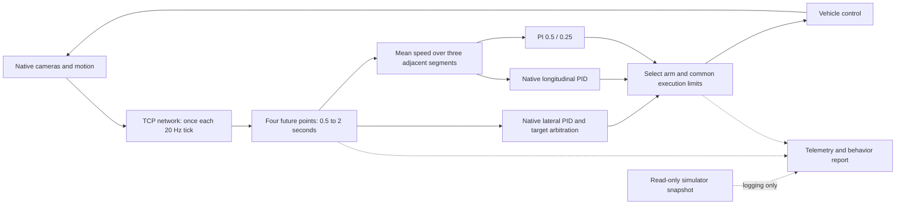

# Actual TCP controller experiments

Use this when comparing longitudinal execution of the real TCP checkpoint. The [route-oracle controller](b2d-controller.md) and its `tcp` preset are separate diagnostics. `b2d_tcp_comparison_agent.py` subclasses the visual wrapper around the installed official TCP agent, runs the actual network once per inference tick, and retains native lateral PID and navigation-target arbitration.

The current experiment is explicitly optional. Its two arms both remove the official final low-speed throttle cap and brake binarization. They are not unmodified official leaderboard baselines, and a difference from historical official TCP timings cannot be attributed to PI.

| Arm | Prediction and steering | Longitudinal output | Final envelope |
|---|---|---|---|
| `native_common` | Native TCP, 20 Hz | Native speed PID and native brake rule | throttle [0,.75], brake [0,1], mutually exclusive |
| `pi_common` | Same implementation, weights and cadence | Conditional PI, Kp=.5, Ki=.25 | Same envelope |

Both native PID and PI advance on each valid inference tick. The selected arm drives the vehicle; the other is a shadow calculation, not a second simulated vehicle. Closed-loop actions change later observations and predictions, so an entire pair does not share identical planner outputs or NPC states.



The native prediction is four `[forward,right]` points at +.5/+1/+1.5/+2 s. Desired speed is the mean of the three adjacent-point distances divided by .5 s; no origin-to-first-point segment is added. Native PID swaps coordinates in a CPU NumPy view, so the wrapper copies raw predictions and target before calling it. The physical training-label origin remains unconfirmed. No points are extrapolated into the route-oracle controller's five-second horizon, and simulator route geometry does not repair model predictions.

`PLANNER_TYPE=only_traj` is required. Other native control branches are not interchangeable with this comparison. The existing model cameras, JPEG/crop/resize preprocessing, navigation input and 20 Hz inference cadence remain shared. The first initialization tick retains the native neutral control. Checkpoint loading must match all keys strictly.

**Measured resting-speed correction.** The first actual campaign revealed speedometer values around −0.00005 m/s at rest. Treating every negative value as reverse introduced unwanted braking. The comparison helper now maps finite `abs(raw_speed)<.01 m/s` to zero for its effective speed and reverse check. It logs both raw and effective speed; the model and native PID continue consuming native raw speed. Reverse at or below −.01 m/s still faults. This boundary applies to both arms. Nonfinite predictions or required motion data skip/reset native PID histories and trigger a common brake; the next valid frame can recover. These explicit common input policies must be distinguished from the longitudinal-controller intervention.

The old campaign and its source remain preserved. Recorded-input replay changed 456 reverse faults to three over 1299 captured prediction ticks and released 235 native restart commands. This verifies the guard correction, not obstacle clearance or driving recovery. The complete six-case comparison is repeated in a new directory after the fix; earlier completed cases are not spliced into the revised experiment.

Run on the configured Tokyo host, from the repository root:

```bash
scripts/tmux_run.sh tcp-comparison-new env \
  DATA_DIR=/data DISPLAY=:0 \
  /data/envs/carla/bin/python scripts/b2d_tcp_campaign.py \
  --out /data/runs/b2d/tcp-controller/a-new-exclusive-directory \
  --server-index 110 \
  --protocol todos/2026-09-23-tcp-controller/protocol-v2.md
```

Choose an unused server index and a new output directory. The campaign owns a single CARLA process across paired routes and uses evaluator world resets; confirmed crashes use the existing runner recovery. It selects 24211, 1711 and 1773, each followed immediately by the other arm, with TM seed 0. These three centerlines are nearly straight and do not validate road-corner performance. Each attempt has a 600 s wall limit; infrastructure retries remain separate attempts and add wall cost. The official simulator-tick limit is still active. Frozen source/config hashes are checked before each group, so do not edit those files during the run.

The controller process uses `/data/envs/b2d-tcp`, while the campaign uses the CARLA environment. The latter also needs `tqdm` and TensorBoard's event writer. The wrapper records actual optimization switches, checkpoint key compatibility and parameter count. The pinned checkpoint is `/data/models/bench2drive/tcp/tcp_b2d.ckpt`, SHA256 `e6573ff1f8ea910b9a53eddfb68f69cac469bf5bfa253a516578f6126110b4fe`, with 26,593,444 network parameters. Keep environment freezes with each experiment.

Each attempt preserves `tcp-control.jsonl`, `tcp-setup.json`, `tcp-route-reference.json`, official results, criterion event frames and runner logs. Telemetry includes raw sensors and frame IDs, model-input image hashes, raw predictions, metadata, both control alternatives, official-tail and selected commands, integral state, independent world motion, previously applied control and nearby actors. VehicleControl stores values as float32; small differences from Python PID values must be assessed with that storage precision, not classified as lateral changes. Numeric traces support plots; RGB streams/video are not automatically recorded.

Use the [shared experiment directory](../todos/2026-09-23-tcp-controller/README.md), [revised protocol](../todos/2026-09-23-tcp-controller/protocol-v2.md) and preserved analysis editions for results. Full-route completion/safety, speed error, physical acceleration/jerk and turning behavior are separate observations. Long stalls can lower full-route averages, so retain per-phase, moving and contact-prefix diagnostics without replacing failed whole-route results. A low Driving Score is not required for uncomfortable motion, and a high score does not prove comfort.

The revised six-case experiment is complete. Both arms completed 24211 and 1711 without collisions; both failed 1773 at 34.88% with one vehicle collision and the 4000-tick limit. PI reached its first contact earlier (21.05 versus 36.20 seconds from the first controlled tick) and remained at low speed longer. Route-equal full-run speed RMS was 2.692664 → 2.458681 m/s, longitudinal absolute-acceleration p95 6.055712 → 3.650913 m/s², and absolute-jerk p95 84.469272 → 45.054934 m/s³. Those averages satisfy the preregistered numerical signal for further investigation, but stalled time and differing model/world trajectories prevent a claim of overall driving or safety improvement. The first two completed pairs give the cleaner local behavior signal; neither arm cleared the obstacle case. The experiment does not qualify a default controller or a leaderboard score.

Last verified: 2026-09-23
