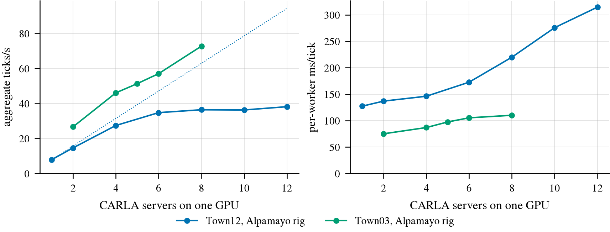
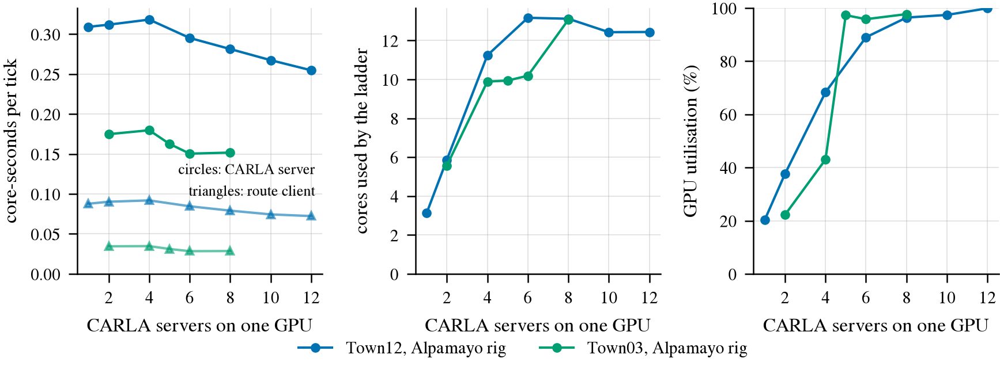

# Bench2Drive closed-loop cost

Read this when you need to know what a Bench2Drive closed-loop evaluation costs in wall-clock time,
where that time goes, or how to run one without losing the run to a crash.
[carla.md](carla.md) covers getting a CARLA server up at all; this doc is about the loop.

Several distinct experiments are recorded here. The earlier GPU-box full220 run took **3.11 hours**
at eight workers with real Qwen3-VL feature extraction and a stand-in driver; 209 evaluator
processes finished, which did not mean 209 driving successes. The later Tokyo controller
Dev10 seed0 diagnostic logged **17.91 minutes through the completion marker for three sets
of ten routes**, with no model inference. Hardware, driver, camera schedule and route mix differ, so these are not a speedup pair.

## Harness cost and layout on the five-GPU box (2026-09-25)

Measured on the current box (5 RTX PRO 6000 96 GB, cgroup 125 cores, 600 GB RAM) with our launch path
(`b2d_run.Server`: `-RenderOffScreen -quality-level=Epic -graphicsadapter=<gpu>`, then `b2d_route.py` with
leaderboard + scenario_runner + traffic manager in the route process), 20 Hz synchronous mode.
[Working notes, method and every table](../todos/2026-09-25-closed-loop-infra-acceptance/profiling.md);
per-rung numbers in `research/results/infra-acceptance/profiling/rungs.csv`.

**Rig.** Unless stated, the Alpamayo exam rig through the real exam agent (`b2d_zeroshot_agent.py` with
`"replay": "route"`, i.e. no model: 4 cameras of 1368-1392 x 784-792 plus one 608 x 352 at 10 Hz, `--decimate 2`,
`--no-spectator`). **Work.** `scripts/b2d_scale.py` runs the *same* route on every worker for 1200 ticks and
measures only the steady window in which every worker is ticking (no load, no teardown); servers are added
rung by rung on one GPU. **CPU budget.** Our processes pinned to 45 CPUs of the GPU's NUMA node.

### Per server

| Town12 (route 1773), 1 server | value |
|---|---:|
| ms/tick | 127 (7.9 ticks/s, 0.39x real time) |
| CarlaUE4 server | 2.4 cores, 4.2 GB RSS, ~374 threads |
| route client (leaderboard + scenario tree + TM + agent) | 0.7 cores, 3.0 GB RSS, ~215 threads |
| VRAM | ~5.1 GB (Town03 ~5.3-6 GB) |
| tick split | `world.tick` 95 ms, scenario tree 20.5 ms, agent 9 ms |
| route setup (load_world + scenario build) | 56 s at 1 server, 92 s at 12 (Town03: 14-28 s) |

CPU per simulated tick is roughly constant across load: **~0.33 core-seconds per Town12 tick** (server 0.26-0.32,
client 0.07-0.09) and **~0.18 on Town03** (server 0.15-0.18, client 0.03). Cores per worker therefore fall as a
GPU gets crowded (each worker ticks slower), and the number to budget is cores per aggregate tick rate.

### Servers per GPU



Left: aggregate ticks/s (dotted: linear from one server); right: per-worker ms/tick. Town12 flattens at six
servers; Town03 is still climbing at eight.

| Servers on one GPU | 1 | 2 | 4 | 6 | 8 | 10 | 12 |
|---|---:|---:|---:|---:|---:|---:|---:|
| Town12 aggregate ticks/s | 7.9 | 14.6 | 27.4 | **34.8** | 36.4 | 36.3 | 38.2 |
| Town12 per-worker ms/tick | 127 | 137 | 146 | 173 | 220 | 276 | 315 |
| Town12 GPU utilisation | 20% | 38% | 68% | 89% | 96% | 97% | 100% |
| Town12 cores used (ours) | 3.1 | 5.9 | 11.2 | 13.2 | 13.1 | 12.4 | 12.4 |
| Town03 aggregate ticks/s | - | 26.7 | 46.1 | 51.3 (5) / 57.0 (6) | 72.7 | - | - |
| Town03 per-worker ms/tick | - | 75 | 87 | 97 / 105 | 110 | - | - |

(Town03 at 1 server, and at 12 and 16, lost their routes to the failures described below; the 5- and 6-server
points are rungs of 6 and 12 measured on the workers that survived setup. Background load was heavy during the
Town03 rungs, 55-88 cores of other jobs.)



Left: core-seconds per simulated tick, flat in N; middle: cores our processes used; right: GPU utilisation.

**The binding resource per card is the GPU (rendering), not the CPU.** On Town12 six servers reach 89% GPU
utilisation and 4.4x the single-server rate; eight to twelve add under 10% while each worker gets 1.3-1.8x
slower. Our processes never used more than 13 of their 45 cores and the cgroup was not throttled. This
contradicts the earlier "CPU is usually the binding constraint for CARLA" (docs/long-runs.md), which came from
the old 25-core container and from rigs rendered every fourth tick; on this box the card saturates first.

### Recommended layout

- **Six servers per GPU** for exams that are mostly Town12/Town13 (69% of routes, 83% of wall), with a
  camera rig like Alpamayo's. Small towns would take eight or more, but they are 17% of the wall.
- **Budget 2.5 cores per worker** (about 15 per GPU at the knee; ~12 are used, the rest is headroom for route
  setup, which is CPU-heavy). For small towns budget ~3 cores per worker at eight per GPU.
- **Shard over GPUs before stacking on one**: one `b2d_run.py` per card (`--gpu-rank`, own `--server-index`
  block, shared `--out`).
- **Whole box**: 5 x 6 = 30 workers, ~75 cores, ~150 GB VRAM, ~220 GB RSS - which only fits under the thread
  cap below with `--client-threads 8`.
- **Run with `--client-threads 8`.** It is what lets 30 workers fit under the container's thread cap (next
  subsection); it changes neither CPU nor tick rate.
- Machine-readable, as logged in gpu-plan.md: `servers_per_gpu=6 cores_per_server=2.5 threads_per_server=650
  (450 with --client-threads 8) max_servers_box=30`.
- **Not measured: splitting across cards.** No second card was idle; the expectation that cards add linearly
  (they share only CPU, memory bandwidth and the thread cap, and five cards at the knee need ~60 cores) is an
  inference. `scripts/infra_scale.sh x2` is the test.

### The container's thread cap is a hard ceiling on workers

`/sys/fs/cgroup/pids.max` is **20480** threads for the whole container, and CARLA is thread-hungry: a server
has ~430 threads unpinned (374 at a 45-CPU affinity, 261 at 8 CPUs), and each route client ~215, because
`carla.Client(host, port)` defaults to `worker_threads=0`, one worker per *host* hardware thread (208 here).
During the Town03 rungs the container reached 17.9k threads with 21 servers from three jobs, `pids.events`
counted 12 hits of the limit, and six of twelve routes in one rung died at `carla.Client()` with
`RuntimeError: Resource temporarily unavailable` (pthread EAGAIN). At ~650 threads per worker, 30 workers
plus the box's other jobs do not fit. `--client-threads N` (b2d_run/b2d_route) passes `worker_threads=N`;
at 8 a route client has ~16 threads.

### Failures seen while measuring

- **`GameThread timed out waiting for RenderThread after 60.00 secs`, then Signal 11**, during route setup,
  before the first tick: 14 of our 91 server starts on 2026-09-25, 2 of the controller arms', and 19 on
  2026-09-23 (lateral-v2 runs). Not a port conflict (no `bind` line), not the thread cap (`pids.events` did not
  move across two of them), and not exclusive to a crowded GPU (one happened with a single server on an idle
  GPU 4); it came while 20-29 CARLA servers ran on the box. Cause open. It costs a retry of 60-90 s, not a
  half-driven route.
- **Our server ports sit inside the kernel's ephemeral range.** `ip_local_port_range` is 32768-60999, so every
  RPC port of index >= 616 (2000 + 50i) and every TM port of index >= 496 can be held by an outgoing
  connection; CARLA then dies at startup with `bind: Address already in use` / Signal 11 (hit once at index
  780). `b2d_run.port_free` only checks for a listener. Prefer server indices below 490, or bind-test first
  (`b2d_scale.bindable`).

### Optimisations, and whether they are equivalent

CARLA is not bitwise reproducible here: the same configuration run twice differs from the first camera frame
on (md5), and the ego ends 1.4-3.4 m apart after 400 ticks. So an option is judged equivalent when its runs
fall inside the spread of two identical baselines, and a semantic change is checked directly.

After 17:00 CST the box was saturated by other CARLA jobs, so options were compared by concurrent A/B
(`scripts/infra_ab.sh`: two drivers on one GPU at the same time, 3 servers each, arm B with the option), which
gives both arms the same background. `research/results/infra-acceptance/profiling/ab.csv` has the rows.

| Option | Equivalence | Cost (concurrent A/B, per-worker ms/tick) | Verdict |
|---|---|---|---|
| `--client-threads 8` | ego pose within 0.06 m of baseline after 400 ticks; two identical baselines differ by 0.41 m | 263 (n=3) vs 279 (n=1); client threads 216 -> 16, client RSS 2.7 -> 1.2 GB, client CPU unchanged | **take** |
| `--cache-lights`, fixed | street-light rule: 0 mismatches (the first cache: 1633 of 2699 lights wrong every check); pose and thumbnails within the baseline spread | Town13 route 3561: 198 (n=3) vs 200 (n=2); scenario tree 20 vs 23 ms | equivalent now, no gain; leave off |
| `--server-args=-ResX=64 -ResY=64` (off-screen viewport) | thumbnails and pose within the baseline spread | Town12: 269 vs 266 (n=2 each) | no gain; leave off |

The scenario tree on these routes is ~20 ms of a 150-250 ms tick with a driver that completes its route; the
55.9 ms Town13 tree of the full220 round came from a stand-in that sat in 4000-tick routes. The Python side of
the route client costs 0.07-0.09 core-seconds per tick and is not on the critical path; no profiler run was
needed to rule it out (`scripts/pyspy_python.sh` is ready if that changes).

Last verified: 2026-09-25


## Tokyo controller diagnostic: complete Dev10 seed0, 2026-09-22

Source: `/data/runs/b2d/controller/dev10/`, including every `attempt.json`, `route_result.json`,
`results.json`, group `events.jsonl` and campaign `events.jsonl`/`manifest.json`.
[Article notes and complete result tables](../todos/2026-09-22-b2d-controller/article-notes.md)
explain controller validation and attribution; failure evidence (GPU box: `$DATA_DIR/runs/b2d/controller/git-offload-v1/todos/2026-09-22-b2d-controller/results/failure-analysis.json`)
retains frame-level collision, motion and trajectory evidence.

This is **Tokyo, one physical RTX 3090 GPU 1**, UUID
`GPU-b90dd90e-394b-7800-f23f-5892a8e3d0f1`, one windowed Epic server, stock CARLA 0.9.15,
Bench2Drive 0.0.4 `7ec25d1c9f7522d923ce5f3420986cef1cb2d956`, Python 3.8.20,
`policy=none`, front3 at 800×450, cameras/route plans at 5 Hz, motion/control at 20 Hz.
A dense-route adapter supplies nominal 8 m/s trajectories without avoidance or yielding.
The three presets share the frozen controller integration at `18571c0`; they are controller
adaptations, rather than executions of complete vendor agents or learned checkpoints.

| Preset | Official driving completion | All 10 routes: min / median / max ticks | Completed 9: min / median / max ticks | Failed 1: min / median / max ticks | Final 10 attempt wall (s) | Extra failed-attempt wall (s) | Group wall (s) |
|---|---|---|---|---|---:|---:|---:|
| CARLA | 9/10 | 253 / 405 / 4000 | 253 / 395 / 3868 | 4000 / 4000 / 4000 | 339.1 | 0 | 342.6 |
| TCP | 9/10 | 254 / 432 / 4000 | 254 / 392 / 3881 | 4000 / 4000 / 4000 | 345.9 | 22.0 | 378.6 |
| pursuit | 9/10 | 256 / 401.5 / 4000 | 256 / 397 / 3871 | 4000 / 4000 / 4000 | 342.0 | 0 | 345.3 |

A finalized attempt can contain a driving failure: route 25424 reaches the upstream 4000-tick
`TickRuntime` limit in all three presets, at 47.26%, 49.14%, 47.26% completion respectively.
CLI `max_ticks=0` disables an additional harness cap, not that upstream limit. Route 2091 does
complete, but only after a vehicle collision and roughly 178–179 seconds of very low progress.
The other eight completed routes span 253–697 ticks across presets. Thus the old **600–1200
prediction was neither a reliable lower bound nor a bound on collision-dominated routes**:
seven routes per preset are below 600, one lies within the range, and two exceed 1200.
Do not interpret an early driving failure as faster successful evaluation.

### Measured cost decomposition

Use `T_attempt = T_setup + T_ticks + T_cleanup`, then add server readiness/restarts and runner
orchestration to obtain campaign wall. Current artifacts do not isolate setup from cleanup;
the residual below also contains the first 20 unprofiled ticks per finalized attempt. It must
not be relabelled as a measured server startup cost.

| Preset | Profiled ticks (first 20 per attempt omitted) | Weighted profiled ms/tick | Profiled loop wall (s) | Final-attempt remainder (s) |
|---|---:|---:|---:|---:|
| CARLA | 10,903 | 12.345 | 134.595 | 204.505 |
| TCP | 10,989 | 12.760 | 140.222 | 205.678 |
| pursuit | 10,905 | 12.337 | 134.536 | 207.464 |

Profiled loop wall is the sum of `ticks_used × total_ms_mean / 1000`, using each route's own
profile. Its total is **409.354 s**. Finalized-attempt wall totals **1027.0 s**, leaving
**617.646 s** of setup/cleanup, unprofiled warmup and untimed work. As a second boundary,
official `meta.duration_system` totals 454.163 s; the difference from profiled loop time is not
an independently measured initialization phase. All attempt values are saved to 0.1 s and
phase means are rounded, so derived residuals are approximate.

The **1074.650 s** from manifest start through the campaign completion event breaks down as
follows. The final `server.stop()` runs after that event and has no separate timing in this
snapshot; its cost is not included in this interval:

- Finalized attempts: 1027.0 s, including all three 25424 driving failures.
- TCP 27494's first, infrastructure-failed attempt: 22.0 s; its successful retry's 7.9 s is
  already included in the finalized-attempt total.
- Manifest start to first route group: 7.088 s, covering initial server readiness and preflight.
- Crash restart event to retry start: 7.008 s.
- Remaining runner/inter-group/report overhead and rounding: about 11.553 s.

The first server was reused across the CARLA group and into TCP. It crashed with `Signal 11`
on **the 18th served attempt**, TCP route 27494 in Town04 (`server_age_routes=17`, approximately
665 s old), and the runner moved from server index 74 to 75 before retrying. The replacement
also served the pursuit group. This is evidence that process reuse works across many routes
and that recovery cost remains necessary; one crash does not establish an 18-route lifetime
or a recycling interval. The process-age association alone does not establish the crash cause.

These numbers include no real policy inference, use one Tokyo 3090 and include very long
collision dwell periods with little motion. They cannot replace the older GPU-box model
measurements, establish a controller-only speed gain, or justify a direct Dev10×22 full220
forecast. Such a forecast needs a measured map/scenario mix, the intended planner, retry
assumptions and complete driving outcomes. Seed1/holdout confirmation is recorded separately;
this section remains the seed0 cost snapshot.

## How these numbers were made

The earlier GPU-box measurements below run the Bench2Drive 0.0.4 leaderboard on routes from
`bench2drive220.xml`. The Tokyo section above uses the original Dev10 subset. Nothing in the
third-party checkout is edited; the instrumentation and every optimisation is a monkeypatch behind a flag (`scripts/b2d_hooks.py`), so the unoptimised path stays reproducible
and any measurement can be re-run against it.

| Script | What it is |
|---|---|
| `scripts/b2d_route.py` | one route, one process, per-phase timers, optional `--cprofile` |
| `scripts/b2d_agent.py` | the stand-in policy: camera rig, inference cost, control rate, overlap |
| `scripts/b2d_hooks.py` | the instrumented tick loop and the optimisation flags |
| `scripts/b2d_run.py` | many routes: server pool, watchdog, retries, resume, summary |
| `scripts/b2d_sweep.py` | one route under each configuration, printing the comparison table |
| `scripts/b2d_policy_server.py` | real frozen features (DINOv2 / Qwen3-VL) in the project's 3.11 env |
| `scripts/b2d_report.py` | read-only: a run's cost, reliability and server-age curve **per town** |

The tick loop is timed by a line-for-line copy of `ScenarioManager._tick_scenario` carrying a
`perf_counter` around each phase. The copy is guarded by the md5 of the original source, so if
Bench2Drive changes the loop the run aborts instead of profiling something that no longer matches.
Image deserialisation is timed inside the CARLA client worker thread where it actually happens.

Unless stated: route 24240 (Town10HD), 300 ticks after 20 warmup ticks, 20 Hz synchronous,
`-quality-level=Epic`, one CARLA instance, an otherwise idle box. **The 220-route round and the
Large Map ladder are the exceptions and say so where they appear: they ran on a shared card and are
not comparable with the idle-box tables.**

`scripts/b2d_report.py` is the read-only reporter that joins a run's per-attempt records back to
the town in the route XML; every per-town table below comes from it.

**Noise band: the same configuration measured three times gave 158.8, 170.6 and 170.4 ms per tick,
a spread of 7%.** Nothing below about 8% in the tables below is a result.

## The profile: where a tick goes

Three cameras at 1600x900 (our planner's rig), no policy in the loop. Percentages are of the
158-170 ms tick.

| Phase | ms/tick | share | what it is | how measured |
|---|---:|---:|---|---|
| waiting for sensor data | 125-135 | 79% | `SensorInterface.get_data` blocking until all three frames for this tick have arrived from the server | timer inside the agent's `__call__` |
| scenario tree | 24-26 | 15% | `scenario_tree.tick_once()`: py_trees behaviours and criteria | timer around `tick_once` |
| `world.tick()` | 7-9 | 5% | the synchronous step itself, up to the server acknowledging the frame | timer around `world.tick` |
| image deserialise + copy | 10-13 | (concurrent) | `np.frombuffer` + `copy.deepcopy` in the client's worker threads, summed over three cameras | timer inside the patched `_parse_image_cb` |
| `CarlaDataProvider.on_carla_tick` | 0.35 | 0.2% | actor cache update | timer |
| `apply_control`, snapshot, spectator | 0.08 | 0.05% | three RPCs | timers |

The copy is concurrent with the wait, which is why the column does not add up: it happens in a
CARLA client thread while the main thread is blocked.

**Read it as: four fifths of a tick is one blocking wait for camera frames, and the client is
almost idle for it.** That is the whole story of the closed loop's cost.

## Cameras cost per sensor, not per pixel

| Rig | Resolution | ms/tick | sensor wait | MiB/300 ticks | real time |
|---|---|---:|---:|---:|---:|
| no cameras | - | 29.1 | 0.4 | 0 | 1.72x |
| 1 camera | 1600x900 | 92.4 | 58.7 | 1703 | 0.54x |
| 3 cameras (ours) | 1600x900 | 158.3 | 128.0 | 5109 | 0.32x |
| 6 cameras (UniAD/VAD) | 1600x900 | 263.3 | 227.1 | 10217 | 0.19x |
| 3 cameras | 800x450 | 150.9 | 117.5 | 1277 | 0.33x |
| 3 cameras | 400x225 | 153.4 | 120.3 | 319 | 0.33x |

Two things follow, and the second one is the useful one.

**Each camera costs about 33 ms of wall clock per tick, and the first one costs 63.** Six cameras
are a 0.19x simulation before anything thinks.

**Resolution is worth nothing. A sixteenth of the pixels is 3% faster** (153.4 vs 158.3, inside the
noise band), while the bytes crossing the socket fall by 16x (5109 -> 319 MiB). So the cost is not
fill rate, not the wire and not the Python side: it is a fixed per-sensor, per-frame cost inside
CARLA - a render pass and a GPU readback per camera per tick, whose latency does not care how big
the image is. This matches what the feasibility run saw from the other side (`carla.md`: four times
fewer pixels bought 9%), measured here in a loop that actually consumes the frames.

The consequence is the one lever that works: **you cannot make a camera frame cheaper, so render
fewer of them.**

## What paid, what did not

Each change measured against its own baseline on the same server, same route, same tick budget.

| Change | Before | After | Effect | Verdict |
|---|---:|---:|---|---|
| run the policy every 2nd tick (`--decimate 2`) | 170.6 | 96.8 | **1.76x** | take |
| every 4th tick (`--decimate 4`) | 170.6 | 80.5 | **2.12x** | take |
| every 10th tick (`--decimate 10`) | 170.6 | 50.8 | **3.36x** | take if the policy can |
| render at the model's input size (800x450 vs 1600x900) | 80.5 | 62.3 | 1.29x, and 2.3x off the policy | **take, largest single win** |
| `np.frombuffer(...).copy()` instead of `copy.deepcopy` | 158.3 | 169.0 | none | reject |
| no copy at all: hand out a view of the CARLA buffer | 158.3 | 165.7 | none in wall clock; 12.4 ms -> 0.13 ms of CPU | take for CPU, not for speed |
| stop moving the spectator camera (2 RPCs/tick) | 158.3 | 165.9 | none (the RPCs cost 0.06 ms) | reject |
| cache the street lights (see below; that cache was not equivalent, fixed 2026-09-25) | 157.9 | 193.4 | tree 25.0 -> 7.8 ms, wall clock worse | void, re-measured below |
| overlap inference with simulation | 167.4 | 165.1 | hides all of a 129 ms policy | take |

### Decimation only works after fixing a leaderboard bug

Running the policy every Nth tick is worth nothing on its own: the cameras still render 20 times a
second and the frames still arrive. Measured, `--decimate 2/4/10` moved exactly the same 5109 MiB
as every tick and did not change the wall clock at all - **the wait simply moved out of the sensor
queue and into the next `world.tick()`**, which is itself a good demonstration that the loop is
paced by the server rather than by anything Python does.

The cause is `AgentWrapper._preprocess_sensor_spec` (leaderboard), which builds each sensor's
blueprint attributes from a hard-coded whitelist per sensor type. `sensor_tick` is not in that
whitelist for any sensor, so an agent asking for its cameras at 5 Hz is silently given 20 Hz. With
that one attribute passed through (`b2d_hooks._patch_sensor_tick`), the bytes fall exactly as
expected (5109 -> 2554 -> 1285 -> 511 MiB) and so does the time.

Decimation is a change to the agent, not to the evaluation: the simulation still steps at 20 Hz,
the scenario logic still runs every tick and control is still applied every tick. What changes is
that the policy sees the world at its own control rate, which is what it does in a vehicle.

### Rendering at the model's input size is free on one side and large on the other

Because CARLA's per-camera cost does not depend on resolution, asking for 800x450 frames instead of
1600x900 costs the simulator nothing measurable. It costs the policy a great deal less, because the
resize disappears:

| Policy | Frames at 1600x900 | Frames at the model's size | of which forward |
|---|---:|---:|---:|
| Qwen3-VL-4B, 3 cameras, 800 px, layer 18 | 139.0 ms | **59.9 ms** | 38.5 ms |
| DINOv2-base, 1 camera | 21.9 ms | **5.3 ms** | 3.4 ms |

Same tokens, same forward, same features - the difference is entirely the PIL resize of frames that
never needed to be that big. Note what this says about our own published latencies: the 127-216
ms/frame in [waymo-e2e.md](waymo-e2e.md) is offline throughput, with preprocessing hidden in
DataLoader workers. In a closed loop the preprocessing is on the critical path and is **70% of the
latency** at 1600x900 input, 85% for DINOv2.

The caveat to state in any paper: a frame rendered at 800x450 is not the same image as a 1600x900
frame downsampled to 800x450 (no box filter, different aliasing). Train and evaluate on the same
one.

### Why a compiled helper is not the answer

`--cprofile` on the optimised configuration puts one function at the top of the whole run:
`RouteLightsBehavior._turn_close_lights_on` in scenario_runner, **5.3 s of a 36.8 s route, 17.8 ms
of a 71 ms tick, 14.5% of total wall clock** and about three quarters of the scenario tree. It
re-fetches every street light in the map over RPC on every tick, measures each one's distance in a
Python loop, and re-sends `turn_on`/`turn_off` for lights already in that state; the vehicle half
asks the server for locations `CarlaDataProvider` already cached this tick.

So the hot path is one function, and what it spends its time on is RPCs for data that does not
change - which Cython would not touch. Caching it (`--cache-lights`) does exactly what it should to
the Python: **the scenario tree falls from 25.0 to 7.8 ms per tick, a 3.2x reduction.**

And the wall clock does not improve. It gets slightly worse: 157.9 -> 193.4 ms at one instance,
62.3 -> 67.6 ms in the decimated configuration. This paragraph used to read that as the removed
Python time reappearing in the blocking wait, and the cache as "semantically identical: the same
lights end up on". **The second half was wrong** (checked 2026-09-25, see "Harness cost and layout"
below): the first cache trusted each light's `is_on` when it was built, the server switches street
lights on by itself at night after that, and the cache then never switched ~1600 of Town12's 2699
lights off again. The slower wall clock measured here is at least partly a server rendering a city
full of extra lights. The cache is fixed (the first update sends the whole state) and checked
against the rule; re-measure before quoting any of the numbers in this subsection.

**Conclusion for H4: the ceiling on optimising the leaderboard's Python is zero wall-clock at one
instance.** The flag is kept because at four instances the freed CPU may be worth something, but
that is untested and should not be assumed. This is the clearest result in this document about
which optimisations are worth writing: the traditional one (compile the hot Python) was measurably
pointless here, and the two that paid were about not asking the simulator for work at all.

## With a real policy in the loop

A `time.sleep` stand-in leaves the GPU idle; the real model competes with CARLA's renderer for the
same card. Both are reported, because the difference is the point. Policy runs in a separate
process (the CARLA client wheel is Python 3.8, torch is 3.11) and is reached over a unix socket.

| Policy | Configuration | ms/tick | real-time ratio | inference visible in the tick |
|---|---|---:|---:|---:|
| none | 3 cameras, 1600x900 | 158-170 | 0.32x | - |
| 129 ms stand-in | every tick | 294.6 | 0.17x | 129.3 |
| 129 ms stand-in | decimate 4 + overlap + zero-copy | 91.9 | 0.54x | 1.5 |
| **DINOv2-base** | 1 camera, every tick, 1600x900 | 196.6 | 0.25x | 116.2 |
| **DINOv2-base** | 448x252, decimate 4, overlap | **44.5** | **1.13x** | 0.8 |
| **Qwen3-VL-4B @L18** | 3 cameras, every tick, 1600x900 | 520.9 | 0.096x | 365.2 |
| **Qwen3-VL-4B @L18** | decimate 4 + overlap + zero-copy | 85.2 | 0.59x | 9.3 |
| **Qwen3-VL-4B @L18** | + render at 800x450 | **71.1** | **0.70x** | 3.2 |

**The naive way of putting our model in the loop costs 7.3x more than the careful way** (520.9 vs
71.1 ms/tick). Three things cause the gap, in order: the policy runs at 20 Hz when it only needs
5 Hz; it blocks the simulator while it thinks instead of thinking alongside it; and it is handed
frames four times larger than its input.

Note the contention the stand-in hides. Qwen costs 139 ms standing alone on a quiet card and
365 ms/tick when it runs every tick against a CARLA server that is already using the GPU - the
`time.sleep(129)` stand-in was optimistic by 2.8x. Once the policy is decimated and overlapped,
the contention mostly disappears with it, and the stand-in and the real model agree to within 20%
(91.9 vs 85.2 ms/tick).

**A cheap backbone, done right, runs faster than real time (1.13x). Our actual model runs at 0.70x.**

## Parallelism: the ceiling is a property of the configuration, not of the box

[carla.md](carla.md) reports four instances as the operating point - 86.5 aggregate FPS against
28.2 for one - with five slower and **a sixth server segfaulting during startup**. That was measured
with one camera rendering at 1600x900 on every tick, which puts the GPU at 99% from four instances
on.

Run the optimised configuration instead (three cameras at 800x450, rendered every fourth tick, real
Qwen3-VL in the loop) and the GPU is no longer saturated, and the ceiling moves. Same routes, same
everything, only the instance count changing:

| Instances | ms/tick per instance | aggregate ticks/s | vs 4 | failures |
|---:|---:|---:|---:|---:|
| 4 | 45.8 | 87.4 | 1.00x | 0 |
| 6 | 50.2 | 119.5 | **1.37x** | 0 |
| 8 | 54.5 | 146.7 | **1.62x** | 0 |

**Six and eight instances run cleanly. The sixth server does not segfault; it segfaulted under a
saturating load.** At eight, VRAM is 59 of 96 GB, GPU utilisation about 67%, and the CPU is the
binding constraint at a load average of 23.8 against the cgroup's 25 cores - which is where the
diminishing returns come from (1.24x per-instance slowdown for 2x the instances).

Servers must still be started staggered; four launched at once cost a world-load timeout and 17%
throughput. `b2d_run.py` serialises its launches by `--stagger-s` (default 20 s).

### On a Large Map the ceiling is lower, and it is the first thing this card has bound

The table above is Town10HD. The same ladder on Town12 - the same 24 routes at every instance
count, 800 ticks each, the same optimised configuration, on a shared card:

| Instances | ms/tick per instance | aggregate ticks/s | VRAM (median) | load avg | failures |
|---:|---:|---:|---:|---:|---:|
| 4 | 84.5 | 25.3 | 42.1 GB | 17.6 | 0 |
| 6 | 84.1 | **37.7** | 54.4 GB | 23.5 | 0 |
| 8 | 102.5 | 43.5 | 72.0 GB | 23.0 | 0 |
| 10 | 101.6 | 53.4 | **83.5 GB (peak 87.4)** | **27.7 (peak 38.9)** | 1 |

Aggregate is `N x 800 / wall per route`, the throughput with every worker busy; the startup stagger
is amortised over a real round, not over 24 routes.

**The free step is four to six: the per-instance cost does not move at all** (84.5 -> 84.1) for 1.49x
the throughput. Six to eight costs 22% per instance to gain 15%.

**Ten instances is where the 96 GB card finally binds.** Each Town12 server holds about 6.3 GB, so
ten of them plus the policy server sit at 83.5 GB with peaks at 87.4; twelve do not fit. The load
average is over the cgroup's 25 cores as well. So the sentence this document used to carry - that the
card is over-provisioned for closed-loop work and a quarter of the memory would do - **is true only
for the small towns it was measured on.**

Eight is the operating point we run, not ten: ten is about 23% faster but leaves the Waymo feature
extraction sharing this card no room for its bursts.

### A server that segfaults at startup is a port problem until proven otherwise

Both startup segfaults in that ladder carried the same three lines in the server log:

```
LowLevelFatalError [File:Unknown] [Line: 136]
Exception thrown: bind: Address already in use
Signal 11 caught.
```

**CARLA does not report a busy port, it dies on it.** Both were our own: the ladder ran its steps
back to back on one port block, and the previous step's sockets were still in `TIME_WAIT`. This is
the same hazard [carla.md](carla.md) documents for the traffic manager, and it means the "sixth
server segfaults at startup" in that document is a port-reuse suspect too, not evidence about
saturation. Read the server log before concluding anything from a startup `Signal=11`.

## What a 220-route round costs, measured

**All 220 routes, eight workers, real Qwen3-VL in the loop: 11,196 s = 3.11 h**, 01:17 to 04:24 on
2026-09-22, one command, unattended, exit 0. 209 routes finished, 11 never did, 245 attempts,
633,881 ticks, 56.6 aggregate ticks/s. Worker occupancy 0.97.

One row per attempt is in `research/results/b2d/full220-results.csv` (route, town, status, wall,
ticks, the tick profile, and which server of what age ran it); `full220-summary.json` beside it is
the runner's own summary. Everything in this section is `scripts/b2d_report.py` over that run.

This replaces the extrapolation this section used to carry, which said ~1.1 h. **It was optimistic
by 2.8x**, and it was optimistic in exactly the place it flagged: it assumed Town12 and Town13
cost what Town01-10HD costs.

### Where the 3.1 hours went

Per-tick cost is each route's own tick profile with the first 20 ticks dropped; wall per route
includes the world load, the scenario build and the teardown.

| Town | Routes | ms/tick | `world_tick` | tree | ticks/route | wall/route | share of the round |
|---|---:|---:|---:|---:|---:|---:|---:|
| **Town13** | 47 | **156.8** | 94.5 | 55.9 | 2845 | 584.7 s | 33% |
| **Town12** | 104 | **106.2** | 73.9 | 29.2 | 3141 | 408.6 s | 50% |
| Town15 | 7 | 64.5 | 55.8 | 7.4 | 3635 | 258.5 s | 2% |
| Town11 | 7 | 56.3 | 33.9 | 20.9 | 3754 | 251.4 s | 2% |
| Town05 | 9 | 74.1 | 58.6 | 14.0 | 3742 | 293.6 s | 3% |
| Town10HD | 4 | 78.4 | 57.9 | 19.1 | 2681 | 233.0 s | 1% |
| Town06 | 6 | 65.5 | 52.4 | 11.7 | 3131 | 208.4 s | 1% |
| Town03 | 11 | 63.8 | 53.6 | 9.0 | 3022 | 214.0 s | 3% |
| Town07 | 5 | 62.6 | 52.3 | 9.3 | 1984 | 139.5 s | 1% |
| Town04 | 12 | 60.3 | 48.6 | 10.4 | 2892 | 184.6 s | 3% |
| Town01 | 4 | 55.8 | 44.4 | 10.5 | 1327 | 91.3 s | 0.4% |
| Town02 | 4 | 50.6 | 43.7 | 5.9 | 2042 | 129.1 s | 0.6% |

**Town12 and Town13 are 69% of the routes and 83% of the wall clock.** Nothing else in the mix
matters to the total.

### "Large Map" is the wrong predictor; Town12 and Town13 are the right one

All four of Town11, Town12, Town13 and Town15 stream tiles and are Large Maps, and that is how this
document used to group them. The measurement does not support the grouping:

| Group | ms/tick | vs the small-town mean |
|---|---:|---:|
| small towns (Town01-10HD), 55 routes | 64.3 | 1.00x |
| Town11 and Town15, 14 routes | 60.4 | **0.94x** |
| Town12, 104 routes | 106.2 | **1.65x** |
| Town13, 47 routes | 156.8 | **2.44x** |

Town11 and Town15 are Large Maps that cost nothing extra. **Say Town12 and Town13, not "Large
Maps".** Quote 1.80x only for the four together (115.5 against 64.3), and only because 151 of the
220 routes happen to be in the two expensive ones.

### What the extra cost is made of

Once the optimised configuration removes the sensor wait (0.03 ms/tick), what is left is
`world.tick()` and the scenario tree, and both grow:

- **`world_tick` carries it.** 94.5 ms on Town13 and 73.9 on Town12 against 44-59 on the small
  towns. This is the tile streaming plus the render wait that decimation pushes into the step.
- **The scenario tree is what makes Town13 worse than Town12**: 55.9 ms against 29.2 and 6-19 in
  the small towns. `RouteLightsBehavior._turn_close_lights_on` re-fetches every street light in the
  map over RPC on every tick (see the Cython section above), and Town13 has the most of them.
  **This finally makes `--cache-lights` worth re-measuring** (re-measured 2026-09-25, see "Harness cost and
  layout": after fixing it, no measurable gain on Town13 with a driver that finishes its route): it was rejected at one instance on a
  small town, where the freed Python reappeared in the blocking wait, but here it is 36% of a
  Town13 tick and the CPU is genuinely oversubscribed (load median 31.8, p90 47.0 against 25 cores).

### The comparison that still stands

| Configuration | Instances | 220 routes |
|---|---:|---:|
| Bench2Drive as shipped, our 3-camera rig, Qwen3-VL every tick at 1600x900 | 4 | **~15 h** (extrapolated) |
| optimised: 800x450, every 4th tick, overlapped, zero-copy | 8 | **3.11 h** (measured) |

Four RTX PRO 6000s divide the 3.1 h again, since routes shard cleanly.

### Three things that would move the measured number, in order

- **The stand-in completed none of the 220 routes, and that is most of the 3.1 hours.** The
  leaderboard's own records: 118 `Failed - TickRuntime` (the 4000-tick cap), 90 `Failed - Agent got
  blocked`, 1 route deviation, **zero successes**. Mean route completion **10.9%**, best route
  20.1%. Every route either ran to the cap or sat still for 60 s; none of them ended because the
  car arrived. Routes average about 105 m, roughly 330 ticks at the stand-in's 6 m/s, against a
  measured median of exactly 4000. The earlier forecast assumed 600–1200 ticks per route and
  estimated 1.0–1.5 h on that pool, with roughly 70 s per route outside the loop. Those were
  driver and retry assumptions, not a measured faster full220 round. The Tokyo Dev10 snapshot
  above exposes both much shorter routes and collision dwell well beyond that tick range. **Read 3.1 h as the cost of a driver that never arrives, not as the
  simulator's floor.**

  Part of why it never arrives is ours: `AutonomousAgent.set_global_plan` hands the agent
  `downsample_route(..., 50)`, so `_steer_to_route` aims at a sparse route and cannot take corners.
  [research/trajectory-to-control.md](../research/trajectory-to-control.md) works out what should
  replace it.
- **Ten workers instead of eight** is about 23% on Town12, and is available whenever this card is
  not shared - see the Large Map ladder above for why we did not take it here.
- ~~`--cache-lights`~~: measured 2026-09-25 (see "Harness cost and layout"); no gain, and the CPU does not bind on
  this box.

A six-camera BEV agent (UniAD, VAD) pays 263.3 ms/tick against our 158.3 at 1600x900 and adds a
lidar, so roughly double, in the other direction.

### Load conditions, which are part of the number

The card was **shared for the whole run** and the numbers are not comparable with anything measured
idle:

| | |
|---|---|
| Waymo feature extraction | ~3.4 min bursts every ~15 min, about a 23% duty cycle, on the same GPU |
| Waymo download | 32 streams, saturating the network and taking CPU |
| policy server | Qwen3-VL-4B resident, ~9.6 GB VRAM, shared by all eight workers |
| GPU utilisation | median 100%, 10th percentile 65% |
| VRAM | median 67.9 GB, p90 74.8, peak 78.8 of 96 |
| load average | median 31.8, p90 47.0, peak 72.1 against the cgroup's 25 cores |

An idle box would be meaningfully faster; we have not measured how much.

## Reliability, which is the part that decides whether any of this matters

`scripts/b2d_run.py` gives one route one process and one CARLA server, and the properties were
verified by breaking a run on purpose rather than by reading the documentation.

- **A crash costs one route.** Killing a worker's CARLA server mid-route did not disturb the other
  three workers; that worker restarted its server and retried the route.
- **The watchdog watches ticks, not the route process.** When the server was killed, the route
  process stayed perfectly alive, blocked inside an RPC with a 300 s timeout. Its liveness would
  have said everything was fine. The heartbeat the tick loop writes did not advance, and the route
  was killed and retried after 90 s.
- **It also watches the server, which is the cheap half.** A dead server means the route is over
  whatever the client thinks, and the client will otherwise sit on its RPC until `client_timeout`
  expires - in the Town12 camera crashes that was most of the five to seven minutes each one cost.
  Watching the server process turns that into one poll interval, about 5 s, on every crash. The
  heartbeat check stays for what process death cannot see: a server that is alive and wedged.
- **Resume works after a crash, not only after a clean exit.** SIGKILLing the whole runner, then
  re-running the identical command: the nine finished routes were skipped, the stale claim left by
  the dead process was stolen, and only the unfinished route was redone. A third run is a no-op.
- **Its own death is cleaned up.** A SIGKILLed runner leaves its servers and route processes
  holding the ports; recorded pids are checked against `/proc` and their process groups killed on
  the next start. Never `pkill -f`, which matches our own command line.
- **The summary is built from disk**, so a resumed run still reports what its predecessor did:
  attempts per route, repeat offenders, routes that never finished, routes skipped for a missing
  map.

Two bugs in that mechanism were only found by testing it the way it will be used, which is the
argument for doing so: the runner deadlocked on its first "already done" route (a non-reentrant
lock, reachable only on a second run), and the summary reported zero restarts for a run that had
restarted a server.

### What an unattended run actually did

44 routes, four workers, 0.71 h, unattended:

| | |
|---|---|
| routes finished | 38 of 44 on the first pass, 42 of 44 after one resume |
| restarts | 12 |
| worker time lost to hangs | about 25 min of the 2.8 worker-hours |
| routes that never finished | 24224, 24841 - **and both ran first time, unretried, on a fresh server index** |

Every failure was the same one, and it was not CARLA's: a route that is still dying holds the
traffic manager's RPC port (the TM server lives in the *client* process), the next attempt fails
with a bind error before it ticks once, and because the retry reuses the same port it then hangs
for the full watchdog timeout. Four workers lost slots this way and the routes assigned to them
were abandoned after three attempts each. The fix is two lines - take the first free TM port, and
move a failing worker to the next server index - and the two "never finished" routes then completed
on the first attempt.

**So the honest statement about stability is: in 3.5 worker-hours on the base-package towns, CARLA
itself did not crash, hang or segfault once.** Every restart in that run was caused by our own port
reuse. That is a real result, but it is a narrow one, and the full 220-route round below shows how
narrow: the later full220 run observed server-process crashes on Town12 and Town13. Those
logs establish where the process failed, not a complete attribution of the underlying cause.

### What the earlier full220 round observed: eleven routes did not finish

| | |
|---|---|
| evaluator processes finished | **209 of 220** in this run, unattended, runner exit 0 |
| routes that never finished | **11**, all Town12 or Town13 |
| attempts | 245 for 220 routes; 25 restarts |
| failed attempts | 36, **every single one `server_died_rc139`** - the server segfaulted |
| worker time lost to them | 2.17 h of 24.10 worker-hours, **9.0%** |

The eleven: `3048, 11715, 11755, 23687, 23708` on Town12 and `3785, 3800, 23670, 23695, 24041,
24071` on Town13. Failure rate by town is 5 of 104 on Town12, 6 of 47 on Town13, **0 of 69
elsewhere** in that run. Town11, Town15 and the eight small towns eventually produced an
evaluator result for every requested route; their restart costs still remain in the attempt log.

Each of the eleven was tried three times on freshly started servers and different port blocks.
The recorded process failures were `Signal=11 / CommonUnixCrashHandler` after 150–360 s of
ticking, with no logged `bind` error. This distinguishes those observations from the earlier
startup port conflict. The pattern was compared with sensor-dormancy reports in Bench2Drive
#235 and CARLA #7772, but a shared signal and route pattern do not prove an identical root cause
or exclude effects from sensor configuration, workload, agent behavior or integration.

**209/220 is the observed evaluator-completion count for that run, not a simulator or scoring
ceiling.** The same routes may behave differently on another run or configuration. Driving
completion and score must still come from the official records; missing results and retries
remain explicit. These logs do not justify assumptions about why another evaluation reports
all 220 routes.

The watchdog earned its keep here. A dead server leaves the route process blocked in an RPC with a
300 s timeout; watching the *server process* turned each of those 36 crashes into a kill within one
5 s poll instead of five minutes of nothing.

**Report the restart count and the repeat offenders with any Bench2Drive score.** Scores aggregate
over routes, so silently dropping the routes that would not finish computes a number on a selected
subset that cannot be compared with anyone else's. This run is the example: read only
`routes_finished`, and you would report a score over 38 of 44 routes chosen by which worker happened
to break.

### Recycling a server before it dies (off by default, on purpose)

`--recycle-routes N` stops and restarts a worker's server every N route attempts however healthy it
looks. It is complementary to everything above: resume handles a crash that has happened, recycling
tries to get ahead of the slow death that precedes many of them.

**It defaults to off because the interval is a measurement we have not made.** The arithmetic sets
the price but not the benefit: a recycle costs a server start plus a world load, 30-60 s, against
about four minutes per route per worker, so recycling every route is 15-25% overhead and every
fifth route is 3-5%. Whether that buys anything depends entirely on how the failure rate grows with
the number of consecutive routes one server has served. If failures cluster after some number of
routes, recycling just before it is nearly free; if the rate is flat, recycling only costs.

Every run now records the raw material for that curve: each attempt carries the server's age in
routes served and in seconds, and `summary.json` reports `by_server_age` as attempts and failures
per age bucket.

The 220-route round is the first run with enough attempts to look at, and **it does not support
recycling**:

| Server age (routes already served) | Attempts | Failed | Rate |
|---:|---:|---:|---:|
| 0 | 44 | 23 | 52% |
| 1 | 21 | 3 | 14% |
| 2-9 | 127 | 2 | 1.6% |
| 10-22 | 53 | 8 | 15% |

The 52% at age 0 is **not** a fresh-server problem, it is a selection effect and the most important
thing to understand before reading this table: a failing route moves its worker to a new server, so
every retry of a crashing route is an age-0 attempt. The eleven repeatedly failing routes contribute 33 of the
36 failures and most of them land in that bucket.

Read the flat 1.6% across ages 2-9 instead, and the 15% at 10-22 with the sample sizes attached (53
attempts, 8 failures, with route identity confounded by attempt order). This sample does not
isolate a server-age effect well enough to choose a recycling interval. Most failures cluster
on eleven routes in this run, but that does not prove independence from server age. Recycling
stays off until a controlled comparison shows a benefit after accounting for map, route, policy
and retry selection. The Tokyo seed0 crash on an 18th attempt is a separate observation, not
such a controlled comparison.

### Port slots are 50 apart

A CARLA server claims several ports above its RPC port and the traffic manager wants room of its
own, so server index *i* gets RPC `2000 + 50i` and traffic manager `8000 + 50i`, the same spacing
`scripts/carla_server.sh` uses. The 44-route run used 4, which is how two worker slots were lost to
a traffic-manager bind error.

### Multi-GPU

Route sharding, not a split simulation. Several runners can share one `--out` directory, one per
card, each with its own `--gpu-rank` and `--server-index`. A route is claimed with an `O_EXCL` lock
file before it starts, so two cards never run the same route, and `done/<id>.json` means finished on
any card. Claims are released whatever the outcome; a claim whose owner pid is dead is stolen at
once.

## What these numbers do not cover

- **The stand-in agent drives badly on purpose, and it dominates the 3.1 hours.** It completed
  none of the 209 routes with finalized official records, with mean route completion 10.9%;
  the other eleven lacked finalized results. Cost per round is tied to that driver and its
  failures. The measured 3.1 h is neither a guaranteed upper bound nor the simulator's floor.
- **The earlier GPU-box model runs measured inference cost, not model driving quality.**
  Qwen3-VL features were discarded and a stand-in supplied controls. The Tokyo controller
  section now also reports official completion, explicitly as a dense-route diagnostic.
- **The profile decomposition is one route on one map.** Route 24240 in Town10HD. The per-town
  table above is from the full round and is broad; the phase-by-phase breakdown at the top of this
  document is not.
- **`--cache-lights` was measured under contention on 2026-09-25** (no gain, section "Harness cost and layout");
  what follows is the earlier reasoning. The 220-route
  round makes it the obvious next measurement rather than a curiosity: the scenario tree is 36% of
  a Town13 tick and the CPU is oversubscribed at eight workers. Untested, do not assume.
- **No lidar or radar.** The Bench2Drive rig for UniAD/VAD adds a 64-channel lidar, which is
  another sensor on the same per-sensor cost and is not in any number here.
- **The earlier full220 run shared its GPU box with other work.** Waymo feature extraction at
  about a 23% duty cycle and a 32-stream download ran throughout that round. Its load and
  hardware differ from the Tokyo policy-none controller run; idle-box savings were not measured.
- **The Large Map ladder is Town12 only**, 24 routes at 800 ticks each. Town13 is more expensive
  per tick and holds more VRAM, so the ten-instance ceiling measured on Town12 is probably lower on
  Town13. We ran the round at eight and did not find out.
- **The policy is one process for all workers.** Inference serialises through one model on one
  card, which is the right design on one GPU but means the ladder numbers do not separate model
  latency from queueing behind other workers.
- **One round is not a failure rate.** Eleven routes failed all three attempts; the other
  requested routes eventually produced evaluator results. Whether the same eleven fail next
  time, or whether this was part of a larger susceptible set, needs repeated evaluation.

Last verified: 2026-09-22

## Tokyo frozen v4 controller comparison (2026-09-23)

The complete three-configuration, two-TM-seed Dev10 comparison selected 60 official records from 63 attempts: 49 driving-completed routes and 11 TickRuntime failures. This is a route-oracle diagnostic (`policy=none`), with 20 Hz motion/control and 5 Hz front-three cameras/route references, 800×450, windowed Epic, stock CARLA 0.9.15, and Bench2Drive 0.0.4 (`7ec25d1c9f7522d923ce5f3420986cef1cb2d956`). Rendering used Tokyo physical GPU 1. All three configurations shared the route adapter; CARLA lateral and pursuit max used PI(.5,.25), while TCP retained vendor longitudinal control.

| Group | Completed | Ticks min / median / max | Selected attempt wall | Extra infrastructure wall | Profiled ms/tick | Control p99 ms |
|---|---:|---:|---:|---:|---:|---:|
| CARLA + PI, seed0 | 9/10 | 252 / 430.5 / 4000 | 346.8 s | 0 s | 12.644 | .256 |
| TCP vendor, seed0 | 8/10 | 259 / 389.5 / 4000 | 350.3 s | 19.0 s | 12.947 | .254 |
| pursuit max + PI, seed0 | 8/10 | 255 / 432 / 4000 | 357.9 s | 0 s | 13.064 | .255 |
| CARLA + PI, seed1 | 8/10 | 252 / 430.5 / 4000 | 348.9 s | 49.1 s | 12.548 | .255 |
| TCP vendor, seed1 | 8/10 | 259 / 389.5 / 4000 | 345.5 s | 20.0 s | 12.888 | .253 |
| pursuit max + PI, seed1 | 8/10 | 255 / 432 / 4000 | 357.3 s | 0 s | 12.994 | .255 |

Manifest start to end event took **2247.413 s (37.46 min)**; final server shutdown is excluded. Selected attempts sum to 2106.7 s, and three rc139 infrastructure attempts add 88.1 s. The selected profiled loop sum is 860.017 s, computed from profiled tick counts times rounded mean tick costs. The remaining selected 1246.683 s mixes setup, cleanup, unprofiled warmup and untimed work; it is not a standalone startup measurement. Another 52.613 s outside attempts includes readiness, restarts, reports and the separate slope hold.

All failed selected routes consumed 4000 profiled ticks. Completed routes range from 252 to 3882 ticks, so a fixed short-route estimate misses collision-associated delays. There are 68142 logged control ticks, including 1200 warmup ticks excluded from the profile denominator. No neural inference cost was measured, and these numbers do not establish real TCP or full220 wall time. The candidate failed its driving acceptance conditions despite a higher mean DS.

[Reproduction helper, exact CSV and input hashes](../todos/2026-09-22-b2d-controller/results/formal-v4-cost/README.md) and [final driving report](../todos/2026-09-22-b2d-controller/final-report.md) preserve the measurement boundary. This section supplements the earlier frozen v1 measurement without relabeling its costs.

Last verified: 2026-09-23


## Tokyo actual TCP paired comparison (2026-09-23)

The revised six-case campaign used the real TCP checkpoint, three native 1600×900 cameras and 20 Hz inference/control, with one CARLA process on physical GPU 1. Manifest start through completion took **1280.562 s (21.34 minutes)**, excluding final server shutdown. All six attempts produced official results without infrastructure retries: four completed drives and two 4000-tick obstacle failures. Total telemetry was 9813 ticks and 9807 actual network forwards; each route retained its neutral initialization tick. The 9693 profiled ticks exclude the first 20 per attempt.

| Route | Native / PI ticks | Native / PI supervised attempt wall | Native / PI mean profiled loop | Native / PI mean GPU forward |
| --- | --- | --- | --- | --- |
| 24211 | 393 / 401 | 25.573 / 33.423 s | 51.538 / 57.516 ms | 4.089 / 4.540 ms |
| 1711 | 520 / 499 | 79.033 / 79.533 s | 89.709 / 89.936 ms | 4.381 / 4.423 ms |
| 1773 | 4000 / 4000 | 505.683 / 549.493 s | 118.095 / 129.479 ms | 6.555 / 7.252 ms |

Supervised attempt intervals sum to 1272.738 s, group intervals to 1273.145 s. The `attempt.json` field `wall_s` is overwritten by the evaluator's `route_result` in this runner version and totals 1267.6 s; it is not the complete supervised process interval. The steady profiled sample total is approximately 1114.416 s. Its 153.184 s difference from recorded evaluator wall includes unprofiled warmup, setup, cleanup and other untimed work, and must not be called pure startup. The two obstacle failures consume 1055.176 s of supervised attempt time; failed driving dominates this sample's cost.

The GPU-forward measurements use existing model phase instrumentation. GPU work, preprocessing, policy and sensor waiting have overlapping accounting boundaries and cannot all be added as independent costs. A single archived live GPU sample confirms both TCP and CARLA on the intended GPU; it is not full-run utilization monitoring. Both experimental arms remove the official final low-speed throttle cap, so historical official TCP route durations are not a matched PI or harness speedup baseline. These results also cannot be compared as a speedup against the no-model oracle campaigns above.

[Recompute script, exact six-row CSV and source hashes](../todos/2026-09-23-tcp-controller/results/paired-v2-cost/README.md), [driving contract and interpretation](b2d-tcp-controller.md).

Last verified: 2026-09-23
