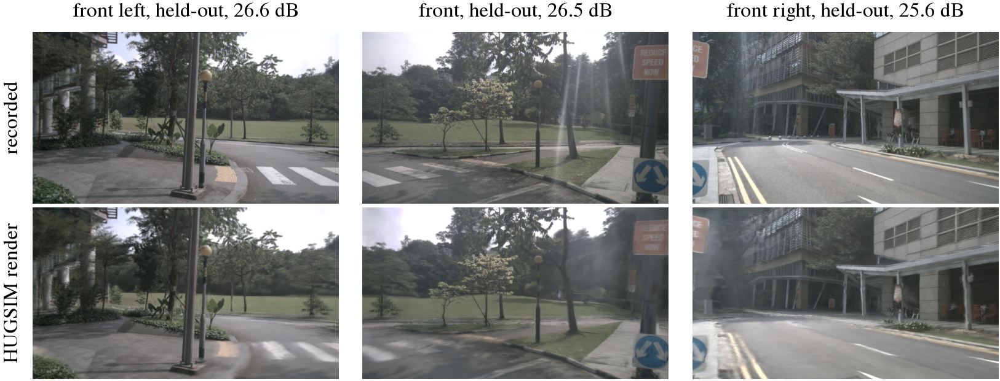
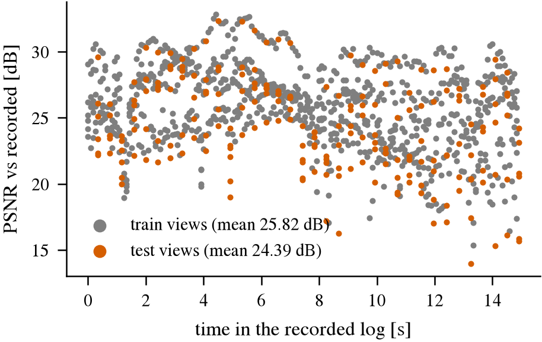
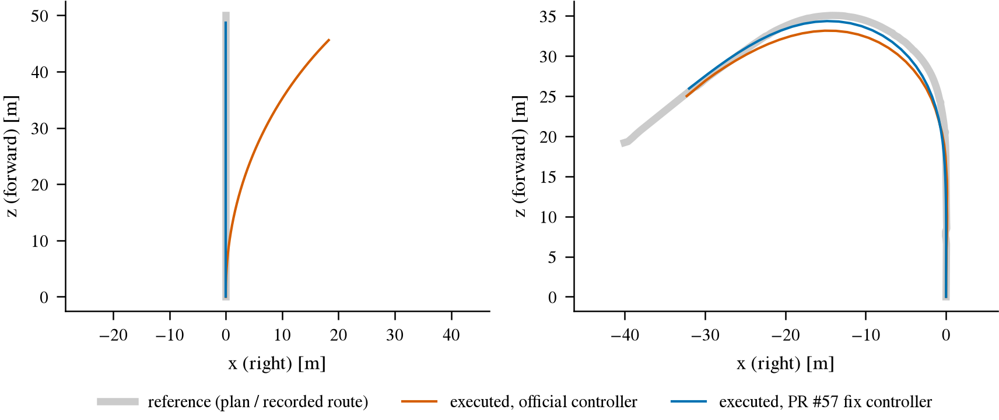

# HUGSIM

Read this when you need the HUGSIM closed-loop benchmark on the box: its data, the Blackwell install,
running a scenario, or the exact agent interface (cameras, ego state, command, plan format, actuation, HD-Score).

Sections: [data](#where-it-lives) · [install](#install-blackwell-sm_120) · [run](#run-a-scenario) ·
[smoke results](#smoke-test-2026-09-24) · [agent interface](#agent-interface) ·
[controller heading defect](#controller-heading-defect-upstream-pr-57) · [controller acceptance](#controller-acceptance-2026-09-25) ·
[HD-Score](#episode-termination-and-hd-score)

## Where it lives

`$DATA_DIR/datasets/hugsim/`, mirroring the HF repo paths (not the HF hub cache layout, so eval scripts
can address files by plain relative path):

| Path | Content | Source |
|---|---|---|
| `3DRealCar/` | vehicle 3DGS assets (330 files, `gs.pth` + `wlh.json` pairs) | `XDimLab/HUGSIM/3DRealCar` |
| `scenes/kitti360/`, `scenes/nuscenes/`, `scenes/pandaset/`, `scenes/waymo/` | reconstructed scene 3DGS assets, one per sequence | `XDimLab/HUGSIM/scenes/*` |
| `nusc_map_cache.zip` | nuScenes map cache | `XDimLab/HUGSIM` |
| `scenarios.zip` | 400+ scenario configs (yaml) | `XDimLab/HUGSIM` |
| `sample_data/data.zip` | raw *reconstruction input* of nuScenes scene-0383 (images, depth, colmap), not a simulation scene; used as ground truth for the render check | `hyzhou404/HUGSIM/sample_data` |
| `scenarios/<dataset>/*.yaml` | `scenarios.zip` unpacked (436 scenarios: kitti360 113, nuscenes 88, pandaset 127, waymo 108) | ours |
| `scenes/<dataset>/<scene>/` | a scene zip unpacked on first use by `scripts/hugsim/run_closed_loop.sh` (`scene.pth`, `dynamic_*.pth`, `cfg.yaml`, `ground_param.pkl`, `meta_data.json`) | ours |

This is the already-reconstructed, exported benchmark (`export_scene.py` output), not raw
KITTI-360/nuScenes/PandaSet/Waymo sensor data — running `closed_loop.py` needs nothing else. Raw sensor
data is only needed to reconstruct new scenes with `train.py`. See
[research/lit/research_notes/开源驾驶模型与OpenPilot打榜现状/hugsim_resources.md](../research/lit/research_notes/开源驾驶模型与OpenPilot打榜现状/hugsim_resources.md)
for the full survey (size breakdown, Blackwell/CUDA install risk, agent interface).

Total ≈ 61 GB benchmark + 2.4 GB sample data ≈ 63.4 GB.

## How to (re)fetch

`scripts/hugsim_fetch.py`, built on `jevdrive/hfdl.py` (the same parallel range-request downloader used
by `scripts/alpamayo_fetch.py`):

```bash
python scripts/hugsim_fetch.py sample_data   # ~2.4 GB, fetch first (needed for the install/port smoke test)
python scripts/hugsim_fetch.py benchmark     # ~61 GB, everything else
```

Run in tmux `jev` window `hugsim-dl`: `scripts/tmux_run.sh hugsim-dl python scripts/hugsim_fetch.py sample_data benchmark`.

Resumable at file granularity: a file already at the right size is skipped. Every LFS file is
sha256-checked against the HF API's reported oid, every non-LFS file against the git blob sha1 (see
`jevdrive/hfdl.download`); a mismatch raises instead of leaving a silently-corrupt file.

## Network

Both repos (`XDimLab/HUGSIM`, `hyzhou404/HUGSIM`) serve LFS files through Xet storage, redirected to
`cas-bridge.xethub.hf.co`. A first pass (2026-09-24, 4 parallel streams, 95 s) measured 9 MB/s on
`hf-mirror.com` direct and 8 MB/s on `proxy_on` (Clash) + `huggingface.co` -- both numbers turned out to
be a CloudFront cache hit on one already-fetched object, not a real bulk-download rate; see the finding
below.

**The Xet CAS bridge's Range (byte-serving) path stalls under load, on every route (2026-09-24).** The
original fetcher split each file into N concurrent `Range` requests against one URL
(`jevdrive.hfdl.download`, the same downloader `alpamayo_fetch.py` uses). Against real, distinct,
first-touch files this stalled: individual range chunks hit `ReadTimeoutError` / "short read" from
`cas-bridge.xethub.hf.co` past the 20 s socket timeout, then retried with exponential backoff (up to 8
attempts) -- on both `hf-mirror.com` direct and `proxy_on` + `huggingface.co`, so the CDN in front of the
Xet bridge is the bottleneck, not the route. The production run was at 3.65 GB after ~50 min (~1.3 MB/s).
A plain whole-file GET (no `Range` header) on the same objects was reliable. Measured 90-95 s sustained on
real remaining files, disk-growth ground truth (`du -sb`), no other job competing for the link:

| Config | Sustained |
|---|---:|
| `hf-mirror.com`, 1 file, 16-stream Range (old default) | 1 MB/s |
| `hf-mirror.com`, 8 files parallel x 2-stream Range each | 2 MB/s |
| `hf-mirror.com`, 8 files parallel, plain GET (no Range) | 1 MB/s (still stalls on hf-mirror) |
| `proxy_on` + `huggingface.co`, 8 files parallel, plain GET | **4-6 MB/s** |
| `proxy_on` + `huggingface.co`, 16 files parallel, plain GET | 0 MB/s (too many streams starves all of them) |
| `proxy_on` + `huggingface.co`, 8 files parallel x 2-stream Range each | 0 MB/s (Range stalls here too) |

So the fix is file-level parallelism instead of range-level: `hugsim_fetch.py` fetches `--workers 8`
(default, measured best) files at once, each with a single plain GET (`jevdrive.hfdl.download(...,
streams=1)`), routed through `proxy_on` + `huggingface.co` (the script calls `use_proxy()` itself; no
ModelScope mirror of either repo exists). Resumability is file-granularity only now (a dropped connection
re-fetches the whole file, cheap at this file size) rather than mid-file chunk resume, since chunking is
what broke.

The 4-6 MB/s above was measured against an idle link (no other box job competing); the restarted
production run, with ordinary box activity around it, sustained ~3 MB/s over a 180 s window. At 3 MB/s,
63.4 GB from empty is roughly 6 hours; the actual restart resumed from 17 GB already on disk, ETA ~4-4.5 h.

## Install (Blackwell, sm_120)

Upstream pins torch 2.4.1+cu118 through pixi, which has no sm_120 kernels. We build a uv venv instead:

| | Upstream `pixi.toml` | Ours (`$DATA_DIR/envs/hugsim`) |
|---|---|---|
| Python | 3.11.10 | 3.12.14 |
| torch / torchvision | 2.4.1+cu118 / 0.19.1 | 2.8.0+cu128 / 0.23.0 (PyPI build, arch list includes `sm_120`) |
| nvcc | from pixi | `/usr/local/cuda-12.8`, `TORCH_CUDA_ARCH_LIST=12.0`, `TCNN_CUDA_ARCHITECTURES=120` |
| open3d | 0.18 | 0.19.0 (0.18 has no cp312 wheel) |
| gsplat | `hyzhou404/HUGSIM_splat` main | same, @ 88f2a40 (gsplat 1.2.0 fork), built unchanged |
| tiny-cuda-nn | master | @ 0109538, built unchanged |
| simple-knn | `submodules/simple-knn` | same, one-line patch (`#include <cfloat>`) |
| trajdata, nuscenes-devkit | hyzhou404 forks | same forks, `--no-deps` |
| pytorch3d, unidepth, apex, kitti360Scripts, waymo reader, flow-vis | from source | **not installed**: reconstruction/training only, never imported by `closed_loop.py` |

```bash
scripts/tmux_run.sh hugsim-build scripts/hugsim/install.sh      # ~10 min if the wheels are cached; CPU only
```

`install.sh` clones HUGSIM @ 62c690d and the dependency repos at pinned commits (`$DATA_DIR/third_party/HUGSIM`,
`$DATA_DIR/third_party/hugsim_deps/`), applies `patches/hugsim/*.patch`, builds, and ends with an import check.
All four CUDA extensions run on the RTX PRO 6000 (checked with a 100k-Gaussian rasterization, a tcnn MLP and
`distCUDA2`). What the patches change and why: [patches/hugsim/README.md](../patches/hugsim/README.md). In short:
`closed_loop.py` gets our scene path and accepts our agent launcher; `simple_knn.cu` gets `<cfloat>`; three
release-vs-code mismatches that abort scenarios are fixed (actor asset path suffix `postprocess/shadow.pth`,
`ConstantPlanner(max_t=...)`, `IDM` with one waypoint left). None of them changes behaviour where upstream runs.

The official LTF client (hyzhou404/NAVSIM fork) gets its own env, `scripts/hugsim/install_ltf.sh`
(`$DATA_DIR/envs/hugsim-ltf`: our navsim1 package set, Python 3.10, torch swapped to 2.8.0+cu128; weights
`autonomousvision/navsim_baselines/ltf/ltf_seed_0.ckpt`). UniAD_SIM / VAD_SIM need the mmcv-1.x / torch-1.x stack
and are not ported.

## Run a scenario

```bash
# on the box; one process per scenario (upstream plan.py leaks agent keys across gymnasium.make calls)
scripts/tmux_run.sh hugsim-run env GPU=0 AD=jev POLICY=route \
  scripts/hugsim/run_closed_loop.sh $DATA_DIR/runs/hugsim/<tag> $DATA_DIR/datasets/hugsim/scenarios/nuscenes/scene-0383-easy-00.yaml
```

`run_closed_loop.sh` writes a base config (our paths), unpacks the scene zip on first use, runs the official
`closed_loop.py` with `--ad jev` (our pipe agent, `scripts/hugsim/agent_client.py`, policies `route` = privileged
recorded-route follower, `cv` = constant velocity straight ahead) or `--ad ltf`, and appends wall time, steps,
peak simulator VRAM, HD-Score and RC to `<tag>/runs.csv`. Per scenario it keeps `eval.json`, `video.mp4`
(2x3 camera grid), `data.pkl`, `infos.pkl`, `sim.log`, `output.txt` (agent log).
Scenarios with `load_HD_map: true` (16 of 88 nuScenes) also need trajdata's nuScenes map cache
(`nusc_map_cache.zip`, hard-coded cache location `~/.unified_data_cache`) and raw nuScenes tables; not set up yet.

Other checks: `scripts/hugsim/render_check.py` (render vs recorded images, FPS, VRAM; figures by
`scripts/hugsim/render_figs.py`) and `scripts/hugsim/lqr_heading_check.py` (controller, no rendering).

## Smoke test (2026-09-24)

GPU 0 was shared with other jobs at 97 % utilization, so the speed numbers are a lower bound.

**Rendering is correct.** The exported scene-0383 rendered at all 1080 recorded camera poses (with the recorded
pose of its one dynamic object) against the recorded images from `sample_data`: PSNR 25.8 dB on training views,
24.4 dB on HUGSIM's own held-out views (idx % 30 >= 24), 2.58 M Gaussians
([render_psnr.csv](../research/results/hugsim/render_psnr.csv), [render_summary.json](../research/results/hugsim/render_summary.json)).



Held-out views of scene-0383, recorded (top) vs rendered on our GPU (bottom). Geometry, signs and lane paint line up
pixel for pixel; the residual is 3DGS blur in thin structures and low-texture sky, not a camera or pose error.



PSNR per view over the recorded log. Held-out views sit about 1.4 dB under training views, the normal gap for a
per-scene 3DGS fit; the dip after 8 s is the turn, where views see less-covered geometry.

**Speed and memory** (scene-0383, 800x450):

| | |
|---|---|
| one view, GPU time | 18.7 ms (53.6 FPS) |
| 6-camera observation incl. GPU->CPU readback | 141 ms |
| closed loop, wall per 0.25 s sim step (trivial agent) | ~0.5 s (0.5x real time), plus ~10 s start-up |
| simulator VRAM (process, nvidia-smi) | 2.4 GB (scene-0071, no actors) to 5.9 GB (scene-0383 with 2 actors) |
| render-only torch peak | 2.6 GB |

**Closed loop** ([smoke_eval.csv](../research/results/hugsim/smoke_eval.csv),
[smoke_runs.csv](../research/results/hugsim/smoke_runs.csv)); the 4 nuScenes scenarios whose actor assets were
already downloaded; HD-Score / RC; "fixed" = with the optional PR #57 controller patch (next sections):

| scenario | LTF (official client) | LTF, fixed | route (privileged) | route, fixed | cv (straight, 1 m/s) | cv, fixed |
|---|---|---|---|---|---|---|
| scene-0071 easy-00 | 0.973 / 1.00 | 0.994 / 1.00 | 0.987 / 1.00 | 0.987 / 1.00 | 0.021 / 0.06 | 0.910 / 0.91 |
| scene-0383 easy-00 | 0.328 / 0.51 | 0.562 / 0.56 | 0.789 / 1.00 | 0.733 / 1.00 | 0.040 / 0.07 | 0.548 / 0.55 |
| scene-0383 medium-00 (1 actor) | 0.506 / 0.57 | 0.508 / 0.56 | 0.789 / 1.00 | 0.733 / 1.00 | 0.040 / 0.07 | 0.548 / 0.55 |
| scene-0383 hard-00 (2 actors) | 0.193 / 0.44 | 0.164 / 0.46 | 0.029 / 0.24 | 0.034 / 0.26 | 0.040 / 0.07 | 0.548 / 0.55 |
| mean | 0.500 | 0.557 | 0.649 | 0.622 | 0.035 | 0.639 |

This proves the chain end to end (render -> pipe -> agent -> iLQR -> bicycle -> collision checks -> HD-Score) with
the official LTF baseline on our GPU (agent adds 1.2 GB; 64-93 steps take 90-124 s, ~1.4 s/step, the LTF client
also draws a visualization every step). How each run ends: the privileged route agent completes easy/medium and
hits an actor in hard, as it should (it ignores actors). LTF completes the straight scene-0071 and leaves the route
in scene-0383's left turn ("Far from preset trajectory", RC ~0.5): the shipped LTF client always sends the
"straight" command. The cv agent dies within 17-22 steps with a background collision even on the straight
scene-0071, under the official controller only: that is the controller defect below. Four scenarios are a smoke
test, not a measurement.

## Agent interface

`closed_loop.py` starts the agent as `zsh <ad>_path <cuda_id> <output_dir>` and talks to it over two FIFOs in
`<output_dir>`. Each step the simulator writes `pickle.dumps((obs, info))` to `obs_pipe`, the agent answers
`pickle.dumps(plan)` on `plan_pipe`. `plan = None` ends the episode as an agent crash; the simulator sends the
string `'Done'` at the end. One process per scenario.

**Rate.** One step = 0.25 s (4 Hz) of simulated time; observation, plan and control all run at 4 Hz.
Episodes last at most 400 steps (100 s).

**Frames.** World = OpenCV frame of the scene's first recorded front camera: x right, y down, z forward, metres.
The ego pose *is* the front-camera pose: position `(a, h, b)` with `h` the recorded camera height of the nearest
recorded pose (~1.5 m above ground in nuScenes), yaw `theta` about +y (positive = turning right). There is no
separate rear-axle/IMU frame in the simulator; `ego_box` rewrites the same pose as x forward, y left, z up.

**Cameras.** Every dataset uses the same nuScenes-style 6-camera rig (extrinsics copied from nuScenes), 800x450
(half of nuScenes' 1600x900), rendered sequentially each step. Only intrinsics and a rig offset change by dataset
(`configs/sim/<ds>_camera.yaml`; `fovx`/`fovy` there are degrees, `info['cam_params']` gives radians):

| dataset | front fx, fy [px] | front hfov | side cams (FL/FR/BL/BR) hfov | back hfov | rig offset `cam_rect` | back cameras |
|---|---|---|---|---|---|---|
| nuScenes | 626, 626 | 65.1 deg | ~65 deg | 90.2 deg | 0.3 m down | rendered |
| PandaSet | 720, 772 (non-square) | 58.1 deg | ~58-59 deg | 80.2 deg | 0.7 m down | rendered |
| Waymo | 720, 772 (non-square) | 58.1 deg | ~58-59 deg | 82.2 deg | 0.3 m down | **zeros** |
| KITTI-360 | 626, 626 | 65.1 deg | ~65 deg | 90.2 deg | 5 deg pitch, no shift | **zeros** |

Camera positions relative to CAM_FRONT (x right, y down, z forward; yaw from forward, + right): FRONT_LEFT
(-0.50, -0.01, -0.14) m, -54.8 deg; FRONT_RIGHT (0.50, -0.03, -0.15), +58.2 deg; BACK_LEFT (-0.49, -0.07, -0.67),
-108.0 deg; BACK_RIGHT (0.46, -0.07, -0.67), +113.1 deg; BACK (-0.02, -0.09, -1.67), -178.9 deg. Each camera's
world pose is `ego @ v2c_front @ inv(v2c_cam) @ cam_rect`. For Waymo and KITTI-360 the three BACK* images,
depths and semantics are all-zero arrays of the right shape.

**`obs`** (dicts keyed by camera name): `rgb` uint8 (450, 800, 3) RGB; `semantic` uint8 (450, 800) class ids
(argmax of the Gaussians' semantic features); `depth` float32 (450, 800) rendered depth, metres.

**`info`**:

| key | meaning |
|---|---|
| `ego_pos`, `ego_rot` | world position (list of 3) and XYZ Euler angles, radians (only `ego_rot[1]`, yaw, changes) |
| `ego_velo` | speed, m/s (scalar along heading; not clipped at 0) |
| `ego_steer` | front-wheel steering angle, rad (+ = right) |
| `accelerate`, `steer_rate` | the control applied at the last step |
| `timestamp` | seconds, 0.25 per step |
| `command` | int, **0 = right, 1 = left, 2 = straight**, taken from the recorded route at the nearest recorded pose (`ground_param.pkl`); NAVSIM's order is 0 left, 1 straight, 2 right. The shipped LTF client ignores it and always sends straight |
| `ego_box` | `[x, y, z, w=1.6, l=3.0, h=1.5, yaw]`, x forward, y left, z up |
| `obj_boxes` | inserted actors, same layout |
| `cam_params` | per camera: `intrinsic` {H, W, cx, cy, fovx, fovy (rad)}, `v2c`, `l2c` (4x4) |
| `rc`, `collision` | added after each step |

No history is provided; an agent that needs past frames or ego motion keeps them itself (UniAD_SIM keeps a queue;
at 4 Hz, 2 Hz history is every second step).

**Plan (agent output).** `np.ndarray (N, 2)`, metres, in the ego frame **x right, y forward**, origin at the
current ego (front-camera) position, point k at t = 0.5 k s (k = 1..N). This is what all shipped clients send:
UniAD/VAD send their nuScenes-LiDAR-frame plans (x right, y forward) as is (6 points, 3 s); LTF converts its
x-forward/y-left poses with `[:, [1, 0]]` and a sign flip on x (8 points, 4 s); third-party harnesses (WA-JEPA,
Aether, SparseDrive bridges) do the same. Only waypoints are accepted through `closed_loop.py`; the env itself takes
`{'acc', 'steer_rate'}` but the loop always goes through `traj2control`.

**Actuation.** `traj2control` turns the plan into an iLQR reference `(forward, right, heading, v, steer)` and
nuPlan's iLQR tracker (`sim/ilqr/lqr.py`: discretization 0.5 s, wheelbase 2.7 m, |a| <= 3 m/s^2,
|steer| <= 60 deg, |steer rate| <= 0.4 rad/s, 100 iterations or 50 ms) returns the first input
`(acc, steer_rate)`. The env applies it for one 0.25 s step of a kinematic bicycle (L = Lr + Lf = 2.7 m):
`v += a dt; delta += delta_dot dt; a_pos += v sin(theta) dt; b_pos += v cos(theta) dt; theta += v tan(delta) / L dt`.
Nothing is clipped in `env.step` (`kinematic.yaml`'s +-2 m/s^2 and +-15 deg only define the gym action space).
Upstream issue #75: the tracker's 0.5 s discretization does not match the 0.25 s step.

## Controller heading defect (upstream PR #57)

`traj2control` writes the reference positions as `(forward, right)` but computes each reference heading as
`arctan2(d_forward, d_right)`, the transpose; the iLQR integrates `x += v cos(h)`, `y += v sin(h)` and so needs
`arctan2(d_right, d_forward)`. A dead-straight plan gets a reference heading of +90 deg, and a nearly straight one
swings across most of the range with millimetre lateral jitter.

We treated "our convention is wrong" as the prior and checked it: every shipped client (UniAD_SIM, VAD_SIM,
the LTF client) and every third-party harness we found emits x right / y forward, exactly as `traj2control`'s
docstring says and as our agent does; a (forward, right) plan is off by the same 67.65 deg on the upstream
thread's example. Upstream history: the Dec 2024 release used `arctan((b - prev_b) / (a - prev_a))` (same
transpose, prev never updated), PR #56 (Nov 2025) moved it to arctan2 without fixing the order, PR #57 (Nov 2025,
open, unmerged) fixes it. DrivoR's reproduction measures +8.47 HD-Score (258 non-nuScenes scenarios, p < 1e-4) and
1.8x lower per-scenario variance with the fix; WA-JEPA applies the fix on every run and notes that the published
UniAD/VAD/LTF numbers were produced with the defect.

Our evidence, same equations as the env, plans in the shipped-client convention
([lqr_heading_traj.csv](../research/results/hugsim/lqr_heading_traj.csv)):



Left: a dead-straight 5 m/s plan re-issued every step; the official controller ends 18 m to the right with 45 deg
of yaw after 10 s, the PR #57 version stays on the line. Right: our privileged route follower on scene-0383's
recorded route; with lateral feedback in the plan the official controller still cuts the turn (max 1.9 m off the
route vs 1.1 m).

In the real simulator the cv agent (straight plan every step, 1 m/s) shows the same thing: official HD 0.02-0.04,
background collision after 17-22 steps; with PR #57 it drives straight until the route bends away, HD 0.91
(scene-0071) and 0.55 (scene-0383, RC-limited). The official LTF client moves from 0.500 to 0.557 mean HD-Score
over the 4 smoke scenarios; the route agent, whose plans carry strong lateral feedback, barely moves (0.649 -> 0.622).

**Policy (before the 2026-09-25 acceptance; under review, see [controller acceptance](#controller-acceptance-2026-09-25)):**
the official controller is the default and is what every headline number uses (comparable with
published HD-Scores). We also report our models under the fixed controller as a paired secondary:
`git -C $DATA_DIR/third_party/HUGSIM apply patches/hugsim/optional/lqr-heading-fix.patch`, run, then `apply -R`.

## Controller acceptance (2026-09-25)

Each controller was fed a known-good plan: the scene's own logged ego trajectory (`jevdrive/hugsim_preset.py`, re-anchored
at the ego every step, speed ramped from the ego's speed to the logged speed at +2 / -4 m/s^2), through the same agent
path as the models (`scripts/hugsim/preset_agent.py` = `zs_agent.Agent` with the model call replaced, forward_only and
straight_stop on). The reference is an ideal tracker that moves the ego exactly along the plan
(`patches/hugsim/optional/ideal-tracker.patch`, tree `HUGSIM-zs/ideal`); collision, route and scoring code are unchanged.
Pre-registered thresholds on the static scenes: lateral error at 0.5 s median <= 0.10 m and p95 <= 0.30 m, heading p95 <= 5 deg,
per-run median cross-track to the log <= 0.3 m, end reasons as the reference, HD-Score within 0.05 (mean) / 0.15 (scene).
Held-out validation, 12 scenes (8 static, 4 with actors), all four datasets:

| controller | verdict | lateral @0.5 s median / p95 | heading p95 | HD-Score vs ideal (static mean / worst) |
|---|---|---|---|---|
| official (upstream) | fail | 0.16 / 1.18 m | 16 deg | -0.065 / -0.52 |
| fixed (PR #57) | fail | 0.04 / 0.84 m | 10 deg | -0.002 / -0.04 |
| fixed2 (PR #57 + `lqr-tracker-v2.patch`) | **pass** | 0.016 / 0.26 m | 3.4 deg | +0.006 / -0.001 |

- The official controller leaves normal curved plans by 1-2 m, grazes roadside background or hits an actor the reference
  avoids; its HD-Scores carry a controller component of -0.07 on average and up to -0.5 on a scene.
- PR #57 scores like the reference but still cuts corners by 0.3-1.5 m. Offline (`scripts/hugsim/ctrl_offline.py`, the
  env's equations without rendering; it reproduces the simulator's tracking errors) the cause is the iLQR's 0.5 s
  discretization against the simulator's 0.25 s step (upstream issue #75), then the steering-rate input cost of 10.
  The 50 ms solve cap and the 0.4 rad/s steering-rate limit never bind.
- `lqr-tracker-v2.patch` (on top of PR #57): `traj2control` resamples the plan to 0.25 s, iLQR discretization 0.25 s,
  steering-rate input cost 1, no wall-clock cap. Run it with `scripts/hugsim/zs_run.py --controller fixed2`
  (tree created by `zs_run.py setup-trees fixed2`).
- HD-Score is insensitive to tracking error by construction (every step is scored on the plan, which starts at the ego);
  tracking error is the more sensitive acceptance measure.
- The env class (`hugsim_env`) is an editable install and always comes from `$DATA_DIR/third_party/HUGSIM`, whichever tree
  runs; `traj2control` and `sim.ilqr` come from the running tree, so controller patches must live there.

Details, per-scene tables and figures: [hugsim-controllers.md](../todos/2026-09-25-closed-loop-infra-acceptance/hugsim-controllers.md).

## Episode termination and HD-Score

An episode ends at the first of: background collision (more than 100 scene Gaussian centres with opacity > 0.8 and
semantic class > 1, != 10 inside the ego box: 1.6 m wide, 3.0 m long centred on the front camera, from the camera
1.5 m down); foreground collision
(ego footprint polygon intersects an actor box); ego more than 10 m from the nearest recorded route pose;
route completion `rc >= 1`; step 400; the agent sending `None`.

`rc = (index of the nearest pose on the densified recorded route + 1) / (0.9 x route length)`, so the route counts
as complete at 90 %. RC = min(1, max over steps).

Every step is scored **on the planned trajectory**, not the executed one (`sim/utils/score_calculator.py`): the plan
is put into world coordinates with headings from consecutive points and assumed to be 0.5 s apart.

| term | per step |
|---|---|
| NC | 0 if any planned pose (3.0 x 1.6 x 1.5 m box) hits more than 100 scene points or an actor box at the matching future step of this rollout, else 1 |
| DAC | per planned pose, the 2x2 cells of the footprint must contain ground points: < 30 % -> 0, < 50 % -> 0.5 |
| TTC | the plan shifted by its own velocity x 0.5 s and x 1 s must pass NC, else 0 |
| C | plan kinematics within: lon. acc [-4.05, 2.40] m/s^2, abs(lon. jerk) <= 8.37 m/s^3, abs(yaw rate) <= 0.95 rad/s, abs(yaw acc) <= 1.93 rad/s^2 (lateral acceleration is computed as 0) |

`PDMS_t = NC * DAC * (5 TTC + 2 C) / 7`, and **HD-Score = mean_t(PDMS_t) x RC**. Consequences for our agents:
a longer plan horizon means more collision and drivable-area checks; a stopped car scores PDMS ~1 but RC ~0; plan
jitter costs comfort (and, under the official controller, tracking).

For Alpamayo 1.5 and openpilot the adapter has to: take the 6 (or front 3) 800x450 images with the intrinsics above
(openpilot: warp CAM_FRONT to its own camera model; the ego origin is the camera, ~1.5 m up, not the rear axle);
keep its own history at the model's rate; map `command` (0 right, 1 left, 2 straight) to the model's navigation
input; and send x-right/y-forward waypoints at 0.5 s spacing relative to the front camera, not to the rear axle.

## Zero-shot agents (Alpamayo 1.5, openpilot)

Code: `jevdrive/hugsim_zs.py` (geometry), `scripts/hugsim/zs_agent.py` (per-scenario agent process),
`scripts/hugsim_zs_server.py` (resident model server), `scripts/hugsim/zs_run.py` (batch runner over two private HUGSIM
trees, `official` and `fixed` = + PR #57), `scripts/hugsim/zs_exam.sh` (phases). Pre-registration, checklist and results:
[todos/2026-09-25-hugsim-exam/README.md](../todos/2026-09-25-hugsim-exam/README.md).

- **Frames at 4 Hz.** openpilot gets one rendered frame per 0.2 s context step, so its clock runs 1.25x fast and plan
  time tau is read as real time 1.25 tau (offline on comma1M: +25-38 % lateral error at 2 s vs native 20 Hz; holding each
  4 Hz frame for five 20 Hz steps instead costs +500-600 % and is unusable). Alpamayo's four 10 Hz slots take the
  nearest 4 Hz frame.
- **Plan post-processing** (all models): `forward_only` zeroes plan segments that point backwards (a "stop" that
  integrates to a small reverse track becomes a zero-length plan); `straight_stop` sends a plan whose 3 s end point is
  within 1 m of the ego straight ahead. iLQR derives reference headings from consecutive waypoints, so the millimetre
  lateral noise of a stop plan otherwise becomes headings anywhere in +-180 deg and the tracker reverses and steers a
  standing car (measured: -0.91 m/s and 0.88 rad steer on a stop plan).
- **Shadow mode** (`engage_s` past the episode end): the privileged route follower drives, the model only plans; used
  to check plan frame and sign against the driven future.
- Scene zips of the later release are prefixed with `<dataset>/`; `zs_run.py` unpacks both layouts.

Last verified: 2026-09-25
