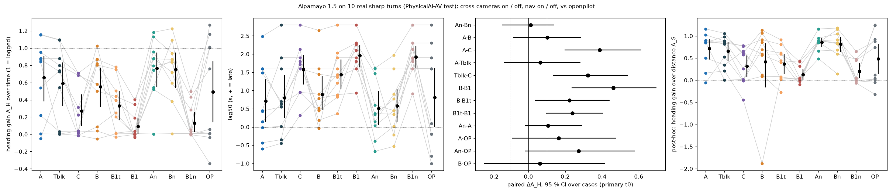

# alpamayo_turns: does Alpamayo need its cross cameras on sharp turns

status: concluded
decisions: (pending)
index: Cross cams off: dA_H +0.01 [-0.15,0.14] (nav); tele-slot drop -0.39
key: experiments/alpamayo_turns/README.md experiments/alpamayo_turns/results/pilot.md experiments/alpamayo_turns/plans/2026-10-05-prereg.md experiments/alpamayo_turns/figs/summary.png experiments/alpamayo_turns/figs/cases_bev.png experiments/alpamayo_turns/scripts/turns.py experiments/alpamayo_turns/scripts/turns_figs.py experiments/alpamayo_turns/results/effects.md jevdrive/alpamayo/data.py

**Question.** On real sharp (~90 deg, low speed) turns, does NVIDIA Alpamayo 1.5 with its own multi-camera rig follow the
turn, and does it need the cross-left / cross-right cameras to do so (ceiling for an openpilot side-view adapter)?

**Conclusion.** No measurable need: on 10 PhysicalAI-AV test turns, removing both cross cameras changes the heading gain
by +0.011 [-0.145, +0.141] with an oracle route (pre-registered primary, early stop) and +0.10 [-0.09, +0.29] without;
Alpamayo with route reaches A_H 0.76 vs openpilot 0.49 on the same front-wide view. Post-hoc: the checkpoint is fragile
to which camera *slots* are present (dropping the tele slot -0.39, blanking its content -0.07; front-wide alone 0.09).
(decision pending)

**Read more.** Results [results/pilot.md](results/pilot.md). Pre-registration: [plans/2026-10-05-prereg.md](plans/2026-10-05-prereg.md).
Earlier Alpamayo work: [../model_smoke/README.md](../model_smoke/README.md), [../zeroshot_openloop/README.md](../zeroshot_openloop/README.md).

`figs/summary.png`: heading gain and lag per case and arm, and the paired contrasts. Look at An-Bn and A-B (cross cameras)
next to A-C and A-Tblk (tele slot vs tele content). Per-arm input + trajectory figures: `figs/turn_<arm>.png`; all turns:
`figs/cases_bev.png` (both described in results/pilot.md).

<!-- files:begin -->
## Files

- `turns.py` (scripts): scan / fetch / infer / opframes / oprun / score; Alpamayo as shipped, cameras via the loader
- `turns_figs.py` (scripts): per-arm input + trajectory figures, all-turn BEV, summary

[scripts/](scripts/) 2 entry points · [results/](results/) 6 result files · [figs/](figs/) 12 figures · [plans/](plans/) 1 plan
<!-- files:end -->
