# C1: zero-score and slow-scene review of SH30 and AP2 on the 400 public AlpaSim scenes (2026-10-09, decision 202)

Case review of last night's C0 runs ([c0_public400.md](c0_public400.md)): `SH30-F-s0` (23 zeros, 50 slow scenes) and `AP2-AB-s0` run 1 (24 zeros, 27 slow).
No driver was run for this; nothing was submitted to AlpaSim. Arbitration is in [c1_arbitration.md](c1_arbitration.md).

**Sources.** The C0 runs kept no frame dumps (`SH30_DUMP=0`) and rendered no video. Everything here is read back from each rollout's `rollout.asl`
(every message the simulator exchanged: the JPEGs the driver was sent, its returned trajectories, ego states, routes, object poses, the logged trajectories),
the 2 Hz metric series, the controller trace and the driver's `drive.jsonl`. The map (road areas, lanes) comes from the runtime's own scene loader.
Map, other objects and the logged future are privileged: used for labels only. Model input frames in the figures come from an offline replay of the logged
driver inputs through the real driver class (`scripts/c1_replay.py`; SH30 plans reproduce the run to 5e-5 m).
Code: `scripts/c1_extract.py` (box), `c1_lib.py`, `c1_review.py`, `c1_replay.py`. Per-case rows: [c1/tables.md](c1/tables.md), `c1/zero_cases.csv`, `c1/rows.json`.

## 1. Result in short

| | SH30 (23 zeros) | AP2 (24 zeros) | scenes shared by both (13) |
|:--|--:|--:|--:|
| **M** pre-turn shift: on a straight stretch the plan moves 1-2 m sideways, away from the turn the route announces | **12** | **13** | 7 |
| T on a turn: wide / under-turn, turn abandoned, cut inside | 7 | 3 | 2 |
| H drives on past the point where the log waits | 2 | 2 | 2 |
| F standstill start: launches faster than the log and leaves its path | 0 | 3 (+3 of the M collisions also start from standstill) | 0 |
| R the log changes lane or does not follow the command; no cue in the inputs | 1 | 2 | 1 |
| S scorer: the logged path itself fails the offroad test | 1 | 1 | 1 |

- **No zero is a class A collision.** All 17 at-fault collisions are with a vehicle in the neighbouring lane (N1 classes B 12, D 5; A1 / A2 / C / E: 0). The ego had
  left its lane sideways; in all 17 the ego box stays clear of every object if it keeps the driven speed but stays on the logged path.
- **The plan leaves, not the tracker.** In all 30 offroad / corridor zeros at least one plan before the event leaves the road area / the 4 m corridor on its own;
  the executed pose 0.5 s after a decision is within 0.20 m laterally of that plan's 0.5 s pose in every case.
- **Not cold start.** The earliest event comes after 5 decisions (one exception, the scorer case S). The slow scenes are 0.2 m behind the log at 1.5 s and 6-7 m behind at the end.
- **Zeros only occur where the route bends.** In the 400 scenes plus C0b's 300 new ones, all 99 driver-scene zeros (SH30 23 + 27, AP2 24 + 25) are in scenes whose first route
  waypoint moves more than 2 m sideways during the scene; the 276 driver-scene rollouts without that have 0 zeros and a mean score of 0.99-1.00.

## 2. Zeros by flag and mechanism

| flag | mechanism | SH30 | AP2 |
|:--|:--|--:|--:|
| at-fault collision (8 / 9, shared 3) | M pre-turn shift | 7 | 9 |
| | T on a turn (right turn taken wide at 1.8 m/s, side contact) | 1 | 0 |
| offroad (7 / 6, shared 6) | M pre-turn shift | 4 | 3 |
| | T on a turn (right turn, 1.4 m wide into an island; both drivers, two scenes) | 2 | 2 |
| | S scorer | 1 | 1 |
| left corridor (8 / 9, shared 4) | T on a turn | 4 | 1 |
| | H past the log's stop point | 2 | 2 |
| | F standstill launch | 0 | 3 |
| | M pre-turn shift (a full lane change away from the turn) | 1 | 1 |
| | R log lane change / command not followed by the log | 1 | 2 |

Rules, first match: S = offroad at a step where the logged pose itself fails a replica of the offroad scorer and the ego is within 0.2 m of the logged path; H = corridor with
the log below 1.1 m/s and the ego more than 3 m past the log's last point; F = corridor in a scene starting below 1 m/s; M = log heading change under 8 deg, the route's first
waypoint moves more than 2 m to one side, and the ego is at least 0.4 m off the logged path on the other side; T = log heading change of 20 deg or more; R = the rest.
I looked at the review sheet (bird's-eye view + delivered frames) of 11 of the 34 scenes; the remaining labels are from the rules alone.

### Collisions

| driver | n | A1 / A2 / B / C / D / E | ego below 3 m/s at the event | a plan longer than 1.1 x the log before the event | ego ahead of the log at the event | clear at the log's speed with the driven lateral offset | clear on the logged path at the driven speed | standstill start |
|:--|--:|:--|--:|--:|--:|--:|--:|--:|
| SH30 | 8 | 0 / 0 / 5 / 0 / 3 / 0 | 4 | 2 | 0 | 3 | **8** | 0 |
| AP2 | 9 | 0 / 0 / 7 / 0 / 2 / 0 | 1 | 6 | 2 | 3 | **9** | 3 |

Class by the rules of decision 153 / N1 on the object that meets the ego box at the first at-fault step (AlpaSim counts front and lateral contacts as at fault, rear ones not).
Every struck object is a vehicle 1.5-2.5 m beside the ego's centre line, heading within 20 deg of the ego's; in 12 of 17 it is faster than the ego (non-reactive traffic passing in
the next lane). The ego is 0.7-1.8 m off the logged path toward that object, yawed 3-27 deg. The last two columns are a counterfactual on the logged scene: keep the log's
position along the path with the driven lateral offset, or keep the driven position along the path with zero lateral offset.
"Plan faster than the log" holds in 8 of 17, but at the event the ego is behind or level with the log in 15 of 17: speed is not what puts it there.

### Offroad and corridor

| driver | flag | n | log turn >= 20 deg | straight (< 8 deg) | cases where a plan leaves on its own | largest tracking error m | fewest decisions before the event | inside the mapped road area at the offroad step |
|:--|:--|--:|--:|--:|--:|--:|--:|--:|
| SH30 | offroad | 7 | 3 | 4 | 7 | 0.10 | 2 | 3 |
| SH30 | corridor | 8 | 5 | 3 | 8 | 0.20 | 8 | |
| AP2 | offroad | 6 | 3 | 3 | 6 | 0.04 | 2 | 3 |
| AP2 | corridor | 9 | 4 | 5 | 9 | 0.11 | 8 | |

- **Turns (T).** Right turns in 9 of the 10 cases. SH30: two wide into an island at 3.5-4 m/s (shared with AP2), two under-turned by 4 m at 2.8-3.5 m/s against a log at 5-6.5 m/s,
  one abandoned at 2.3 m/s after which the plans swing to a 90 deg left turn, one left turn cut 4 m inside at 9.5 m/s, one wide right turn ending in a side contact.
  AP2: the two shared island cases and one right turn taken 4 m too far right.
- **Past the stop point (H).** The log waits (0.0-1.0 m/s; cross traffic in the frames), both drivers roll on at 3-5 m/s and are 4-5 m past the log's last point.
  The scorer's overshoot rule does not apply because the stopped log's last segment is 0.1-1.4 mm long and points 165 deg off the heading, so plain distance to the
  path is used and 4 m ahead counts as 4 m sideways.
- **Standstill launch (F, AP2 only).** Start below 1 m/s; the first plan is 1.3-2.8 x the log's length; the ego is at 5.7-6.4 m/s where the log does 2.1-4.4, goes straight where
  the log turns right (two cases) or turns earlier than the log (one). SH30 scores 1.0 on all three.
- **Offroad while on the road area.** In 3 offroad zeros per driver (all M) the ego footprint is inside the mapped road area. The scorer first asks for a lane polygon that contains
  the footprint; failing that it uses only road areas with a vertex within 25 m of the ego, and here that union does not cover the footprint. A lateral shift of 0.5-0.8 m is
  enough. This is the deployed scorer, so it counts.
- **S.** One left-turn scene is offroad at 1.0 s with the ego exactly on the logged path (lateral 0.00 m); the logged pose fails the same test. Any driver gets 0 there.

## 3. The pre-turn shift (M)

Scenes where the log drives straight (heading change under 5 deg; 269 of 400), split by what the route's first waypoint (about 42 m ahead) does:

| driver | route | scenes | log lateral displacement m (median) | ego lateral displacement m (mean / median) | more than 0.7 m off the logged path, away from the turn | zeros | mean score |
|:--|:--|--:|--:|--:|--:|--:|--:|
| SH30 | bends left | 109 | +0.01 | -1.09 / -1.08 (to the right) | 61% | 10 | 0.897 |
| SH30 | no bend | 102 | -0.02 | +0.10 / -0.02 | 0% | 0 | 0.992 |
| SH30 | bends right | 58 | -0.06 | +0.52 / +0.39 (to the left) | 45% | 4 | 0.920 |
| AP2 | bends left | 117 | -0.00 | -1.09 / -1.20 | 60% | 13 | 0.880 |
| AP2 | no bend | 99 | -0.03 | +0.17 / +0.12 | 1% | 0 | 0.995 |
| AP2 | bends right | 53 | -0.05 | +0.46 / +0.53 | 40% | 3 | 0.941 |

Displacements are measured in the frame of the initial logged heading over the whole scene, so the log's own motion is separated from the ego's: the log does not move, the
ego does. With the log also braking by more than 2 m/s the ego's mean shift before a left turn is -2.0 m (SH30, 46 scenes) and -1.8 m (AP2, 49 scenes).

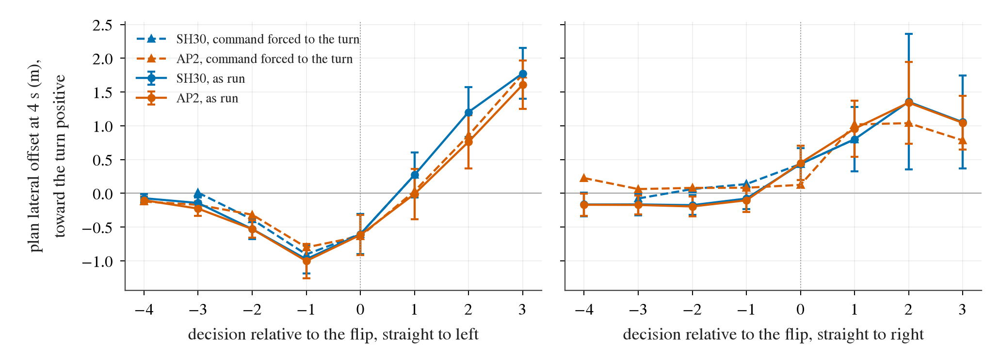

What to look at: plans aligned on the decision at which the route command flips from straight to a turn (log-straight scenes; solid = as run, mean and 95% interval over scenes).
Before a left turn the plan's 4 s point moves away from the turn by 0.5 m two decisions before the flip and 1.0 m one decision before (71% / 65% of scenes at least 0.5 m away,
against 4% / 11% three decisions before), stays there at the flip decision and only then swings toward the turn. Before a right turn the effect is small (0.1-0.2 m).

**It is not the command arriving late.** Dashed lines: the same decisions replayed offline with the command forced to the turn side (one decision changed, logged state and
history). At one decision before the flip the mean goes from -0.97 to -0.90 m (SH30, 70 scenes) and -1.00 to -0.80 m (AP2, 50 scenes); the share of plans at least 0.5 m
away stays at 69% / 62%. Forcing the command to the other side makes it worse (-2.41 / -1.65 m). Full table: [c1/flip.md](c1/flip.md).

So the trigger is in the image or ego state about 40 m before the turn, it is the same for both checkpoints, and its cause is open. What is excluded: the tracker
(error at most 0.2 m), the route command's timing, cold start (the events come after 5 or more decisions), and speed (the ego is behind the log).
Not tested: whether it also appears in open loop on the navtest tokens these scenes come from (the N1 taxonomy has B cut-in 13% and D side contact 9% of NC failures),
and whether it needs the deceleration that accompanies it.

## 4. Which fix class could address what

| fix class | SH30 zeros | AP2 zeros | shared scenes | basis |
|:--|--:|--:|--:|:--|
| (i) longitudinal fix aimed at class A (stopped / moving lead) | **0** (0%) | **0** (0%) | 0 | no class A collision; keeping the log's speed with the driven lateral offset clears 3 of 8 / 3 of 9 collisions, none of them a lead vehicle |
| (ii) off-track recovery rows | 7 (30%) | 3 (13%) | 2 | the T cases: lateral error grows through a turn. Plausible only: the plans are already wide while the ego is still within 0.8 m of the log, and decision 198 measured recovery on straight offsets of 0.5 m |
| (iii) cold-start handling | 0 | 3 (13%); 6 (25%) with the three M collisions that start from standstill | 0 | AP2's standstill launches, decided in the first plans with one to three keyframes. SH30 under the same cold-start rule does not launch early, so this is AP2's training more than the rule |
| (iv) none of these | 16 (70%) | 18 (75%) | 11 | M 12 / 13, H 2 / 2, R 1 / 2, S 1 / 1 |

Within (iv): M needs its cause found first (section 3); H is a longitudinal failure, but of holding at a stop line, not of following a lead; R and S are not fixable from the
driver's inputs (S is a zero for any driver).

## 5. Slow scenes (0 < score < 1)

Scene score lost: SH30 4.77 scene-equivalents over 50 scenes, AP2 2.61 over 27 (the zeros cost 23 and 24). Slow for both drivers: 17 scenes; SH30 only 33; AP2 only 10.

| driver | pattern | n | score lost (sum) | mean score | start speed m/s (median) | end speed minus the log's m/s (median) | on a turn >= 20 deg | route bends | object ahead in lane at the end | gap m (median) |
|:--|:--|--:|--:|--:|--:|--:|--:|--:|--:|--:|
| SH30 | launch from standstill slower than the log | 8 | 1.35 | 0.83 | 0.0 | -1.2 | 0 | 5 | 7 | 15 |
| SH30 | log accelerates, driver does not keep up | 12 | 1.06 | 0.91 | 7.0 | -5.1 | 9 | 11 | 3 | 14 |
| SH30 | log holds speed, driver slows | 9 | 1.08 | 0.88 | 4.5 | -2.2 | 6 | 9 | 2 | 14 |
| SH30 | log brakes, driver brakes earlier or harder | 17 | 1.14 | 0.93 | 7.0 | -2.8 | 1 | 9 | 11 | 19 |
| SH30 | other | 4 | 0.14 | 0.97 | 3.5 | -0.4 | 1 | 4 | 2 | 2 |
| AP2 | launch from standstill slower than the log | 1 | 0.01 | 0.99 | 0.0 | -1.0 | 0 | 1 | 0 | |
| AP2 | log accelerates, driver does not keep up | 3 | 0.44 | 0.85 | 3.6 | -4.3 | 1 | 3 | 0 | |
| AP2 | log holds speed, driver slows | 5 | 0.65 | 0.87 | 4.9 | -2.5 | 3 | 4 | 0 | |
| AP2 | log brakes, driver brakes earlier or harder | 18 | 1.52 | 0.92 | 6.1 | -2.6 | 2 | 13 | 11 | 16 |

Why slow:

- The plans are short, and get shorter as the scene goes on. In slow scenes the plan covers 0.86 (SH30) / 0.90 (AP2) of the logged distance over the common horizon in the
  first three decisions and 0.66 / 0.63 in decisions 3-6 (scenes at score 1: 0.96 / 0.99 and 0.95 / 0.99). The ego is 0.2 m behind the log at 1.5 s and 6.3 / 7.3 m behind at the end.
  It is a closed-loop drift toward lower speed, not a slow start.
- The largest group for both drivers is braking earlier or harder than a braking log (17 / 18 scenes), with an object in lane ahead in 11 of them at a 16-19 m gap: the
  drivers stop further back than the log does.
- SH30's extra 23 scenes are standstill launches (8, where AP2 has 1) and turns: 15 of the 21 scenes where the log accelerates or holds speed and SH30 slows are turns of
  20 deg or more (AP2: 4 of 8). The standstill split is the mirror of AP2's F zeros: on the 76 scenes starting below 1 m/s SH30 scores 0.982 with 0 zeros and 8 slow,
  AP2 0.921 with 6 zeros and 1 slow.

## 6. Representative cases

Each strip: per driver the bird's-eye view at the event (grey road area, dashed log path and box, orange driven path and box, blue plans, blue other vehicles, pink the struck
one), two CAM_F0 frames as delivered, and the road / wide frames the model was fed at the last decision before the event. AlpaSim rendered no third-person view in these runs;
the bird's-eye view stands in for it.

| case | what to look at |
|:--|:--|
| 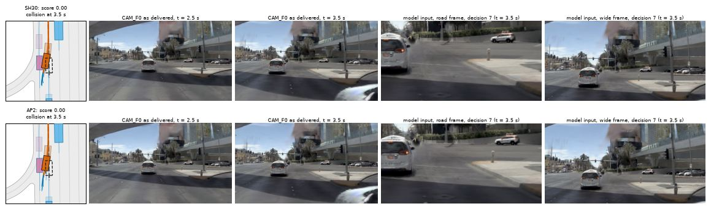 | M, both drivers, `...9215555823945665`. Braking behind a van, both shift 1.06 m right into the next lane; a vehicle passing there at 6.9 m/s (visible at the right edge at 3.5 s) is hit at 3.4 m/s. |
| 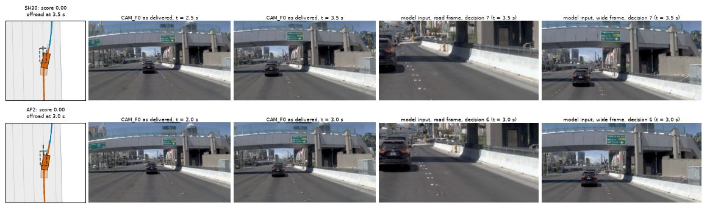 | M, both, `...c768a604b14e5956`. Same shift (0.7-0.8 m, yaw 11-13 deg) with a lead 14 m ahead; no contact, but the footprint leaves the lane polygon and the scorer's road-area query misses: offroad on the road surface. |
| 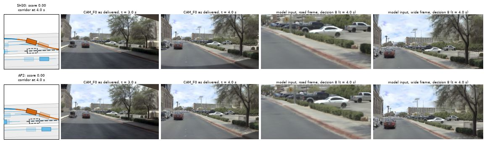 | M, both, `...bca002ce93bd5997`. The shift becomes a full lane change to the right (4.7 m) while the route turns left ahead. |
| 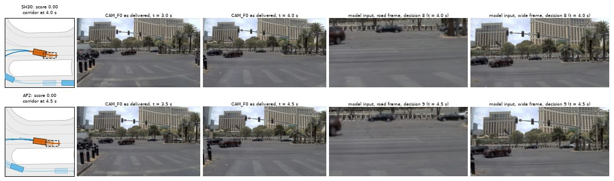 | H, both, `...23ee145aa4de582b`. The log waits at the intersection entry with cross traffic passing; both drivers roll on at 3 m/s, 4-5 m past it. |
| 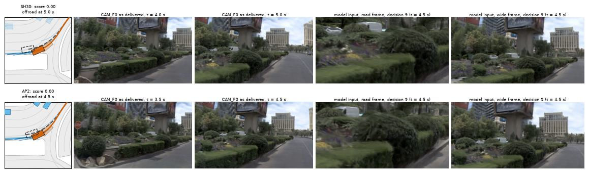 | T, both, `...5e9e8c31277d5edc`. Right-hand curve taken 1.4 m wide into the island at 4 m/s; 8 of the 9-10 plans already leave the road. |
| 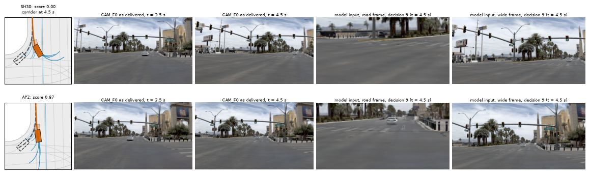 | T, SH30 only, `...60681597a59d5cf9`. Right turn not taken; from decision 5 the plans fan out toward a left turn. AP2 also goes straight but stays inside 4 m (0.87). |
| 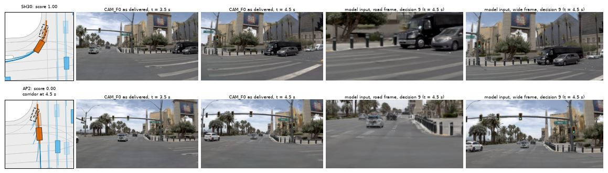 | F, AP2 only, `...6225b347244658c1`. From standstill at a stop line with a van crossing; AP2 launches straight ahead to 6.4 m/s, SH30 follows the log's slow right turn (1.0). |
| 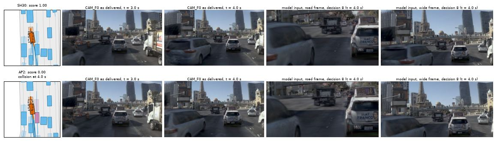 | M + standstill, AP2 only, `...be7331d3f05e5d16`. In a queue AP2 pulls away 2 m ahead of the log and 0.7 m to the left; a vehicle merging from the left at 7.1 m/s is hit. |
| 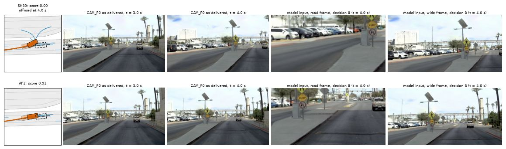 | M, SH30 only, `...5abe25231fd05639`. At 2.3 m/s the last two plans swing 27 deg left onto the median; AP2 keeps the lane (0.91). |
| 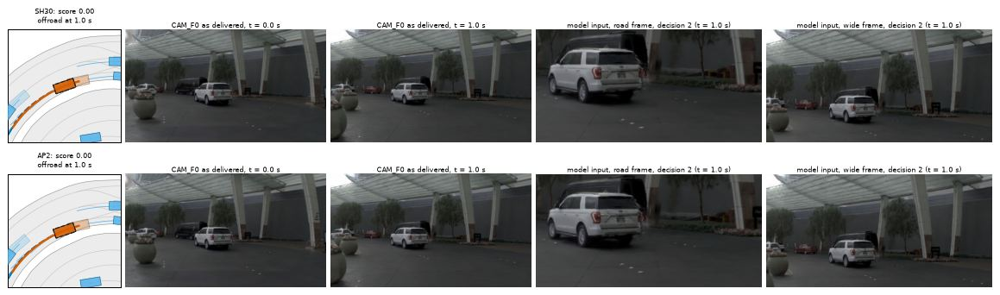 | S, both, `...f1b802f6e9a559af`. Offroad at 1.0 s on the logged path itself. |
| 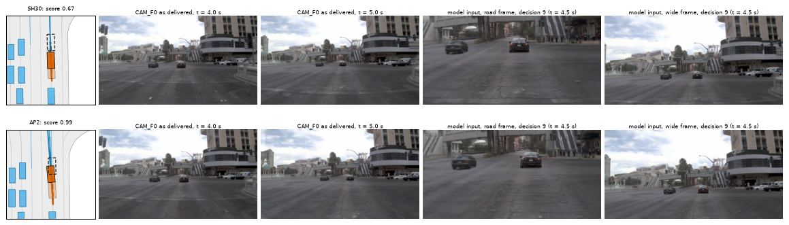 | Slow, SH30 0.67, `...639352b63c715c1f`: standstill launch slower than the log. |
| 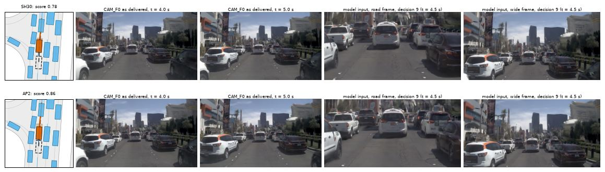 | Slow, SH30 0.78, `...457acf87bc885550`: braking earlier than a braking log. |
| 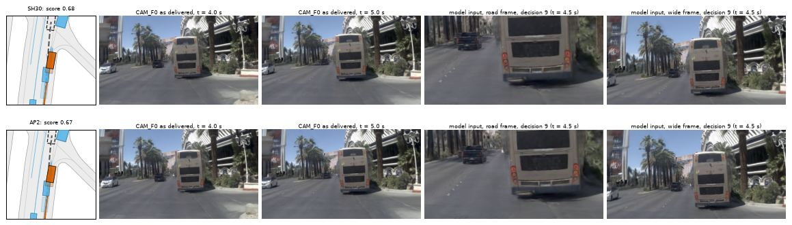 | Slow, SH30 0.68, `...e776468d9bf65a8a`: the log accelerates, SH30 does not. |

## 7. The 300 new scenes of C0b (counts only)

C0b kept the rollout logs of only about 25 scenes per run, so the case review stays on the 400. From its summaries and driver logs:

| set | driver | scenes | mean | zeros | collision / offroad / corridor | slow | zeros in scenes whose route bends / all such scenes | zeros in scenes without a bend / all such scenes | zeros in standstill starts / all |
|:--|:--|--:|--:|--:|:--|--:|--:|--:|--:|
| 400 | SH30 | 400 | 0.9306 | 23 | 8 / 7 / 8 | 50 | 23 / 298 | 0 / 102 | 0 / 76 |
| 400 | AP2 | 400 | 0.9335 | 24 | 9 / 6 / 9 | 27 | 24 / 301 | 0 / 99 | 6 / 76 |
| new 300 | SH30 | 300 | 0.8919 | 27 | 11 / 6 / 10 | 45 | 27 / 258 | 0 / 42 | 5 / 40 |
| new 300 | AP2 | 300 | 0.9074 | 25 | 12 / 6 / 7 | 26 | 25 / 267 | 0 / 33 | 7 / 40 |

Zero for both drivers: 13 of 34 scenes on the 400, 18 of 34 on the new 300. "Route bends" here is the first route waypoint moving more than 2 m sideways at any decision,
turns included. On the new scenes SH30 also has zeros from standstill (5), which it did not on the 400.

## Limits

- One training seed per driver, local rendering, 400 scenes from 46 logs (381 in Las Vegas); mechanism counts are small numbers.
- 11 of 34 zero scenes were looked at; the rest are classified by rule. Classes M / T / R are separated by thresholds (8 deg, 20 deg, 0.4 m) chosen after reading the cases.
- The cause of the pre-turn shift is not identified; the forced-command replay is open loop and changes one decision at a time. A closed-loop run with an earlier command was not made.
- The offroad replica agrees with the scorer on all 48 flagged steps and flags 11 further steps of 9 600; "the logged path itself fails" (S) rests on it.
- AP2's replay differs from the run on standstill scenes when a session is not replayed from its first decision (the harness, not the driver); those decisions are excluded from the forced-command table.
- Fix classes are judgements about plausibility, not measurements; no fix was run.
