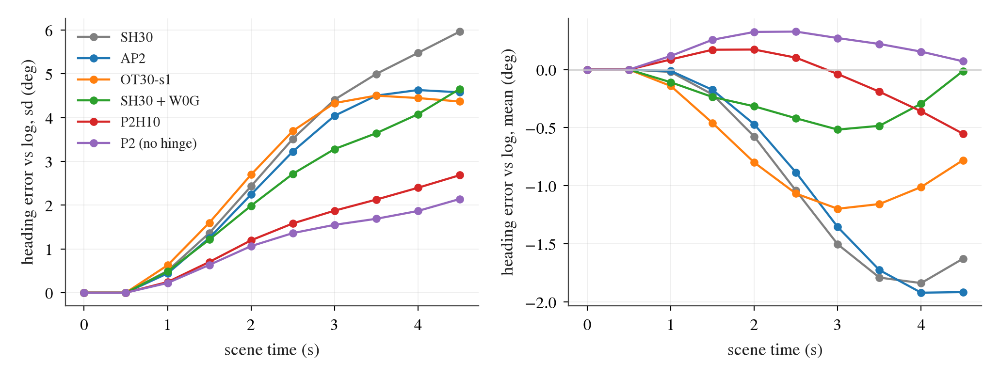
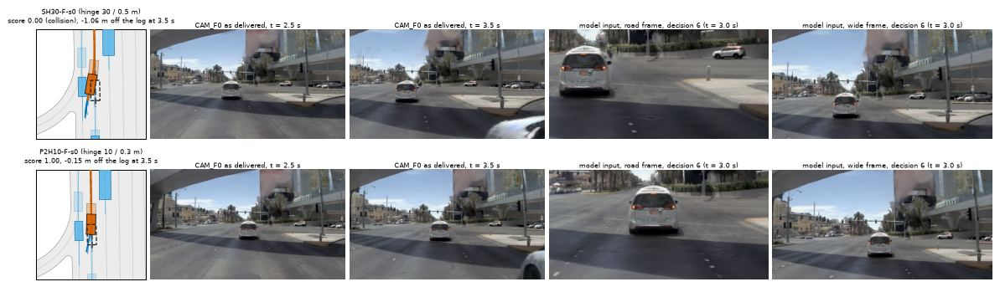
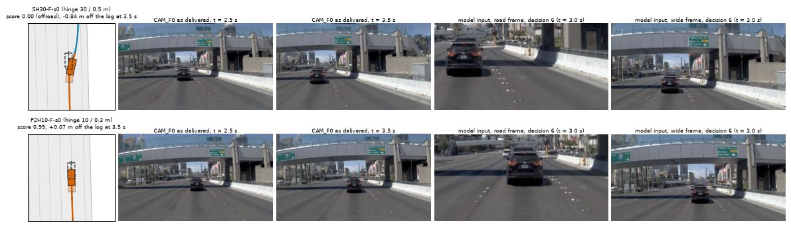
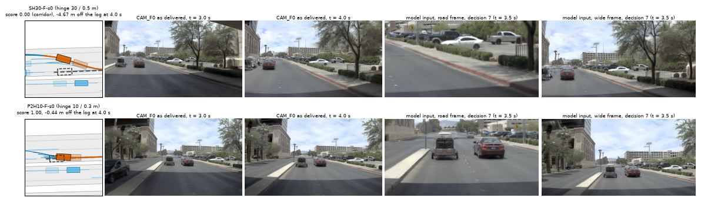
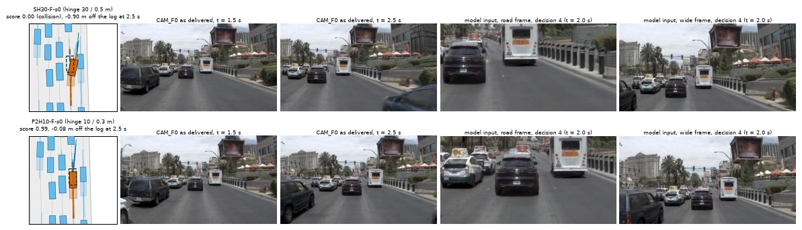
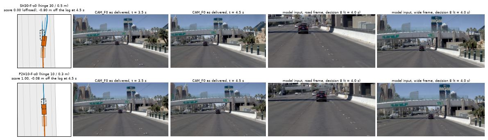
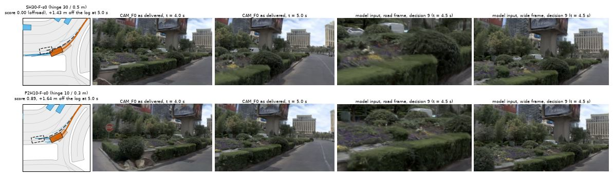

# M1: cause and fix of the "pre-turn shift" zeros on AlpaSim (2026-10-09, decision 205)

Follows [c1_zero_review.md](c1_zero_review.md) (decision 202: half of the zero scores of SH30 and AP2 are a 1-2 m sideways shift on a straight
stretch, cause open). Local closed-loop runs only; nothing was registered or submitted. Pre-registration with its addendum:
[plans/2026-10-09-m1-yaw-damping-prereg.md](../plans/2026-10-09-m1-yaw-damping-prereg.md) (pushed before any closed-loop score of a changed driver; the
addendum before any held-out score). Tables: [m1/tables.md](m1/tables.md) (diagnosis), [m1/diag_report.md](m1/diag_report.md), [m1/class.md](m1/class.md) (zero classes),
[m1/heldout_report.md](m1/heldout_report.md), [m1/all700_report.md](m1/all700_report.md). Map, other vehicles and logged paths are used for labels only.

## Result in short

- **The route does not announce a turn in these scenes; the ego yaws.** In the log-straight scenes that decision 202 labelled "route bends", the route's
  first waypoint does not move in the world frame in 50-56% of them (under 1 m; median 0.8 m). The ego has yawed about 5 deg, and a waypoint 42 m ahead
  moves 3.7 m sideways in the rig frame per 5 deg, to the side opposite the yaw; the command then flips. "Away from the turn the route indicates" was the
  ego's own heading drift read backwards. 8 of the 14 SH30 zeros on log-straight scenes are in scenes whose route moves less than 1 m in the world.
- **Trigger: the strong drivable hinge (lambda 30, margin 0.5 m).** With the same driver code and inputs, the lambda-10 checkpoint `P2H10-F-s0` and the
  hinge-free `P2-F-s0` have 2 and 1 zeros on the 269 log-straight diagnosis scenes where SH30 has 14, and no M-class zero where SH30 has 12. The heading
  error against the log at decision 5 has sd 1.7 / 1.2 deg against SH30's 5.0 deg (S1 scenes) and no mean, where SH30, AP2 and OT30 drift right by 3 deg.
  The drift goes away from the nearer road edge (correlation +0.22 / +0.24).
- **Amplifier: the plan continues the yaw rate it sees, and the tracker executes it.** The plan's yaw at 0.5 s is 0.93 x the yaw the ego turned in the last
  0.5 s. The model reads that turning from the synthesised slots only (the newest image pair is one keyframe warped along the ego track): with the warp
  track straightened the slope is 0.18, with the adapter's ego features straightened it stays 0.93. The MPC executes the plan's yaw one to one. So the heading
  error grows linearly, about 1 deg per decision, for every checkpoint; the hinge sets how much is injected.
- **NAVSIM side: the same continuation, and there it is right.** On navtest the logged future has the same slope (0.97) and so have the plans (0.97); on
  straight tokens only 3.3-3.7% of plans end 0.7 m or more off the log at 4 s. The shift itself is not in the open-loop plans; the per-step ingredient
  (decision 206: lateral innovation 0.14 m with the strong hinge, 0.08 m with lambda 10) is.
- **Fix: serve the lambda-10 checkpoint, driver unchanged.** Held-out 300 scenes, `P2H10-F-s0` against `SH30-F-s0`: **0.9288 vs 0.8919, +0.0369
  [+0.0087, +0.0668]**, zeros 16 vs 27, M-class zeros 2 vs 8, zeros on scenes without route shift 0 vs 0. All three registered lines are met.
  The input-side damping that was registered first fixes M zeros as well (8 -> 2) but loses as many on turns (+0.0048 on the diagnosis set, -0.0014 held out).

## 1. What "the route bends" was

Log-straight scenes of the 400 (heading change under 5 deg), by decision 202's label; the world column is the lateral range of the same waypoint in the
frame of the initial logged heading ([m1/tables.md](m1/tables.md) section 1).

| driver | label (rig frame) | scenes | waypoint shift, rig frame m (median) | same waypoint, world frame m (median) | world shift under 1 m | ego yaw extreme deg (median) | zeros | zeros with world shift under 1 m |
|:--|:--|--:|--:|--:|--:|--:|--:|--:|
| SH30 | bends left | 109 | 6.3 | 0.8 | 56% | -6.0 | 10 | 7 |
| SH30 | none | 102 | 0.1 | 0.6 | 59% | -0.6 | 0 | 0 |
| SH30 | bends right | 58 | -3.8 | 0.8 | 50% | +3.5 | 4 | 1 |
| AP2 | bends left | 117 | 5.9 | 0.8 | 56% | -5.0 | 13 | 7 |
| AP2 | none | 99 | -0.6 | 0.7 | 59% | +0.5 | 0 | 0 |
| AP2 | bends right | 53 | -3.6 | 1.0 | 51% | +3.3 | 3 | 2 |

The shipped command rule (first waypoint at least 5 m away, |y| > 2 m in the rig frame) flips at 2.7 deg of ego yaw with a waypoint 42 m ahead. Decision 202's
statement that all 99 zeros lie in scenes with a route shift is therefore close to a restatement of "the ego left its heading". The flip itself is not the
cause: it comes after the drift and points back toward the route (C1's replay: forcing the command changes the plan by 0.1 m).

## 2. The loop

What to look at: heading error of the driven ego against the log on the log-straight diagnosis scenes (start speed over 2 m/s), by scene time. Left, the
spread grows in a straight line from the first closed-loop step for every checkpoint; SH30, AP2 and OT30 reach 4.4-6.0 deg, P2H10 and P2 2.7 and 2.1 deg. Right, the strong-hinge checkpoints drift right on average, the others do not.

Offline replay of the logged driver inputs with one input changed (`scripts/m1_replay.py`; SH30, decisions 2-9 of the log-straight scenes; AP2 is the same
within 0.05, [m1/tables.md](m1/tables.md) section 4):

| input changed | plan yaw at 0.5 s per deg turned in the last 0.5 s | sd of plan yaw at 0.5 s, deg | mean, deg |
|:--|--:|--:|--:|
| none (as run) | 0.93 | 1.49 | -0.44 |
| adapter ego features from a straightened history | 0.93 | 1.49 | -0.44 |
| adapter features with a synthetic yaw rate of +/- 0.05 rad/s | 0.93 | 1.49 | -0.44 |
| acceleration feature zeroed | 0.92 | 1.49 | -0.44 |
| command forced left / straight / right | 0.95 / 0.92 / 1.04 | 1.51 / 1.46 / 1.66 | -0.42 / -0.44 / -0.57 |
| **warp track of the synthesised slots straightened** (frames and features as run) | **0.18** | **0.57** | **+0.05** |
| warp track half straightened | 0.58 | 1.06 | -0.25 |
| mirrored world, right-hand flag kept / flipped | 0.93 / 0.92 | 1.46 / 1.44 | -0.35 / -0.43 |

- The adapter's ego features carry none of it: three different edits change the plan's 4 s point by 0.01 m.
- At decision 3 (the navtest token itself) the vision tokens were swapped for the cached NAVSIM ones of the same token (real camera frames warped along the
  logged track): on the 24 stage-a scenes the share of plans 0.7 m or more off at 4 s goes from 29% to 8% and the mean plan yaw at 0.5 s from -0.55 to -0.04 deg;
  swapping the ego features for NAVSIM's changes nothing (0.06 m). The rendered-image domain alone does not bend the plan: at decisions 0 and 1, on
  rendered frames with the logged motion, the plan yaw at 0.5 s has mean +0.02 / +0.06 deg (rendered and real tokens have cosine similarity 0.80-0.92 at decision 3).
- The mirror test leaves a small rightward residue (-0.07 to -0.10 deg per decision) that disappears when the mirrored world is declared left-hand traffic.
- The executed yaw change over the next 0.5 s is 1.01-1.03 x the plan's yaw at 0.5 s (correlation 0.98): the tracker adds no damping.

On navtest, open loop, the logged future has slope 0.97 on the yaw turned in the last 0.5 s and 1.85 at 1.0 s; SH30 and AP2 plans have 0.97 and 1.85
([m1/tables.md](m1/tables.md) section 3). On straight tokens the logs turn 0.34 deg per 0.5 s (sd); in closed loop the ego turns 1 deg and more, and the
plan continues it as if it were a curve.

## 3. The trigger

Same driver code, input standard and cold-start rule; only the checkpoint differs (`SH30_TAG`). Diagnosis set, 400 scenes, against SH30-F-s0
([m1/diag_report.md](m1/diag_report.md)):

| driver | hinge | mean scene score | zeros (collision / offroad / corridor) | difference [95% CI, scenes] | zeros on 269 log-straight scenes | on 97 turn scenes (>= 20 deg): mean, zeros |
|:--|:--|--:|:--|:--|--:|:--|
| SH30-F-s0 | 30 / 0.5 m | 0.9306 | 23 (8 / 7 / 8) | | 14 | 0.890, 9 |
| AP2-AB-s0 | 30 / 0.5 m | 0.9335 | 24 (9 / 6 / 9) | +0.0029 [-0.0192, +0.0254] | 16 | 0.919, 7 |
| OT30-F-s0 / s1 | 30 / 0.5 m + off-track rows | 0.9399 / 0.9476 | 19 / 17 | +0.0093 / +0.0170 | 9 / 6 | 0.886, 9 / 0.876, 11 |
| SH30-F-s0 + W0G (yaw shown to the model set to 0 on a straight route) | 30 / 0.5 m | 0.9353 | 18 (5 / 5 / 8) | +0.0048 [-0.0089, +0.0193] | 9 | 0.888, 9 |
| P2-F-s0 / s1 | none | 0.9591 / 0.9491 | 10 / 12 | +0.0285 [+0.0067, +0.0518] / +0.0185 | 1 / 2 | 0.906, 7 / 0.888, 9 |
| **P2H10-F-s0** / s1 | 10 / 0.3 m | **0.9631** / 0.9622 | 9 (1 / 3 / 5) / 9 | **+0.0325 [+0.0110, +0.0553]** / +0.0317 | 2 / 2 | 0.905, 7 / 0.910, 7 |
| P2H10-F-s0 + W0G | 10 / 0.3 m | 0.9601 | 9 | +0.0295 [+0.0080, +0.0525] | 2 | 0.904, 7 |

- Mechanism classes of the zeros by decision 202's rules (`scripts/m1_class.py`): SH30 S 1, H 2, M 12, T 7, R 1; P2H10-F-s0 S 1, H 1, F 1, **M 0**, T 5, R 1.
- Un-gated damping (W0 / W50, S1 scenes only) turns 13 / 6 turn scenes from non-zero to zero: a model that is not shown its own turning under-turns. Not continued.
- Direction: at decision 6 the ego is 4.1-4.3 deg right of the log where the left road edge is the nearer one (20 scenes), 0.9-1.0 deg where the right
  edge is nearer (149 scenes) ([m1/tables.md](m1/tables.md) section 5). The hinge pushes from the edge side; it does not explain the common rightward mean by itself.
- OT30's off-track rows shorten the drift late in the scene (heading error sd 4.4-5.1 deg at decision 9 against 6.0) and do not reduce the injection
  (0.65 deg at decision 2 against 0.50): a restoring term on top of the same trigger.

## 4. Held-out read against the registered line

300 scenes of C0b's new shards, not used in any diagnosis. Setting chosen on the diagnosis set by the frozen rule (highest mean): `P2H10-F-s0`, driver unchanged.
Paired with the unfixed `SH30-F-s0` ([m1/heldout_report.md](m1/heldout_report.md)):

| driver | mean scene score | zeros (collision / offroad / corridor) | difference [95% CI, scenes] | [95% CI, whole logs] | zero -> non-zero | non-zero -> zero |
|:--|--:|:--|:--|:--|--:|--:|
| SH30-F-s0 (unfixed) | 0.8919 | 27 (11 / 6 / 10) | | | | |
| **P2H10-F-s0** (registered read) | **0.9288** | 16 (6 / 7 / 3) | **+0.0369 [+0.0087, +0.0668]** | [-0.0064, +0.0726] | 16 | 5 |
| P2H10-F-s1 | 0.9329 | 14 (6 / 6 / 2) | +0.0410 [+0.0119, +0.0711] | [-0.0012, +0.0778] | 17 | 4 |
| P2-F-s0 | 0.9245 | 16 (6 / 7 / 3) | +0.0326 [+0.0039, +0.0626] | [-0.0079, +0.0591] | 16 | 5 |
| SH30-F-s0 + W0G | 0.8905 | 26 (7 / 10 / 9) | -0.0014 [-0.0260, +0.0238] | [-0.0385, +0.0392] | 8 | 7 |
| AP2-AB-s0 (unfixed, C0b) | 0.9074 | 25 | +0.0156 [-0.0102, +0.0424] | | 9 | 7 |
| OT30-F-s0 / s1 (unfixed, C0b) | 0.9069 / 0.9146 | 23 / 21 | +0.0151 / +0.0227 | | 11 / 12 | 7 / 6 |

| registered line | read | verdict |
|:--|:--|:--|
| mean scene score >= +0.015 with the scene-resampled CI lower bound > 0 | +0.0369 [+0.0087, +0.0668] | **met** |
| M-class zeros at least halved (decision 202's rule; without the route clause in brackets) | 8 -> 2 (9 -> 4) | **met** |
| no more zeros on scenes without route lateral shift (42 scenes in the unfixed run) | 0 -> 0 | **met** |

Zeros by class, held out: SH30 F 1, M 8, T 10, R 8; P2H10-F-s0 M 2, T 7, R 7; SH30 + W0G F 1, M 2, T 17, R 6 (the gate removes the M zeros and adds turn
zeros: the route line still reads straight on the approach to some turns).

All 700 landed scenes ([m1/all700_report.md](m1/all700_report.md); 400 of them are the diagnosis set): P2H10-F-s0 0.9484, zeros 25 (7 / 10 / 8) against
SH30 0.9140, zeros 50 (19 / 13 / 18): +0.0344 [+0.0168, +0.0519], whole-log CI [+0.0140, +0.0549]; s1 0.9496. For reference C0b's rows: OT30-F-s1 0.9335,
AP2 0.9223, WA-JEPA 0.9111.

## 5. Before and after

Each strip: top SH30-F-s0, bottom P2H10-F-s0 in the same scene, at the time SH30 fails. Left the bird's-eye view in the rollout's local frame (grey road area,
dashed logged path and box, orange driven path and box, blue plans, blue other vehicles); two CAM_F0 frames as delivered; the road and wide frames the model
was fed at the last decision before that time. AlpaSim renders no third-person view; the bird's-eye view stands in for it.

| case | what to look at |
|:--|:--|
|  | `...9215555823945665`, straight road, a van braking ahead. SH30 is 1.06 m right of the log at 3.5 s and is hit by the vehicle passing on the right (its bonnet enters the delivered frame at 3.5 s; the model's road frame shows the van left of centre, i.e. the ego has yawed). P2H10 is 0.15 m off, still behind the van. |
|  | `...c768a604b14e5956`, under the overpass with a barrier on the left: SH30 yaws away from the barrier side until the footprint leaves the lane polygon (offroad on the road surface). |
|  | `...bca002ce93bd5997`: SH30's drift becomes a full lane change to the right, 4.7 m off the log (corridor). P2H10 keeps the lane behind the trailer (0.44 m off). |
|  | `...690d5fcd5dd056dc`, queue ahead: side contact after a right drift for SH30. |
|  | `...ef300f8a9cf254bc`, open road at 11.7 m/s with no lead: the same drift without anything to avoid, offroad at the bollards. |
|  | `...5e9e8c31277d5edc`, a T case (right-hand curve taken wide into the island): not the mechanism of this note; shown to see what the checkpoint swap does on a turn failure. |

Also rendered: `pair_4749b2486da65268.jpg`, `pair_9a89dccc70835d69.jpg`.

## 6. What this is and is not

- The fix is a checkpoint choice, not a new method: on AlpaSim's closed loop the strong hinge costs 0.034 mean scene score and half of the zeros; on navtest
  open loop it was worth +0.87 EPDMS over P2H10 (decision 170) and +1.83 on navhard. Serving different hinge strengths per board is a per-board recipe and
  has to be disclosed.
- The loop is still there in P2H10 (heading error sd 3.3 deg at decision 9 on the S1 scenes): a longer scene, or a second trigger, would show it again.
  A training-side cure needs rows in which the ego has a heading error and a yaw rate of its own making and the target returns (closed-loop or on-policy rows;
  OT30's static offsets supply the return, not the yaw rate), or the hinge applied without injecting lateral change where the log continues.
- Not re-tested: decision 189's route arm (route waypoints as adapter inputs, a training change) and the execution-layer rules of decisions 113 / 114 / 157;
  the route is used here only to gate the damping and nothing post-processes the plan.

## Limits

- One training seed for SH30 and AP2; two for P2 / P2H10 / OT30. Local native rendering, not the official environment; 700 scenes from 27 logs, most in Las Vegas.
- The held-out CI that resamples whole logs includes zero for every single run ([-0.0064, +0.0726]); the registered criterion was the scene-resampled one. On
  all 700 scenes both exclude zero, but 400 of those selected the setting.
- P2-F and P2H10-F were added as candidates after the registration, on a lead from lane IG1, before their scores were read; the addendum records it.
- "Trigger" rests on checkpoints that differ in hinge strength and margin together (and P2 in having none); no checkpoint isolates the margin. The replay swaps
  were made on SH30 and AP2 only.
- Mechanism classes come from decision 202's rules, whose thresholds were set after reading cases; on the held-out set no case was looked at.
- Offline replay is open loop: it shows what a plan responds to, the closed-loop runs show what that does.
- Cost: about 3 850 closed-loop scene rollouts in 18 runs, about 3.4 card-hours at the measured 0.35 per 400 scenes, plus about 0.5 lost when nine stacks
  submitted together ran the host out of memory (five runs hung and were cancelled; the chain now caps at three), and about 0.6 GPU-hours of replay.

Code: `scripts/m1_replay.py` / `m1_replay.sh` (input swaps), `m1_decisions.py`, `m1_analysis.py` (tables, figure), `m1_chain.py` (closed-loop stages),
`m1_report.py`, `m1_class.py`, `m1_show.sh`, `m1_figs.py`; driver option `SH30_MOTION` / `SH30_MOTION_GATE` in `lib/sh30_core.py`, `lib/sh30_driver.py`
(default off). Runs: `$DATA_DIR/runs/alpasim/m1/` (rollout logs kept for failed rollouts and the eight showcase scenes).
