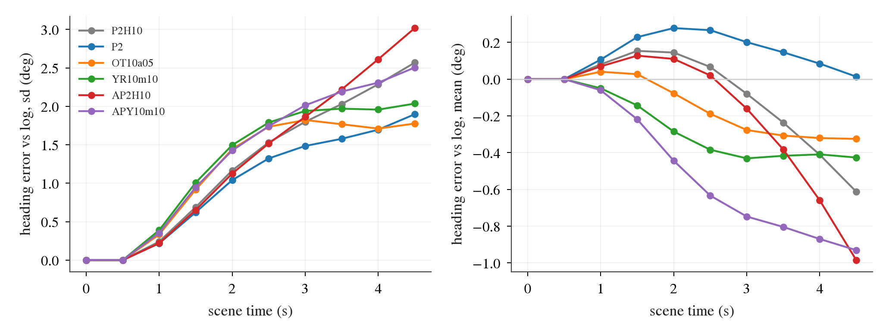

# OT3: the lambda-10 base, the AlpaSim input standard, off-track rows and yaw-rate rows on AlpaSim (2026-10-09, decisions 212 / 213)

Follows [m1_preturn_shift.md](m1_preturn_shift.md) (decision 205: the strong hinge triggers a closed-loop heading drift, the plan continues the yaw
rate it is shown, the MPC executes it). Local closed-loop runs only; nothing was registered or submitted to AlpaSim. Pre-registration:
[plans/2026-10-09-ot3-lambda10-prereg.md](../plans/2026-10-09-ot3-lambda10-prereg.md) (pushed before any closed-loop score of a new checkpoint was read).
Generated tables: [ot3/a_report.md](ot3/a_report.md) (700 scenes), [ot3/new_report.md](ot3/new_report.md) (400 later scenes), per-scene
`ot3/a_per_scene.csv` / `ot3/new_per_scene.csv`, [ot3/heading_a.md](ot3/heading_a.md), [ot3/yr_probe_sel.md](ot3/yr_probe_sel.md),
[ot3/yr_probe_apy.md](ot3/yr_probe_apy.md), `ot3/ap2_offline_{a,yr,apy}.md`. Logged paths are used for labels and the heading ruler only.

## Result in short

- **No configuration meets the registered line on the 700 selection scenes** (two-seed mean minus P2H10's two-seed mean >= +0.010 with the
  log-clustered CI lower bound > 0, at-fault events not higher, slow scenes <= P2H10's + 10). Six configurations were read against it.
- **Yaw-rate rows (10 % of the batch, lambda 10, NAVSIM input standard; `YR10m10-F`) are the best registered arm**: 700 scenes 0.9545 vs 0.9483,
  +0.0062 [-0.0022, +0.0157] (log-clustered), zeros 18.5 vs 24.5, at-fault events 14 vs 17. On the 400 scenes that landed later and took part in no
  selection: 0.9079 vs 0.8926, **+0.0153 [+0.0043, +0.0267]**, zeros 27.5 vs 33 (18 of them are zero for every driver), events 12.5 vs 15.5. All
  1 100 scenes (39 logs): +0.0095 [+0.0024, +0.0166]. By the registered rule (the 700 scenes decide) it is not a candidate; the later scenes are a
  confirmation read that is positive on its own.
- **The mechanism fix works offline and partly in the loop.** On held-out yaw-rate rows the continuation of an injected yaw rate falls from 1.03
  (P2H10) to 0.30 while the legitimate continuation on turn tokens stays at 1.04 (logs 1.05); in closed loop the heading-error sd at decision 9 is
  0.79 x P2H10's [0.65, 0.98] against a registered 0.75: two of three registered lines met, the third missed by 0.04. The curve stops growing after
  decision 5 instead of growing linearly, at the price of a larger error in the first steps.
- **It costs nothing open loop**: navtest 88.97 vs 88.67 (+0.30 [+0.10, +0.51]), navhard 32.64 vs 31.84 (+0.80 [-0.88, +2.62]), HUGSIM 64 HD
  -0.013 [-0.050, +0.028] with launch stalls 1 vs 1 (guardrail met).
- **The AlpaSim input standard at lambda 10 (`AP2H10-AB`) halves the slow scenes (54.5 vs 106.5) and adds zeros (29.5 vs 24.5)**: +0.0023
  [-0.0124, +0.0179]; heading-error sd 1.17 x P2H10's (within the registered 1.25). It costs -0.24 navtest and -2.49 navhard.
- **Off-track rows at lambda 10: +-0.5 m does nothing (-0.0007), +-1.5 m destroys the driver** (0.8421, zeros 98.5, 55 of them offroad;
  heading-error sd 12 deg) although it is the best of these arms on navhard (34.12). The static offset rows do not transfer to this loop.
- **No hinge (`P2-F`) is not better than lambda 10**: -0.0064 [-0.0151, +0.0013] on the 700, -0.0074 [-0.0146, -0.0010] on the 1 100. The heading
  drift does grow with hinge strength (sd at decision 9: 1.90 / 2.57 / about 6.0 deg for none / 10 / 30); the score does not follow below lambda 10.
- Exploratory (rule registered, arm chosen after results): both ingredients together, `APY10m10-AB`, 0.9566, +0.0083 [-0.0036, +0.0219], slow 57.5,
  zeros 25. Not read on the later scenes.

## 1. Drivers on the 700 scenes

Same 700 scenes (27 logs) and the same three chunks for every driver; one simulation per checkpoint. Recipes are per-scene means of the two
training seeds, counts are seed means. Heading-error sd: decision 9 on M1's set (192 log-straight scenes of the 400 diagnosis scenes, start speed
over 2 m/s), mean of the two seeds.

| recipe (seeds) | hinge | input standard | rows | mean scene score | zeros (collision / offroad / corridor) | slow | at-fault events | heading-error sd, deg |
|:--|:--|:--|:--|--:|:--|--:|--:|--:|
| P2H10-F (0.9483 / 0.9482), baseline | 10 / 0.3 m | NAVSIM | | 0.9483 | 24.5 (6.5 / 10.5 / 7.5) | 106.5 | 17 | 2.57 |
| P2-F (0.9443 / 0.9394) | none | NAVSIM | | 0.9418 | 26.5 (6.5 / 14 / 6) | 115.5 | 20.5 | 1.90 |
| OT10a05-F (0.9468 / 0.9482) | 10 / 0.3 m | NAVSIM | off-track +-0.5 m, 10 % | 0.9475 | 24.5 (5.5 / 12.5 / 6.5) | 105.5 | 18 | 1.78 |
| OT10a15-F (0.8505 / 0.8336) | 10 / 0.3 m | NAVSIM | off-track +-1.5 m, 10 % | 0.8421 | 98.5 (21 / 55 / 22.5) | 89 | 76 | 11.98 |
| **YR10m10-F** (0.9534 / 0.9556) | 10 / 0.3 m | NAVSIM | yaw-rate, 10 % | **0.9545** | **18.5** (4 / 10 / 4.5) | 110 | **14** | 2.04 |
| AP2H10-AB (0.9523 / 0.9489) | 10 / 0.3 m | AlpaSim | | 0.9506 | 29.5 (8 / 9 / 12.5) | **54.5** | 17 | 3.02 |
| APY10m10-AB (0.9533 / 0.9599), exploratory | 10 / 0.3 m | AlpaSim | yaw-rate, 10 % | 0.9566 | 25 (6.5 / 10.5 / 8) | 57.5 | 17 | 2.50 |
| SH30-F (0.9140 / 0.9219), reference | 30 / 0.5 m | NAVSIM | | 0.9180 | 46.5 (18 / 13 / 15.5) | 96 | 31 | 5.97 (s0, M1) |
| AP2-AB (0.9223 / 0.9240), reference | 30 / 0.5 m | AlpaSim | | 0.9232 | 48.5 (20.5 / 11.5 / 16.5) | 53.5 | 32 | 4.58 (s0, M1) |
| OT30-F (0.9258 / 0.9335), reference | 30 / 0.5 m | NAVSIM | off-track +-0.5 m, 10 % | 0.9296 | 40 (11 / 11 / 18) | 87.5 | 22 | 4.71 (M1) |

Paired differences against P2H10 (two-seed means, 700 scenes; both CIs are 95 % bootstraps with 10 000 draws, the log-clustered one decides):

| recipe - P2H10 | difference | CI, scenes | CI, logs | score line | events line | slow line | verdict |
|:--|--:|:--|:--|:--|:--|:--|:--|
| P2-F | -0.0064 | [-0.0138, +0.0007] | [-0.0151, +0.0013] | not met | not met (20.5 / 17) | met | no |
| OT10a05-F | -0.0007 | [-0.0101, +0.0087] | [-0.0078, +0.0070] | not met | not met (18 / 17) | met | no |
| OT10a15-F | -0.1062 | [-0.1275, -0.0849] | [-0.1317, -0.0838] | not met | not met (76 / 17) | met | no |
| YR10m10-F | +0.0062 | [-0.0035, +0.0163] | [-0.0022, +0.0157] | not met | met (14 / 17) | met (110 / 106.5) | no |
| AP2H10-AB | +0.0023 | [-0.0101, +0.0145] | [-0.0124, +0.0179] | not met | met (17 / 17) | met (54.5 / 106.5) | no |
| APY10m10-AB (exploratory) | +0.0083 | [-0.0036, +0.0204] | [-0.0036, +0.0219] | not met | met (17 / 17) | met (57.5 / 106.5) | no |
| SH30-F (reference) | -0.0303 | [-0.0457, -0.0159] | [-0.0478, -0.0153] | | | | |

Other pairs: YR10m10 - OT10a05 +0.0070 [-0.0011, +0.0156]; APY10m10 - AP2H10 +0.0060 [-0.0042, +0.0143]; APY10m10 - YR10m10 +0.0021 [-0.0069, +0.0118];
P2 - SH30 +0.0239 [+0.0083, +0.0402] (log-clustered).

**Multiplicity.** Six configurations were compared with the line (five registered by name, plus the conditional combination arm), each against the same
baseline, without correction. None passed, so there is no chance pass to discount. The largest point estimates (+0.0083, +0.0062) are inside the
seed-to-seed range of one recipe (APY10m10's own seeds differ by 0.0066, OT30's by 0.0077), and with six draws the best of them is biased upward as a
selected estimate; the unbiased read of YR10m10 is the one on the later scenes below.

Baseline reads (registered, no line): the two P2H10 seeds differ by +0.0001 [-0.0052, +0.0052] and disagree on zero / non-zero in 5 scenes; P2's by
+0.0048 [-0.0016, +0.0128], 7 scenes. The same P2H10 checkpoints under M1's scene lists (400 + 300 instead of three interleaved chunks): 37 / 43 of
700 scenes get a different score, 0 / 1 flip between zero and non-zero, means 0.9484 / 0.9496 against 0.9483 / 0.9482 here: list-composition noise
is about 0.001 on the mean.

Zeros by scene group (the 400 diagnosis scenes, labels from the logged path; seed means):

| recipe | log straight (269): mean, zeros | log 5-20 deg (34) | log turn >= 20 deg (97) |
|:--|:--|:--|:--|
| P2H10-F | 0.9791, 2 | 0.9890, 0 | 0.9026, 7.5 |
| P2-F | 0.9761, 1.5 | 0.9416, 1.5 | 0.8973, 8 |
| OT10a05-F | 0.9816, 1.5 | 0.9809, 0 | 0.9277, 5 |
| YR10m10-F | 0.9800, 2 | 0.9809, 0 | 0.9269, 4.5 |
| AP2H10-AB | 0.9789, 4 | 0.9946, 0 | 0.9203, 7 |
| APY10m10-AB | 0.9826, 3 | 0.9906, 0 | 0.9530, 4 |
| OT10a15-F | 0.8806, 27.5 | 0.8941, 3 | 0.8476, 13 |

At lambda 10 the remaining zeros are on turns, not on straights (decision 205's M class is gone), and the rows that help (yaw-rate rows, and the
+-0.5 m off-track rows on this subset) help on the turn scenes: turns are where the ego is off the logged heading with a yaw rate.

## 2. The later scenes (confirmation read)

400 scenes of parts 004 / 006 / 010 / 011 (17 logs, 12 of them not among the 27 of the 700), landed after the 700; one list, the same for every
driver. They took part in no choice of this lane. 18 of them score zero for every driver (10 fail AlpaSim's route check before any decision,
see [c0c_public1000.md](c0c_public1000.md)).

| recipe | mean scene score | zeros (collision / offroad / corridor) | slow | at-fault events | difference to P2H10 | CI, scenes | CI, logs |
|:--|--:|:--|--:|--:|--:|:--|:--|
| P2H10-F (0.8892 / 0.8960) | 0.8926 | 33 (2.5 / 13 / 7.5) | 70 | 15.5 | | | |
| P2-F (0.8842 / 0.8830) | 0.8836 | 35.5 (3 / 15 / 5.5) | 79 | 18 | -0.0090 | [-0.0215, +0.0028] | [-0.0239, +0.0025] |
| **YR10m10-F** (0.9080 / 0.9078) | **0.9079** | 27.5 (2 / 10.5 / 4.5) | 71 | 12.5 | **+0.0153** | [-0.0003, +0.0322] | **[+0.0043, +0.0267]** |

All 1 100 scenes (39 logs): YR10m10 - P2H10 +0.0095 [+0.0011, +0.0182] (scenes), [+0.0024, +0.0166] (logs); P2 - P2H10 -0.0074 [-0.0139, -0.0009],
[-0.0146, -0.0010].

Which scenes were used for what: the 400 diagnosis scenes chose P2H10 over SH30 in M1; all 700 were used by C0b, OT2 and this lane to compare
configurations (here: six against the line, and the probe-free choice of nothing else: the yaw-rate share was chosen on the offline probe). The 400
later scenes were read once, for P2H10, P2 and YR10m10 only, after the 700-scene table was complete.

## 3. The mechanism readout

What to look at: heading error of the driven ego against the log on M1's set, by scene time; left the spread, right the mean. Grey is P2H10. The
yaw-rate rows (YR10m10, APY10m10) and the +-0.5 m off-track rows start higher (0.33-0.39 deg at decision 2 against 0.24) and flatten after 2.5 s; P2H10
and AP2H10 keep growing in a straight line. OT10a15 is left out of the figure (12 deg at decision 9).

| recipe | sd at decision 2 | 3 | 5 | 7 | 9 [95 % CI, logs] | ratio to P2H10 at 9 | mean at 9, deg (negative = right) |
|:--|--:|--:|--:|--:|:--|:--|--:|
| P2H10-F | 0.24 | 0.69 | 1.53 | 2.03 | 2.57 [1.95, 3.10] | 1 | -0.61 |
| P2-F | 0.22 | 0.62 | 1.32 | 1.58 | 1.90 [1.44, 2.37] | 0.74 [0.60, 0.90] | +0.01 |
| OT10a05-F | 0.33 | 0.92 | 1.74 | 1.77 | 1.78 [1.38, 2.15] | 0.69 [0.60, 0.85] | -0.32 |
| YR10m10-F | 0.39 | 1.01 | 1.79 | 1.97 | 2.04 [1.51, 2.51] | 0.79 [0.65, 0.98] | -0.43 |
| AP2H10-AB | 0.22 | 0.65 | 1.52 | 2.22 | 3.02 [2.29, 3.58] | 1.17 [0.97, 1.36] | -0.98 |
| APY10m10-AB | 0.35 | 0.95 | 1.74 | 2.19 | 2.50 [1.81, 3.04] | 0.98 [0.73, 1.22] | -0.93 |
| OT10a15-F | 0.81 | 1.96 | 5.78 | 9.43 | 11.98 [9.23, 13.75] | 4.67 [3.76, 5.71] | -3.41 |

Offline probe on 1 137 held-out yaw-rate rows (`navsim/op-parity-full-dev`, 30 logs) and 1 294 unperturbed held-out tokens (333 turn tokens);
`scripts/ot3_rows.py probe`, CIs over logs. alpha = plan yaw at 0.5 s per degree of yaw injected over the last 0.5 s at a fixed pose offset (the
amplifier of decision 205; target 0); beta = per degree of heading offset (target -1); radius = spectral radius of
e[k+1] = (1 + alpha + beta) e[k] - alpha e[k-1], the heading error behind a tracker that executes the plan's yaw.

| checkpoint | alpha | beta | net response on `recent` rows | radius | legit slope, all moving | legit slope, turn tokens | ADE yaw-rate rows / logged pose, m |
|:--|:--|:--|:--|:--|:--|:--|:--|
| P2H10-F-s0 / s1 | 1.03 / 1.04 | -0.13 / -0.13 | 0.92 / 0.93 | 1.01 / 1.02 | 0.96 | 1.04 | 0.918 / 0.568 |
| P2-F-s0 | 1.04 [0.99, 1.08] | -0.13 | 0.93 | 1.02 | 0.96 | 1.04 | 0.926 / 0.566 |
| SH30-F-s0 | 1.04 [0.98, 1.09] | -0.13 | 0.92 | 1.02 | 0.96 | 1.04 | 0.921 / 0.587 |
| OT30-F-s0 | 0.81 [0.74, 0.88] | -0.22 | 0.62 | 0.90 | 0.96 | 1.05 | 0.820 / 0.584 |
| OT10a05-F-s0 / s1 | 0.82 / 0.83 | -0.21 / -0.21 | 0.65 / 0.65 | 0.91 / 0.91 | 0.95 | 1.04 | 0.830 / 0.563 |
| OT10a15-F-s0 / s1 | 0.58 / 0.59 | -0.42 / -0.43 | 0.27 / 0.27 | 0.76 / 0.77 | 0.95 | 1.04 | 0.697 / 0.575 |
| AP2H10-AB-s0 / s1 | 1.04 / 1.04 | -0.13 / -0.13 | 0.94 / 0.95 | 1.02 / 1.02 | 0.96 | 1.04 | 0.941 / 0.584 |
| **YR10m10-F-s0 / s1** | **0.30 [0.19, 0.40] / 0.31** | -0.21 / -0.21 | 0.11 / 0.12 | 0.55 / 0.56 | 0.95 | 1.04 [1.01, 1.07] | 0.742 / 0.564 |
| YR10m25-F-s0 / s1 | 0.04 / 0.07 | -0.26 / -0.27 | -0.20 / -0.17 | 0.72 / 0.71 | 0.94 | 1.04 | 0.652 / 0.574 |
| APY10m10-AB-s0 / s1 | 0.30 / 0.30 | -0.20 / -0.20 | 0.12 / 0.13 | 0.63 / 0.59 | 0.95 | 1.04 | 0.755 / 0.581 |

- Row-construction gate (registered, shard 2 before the other 11): the log-only checkpoints continue the injected yaw with alpha 1.14-1.16 (line
  >= 0.5), i.e. the rows present a self-made rotation the way the closed loop does, and the loop these checkpoints form is marginally unstable
  (radius 1.01-1.02 on all shards). Zero-offset rows reproduce the W cache bit for bit.
- Share chosen by the registered probe rule (smallest share with alpha <= 0.5 x P2H10's and turn legit slope >= 0.87 for both seeds): 10 %.
- The +-0.5 m off-track rows already lower alpha to 0.82 (their heading ramp is a yaw rate tied to the offset); the +-1.5 m rows to 0.58 with the
  strongest offset response (beta -0.42). Offline all of them look like damping; in the loop the +-1.5 m arm diverges. The probe is open loop and
  linear around logged states: it does not predict that failure. Its cause was not diagnosed (candidates: the AlpaSim-standard offline read loses 2.78
  EPDMS at one keyframe for this arm, the largest cold-start cost of any arm; the +-5 deg plane warps are the most distorted rows).

Registered lines for "the fix works" (YR10m10-F, two-seed means):

| line | read | verdict |
|:--|:--|:--|
| (i) alpha <= 0.5 x P2H10's on held-out rows | 0.30 against 1.035 (0.29 x) | met |
| (ii) legit slope on turn tokens >= 0.87, both seeds | 1.04 / 1.04 (P2H10 1.04, logs 1.05) | met |
| (iii) closed-loop heading-error sd at decision 9 <= 0.75 x P2H10's | 0.79 x [0.65, 0.98] | **not met** (by 0.04) |

By the registered reading ((i) and (ii) met, (iii) not): the rows are learned offline and the linear growth stops in the loop, but the injected error
in the first decisions is larger (0.39 against 0.24 deg at decision 2), so the end value is only 21 % lower. P2-F (0.74 x) and OT10a05 (0.69 x) end
lower than YR10m10 without scoring higher: at lambda 10 the heading spread on straight scenes is no longer what the score depends on; the score
difference of the yaw-rate rows is on the turn scenes (zeros 4.5 against 7.5 of 97).

## 4. Open-loop side reads

navtest (12 146 tokens) and navhard (225 groups) through `jevdrive.bench`, NAVSIM-standard inputs for every checkpoint, two seeds, paired against
P2H10 over logs; AlpaSim-standard offline read (`ap2_offline.py`, navtest subset of 2 035 tokens, no-EC EPDMS, seed 0 against P2H10-F-s0).

| recipe | navtest EPDMS | vs P2H10 | navhard | vs P2H10 | AlpaSim standard, 4 keyframes: EPDMS vs P2H10 | 1 keyframe |
|:--|--:|:--|--:|:--|:--|:--|
| P2H10-F | 88.67 | | 31.84 | | 89.43 | 85.00 |
| SH30-F | 89.55 | +0.87 [+0.63, +1.15] | 33.67 | +1.83 [+0.42, +3.37] | | |
| OT10a05-F | 88.82 | +0.14 [-0.03, +0.33] | 32.07 | +0.24 [-1.13, +1.70] | +0.25 [-0.22, +0.79] | -1.28 [-2.23, -0.45] |
| OT10a15-F | 88.86 | +0.19 [-0.05, +0.43] | 34.12 | +2.29 [+0.28, +4.52] | +0.54 [-0.05, +1.24] | -2.78 [-4.15, -1.55] |
| **YR10m10-F** | 88.97 | **+0.30 [+0.10, +0.51]** | 32.64 | +0.80 [-0.88, +2.62] | +0.53 [-0.07, +1.19] | -1.06 [-2.11, -0.08] |
| YR10m25-F | 88.77 | +0.10 [-0.16, +0.34] | 35.04 | +3.20 [+0.95, +5.58] | +0.52 [-0.25, +1.33] | -1.56 [-2.83, -0.41] |
| AP2H10-AB | 88.43 | -0.24 [-0.45, -0.04] | 29.35 | -2.49 [-4.40, -0.44] | +0.08 [-0.39, +0.56] | +2.25 [+1.16, +3.38] |
| APY10m10-AB | 88.46 | -0.21 [-0.48, +0.05] | 30.53 | -1.31 [-3.42, +0.88] | +0.37 [-0.19, +0.96] | +1.97 [+0.83, +3.11] |

- YR10m10 by turn bucket on navtest: < 5 deg +0.27 [+0.04, +0.52], 5-20 +0.37, 20-45 +0.25, > 45 +0.34 [-0.14, +0.82]: no turn bucket loses.
- HUGSIM 64 (`spec_plan_smooth`, one run per scenario), YR10m10 against P2H10: HD 0.420 vs 0.433, -0.013 [-0.050, +0.028]; launch stalls 1 vs 1,
  stuck / spin 0; background collisions 8 vs 6.5, completed 23 vs 25.5. Registered guardrail (stalls not higher, HD >= -0.03): met.
- Every row family costs at one keyframe under the AlpaSim standard when trained in the NAVSIM standard (decision 198's observation, here at
  lambda 10); the AlpaSim-standard training removes that cost and pays on navhard.

## 5. Which checkpoint

- By the registered rule nothing passed on the 700 scenes, so the registered recommendation stays `P2H10-F-s0`.
- The read this lane would act on: `YR10m10-F-s0`. It is the only arm with a positive difference on scenes that selected nothing
  (+0.0153 [+0.0043, +0.0267] on 400, +0.0095 [+0.0024, +0.0166] on 1 100), fewer zeros and fewer at-fault events on both scene sets, both seeds
  alike (0.9534 / 0.9556; 0.9080 / 0.9078), and no open-loop cost (navtest +0.30, navhard +0.80, HUGSIM guardrail met). This goes beyond the
  registered line and is stated as such: the line was to be decided on the 700.
- `APY10m10-AB` has the highest 700-scene mean (0.9566) and half the slow scenes, but it is exploratory, its seeds differ by 0.0066, it was not read on
  the later scenes, and it costs -0.21 navtest / -1.31 navhard. It is the next thing to confirm, not something to submit now.

## Limits

- Two seeds per recipe; 27 logs (700) and 17 logs (400); local native rendering, not the official environment; one simulation per checkpoint.
- The 700 scenes have chosen between settings several times; the later 400 were read for three recipes only (P2H10, P2, YR10m10). AP2H10, OT10a05 and
  APY10m10 have no read there.
- The yaw-rate share was chosen on the offline probe by a registered rule; the 25 % arm (`YR10m25-F`: alpha 0.05, navhard 35.04) was trained and has
  its open-loop reads, its closed loop was still running when this was written.
- The combination arm was trained before the off-track arms' scores were in (its row family was fixed by the registered rule only afterwards; the
  rule then picked the family that had been trained). Treated as exploratory.
- Heading error is read on the log-straight subset of the 400 diagnosis scenes only; SH30 / AP2 / OT30 values there are M1's (other chunking).
- The driver code changed once during the runs (lane LAT1: slot warp on the GPU, reported bit-identical in frames and plans); drivers started after
  about 16:50 box time (APY10m10, P2-F, all later-scene runs, parts of OT10a05-s1) ran with it. Not re-verified here.
- Targets of the yaw-rate rows ask for the logged heading within 0.5 s, which a car cannot do; the learned response is a compromise (beta -0.21,
  not -1). The plane warp distorts everything above the road; one amplitude (sd 1 deg, clip 2.5 deg), two shares.
- Why the +-1.5 m off-track rows diverge in the loop was not diagnosed. Item 5 of the plan (a moderate or strong hinge with the yaw-rate rows) was
  not run: its registered condition (all three mechanism lines met) failed on line (iii).
- Cost: about 17 card-hours by booked VRAM share (12 trainings about 3.2; 16 drivers x 700 scenes and 6 x 400 about 6.5 including two cancelled
  starts; yaw-rate prep 0.7; probes 0.4; navtest / navhard for 12 checkpoints about 2.5; offline reads 0.6; HUGSIM 1.5; smokes 0.2), against a
  35 card-hour cap. Estimated from job counts and durations, not from the pool's ledger.

Code: `scripts/ot3_rows.py` (yaw-rate rows: prep profile, trainers, probe), `scripts/ot3_chain.sh` (stages), `scripts/ot2_loop.py` with
`OT_LANE=ot3` (closed loop), `scripts/ot3_report.py`, `scripts/ot3_heading.py`; hooks in `experiments/op_parity/scripts/ot_rows.py`
(`PROFILE`, `train --ot`) and `scripts/ap2_ot.py` (`yr1` preset). Runs: `$DATA_DIR/runs/alpasim/ot3/`; checkpoints
`$DATA_DIR/runs/op_parity/runs/{AP2H10-AB,OT10a05-F,OT10a15-F,YR10m10-F,YR10m25-F,APY10m10-AB}-s{0,1}`; rows `$DATA_DIR/runs/op_parity/cache/yr1_*`.
