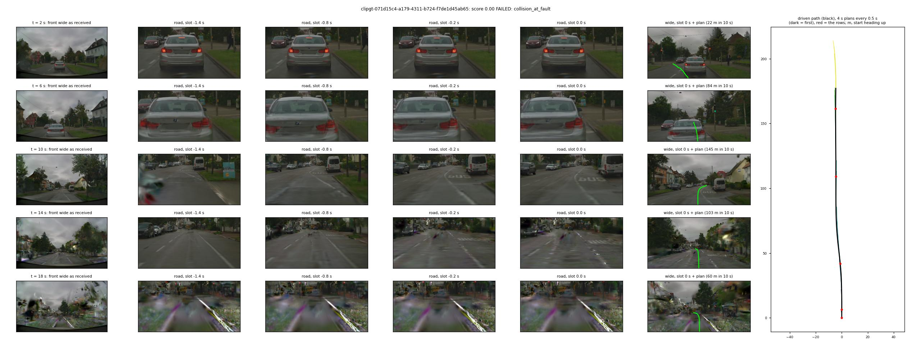
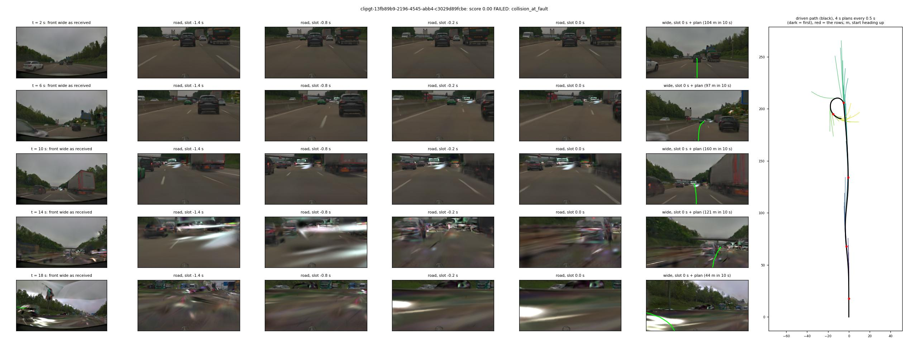
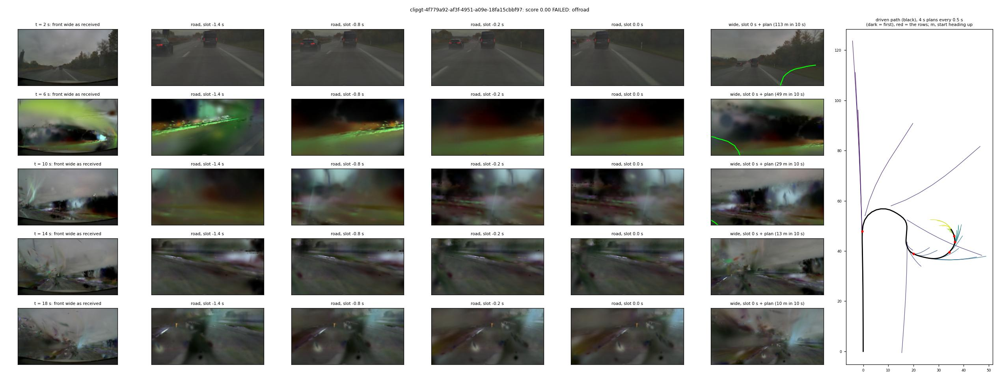
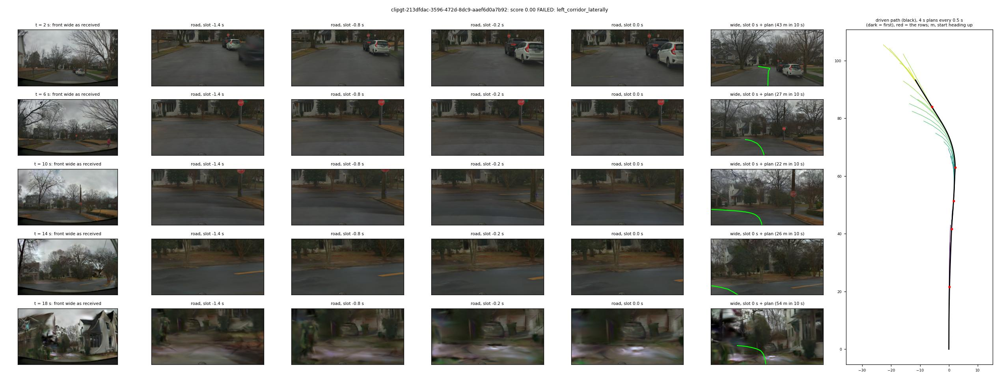

# PAI1: the PAI track locally, and our driver zero-shot (2026-10-09)

A cheap read before spending a shared submission on the Physical AI AV track. One day, Tokyo box (RTX 3090), AlpaSim unmodified at the
deployed commit 0bb4c4b, containers as shipped. Code: `lib/pai_core.py`, `lib/pai_driver.py`, `scripts/pai_scenes.py`, `pai_fetch.sh`,
`pai_run.sh`, `pai_report.py`; how to run: [docs/alpasim.md](../../../docs/alpasim.md#pai-track-on-the-tokyo-box-measured-2026-10-09).
Runs on the Tokyo box under `/data/runs/alpasim/pai1/runs/`: `s1` (1 scene), `a10_c4` (10 scenes, a plan per call), `b10_every5`
(a plan every 0.5 s), `c10_harm` (a plan per call, Harmonizer on). Nothing was registered, warmed up or submitted.

## Answers

1. **The PAI stack runs on one RTX 3090.** `nvcr.io/nvidia/nre/nre-ga:26.04` pulls without an NGC login; `+e2e_challenge=dev` runs
   after one change (the Harmonizer weights cannot be fetched from inside the renderer container; they are mounted, or the flag is
   removed, which is the public leaderboard's renderer). Unharmonised: renderer 4.6 GiB for one scene, 18.1-18.7 GiB peak at 4 concurrent
   rollouts; about 100 s per scene sequential, about 60 s per scene at 4 concurrent; 4 concurrent with the driver on the same card is
   about 23 of 24 GiB.
2. **Zero-shot, our best nuPlan driver lands at the bottom of the PAI board.** `P2H10-F-s0`, serving-side adaptation only, on 10 curated
   validation scenes spread over the reference difficulty: mean scene score **0.154** (8 zeros, 1 full score); 0.157 with one plan per
   0.5 s instead of per call, 0.154 with the Harmonizer on (the references' renderer): the same 8 scenes at zero in all three runs. On the same 10 scenes the organisers' references score 0.44 (Alpamayo 1), 0.43 / 0.10 (VAVAM,
   linear / nonlinear MPC) and 0.00-0.22 (five undocumented policies); the leaderboard's team median is 0.51. The step to 30-50 scenes
   was not taken: three runs agree scene by scene, and no result in that range changes the reading.
3. **A PAI entry needs training, not serving changes.** The frames the model is fed are geometrically right; it fails on behaviour the
   nuPlan track never asked of it: 4 of 8 zeros are collisions with a vehicle ahead (stopped at a light, a slowing queue), 3 are speed
   held or raised into a slow manoeuvre, 1 is a spin at the hand-over at 24 m/s. Details and cost below.

## Scores (10 scenes, 1 rollout; references: mean of their 3 rollouts, Harmonizer on)

| Row | Mean scene score | Score 1 | Zeros | at-fault collision | offroad | left corridor | Slow (0 < s < 1) |
|---|--:|--:|--:|--:|--:|--:|--:|
| **P2H10-F-s0, a plan per call (10 Hz)** | 0.1538 | 1 | 8 | 4 | 2 | 2 | 1 |
| **P2H10-F-s0, a plan per 0.5 s** | 0.1570 | 1 | 8 | 3 | 3 | 2 | 1 |
| **P2H10-F-s0, a plan per call, Harmonizer on (the references' renderer)** | 0.1539 | 1 | 8 | 3 | 2 | 3 | 1 |
| alpamayo1 (reference) | 0.4382 | 3 | 4 | 3% | 10% | 37% | |
| vavam-linear (reference; linear MPC, not available in the competition) | 0.4265 | 2 | 3 | 20% | 0% | 23% | |
| alternative_4 (reference) | 0.2186 | 1 | 7 | 10% | 20% | 40% | |
| alternative_3 (reference) | 0.2001 | 2 | 7 | 10% | 30% | 30% | |
| alternative_1 (reference) | 0.1005 | 1 | 8 | 20% | 30% | 30% | |
| alternative_2 (reference) | 0.1000 | 1 | 9 | 10% | 40% | 50% | |
| vavam-nonlinear (reference) | 0.0995 | 0 | 7 | 13% | 33% | 47% | |
| alternative_5 (reference) | 0.0000 | 0 | 10 | 10% | 50% | 50% | |

Reference columns for the three failure kinds are shares of their 30 rollouts. On all 441 validation scenes the references score
0.550 (alpamayo1), 0.314 (vavam-linear), 0.110 (vavam-nonlinear), 0.058-0.169 (alternatives): these 10 scenes are a little harder than
the suite for alpamayo1 (0.44 vs 0.55), equal on the mean over the eight subjects (0.198 vs 0.195).

| Scene | Reference mean | alpamayo1 | 10 Hz | why | per 0.5 s | why | Fails at (s after start) | Speed at hand-over m/s | Log mean speed m/s | What happens |
|---|--:|--:|--:|---|--:|---|--:|--:|--:|---|
| 7a824ffa | 0.00 | 0.00 | 0.00 | left corridor | 0.00 | left corridor | 3.4 | 5.9 | 2.5 | plans 28 m in 4 s where the log crawls; not viewed |
| 9ea70552 | 0.04 | 0.00 | 0.00 | collision | 0.00 | collision | 9.9 | 10.2 | 7.6 | front collision; not viewed |
| 213dfdac | 0.08 | 0.65 | 0.00 | left corridor | 0.00 | left corridor | 13.8 | 10.4 | 7.5 | stop-sign T junction: a wide left turn, 4 m from the logged path |
| 94877a4a | 0.11 | 0.00 | 0.00 | offroad | 0.00 | offroad | 13.2 | 12.8 | 11.9 | not viewed |
| a28b6685 | 0.12 | 1.00 | 0.00 | collision | 0.00 | offroad | 1.5 | 0.5 | 2.9 | night, pulling out behind a parked car: the first plans bend into it |
| 5d794411 | 0.17 | 0.00 | 1.00 | | 1.00 | | | 10.7 | 10.6 | |
| 4f779a92 | 0.24 | 0.31 | 0.00 | offroad | 0.00 | offroad | 0.5 after hand-over | 23.9 | 25.2 | motorway: yaw -0.63 rad within 0.5 s of the hand-over, spin |
| 13fb89b9 | 0.29 | 1.00 | 0.00 | collision | 0.00 | collision | 4.2 | 8.8 | 9.5 | motorway queue: accelerates (39 m in 4 s) into the slowing car ahead |
| 49597f01 | 0.38 | 0.42 | 0.54 | progress 0.43 | 0.57 | progress 0.46 | | 22.3 | 21.1 | hit from behind (not at fault) after slowing; the rollout ends there |
| 071d15c4 | 0.54 | 1.00 | 0.00 | collision | 0.00 | collision | 5.9 | 0.0 | 4.3 | red light behind a stopped car: creeps, then drives into it |

"Not viewed": the kind and the numbers are from the logs, no figure of that scene was looked at. Full table with distances:
[pai/table_10.md](pai/table_10.md); the scene sample (40 scenes, the first 10 run): [pai/pai_scenes_40.tsv](pai/pai_scenes_40.tsv).

## What the model was fed, and what it planned

Each figure is one scene of `a10_c4`. Rows are t = 2, 6, 10, 14, 18 s. Columns: the front-wide JPEG as delivered; the openpilot road
frame of four of the eight policy slots (all rendered frames, none synthesised); the wide frame of the newest slot with the plan
projected onto the road; right, the driven path (black) with every fifth 4 s plan.

`frames_071d15c4.jpg`. Look at row 1 against row 2: stationary behind a car at a red light, the plan is short but not zero (4 m in 4 s)
and bends right; by 6 s the road frame is filled by the car's boot. After the collision the run continues to 180 m, twice the logged
86 m, and rows 4-5 show what the renderer returns outside the recorded corridor.

`frames_13fb89b9.jpg`. Row 1 to row 2: a slowing queue, the plan asks for 104 m in 10 s and the car ahead grows in the road frame
until contact at 4.2 s. The loop in the path afterwards is the vehicle model after the collision.

`frames_4f779a92.jpg`. Row 1: 24 m/s on a straight motorway, 0.3 s after the hand-over the plan already points off the road to the
right. Before the hand-over the plans are sound (88 m in 4 s, 2.6 m left on a gentle left curve); in the three steps after it the ego
yaws -0.13 rad against that plan, the history then shows a turn, and the plan continues it (the yaw-rate continuation of decision 205).
The first plan is 8 % short of the current speed (11.0 m in the first 0.5 s at 23.9 m/s), a braking reference of about -7 m/s^2 for the
nonlinear MPC, which CONTROLLER_TUNING.md names as a source of zig-zag steering. One scene; the cause of the first kick is not isolated.

`frames_213dfdac.jpg`. Rows 2-3: the left turn at the T junction is planned and driven, wide and late; the score is zero because the
path leaves the 4 m corridor around the log.

## What was substituted or guessed (serving side, no training)

| Input | nuPlan track, as trained and served | PAI, as served here |
|---|---|---|
| Camera | CAM_F0, pinhole, 1.52 m high, 1.79 m ahead of the rear axle | `camera_front_wide_120fov` only, f-theta from `start_session` (forward polynomial, principal point, `linear_cde`), 1920 x 1080 native and delivered in all 10 scenes; 1.22-1.58 m high, 1.70-2.07 m ahead (three vehicle builds in 10 scenes). Both openpilot frames (road, wide) sampled from it at level rig axes, 100 % coverage. The other five cameras are dropped undecoded |
| History frames | 2 Hz keyframes; 6 of 8 policy slots synthesised by a road-plane warp | 10 Hz frames: all 8 slots (t0 - 1.4 .. t0 at 0.2 s) are rendered frames from 1.4 s on. Before that (14 calls per scene, all inside the 1.7 s of forced log replay) the oldest frame is back-warped |
| Frame pairs | (slot - 0.2 s, slot), first pair starts from a zero image | the same; the 0.1 s frames in between are not used |
| Shutter | global | rolling, top to bottom, 30 ms; treated as one instant (`frame_end_us`) |
| Ego state | 4 poses at 0.5 s, DynamicState velocity / acceleration | the same, poses interpolated from the 10 Hz egomotion; rig origin taken as the rear axle (the bounding box centre is 1.47 m ahead of it in a 5.21 m vehicle, consistent) |
| Command | 4-way from the route's first waypoint beyond 5 m (y > 2 m left, < -2 m right) | the same rule. It flips often here: 46 % left, 33 % right, 21 % straight over the 1 986 decisions, with the first waypoint 40 m ahead |
| Decision rate | 2 Hz, one plan per call | a plan per call at 10 Hz (27 ms alone, 48 ms median at 4 concurrent sessions), or one per 0.5 s with the cached plan in between: no difference in score |
| Traffic side | right-hand unless told | right-hand; the driver is not told the country |
| Scene | 5.5 s, 10 decisions, log-replay traffic, no physics | 20 s, 200 decisions, 1.7 s forced replay, ego physics on the ground mesh, nonlinear MPC |

Looks broken in the frames: nothing in the geometry (horizon, lane perspective and the projected plans line up in every viewed frame).
What is new to the model is in the content: a bonnet at the bottom of the wide frame, night and rain scenes, motorway speeds, and, once
the ego is ahead of or beside the logged path, reconstruction artefacts that fill the frame (rows 4-5 of every figure). The driver
outruns the log in most scenes (driven distance up to twice the logged one), so it produces these frames itself.

## What a serious entry would need

- **Longitudinal behaviour behind traffic.** Half the zeros. The nuPlan track is 5 s of log-replay traffic; here 20 s behind real
  queues and lights. This is training data (stopped and slowing leads, standstill), not a serving switch.
- **Speed tied to the log's regime.** The scene score needs only 80 % of the log's progress inside a 4 m corridor; driving faster than
  the log leaves the reconstructed corridor and the map.
- **Hand-over at speed.** One spin at 24 m/s, cause not isolated; the plan's first half second should match the current speed
  (the linear resampling of 0.5 s points does not), and the controller gains are a submission parameter.
- **Data to adapt on.** `nvidia/PhysicalAI-Autonomous-Vehicles` (driving logs: camera, egomotion, labels; gated, the token on the Tokyo
  box reads it; 246 TB in total, so a front-wide subset has to be chosen) and the 1 761-scene curated NuRec training split for
  closed-loop rollouts (about 3 TB). Neither was downloaded. The GPU box has no room for either, so training and closed-loop evaluation
  would share the two 3090s of the Tokyo box.
- **Cost of the 441-scene validation split on this box, extrapolated from 10 scenes, not run:** download about 760 GB (26 h at the
  8 MB/s measured); one rollout per scene 7.5 h on one card at 4 concurrent, half that on two; the references' 3 rollouts 22 h;
  output about 200 GB with videos. With the Harmonizer on (the dev preset as
  shipped, the references' setting) the same 10 scenes took 4 436 s instead of 621 s (7.1x): 54 h per rollout of the split on one card.

## Limits

10 scenes, one checkpoint, one seed, one rollout each against the references' 3; the unharmonised runs are the public leaderboard's
setting, the Harmonizer run the references'. The official suite is internal and only "similar to" the public scenes. Failure kinds of three scenes are from
logs only. The simulator's determinism was not checked on this track. No controller-gain, command-rule or camera (tele) variant was run.

## Cost

About 2 h 45 min wall on the Tokyo box (17:15-20:00 JST): 54 min for the renderer image (13.3 GB) with the first 10 scenes (17 GB,
48 min) alongside; 1 + 10 + 10 scenes unharmonised in 23 min of one card; the Harmonizer run 74 min. Scene downloads 20.6 GB of the
100 GB allowance (12 scenes: two of the next 30 landed before the download was stopped), plus the image and the Harmonizer weights
(1.4 GB). Disk: `/data/datasets/nurec` 26 GB, `/data/runs/alpasim/pai1` 14 GB.

## Proposed decision text (not yet in research/decisions.md; main numbers it)

AlpaSim PAI track, zero-shot (2026-10-09). The PAI simulator runs on one Tokyo 3090 (renderer 4.6 GiB per scene, 18.7 GiB at 4
concurrent, about 60 s per scene; image pulled without an NGC login). `P2H10-F-s0` served with a PAI adapter (front-wide f-theta camera
to openpilot frames, all 8 slots real 10 Hz frames, no training) scores 0.154 mean scene score on 10 curated validation scenes spread
over reference difficulty (8 zeros: 4 at-fault collisions with a vehicle ahead, 2 offroad, 2 left corridor), 0.157 with 2 Hz
replanning and 0.154 with the Harmonizer on (the same 8 scenes at zero), against 0.44 for Alpamayo 1 on the same scenes and a leaderboard median of 0.51. The model's frames are geometrically
correct; the failures are longitudinal behaviour behind traffic, speed above the log, and one spin at a 24 m/s hand-over. Execution
evidence on 10 scenes, one seed. Consequence: no PAI submission of a zero-shot nuPlan checkpoint; a PAI entry is a training project on
PAI data, to be weighed against the nuPlan track's remaining work before 2026-10-31.
