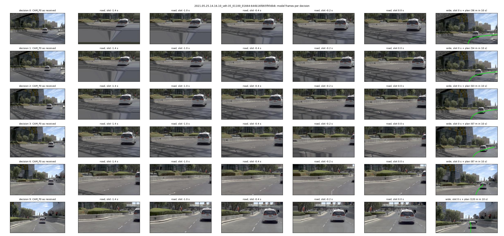
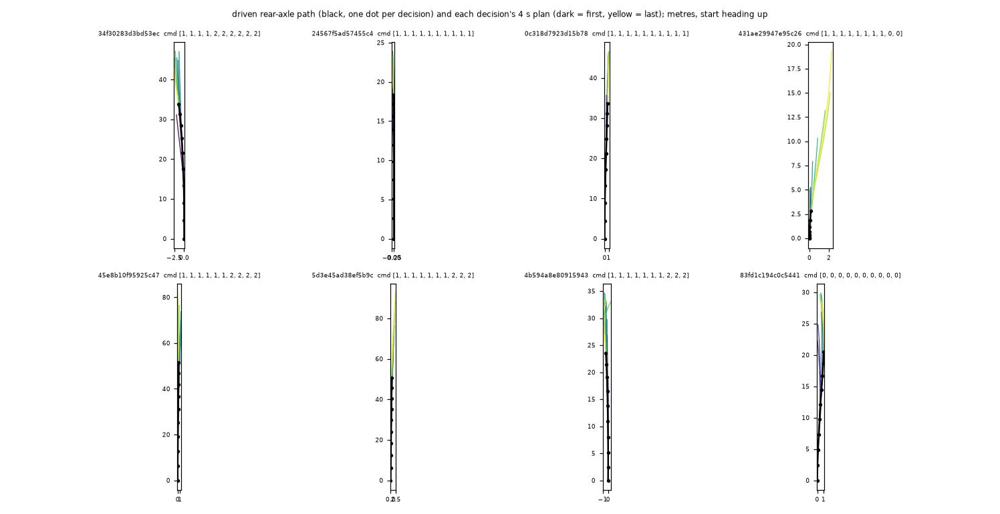

# SH30 as an AlpaSim nuPlan-track driver: execution smoke (2026-10-08)

Execution evidence, not a score claim: 48 public navtest scenes of one Las Vegas log family (part001), one run, seed 0 (`SH30-F-s0`), native
(Docker-free) AlpaSim at 0bb4c4b. Code: `experiments/alpasim/lib/sh30_core.py` (one causal decision of the NAVSIM serving path),
`lib/sh30_driver.py` (EgodriverService), `scripts/run.sh <dir> sh30`, `scripts/sh30_check.py` (offline), `scripts/sh30_report.py` (tables, figures).
Runs on the box under `$DATA_DIR/runs/alpasim/`: `sh30_check/20261008-124219`, `sh30_s1/20261008-124357` (1 scene, tap),
`sh30_s3_{backwarp,zero}/20261008-124847` (3 scenes, tap), `sh30_full48_c8/20261008-125144`; LTF reference `ltf_full48_c8/20261008-121920`.

## Result

| run | scenes | mean scene score | score 1 | score 0 | zeros by reason |
|:--|--:|--:|--:|--:|:--|
| SH30-F-s0, cold start `backwarp` | 48 | 0.9465 | 35 | 2 | 2 collision_at_fault (1 lateral, 1 front; both while slowing below 3 m/s) |
| shipped LTF sample | 48 | 0.8735 | 34 | 5 | 1 offroad, 4 left_corridor_laterally |

480 `drive` calls, 480 model inferences, 0 inference errors, 0 input errors, no fallback path exists in the driver. Per-scene table at the end.

## Offline checks before the simulator (`sh30_check.py`, 300 navtest tokens incl. the 48 scene tokens)

The online core fed a token's real JPEGs and index ego states reproduces the stored serving path: vision tokens vs the pp_prep W cache relative
error 0.08 % (max abs 0.053), ego features identical, exported 8 poses vs the bench prediction file max 0.045 m (fp16).

Cold start (only the m newest keyframes and states given; AlpaSim decisions 0 / 1 / 2 have m = 1 / 2 / 3). Mean distance of the 8 poses (m):

| rule | m = 1: vs full plan / vs log / x at 4 s | m = 2 | m = 3 |
|:--|:--|:--|:--|
| full history (reference) | 0 / 0.54 / 0 | | |
| `backwarp` (default) | 0.89 / 1.03 / -1.37 | 0.38 / 0.64 / -0.48 | 0.15 / 0.55 / +0.05 |
| `zero` | 5.39 / 5.43 / +7.03 | 0.58 / 0.75 / +0.65 | 0.22 / 0.57 / +0.25 |

`backwarp` is closer at every m; with one keyframe `zero` (one valid slot, no image-pair motion cue) plans 7 m too far at 4 s. In the simulator
(3 scenes, both rules): both 3 / 3 at score 1; mean lateral distance to the log 0.47 m (`backwarp`) vs 2.07 m (`zero`); `zero`'s first plan of the
right-turn scene bends left (+2.3 m at 4 s).

## Latency and memory (48-scene run, 8 concurrent rollouts, job pinned to 16 cores, card shared with the renderer)

| stage, ms per `drive` | median | p95 | max |
|:--|--:|--:|--:|
| frames: CPU ego-motion warp of 6-7 slot frames (8 threads) | 59.5 | 74.5 | 91.9 |
| encode: vision encoder, 8 image pairs, fp16 | 20.1 | 39.0 | 53.7 |
| policy: adapter + policy | 17.4 | 29.7 | 41.3 |
| wait for the single inference lock | 0.0 | 65.5 | 207.4 |
| total inside `drive` | 105.3 | 166.4 | 292.5 |
| CAM_F0 JPEG decode + model-frame packing (in `submit_image_observation`, not in `drive`) | 47.9 | 67.6 | 96.0 |

Runtime-side `drive` RPC mean 147 ms (LTF 41 ms). One rollout alone (1-scene run, serial warp): frames 176, encode 17, policy 13.5 ms; the
threaded warp measured alone is 44 ms. GPU work is ~37 ms; the "0.1 s of model work" target is missed on the CPU warp (27 ms per frame on one
core, numpy + cv2) and on lock queueing, not on the network. Driver VRAM 3.5 GiB peak (nvidia-smi; torch max allocated 2.77 GiB), RSS 2.6 GiB:
far below 16 GiB. 48 scenes took 203 s (LTF: 142 s).

## Figures

*What to look at:* scene `...644b16fd65f956b8` (right turn), decisions 0, 1, 2, 3, 6, 9. Column 1 the JPEG as received, columns 2-6 the road
model frame of five of the eight policy slots, last column the wide frame at t0 with the plan drawn on the road 1.87 m below the camera. Rows 0-2
are the cold start: the slots older than the first keyframe are that frame re-projected backwards (grey fill at the bottom, the lead car does not
shrink: static-world warp). The plan lies on the lane and follows the bend in every row.

*What to look at:* first 8 sessions of the 48-scene run. Black = driven rear-axle path with one dot per decision, coloured = each decision's 4 s
plan (dark first, yellow last). Plans continue the driven path without a lateral or heading offset (frame and lever-arm check).

## NAVSIM cross-check (a scene `<log>-<token>` starts 1.5 s before the token, so decision 3 is the token's t0)

- Route-rule command vs NAVSIM `driving_command`: 40 / 48 agree; 6 of the 8 disagreements are route `left` where NAVSIM says `straight`.
- Online plan vs the stored offline plan of the same token: 1.64 m mean over the 8 poses (offline vs log 0.56 m, online vs log 1.82 m). The
  online input differs by then: rendered instead of real frames, closed-loop state (vx 0.44 m/s, ax 0.56 m/s^2 mean abs difference), `vy`
  reported as 0 by the simulator (NAVSIM: 0.1-0.2 m/s), and the command in 8 scenes. Not decomposed.

## Per-scene table and driver counters (generated: `sh30_report.py table --runs sh30=... ltf=... --navsim`)

Scenes: 48 common to all runs. Score = AlpaSim scene score (0 on collision_at_fault / offroad / left_corridor_laterally, else min(progress / 0.8, 1)).

| run | scenes | mean scene score | score 1 | score 0 | zeros by reason | mean progress_clipped_rel | mean lateral dist to GT (m) |
|:--|--:|--:|--:|--:|--:|--:|--:|
| sh30 | 48 | 0.9465 | 35 | 2 | 2 collision_at_fault | 0.914 | 1.058 |
| ltf | 48 | 0.8735 | 34 | 5 | 1 offroad, 4 left_corridor_laterally | 0.898 | 1.066 |

| scene | sh30 score | sh30 progress | sh30 why not 1 | ltf score | ltf progress | ltf why not 1 |
|:--|--:|--:|:--|--:|--:|:--|
| 2021.05.25.14.16.10_veh-35_00083_00485-0c318d7923d15b78 | 1.000 | 0.888 |  | 1.000 | 0.833 |  |
| 2021.05.25.14.16.10_veh-35_00083_00485-24567f5ad57455c4 | 1.000 | 0.895 |  | 1.000 | 1.060 |  |
| 2021.05.25.14.16.10_veh-35_00083_00485-34f30283d3bd53ec | 1.000 | 0.894 |  | 1.000 | 0.892 |  |
| 2021.05.25.14.16.10_veh-35_00083_00485-431ae29947e95c26 | 1.000 | 1.301 |  | 1.000 | 1.301 |  |
| 2021.05.25.14.16.10_veh-35_00083_00485-45e8b10f95925c47 | 1.000 | 0.849 |  | 1.000 | 0.852 |  |
| 2021.05.25.14.16.10_veh-35_00083_00485-4b594a8e80915943 | 1.000 | 0.894 |  | 1.000 | 1.054 |  |
| 2021.05.25.14.16.10_veh-35_00083_00485-5d3e45ad38ef5b9c | 1.000 | 0.912 |  | 1.000 | 0.865 |  |
| 2021.05.25.14.16.10_veh-35_00083_00485-83fd1c194c0c5441 | 1.000 | 0.836 |  | 1.000 | 1.101 |  |
| 2021.05.25.14.16.10_veh-35_00083_00485-c9b12b21fa7c57fd | 0.809 | 0.648 | progress 0.65 | 1.000 | 1.028 |  |
| 2021.05.25.14.16.10_veh-35_01100_01664-025b657634505df3 | 1.000 | 0.835 |  | 1.000 | 0.880 |  |
| 2021.05.25.14.16.10_veh-35_01100_01664-067d731005885300 | 1.000 | 1.042 |  | 0.936 | 0.749 | progress 0.75 |
| 2021.05.25.14.16.10_veh-35_01100_01664-08b6a130aaa35629 | 1.000 | 0.922 |  | 0.715 | 0.572 | progress 0.57 |
| 2021.05.25.14.16.10_veh-35_01100_01664-1893fb783df95146 | 0.943 | 0.755 | progress 0.75 | 0.000 | 0.653 | left_corridor_laterally |
| 2021.05.25.14.16.10_veh-35_01100_01664-218adf8c450058eb | 1.000 | 1.173 |  | 1.000 | 1.295 |  |
| 2021.05.25.14.16.10_veh-35_01100_01664-368cb65e8fef57b7 | 0.989 | 0.791 | progress 0.79 | 1.000 | 1.059 |  |
| 2021.05.25.14.16.10_veh-35_01100_01664-41d7b533797c5209 | 1.000 | 1.083 |  | 1.000 | 0.858 |  |
| 2021.05.25.14.16.10_veh-35_01100_01664-4c775cb227b0519d | 1.000 | 1.045 |  | 1.000 | 0.879 |  |
| 2021.05.25.14.16.10_veh-35_01100_01664-4ccc9e33aa795ef1 | 1.000 | 1.198 |  | 1.000 | 1.091 |  |
| 2021.05.25.14.16.10_veh-35_01100_01664-644b16fd65f956b8 | 1.000 | 1.103 |  | 0.855 | 0.684 | progress 0.68 |
| 2021.05.25.14.16.10_veh-35_01100_01664-6fbe0e06902e5304 | 0.967 | 0.774 | progress 0.77 | 1.000 | 1.055 |  |
| 2021.05.25.14.16.10_veh-35_01100_01664-6fed9368351f54d5 | 0.000 | 0.743 | collision_at_fault | 0.986 | 0.789 | progress 0.79 |
| 2021.05.25.14.16.10_veh-35_01100_01664-78b4153a6d3e5b33 | 1.000 | 0.861 |  | 1.000 | 0.831 |  |
| 2021.05.25.14.16.10_veh-35_01100_01664-82cd122751085a80 | 0.992 | 0.793 | progress 0.79 | 0.912 | 0.730 | progress 0.73 |
| 2021.05.25.14.16.10_veh-35_01100_01664-9215555823945665 | 0.000 | 0.770 | collision_at_fault | 1.000 | 0.948 |  |
| 2021.05.25.14.16.10_veh-35_01100_01664-98017c16248a5f54 | 1.000 | 0.889 |  | 1.000 | 0.909 |  |
| 2021.05.25.14.16.10_veh-35_01100_01664-a41f538fa8e25be0 | 0.954 | 0.763 | progress 0.76 | 1.000 | 0.816 |  |
| 2021.05.25.14.16.10_veh-35_01100_01664-c50b9b8950ba5347 | 1.000 | 1.000 |  | 0.926 | 0.740 | progress 0.74 |
| 2021.05.25.14.16.10_veh-35_01100_01664-dd9b1479609c5c59 | 0.966 | 0.773 | progress 0.77 | 0.000 | 0.427 | offroad |
| 2021.05.25.14.16.10_veh-35_01100_01664-e83be8437b0c5862 | 1.000 | 0.966 |  | 1.000 | 0.883 |  |
| 2021.05.25.14.16.10_veh-35_01100_01664-f02b15cc225b5d9a | 1.000 | 0.917 |  | 1.000 | 0.856 |  |
| 2021.05.25.14.16.10_veh-35_01100_01664-fe800ded24045b44 | 1.000 | 0.809 |  | 1.000 | 1.086 |  |
| 2021.05.25.14.16.10_veh-35_01690_02183-0b57b00279885fd4 | 1.000 | 0.906 |  | 1.000 | 0.984 |  |
| 2021.05.25.14.16.10_veh-35_01690_02183-0c77bbb199f3589f | 1.000 | 0.901 |  | 0.927 | 0.742 | progress 0.74 |
| 2021.05.25.14.16.10_veh-35_01690_02183-19488eb3301f5d26 | 1.000 | 0.891 |  | 0.982 | 0.785 | progress 0.79 |
| 2021.05.25.14.16.10_veh-35_01690_02183-2313aa310e16503d | 1.000 | 0.894 |  | 0.000 | 0.645 | left_corridor_laterally |
| 2021.05.25.14.16.10_veh-35_01690_02183-2cd1545c4c835ead | 1.000 | 0.978 |  | 1.000 | 1.029 |  |
| 2021.05.25.14.16.10_veh-35_01690_02183-30f09e001cf55013 | 1.000 | 0.972 |  | 1.000 | 0.819 |  |
| 2021.05.25.14.16.10_veh-35_01690_02183-3debd3d86b5850dd | 0.945 | 0.756 | progress 0.76 | 0.689 | 0.551 | progress 0.55 |
| 2021.05.25.14.16.10_veh-35_01690_02183-54e1cb577c0a5f7e | 0.943 | 0.755 | progress 0.75 | 1.000 | 0.937 |  |
| 2021.05.25.14.16.10_veh-35_01690_02183-75f9d978b4d757a2 | 1.000 | 0.880 |  | 1.000 | 1.059 |  |
| 2021.05.25.14.16.10_veh-35_01690_02183-a0e9cbedca0a56b7 | 1.000 | 0.939 |  | 1.000 | 1.000 |  |
| 2021.05.25.14.16.10_veh-35_01690_02183-b6968f154bfb5a5d | 1.000 | 1.438 |  | 1.000 | 1.438 |  |
| 2021.05.25.14.16.10_veh-35_01690_02183-d3badb5f8c125e12 | 1.000 | 0.968 |  | 1.000 | 0.864 |  |
| 2021.05.25.14.16.10_veh-35_01690_02183-db180d0c665454aa | 1.000 | 0.941 |  | 1.000 | 1.056 |  |
| 2021.05.25.14.16.10_veh-35_01690_02183-ebfb953d479d5982 | 1.000 | 1.076 |  | 1.000 | 0.803 |  |
| 2021.05.25.14.16.10_veh-35_02482_02649-6507522e38405857 | 0.988 | 0.790 | progress 0.79 | 0.000 | 0.827 | left_corridor_laterally |
| 2021.05.25.14.16.10_veh-35_02482_02649-6f11adda2af357ff | 0.938 | 0.750 | progress 0.75 | 0.000 | 0.740 | left_corridor_laterally |
| 2021.05.25.14.16.10_veh-35_02482_02649-8e9f743d92c05d10 | 1.000 | 0.913 |  | 1.000 | 1.039 |  |

### Driver `sh30` (20261008-125144)

Sessions closed 48; counters {"drive": 480, "inference": 480, "inference_error": 0, "input_error": 0, "state_rotated": 41, "cold": 144}; trajectory poses per response [41]; keyframes per decision k: k0: [1], k1: [2], k2: [3], k3: [4].
VRAM: driver process peak 3.52 GiB (nvidia-smi, 1 Hz), torch max allocated 2.77 GiB; runtime 203 s for 48 rollouts.

| stage (ms per `drive`) | median | p95 | max |
|:--|--:|--:|--:|
| frames | 59.5 | 74.5 | 91.9 |
| encode | 20.1 | 39.0 | 53.7 |
| policy | 17.4 | 29.7 | 41.3 |
| export | 0.2 | 0.3 | 0.6 |
| prep | 0.4 | 0.7 | 1.2 |
| wait | 0.0 | 65.5 | 207.4 |
| total | 105.3 | 166.4 | 292.5 |
| CAM_F0 JPEG decode + pack (in `submit_image_observation`) | 47.9 | 67.6 | 96.0 |

frames = CPU ego-motion warp of the slot frames; encode = vision encoder on the image pairs; policy = adapter + policy; export = lever arm + resampling; prep = session bookkeeping; wait = queueing for the single inference lock; total = inside `drive`.

NAVSIM cross-check at decision 3 (= the token's t0), 48 scenes:

- route command vs NAVSIM `driving_command` (rows NAVSIM, columns route rule): agreement 40 / 48

| NAVSIM \ route | left | straight | right | unknown |
|:--|--:|--:|--:|--:|
| left | 11 | 1 | 0 | 0 |
| straight | 6 | 24 | 1 | 0 |
| right | 0 | 0 | 5 | 0 |

- fed ego state minus the NAVSIM index (mean abs; the rollout is closed loop from 0.5 s on, so these are not errors of the driver alone): vx 0.44 m/s, vy 0.13 m/s, ax 0.56, ay 0.44 m/s^2, oldest history pose 0.22 m
- 8-pose plan, mean distance: online vs offline bench plan of the token 1.64 m; online vs logged future 1.82 m; offline bench plan vs logged future 0.56 m
