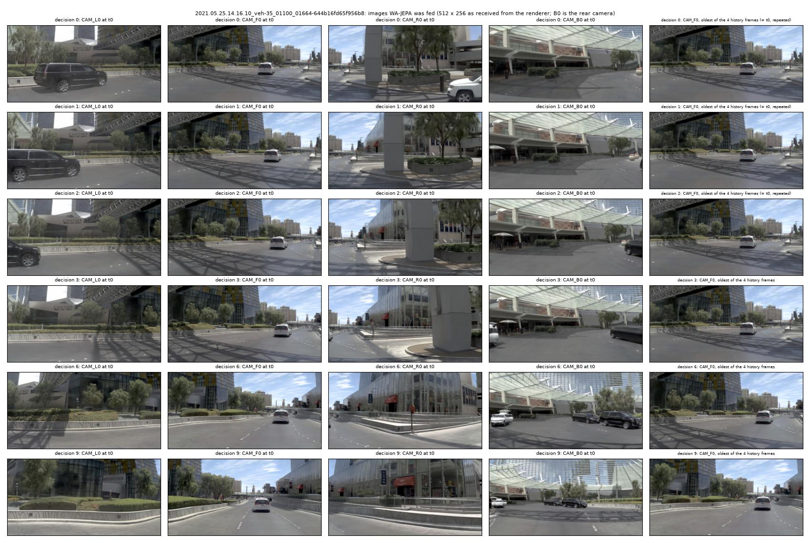
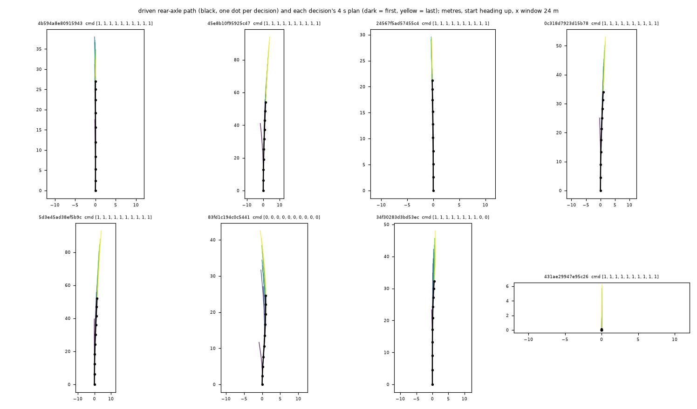

# WA-JEPA as an AlpaSim nuPlan-track driver: execution smoke (2026-10-08)

Execution evidence, not a score claim: the same 48 public navtest scenes of one Las Vegas log family (part001) as the SH30 smoke, one run per variant,
native (Docker-free) AlpaSim at 0bb4c4b. The model is AFARI-Research/WA-JEPA at bec2966 with the released weights (`model_state_dict.pt`) and its shipped
NAVSIM agent (`eval/navsim_agent.py` `WorldModelNavsimAgent.compute_trajectory`, config `configs/wa_jepa_navsim_epdms.yaml`, the path that scored navtest
EPDMS 91.71 in our devkit), called unmodified; nothing of theirs is patched. Code: `experiments/alpasim/lib/wajepa_core.py` (assembles the NAVSIM
`AgentInput` of one decision), `lib/wajepa_driver.py` (EgodriverService), `scripts/drivers/wajepa.sh` (`run.sh <dir> wajepa`), `scripts/wajepa_check.py`
(offline), `scripts/wajepa_swap.py` (input-source swap), `scripts/wajepa_report.py` (tables, figures; reuses `sh30_report.py`).
Runs on the box under `$DATA_DIR/runs/alpasim/`: `wajepa_check/20261008-161301`, `wajepa_s1/20261008-160746` (1 scene, tap), `wajepa_s3_repeat/20261008-161302`
and `wajepa_s3_cv/20261008-162208` (3 scenes, tap), `wajepa_full48_c8/20261008-162208` (fp32), `wajepa_bf16_full48_c8/20261008-162208`, `wajepa_swap/20261008-164236`;
references `sh30_full48_c8/20261008-125144`, `ltf_full48_c8/20261008-121920`.

## Result

| run | scenes | mean scene score | score 1 | score 0 | zeros by reason | mean progress_clipped_rel | mean lateral dist to GT (m) |
|:--|--:|--:|--:|--:|:--|--:|--:|
| WA-JEPA, fp32 (NAVSIM path), cold rule `repeat` | 48 | 0.9777 | 45 | 1 | 1 offroad | 0.933 | 0.644 |
| WA-JEPA, bf16 autocast (their HUGSIM adapter precision) | 48 | 0.9792 | 47 | 1 | 1 offroad (same scene) | 0.966 | 0.688 |
| SH30-F-s0, cold start `backwarp` | 48 | 0.9465 | 35 | 2 | 2 collision_at_fault | 0.914 | 1.058 |
| shipped LTF sample | 48 | 0.8735 | 34 | 5 | 1 offroad, 4 left_corridor_laterally | 0.898 | 1.066 |

480 `drive` calls, 480 model inferences, 0 inference errors, 0 input errors in both WA-JEPA runs; no fallback path exists in the driver. The zero is scene
`...00083_00485-5d3e45ad38ef5b9c` in both precisions (plans straight, lateral distance to the log 0.58 m, `min_distance_to_lane_boundary_m` 0, SH30 and LTF
pass it); cause not investigated. Below 1 in the fp32 run besides it: `...3debd3d86b5850dd` 0.932 and `...75f9d978b4d757a2` 0.999 (progress only). The two WA-JEPA
runs differ by 0.0015 in the mean and differ in precision only, which is the only run-to-run spread available here; one seed, 48 scenes of one log family, same day, same
box as the references: not a leaderboard number and no ranking claim between 0.9777 and 0.9465.
3-scene runs (`0c318d79`, `025b6576`, `644b16fd` = right turn; tap): cold rule `repeat` 3 / 3 at score 1, `cv` 3 / 3 at score 1, lateral distance to the log 0.42 / 3.42 / 0.81 m
vs 0.42 / 3.43 / 0.83 m (same order). The cold rules are indistinguishable (next section), so `repeat` (WA-JEPA's own closed-loop padding) is the default.

## What the draft claimed, checked against the WA-JEPA source

Read in `eval/navsim_agent.py` and `close_loop/hugsim_planner.py`; the rest by the offline check below.

| claim in the draft | check | verdict |
|:--|:--|:--|
| the agent reads `cameras[-4:]` x [cam_l0, cam_f0, cam_r0, cam_b0], resize 512 x 256 INTER_AREA, [-1, 1] | config `camera_names`, `frame_height/width`, `num_history_image_frames: 4`; builder code; the core asserts all of it at start-up | holds |
| decode like the builder's file path (cv2 BGR -> RGB) | builder `_image_tensor_from_camera`; core output vs NAVSIM `SceneLoader` -> `compute_trajectory`: max abs 0.0 m on 48 tokens | holds (bit-identical) |
| 4 poses relative to t0, t0 velocity / acceleration (body frame), one-hot [L, S, R, unknown] | builder reads `ego_pose` of the last 4 statuses, last status velocity / acceleration / `argmax(driving_command)`; same direct comparison | holds |
| flow noise re-seeded per call (`flow_inference_seed` 1) | config + `_make_inference_generator` (a fresh generator seeded with it on every `predict_trajectory` call); the bit-identical comparison below | holds |
| cold start repeats the oldest frame and pose | `hugsim_planner._history_indices` clamps to index 0 (frame and pose) | holds; kept as `repeat` |
| `import tomllib` in the driver | envs/wajepa is Python 3.10 | **wrong**, falls back to `tomli` |
| precision | the NAVSIM path is fp32 without autocast (tf32 is only set by their training script); their HUGSIM adapter runs fp32 weights under bf16 autocast | draft had fp32 only; added `WAJ_AMP=1` (autocast around the unmodified call) |
| dump | draft saved every decision of the first N sessions | now decision 3 of N sessions + all decisions of the first 3 (the swap check needs decision 3 of all 48) |

Nothing else needed changing: camera ids, rear-axle frame, route command rule (same function as the SH30 / LTF samples) and the 10 Hz export were already as
required. `wajepa_core.py` and `wajepa_driver.py` were untracked and never run before this work.

## Offline checks before the simulator (`wajepa_check.py`, 96 navtest tokens: the 48 scene tokens + 48 seed-0 draws)

The core fed a token's real CAM_L0 / F0 / R0 / B0 JPEGs of the 4 history frames and the index ego states, against the stored plans of the run that scored 91.71
(`runs/top10_t2/navsim/wajepa/20260926-122804/trajectory_cache/done_union.pkl`, shipped agent through the NAVSIM devkit, fp32, seed 1):

| quantity | mean | p99 | max |
|:--|--:|--:|--:|
| 8-pose distance to the stored plan (m) | 0.062 | 0.143 | 0.222 |
| largest single x / y difference per token (m) | 0.158 | 0.467 | 0.589 |
| largest heading difference per token (rad) | 0.0035 | 0.0196 | 0.0197 |

The 0.06 m is not the input assembly: on 48 of these tokens the same process through NAVSIM's own `SceneLoader` -> `compute_trajectory` returns plans bit-identical
to the core (max abs 0.0 m) and 0.064 m from the stored ones, so the residual is the export run itself (different card / library state; fp32 flow sampling over 4
steps amplifies kernel-level differences; not traced further). Both the core (0.526 m) and the stored plans (0.521 m) are as far from the logged future. No navtest
token had an all-zero command. bf16 autocast vs fp32 on 30 tokens: 0.066 m, the same size as the run-to-run residual.

Cold start (only the m newest keyframes given; AlpaSim decisions 0 / 1 / 2 have m = 1 / 2 / 3). Mean distance of the 8 poses (m) to the full-history plan, and to the log:

| rule | m = 1: vs full / vs log / x at 4 s | m = 2 | m = 3 |
|:--|:--|:--|:--|
| full history (reference) | 0 / 0.53 / 0 | | |
| `repeat` (default: missing frames and poses are the oldest) | 3.37 / 3.47 / -3.81 | 0.66 / 0.83 / +1.34 | 0.74 / 0.87 / +1.47 |
| `cv` (missing frames the oldest, missing poses run backwards at constant velocity) | 3.38 / 3.48 / -3.82 | 0.66 / 0.83 / +1.33 | 0.74 / 0.87 / +1.47 |

The two rules are the same to 0.01 m: WA-JEPA reads almost nothing from the history poses; what changes with m is the image stack. With one keyframe the 4 frames
are identical, the world looks frozen, and the plan is 3.8 m short at 4 s (p90 distance 5.8 m); with 2 or 3 keyframes it overshoots by 1.3-1.5 m. 144 of the 480
decisions (3 per scene) run in this regime. A warp-based fill like SH30's `backwarp` was not built: it changes images, which this driver is required to leave as received.

## Latency and memory (48-scene runs, 8 concurrent rollouts, job on one card shared with the renderer and with other lanes' pool jobs)

Contention caveat: other lanes' jobs (`ap2-prep` x4, an op_parity chain) were on the same three cards during these runs, so every GPU-side number is an upper bound;
no run had a card to itself. The 1.3 s fp32 median is also what the offline check measured (1.48 s, card 0, loaded) and what a 5-call profile gave (1.3-1.6 s; one
direct, non-pool run on card 1, `CUDA_VISIBLE_DEVICES=1`, outside the pool by mistake; it measured GPU kernel time 0.94 s per plan, 77 % of it in the fp32
memory-efficient attention kernel `fmha_cutlassF_f32_aligned_64x64` on this Blackwell card).

### Driver `wajepa`, fp32 (20261008-162208)

Sessions closed 48; counters {"drive": 480, "inference": 480, "inference_error": 0, "input_error": 0, "state_rotated": 41, "cold": 144}; trajectory poses per response [41]; keyframes per decision k: k0: [1], k1: [2], k2: [3], k3: [4].
VRAM: driver process peak 6.02 GiB (nvidia-smi, 1 Hz), torch max allocated 4.43 GiB; runtime 936 s for 48 rollouts.

| stage (ms per `drive`) | median | p95 | max |
|:--|--:|--:|--:|
| prep_in | 0.3 | 1.1 | 83.9 |
| infer | 1325.0 | 1615.7 | 2320.1 |
| prep | 0.5 | 0.9 | 1.3 |
| wait | 4735.1 | 7938.0 | 8458.1 |
| total | 6039.4 | 9325.5 | 9844.2 |
| one-camera JPEG decode + resize (in `submit_image_observation`) | 22.9 | 65.4 | 472.0 |

prep_in = AgentInput assembly; infer = the shipped agent's compute_trajectory (feature builder + 4-step flow sampling; fp32, or bf16 autocast when WAJ_AMP=1) incl. CUDA sync; prep = session bookkeeping; wait = queueing for the single inference lock; total = inside `drive`.

### Driver `wajepa`, bf16 autocast (20261008-162208)

Sessions closed 48; counters {"drive": 480, "inference": 480, "inference_error": 0, "input_error": 0, "state_rotated": 41, "cold": 144}; trajectory poses per response [41]; keyframes per decision k: k0: [1], k1: [2], k2: [3], k3: [4].
VRAM: driver process peak 6.19 GiB (nvidia-smi, 1 Hz), torch max allocated 4.53 GiB; runtime 301 s for 48 rollouts.

| stage (ms per `drive`) | median | p95 | max |
|:--|--:|--:|--:|
| prep_in | 0.2 | 0.8 | 4.2 |
| infer | 365.3 | 484.2 | 565.4 |
| prep | 0.5 | 0.8 | 1.5 |
| wait | 121.3 | 758.6 | 1205.5 |
| total | 482.3 | 1085.4 | 1599.1 |
| one-camera JPEG decode + resize (in `submit_image_observation`) | 28.1 | 44.2 | 63.9 |

prep_in = AgentInput assembly; infer = the shipped agent's compute_trajectory (feature builder + 4-step flow sampling; fp32, or bf16 autocast when WAJ_AMP=1) incl. CUDA sync; prep = session bookkeeping; wait = queueing for the single inference lock; total = inside `drive`.

The "0.1 s of model work per `Drive` call" target is missed by 13x in fp32 and ~4x in bf16 on the model call alone; `wait` is the queue of 8 rollouts behind the single
inference lock. AlpaSim steps synchronously (no RPC deadline), so slow calls cost wall time, not score; the budget of the submission rules (value shown only in the
submission status, not read) would be the constraint. Wall time for 48 scenes: 936 s fp32, 301 s bf16 (SH30 203 s, LTF 142 s). 1080p JPEG decode offline: median 20.1 ms,
p95 178 ms (loaded CPU). Driver VRAM: 6.02 GiB nvidia-smi peak fp32 (torch max allocated 4.43, reserved 5.32 GiB), 6.19 GiB bf16; far below 16 GiB.

## Figures

*What to look at:* scene `...644b16fd65f956b8` (right turn), decisions 0, 1, 2, 3, 6, 9. Columns 1-4 are the four images WA-JEPA was fed at t0 in the order
CAM_L0, F0, R0, B0 (left, front, right, rear views, as the config lists them); column 5 is the oldest of the 4 history frames. Rows 0-2 show the cold start: column 5
is the same frame as t0 (repeated). Compare with SH30's frame figure: here nothing is warped, the images are exactly the renderer output at 512 x 256, including its
artifacts on the side cameras.

*What to look at:* first 8 sessions of the 48-scene fp32 run. Black = driven rear-axle path with one dot per decision, coloured = each decision's 4 s plan (dark first,
yellow last). Plans start on and continue the driven path without lateral or heading offset (frame and lever-arm check: the rig is the rear axle). The dark first plans
of several scenes (e.g. `45e8b10f`, `83fd1c19`) bend sideways or run short: the m = 1 cold start. `83fd1c19` has route command left in all 10 decisions while the vehicle drives straight.

## Mismatches: what AlpaSim gives vs what WA-JEPA was trained and evaluated on

Decomposition (`wajepa_swap.py`): decision 3 of each of the 48 scenes (= the navtest token's t0) re-planned offline with every combination of the three input groups
taken from the simulator run (S) or from NAVSIM (N). Mean distance of the 8 poses (m), 48 tokens; arm name = images / state / command:

| arm | distance to the all-NAVSIM plan | distance to the logged future |
|:--|--:|--:|
| NNN (offline, as NAVSIM) | 0 | 0.46 |
| SNN (rendered images only) | 0.43 | 0.63 |
| NSN (simulator state only: 4 poses, velocity, acceleration) | 1.24 | 1.47 |
| NNS (route-rule command only) | 0.009 | 0.46 |
| SSS (all from the simulator = the online plan, recomputed) | 1.27 | 1.47 |

The state difference is the largest term, but it is not an input error: from 0.5 s on the car is driven by the controller, so at t0 it is not where the log is (vx 0.42 m/s,
ax 0.54 m/s^2 mean absolute difference), and a different state legitimately gives a different plan. The image gap (0.43 m) and the command (0.009 m) are the input-side gaps.

1. **Rendered frames.** MTGS reconstructions: visible texture and geometry artifacts on the side cameras (frames figure). Calibration (start_session vs the OpenScene log): AlpaSim
   cameras are pinhole (CAM_F0 / L0: fx 1571 / 1532, fy 1511 / 1496) with no distortion coefficients in the request, the real NAVSIM JPEGs come from f = 1545 with radial k1 = -0.356; so the rendered
   projection differs from the raw one the model was trained on (inferred from the calibration, no pixel-wise comparison made). Images alone move the plan by 0.43 m.
2. **Cold start.** 3 of 10 decisions per scene have 1 / 2 / 3 keyframes instead of 4 (see the table above); the largest single mismatch for the first decision (m = 1: 3.4 m mean).
3. **Command.** Route rule on the AlpaSim route (first waypoint >= 5 m away, |y| > 2 m) vs NAVSIM `driving_command` at decision 3: 42 / 48 agree (4 NAVSIM straight vs route left,
   1 NAVSIM left vs route straight, 1 NAVSIM straight vs route right); the bf16 run 43 / 48. Replacing it changes the plan by 0.009 m, i.e. this model ignores the command at these tokens.
   In scene `83fd1c19` the route command is left in all 10 decisions and the car kept going straight.
4. **vy.** The simulator's lateral velocity is ~0 after the first sample (mean |vy| 0.005 m/s at decision 3; NAVSIM index 0.1-0.2 m/s: 0.13 m/s mean absolute difference). The
   first sample of a rollout arrives unrotated (41 of 48 first decisions, handled by the guard shared with SH30).
5. **Acceleration.** `DynamicState` acceleration vs the NAVSIM index: 0.54 / 0.44 m/s^2 mean absolute difference (ax / ay), closed-loop effect plus a different source.
6. **2 Hz.** AlpaSim camera and decision rate is 2 Hz, matching the model's 0.5 s history stride; the 4 keyframes are matched by `frame_end_us` and were complete in every decision
   with 4 available (keyframes per decision k0-k3: 1, 2, 3, 4). No resampling.
7. **History poses.** The simulator's own rig poses (noise-free); NAVSIM's are nuPlan localization: oldest history pose differs by 0.23 m / 0.014 rad at decision 3. The model hardly uses them (cold table).
8. **Flow noise.** Config seed 1, re-applied per call, so every decision sees the same noise (as in the navtest 91.71 run and in their HUGSIM client).
9. **Precision.** fp32 (NAVSIM path, parity-checked) vs bf16 autocast (their closed-loop adapter): 0.066 m apart offline, 0.9777 vs 0.9792 in the simulator.
10. **Frame.** Plans are in the rear-axle frame; the AlpaSim rig is taken as the rear axle (rig_to_camera translation of CAM_F0 x 1.74 m) and the BEV figure shows no offset: inferred, not read from a rig definition.
    The 8 poses at 0.5 s are linearly interpolated to the 10 Hz trajectory by the LTF sample's functions (41 poses per response), then tracked by the controller; the model never sees its own tracking error.
11. **Rear camera.** Real in nuPlan and rendered here; it is black in HUGSIM, so the AlpaSim input is closer to training there than HUGSIM's.

## NAVSIM cross-check, fp32 run (generated: `wajepa_report.py table`)

NAVSIM cross-check at decision 3 (= the token's t0), 48 scenes:

- route command vs NAVSIM `driving_command` (rows NAVSIM, columns route rule): agreement 42 / 48

| NAVSIM \ route | left | straight | right | unknown |
|:--|--:|--:|--:|--:|
| left | 11 | 1 | 0 | 0 |
| straight | 4 | 26 | 1 | 0 |
| right | 0 | 0 | 5 | 0 |

- fed ego state minus the NAVSIM index (mean abs; the rollout is closed loop from 0.5 s on, so these are not errors of the driver alone): vx 0.42 m/s, vy 0.13 m/s, ax 0.54, ay 0.44 m/s^2, oldest history pose 0.23 m / 0.014 rad
- 8-pose plan, mean distance: online vs stored plan of the token 1.28 m; online vs logged future 1.47 m; stored plan vs logged future 0.45 m

## Per-scene table (generated: `wajepa_report.py table --runs wajepa=... sh30=... ltf=...`)

Scenes: 48 common to all runs. Score = AlpaSim scene score (0 on collision_at_fault / offroad / left_corridor_laterally, else min(progress / 0.8, 1)).

| scene | wajepa score | wajepa progress | wajepa why not 1 | sh30 score | sh30 progress | sh30 why not 1 | ltf score | ltf progress | ltf why not 1 |
|:--|--:|--:|:--|--:|--:|:--|--:|--:|:--|
| 2021.05.25.14.16.10_veh-35_00083_00485-0c318d7923d15b78 | 1.000 | 0.905 |  | 1.000 | 0.888 |  | 1.000 | 0.833 |  |
| 2021.05.25.14.16.10_veh-35_00083_00485-24567f5ad57455c4 | 1.000 | 1.052 |  | 1.000 | 0.895 |  | 1.000 | 1.060 |  |
| 2021.05.25.14.16.10_veh-35_00083_00485-34f30283d3bd53ec | 1.000 | 0.863 |  | 1.000 | 0.894 |  | 1.000 | 0.892 |  |
| 2021.05.25.14.16.10_veh-35_00083_00485-431ae29947e95c26 | 1.000 | 0.112 |  | 1.000 | 1.301 |  | 1.000 | 1.301 |  |
| 2021.05.25.14.16.10_veh-35_00083_00485-45e8b10f95925c47 | 1.000 | 0.899 |  | 1.000 | 0.849 |  | 1.000 | 0.852 |  |
| 2021.05.25.14.16.10_veh-35_00083_00485-4b594a8e80915943 | 1.000 | 1.003 |  | 1.000 | 0.894 |  | 1.000 | 1.054 |  |
| 2021.05.25.14.16.10_veh-35_00083_00485-5d3e45ad38ef5b9c | 0.000 | 0.933 | offroad | 1.000 | 0.912 |  | 1.000 | 0.865 |  |
| 2021.05.25.14.16.10_veh-35_00083_00485-83fd1c194c0c5441 | 1.000 | 1.018 |  | 1.000 | 0.836 |  | 1.000 | 1.101 |  |
| 2021.05.25.14.16.10_veh-35_00083_00485-c9b12b21fa7c57fd | 1.000 | 0.913 |  | 0.809 | 0.648 | progress 0.65 | 1.000 | 1.028 |  |
| 2021.05.25.14.16.10_veh-35_01100_01664-025b657634505df3 | 1.000 | 0.885 |  | 1.000 | 0.835 |  | 1.000 | 0.880 |  |
| 2021.05.25.14.16.10_veh-35_01100_01664-067d731005885300 | 1.000 | 1.065 |  | 1.000 | 1.042 |  | 0.936 | 0.749 | progress 0.75 |
| 2021.05.25.14.16.10_veh-35_01100_01664-08b6a130aaa35629 | 1.000 | 1.067 |  | 1.000 | 0.922 |  | 0.715 | 0.572 | progress 0.57 |
| 2021.05.25.14.16.10_veh-35_01100_01664-1893fb783df95146 | 1.000 | 0.863 |  | 0.943 | 0.755 | progress 0.75 | 0.000 | 0.653 | left_corridor_laterally |
| 2021.05.25.14.16.10_veh-35_01100_01664-218adf8c450058eb | 1.000 | 0.835 |  | 1.000 | 1.173 |  | 1.000 | 1.295 |  |
| 2021.05.25.14.16.10_veh-35_01100_01664-368cb65e8fef57b7 | 1.000 | 0.977 |  | 0.989 | 0.791 | progress 0.79 | 1.000 | 1.059 |  |
| 2021.05.25.14.16.10_veh-35_01100_01664-41d7b533797c5209 | 1.000 | 0.910 |  | 1.000 | 1.083 |  | 1.000 | 0.858 |  |
| 2021.05.25.14.16.10_veh-35_01100_01664-4c775cb227b0519d | 1.000 | 0.911 |  | 1.000 | 1.045 |  | 1.000 | 0.879 |  |
| 2021.05.25.14.16.10_veh-35_01100_01664-4ccc9e33aa795ef1 | 1.000 | 1.207 |  | 1.000 | 1.198 |  | 1.000 | 1.091 |  |
| 2021.05.25.14.16.10_veh-35_01100_01664-644b16fd65f956b8 | 1.000 | 1.091 |  | 1.000 | 1.103 |  | 0.855 | 0.684 | progress 0.68 |
| 2021.05.25.14.16.10_veh-35_01100_01664-6fbe0e06902e5304 | 1.000 | 0.878 |  | 0.967 | 0.774 | progress 0.77 | 1.000 | 1.055 |  |
| 2021.05.25.14.16.10_veh-35_01100_01664-6fed9368351f54d5 | 1.000 | 0.922 |  | 0.000 | 0.743 | collision_at_fault | 0.986 | 0.789 | progress 0.79 |
| 2021.05.25.14.16.10_veh-35_01100_01664-78b4153a6d3e5b33 | 1.000 | 1.064 |  | 1.000 | 0.861 |  | 1.000 | 0.831 |  |
| 2021.05.25.14.16.10_veh-35_01100_01664-82cd122751085a80 | 1.000 | 1.051 |  | 0.992 | 0.793 | progress 0.79 | 0.912 | 0.730 | progress 0.73 |
| 2021.05.25.14.16.10_veh-35_01100_01664-9215555823945665 | 1.000 | 0.826 |  | 0.000 | 0.770 | collision_at_fault | 1.000 | 0.948 |  |
| 2021.05.25.14.16.10_veh-35_01100_01664-98017c16248a5f54 | 1.000 | 0.889 |  | 1.000 | 0.889 |  | 1.000 | 0.909 |  |
| 2021.05.25.14.16.10_veh-35_01100_01664-a41f538fa8e25be0 | 1.000 | 1.014 |  | 0.954 | 0.763 | progress 0.76 | 1.000 | 0.816 |  |
| 2021.05.25.14.16.10_veh-35_01100_01664-c50b9b8950ba5347 | 1.000 | 1.073 |  | 1.000 | 1.000 |  | 0.926 | 0.740 | progress 0.74 |
| 2021.05.25.14.16.10_veh-35_01100_01664-dd9b1479609c5c59 | 1.000 | 0.931 |  | 0.966 | 0.773 | progress 0.77 | 0.000 | 0.427 | offroad |
| 2021.05.25.14.16.10_veh-35_01100_01664-e83be8437b0c5862 | 1.000 | 0.926 |  | 1.000 | 0.966 |  | 1.000 | 0.883 |  |
| 2021.05.25.14.16.10_veh-35_01100_01664-f02b15cc225b5d9a | 1.000 | 0.883 |  | 1.000 | 0.917 |  | 1.000 | 0.856 |  |
| 2021.05.25.14.16.10_veh-35_01100_01664-fe800ded24045b44 | 1.000 | 0.909 |  | 1.000 | 0.809 |  | 1.000 | 1.086 |  |
| 2021.05.25.14.16.10_veh-35_01690_02183-0b57b00279885fd4 | 1.000 | 0.883 |  | 1.000 | 0.906 |  | 1.000 | 0.984 |  |
| 2021.05.25.14.16.10_veh-35_01690_02183-0c77bbb199f3589f | 1.000 | 0.865 |  | 1.000 | 0.901 |  | 0.927 | 0.742 | progress 0.74 |
| 2021.05.25.14.16.10_veh-35_01690_02183-19488eb3301f5d26 | 1.000 | 1.030 |  | 1.000 | 0.891 |  | 0.982 | 0.785 | progress 0.79 |
| 2021.05.25.14.16.10_veh-35_01690_02183-2313aa310e16503d | 1.000 | 0.804 |  | 1.000 | 0.894 |  | 0.000 | 0.645 | left_corridor_laterally |
| 2021.05.25.14.16.10_veh-35_01690_02183-2cd1545c4c835ead | 1.000 | 0.888 |  | 1.000 | 0.978 |  | 1.000 | 1.029 |  |
| 2021.05.25.14.16.10_veh-35_01690_02183-30f09e001cf55013 | 1.000 | 0.958 |  | 1.000 | 0.972 |  | 1.000 | 0.819 |  |
| 2021.05.25.14.16.10_veh-35_01690_02183-3debd3d86b5850dd | 0.932 | 0.746 | progress 0.75 | 0.945 | 0.756 | progress 0.76 | 0.689 | 0.551 | progress 0.55 |
| 2021.05.25.14.16.10_veh-35_01690_02183-54e1cb577c0a5f7e | 1.000 | 0.907 |  | 0.943 | 0.755 | progress 0.75 | 1.000 | 0.937 |  |
| 2021.05.25.14.16.10_veh-35_01690_02183-75f9d978b4d757a2 | 0.999 | 0.799 | progress 0.80 | 1.000 | 0.880 |  | 1.000 | 1.059 |  |
| 2021.05.25.14.16.10_veh-35_01690_02183-a0e9cbedca0a56b7 | 1.000 | 0.971 |  | 1.000 | 0.939 |  | 1.000 | 1.000 |  |
| 2021.05.25.14.16.10_veh-35_01690_02183-b6968f154bfb5a5d | 1.000 | 1.438 |  | 1.000 | 1.438 |  | 1.000 | 1.438 |  |
| 2021.05.25.14.16.10_veh-35_01690_02183-d3badb5f8c125e12 | 1.000 | 0.994 |  | 1.000 | 0.968 |  | 1.000 | 0.864 |  |
| 2021.05.25.14.16.10_veh-35_01690_02183-db180d0c665454aa | 1.000 | 0.868 |  | 1.000 | 0.941 |  | 1.000 | 1.056 |  |
| 2021.05.25.14.16.10_veh-35_01690_02183-ebfb953d479d5982 | 1.000 | 1.039 |  | 1.000 | 1.076 |  | 1.000 | 0.803 |  |
| 2021.05.25.14.16.10_veh-35_02482_02649-6507522e38405857 | 1.000 | 0.890 |  | 0.988 | 0.790 | progress 0.79 | 0.000 | 0.827 | left_corridor_laterally |

## Not done

Cause of the `5d3e45ad38ef5b9c` offroad; a latency measurement on an idle card; a second seed (the flow seed is fixed by the config, so a second run would only vary the simulator); anything beyond part001.
