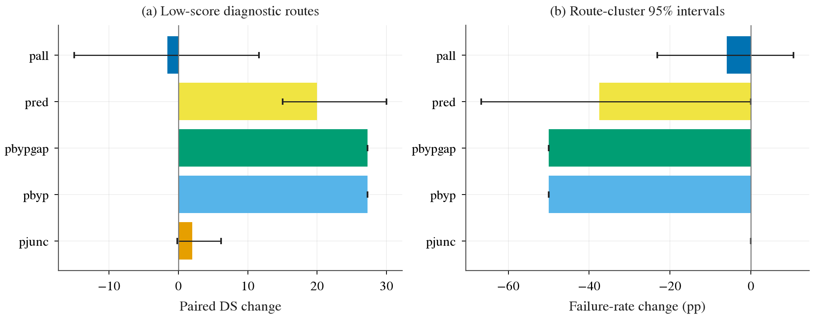

# B2D 低分路线的特权诊断

按用户最新要求，只检查原Cinque已有低分的7条路线，比较其对应的路口、绕障、红灯特权臂与同批原模型，另测叠加臂；两个交通seed（随机种子）共44次运行，直接录制实际运行视频。选择规则、固定参数与读法见[实验记录](../plans/2026-10-01-b2d-privileged-ceiling.md)。

报告只回答：各项技能能挽回多少DS（完成度乘违规罚分的驾驶分数）、执行停在哪一步、冲突对象在相机里能提前多久看到。按既有低分选样，因此属于失败诊断；绕障只有1条路线，不能将它的结果推广到总体。此前扩样批已停止，192条有效记录保留；一次日志错误及其修复已存档，不改科学判定线。

**44/44次已完成，耗时21.5min。** 当前建议先做红灯停车与绿灯放行；绕障先补安全协同，路口先修预测与停等链。统计区间是95% CI（置信区间），整条路线聚类bootstrap（重抽样）2000次、seed0。

| 对应低分路线／臂 | drive DS → 特权DS | 配对DS增益 [95% CI] | 主要现象 |
|:--|:--|:--|:--|
| 路口3条／pjunc | 38.97 → 40.96 | +2.00 [−0.16,+6.15] | 登记的2次机会均接触/卡死，未显示可靠收益。 |
| 施工1条／pbyp、pbypgap | 20.73 → 48.00 | +27.27，单路线区间退化 | RC（完成百分比）31.89→100，4/4局部机会成功，但每臂仍撞车3次。 |
| 红灯3条／pred | 75.00 → 95.00 | +20.00 [+15,+30] | 官方闯红灯5→1，绿灯恢复0–0.95s，没有新增碰撞/卡死。 |
| 全7条／pall | 51.80 → 50.23 | −1.57 [−15.02,+11.62] | 红灯归零，但撞车5→17、出车道3→10。 |

几何union（任一相机视野）提前量中位数为路口10.8s、障碍190.2s；大量对象在记录开始已可见，障碍值也受长时间等待影响。没有做遮挡判断，也没有量模型识别，不能判“普遍缺相机输入”或证明实际感知足够。

原确认登记线没有追认通过：功效不足，且原批程序崩溃记录保留。最终核验发现红灯事件投影代理与官方违规不完全一致；登记代理保留，不能拿它确认红灯执行失败。官方分数/主要违规逐条验证，所有配对区间独立重算；官方红灯运行发生率及选中路线的联合对单项差属于明确标注的事后补充。

完整结果、登记线、偏离、每张图的读法和视频路径见[实验记录](../plans/2026-10-01-b2d-privileged-ceiling.md)。

| 文件 | 内容 |
|:--|:--|
| [focus/routes.csv](focus/routes.csv)、[arm_means.csv](focus/arm_means.csv) | 44次官方分数、完成度、违规、配速与代数损失分解。 |
| [paired.csv](focus/paired.csv)、[events.csv](focus/events.csv)、[event_counts.csv](focus/event_counts.csv) | 登记的配对差、事件与机会；红灯事件代理有效性未通过。 |
| [visibility_summary.csv](focus/visibility_summary.csv)、[visibility.csv](focus/visibility.csv) | road/wide/union几何视野、删失、距离与像素大小，非感知识别率。 |
| [red_readout_audit.csv](focus/red_readout_audit.csv)、[secondary_contrasts.json](focus/secondary_contrasts.json) | 红灯口径核验与事后补充；不替代登记检验。 |
| [plan.json](focus/plan.json)、[final_checks.json](focus/final_checks.json)、[timing.json](focus/timing.json)、[videos.json](focus/videos.json) | 官方记录核验、区间独立复算、44段画面检查、耗时与真实视频路径。 |

DS显示红灯和该施工路线的收益；路口与联合区间跨0。右图包含未通过有效性核验的红灯代理，小样本区间不能确认总体效果。

绕障与联合仍损失在撞车。不同臂取不同路线，不能横比均值，也不能相加各损失项。

wide补足了部分road视野；多数首见时刻受到左删失。障碍的大提前量包含长时间等待，不能当成模型已识别的证据。

图有同名PDF（矢量文档）供论文使用。原始记录与视频留box，未发布网页产物。

历史检查与执行证据（备查）

- `pilot_checks.json`保留27787原pilot（最小试跑）的失败，不由后续成功替换。
- `pilot_diagnostics.json`保留三卡并行诊断的全部结果；`pilot_supplement.json`说明以登记debug路线334补充真实停车/恢复验证的明确偏离。
- `debug_v3_checks.json`和`debug_v3_lock.json`记录修复版中间批的逐项检查与控制源码校验。通过实现通路检查不代表路线成功，路口仍存在卡死。
- `debug_v4_checks.json`和`debug_v4_lock.json`是在修正未来车身中心之后重新跑13单位的检查与控制锁定，是原扩样批运行前使用的版本；所有适用检查通过，路口卡死与绕障碰撞仍作为真实驾驶失败保留。
- `junction_hold_smoke.json`记录真实状态机的短验证：保持IDM（基于跟驰距离生成速度剖面的规则）、观测自有停车后放行、禁止绿灯授权释放未拥有的停车。
- `readout_checks.json`核验相连障碍组只计一次机会、同对象连续接触合并、接触导致失败、无接触且完成回正导致成功；用已知差值表检查整条路线连两seed的2000次bootstrap（聚类重抽样，seed0），并将三条调试记录的DS、RC与违规数逐项对齐官方记录。
- `pool_checks.json`记录固定native（原始分辨率）双相机输入、6步recurrent（带历史状态）序列及desire变化的串行/4并发会话对齐；12项模型输出的最大绝对差全部为0。该检查使用已空闲的自有server，不改变控制或正式轨迹。
- `profile*.json`与`profile_*_routes.csv`记录同一24路线负载的装填比较、每卡利用率、逐路线计时与额外真值查询成本；完整路线吞吐62.07→118.21/h，外推正式墙钟约5.89h，后者仍是推算。
- `queue_q12_checks.json`核验调度改为12路线一片之前，六个旧包装进程全部自然结束、零条轨迹被中断；106条已终止结果保留，新队列590条，合并恰好为696个唯一组合，控制源码校验与debug-v4逐字节相同。其中“零程序崩溃”的旧检查不再有效，106不能称为106条有效结果。
- `crash_repair_source_checks.json`独立核验官方状态、保留7条原始程序崩溃的路径和成绩，并确认192条有效已终止结果留用。最终源码核验确认唯一变化是计划日志的序列化边界；几何与所有控制计算未变。工程停止中断12条正在运行的轨迹，另11个组合尚未启动，均不冒充完整结局；未删除原始attempt（一次执行）或重跑正常终止的驾驶失败。新的源码校验和旧版分别记录。
- `logging_repair_unit_checks.json`记录额外单单位完整结束并通过有限性、时延与无程序崩溃检查；驾驶卡死仍如实保留。

调试数字只用于工程诊断，不进入最终44次配对估计。历史原始记录均保留。

