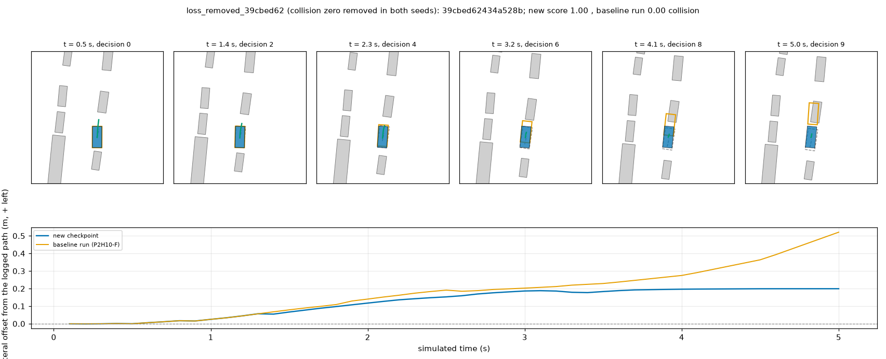
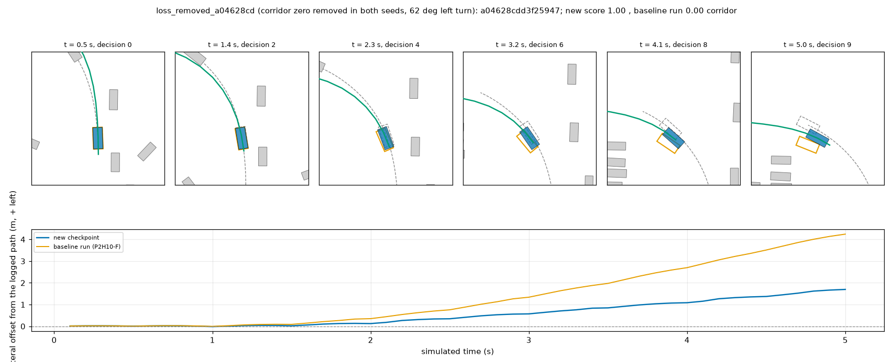
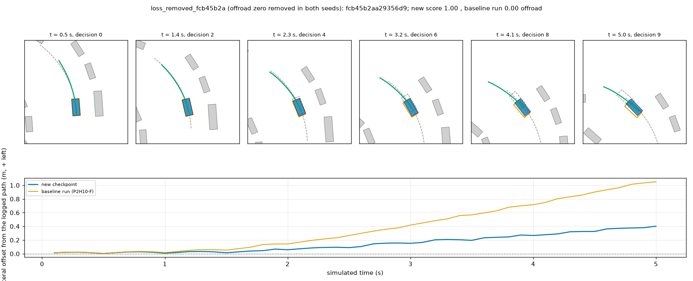
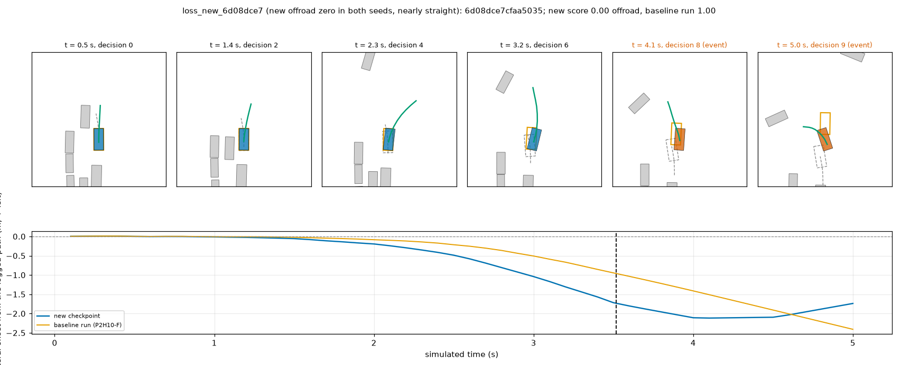
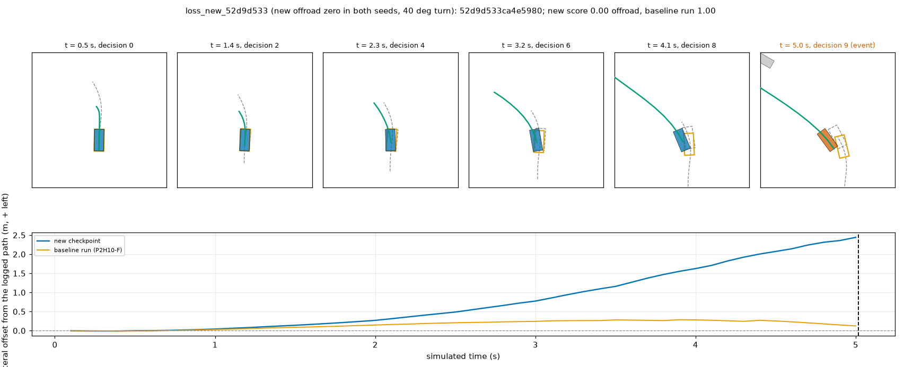
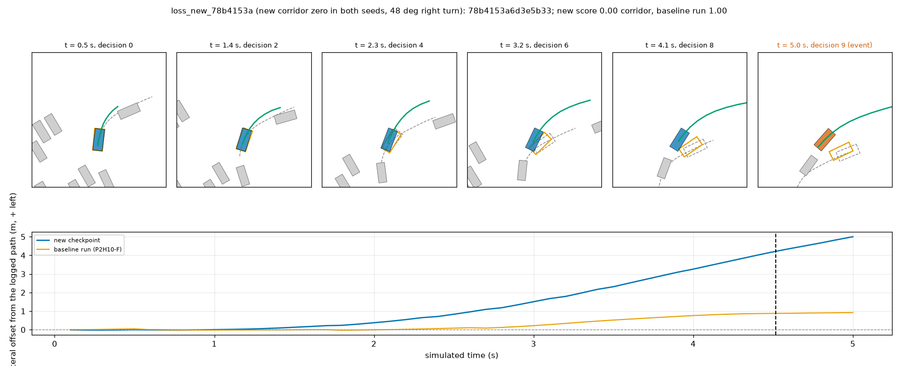

# BODY1 arm 4.3 (Amendment 5, w = 3): the loss arm in the AlpaSim nuPlan closed loop

2026-10-10. Implements Amendment 4 item 6 (staged closed loop, readings A and B, L1 in both forms, L2, L3) after G3 passed on both seeds
([loss_g3.md](loss_g3.md)). Served model: `P2H10B-F-s{0,1}` in the unchanged nuPlan driver (`sh30` driver, `SH30_TAG=<tag>`; no BODY1 serving
switch). Baseline: TR1's P2H10-F runs of the same chunk files (`$DATA_DIR/runs/alpasim/tr1/a/runs/P2H10-F-s{0,1}-chunk{0,1,2}/`).
**This is a regression check (all 1 491 public scenes took part in selecting P2H10 before), and the arm is the second attempt, made after one
pilot read of hold logs (Amendment 5).** Reader: [scripts/loss_report.py](../scripts/loss_report.py); tables `results/loss/cl/` (`report.md`,
`per_scene.csv`, `flips.csv`, `stats.json`), `results/loss/check_chunk1/`; strips `figs/loss/loss_*.png`.

**Verdict. L1a and L1b are met on both readings; L2 and L3 are not met on either. By the registered rule (every line, stricter reading) the arm
fails the closed loop: no PAI read was run, and the checkpoint is not promoted. The servable tag stays `P2H10-F-s{0,1}`.**
The arm does what it was built for on the collision class (at-fault collision zeros 14 -> 9 over the two seeds) and not on offroad (20 -> 21), and it
pays in speed: slow scenes 217 -> 277, mean progress -0.014, mean scene score -0.0046 [-0.0131, +0.0052].

## 1. Staged checks (Amendment 4 item 6)

`pilot8` (8 scenes of `c0b/lists/pilot8.txt`, `P2H10B-F-s0`): 8 of 8 rollouts, no driver error; scene scores against TR1's baseline
scores: five identical, two within 0.011, one lower (`622aef14545f59` 0.8797 against 0.9458); sanity only.

Chunk1 x s0 (233 scenes, 27 logs) against the baseline run of the same scenes, `results/loss/check_chunk1/check.md`:

| # | Check | Value | Verdict |
|--:|---|---|---|
| 1 | Rollouts complete, no driver error | 233 / 233 | pass |
| 2 | Taught-class zeros (collision + offroad) not above the baseline's | 7 against 7 (collision 1 against 2, offroad 6 against 5) | pass |
| 3 | Heading sd at decision 9 on decision 205's log-straight set (68 scenes, 17 logs) <= 1.25 x base | 2.43 against 2.56 deg, ratio 0.95 [0.68, 1.15] (`heading_loss_chunk1.md`) | pass |
| 4 | Baseline-clean scenes turning into a collision / offroad zero not more often than zeros removed | 1 new (offroad) against 1 removed collision | pass |

Chunk1 x s0: mean 0.9391 against 0.9411, zeros 9 against 10, slow 44 against 37. All items pass, so the other five chunk jobs were run. Chunk0 x s0
and chunk1 x s0 were run with a BODY1 switch before (stop / re-plan arms) and form the development part of reading B.

## 2. The full read: 700 scenes x 2 seeds (log-clustered CI, `jevdrive.stats`)

| Driver | mean scene score [95 % CI, logs] | score 1 | zeros | at-fault collision | offroad | left corridor | slow (0 < score < 1) | mean progress |
|:--|:--|--:|--:|--:|--:|--:|--:|--:|
| P2H10-F-s0 | 0.9468 [0.9252, 0.9652] | 562 | 26 | 8 | 10 | 8 | 112 | 0.942 |
| P2H10B-F-s0 | 0.9441 [0.9238, 0.9617] | 541 | 22 | 5 | 10 | 7 | 137 | 0.928 |
| P2H10-F-s1 | 0.9495 [0.9300, 0.9669] | 572 | 23 | 6 | 10 | 7 | 105 | 0.936 |
| P2H10B-F-s1 | 0.9430 [0.9234, 0.9599] | 538 | 22 | 4 | 11 | 7 | 140 | 0.921 |

Per seed, paired by scene (CI by log): s0 -0.0026 [-0.0117, +0.0071]; s1 -0.0065 [-0.0164, +0.0044].

| Reading | (seed, scene) pairs | L1a collision + offroad + corridor zeros, arm vs base | L1b collision + offroad zeros | L2 mean difference [95 % CI by log] | L3 slow arm vs 1.1 x base | Lines |
|:--|--:|:--|:--|:--|:--|:--|
| A: all | 1 400 | **met**: 44 (9 / 21 / 14) vs 49 (14 / 20 / 15); s0 22 vs 26, s1 22 vs 23 | **met**: 30 vs 34; s0 15 vs 18, s1 15 vs 16 | **not met**: -0.0046 [-0.0131, +0.0052] | **not met**: 277 vs 238.7 (base 217) | no |
| B: never-switched pairs (chunk2 x s0 + all of s1) | 933 | **met**: 29 (6 / 13 / 10) vs 32 (8 / 13 / 11); s0 7 vs 9, s1 22 vs 23 | **met**: 19 vs 21; s0 4 vs 5, s1 15 vs 16 | **not met**: -0.0058 [-0.0160, +0.0050] | **not met**: 182 vs 150.7 (base 137) | no |

Classes in brackets are collision / offroad / corridor, summed over the pairs of the reading. L2 fails twice over: the point estimate is negative and
the lower bound (-0.0131 / -0.0160) is far below the -0.005 line. L3 fails by 38 (A) and 31 (B) slow scenes above the allowance. L1 passes with a
small margin: 5 (A) and 3 (B) fewer zeros of 49 and 32, and 4 and 2 fewer collision + offroad zeros; the second seed alone is one zero better than the baseline.

## 3. Zeros by class, every flip

| Seed | removed (collision / offroad / corridor) | new (collision / offroad / corridor) | zero in both | slow base -> arm |
|:--|:--|:--|--:|:--|
| s0 | 11 (5 / 2 / 4) | 7 (2 / 2 / 3) | 15 | 112 -> 137 |
| s1 | 10 (3 / 3 / 4) | 9 (1 / 4 / 4) | 13 | 105 -> 140 |

Flips that appear in both seeds (the ones not explained by rollout noise): **removed 8** (collision `994ab680`, `80f6c94f`, `39cbed62`; offroad
`fcb45b2a`, `00ff8eeb`; corridor `1347c91c`, `927b73fe`, `a04628cd`) and **new 4** (offroad `6d08dce7`, `52d9d533`; corridor `78b4153a`,
`77155a60`). Seed-0-only: removed collisions `6fc4fc27`, `a7fa8bcc`, corridor `b53b172e`; new collisions `6e3c7a34` (development part), `abe4fa26`, new corridor `52d3f15d`.
Seed-1-only: removed offroad `5e9e8c31`, corridor `fe6105aa`; new collision `748779bc`, new corridor `f0a6222a`, `e933d70d`, new offroad `87339a4d`, `365c0937`.
The complete per-scene list
(score, class, turn, development or fresh) is `results/loss/cl/flips.csv` and the end of `report.md`.
Slow scenes: 1 -> slow 30 (s0) and 48 (s1) scenes, slow -> 1 only 7 and 16; the mean score of the slow scenes also falls (0.899 -> 0.875, 0.883 -> 0.872).

## 4. Scenes turning more than 45 deg (61 scenes, 20 logs; logged 4 s future of the scene's navtest token)

| Recipe | mean | zeros (two seeds) | collision / offroad / corridor | difference to base [95 % CI by log] |
|:--|--:|--:|:--|:--|
| P2H10-F | 0.8343 | 18 | 3 / 10 / 5 | - |
| P2H10B-F | 0.8136 | 20 | 2 / 11 / 7 | -0.0207 [-0.0825, +0.0453] |

The bucket does not improve in the loop (two more corridor zeros), as it did not on navtest's "does not make the turn" rate (loss_g3.md section d).

## 5. Review strips (seed 1, all fresh)

Six scenes, each with a 6-panel bird's-eye strip (other vehicles grey, logged ego dashed, baseline run orange, new checkpoint blue, returned
trajectory green) and the lateral offset of both egos from the logged path. Objects and the logged path are privileged, for the reader only. The
three removed scenes were re-run with rollout logs kept (scores reproduce: 1.0, 1.0, 1.0); the new zeros come from the chunk runs.

| Figure | Case | What to look at |
|---|---|---|
|  | collision zero removed (both seeds), straight road, two parked columns | In panels 4 to 6 the baseline (orange) drifts 0.5 m to the left toward the vehicle ahead and touches it at 5 s; the new checkpoint holds 0.2 m offset and passes: the bottom curve is the whole difference. |
|  | corridor zero removed (both seeds), 62 deg left turn | The baseline cuts the inside of the arc to 4.2 m off the logged path (orange, bottom); the new checkpoint stays within 1.7 m: this is the inside-cut case that the boundary lesson targets. |
|  | offroad zero removed (both seeds), 41 deg left turn | The baseline drifts 1.0 m inside the logged arc and leaves the road at the end; the new checkpoint stays 0.4 m off. Same mechanism as r2 at smaller scale. |
|  | new offroad zero (both seeds), nearly straight | Both runs drift right of the log (the baseline reaches 2.4 m at 5 s but still scores 1.0); the new checkpoint drifts earlier (1.0 m at 3 s against 0.5 m) and is offroad at 3.5 s. The drift, not an object, is the cause: look at the bottom curve, the blue line leaves first. |
|  | new offroad zero (both seeds), 40 deg turn | The plan (green) turns left harder than the log (dashed): offset grows to 2.4 m at 5 s against 0.1 m for the baseline. The offset grows on the turn itself. |
|  | new corridor zero (both seeds), 48 deg right turn | Offset 1.5 m at 3 s and 5 m at 5 s, the baseline stays at 0.9 m: the plan (green) stays straighter than the logged right-curving path (dashed). It leaves the corridor with no object near. |

The removed zeros are the ones the lesson is about (a drift toward an object or the inside of a turn); the new zeros are 3 of 4 offsets that grow
on turns or on a straight with no object involved: the loss arm moves some drifts to the other side instead of removing them.

## 6. Reading

- Offline the arm removed about half of the own-plan contacts on hold states (agent -49 %, boundary -53 %) and fell on navtest (+0.52); in the loop
  the collision class falls by a third and the boundary-type zeros (offroad + corridor) hold still (35 against 35 over the two seeds). The hold-log
  rates are open loop on the student's own plan, 30 083 states, of which 36 % are on-log; the loop's zeros are on-log states reached by the
  student itself, where the offline fall was 24 % (agent) / 24 % (boundary).
- The score cost comes from slowness, not zeros: slow scenes +60, mean progress -0.014 / -0.015, the slow scenes' own score lower. A plan that keeps
  a larger clearance reaches less progress. L3 was written for exactly this (FIX1's lead cap failed on it).
- Consistency: 12 scenes flip in both seeds (8 removed, 4 new), so those are properties of the recipe, not of one run's noise; but the margin on L1 is 3 to 5 zeros, inside what two seeds of the baseline differ by (26 vs 23).

## 7. Costs, deviations, limits

Costs: the closed loop took about 1.7 card-h (seven chunk jobs of 12 to 14 min, pilot8, strips rerun) and about 1.2 h wall; G3 about 1.3 card-h; lane total since the takeover about 3 card-h; 1.0 GB new (`$DATA_DIR/runs/body1/cl/loss-*`, rollout logs kept only for failed scenes and the strips); disk 352 GB free.
Deviations: (1) the pilot8 stage was started by mistake without the lane's environment: it ran as stage `loss-pilot` under
`$DATA_DIR/runs/alpasim/ot2/` (owner `alpasim-ot2`, no other lane's job touched; a duplicate submitted with the correct environment was cancelled);
every later job ran as owner `body1` in `$DATA_DIR/runs/body1/cl/`. (2) Everything went through the pool; card 2 was not needed. (3) The five chunk
jobs ran concurrently (`OT2_MAX_ACTIVE=5`), as TR1's six did. (4) The note (b) check of Amendment 5 (new offroad zeros against car parks / generic
drivable areas) was **not made** for the four new offroad zeros beyond the strips (r4, r5: the offsets grow on the road, the map layers are
not drawn); the scorer-layer raster (item C) is therefore not excluded as a contributor to the new offroad zeros, and nothing here separates A, B
and C. (5) The strips of removed zeros are re-runs of seed 1 with logs kept, not the original rollouts.
Limits: regression check on scenes used for selecting P2H10; two seeds; reading B contains only 933 pairs and 61 scenes above 45 deg; the
Amendment 5 w = 3 was fixed after one pilot read of hold logs; PAI not run (the nuPlan lines failed); the drop-one ablations of Amendment 4 item 11 (due after
G3 passed, one seed each, G3 reads only) were not part of this hand-over and were not trained.
