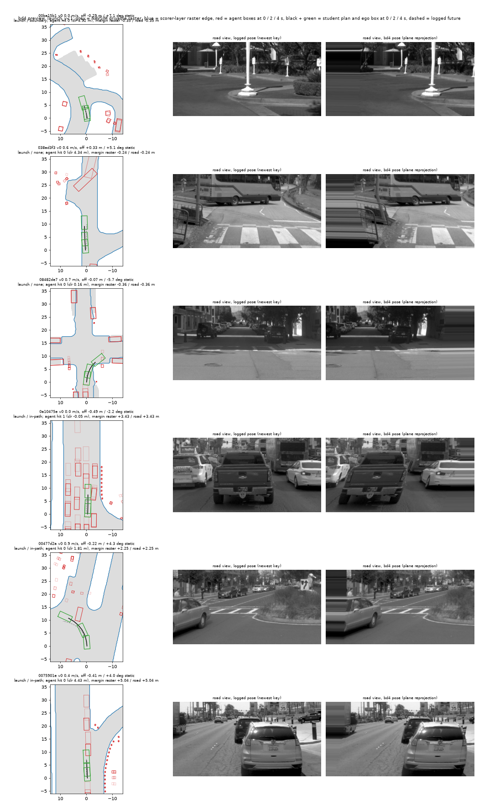
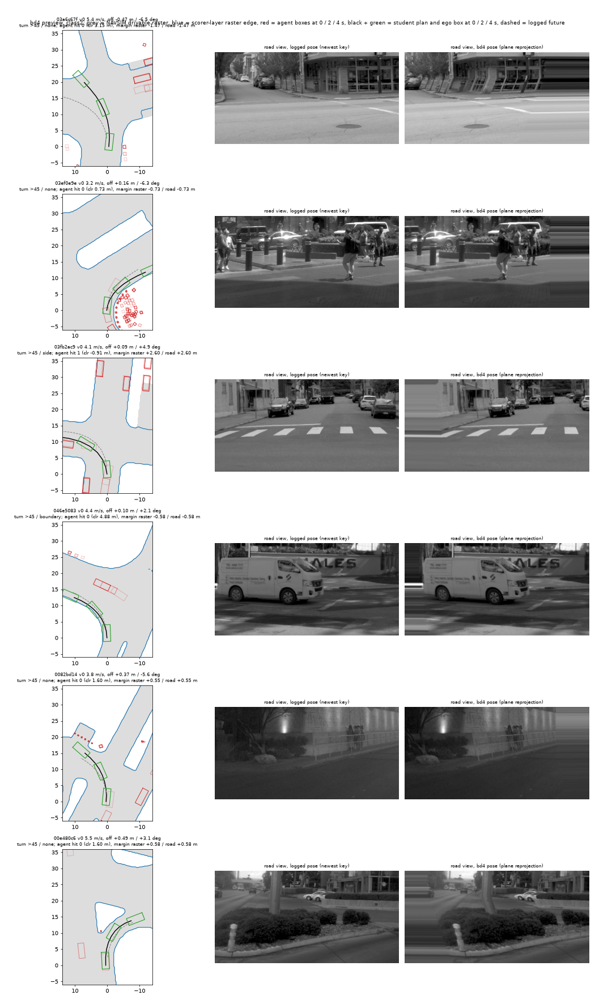

# BODY1 loss arm 4.3: stopped at the pilot gate

2026-10-10. Amendment 4 of [the prereg](../plans/2026-10-10-body1-prereg.md) (in force before any training; implementation notes i to x and the
status paragraph there). Follows decision 227 ([zeros_diagnosis.md](zeros_diagnosis.md)). No full run, no G3 at full scale, no closed loop, no
PAI read, no ablation; variant D not opened. There is no new servable checkpoint: the driver stays P2H10-F.

**Verdict.** The pilot gate has two halves and the registered loss half is missed, so the arm ends by Amendment 4 item 5.
1. **Loss half, missed.** Agent hinge on own-plan positives (mean over rows with a non-zero hinge): 0.1216 at steps 201-400 -> 0.1100 at steps
   2 701-3 000, a fall of 9.5 % against the registered 30 %.
2. **Direction half, held.** On hold-log states the own-plan contact rates of the pilot are below the same-scale switch-off pilot and below
   P2H10-F-s0 (table below): agent -26 %, boundary -17 % relative, intervals excluding 0. At pilot scale neither reaches G3 (a)'s 30 %.
3. **Which term did what** (the per-term log of item 5). The road hinge on the new `bd4` rows is the only term whose depth on positives fell
   clearly (-43 %; yr1 -35 %, ot1 flat). The agent term's depth on positives barely moved (`bd4` -7 %, imitation rows -20 %); what fell is the
   share of rows that touch (`bd4` 0.13 -> 0.09). The registered number is conditional on rows that still touch and does not see rows that
   stopped touching. It was written that way and is not changed after the read.

Pilot: `P2H10B-P-s0` against the switch-off `P2H10-P-s0`, shards s2 + s3, 3 000 steps, seed 0, P2H10 recipe unchanged plus A + B + C
(hinge-only rows 4 / 4 / 5 of 128 from ot1 / yr1 / `bd4`, lambda 10, margin 0.3 m). Switch-off identity: 60 steps against the unedited
`pp_train.py`, 18 logged scalars and every trained weight equal bit for bit (`loss/ident.json`).

## Hold-log rates of the own plan (5 062 states of shards s2 + s3, 118 logs, paired by log)

| Rate | `P2H10B-P-s0` | switch-off pilot | difference [95 %] | relative | P2H10-F-s0 |
|---|--:|--:|---|--:|--:|
| agent contact | 0.0194 | 0.0261 | -0.0067 [-0.0101, -0.0035] | 26 % | 0.0237 |
| boundary, NAVSIM raster (the label with the line) | 0.0227 | 0.0275 | -0.0047 [-0.0074, -0.0022] | 17 % | 0.0259 |
| boundary, scorer-layer raster | 0.0223 | 0.0279 | -0.0055 [-0.0081, -0.0029] | 20 % | 0.0259 |

By state family (agent / boundary relative fall): `bd4` 27 % / 19 % and yr1 31 % / 19 % (intervals exclude 0); ot1 7 % / 11 % and on-log
25 % / 18 % (intervals include 0; on-log has about 8 and 11 positives). **> 45 deg bucket** (686 states): agent 0.0292 against 0.0379,
boundary 0.0452 against 0.0583, intervals touch 0. Full table: `loss/g3_pilot.csv`.

## Per-term loss (mean of the 100 steps ending at the step; `loss/pilot_terms_P2H10B-P-s0.csv`)

| Term | 300 | 1000 | 2000 | 3000 |
|---|--:|--:|--:|--:|
| imitation (switch-off pilot) | 1.209 (1.198) | 0.852 (0.846) | 0.757 (0.731) | 0.715 (0.704) |
| anchor (switch-off pilot) | 0.0220 (0.0200) | 0.0163 (0.0132) | 0.0080 (0.0065) | 0.0061 (0.0046) |
| on-log drivable hinge (switch-off pilot) | 0.0046 (0.0045) | 0.0037 (0.0043) | 0.0035 (0.0038) | 0.0035 (0.0035) |
| A, imitation rows: share positive / mean on positives | 0.0167 / 0.100 | 0.0125 / 0.090 | 0.0128 / 0.088 | 0.0121 / 0.081 |
| A on `bd4` | 0.132 / 0.171 | 0.064 / 0.165 | 0.088 / 0.167 | 0.092 / 0.158 |
| A on yr1 | 0.043 / 0.105 | 0.033 / 0.112 | 0.043 / 0.142 | 0.033 / 0.076 |
| A on ot1 | 0.025 / 0.142 | 0.015 / 0.096 | 0.005 / 0.026 | 0.013 / 0.134 |
| road hinge (B + C) on `bd4` | 0.340 / 0.182 | 0.254 / 0.113 | 0.288 / 0.113 | 0.284 / 0.115 |
| road hinge on yr1 | 0.240 / 0.060 | 0.223 / 0.060 | 0.208 / 0.056 | 0.225 / 0.058 |
| road hinge on ot1 | 0.233 / 0.031 | 0.235 / 0.038 | 0.155 / 0.046 | 0.203 / 0.062 |
| gate number (A on positives, pooled) | 0.120 | 0.110 | 0.113 | 0.113 |

Dev ADE at step 3 000: 0.591 m against 0.590 m; `drift_off` 0.047 against 0.046.

## The `bd4` rows

41 433 of 103 288 navtrain tokens (heading offset 2 to 8 deg, lateral within 0.5 m, no speed cut; all 10 773 tokens over 45 deg; 53 % of the
tokens under 1 m/s). Label rates of P2H10-F-s0's plan on 600 preview states: agent contact 8.8 %, boundary 14.3 % (NAVSIM raster), 14.8 %
(scorer-layer); under 1 m/s 5.5 % / 11.0 %.

Launch states under 1 m/s. Look at the model-view frame against the BEV: the frame shifts by the heading offset with standing vehicles ahead
displaced consistently, and an edge-padding band of up to a tenth of the width appears on one side at 7 deg.

Turn states. Look at the plan's sweep against the two road labels: where they differ is the scorer-layer raster ending before the NAVSIM one.
The sheets for slow 1-3 m/s, class 1 and class 3 (`figs/loss/bd4_preview_{slow_1-3,class1,class3}.png`) were generated and not inspected.

## Costs, deviations, limits

Costs: about 0.4 card-h of the 8 (all through the pool; card 2 not used directly), about 35 min of box wall, 4.4 GB on the box (`bd4` for
shards s2 + s3 1.8 GB, preview cache 0.16 GB, scorer-layer raster 2.4 GB); free disk 364 GB. The full `bd4` cache would be 10.1 GB (draft: 18).

Deviations (each written into Amendment 4's notes before the number it affects):
1. The trainer is `scripts/bd4_train.py` with `lib/loss43.py`, a subclass of `pp_train.py`'s loss; `pp_train.py` is not edited. Two default-off
   hooks were added to other topics' scripts: `SELECT` in `op_parity/scripts/ot_rows.py`, `OPB_LAYERS` / `OPB_OUT` in `op_probe/scripts/opb_labels.py`.
2. Choices the amendment left open: 4 / 4 / 5 hinge-only rows per family; a hinge-only row weighs as one imitation row; agent side margin 0
   (decision 158's setting); A on imitation rows of train logs only; static history under 1 m/s and a 1.5 m history cap; the pilot is read
   against a same-scale switch-off run as well as P2H10-F-s0.
3. C is applied only to hinge-only rows that start on the scorer-layer road (note x: car-park launches start outside it); 1 101 of 30 141
   pilot rows keep the NAVSIM raster.
4. The scorer-layer list (ROADBLOCK, ROADBLOCK_CONNECTOR, INTERSECTION, LANE, LANE_CONNECTOR) is a reading of "road areas and lanes" on the
   nuPlan side; it was not checked against AlpaSim's map conversion.

Limits: one seed, two shards, 3 000 steps; the gate windows are steps 201-400 and 2 701-3 000 ("value at step 300" read as that window); with
equal per-row weight the hinge-only terms are small in the total (agent 0.001, road 0.003, times 10, against imitation 0.7), so the missed
line may partly reflect that weight, a choice of note iii and not of the draft; the user classes of the G3 table use the taxonomy file's `pc`
column, not checked for Amendment 1's class-3 change; the on-log subset has too few positives to read; no clips.

Not run, with the commands ready: the other ten `bd4` shards (`bd4_prep.py prep --data navtrain_full.s<k>of12`) and the full runs
(`bd4_train.py train --seed <i> --data navtrain_full.s{0..11}of12 --steps 10000 --ho ot1:4,yr1:4,bd4:5 --agent-lam 10 --tag P2H10B-F-s<i>`).

---

# Amendment 5: second attempt (weight of the hinge terms on hinge-only rows)

2026-10-10. Amendment 5 of the prereg and its notes (a) to (e). **This is a second attempt, registered after one pilot read of hold logs
(the Amendment 4 table above); every number below carries that limit.** The one change against the Amendment 4 pilot: the agent hinge and
the road hinge of the hinge-only rows are multiplied by w, and the validation part of the train logs (`navsim/body1-val-logs`, 123 of 1 071
train logs, `sha256(log) % 10 == 1`) gives no hinge-only row.

## A5.1 Selection of w (validation part only; written and pushed before any hold-log read of an Amendment 5 checkpoint)

**Selected: w = 3** (`P2H10B-Pw3-s0`). w = 10 has the larger fall but fails the dev ADE constraint (0.6069 m against the limit 0.6013 m =
switch-off pilot 0.5913 + 0.01), so by item 3 it is not eligible. `loss/a5_selection.json`.

Own-plan rates on the validation part (4 019 states of shards s2 + s3, 120 logs: on-log 1 463, ot1 996, yr1 996, `bd4` 564), against the
switch-off pilot `P2H10-P-s0`, paired by log:

| | w = 3 | w = 10 | switch-off pilot |
|---|--:|--:|--:|
| agent contact rate | 0.0236 (-34 %) | 0.0194 (-46 %) | 0.0358 |
| boundary rate (NAVSIM raster) | 0.0239 (-40 %) | 0.0204 (-49 %) | 0.0398 |
| **agent + boundary, relative fall (the selection quantity)** | **37.2 %** | 47.4 % | |
| agent + boundary, difference [95 %] | -0.0281 [-0.0354, -0.0212] | -0.0358 [-0.0443, -0.0280] | |
| dev ADE at step 3 000 (limit 0.6013 m) | **0.5899, met** | 0.6069, **not met** | 0.5913 |
| `dev_drift_off` (limit 0.30) | 0.050 | 0.058 | 0.042 |
| eligible | yes | no | |

By state family (relative fall of agent / boundary, w = 3): on-log 25 % / 23 % (intervals touch 0), ot1 26 % / 37 %, yr1 35 % / 53 %, `bd4`
41 % / 35 %. > 45 deg (490 states): 42 % / 34 %. Launch, v < 1 m/s (275 states, 7 and 3 reference positives): 43 % / 33 %, intervals touch 0.
Tables: `loss/g3_a5_val_w{3,10}.csv`. The validation logs are not clean of term A: their imitation rows carry the agent hinge (item 3 leaves
term A as in the Amendment 4 pilot); only the hinge-only rows leave them.

Per-term log at steps 300 / 1 000 / 2 000 / 3 000 (means of the 100 steps ending there; `loss/pilot_terms_P2H10B-Pw{3,10}-s0.csv`):

| Term | w = 3 | w = 10 | Amendment 4 pilot (w = 1) |
|---|---|---|---|
| imitation | 1.242 / 0.872 / 0.775 / 0.729 | 1.326 / 0.947 / 0.824 / 0.779 | 1.209 / 0.852 / 0.757 / 0.715 |
| A on `bd4`: share of rows positive | 0.102 / 0.076 / 0.070 / 0.054 | 0.096 / 0.070 / 0.052 / 0.032 | 0.132 / 0.064 / 0.088 / 0.092 |
| A on `bd4`: mean on positives | 0.173 / 0.142 / 0.114 / 0.112 | 0.148 / 0.129 / 0.117 / 0.088 | 0.171 / 0.165 / 0.167 / 0.158 |
| road hinge on `bd4`: share / mean on positives at 3 000 | 0.258 / 0.055 | 0.228 / 0.045 | 0.284 / 0.115 |
| road hinge on yr1: share / mean on positives at 3 000 | 0.200 / 0.050 | 0.195 / 0.041 | 0.225 / 0.058 |
| road hinge on ot1: share / mean on positives at 3 000 | 0.195 / 0.029 | 0.183 / 0.027 | 0.203 / 0.062 |
| A on imitation rows: share positive | 0.0169 / 0.0126 / 0.0115 / 0.0110 | 0.0171 / 0.0117 / 0.0113 / 0.0108 | 0.0167 / 0.0125 / 0.0128 / 0.0121 |
| unconditional: share of hinge-only rows with an agent hinge | 0.059 / 0.046 / 0.038 / 0.032 | 0.055 / 0.042 / 0.028 / 0.019 | not logged |
| unconditional: share of hinge-only rows with a road hinge | 0.248 / 0.242 / 0.217 / 0.221 | 0.239 / 0.229 / 0.205 / 0.204 | not logged |
| unconditional: share of all hinged rows (imitation + hinge-only) with an agent hinge | 0.0211 / 0.0159 / 0.0141 / 0.0128 | 0.0207 / 0.0146 / 0.0126 / 0.0110 | not logged |

Hinge-only pools after the exclusion: ot1 9 368, yr1 9 368, `bd4` 5 616 rows (2 556 rows of the validation logs left out); 1 101 rows keep
the NAVSIM raster (note x). Switch-off identity with the edited code: 60 steps, 18 scalars and every weight bit-identical to the unedited
`pp_train.py` (`loss/ident_a5.json`). Correction to the Amendment 4 section above: the switch-off pilot's dev ADE is 0.5913 m (the pilot's
0.5915 m), not 0.590.

