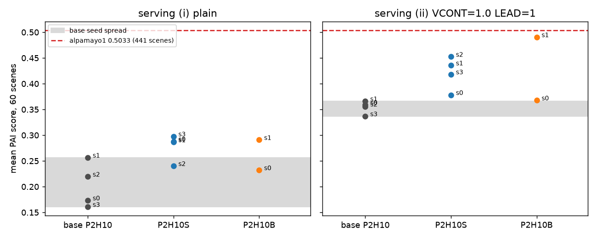

# Descriptive PAI read of the BODY1 checkpoints (Amendment 6 note (j))

**This is a descriptive read; the registered PAI read does not exist (no arm met the nuPlan lines) and this read replaces nothing; it cannot promote any arm, and the 60 PAI scenes are now development scenes for this lane.** In plain numbers (60 PAI scenes, one rollout per scene, tag and serving): under the plain driver the four-seed mean is 0.2026 for the base `P2H10-F`, 0.2780 for `P2H10S-F` (+0.0755 [+0.0216, +0.1363] paired by seed) and 0.2615 for `P2H10B-F` (two seeds, +0.0465 [-0.0256, +0.1249]); under decision 226's PAI serving (`JEV_VCONT=1.0 JEV_LEAD=1`) the base is 0.3545, `P2H10S-F` 0.4211 (+0.0667 [-0.0077, +0.1479]) and `P2H10B-F` 0.4291 (+0.0665 [-0.0108, +0.1509]). Against the base's own seed spread (largest base-pair difference 0.0957 plain, 0.0292 served) the plain-driver `P2H10S` difference is inside the spread and the served differences of both arms are outside it. The per-seed picture is mixed: plain `P2H10S` s1 and s2 are +0.03 / +0.02 with CIs including zero; served `P2H10B` s0 is +0.0086. The served `P2H10B-F-s1` (0.4904) is the single highest tag, 0.013 under alpamayo1's 0.5033 (a 441-scene reference, not comparable in sample). Nothing here is selected or promoted; the driver stays `P2H10-F`.

**Correction (2026-10-10, per-scene recompute).** No headline mean is wrong: every mean, paired difference and CI above was recomputed from the per-scene rows and is unchanged. Decision 235 point 2 read the zeros-by-class table with the order reversed: in every row pair the first row is the base and the second the arm (the table lists base before arm), so the arm has fewer zeros in every class and more progress, and the "inconsistency" does not exist. What this report did get wrong or leave unclear: (1) the class columns are exclusive (priority collision > offroad > corridor, a scene with offroad and corridor counts as offroad), which understated corridor and made "corridor zeros fall by one to three" look like a corridor effect; on raw flags corridor moves by 0.5 (plain 19.0 -> 18.5, served 17.75 -> 17.25) and the fall is the offroad one; (2) the progress column averages all rollouts, failed ones included, so it is not the quantity the score uses; (3) driver exceptions are 9 of 1200 rollouts (plain 5, served 4), not 8 of 960, and they are not balanced (see Composition); (4) the sentence that arms gain "through offroad / corridor zeros and progress" is replaced by the decomposition below.

Tables: [pai/pai_tables.md](pai/pai_tables.md) (all numbers below), `pai/pai_by_tag.csv`, `pai/pai_paired.csv`, `pai/pai_paired.json`, per-scene composition and decomposition [pai/pai_decomposition.md](pai/pai_decomposition.md) and `pai/pai_composition.csv`; code `scripts/pai_report.py`, `scripts/pai_chain.sh`.

## What was run

60 scenes = the six 10-scene chunk files of PAI2 (`a10 b1 b2a b2b e1 e2`), unharmonised renderer, `pai_native.sh`, CONC 4, one pool job per tag x serving x chunk (`--vram 24 --cpu 6 --ram 40`). Tags: `P2H10-F-s{0..3}`, `P2H10S-F-s{0..3}`, `P2H10B-F-s{0,1}`; servings (i) plain, (ii) `JEV_VCONT=1.0 JEV_LEAD=1`. Reused: base s0 / s1 plain = PAI2's runs (`pai2/base`), base s0 / s1 served = FIX1's arm "ab" (`fix1/paibox/runs/ab_*`), both with the identical command and chunk lists. Newly run: 96 chunk stacks (base s2, s3; all arm tags) plus 3 reruns.

## Scores and zeros by class (mean over the seeds of a family; per-tag rows in pai_tables.md)

| serving | family (seeds) | mean | zeros | at-fault collision | offroad (excl.) | corridor (excl.) | slow | progress (all rollouts) |
|:--|:--|--:|--:|--:|--:|--:|--:|--:|
| plain | base (4) | 0.2026 | 43.25 | 12.50 | 14.50 | 16.00 | 9.50 | 0.54 |
| plain | `P2H10S` (4) | 0.2780 | 36.75 | 12.50 | 8.75 | 14.75 | 13.75 | 0.58 |
| plain | base (s0, s1) | 0.2150 | 42.5 | 12.5 | 13.5 | 16.0 | 9.5 | 0.54 |
| plain | `P2H10B` (2) | 0.2615 | 39.0 | 12.0 | 11.0 | 15.5 | 10.5 | 0.58 |
| served | base (4) | 0.3545 | 31.25 | 4.00 | 10.00 | 16.25 | 15.25 | 0.60 |
| served | `P2H10S` (4) | 0.4211 | 27.75 | 3.75 | 8.50 | 15.50 | 14.50 | 0.64 |
| served | base (s0, s1) | 0.3626 | 31.0 | 4.0 | 10.0 | 16.5 | 15.0 | 0.61 |
| served | `P2H10B` (2) | 0.4291 | 27.5 | 4.0 | 10.5 | 13.0 | 14.0 | 0.65 |
| reference | alpamayo1 (441 scenes) | 0.5033 | | | | | | |

In each row pair the first row is the base and the second the arm. Zeros "other" (no flag set) are driver exceptions (`Expected all tensors to be on the same device`, 9 of 1200 rollouts; scene `77fdd75` three times including PAI2's base); progress = mean `progress_clipped_rel`. Reading: the zeros the arms remove are offroad zeros (plain 14.5 -> 8.75 for `P2H10S`), at-fault collision zeros do not move under either serving (12.5 -> 12.5 plain; 4.0 -> 3.75 / 4.0 served), exclusive-class corridor zeros fall by one to two but raw corridor flags barely move (0.5), the difference being scenes that carry offroad and corridor together. The served driver already removes most collision zeros of every tag (12.5 -> 4.0); the arms add on top of that by turning zero scenes into non-zero ones (see the next section), mainly offroad-flagged ones, not through collisions, the class the open-loop hinges target.

## Composition of the score and where the arm-minus-base difference comes from

PAI scene score = 0 if any of at-fault collision / offroad / left-corridor is set, else `min(clamp(progress_clipped_rel, 0, 1) / 0.8, 1)`. Flags overlap (offroad + corridor: 52 of 1200 rollouts; collision + corridor: 1; collision + offroad: 0), so the score is a failure indicator times a progress term; the mean of 0.42 against 0.35 can only come from fewer zeros or higher non-zero scores. Progress of failed rollouts is recorded and enters the progress column but not the score.

Seed means (full per-tag rows in pai/pai_decomposition.md):

| serving | family | zeros | non-zero scenes | mean score of non-zero | progress, non-zero only | progress, all | exceptions |
|:--|:--|--:|--:|--:|--:|--:|--:|
| plain | base (4) | 43.25 | 16.75 | 0.724 | 0.666 | 0.54 | 0.25 |
| plain | `P2H10S` (4) | 36.75 | 23.25 | 0.718 | 0.653 | 0.58 | 0.75 |
| served | base (4) | 31.25 | 28.75 | 0.741 | 0.670 | 0.60 | 1.00 |
| served | `P2H10S` (4) | 27.75 | 32.25 | 0.783 | 0.718 | 0.64 | 0.00 |

Paired by seed index and scene, mean over the seed pairs (difference = gain + loss + change, each divided by 60 scenes):

| serving | family (pairs) | diff | zero -> non-zero (n) | non-zero -> zero (n) | non-zero in both (n) | gain | loss | change in both |
|:--|:--|--:|--:|--:|--:|--:|--:|--:|
| plain | `P2H10S` (4) | +0.0755 | 7.75 | 1.25 | 15.50 | +0.0950 | -0.0188 | -0.0007 |
| plain | `P2H10B` (2) | +0.0465 | 7.00 | 3.50 | 14.00 | +0.0979 | -0.0499 | -0.0015 |
| served | `P2H10S` (4) | +0.0667 | 7.25 | 3.75 | 25.00 | +0.1071 | -0.0477 | +0.0073 |
| served | `P2H10B` (2) | +0.0665 | 6.50 | 3.00 | 26.00 | +0.1020 | -0.0351 | -0.0004 |

- The whole difference is a change in which scenes are zero: net 6.5 (plain) and 3.5 (served) fewer zero scenes per seed for `P2H10S`, with a rescued scene scoring about 0.74 (plain) and 0.89 (served) and a lost one about 0.90 and 0.76. Scenes that are non-zero in both change by -0.0007 (plain) and +0.0073 (served) in mean contribution: the arm does not drive better on scenes the base already passes.
- The earlier reading that the arm "is not better in offroad, corridor and progress" was a table-order misreading; the arm has fewer offroad zeros (14.5 -> 8.75 plain, 10.0 -> 8.5 served), and its higher all-rollout progress comes from the rescued scenes, while progress on non-zero scenes is not higher in plain (0.666 -> 0.653).
- Served has a driver-exception imbalance: the base carries 4 exception zeros over 4 seeds (s0 1, s2 2, s3 1) and `P2H10S` none. At a typical non-zero score of about 0.74 this is roughly 4 x 0.74 / 240 = +0.012 of the served +0.0667; in plain the imbalance runs the other way (base 1, `P2H10S` 3). The exceptions are device-mismatch crashes with no relation to the checkpoint; they stay in the numbers as scored.
- Scenes that flip zero -> non-zero in at least 3 of 4 seeds: plain 4 (`94877a4`, `b988494` in 3 seeds; `a45776a`, `75c23f0` in 4), served 4 (`75c23f0`, `bb9b4a3`, `8457182`, `6b986b3`, all 4 seeds); the reverse in at least 3 seeds: served `94877a4` only (3 seeds). The base zero flag of the rescued scenes is offroad for 3 and corridor for 5 of the 8 listings (`75c23f0` appears in both servings). That is 7 distinct scenes in the 60 whose outcome moves systematically (consistent across seeds); the rest of the gain is seed-level movement, as in the base's own seed spread.
- Exception list (tag, serving, scene) is in pai/pai_decomposition.md.

## Arm minus base, paired by seed index and scene (scene bootstrap, 10 000 draws)

| serving | comparison | difference [95 % CI] | outside the base-pair spread |
|:--|:--|:--|:--|
| plain | `P2H10S` s0 / s1 / s2 / s3 | +0.1146 [+0.0504, +0.1883] / +0.0298 [-0.0449, +0.1062] / +0.0206 [-0.0556, +0.0948] / +0.1370 [+0.0622, +0.2196] | s0, s3 yes; s1, s2 no |
| plain | `P2H10S` seed mean | +0.0755 [+0.0216, +0.1363] | no |
| plain | `P2H10B` s0 / s1 | +0.0587 [-0.0125, +0.1377] / +0.0343 [-0.0733, +0.1434] | no / no |
| served | `P2H10S` s0 / s1 / s2 / s3 | +0.0192 [-0.0746, +0.1149] / +0.0695 [-0.0388, +0.1764] / +0.0966 [-0.0062, +0.2036] / +0.0814 [-0.0053, +0.1701] | s0 no; s1-s3 yes |
| served | `P2H10S` seed mean | +0.0667 [-0.0077, +0.1479] | yes |
| served | `P2H10B` s0 / s1 | +0.0086 [-0.0734, +0.0934] / +0.1243 [+0.0225, +0.2317] | no / yes |
| served | `P2H10B` seed mean (2) | +0.0665 [-0.0108, +0.1509] | yes |

Null, base seed against base seed (six pairs of four seeds): plain -0.0957 to +0.0831 (max |.| 0.0957; s1 - s0 +0.0831 [+0.0054, +0.1638], s3 - s1 -0.0957 [-0.1761, -0.0270]); served -0.0292 to +0.0071 (max |.| 0.0292). "Outside the spread" means beyond every base-pair difference of that serving; the plain base spread is wide (0.161 to 0.257), the served one narrow (0.337 to 0.366), which is why the same +0.07 is inside the first and outside the second. Of the four seed-mean CIs three include zero (served `P2H10S` -0.0077, served `P2H10B` -0.0108, plain `P2H10B` -0.0256); the one that excludes zero (plain `P2H10S`) is inside the base spread.

## Figure

What to look at: the grey band is the range of the four base seeds; in the right panel (served, the configuration PAI is actually served with) all four `P2H10S` seeds and both `P2H10B` seeds sit above the band (`P2H10B` s0 by only 0.002), and nothing reaches the dashed alpamayo1 line; in the left panel (plain) four of six arm points sit above the wide band (`P2H10S` s2 and `P2H10B` s0 inside it).

## Costs

99 stacks (96 + 3 reruns) x about 12 to 13 minutes, about 20 card-hours (main's brief enlarged the 8 card-hour budget by the second chain; the lane's own estimate for the first 48 stacks was 9.6); wall 10:19 to 13:20 box time, up to 14 stacks in flight (chain 1 CAP 6, chain 2 CAP 8, margin guard 100 GiB, never below 230 GiB observed, pids at most about 10 400 of 20 480). Box: 5.4 GB under `$DATA_DIR/runs/body1/pai` (summaries, logs; videos, renderer caches and rollout logs pruned), 330 GB free on the data disk.

## Deviations and limits

- Two chain instances (second added on the main session's instruction) started from the same script version; the second shares STATUS / log / jobs files with the first (the planned suffix variable was not applied), so `DONE` was written by the first one; the reader checks every run directory instead.
- 10 rollouts of `P2H10S-F-s1` plain (chunks b2b, e1, e2) failed with `No space left on device` in `/tmp` (the box's root overlay, 30 GB, was at 100 % from other lanes' files, 26 GB in `/tmp`); the three stacks were rerun with `TMPDIR` on the data disk and replace the originals (the original summaries are in `runs/bad_enospc/`; the first read of that tag was 0.2133, the rerun 0.2863). All other stacks show no such failure. The root disk remains full and is not this lane's to clean.
- Plain-driver `P2H10S-F-s1` therefore differs from the other stacks in `TMPDIR` only. Eight device-mismatch exceptions remain as scored zeros in all tags alike.
- No run on card 2 or card 3 directly; everything went through the pool.
- One rollout per scene, tag and serving; the simulator reproduces only per identical scene list, the lists are the base's. Chunk-level numerics differ from Tokyo's by decision 215's cm-level effect. PAI2's 60 scenes are a difficulty-stratified sample, so the means do not compare with alpamayo1's 441-scene 0.5033. `P2H10B` has two seeds only. Seeds are paired by index only through the shared scenes, not by any shared training state.
