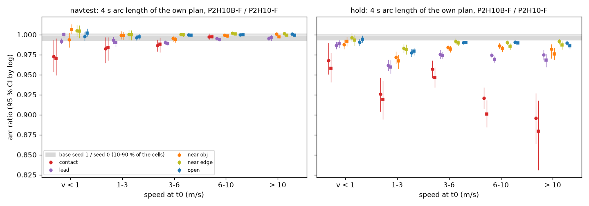
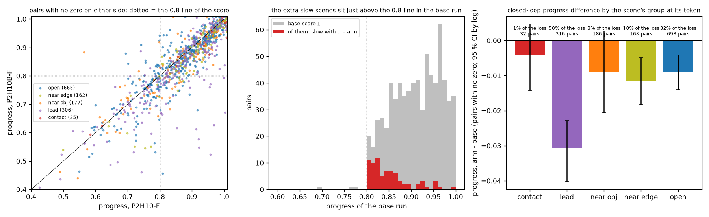
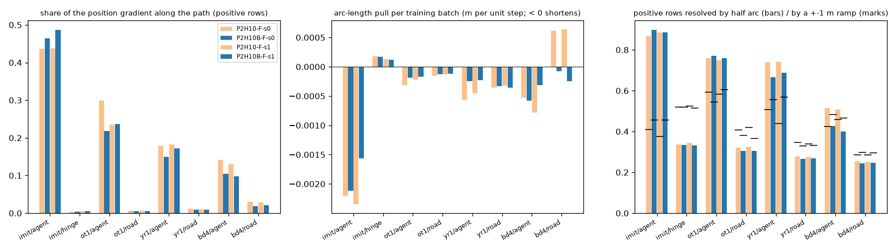
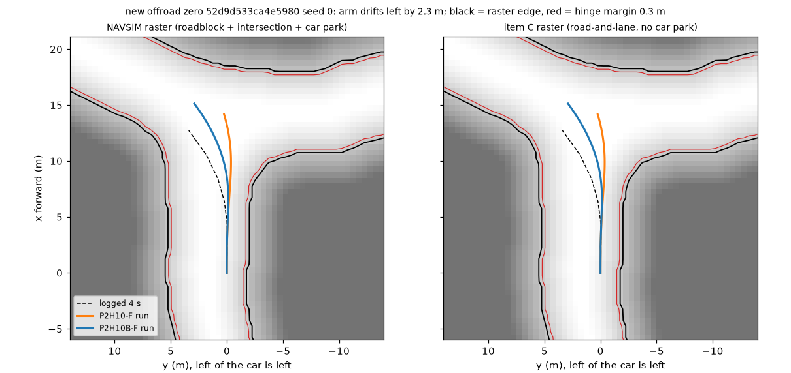

# BODY1 loss arm: where the progress goes (diagnosis after decision 229)

2026-10-10. No plan weight was trained and no closed loop was run: the existing 700 x 2 runs of `P2H10B-F-s{0,1}` and `P2H10-F-s{0,1}`, open-loop
own plans of the four checkpoints on hold logs and navtest, and the hinge gradients on training rows. Scripts: [prog_ol.py](../scripts/prog_ol.py),
[prog_grad.py](../scripts/prog_grad.py), [prog_cl.py](../scripts/prog_cl.py); tables `results/prog/`; figures `figs/prog/`. Everything here is post hoc on
development scenes; the proximity groups were fixed in `prog_ol.py` before a number was read, they are not registered lines.

**Correction, 2026-10-11 (navtest own-plan reads re-read on warp frames).** Until e7747c0b the lane's plan reader opened `lb_navtest` on GIMM
frames for these warp-trained checkpoints, so the open-loop navtest numbers of the first version of this page were measured on plans the
benchmark does not score ([navtest_warp.md](navtest_warp.md); tables [navtest_warp/prog/](navtest_warp/prog/), [navtest_warp/prog_cl/](navtest_warp/prog_cl/)).
They are replaced below with the old number named each time. What changes: on logged navtest states the arm's plan is **not shorter everywhere**; the
pooled ratio is 0.9985 / 0.9980 (was 0.9905), open-road tokens are not shortened (0.9998 / 0.9995, was 0.993), and the shortening sits behind a lead
(0.9931, was 0.982) and on contact states. What does not change: the hold-log ratios, every closed-loop number (scores, progress, the served-plan arcs
of `drive.jsonl`), the gradient split, and therefore verdicts 1, 3, 4 and the closed-loop half of 2. The closed-loop tables that group scenes by the
base plan at the navtest token are regrouped on the scored plans (2 to 40 pairs move per group); the reading is the same. The figures
`figs/prog/ol_arc.png` (left panel) and `cl_progress.png` were redrawn on the warp-frame tables on 2026-10-11 (`prog_cl.py figs --warp ... --warp-cl ...`).

## Verdict

1. **The lost progress and the removed collisions are different scenes.** 95.6 % of the progress loss and 76 of the 78 "score 1 -> slow" pairs lie outside
   the 11 scenes with a collision zero in any of the four runs; in the 5 scenes whose collision was removed the arm's progress is never below the base's.
   The score difference -0.0046 splits into +0.0029 from zero flips and -0.0074 from progress. It is a side effect, not a trade inside scenes.
2. **The side effect is a shorter speed profile, strongest behind a lead and on states that look like the hinge-only rows.** Open loop the arm's 4 s arc
   is 0.999 x base on the on-log imitation rows of hold logs, 0.990 / 0.978 / 0.939 on `ot1` / `yr1` / `bd4` states (the three hinge-only families), 0.998 on
   navtest tokens (open road 1.000, lead ahead 0.993; first read, off-protocol: 0.9905, 0.993, 0.982). In the loop the served plans are 0.976 x base over all decisions, 0.944 in scenes that start with a
   lead in the lane, and those scenes (23 % of the pairs) carry 49 to 50 % of the progress loss (46 to 49 % with the first read's grouping).
3. **The term that pulls the plan back is the agent hinge (A); the road terms (B + C) act across the path.** On training rows 96 % of the agent-hinge-positive
   imitation rows and 84 to 88 % of the positive hinge-only rows have a gradient that moves the plan backwards, and slowing alone (same path at 0.75 of the
   arc) zeroes the agent hinge on 76 % / 32 to 72 % of them. The road hinges put 97 to 99.5 % of their gradient across the path and their first-order
   arc pull is about zero. On imitation rows the imitation target holds the arc (hence 0.999); a hinge-only row has no target, so nothing opposes the pull.
4. **Item C's raster is not behind the new offroad zeros**: on all 6 new offroad pairs (4 scenes) the two rasters give the same margins along both runs.
5. The new zeros are a second, smaller effect of another kind: 13 of 16 pairs are open scenes, 9 turn more than 45 deg, none is a launch, their open-loop
   arc is not shorter (0.95 to 1.05, median 1.00; first read 0.92 to 1.02). With the regrouping 14 of the 16 pairs are open scenes (first read 13). They are shape changes on turns, and a timing fix does not address them.

A separable mechanism exists, so a draft Amendment 6 is appended to the pre-registration (DRAFT, NOT IN FORCE).

## 1. Is the plan shortened everywhere or only near something?

Groups of a state, from the base plan of seed 0 (first match): `contact` (the plan touches a counted object or leaves the NAVSIM raster by more than
0.20 m), `lead` (object ahead within the lane width, gap under max(10 m, 3 s x v0)), `near obj` (time-matched clearance under 1.0 m), `near edge`
(raster margin under 0.5 m), `open` (none). Ratio = mean 4 s arc of the arm / of the base on the same states, interval by log; "seed" = base seed 1 / base
seed 0, the noise floor.

**Open loop** (`results/prog/ol_{navtest,hold}_arc.csv`, seed 0 | seed 1):

| States | n | all | open | near edge | near obj | lead | contact | seed floor (all) |
|:--|--:|:--|:--|:--|:--|:--|:--|:--|
| navtest on-log (never trained on), warp frames | 12 146 | 0.9985 [0.998, 0.999] \| 0.9980 | 0.9998 \| 0.9995 | 1.0015 \| 1.0003 | 0.9984 \| 0.9972 | 0.9931 \| 0.9931 | 0.9914 \| 0.9914 | 0.9995 |
| navtest, first read on off-protocol plans (superseded) | 12 146 | 0.9905 [0.989, 0.992] \| 0.9905 | 0.9931 \| 0.9927 | 0.9931 \| 0.9925 | 0.9903 \| 0.9918 | 0.9822 \| 0.9836 | 0.9870 \| 0.9851 | 1.0003 |
| hold logs, on-log (imitation rows of the training set) | 10 926 | 0.9990 | 0.9994 | 1.0009 | 1.0003 | 0.9957 | 0.9853 | 0.9994 |
| hold logs, `ot1` | 7 366 | 0.9900 | 0.9927 | 0.9951 | 0.9904 | 0.9785 | 0.9724 | 0.9999 |
| hold logs, `yr1` | 7 366 | 0.9779 | 0.9853 | 0.9877 | 0.9786 | 0.9616 | 0.9366 | 0.9994 |
| hold logs, `bd4` | 4 425 | 0.9391 | 0.9612 | 0.9541 | 0.9292 | 0.9271 | 0.8950 | 0.9982 |

(hold rows: seed 0; seed 1 is in the csv and agrees.) On the scored navtest plans the shortening is not global: open tokens (43 % of the tokens) are at
0.9998 / 0.9995 and hold 8 to 12 % of the summed arc difference; behind a lead the plan is 0.7 % shorter and that group holds 83 % / 63 % of the difference,
with a dose response in the lead gap (under 5 m: 0.983 / 0.987; 5 to 10 m: 0.990 / 0.991; 10 to 20 m: 0.995 / 0.993; 20 to 40 m: 0.998; no lead: 0.9998 /
0.9992). On hold states it grows with how far the state is from the log: 1 % (`ot1`, 0.5 m / 2 deg), 2.2 % (`yr1`), 6.1 % (`bd4`, 2 to 8 deg), and there it is
present on open states too (`bd4` open 0.961); so "global" holds for off-track states, not for logged ones. By speed on navtest: under 1 m/s 0.995 / 1.001,
1 to 6 m/s 0.996 to 0.997, 6 to 10 m/s 0.999 to 1.000, over 10 m/s 1.000 / 0.999. Over 45 deg: 0.9985 / 0.9997. The plan also moves sideways: rms cross-path
difference to the base 0.058 m on navtest against a seed floor of 0.028 m, 0.45 m on `bd4` against 0.056 m. The base's own plan is 0.997 of the logged 4 s
arc on navtest (20.06 m against 20.12 m).
First read, off-protocol plans (superseded): "global on every state that is not an imitation row: 0.7 % on open navtest tokens (36 to 38 % of the summed
difference), 1.8 % behind a lead (under 20 m: 0.979 to 0.981; 20 to 40 m: 0.992; no lead: 0.9925)"; by speed 0.999 / 1.003, 0.988 to 0.991, 0.996; over
45 deg 0.9935 / 0.9889; cross-path 0.067 m against 0.035 m; "the base's own plan is already 0.892 of the logged 4 s arc on navtest", which was the
off-protocol frames (17.95 m), not the checkpoint, and is not a number of decision 221.

What to look at (left panel redrawn on the warp-frame table `results/navtest_warp/prog/ol_navtest_w_arc.csv`; right panel unchanged, hold states): left, navtest:
open, near obj and near edge sit inside or above the grey seed-floor band at every speed; only contact (red, below 6 m/s, 0.97 to 0.99) and lead (purple,
0.990 to 0.995) sit below it, and the lead cells are only 0.002 to 0.01 under the band's lower edge; right, hold states (three quarters off-track): the same order, three times larger, contact states (red) down to 0.88 to 0.93.

**Closed loop** (`results/navtest_warp/prog_cl/cl_groups.csv`, groups from the base plan on warp frames; first read `results/prog/cl_groups.csv`; 1 400 (seed, scene) pairs, the scene's group taken at its navtest token; progress = `progress_clipped_rel`;
"nz" = pairs with no zero on either side; arc ratios are of the served plans in `drive.jsonl`):

| Scenes | pairs | progress arm - base [95 % CI by log] | share of the loss (all \| nz) | score 1 -> slow | slow -> 1 | plan arc at decision 0 | plan arc, all decisions | driven distance |
|:--|--:|:--|:--|--:|--:|--:|--:|--:|
| all | 1 400 | -0.0145 [-0.0203, -0.0085] | 100 % | 78 | 23 | 0.988 | 0.976 | 0.985 |
| lead | 316 | -0.0314 [-0.0407, -0.0238] | 49 % \| 50 % | 34 | 3 | 0.957 | 0.944 | 0.962 |
| near obj | 186 | -0.0099 [-0.0240, +0.0030] | 9 % \| 8 % | 11 | 4 | 0.994 | 0.980 | 0.986 |
| near edge | 168 | -0.0099 [-0.0166, -0.0037] | 8 % \| 10 % | 5 | 0 | 0.997 | 0.986 | 0.988 |
| open | 698 | -0.0105 [-0.0171, -0.0040] | 36 % \| 32 % | 28 | 16 | 0.993 | 0.983 | 0.990 |
| contact | 32 | +0.0157 [-0.0067, +0.0531] | -2 % \| +1 % | 0 | 0 | 0.992 | 0.980 | 0.994 |
| first read's grouping (superseded): lead / near obj / near edge / open / contact | 318 / 198 / 174 / 658 / 52 | -0.0296 / -0.0147 / -0.0115 / -0.0099 / +0.0109 | 46 % / 14 % / 10 % / 32 % / -3 % | 34 / 16 / 5 / 23 / 0 | 3 / 3 / 0 / 16 / 1 | | 0.944 / 0.970 / 0.983 / 0.986 / 0.990 | |
| launch (v0 < 1 m/s) | 212 | -0.0134 [-0.0298, +0.0026] | 14 % \| 15 % | 10 | 7 | 0.949 | 0.988 | 0.986 |
| v0 >= 1 m/s | 1 188 | -0.0146 [-0.0204, -0.0089] | 86 % \| 85 % | 68 | 16 | 0.990 | 0.975 | 0.985 |
| turn under 10 deg | 994 | -0.0184 [-0.0242, -0.0128] | 90 % \| 94 % | 57 | 16 | 0.989 | 0.969 | 0.980 |
| turn 10 to 45 deg | 284 | +0.0009 [-0.0056, +0.0083] | -1 % \| 0 % | 12 | 7 | 0.986 | 1.001 | 1.001 |
| turn over 45 deg | 122 | -0.0182 [-0.0412, +0.0019] | 11 % \| 5 % | 9 | 0 | 0.987 | 0.987 | 0.998 |

By the nearest obstacle of the base run itself: under 0.5 m +0.006 (74 pairs), 0.5 to 1.5 m -0.0195 (43 % of the loss), 1.5 to 4 m -0.0225 (42 %), 4 m or
more / none -0.0068 (17 %). So the loss has two layers: a global one of about 1 % of progress in open scenes (served plans 1.7 % shorter there; the open-loop navtest plan is not shorter on open tokens, so
this layer shows only in the loop, where the first read had matched it with an open-loop 0.7 %), and three times that
behind a lead, where the served plans are 4 to 6 % shorter. This is decision 226's picture reached from the training side: the lesson slows the car
behind leads that the base passed without contact (lead scenes: zeros 9 -> 3, but slow 61 -> 95; first read's grouping 63 -> 98). Launch scenes lose the same 0.013 with an interval that
includes 0; their decision-0 plan is 5 % shorter, later decisions are not.

What to look at (redrawn on the warp-frame grouping, `results/navtest_warp/prog_cl/`): left, the points below the diagonal that fall under the dotted 0.8 line
are the new slow scenes, mostly purple (lead); middle, the red bars (base-score-1 pairs that become slow) pile up just right of 0.8 (this panel does not depend on
the grouping); right, the loss per group with its share (lead about half of the loss).

## 2. Which loss term does it

Gradient of each hinge with respect to the 8 plan poses, split in the plan's heading frame (`results/prog/grad_terms.csv`; 8 000 imitation rows and 3 000 rows
per hinge-only family of shards s2 + s3, train logs; base checkpoint P2H10-F-s0 = the gradient the training starts from; `pull` = first-order change of the
4 s arc per training batch at the trained weights lambda 10, w = 3, rows per batch 4 / 4 / 5 of 128):

| Term | rows with a non-zero hinge | gradient energy along the path | positive rows pulled backwards | arc pull per batch | cross-path pull per batch | zero at 0.75 arc \| 0.5 arc | zero with a +-1 m ramp |
|:--|--:|--:|--:|--:|--:|:--|--:|
| A, imitation rows (on-log) | 1.3 % | 44 % | 96 % | **-0.0022** | 0.0026 | 76 % \| 87 % | 41 % |
| A, `ot1` rows | 1.8 % | 30 % | 87 % | -0.0003 | 0.0006 | 72 % \| 76 % | 59 % |
| A, `yr1` rows | 4.5 % | 18 % | 88 % | -0.0006 | 0.0021 | 54 % \| 74 % | 51 % |
| A, `bd4` rows | 10.0 % | 14 % | 84 % | -0.0005 | 0.0075 | 32 % \| 51 % | 43 % |
| road (C), `ot1` rows | 19.2 % | 0.6 % | 68 % | -0.0002 | 0.0058 | 15 % \| 32 % | 41 % |
| road (C), `yr1` rows | 23.3 % | 1.1 % | 63 % | -0.0004 | 0.0075 | 14 % \| 28 % | 35 % |
| road (C), `bd4` rows | 30.8 % | 3.0 % | 73 % | +0.0006 | 0.0134 | 12 % \| 25 % | 28 % |
| P2H10's own drivable hinge, imitation rows | 12.2 % | 0.5 % | 62 % | +0.0002 | 0.0257 | 20 % \| 34 % | 52 % |

- The backward pull is the agent hinge: -0.0022 on imitation rows plus -0.0014 on the three hinge-only families, against +0.0001 for the three road terms
  together. At the trained checkpoint the on-log agent pull is unchanged (-0.0021, positives 1.3 % -> 1.0 %): the term keeps pulling against the imitation target.
- The road hinges are shape terms (0.5 to 3 % of the gradient along the path); the same rows on the NAVSIM raster give the same numbers (`*/navsim` rows of
  the csv: positives 29.5 % against 30.8 % on `bd4`), so C adds about one point of rows and no different direction.
- Outcome against gradient: imitation rows carry the largest pull but their arc did not move (0.999, lead 0.9957), the hinge-only families carry a third
  of it and moved by 1 to 6 %. The difference is the opposing term: an imitation row has its logged target, a hinge-only row has none.
- **What this cannot separate:** on hinge-only rows, how much of the 1 to 6 % comes from A and how much from the road hinge at finite step (a quarter to a
  third of its positive rows are also zero at half the arc). Of the drop-one runs of Amendment 4 item 11 two are informative: **"B + C without A"** (if the
  off-track arc ratios return to 1, A is the whole effect) and **"A on on-log rows only"** (expected: lead -0.4 %, nothing else). Each is one full run of one
  seed (24 min, about 0.4 card-h) plus `prog_ol.py states` (3 min); not trained here.

What to look at: left, the agent terms (first, third, fifth, seventh group) have 10 to 45 % of their gradient along the path, the road terms next to them
almost none; middle, the only clearly negative bars are the agent terms, the largest on imitation rows; right, slowing resolves most agent positives and
few road positives. Orange = base checkpoints, blue = trained.

## 3. The 60 extra slow scenes and the new zeros

Slow scenes (score between 0 and 1, i.e. progress under 0.8 of the log): 217 -> 277 = 78 pairs from score 1, 23 back to 1, 8 from a zero, 3 to a zero
(`results/prog/cl_slow_sets.csv`). Noise floor between the two base seeds: 10 and 17 such transitions per seed pair, so 78 against 23 is far outside it.

| Set | pairs | base progress, median | base progress under 0.85 | progress change, median | lead | near obj | near edge | open | launch | turn over 45 deg | plan arc at decision 0 |
|:--|--:|--:|--:|--:|--:|--:|--:|--:|--:|--:|--:|
| base score 1, all | 1 134 | 0.963 | 10 % | -0.006 | 22 % | 13 % | 13 % | 50 % | 15 % | 8 % | 0.989 |
| score 1 -> slow | 78 | 0.840 | 58 % | -0.086 | 44 % | 14 % | 6 % | 36 % | 13 % | 12 % | 0.952 |
| slow -> score 1 | 23 | 0.786 | 100 % | +0.057 | 13 % | 17 % | 0 % | 70 % | 30 % | 0 % | 0.996 |
| first read's grouping (superseded): near obj / near edge / open of the three rows | | | | | | 14 %, 21 %, 13 % | 14 %, 6 %, 0 % | 48 %, 30 %, 70 % | | | |

The new slow scenes are scenes that sat close above the 0.8 line and have a lead or a near object (58 % against 35 % of all; first read's grouping 65 % against 36 %), and their drop is large
(median -0.086): scaling every base progress by the mean ratio of its group would move only 32 pairs under the line (first read 31) (27 with one global ratio), not 78.
The count is therefore not a threshold artefact of a 1 % shift; it is the lead effect on scenes with little margin.

Scenes over 45 deg (122 pairs): -0.0207 = -0.0141 from zero flips (9 new against 7 removed zero pairs) and -0.0066 from progress (9 pairs to slow, none
back). The served plans are about 1 % shorter there (0.987); the open-loop plan on the scored frames is not (1.001; first read 0.993, "as everywhere"), and the driven distance is not (0.998). navtest's bucket gains through fewer inside cuts in one
open-loop plan; in the loop the same push away from the inside edge removes inside cuts (`a04628cd`, `fcb45b2a`) and creates wide exits (`78b4153a`,
`77155a60`, `e933d70d`, `52d3f15d`, `f0a6222a`: corridor zeros on 48 to 70 deg turns whose base plan passes 0.2 to 0.9 m from the raster edge). On this
bucket the boundary lesson is a trade inside the class, and it nets to about zero (offroad + corridor zeros 35 against 35 overall).

New zeros (16 pairs, 11 scenes; `results/prog/cl_zero_flips.csv`): 13 open, 1 lead, 1 near obj, 1 contact; 9 turn over 45 deg; speed 1.0 to 10.9 m/s,
median 2.8, none a launch; open-loop arc ratio 0.92 to 1.02, median 1.00. Corridor 7 (all over 48 deg, above). Collision 3: `6e3c7a34` (28 deg, open),
`748779bc` (1.7 m/s, open), `abe4fa26` (lead at 9.7 m, 10.9 m/s). Offroad 6, checked against the two rasters (`results/prog/cl_offroad_raster.csv`,
footprint margins of both closed-loop traces in the token frame, left and right corners separately; "far side" = the side the arm moves away from):

| Scene (seeds) | turn, v0 | arm against base | margins of the base run, far side (NAVSIM \| C) | margins of the arm run (NAVSIM \| C) | C differs from NAVSIM | hinge edge on the far side |
|:--|:--|:--|:--|:--|:-:|:-:|
| `6d08dce7` (0, 1) | 9 deg, 1.1 m/s | right by 4.9 / 0.9 m | left 2.8 \| 2.8 m | right -6.9 / -0.5 \| the same | no | no |
| `52d9d533` (0, 1) | 40 deg, 2.5 m/s | left by 2.3 / 2.4 m | right 0.16 / 0.60 \| the same | no corner outside (min 0.6 \| 0.6) | no | seed 0 only, on both rasters |
| `87339a4d` (1) | 56 deg, 6.2 m/s | 0.3 m | right 4.2 \| 4.2 | no corner outside (1.85 \| 1.85) | no | no |
| `365c0937` (1) | 68 deg, 1.0 m/s | right by 0.9 m | left 1.7 \| 1.7 | right -0.59 \| -0.59 (base -0.27) | no | no |

In no pair does item C's raster differ from the NAVSIM raster along either run, no scene starts off C's raster, and only one pair has any hinge-margin
edge on the side the arm moves away from (the same edge on both rasters). Amendment 5 note (b) item 5 is hereby made: **C did not push these plans.** Two of
the four scenes (`52d9d533`, `87339a4d`) are scored offroad by AlpaSim while both rasters keep the whole footprint on the drivable area: in `52d9d533` the arm
follows the logged left turn and the base goes straight on (figure). That is the unexplained raster-against-scorer observation of decision 227 item 6
again, not a body failure by our own labels.

What to look at: the blue run (arm) turns left with the dashed logged path, the orange run (base) continues straight; both stay on the white (drivable)
area of both rasters, which are identical here; the scene is nevertheless an offroad zero for the arm. The other five panels are `figs/prog/offroad_*.png`.

## 4. Trade inside scenes, or a separable side effect?

| Pairs | pairs (scenes) | share of the progress loss (all \| nz) | score 1 -> slow | slow -> 1 | collisions removed | new | sum of score differences |
|:--|--:|:--|--:|--:|--:|--:|--:|
| scenes with a collision zero in any of the 4 runs | 22 (11) | 3.0 % \| 2.7 % | 1 | 1 | 8 | 3 | +4.09 |
| those, or base-run obstacle distance under 0.5 m | 80 (45) | 4.5 % \| 4.4 % | 2 | 1 | 8 | 3 | +3.63 |
| the rest | 1 320 (665) | 95.5 % \| 95.6 % | 76 | 22 | 0 | 0 | -10.02 |

Removed collisions (`results/prog/cl_removed_collisions.csv`; 8 pairs, 5 scenes): arm progress against the base's best seed 0.78 / 0.75 (`6fc4fc27`),
0.62, 0.59 / 0.59 (`994ab680`, slow in the arm as well), 1.01 / 0.98 (`a7fa8bcc`), 0.94, 0.68 / 0.60 (`80f6c94f`), 0.99 / 0.99 (`39cbed62`). None was
bought with progress in its own scene; four of the eight pairs score 1.0. The gain (+4.1 score points on 22 pairs) and the cost (-10.0 on the other 1 320)
are in different scenes, and the cost has its own mechanism (sections 1, 2). What is not shown: that the removed collisions survive when the backward pull
is taken away. `39cbed62` and `a7fa8bcc` are lateral by the strips; `80f6c94f` (lead group, 10 m/s) and `994ab680` may be timing. That is what the draft arm
would have to read.

## Costs, deviations, limits

Costs: four pool jobs (two plan forwards 2 and 3 min, the gradient read 4 min, the navtest road-and-lane raster on CPU), about 0.2 card-h and 40 min wall;
0.32 GB new on the box (`runs/body1/labels_road/navtest.npz` 288 MB, `runs/body1/prog/` 30 MB).
Deviations: (1) `prog_cl.py` (CPU, under a minute per call) was run directly on the box, not through the pool. (2) The raster job declares `--vram 0.1`
because the pool refuses a job without a VRAM figure. (3) The task's "7 new zeros" is read as all new zeros of both seeds (16 pairs).
Limits: post hoc, on development scenes, two seeds; the groups are this file's definitions (thresholds fixed before the read, shown with dose-response
bins in the csv); a scene's group is taken at its first token, not along the run; the on-log hold states are imitation rows of the training set, so their
0.999 is not a held-out number (navtest is); the gradient split is first order in pose space, it does not pass through the network and does not include
the opposing imitation term; closed-loop traces are placed in the token frame from the controller log (first pose = token pose), which the plan arc at
decision 0 supported against the first read's off-protocol open-loop plans (ratio 1.010, r = 0.90) and supports less against the scored ones (ratio
0.909, r = 0.92: the plan served at decision 0 is 9 % shorter than the bench's plan at the token and about as long as the GIMM-frame one; not examined,
[navtest_warp.md](navtest_warp.md)); A against the road hinge on hinge-only rows is not separated.
