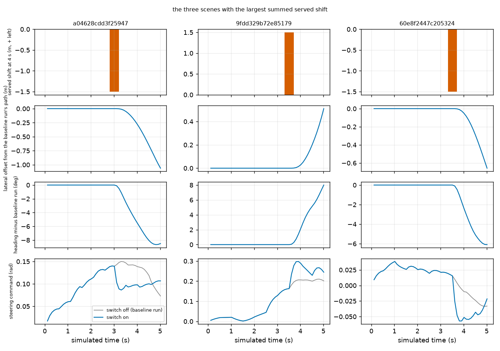
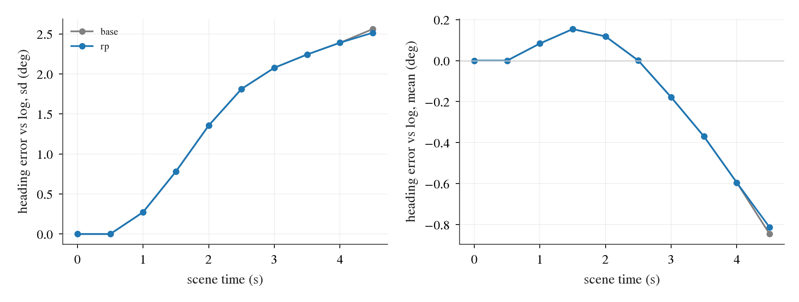
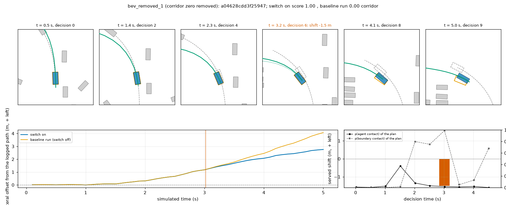
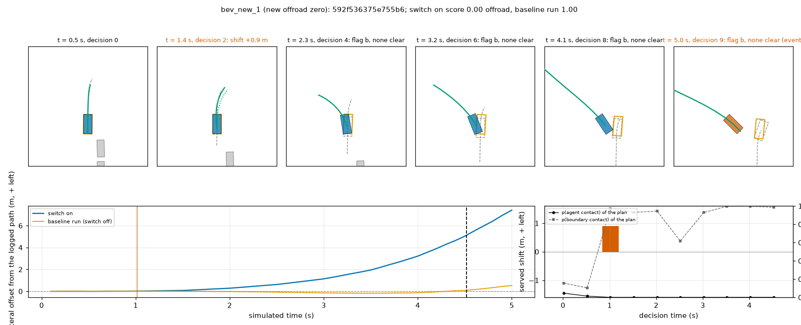
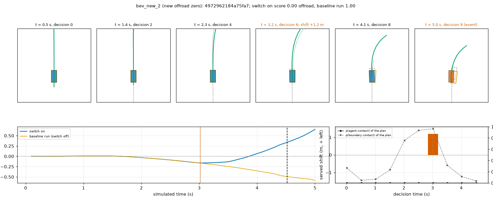
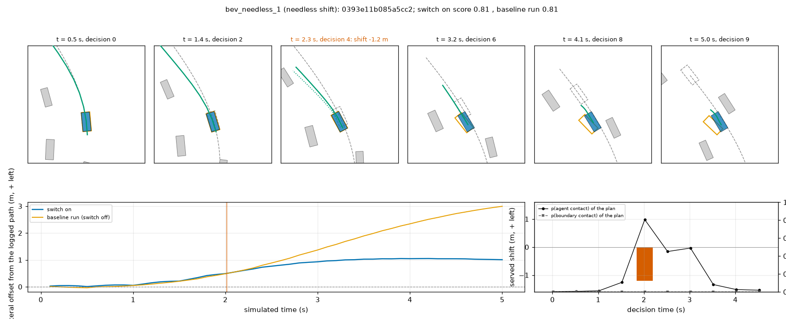
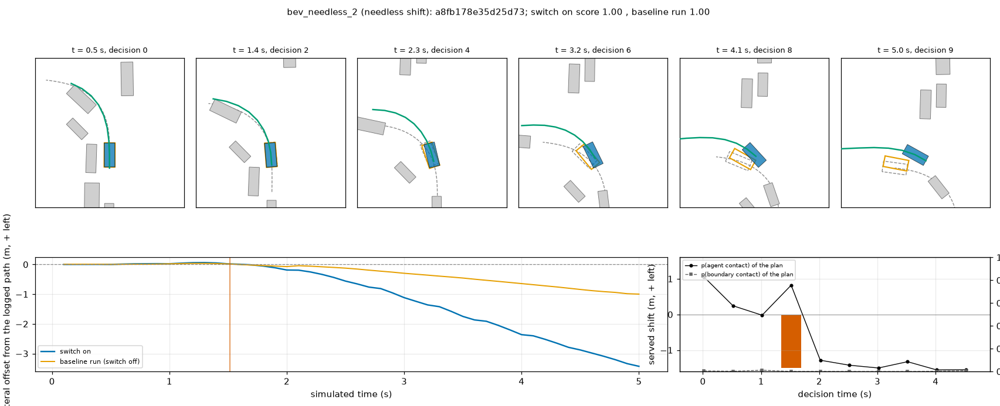

# BODY1 arm 4.2: the contact predictor as a lateral re-plan in the AlpaSim nuPlan driver (stopped at the one-chunk check)

2026-10-10. Implements section 4.2 / 4.4 of [plans/2026-10-10-body1-prereg.md](../plans/2026-10-10-body1-prereg.md) with Amendment 3 (pushed
before the first closed-loop run with the switch). Predictor: arm S0, [s0_gate.md](s0_gate.md). Previous arm: [stop_closed_loop.md](stop_closed_loop.md).

**Verdict. The offline gate passed by a wide factor (hold logs: 3 contacts created on 49 232 clean decisions against 548 resolved); the
closed loop did not follow it. The arm stopped at stage (b): on chunk1 of P2H10-F-s0 one checklist item failed (new zeros in re-planned
scenes 2 > zeros removed 1), so the full read (700 scenes x 2 seeds) and the PAI read were not run. No line L1 / L2 / L3 has a registered
read on either reading.** What exists is one chunk of one seed (233 scenes, `JEV_REPLAN=1`), descriptive: taught-class zeros 10 -> 11
(collision 2 -> 2, offroad 5 -> 7, corridor 3 -> 2), mean scene score -0.0043 [-0.0172, +0.0112] (by log), slow scenes 37 -> 37. On
this chunk L1 and L2 would not be met, L3 would. The chunk is part of reading (B) (never run with a BODY1 switch before).

It is a regression check in any case: all public scenes took part in selecting P2H10 before. Serving-only: open-loop plans are untouched,
navtest is unchanged and was not scored. Nothing was registered or submitted.

Code: [lib/serve_body.py](../lib/serve_body.py) (rule; its docstring is the specification), hook in `experiments/alpasim/lib/sh30_driver.py`
(`JEV_REPLAN=1`), [scripts/bd1_replan.py](../scripts/bd1_replan.py) (`cand`, `gate`, `replay`), [scripts/replan_report.py](../scripts/replan_report.py)
(`pilot`, `check`, `chunk`, `report`), [scripts/replan_bev.py](../scripts/replan_bev.py), [scripts/replan_heading.py](../scripts/replan_heading.py),
[scripts/rp_direct.py](../scripts/rp_direct.py) (the chain on the lane's held card). Tables: `results/replan/`. Box: `$DATA_DIR/runs/body1/cl/rp-*`
(0.8 GB new), `$DATA_DIR/runs/body1/replan/`.

## 1. The rule as registered (Amendment 3)

| Item | Value | Fixed from |
|---|---|---|
| Scores | two-seed mean logits of agent contact `za` and boundary contact `zb`, the plan and its candidates in one batched head pass | s0_gate.md |
| Candidates | the row generator's `lat` ramps: offset a x s(t) / s(4 s) along the path normal, yaw + atan(a / s(4 s)), a in +-{0.3, 0.6, 0.9, 1.2, 1.5} m; only while \|a\| <= 0.10 x the plan's 4 s arc (heading offset <= 5.7 deg); the plan's timing | the generator (equal to `bd1_rows.perturb` to 1e-14 m), the controller |
| Flagged | `za`(plan) >= 0.3999 or `zb`(plan) >= 1.8308 (98th percentiles of the 49 232 clean own-plan hold decisions); a boundary flag triggers on its own | hold logs |
| Clear | `za` < -1.7170 and `zb` < -0.5145 (95th percentiles of the same) | hold logs |
| Choice | flagged and a clear eligible candidate: the smallest \|a\|, of one size the side with the lower max(`za` - CA, `zb` - CB); else the plan | mechanism |
| None clear | the plan, unchanged; no stop | decision 224 |
| Cold start | decision 0 is never re-planned | decision 224 |
| Memory | the side of the last served shift is the only eligible side until 2 decisions were served unchanged; sizes are not carried, nothing is latched | decision 205 |

## 2. Offline gate (hold logs only)

Own-plan decisions of `navsim/body1-hold-logs` (on-log + `ot1` + `yr1` states, both student seeds: 51 316 decisions, 121 logs), one decision at
a time, no memory. Truth by `lib/sweep.py` on the candidate actually served: agent = any box contact (also the rear-end cases the label
excludes), boundary = drivable margin < -0.20 m. Clean = the plan has neither; true contact = the plan has one. Line (b), written before the
grid was computed: harm <= 0.2 % of the clean decisions and 5 x harm <= resolved; selection among the 48 settings of the grid
(`replan/hold_grid.csv`; all 48 meet the line) = the largest resolved - 5 x harm, which is the loosest corner (flags at the 98th, clear at the
95th percentile). `replan/hold_chosen.json`, `hold_by_subset.csv`, `hold_shift.csv`.

| Set | clean decisions | re-planned | (b) harm: served candidate makes a contact | true contacts | flagged | resolved: served has none | (a) resolve rate |
|---|--:|--:|--:|--:|--:|--:|--:|
| pooled | 49 232 | 1 213 (2.46 %) | **3 (0.006 %)**: 1 agent, 2 boundary; 2 logs | 1 944 | 1 176 | **548** (72 logs): 185 agent, 363 boundary | **0.466** (0.282 of all true contacts) |
| class 1 obstacle ahead | 8 978 | 221 | 0 | 361 | 186 | 67 | 0.360 |
| class 2 turn | 6 190 | 179 | 1 | 500 | 277 | 128 | 0.462 |
| class 3 leaving the road | 23 564 | 610 | 0 | 775 | 531 | 282 | 0.531 |
| other | 10 500 | 203 | 2 | 308 | 182 | 71 | 0.390 |
| > 45 deg | 5 173 | 141 | 0 | 385 | 187 | 75 | 0.401 |
| on-log states | 21 536 | 128 (0.59 %) | 0 | 300 | 115 | 42 | 0.365 |
| `ot1` states | 14 216 | 401 (2.82 %) | 0 | 486 | 272 | 141 | 0.518 |
| `yr1` states | 13 480 | 684 (5.07 %) | 3 | 1 158 | 789 | 365 | 0.463 |
| ego speed 0-3 m/s | 7 016 | 19 | 0 | 91 | 31 | 5 | 0.161 |
| 3-10 m/s | 38 838 | 1 069 | 3 | 1 628 | 988 | 481 | 0.487 |
| 10 m/s and more | 3 378 | 125 | 0 | 225 | 157 | 62 | 0.395 |

- (c) Served shift on clean decisions: none 97.54 %; 0.3 / 0.6 / 0.9 / 1.2 / 1.5 m: 0.49 / 0.86 / 0.53 / 0.39 / 0.20 %; mean 0.77 m when shifted.
- With the boundary judged at margin < 0: 4 of the 755 re-planned decisions whose plan has margin >= 0 are served a contact.
- Where it does nothing: 768 of the 1 944 true contacts are not flagged; 503 flagged ones have no clear candidate (plan served); 125 are
  re-planned into a candidate that still has a contact. Of 739 agent-flagged decisions without a clear candidate 238 are true agent contacts.
- Boundary-only flags: they carry 363 of the 548 resolved contacts and 697 of the 1 213 re-plans of clean decisions.

Replay plumbing on decision 220's messages (navtest logs; nothing chosen there; `replan/replay_off.json`, `replay_on.json`,
`replay_on_decisions.csv`): switch off 2 220 decisions bit-identical to SWV1's stored plans (0.0 m) after the hook edit; switch on: the
plan before the shift 0.0 m, plan logits against the gate's stored ones max 0.078, every served trajectory equals `ramps(plan)[choice]`
and obeys the rule (0 failed of 2 220), hook 11.6 ms median. Descriptive: re-plans on 1.15 % of the 2 000 control decisions and in 9 of the
22 collision rollouts; 48 of the 64 agent-flagged decisions of the collision rollouts have no clear candidate.

## 3. Stage (a): pilot8, P2H10-F-s0

`replan/pilot8.md`. Switch off twice: 8 of 8 scenes identical in score and progress, equal to TR1's scores of the same scenes. Switch on:
80 of 80 decisions with a re-plan record, one agent flag without a clear candidate, no re-plan, scores identical.

## 4. Stage (b): chunk1 of P2H10-F-s0 with the switch, against the written checklist

Baseline: TR1's P2H10-F-s0 run of the same chunk file (`replan/chunk1_check.md`, `chunk1_check.json`, `heading_chunk1.md`).

| # | Check | Value | Verdict |
|--:|---|---|---|
| 1 | Rollouts complete, no driver error, a record on every decision | 233 / 233; 2 330 drive calls, 0 errors; 2 330 / 2 330 records | pass |
| 2 | `drive` total p50 / p90 <= 100 ms | 35.4 / 55.1 ms (p99 82.6, max 119); baseline run 17.8 / 30.7; hook alone 13.7 / 25.6 | pass |
| 3 | Decisions re-planned between 0.4 and 5 % | 19 / 2 330 = 0.82 %, in 19 of 233 scenes (one each); sizes 0.3 / 0.6 / 0.9 / 1.2 / 1.5 m: 1 / 6 / 5 / 3 / 4; left / right 10 / 9 | pass |
| 4 | No side change within 2 decisions | 0; no scene was served both sides | pass |
| 5 | New zeros in re-planned scenes <= zeros removed | **2 new (offroad, offroad) against 1 removed (corridor)** | **fail** |
| 6 | No re-planned scene with >= 3 steering reversals more than its baseline run | 0 scenes; sums 10 against 2, at most 2 per scene | pass |
| 7 | Heading error against the log at decision 9, decision 205's set within the chunk (68 log-straight scenes, 17 logs): sd <= 1.25 x baseline run | 2.51 against 2.56 deg, ratio 0.98 [0.92, 1.00] | pass |

Flags after decision 0: 91 decisions in 45 scenes (agent 61, boundary 26, both 4; 20 more at decision 0, not acted on); 72 flagged decisions
had no clear candidate. So a flag became a shift in 19 of 91 cases.

Served shift, lateral offset from the baseline run's path, heading minus the baseline run and steering command of the three scenes with the
largest shift (blue: switch on, grey: baseline run). Look at the second and third rows: after the single shifted decision the offset and
the heading difference keep growing for the rest of the scene although every later decision serves the plan unchanged.

Heading error against the log per decision on the 68 log-straight scenes of item 7 (grey: baseline run). The two curves coincide: the
set holds few re-planned scenes, so item 7 does not see what the traces show.

## 5. The one chunk as a read (descriptive: one seed, 233 scenes, 27 logs; not the registered read)

`replan/chunk1_stats.json`, `chunk1_flagged_scenes.csv` (every flagged scene and every zero, with the served shifts per decision). CI:
bootstrap by log (`jevdrive.stats.paired(groups=log)`), scene-resampled in brackets where given.

| Driver | n | mean scene score | score 1 | zeros | at-fault collision | offroad | left corridor | slow |
|---|--:|--:|--:|--:|--:|--:|--:|--:|
| P2H10-F-s0 (TR1 run) | 233 | 0.9411 | 186 | 10 | 2 | 5 | 3 | 37 |
| P2H10-F-s0 + `JEV_REPLAN=1` | 233 | 0.9368 | 185 | 11 | 2 | 7 | 2 | 37 |

| Line (on this chunk only) | Value | Would be |
|---|---|---|
| L1 taught-class zeros go down | 11 against 10 | not met |
| L2 mean difference >= 0, lower bound > -0.005 | -0.0043 [-0.0172, +0.0112] by log ([-0.0215, +0.0086] by scene) | not met |
| L3 slow <= 1.1 x base | 37 against 40.7 (base 37) | met |

- **Scenes never re-planned are untouched**: 214 scenes, 0 with a different score. Every change comes from the 19 re-planned scenes:
  1 better, 4 worse, 14 unchanged, sum -1.01 (mean 0.7764 against 0.8293).
- **Zeros.** Removed: 1 (`...a04628cd`, left corridor -> 1.0, a 62 deg turn; one -1.5 m shift at decision 6 on a boundary flag). New: 2,
  both offroad after one shift on a boundary flag (`...592f5363`, +0.9 m at decision 2 at 3.4 m/s; `...49729621`, +1.2 m at decision 6 at
  8.2 m/s). Of the 10 baseline zeros 9 stay: the two collisions (one never flagged; one agent-flagged at decisions 3-7 with no clear
  candidate), four offroad never flagged at any decision, one offroad and one corridor re-planned once and still zero, one corridor flagged
  with no clear candidate.
- **One shift, lasting divergence.** In the 19 re-planned scenes the heading at decision 9 differs from the baseline run's by 6.6 deg on
  average (sd 12.2, max 43) and the position by up to 4.1 m, after a single shifted decision whose ramp is at most 5.7 deg. The plan of the
  next decision does not return to the previous line: it continues from the state the shift produced (decision 205's loop).
- **> 45 deg (logged 4 s future of the scene's navtest token; 18 scenes, 14 logs).** Mean 0.8298 -> 0.8854 (+0.056 [0.000, +0.188]), zeros
  3 -> 2 (the removed corridor zero), 4 scenes re-planned.

## 6. Review strips (seed 0, chunk1)

Five scenes were rerun in one job with the rollout logs kept (scores reproduce the chunk run). Each strip: six bird's-eye panels (other
vehicles grey, logged ego dashed, baseline run's ego orange, switch-on ego blue, returned trajectory green, plan before the shift dotted),
the lateral offset of both egos from the logged path, the served shift and the plan's two contact probabilities per decision. Objects and
the logged path are privileged, for the reader only. Cases: `replan/bev_cases.csv`. The chunk has one removed zero, so one is shown.

| Figure | Case | What to look at |
|---|---|---|
|  | corridor zero removed, 0 -> 1.0 (62 deg left turn) | The baseline run cuts inside the logged arc until it is 4 m off (orange); p(boundary) rises from 2.0 s, the -1.5 m shift at 3.0 s bends the exit outward and the ego ends 2.8 m from the logged path, inside the corridor. |
|  | new offroad zero, 1.0 -> 0 | One +0.9 m shift at 1.0 s at 3.4 m/s on a boundary flag. From the next decision on the plan itself turns left where the log goes straight; the boundary flag stays on at every later decision with no clear candidate, and the ego leaves the road 7 m from the logged path. |
|  | new offroad zero, 1.0 -> 0 | The baseline run drifts 0.5 m right of the log and passes; the head reads that as a boundary contact, the +1.2 m shift at 3.0 s sends the ego left, and it is offroad at 4.5 s only 0.35 m left of the logged path: the head put the edge on the wrong side. |
|  | shift with no zero at stake, 0.813 -> 0.809 | An agent flag at 2.0 s beside parked vehicles in a 22 deg turn, -1.2 m. The baseline run goes on to 3 m left of the logged path; the shifted run stays within 1 m: one shifted decision moves the end pose by 1.3 m and 14 deg. |
|  | shift with no zero at stake, 1.0 -> 1.0 (80 deg turn) | One -1.5 m shift at 1.5 s; both runs score 1.0 but end 3.1 m and 19 deg apart. |

## 7. Reading

- The hold-log gate measured the wrong thing for this action. Open loop, one decision at a time, a served ramp almost never touches
  anything (3 in 49 232). In the loop the ramp is not what is driven: one shifted decision redirects every later plan, and the outcome is
  decided by plans the head never scored. Created contacts per re-planned scene: 2 of 19 here against 3 of 1 213 decisions offline.
- The flag rarely becomes an action (19 of 91), and not where the zeros are: of the chunk's 10 baseline zeros 5 were never flagged
  (4 of the 5 offroad), 2 were flagged without a clear candidate, 2 were re-planned and stayed zero, 1 was removed. The boundary AUC of
  0.978 on hold logs does not show up as recall on the closed loop's offroad scenes.
- Boundary-only triggers gave the removed zero and both new ones. The agent-triggered shifts (9 scenes) created no zero and removed none.
- What the remaining zeros need, as far as this chunk shows: (i) offroad / corridor: the plans that leave the road are not flagged, so
  the lesson has to reach the plan itself (prereg 4.3, the loss on student-plan rows with off-track states), or the head needs rows from the
  closed loop's own states; (ii) collisions: flagged but no lateral candidate within 1.5 m is predicted clear, the case a persistent,
  gentle stop was kept in mind for; (iii) any lateral serving action needs a target that persists across decisions (a held offset or a
  return-to-line ramp), otherwise one decision's shift is an uncontrolled change of course.

## 8. Costs, deviations, limits

Costs: about 0.75 card-h (hold candidates 1 min, replays 9 min, two pilots of 3 x 2.5 min, chunk1 862 s, strips 2 min), about 2 h wall,
0.8 GB new on the box. One stack: renderer 10 GB + driver 2.3 GB VRAM at the end of the run, RSS under 13 GiB at the last sample. No SIGKILL.

Deviations:
1. The read is incomplete by the protocol's own stop rule: 1 of 6 chunk jobs, no PAI.
2. **Not through the pool.** The pool's five cards were full of another lane's queue (15 running, 50-70 queued, the lane's 32 GB jobs not
   placed for 12 min), so the closed-loop jobs and the two GPU scripts ran directly on the lane's whole-held card 2 through
   `scripts/rp_direct.py` (the run command, overrides, fill-in and pruning of `ot2_loop.py`). The first direct pilot ran three unpinned
   stacks at once: their thread pools sized from 208 host threads hit the container's pid limit, one runtime died and five rollouts came
   back with a failed evaluation (score 0, no flag). The chain now pins each stack to 8 cores no pool job holds, runs at most 2, and
   reruns rollouts without an evaluation; the pilot of section 3 is the rerun. The failed pilot's directory is `cl/rp-pilot-d`.
3. Amendment 3 item 3 says "of the 3 harms 2 came through either trigger's boundary side": meant is that 2 of the 3 created contacts are
   boundary contacts (1 agent).
4. After the failed check a 5-scene rerun with the switch was made for the review strips (scenes already read; no new score).
5. > 45 deg uses the logged 4 s future of the scene's navtest token (the stop arm's definition), as Amendment 3 states.
6. Checklist item 7 was computed on the Mac (logged paths of the 400 diagnosis scenes live in `tmp/c1`), from a decision table made on the box.
7. The struck-side read of decision 220's collisions (optional) was not made.
8. Clips with the model view were not made; BEV strips instead.

Limits: one seed, one chunk (2 baseline collisions, 19 re-planned scenes: the 2-against-1 count is small); the baseline is another run of
the same checkpoint, relied on through the exact repeatability of scenes without a re-plan (214 of 214 here); "created by the shift" is by
outcome against that run; the gate's hold decisions are single states, so neither the memory rule nor the loop was gated offline; the
latency is the GPU box's; the PAI hook does not exist (Amendment 2 item 9).
