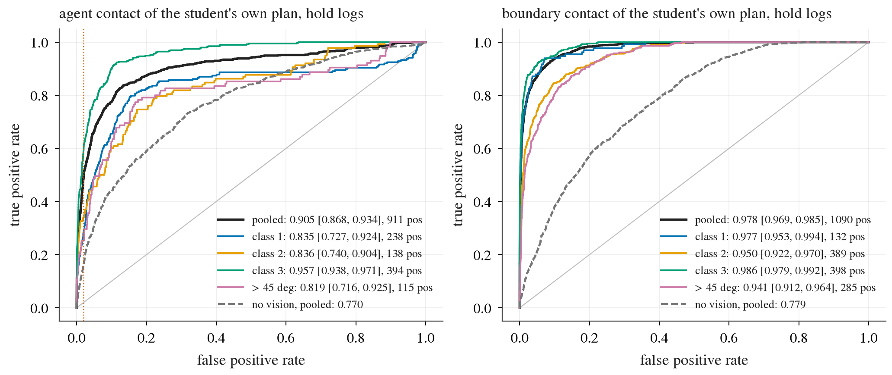
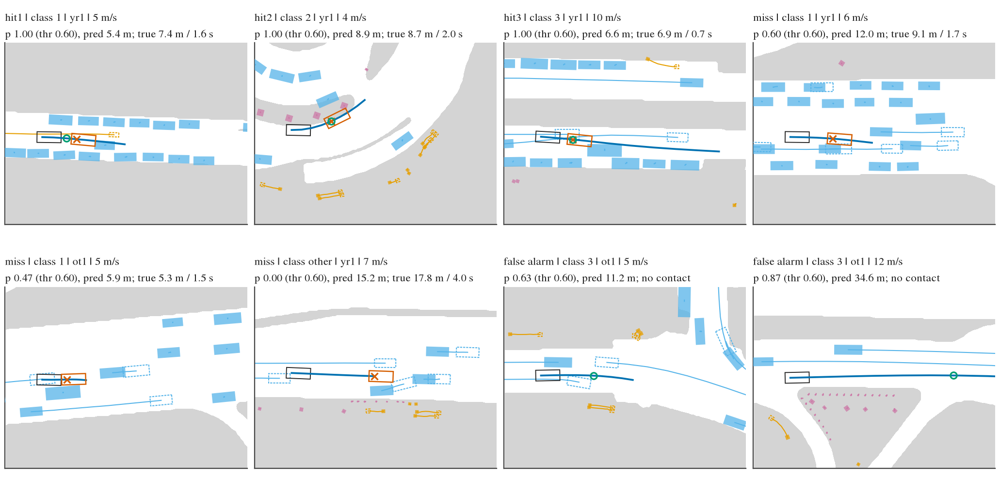
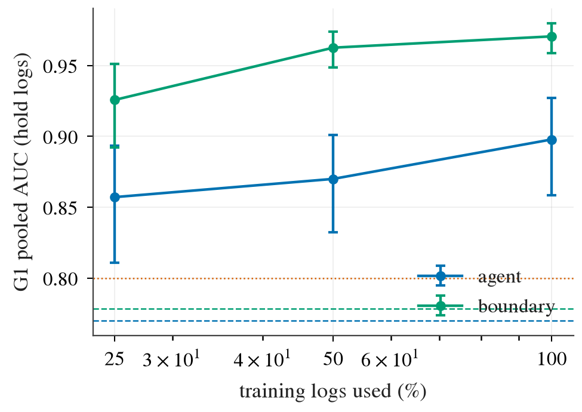

# BODY1 arm S0: contact predictor on frozen Cinque tokens, offline gates G1 and G2

2026-10-10. Implements section 3 (arm S0) of [plans/2026-10-10-body1-prereg.md](../plans/2026-10-10-body1-prereg.md) with
Amendment 1. Row set and classes: [taxonomy.md](taxonomy.md). No driver hook was built and no closed loop was run.

Code: [lib/contact_head.py](../lib/contact_head.py) (head, labels, log-clustered AUC),
[scripts/bd1_train.py](../scripts/bd1_train.py) (`steps`, `train`), [scripts/bd1_gate.py](../scripts/bd1_gate.py)
(`std`, `predict`, `report`, `figs`), [scripts/bd1_retry.sh](../scripts/bd1_retry.sh). Tables: `results/s0/*.csv`, `*.json`.
Box: `$DATA_DIR/runs/body1/s0/` (0.7 GB).

**Verdict. S0 passes G1 and G2.** G1 on `navsim/body1-hold-logs`: agent contact of the student's own plan AUC 0.905
[0.868, 0.934], boundary contact 0.978 [0.969, 0.985]; every user class is at or above 0.80 on both. G2 on decision 220's
nuPlan decisions: 0.885 [0.774, 0.969] (line 0.80 with lower bound > 0.70; references 0.728 / 0.718 / 0.786). The G2 pass
rests on the mean of two seeds: one seed alone has a lower bound of 0.680.

## 1. The head

Input: the cached `view_39` tokens of the 8 policy slots (8 x 32 x 512, fp16) with a slot-validity mask, the 20-dim ego
vector (it holds the command), and a query of 8 rear-axle poses at 0.5 s. Nothing else: no boxes, map, raster or hidden state.

Architecture `step` (4.4 M parameters, d = 256). Scene memory: a 3-layer transformer over the ego token and the 256 vision
tokens (slot and position embeddings, invalid slots masked). A query is 9 step tokens (t = 0 and the 8 poses; Fourier
features of x, y, plus heading, step length, yaw step and a time embedding). Three decoder layers: self-attention among
the 9 steps of one query, cross-attention to the memory. Outputs: per step token the minimum agent clearance and the minimum
drivable margin over its 0.5 s interval (dense regression targets computed from the labels, `bd1_train.py steps`; their
minimum reproduces the row labels `a_clr` / `b_margin`), and from the mean + max pooled steps the agent-contact logit, the
boundary-contact logit, first-contact arc length and time (agent), arc length (boundary), clearance and margin.

Training: `w4` balance recomputed on the fit logs with Amendment 1's class 3 (4 classes x 3 contact types at equal mass;
rear-end-only rows weight 0), states sampled with probability ~ (sum of row weights)^0.5 and the rest of the weight in the
loss; all 24 queries of a state per step; batch 256 states, 12 000 steps, AdamW 3e-4, bf16; slot dropout on 30 % of the rows
(only the k newest slots, k uniform in 1..7). Boundary logit: positive = margin < -0.20 m with first contact after t = 0;
rows in [-0.20, 0), rows outside at t = 0 and rows without raster coverage carry no boundary label (Amendment 1 item 2).
Model selection: best evaluation step by the mean of the own-plan agent and boundary AUC on a validation part of the
training logs (`sha256("bd1val|" + log) % 10 == 0`, 116 logs, 24 487 states); fit set 955 logs, 192 287 states. Hold logs
are never loaded by the trainer.

### Design choice (validation logs only)

| Stage | Arch | Fit states | Val own-plan agent AUC | Val own-plan boundary AUC | Selected step |
|---|---|--:|--:|--:|--:|
| pilot (shards s2-s4) | step | 48 k | 0.857 | 0.936 | 2 000 of 6 000 |
| pilot | crit (one token per query, no dense targets) | 48 k | 0.849 | 0.949 | 3 500 |
| pilot | blind (no vision) | 48 k | 0.744 | 0.749 | 1 000 |
| full | step, seed 0 / 1 | 192 287 | 0.909 / 0.906 | 0.963 / 0.970 | 5 500 / 8 500 |
| full | crit, seed 0 / 1 | 192 287 | 0.908 / 0.896 | 0.953 / 0.964 | 4 500 / 6 500 |
| full | blind, seed 0 | 192 287 | 0.761 | 0.774 | 7 000 |

Validation positives: 1 004 agent, 1 209 boundary (240 / 310 at pilot scale). `step` and `crit` are within seed spread
(selection metric 0.936 / 0.938 against 0.931 / 0.930); `step` was kept because its agent AUC decays less late in training
(0.894 against 0.871 at step 12 000) and it gives the per-interval clearance. `crit` was not read on the hold logs or on G2.
The agent AUC peaks at 3 000 to 5 500 steps and then falls by about 0.015 while the boundary AUC keeps rising: the agent
half over-fits first.

## 2. G1: the student's own plan on hold logs

`navsim/body1-hold-logs`, 121 logs, 25 658 states (on-log + ot1 + yr1), query slots own0 and own1 pooled (51 316 rows).
Score = mean of the two seeds' logits. AUC with ties at half; interval = percentile cluster bootstrap by log, 10 000
resamples, seed 0 (the cluster draws of `jevdrive.stats.bootstrap(groups=...)`; the AUC is recomputed exactly per draw,
`contact_head.auc_boot`). Agent positive = `a_hit` (rear-end by a faster object is not a contact). Boundary rows without a
label (section 1) are left out, which is why n differs.

| Subset | Agent AUC | n rows | positives | logs with a positive | Boundary AUC | n rows | positives | logs with a positive |
|---|---|--:|--:|--:|---|--:|--:|--:|
| **pooled** | **0.905 [0.868, 0.934]** | 51 316 | 911 | 64 | **0.978 [0.969, 0.985]** | 49 417 | 1 090 | 82 |
| class 1 obstacle ahead | 0.835 [0.727, 0.924] | 9 362 | 238 | 30 | 0.977 [0.953, 0.994] | 9 115 | 132 | 22 |
| class 2 turn | 0.836 [0.740, 0.904] | 6 694 | 138 | 21 | 0.950 [0.922, 0.970] | 6 343 | 389 | 35 |
| class 3 leaving the road | 0.957 [0.938, 0.971] | 24 432 | 394 | 53 | 0.986 [0.979, 0.992] | 23 379 | 398 | 67 |
| other (no line) | 0.935 [0.890, 0.977] | 10 828 | 141 | 19 | 0.980 [0.960, 0.994] | 10 580 | 171 | 35 |
| > 45 deg (no line) | 0.819 [0.716, 0.925] | 5 562 | 115 | 15 | 0.941 [0.912, 0.964] | 5 349 | 285 | 31 |
| on-log states | 0.852 [0.750, 0.929] | 21 852 | 137 | 21 | 0.972 [0.956, 0.984] | 21 530 | 165 | 35 |
| ot1 states | 0.902 [0.848, 0.939] | 14 732 | 227 | 36 | 0.975 [0.961, 0.986] | 14 109 | 268 | 54 |
| yr1 states | 0.903 [0.878, 0.925] | 14 732 | 547 | 60 | 0.977 [0.967, 0.984] | 13 778 | 657 | 80 |

Line 0.80 on the AUC: met pooled and in classes 1, 2, 3 (each has >= 30 positives) for both contact types. The lower bounds
of the agent AUC in classes 1 and 2 are 0.73 and 0.74: the positives sit in 30 and 21 logs. Per seed, pooled: agent 0.898
[0.859, 0.927] / 0.892 [0.855, 0.921], boundary 0.971 / 0.975; per seed class 1 agent 0.817 / 0.826, class 2 0.823 / 0.823
(`g1.csv`).

ROC of the two-seed score on hold logs, per class. Look at the right end of the agent curves of class 1 and > 45 deg: about
10 % of their positives are ranked below most negatives (confident misses), which is where the class AUC is lost; class 3
has no such tail. The dotted vertical line is the 2 % false-positive operating point of section 4.

### Baselines on the same rows

| Score | Agent AUC pooled | class 1 | class 2 | class 3 | > 45 deg | Boundary AUC pooled | class 1 | class 2 | class 3 | > 45 deg |
|---|--:|--:|--:|--:|--:|--:|--:|--:|--:|--:|
| S0 (two seeds) | 0.905 | 0.835 | 0.836 | 0.957 | 0.819 | 0.978 | 0.977 | 0.950 | 0.986 | 0.941 |
| (a) same head without vision (ego + query), 1 seed | 0.770 [0.730, 0.804] | 0.662 | 0.738 | 0.798 | 0.616 | 0.779 [0.742, 0.810] | 0.820 | 0.688 | 0.757 | 0.743 |
| (b) plan lateral std at 2 s (the plan head's own, decision 220's signal) | 0.749 [0.709, 0.784] | 0.705 | 0.610 | 0.860 | 0.708 | 0.809 [0.781, 0.834] | 0.805 | 0.605 | 0.850 | 0.597 |
| (b) plan lateral std at 4 s | 0.690 | 0.678 | 0.528 | 0.804 | 0.569 | 0.795 | 0.789 | 0.594 | 0.810 | 0.590 |
| (b) ego speed | 0.528 | 0.522 | 0.457 | 0.578 | 0.574 | 0.527 | 0.617 | 0.484 | 0.562 | 0.478 |
| plan 4 s arc length | 0.521 | 0.490 | 0.487 | 0.561 | 0.609 | 0.542 | 0.595 | 0.436 | 0.569 | 0.428 |
| plan lateral offset at 4 s | 0.553 | 0.608 | 0.498 | 0.570 | 0.676 | 0.687 | 0.712 | 0.439 | 0.638 | 0.413 |
| plan heading change at 4 s | 0.554 | 0.621 | 0.472 | 0.551 | 0.634 | 0.716 | 0.722 | 0.497 | 0.670 | 0.516 |
| (c) logged-distance oracle | 1.0 by construction (the label is the sweep against the logged boxes / raster) | | | | | | | | | |

Same rows, same positives and intervals as above (`g1.csv` has every cell with its interval). The vision tokens add 0.135
to the agent AUC and 0.20 to the boundary AUC over the blind head. The blind head and the plan std are at 0.75 to 0.81
pooled, so "ego state + plan shape" alone is not at chance; in class 2 and > 45 deg they fall to 0.60 to 0.74.

### Perturbed queries (no line)

Hold logs, two-seed score, per query family (`g1_queries.csv`; 2 000 resamples): agent AUC lat 0.917, head 0.905, gain
0.913, arc 0.918, stop 0.888, ship 0.899, log 0.905 (37 positives); boundary 0.978 to 0.990 (log 0.963, 13 positives).
The agent AUC of perturbed queries is not above that of the own plan: with these tokens the difficulty is where the
objects are, not which query is asked.

### Regressions and slot count (reported)

Hold logs, two-seed mean (`regress.json`): boundary margin MAE 0.28 m on the own plan (0.30 m over all queries; clip -2 ..
4 m; r = 0.951); agent clearance MAE 1.11 m on the own plan (clip -1 .. 8 m). With only the k newest slots at test time
(`g1_slots.csv`): agent AUC 0.885 / 0.902 / 0.907 / 0.905 for k = 1 / 2 / 4 / 8, boundary 0.964 / 0.974 / 0.978 / 0.978.

## 3. G2: decision 220's nuPlan decisions

`lib/g2.py` unchanged (122 intersecting decisions of 22 collision rollouts against 1 827 clean control decisions,
speed-matched weights, cluster bootstrap by log, 1 000 resamples). Score = agent logit of the served plan from the dumped
tokens, ego vector and plan (`g2/dump/`); all decisions have 8 valid slots. Nothing was fitted or chosen on these logs.

| Score | AUC | Passes (>= 0.80, lower > 0.70) |
|---|---|---|
| **S0, mean of the two seeds** | **0.885 [0.774, 0.969]** | yes |
| S0 seed 0 | 0.883 [0.792, 0.959] | yes |
| S0 seed 1 | 0.830 [0.680, 0.959] | no (lower bound) |
| (a) blind head (ego + plan) | 0.655 [0.530, 0.767] | no |
| S0 at 25 % of the logs | 0.806 [0.724, 0.922] | yes |
| S0 at 50 % of the logs | 0.834 [0.689, 0.947] | no (lower bound) |
| references (decision 220) | simulator current boxes 0.728, best frozen head 0.718, plan lateral std 0.786 [0.738, 0.865] | |

n = 122 positives / 1 827 negatives in every row, none missing (`g2.csv`). The registered score (the mean of the two seeds,
fixed in `bd1_gate.py` before the read) passes. The intervals are wide (22 rollouts in 9 logs) and seed 1 alone misses the
lower bound, so the pass is not robust to the seed.

## 4. Operating point for the stop arm (no hook built)

Threshold on the two-seed agent logit set on hold logs so that 2 % of the clean own-plan decisions are flagged (logit
0.408, p = 0.60; 50 265 clean rows = no agent contact and no rear-end flag). `stop.json`.

| Read | Value |
|---|---|
| Hold: recall of agent contacts | 0.508 [0.418, 0.588] (463 of 911, 64 logs) |
| Hold: recall by class 1 / 2 / 3 / other | 0.41 / 0.33 / 0.61 / 0.56 (n 238 / 138 / 394 / 141) |
| Hold: error of the predicted first-contact arc length on true positives | median 1.83 m, p90 7.39 m, median signed error -0.04 m (true arc length median 12.1 m) |
| Hold: error of the predicted first-contact time on true positives | median 0.46 s, p90 1.40 s |
| G2 (same threshold, not tuned there): flags on clean control decisions | 2.6 % of 1 827 (3.3 % of all 2 000 control decisions) |
| G2: recall on the 122 positive decisions | 0.434 (53); at least one flagged decision in 17 of the 22 collision rollouts |

The false-positive rate transfers from navtrain hold logs to the AlpaSim decisions (2.0 % -> 2.6 %). For a stop `m` = 1 to
2 m before the predicted contact, the arc-length error is the weak part: half of the true positives are within 1.8 m, one
in ten is off by more than 7.4 m.

Eight hold-log cases of own0 at this threshold (`s0/bev_cases.csv`): three true positives (one per class, highest score),
three misses and two false alarms drawn at random, each from a different log. Blue line: the student's plan; vermillion box
and cross: the true first contact; green circle: the predicted first-contact point (drawn when flagged). Look at the misses:
two are vehicles met within 2 s with p at or just under the threshold (0.60, 0.47), one is a moving vehicle reached at
4.0 s with p = 0.00; the false alarms are plans passing close to objects that the label clears.

## 5. Learning curve

One seed per point, nested log subsets of the fit logs, same validation logs and step budget.

| Training logs | Fit states | Hold agent AUC | Hold boundary AUC | Val agent / boundary | G2 |
|--:|--:|---|---|--:|---|
| 25 % (239) | 46 298 | 0.857 [0.811, 0.893] | 0.926 [0.892, 0.951] | 0.881 / 0.926 | 0.806 [0.724, 0.922] |
| 50 % (478) | 93 202 | 0.870 [0.832, 0.901] | 0.963 [0.948, 0.974] | 0.896 / 0.949 | 0.834 [0.689, 0.947] |
| 100 % (955), seed 0 | 192 287 | 0.898 [0.859, 0.927] | 0.971 [0.959, 0.980] | 0.909 / 0.963 | 0.883 [0.792, 0.959] |

G1 pooled AUC against the share of training logs; dashed lines are the blind head. The agent AUC still rises by 0.028 from
50 % to 100 % (class 1: 0.763 -> 0.777 -> 0.817; class 2: 0.745 -> 0.808 -> 0.823), the boundary AUC by 0.008: the agent
half is still label-limited at 955 logs, the boundary half is close to flat. Single seeds; the seed spread at 100 % is
about 0.006 (agent) and 0.004 (boundary) on hold.

## 6. What limits it

- **Labels (agent half).** The learning curve above has not flattened for the agent contact, and the agent AUC over-fits
  within a run while the boundary AUC does not. Agent positives of the own plan are 1 to 4 % of the rows and sit in few logs.
- **Tokens.** The boundary is read almost fully (0.978, margin MAE 0.28 m against decision 192's 0.475 m on navtest
  candidates, which is a different test set). The agent contact in classes 1 and 2 and > 45 deg stays at 0.82 to 0.84 with
  a tail of confident misses; S1 / S2 would have to move exactly these cells.
- **Motion / slot count.** Dropping from 8 slots to the newest one costs 0.020 agent AUC and 0.014 boundary AUC on hold
  logs; 2 slots are within 0.003 of 8. History beyond one extra frame adds little, so either the tokens of one frame pair
  already carry the motion or the head does not use it. This was not separated (no oracle arm with object velocity).
- **Domain.** Navtrain hold logs to AlpaSim decisions: AUC 0.905 -> 0.885, the 2 % false-positive rate becomes 2.6 %.

## 7. Reads of the gates (all of them)

One `predict` call (2026-10-10 03:07) read the hold logs and the G2 decisions for five checkpoints: step seed 0, step
seed 1, blind seed 0, step at 25 %, step at 50 % (`s0/reads.jsonl`). Every number of sections 2 to 5 comes from that one
set of predictions; `report` was run twice on it (the first stopped on an indexing bug before G2 was scored; G1 numbers
were printed both times and are identical). No other configuration was read on either gate: `crit` and the pilot arms
were read on validation logs only. The plumbing of `bd1_gate.py` was checked beforehand with `--dry` on the validation logs
with zeros in place of G2 scores.

## 8. Costs, deviations, limits

Costs: box wall about 40 min from the first smoke to the report. GPU job time 1.9 card-h in total (pilots 0.5, seven
full-scale runs 1.36: 7 to 18 min each, 16.9 it/s for `step` alone on a card, 59.6 GB VRAM with all tokens on the card; std
baseline and predictions 0.05). Card 2 ran the smoke, the pilots, step seed 0 and the predictions; the other six full-scale
runs and the std baseline went through the pool (owner body1). CPU: step labels 16 workers x 4.6 min. Disk 0.7 GB.
SIGKILLs taken: 0 (state is checkpointed every 500 steps and the launch retries on rc 137; the resume path was checked with
one deliberate `kill -9`).

Host memory (the kill rule of decision 222 became known after these runs had finished): every full-scale run gathers
57 GB of `front.npy` through a memory map on its way to the card, which warms that much page cache; the card-2 jobs (smoke,
pilots, step seed 0, predictions) were not declared to the pool with `cl hold --pid`, and the pool jobs declared `--ram 16`
against a measured peak RSS of 16.7 GB (3.4 GB once the tokens are on the card). Margin to the kill line after the runs:
249 GiB. A rerun on card 2 should read the margin line of `cl top` first, trim if it is short (`cl trim --margin 150`),
declare the process, and submit pool jobs with `--ram 18`.

Checkpoints (box, `$DATA_DIR/runs/body1/s0/`): `full-step/20261010-024906/ckpt.pt` (seed 0),
`full-step/20261010-024909/ckpt.pt` (seed 1), `full-blind/20261010-024909/ckpt.pt`, `lc25-step/20261010-024930/ckpt.pt`,
`lc50-step/20261010-024930/ckpt.pt`, `full-crit/20261010-024909/ckpt.pt` and `full-crit/20261010-024909-2/ckpt.pt` (not
read on the gates). Predictions `pred/*.npz`, tables `report/`.

Deviations from the prereg and the brief:
1. The head is not decision 192's implicit field with footprint point queries: it queries the scene per sweep step and
   regresses per-interval clearance / margin (section 1). The field variant was not trained.
2. The gate score is the mean of two seeds' logits (written into the gate script before the read); per-seed reads are given.
3. `w4` was recomputed on the fit logs with Amendment 1's class 3 and with the boundary type taken at < -0.20 m, instead of
   the stored `balance.json` table.
4. Rows whose only contact is a rear-end by a faster object are negatives in the G1 agent read (the prereg says "excluded
   from the positives") and have weight 0 in training.
5. A boundary row already outside at t = 0 has no boundary label (neither positive nor negative), like the -0.20 .. 0 band.
6. The pilot (shards s2-s4) compared `step`, `crit` and `blind` on validation logs only; S0 was judged at full scale.
7. Six of the seven full-scale runs used pool cards, not only card 2.
8. The interval is computed by `contact_head.auc_boot` with the cluster draws of `jevdrive.stats`, because `stats` has no
   AUC statistic.

Limits: student plans on navtrain are in-sample for the adapter (prereg), so the own-plan positives on hold logs are
contacts of a model that was trained on those logs; off-track states supply 85 % of the agent positives and exist only
above 3 m/s; logged agents do not react; class positives sit in 21 to 53 logs; G2 is 22 rollouts in 9 logs with one seed
missing the lower bound; the learning curve is one seed per point; the stop numbers are open loop and say nothing about
progress cost or about what the driver does after a stop; no closed-loop read exists.
