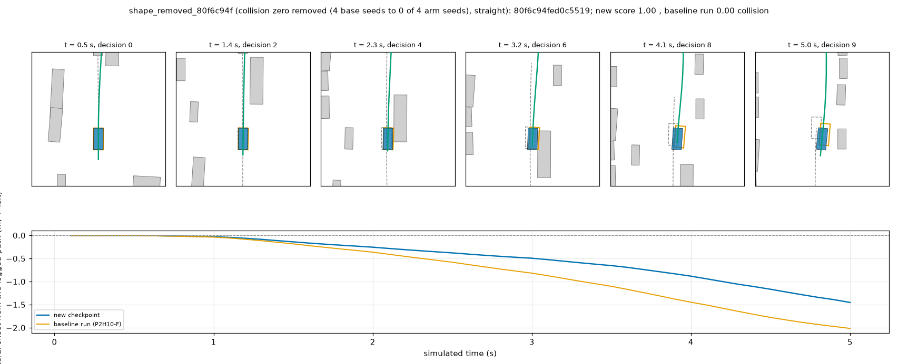
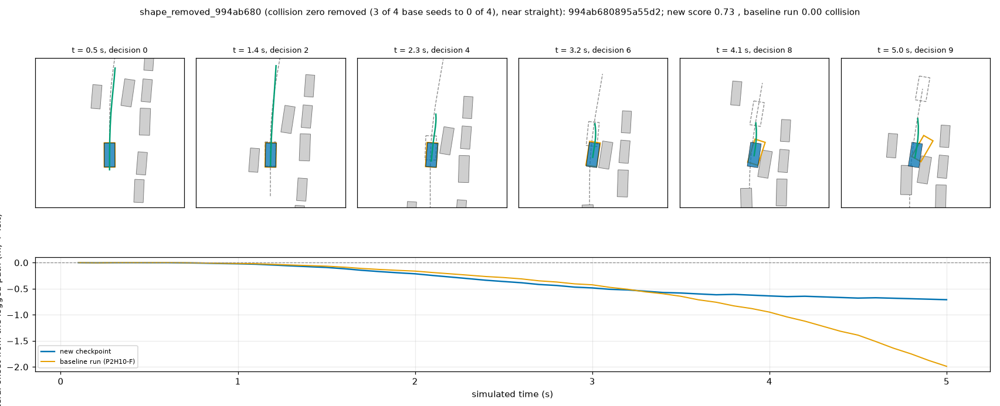
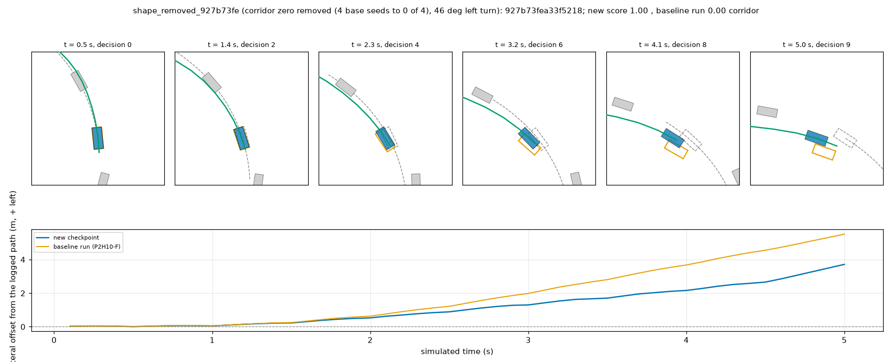
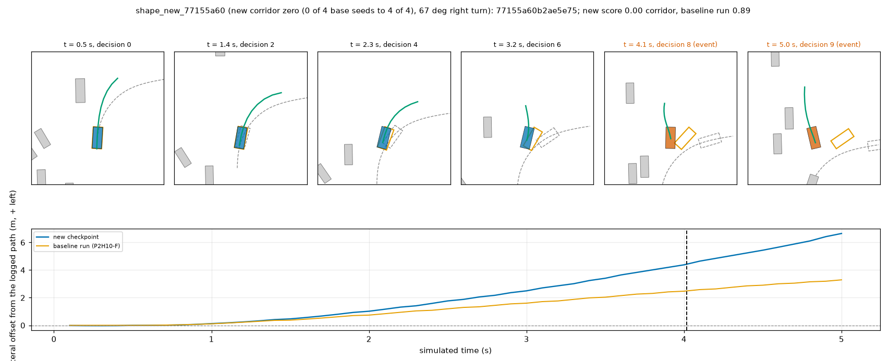
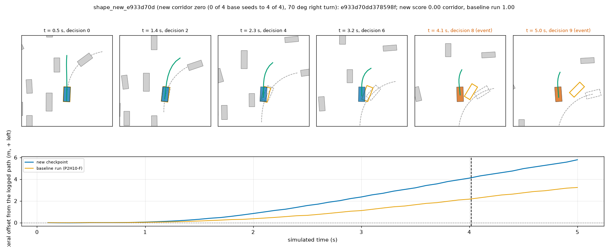
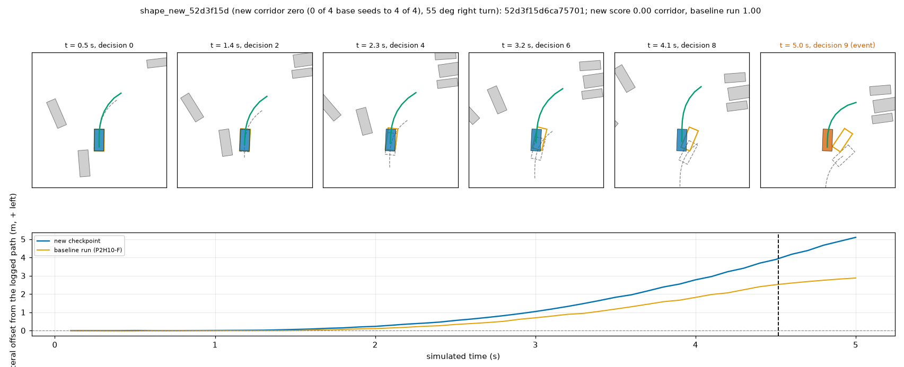

# BODY1 arm 4.3, Amendment 6 (`P2H10S`): the descriptive 4-seed closed-loop read

2026-10-10. This is a **descriptive read made after the arm stopped at G3 (b)** ([shape_pilot.md](shape_pilot.md), decision 232), as note (i) of
Amendment 6 fixed it. It is not a registered read, it cannot promote the arm, and every number below carries that label. All 700 scenes are
development scenes for this lane (the public scenes took part in selecting P2H10, and three arms of this lane were designed on them). Served
model: `P2H10S-F-s{0,1,2,3}` in the unchanged nuPlan driver (`sh30`, `SH30_TAG=<tag>`; no BODY1 serving switch), 700 scenes each through
`ot2_loop.py` with the chunk lists of TR1's baseline. Base: `P2H10-F-s{0,1}` are TR1's baseline runs, `P2H10-F-s{2,3}` the base retrained
for note (h). Reader: [scripts/shape_cl_report.py](../scripts/shape_cl_report.py); tables `results/shape/cl/` (`report.md`, `stats.json`, `flips.csv`,
`per_scene.csv`); strips `figs/shape/shape_*.png`.

**Verdict in numbers.** Over four seeds the arm scores 0.9517 against the base's 0.9477 (paired by seed index +0.0040 [-0.0038, +0.0134],
CI by log): inside what two seeds of the same recipe differ by (the 12 base-seed pairs give -0.0052 to +0.0052). Zeros (collision + offroad
+ corridor) are 90 against 98 over the four pairs, and they moved in opposite directions by class: at-fault collisions 18 against 28 and
offroad 35 against 42 (each beyond all 12 base-seed pairs), corridor 37 against 28 (also beyond all 12). The corridor zeros are the
cost: all four new zeros by the flip rule are corridor zeros on 55 to 70 deg right turns, and the > 45 deg bucket has 43 zeros against 33
(mean -0.0326 [-0.0858, +0.0200]). Slow scenes 401 against 434 and mean progress +0.0091 (0.9467 against 0.9375): no sign of the progress
loss of Amendment 5 (-0.0145, slow 277 against 217); in open scenes progress is +0.0078 above the base, beyond every base-seed pair. Read
by the lane's four lines (arithmetic only): on seeds 0-1 against TR1's baseline L1b and L3 are met, L1a and L2 are not; on four seeds L1b, L2
and L3 are met, L1a is not (seed 1 has 25 zeros against 23). The arm is not promoted by this; the driver stays `P2H10-F`.

## 1. Staged check

`pilot8` (8 scenes of `c0b/lists/pilot8.txt`, `P2H10S-F-s0`): 8 of 8 rollouts, no driver error; scene scores against TR1's baseline scores on the
same scenes: five identical (1.0), `0868436794795421` 0.9169 against 0.8746, `21e4dfb3741d529f` 0.9678 against 0.9683, `0f622aef14545f59` 0.9333
against 0.9458; mean 0.9773 against 0.9736. Sanity only; the 12 chunk jobs followed (233 / 234 rollouts each, no missing scene, no driver error,
no resubmission).

## 2. Per seed

| Driver | mean scene score [95 % CI, logs] | score 1 | zeros | at-fault collision | offroad | left corridor | slow (0 < score < 1) | mean progress |
|:--|:--|--:|--:|--:|--:|--:|--:|--:|
| P2H10-F-s0 (TR1) | 0.9468 [0.9252, 0.9652] | 562 | 26 | 8 | 10 | 8 | 112 | 0.942 |
| P2H10-F-s1 (TR1) | 0.9495 [0.9300, 0.9669] | 572 | 23 | 6 | 10 | 7 | 105 | 0.936 |
| P2H10-F-s2 | 0.9498 [0.9287, 0.9685] | 576 | 24 | 7 | 11 | 6 | 100 | 0.939 |
| P2H10-F-s3 | 0.9446 [0.9222, 0.9639] | 558 | 25 | 7 | 11 | 7 | 117 | 0.932 |
| **P2H10S-F-s0** | 0.9486 [0.9305, 0.9647] | 568 | 24 | 4 | 10 | 10 | 108 | 0.946 |
| **P2H10S-F-s1** | 0.9482 [0.9278, 0.9667] | 576 | 25 | 5 | 11 | 9 | 99 | 0.944 |
| **P2H10S-F-s2** | 0.9538 [0.9403, 0.9675] | 576 | 21 | 5 | 7 | 9 | 103 | 0.947 |
| **P2H10S-F-s3** | 0.9562 [0.9413, 0.9694] | 589 | 20 | 4 | 7 | 9 | 91 | 0.949 |
| P2H10B-F-s0 (Amendment 5) | 0.9441 [0.9238, 0.9617] | 541 | 22 | 5 | 10 | 7 | 137 | 0.928 |
| P2H10B-F-s1 (Amendment 5) | 0.9430 [0.9234, 0.9599] | 538 | 22 | 4 | 11 | 7 | 140 | 0.921 |

Mean over four seeds, base / arm: score 0.9477 / 0.9517, score 1 567 / 577.2, zeros 24.5 / 22.5, at-fault collision 7 / 4.5, offroad 10.5 / 8.75,
corridor 7 / 9.25, slow 108.5 / 100.25, progress 0.9375 / 0.9467. Ranges over the seeds: base mean 0.9446 to 0.9498, arm 0.9482 to 0.9562; the
arm's collision (4 to 5) and corridor (9 to 10) ranges do not overlap the base's (6 to 8 and 6 to 8). Paired by scene, per seed index (CI by log):
s0 +0.0018 [-0.0054, +0.0102], s1 -0.0013 [-0.0101, +0.0091], s2 +0.0040 [-0.0079, +0.0173], s3 +0.0116 [-0.0001, +0.0272].

## 3. The four lines, next to the base's own seed spread

Quantities as in `loss_closed_loop.md` (pairs summed; L1 met = total down and no pair up). Descriptive; "met" below is arithmetic of the line, not a promotion.

| Read | (seed, scene) pairs | L1a collision + offroad + corridor zeros, arm vs base (collision / offroad / corridor) | L1b collision + offroad | L2 mean difference [95 % CI by log] | L3 slow arm vs 1.1 x base |
|:--|--:|:--|:--|:--|:--|
| `P2H10S` seeds 0-1 vs TR1 baseline | 1 400 | not met: 49 (9 / 21 / 19) vs 49 (14 / 20 / 15); per seed 24, 25 vs 26, 23 | met: 30 vs 34 | not met: +0.0003 [-0.0060, +0.0078] | met: 207 vs 238.7 (base 217) |
| `P2H10S` four seeds paired by seed index | 2 800 | not met: 90 (18 / 35 / 37) vs 98 (28 / 42 / 28); per seed 24, 25, 21, 20 vs 26, 23, 24, 25 | met: 53 vs 70 | met: +0.0040 [-0.0038, +0.0134] | met: 401 vs 477.4 (base 434) |
| `P2H10B` seeds 0-1 (Amendment 5, for comparison) | 1 400 | met: 44 (9 / 21 / 14) vs 49 | met: 30 vs 34 | not met: -0.0046 [-0.0131, +0.0052] | not met: 277 vs 238.7 |

Null distributions of the same statistics: N1 = the 12 ordered pairs of base seeds, one pair each; N2 = the 12 disjoint 2-vs-2 splits of the base seeds
(6 choices of the two "arm" seeds x 2 pairings), two pairs each. Values are per pair (divided by the number of pairs) so that sets of different size
compare; a four-pair mean against single-pair nulls is the conservative comparison. A statistic is called **outside the base's seed spread** only if it
is beyond every member of N1 and of N2. Cells: arm value; N1 range; N2 range; how many of the 12 N1 / 12 N2 members lie below it.

| Statistic (per pair, arm - base) | seeds 0-1 vs TR1 | four seeds | N1 range | N2 range | four-seed value outside? |
|:--|:--|:--|:--|:--|:--|
| L2 mean difference | +0.0003 (6 / 6 below) | +0.0040 (10 / 12 below) | -0.0052 to +0.0052 | -0.0040 to +0.0040 | no: beyond N2, not N1 |
| L2 CI lower bound | -0.0060 (7 / 8) | -0.0038 (9 / 10) | -0.0138 to -0.0004 | -0.0085 to +0.0004 | no |
| L1a zeros (collision + offroad + corridor) | +0.00 (6 / 4) | -2.00 (1 / 0) | -3.0 to +3.0 | -2.0 to +2.0 | no: equals N2's minimum, inside N1 |
| L1b zeros (collision + offroad) | -2.00 (0 / 0) | -4.25 (0 / 0) | -2.0 to +2.0 | -1.0 to +1.0 | **below all 24** |
| at-fault collision zeros | -2.50 (0 / 0) | -2.50 (0 / 0) | -2.0 to +2.0 | -1.0 to +1.0 | **below all 24** (also on seeds 0-1) |
| offroad zeros | +0.50 (8 / 10) | -1.75 (0 / 0) | -1.0 to +1.0 | -1.0 to +1.0 | **below all 24** |
| corridor zeros | +2.00 (11 / 12) | +2.25 (12 / 12) | -2.0 to +2.0 | -1.0 to +1.0 | **above all 24** |
| slow scenes | -5.0 (4 / 2) | -8.2 (3 / 2) | -17 to +17 | -12 to +12 | no |
| mean progress | +0.0060 (9 / 10) | +0.0091 (11 / 12) | -0.0097 to +0.0097 | -0.0066 to +0.0066 | no: beyond N2, not N1 |

How often a same-recipe pair reads as met (12 each): N1 L1a 6, L1b 3, L2 4, L3 9, all four 2; N2 L1a 3, L1b 6, L2 4, L3 10, all four 2. So L2 and L3 reading
"met" for the arm carries little information: a second seed of the base reads the same way about as often; the class-level movement (collision and
offroad down, corridor up, each beyond every base pair) carries more, and L1a hides it because the classes cancel (-17, +9). The Amendment 5 arm
(B) for comparison is outside the spread on slow scenes (+30 per pair) and progress (-0.0145), the shape-only arm is not.

## 4. Zero flips per scene against all four base seeds

Rule (note (i)): removed = zero in at least 3 of 4 base seeds and in at most 1 of 4 arm seeds; new = the mirror image.

| | scenes | by class (collision / offroad / corridor) |
|:--|--:|:--|
| removed | 5 | 2 / 2 / 1 |
| new | 4 | 0 / 0 / 4 |
| zero in at least 3 of 4 seeds of both | 15 | - |

Scenes with a zero in all four base seeds: 20 (any base seed: 31); in all four arm seeds: 17 (any arm seed: 30). Removed: `80f6c94f` (collision, 4 of 4
base seeds), `994ab680` (collision, 3 of 4; the arm scores 0.73 to 0.86 in every seed), `fcb45b2a` (offroad, 4 of 4), `00ff8eeb` (offroad, 4 of 4; one arm seed
stays zero), `927b73fe` (corridor, 4 of 4). New, all corridor, all 4 of 4 arm seeds and 0 of 4 base seeds: `78b4153a` (48 deg right turn), `77155a60` (67 deg),
`e933d70d` (70 deg), `52d3f15d` (55 deg). Complete list: `results/shape/cl/flips.csv` (every seed's score). The rule has no base-against-base
analogue (it needs 4 against 4 seeds), so there is no null for the flip counts; for reference the 12 ordered base-seed pairs show 1 to 5 removed
and 1 to 5 new zeros per single pair (`results/shape/base_seeds.md`). All nine are also flips of Amendment 5's arm (`loss_closed_loop.md` section 3): the five removed zeros are among its eight removed
in both seeds; `78b4153a` and `77155a60` are among its four new zeros in both seeds, `e933d70d` is its new corridor zero of seed 1 and `52d3f15d` that of seed 0.

## 5. Lead / open split (decision 230)

Group of the scene at its navtest token from the base plan (`prog_ol.py`'s definition: `lead` = an object ahead in the lane within max(10 m, 3 s x v0)),
four pairs, progress = `progress_clipped_rel`, interval by log.

| Group | scenes | base / arm mean progress | difference per pair [95 % CI by log] | N1 / N2 range of the difference | slow, sum of the 4 pairs, base -> arm | outside the spread |
|:--|--:|:--|:--|:--|:--|:--|
| lead | 159 | 0.919 / 0.930 | +0.0115 [+0.0038, +0.0203] | +-0.0203 / +-0.0128 | 137 -> 137 | no |
| open | 329 | 0.945 / 0.952 | +0.0078 [+0.0032, +0.0126] | +-0.0058 / +-0.0038 | 190 -> 164 | **progress above all 24**, slow no |

Amendment 5's arm on the same split (progress_diagnosis.md, two seeds): lead -0.0296, open -0.0099. The shape-only arm does not slow the car behind
leads; its progress is above the base's, strongest in open scenes (the lead interval is as wide as N1's range). Other groups (`near obj` +0.0040, `near edge`
+0.0104, `contact` 26 scenes) are in `results/shape/cl/report.md`.

## 6. Scenes turning more than 45 deg (61 scenes, 20 logs; logged 4 s future of the scene's navtest token)

| Driver | mean | zeros | collision / offroad / corridor |
|:--|--:|--:|:--|
| P2H10-F-s0 / s1 / s2 / s3 | 0.8143 / 0.8544 / 0.8682 / 0.8443 | 10 / 8 / 7 / 8 (33) | 6 / 19 / 8 |
| P2H10S-F-s0 / s1 / s2 / s3 | 0.8233 / 0.7578 / 0.8244 / 0.8453 | 10 / 14 / 10 / 9 (43) | 5 / 21 / 17 |
| P2H10B-F-s0 / s1 | 0.8298 / 0.7973 | 9 / 11 | 2 / 11 / 7 |

Arm minus base, four seeds paired by seed index: mean -0.0326 [-0.0858, +0.0200]; zeros +2.50 per pair. Null of the same bucket: mean difference N1
+-0.0539, N2 +-0.0320; zeros per pair N1 +-3.0, N2 +-1.5. Mean: inside; zeros: beyond N2, inside N1, so not outside. Corridor zeros in this bucket 17 against 8 are the
whole story of the new zeros of section 4. The bucket does not improve; it gets worse in the direction of the corridor, as it did for Amendment 5 (corridor 7 against 5).

## 7. Review strips

Seed 0 of the arm re-run through the pool with rollout logs kept (scores reproduce: 1.0, 0.7272, 1.0, 0, 0, 0); the baseline side is TR1's seed 0 run drawn
from its controller trace (no rollout log kept). Panels: other vehicles grey, logged ego dashed, baseline orange, new checkpoint blue, returned trajectory
green; bottom: lateral offset of both egos from the logged path (+ = left). Objects and the logged path are privileged, for the reader only.

| Figure | Case | What to look at |
|---|---|---|
|  | collision zero removed (4 of 4 base seeds), straight, parked columns on both sides | Both cars drift right of the logged path (bottom, negative offset); the baseline (orange) reaches 2.0 m at 5 s and its box is displaced to the right of the blue one in the last panels, where it collides; the new checkpoint reaches 1.45 m and passes: the blue curve stays above the orange from 2 s on. |
|  | collision zero removed (3 of 4 base seeds), near straight, vehicles on both sides | Up to 3.5 s the two offsets are the same; then the baseline keeps drifting (2.0 m at 5 s) toward the right-hand vehicles while the new checkpoint flattens at 0.7 m; the returned plan (green) is short in the last panels in both runs. |
|  | corridor zero removed (4 of 4 base seeds), 46 deg left turn | Both cars leave the logged arc (offset 5.5 m baseline, 3.7 m new at 5 s) but the new one stays inside the corridor and scores 1.0: look at the orange box sitting further from the dashed logged ego than the blue one in panels 3 to 6. |
|  | new corridor zero (0 to 4 of 4), 67 deg right turn | The green plan bends right less than the dashed log from decision 0; the offset grows to 6.6 m at 5 s against 3.3 m for the baseline, and the corridor event is at 4.1 s (orange panel titles). No object is in the way: the zero is the turn not being made. |
|  | new corridor zero (0 to 4 of 4), 70 deg right turn | Same picture: the plan (green) goes nearly straight ahead through the junction while the log turns right; offset 5.8 m at 5 s against 3.3 m, event at 4.1 s; the baseline's box turns into the junction in panels 3 to 6. |
|  | new corridor zero (0 to 4 of 4), 55 deg right turn | The plan turns, but later and less than the log; offset 5.1 m at 5 s against 2.9 m, event at 4.5 s. The baseline's box has turned further right than the blue one by panel 5. |

The removed zeros are drifts toward objects or off a curve that the clearance lesson addresses (r1, r2) or an arc that stays inside the corridor (r3); the new zeros are
three of four right turns of 55 to 70 deg where the plan under-turns, with no object involved: the same side effect as Amendment 5's new corridor zeros
(`loss_closed_loop.md` section 5, `78b4153a` appears in both), now without its progress loss.

## 8. Costs, deviations, limits

Costs: 12 chunk jobs of 13 to 16 min, pilot8 (about 3 min) and the strips re-run (about 4 min): about 3.0 card-h of the 4, about 35 min of job wall for
the loop (pilot8 09:58, two waves of six jobs 10:01 to 10:30 box time); 2.4 GB new on the box (`$DATA_DIR/runs/body1/cl/shape-cl` 2.4 GB, `shape-strips` 1.4 MB after its rollout logs were deleted, `shape-pilot` 1.5 MB), the chain prunes
`rollout.asl` of successful rollouts itself; disk 333 GB free (375 GB at the start of the runs).
Deviations: (1) the chain ran as `ot2_loop.py` with `OT_OWNER=body1 OT_OUT=$DATA_DIR/runs/body1/cl OT2_MAX_ACTIVE=6`, RAM declared 14 + 0.12 per scene (about 42 GB per
job) as in the earlier chains; six jobs at once, then the next six (the pool did not need more cards). (2) `P2H10-F-s{2,3}` and `P2H10S-F-s{2,3}` were trained at the same checkout of
today, `P2H10-F-s{0,1}` date from 2026-10-06 (TR1) and `P2H10S-F-s{0,1}` from today: the paired design is therefore partly across training checkouts for seeds 0-1 (the earlier arms had the
same property). (3) Note (i) asks for "the 12 ordered pairs" as the null; for four-seed and two-seed statistics (sets of pairs) the 12 ordered pairs are single-pair, so the 12 disjoint
2-vs-2 splits (N2) were added and "outside" requires being beyond both nulls; per-pair normalisation is mine. (4) The flip rule has no null (see section 4). (5) Strips are re-runs of arm
seed 0; the baseline side is a controller trace, as in the earlier strips. (6) Lead / open groups come from the base seed 0's plan at the scene's navtest token, as in
`progress_diagnosis.md`. (7) The check of note (b) of Amendment 5 (new offroad zeros against car parks / generic drivable areas) was not made: the new zeros of this arm are corridor
zeros and the arm has no new offroad zero by the flip rule.
Limits: descriptive after a stop; development scenes only; four seeds and 700 scenes, CI by log (27 logs); the arm's seeds 2 and 3 are the lucky half of the arm
(0.9538, 0.9562 against 0.9486, 0.9482 on seeds 0 and 1): the seed spread of the arm itself (0.0080 between its seeds, 0.0052 for the base) is as large as the effect;
the 61 scenes above 45 deg come from 20 logs; the arm stopped at G3 (b) for a reason that is open-loop (navtest agent contact on logged states) and this read says nothing about that gate.
