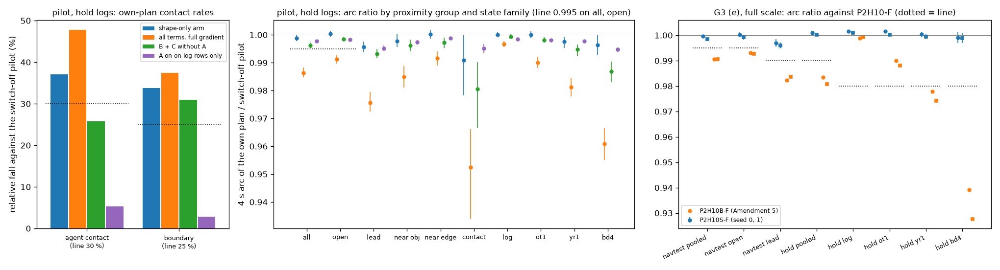

# BODY1 arm 4.3, Amendment 6 (shape-only hinge gradient): pilot gate met, G3 missed on item (b) by one token, no closed loop

2026-10-10. Registered in [plans/2026-10-10-body1-prereg.md](../plans/2026-10-10-body1-prereg.md), Amendment 6 (in force, with notes (a) to (g) written
before any code ran). **This is the third trained variant of the loss arm 4.3** (after the Amendment 4 pilot and the Amendment 5 pilot, full run and
closed loop), written after the closed-loop read of Amendment 5 and after a post hoc diagnosis on the same development scenes (decision 230). Hold
logs had been read at pilot scale by two arms of this lane before; this is the third. No further variant of the loss arm follows it.

The one change against `P2H10B` (Amendment 5): the new hinges (the agent hinge on imitation and hinge-only rows, the road hinge of the hinge-only
rows) see only the plan's shape. Their poses pass through `p~ = sg(p) + n n^T (p - sg(p))`, n the normal of the pose's own detached heading: values
unchanged, the pose gradient loses its along-heading component, no new hyper-parameter. Tags `P2H10S-P-s0` (pilot), `P2H10S-F-s{0,1}` (full).

## Verdict

1. **Pilot gate (item 5): met.** Against the switch-off pilot on hold logs: own-plan agent contact -37.1 %, boundary -33.8 %, both intervals excluding 0;
   4 s arc ratio 0.9989 pooled and 1.0004 on open states (line 0.995 each); dev ADE and slope inside their limits.
2. **G3 at full scale, both seeds: (a), (c), (d), (e) met; (b) missed on seed 0 by one navtest token.** The navtest own-plan agent-contact rate of
   `P2H10S-F-s0` is 149 of 12 146 tokens against 148 for `P2H10-F-s0` (+0.00008 [-0.00111, +0.00136]); (b) asks that neither rate rises. Seed 1 meets
   (b) (138 against 144). By note (d) of the amendment (written before any number: any of (a) to (e) missed on either seed ends the arm before a
   closed loop) and by the lane's instruction for this step, **the arm stops here: no closed loop, no PAI read, the driver stays `P2H10-F`**.
3. **The mechanism of decision 230 is confirmed open loop.** With the along-heading gradient removed, the speed profile returns to the base's: 4 s arc
   ratio on navtest 0.9996 / 0.9984 (Amendment 5: 0.9905 / 0.9905), behind a lead 0.9969 / 0.9959 (0.9822 / 0.9836), on `bd4` hold states 0.9991 /
   0.9989 (0.9391 / 0.9277); the seed floor of the base is 0.9973 (lead) to 1.0003 (pooled).
4. **About four fifths of the offline clearance survives without timing; the part that does not is the agent rate on logged states.** Hold logs:
   agent -39.7 % / -37.7 % (Amendment 5: -48.6 % / -48.3 %), boundary -49.5 % / -49.1 % (-53.5 % / -53.2 %). navtest: boundary -16.6 % / -19.1 % (as
   Amendment 5's -14.8 % / -18.4 %), agent -0.7 % / +4.2 % relative fall, i.e. unchanged (Amendment 5: 6.1 % / 8.3 %, not significant either).
   navtest EPDMS 89.05 against 88.67 (+0.38 [+0.20, +0.57]; Amendment 5 +0.52).
5. **Ablations at pilot scale (gate nothing):** both terms shorten the plan. "B + C without A" keeps a third of the shortening (arc 0.9963, `bd4`
   0.9868) and most of the clearance (agent -25.8 %, boundary -30.9 %); "A on on-log rows only" shortens by 0.2 % (0.9977) and moves no rate
   (-5.3 % / -2.9 %). The full-gradient arm's 1.4 % (0.9863) is more than the two add up to (0.37 % + 0.23 %): A on hinge-only rows carries the rest.

What to look at: left, the blue bars (this arm) stay above both dotted lines while giving up a fifth of the orange (full gradient) agent fall;
middle, blue sits on 1.00 in every group and family where orange is 1 to 5 % below, green (no agent hinge) and purple (agent hinge on logged rows
only) are each a fraction of orange; right, at full scale every blue point is above its dotted line and the orange points of Amendment 5 are below
four of them.

## 1. Code checks before the pilot (note (a); `results/shape/shape_check.json`, `ident_a6.json`)

| Check | Result |
|:--|:--|
| (i) values: total and every logged scalar with the switch on against off, 40 batches (5 120 rows) of the pilot's trainer at the `P2H10B-Pw3-s0` weights | 1 320 scalars, none differs in any bit; pose values identical (max difference 0) |
| (ii) pose gradient of the new hinges, along the pose's heading | 3.0e-9 with the switch on against 0.122 with it off (largest entry; 54 agent-positive, 117 road-positive rows) |
| (ii) the cross-heading component, switch on minus off | 1.3e-8 against 0.122: kept |
| the switch changes the gradient reaching the network output | max difference 0.019 of 0.137 |
| (iii) switch off, 60 steps against the unedited `pp_train.py` | 18 scalars and every weight bit for bit |

## 2. Pilot gate (shards s2 + s3, 3 000 steps, seed 0; hold-log states of the two shards: 5 062 states, 118 logs; one read)

Reference: the switch-off pilot `P2H10-P-s0`. `P2H10B-Pw3-s0` is the Amendment 5 pilot (all terms, along-path gradient included), read alongside as the
positive control. Intervals: paired, cluster bootstrap by log. Full table: `results/shape/pilot_gate.md`, `pilot_gate.json`; rates per subset
`results/loss/g3_a6_hold_{S,noA,Aon}.csv`; arcs `results/shape/ol_a6_pilot_{hold,navtest}_arc.csv`.

| Gate item | `P2H10S-P-s0` (this arm) | line | | `P2H10B-Pw3-s0` (control) | "B + C without A" | "A on on-log rows only" | switch-off pilot |
|:--|:--|:--|:-:|:--|:--|:--|--:|
| own-plan agent-contact rate | 0.0164, -37.1 % [-0.0135, -0.0064] | fall >= 30 %, interval excluding 0 | **met** | 0.0136, -47.7 % | 0.0194, -25.8 % | 0.0247, -5.3 % | 0.0261 |
| own-plan boundary rate (NAVSIM raster, margin < -0.20 m) | 0.0182, -33.8 % [-0.0136, -0.0052] | fall >= 25 %, interval excluding 0 | **met** | 0.0172, -37.4 % | 0.0190, -30.9 % | 0.0267, -2.9 % (interval includes 0) | 0.0275 |
| dev ADE at step 3 000 | 0.5882 m | <= 0.6013 m | **met** | 0.5899 | 0.5870 | 0.5926 | 0.5913 |
| continuation slope `alpha_05` (170 rows) | 0.914 [0.795, 1.036] | <= 1.129 | **met** | 0.934 | 0.975 | 1.073 | 1.079 [0.954, 1.216] |
| 4 s arc ratio, pooled | 0.9989 [0.9978, 1.0000] | >= 0.995 | **met** | 0.9863 [0.9847, 0.9882] | 0.9963 [0.9953, 0.9972] | 0.9977 [0.9973, 0.9981] | 1 |
| 4 s arc ratio, open states (2 263) | 1.0004 [0.9994, 1.0014] | >= 0.995 | **met** | 0.9913 [0.9897, 0.9929] | 0.9985 [0.9977, 0.9992] | 0.9983 [0.9979, 0.9987] | 1 |

The positive control fails both arc lines, as the amendment expected: the line would have caught decision 229 at pilot scale. Reported with the gate
(no line): boundary rate on item C's road-and-lane raster 0.0180 against 0.0279 (-35.5 %); `dev_drift_off` 0.048 (0.042).

Arc ratio by group and family (hold states of the two shards; the same four checkpoints):

| States (n) | this arm | control (full gradient) | B + C without A | A on on-log rows only |
|:--|:--|:--|:--|:--|
| lead (1 047) | 0.9956 [0.9939, 0.9975] | 0.9756 | 0.9932 | 0.9952 |
| near obj (645) | 0.9978 | 0.9849 | 0.9961 | 0.9973 |
| near edge (849) | 1.0003 | 0.9917 | 0.9972 | 0.9989 |
| contact (258) | 0.9908 [0.9783, 1.0000] | 0.9524 | 0.9805 | 0.9952 |
| on-log (1 829) | 1.0000 | 0.9967 | 0.9994 | 0.9984 |
| `ot1` (1 248) | 1.0000 | 0.9900 | 0.9981 | 0.9980 |
| `yr1` (1 248) | 0.9975 [0.9953, 0.9994] | 0.9813 | 0.9948 | 0.9977 |
| `bd4` (737) | 0.9964 [0.9927, 0.9999] | 0.9608 | 0.9868 | 0.9947 |
| `bd4`, open (279) | 1.0002 | 0.9745 | 0.9945 | 0.9960 |
| `bd4`, lead | 0.9964 | 0.9448 | 0.9812 | 0.9888 |
| > 45 deg (686) | 1.0045 [1.0022, 1.0068] | 0.9954 | 0.9999 | 0.9987 |
| launch, v < 1 m/s (347) | 0.9864 [0.9829, 0.9901] | 0.9746 | 0.9856 | 0.9929 |
| navtest tokens, pooled (12 146; reported, never a line at pilot scale) | 0.9945 [0.9936, 0.9953] | 0.9875 | 0.9927 | 0.9953 |
| navtest, lead (3 454) | 0.9932 | 0.9853 | 0.9925 | 0.9906 |

Contact rates of this arm by subset (new / reference, relative fall): on-log 0.0033 / 0.0044 agent (25 %, interval includes 0), boundary 0.0060 / 0.0060
(0 %); `ot1` 27 % / 33 %; `yr1` 35 % / 41 %; `bd4` 43 % / 36 %; > 45 deg 42 % / 38 %; launch 3 against 3 agent positives, 2 against 3 boundary.
As in Amendment 5 the fall sits in the off-track families; logged states do not move at pilot scale.

**The ablation read (item 11, note (b): drop-ones of the `P2H10B` recipe, along-path gradient included; open loop only).**
- The agent hinge is not the only term that shortens the plan. Without it (B + C alone) the pooled arc is still 0.9963, `bd4` 0.9868, contact
  states 0.9805: the road hinge of the hinge-only rows, 97 to 99.5 % cross-path at first order (decision 230), shortens the plan at finite step on
  the states where the plan leaves the road. Decision 230's "A is the backward pull" holds for the larger part, not for all of it. The shape-only
  switch covers this as well, since it is applied to the road hinge of the hinge-only rows too.
- The agent hinge on logged rows alone shortens by 0.2 % everywhere (0.9977 pooled, 0.9952 behind a lead on hold states, 0.9906 on navtest lead
  states; the diagnosis expected "lead -0.4 %, nothing else") and buys no clearance (agent -5.3 %, boundary -2.9 %).
- B + C without A lowers the agent rate by a quarter (-25.8 %) with no agent term: moving off-track plans back onto the road removes object
  contacts too. A on the hinge-only rows adds the rest (-47.7 % with timing, -37.1 % with shape only).
- Per-term training scalars at step 3 000 (`results/loss/pilot_terms_*.csv`): share of `bd4` rows with a non-zero agent hinge 0.072 (this arm)
  against 0.054 (control); hinge-only rows with an agent hinge 0.042 against 0.032, with a road hinge 0.222 against 0.221; imitation rows with an
  agent hinge 0.0147 against 0.0110; imitation loss 0.726 against 0.729. Without the along-path component the agent hinge resolves fewer of its
  positives in training (those that only slowing resolves stay); the road hinge is unaffected.

## 3. G3 at full scale (`P2H10S-F-s{0,1}`, 10 000 steps, all 12 shards, w = 3, `--ho-excl`; against `P2H10-F` of the same seed)

| Item | Seed 0 | Seed 1 | Line | Verdict | `P2H10B-F` (Amendment 5), seed 0 / 1 |
|:--|:--|:--|:--|:-:|:--|
| (a) hold logs (30 083 states, 121 logs), own-plan agent rate | 0.01645 against 0.02729, -39.7 % [-0.01278, -0.00889] | 0.01662 against 0.02666, -37.7 % [-0.01206, -0.00807] | fall >= 30 %, interval excluding 0 | met | -48.6 % / -48.3 % |
| (a) hold logs, boundary rate | 0.01705 against 0.03377, -49.5 % [-0.01902, -0.01458] | 0.01722 against 0.03384, -49.1 % [-0.01919, -0.01431] | the same | met | -53.5 % / -53.2 % |
| (b) navtest on-log (12 146 tokens), agent rate | **0.01227 against 0.01219 (149 against 148 tokens), +0.00008 [-0.00111, +0.00136]** | 0.01136 against 0.01186, -0.00049 [-0.00212, +0.00095] | does not rise | **seed 0 NOT met**, seed 1 met | -0.00074 / -0.00099 |
| (b) navtest, boundary rate | 0.03022 against 0.03623, -16.6 % [-0.00979, -0.00272] | 0.02972 against 0.03672, -19.1 % [-0.01122, -0.00345] | does not rise | met | -14.8 % / -18.4 % |
| (b) navtest, sum | -0.00593 [-0.00958, -0.00269], -12.2 % | -0.00749 [-0.01227, -0.00353], -15.4 % | falls | met | -12.6 % / -15.9 % |
| (c) continuation slope `alpha_05` (1 137 rows) | 0.822 [0.762, 0.881] against 1.028 | 0.830 [0.771, 0.889] against 1.037 | <= base + 0.05 | met | 0.833 / 0.827 |
| (d) navtest EPDMS (`jevdrive.bench`) | 89.01 against 88.58 | 89.09 against 88.77 | >= base - 0.3 | met | 89.19 / 89.20 |
| (d) `dev_drift_off` | 0.045 | 0.044 | <= 0.30 | met | 0.045 / 0.045 |
| (e) arc, navtest pooled | 0.9996 [0.9989, 1.0003] | 0.9984 [0.9977, 0.9990] | >= 0.995, lower bound >= 0.990 | met | 0.9905 / 0.9905 |
| (e) arc, navtest open | 1.0002 | 0.9992 | >= 0.995 | met | 0.9931 / 0.9927 |
| (e) arc, navtest lead | 0.9969 [0.9955, 0.9984] | 0.9959 [0.9949, 0.9971] | >= 0.990 | met | 0.9822 / 0.9836 |
| (e) arc, hold pooled | 1.0009 | 1.0001 | >= 0.990 | met | 0.9835 / 0.9807 |
| (e) arc, hold `log` / `ot1` / `yr1` / `bd4` | 1.0016 / 1.0015 / 1.0004 / 0.9991 | 1.0010 / 1.0003 / 0.9995 / 0.9989 | each >= 0.980 | met | 0.9990 / 0.9900 / 0.9779 / 0.9391 (seed 0) |

**(b) on seed 0 is the miss.** One more navtest token has an own-plan agent contact (149 against 148); the paired interval is centred on zero and the
second seed has six fewer (138 against 144). Under the reading this lane has used since Amendment 4 (point estimates, `bd4_g3.py` verdict
`no_rise_sum_falls`) that is a rise, so (b) is not met on seed 0. What the number says beyond the verdict: on logged navtest states this arm does
not lower the agent-contact rate at all (two-seed mean 0.01182 against 0.01202), whereas the boundary rate falls by 17 to 19 % with intervals
excluding 0. Amendment 5's 6 to 8 % agent fall on navtest was itself inside its interval.

By state family, hold logs (relative fall agent / boundary, seed 0 | seed 1): on-log 18 % / 28 % | 2 % / 19 % (agent intervals touch or include 0);
`ot1` 29 % / 40 % | 29 % / 45 %; `yr1` 39 % / 53 % | 38 % / 51 %; `bd4` 48 % / 54 % | 47 % / 54 %. > 45 deg hold states (3 954): agent 36 % / 33 %,
boundary 42 % / 41 %. > 45 deg navtest tokens (1 517): boundary -25.8 % / -29.6 % (intervals excluding 0), agent -2 % / -18 % (not significant).
Launch (v < 1 m/s) navtest tokens: agent 17 against 18 and 18 against 15 positives.

(d), navtest through `jevdrive.bench`, the three arms in one report (`results/shape/g3_a6_full_bench/`), and the turn-oracle replay
(`results/shape/g3_a6_full_d.csv`; two-seed mean, new - base, cluster bootstrap by log):

| Arm | EPDMS | per seed | NC | DAC | EP | TTC |
|:--|--:|:--|--:|--:|--:|--:|
| P2H10-F | 88.67 | 88.58 / 88.77 | 98.58 | 96.17 | 87.16 | 97.96 |
| P2H10B-F (Amendment 5) | 89.19 | 89.19 / 89.20 | 98.79 | 96.53 | 87.04 | 98.21 |
| **P2H10S-F (this arm)** | **89.05** | 89.01 / 89.09 | 98.64 | 96.52 | 87.20 | 97.97 |

| Stratum | Metric | P2H10S-F | P2H10-F | Difference [95 % CI] | Amendment 5's difference |
|:--|:--|--:|--:|:--|:--|
| all (12 146) | EPDMS | 89.05 | 88.67 | +0.38 [+0.20, +0.57] | +0.52 |
| all | DAC failure % | 3.48 | 3.83 | -0.35 [-0.53, -0.19] | -0.36 |
| all | inside-cut % | 1.54 | 1.73 | -0.19 [-0.33, -0.06] | -0.18 |
| all | cannot-make-turn % | 0.85 | 0.86 | -0.01 [-0.12, +0.10] | -0.02 |
| all | EP | 87.20 | 87.16 | +0.04 [+0.01, +0.07] | -0.12 |
| > 45 deg (1 517) | EPDMS | 79.42 | 78.61 | +0.81 [+0.10, +1.53] | +0.93 |
| > 45 deg | DAC failure % | 9.33 | 10.19 | -0.86 [-1.66, -0.07] | -0.86 |
| > 45 deg | inside-cut % | 4.05 | 4.78 | -0.73 [-1.39, -0.19] | -0.63 |
| > 45 deg | cannot-make-turn % | 2.77 | 2.60 | +0.17 [-0.41, +0.78] | +0.10 |

The road half of the lesson is intact (DAC and inside cuts as in Amendment 5), EP is back at the base's (87.20 against 87.04 for Amendment 5), and the
part of Amendment 5's navtest gain that came through NC and TTC (98.79 / 98.21) is gone (98.64 / 97.97 against the base's 98.58 / 97.96): on navtest the
agent half of Amendment 5 worked through timing. The > 45 deg bucket: "does not make the turn" unchanged again (2.77 against 2.60 %, decision 170).
Replay check: all 422 / 424 (new) and 469 / 461 (base) DAC-failing tokens replayed, none disagreeing.

## 4. Reading

- The kill criterion of the amendment for this outcome was written for the pilot ("contact-rate lines missed with the arc line met = the offline
  clearance was bought with timing"). The pilot did not show that: both contact lines hold with the arc at 1.00. What the full-scale read shows is
  narrower: on hold logs (three quarters off-track states) four fifths of the agent fall and nine tenths of the boundary fall are shape; on logged
  navtest states the boundary fall is all shape and the agent rate does not move without timing.
- For the closed loop this matters because the loop's zeros are on states the student reaches from logged starts. Of Amendment 5's five removed
  collision scenes, decision 230 judged two lateral by their strips and two possibly timing. Whether a shape-only lesson keeps any of them was the
  question of the closed-loop read that the registered gate now does not allow.
- The arc lines do what they were added for: every one of them separates this arm from Amendment 5's checkpoints at pilot scale and at full scale.

## 5. Costs, deviations, limits

Costs: about 1.9 card-h of the 7 (check and two identity runs 3 min, three pilots of 7 min, nine pilot and G3 read jobs of 1 to 3 min, two full runs
of 23 min at 7.2 it/s, bench plans) plus one 48-core CPU job of 1 min and the bench's devkit shards; about 55 min wall; about 0.3 GB new on the box
(five checkpoints, plan dumps under `runs/body1/prog/`); disk 351 GB free. No rollout was run, nothing to prune.

Deviations:
1. `shape_gate.py` (CPU, seconds) and `pp_full_check.py train`, `bd4_pilot_read.py`, `bench report`, `bd4_g3d.py` were run directly on the box, as the
   earlier arms ran them; every GPU job and the replay went through the pool (owner `body1`, `--ram` declared). Card 2 was not needed.
2. "A on on-log rows only" has no hinge-only rows, so its batch is 128 normal rows where the other pilots have 115 + 13 (note (b)).
3. `bd4_g3.py` takes one new checkpoint per call: the ablations' contact rates come from one call each (note (c), corrected before any job).
4. The navtest arc ratios of the four pilots were read as well (reported, no line): navtest is not part of the hold logs.
5. The stop at (b) rests on note (d) and on the lane's instruction for this step ("any item missed: stop"). Amendment 4 item 8 and Amendment 6
   item 8 list (a), (c), (d), (e) as kill criteria and name (b) only as a gate item; note (d) took the stricter reading before any number existed.
6. No closed loop was run, so no review strips, no lead / open split in the loop, no Chinese page section (docs/html-reports.md asks for one at a
   closed-loop read).

Limits: third variant of the arm, designed after a closed-loop read and a diagnosis on the same development scenes; hold logs read at pilot scale by
three arms, and the hinge-only rows come from the state families the hold read uses (disjoint logs, not disjoint distributions); all rates are open
loop on the student's own plan; the miss is one token on one seed, inside the interval and inside the two-seed spread of the base (148 against 144
positives); the ablations are one seed at pilot scale and are drop-ones of the full-gradient recipe, not of this arm; proximity groups are
`prog_ol.py`'s definitions, taken from the reference's plan; whether the shape-only checkpoints keep Amendment 5's removed collisions or its
progress in the loop is not known.

Files: code `lib/loss43.py` (`shape_only`, `Losses43(shape=)`), `scripts/bd4_train.py` (`--shape`, `--shape-check`), `scripts/prog_ol.py` (`--new /
--ref / --name`), `scripts/shape_gate.py`, `scripts/shape_fig.py`, `scripts/prog_cl.py` (`--arm / --man / --ol`, unused); tables `results/shape/`,
`results/loss/g3_a6_*`, `results/loss/pilot_{gate,terms}_{P2H10S-P-s0,P2H10B-Pw3-noA-s0,P2H10B-P-Aon-s0}*`; checkpoints on the box under
`$DATA_DIR/runs/op_parity/runs/P2H10S-{P-s0,F-s0,F-s1}`, `P2H10B-Pw3-noA-s0`, `P2H10B-P-Aon-s0`; job logs `$DATA_DIR/runs/body1/shape/`.
