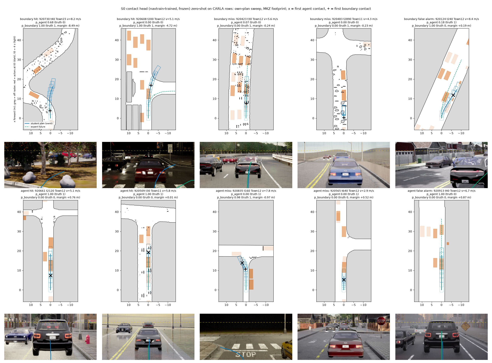
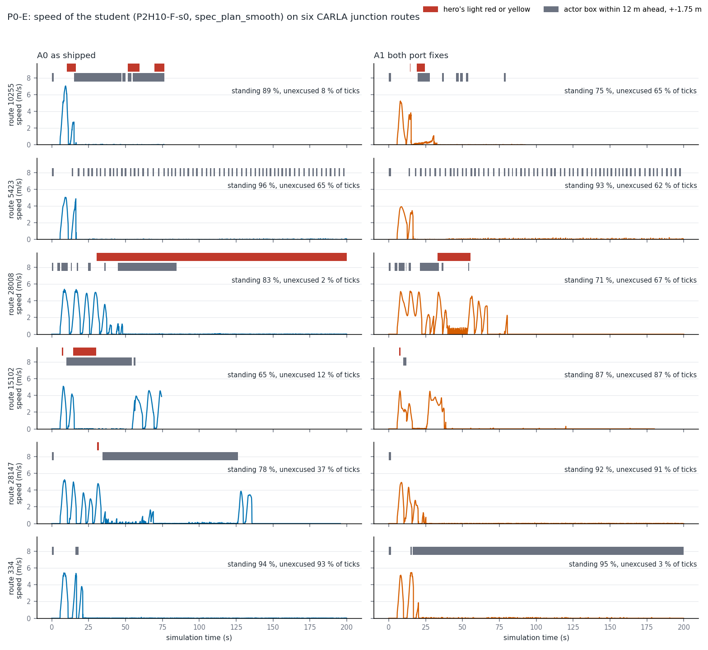

# BODY1 stage 2, P0: the zero-generation pre-check

2026-10-10. Pre-registration: [plans/2026-10-10-stage2-prereg.md](../plans/2026-10-10-stage2-prereg.md) (pushed as `2b8a2b55` before any number);
design: [plans/2026-10-10-stage2-carla-design.md](../plans/2026-10-10-stage2-carla-design.md). Nothing was generated and nothing trained. The
student (P2H10-F-s0 / -s1), the S0 contact head (two seeds, mean logit) and the blind head are frozen; cache `b2d_v2` was read as a test set.

## Verdict

**Stage 2 on CARLA is closed by P0; nothing is built.** By the registered table the outcome is "Stop": line D1 (d) is missed, and the
other lines read the same way (the agent head fails zero-shot, the launch line (b) is missed, the P0-E line is missed with both port fixes). The student's own-plan boundary rate on moving straight CARLA
rows is 2.38 % against 0.21 % on navtrain (11 x; line 3 x). The contact head itself passes on the road edge and fails on objects.
Post hoc, the reader's own floor on these rows (the expert's executed future through the same raster) is 1.05 %, already 5 x the navtrain
rate, so line (d) could not have been met on this cache whatever the student did; that is said here and the line is not moved.

| Line | Read (CARLA) | Navtrain, same reader | Registered line | Result |
|---|---|---|---|---|
| D2 boundary AUC, own plans, speed >= 0.5 m/s | 0.844 [0.829, 0.860] (Pacifica truth, the lower one; MKZ 0.864 [0.852, 0.875]); by town [0.800, 0.863]; S0 - blind +0.151 [+0.131, .] | hold 0.978, AlpaSim 0.89 | >= 0.80, lower >= 0.75, >= blind + 0.05 | **pass** |
| D2 agent AUC | 0.589 [0.574, 0.604] (MKZ 0.590); blind 0.569; S0 - blind +0.019 | hold 0.905, AlpaSim 0.882 | >= 0.75; < 0.65 fails | **fail: class 1 dropped** |
| D2 > 45 deg bucket | boundary 0.845 [0.827, 0.861] / MKZ 0.835; agent 0.494 / 0.489 | 0.941 / 0.819 | boundary < 0.70 is flagged | not flagged |
| D1 (a) arc ratio, moving | median 0.867 [0.861, 0.873]; collapse share 7.4 % | 1.000; 0.0 % | >= 0.80, >= 0.85 x nav, collapse <= nav + 10 pts | holds |
| D1 (b) launch share (standing, expert about to go) | 0.241 [0.225, 0.257] (n 10 794) | 0.995 | >= 0.6 x nav | **missed** |
| D1 (b) 1 s displacement / speed, moving | 0.868 | 0.960 | >= 0.85, within 0.10 | holds |
| D1 (c) turn direction | 0.838 [0.823, 0.851]; > 45 deg 0.818 [0.800, 0.834] | 0.998; 0.998 | >= 0.80; >= 0.75 | holds |
| D1 (d) own-plan boundary rate, moving straight rows | 2.38 % [2.10, 2.68] (MKZ) | 0.21 % [0.06, 0.42] | <= 3 x nav (0.63 %) | **missed** |
| P0-E unexcused standing / all ticks, six routes | A0 as shipped 0.431 (3 of 6 routes under 0.30); **A1 both port fixes 0.620 (1 of 6 under 0.30)**; standing share 0.863 / 0.866 | - | < 0.20 pooled and < 0.30 on >= 5 routes | **missed**: the fixed ports do not make the student move |

What the table does not show and matters as much (reported, no line):

- **The student turns the right way and far too little on CARLA frames.** On turn rows the median of own / logged 4 s heading change is
  0.54 [0.47, 0.61], in the > 45 deg bucket 0.28 [0.22, 0.36]; on navtrain 0.99 and 0.97. Sign agreement (line c) hides this. It is
  decision 127's "head curvature about 0.3 of the required" seen open loop on 3 366 rows.
- **The student's plan runs into the lead.** Own-plan agent contact on moving straight rows 14.8 % against 0.27 % on navtrain (15.4 %
  where the expert's own future is clean); the struck object is a vehicle in 94 % of cases, median first contact 2.6 s. The truth is
  right in the pictures below (boxes sit on the cars). On these rows the head's agent logit is close to "is a vehicle ahead" and does
  not separate the leads the plan reaches from those it does not (figure, bottom right).
- **The student does not launch on CARLA frames open loop either**: 24 % of standing rows where the expert is about to drive off have an
  own plan of at least half the expert's arc, against 99.5 % on navtrain. The standing of the closed-loop probe is in the plan, with the
  recorded acceleration fed.

## 1. Material and what was recomputed

Cache `$DATA_DIR/runs/op_parity/cache/b2d_v2` (version `b2d1`), rows with `tick % 10 == 0`: 76 394 rows of 998 clips, 12 towns (moving
33 547, standing 36 662, turn 5 002, > 45 deg 3 366). Tokens, ego vector (recorded velocity and acceleration, command at 30 m), logged
future from the cache; the drivable SDF from each clip's `sdf.npz` (the source of the cache's `hinge_labels.npz`). **Agent boxes are not in
the cache** and were rebuilt from the collector's `actors.npz` / `kinds.json` at matching 20 Hz ticks (K = 32 nearest, the layout of the
navtrain labels). Navtrain reference: 10 926 on-log states of the 121 hold logs. Code: [scripts/s2p0_read.py](../scripts/s2p0_read.py)
(`forward`, `labels`, `report`), [scripts/s2p0_fig.py](../scripts/s2p0_fig.py). Tables: `results/s2p0/d1.json`, `d2.csv`, `d2.json`,
`cases.csv`. Box: `$DATA_DIR/runs/body1/s2p0/` (pred.npz, labels.npz).

## 2. P0-D2: the contact head on CARLA rows

Own plans (own0 + own1), speed >= 0.5 m/s, cluster bootstrap by route (2 000 resamples); positives 8 482 boundary in 697 routes, 13 350
agent in 682 routes, so the own + ramp fallback was not needed.

| Subset | Boundary AUC (Pacifica / MKZ truth) | Agent AUC (Pacifica / MKZ) |
|---|---|---|
| primary (speed >= 0.5) | 0.844 [0.829, 0.860] / 0.864 [0.852, 0.875] | 0.589 [0.574, 0.604] / 0.590 [0.576, 0.605] |
| per seed (s0 / s1), Pacifica | 0.841 / 0.813 | 0.586 / 0.575 |
| blind head, Pacifica | 0.694 [0.678, 0.710] | 0.569 [0.553, 0.586] |
| all rows | 0.834 / 0.856 | 0.561 / 0.583 |
| moving (> 3 m/s) | 0.843 / 0.865 | 0.580 / 0.583 |
| standing (< 0.5) | 0.791 / 0.791 | 0.573 / 0.588 |
| turn (> 20 deg) | 0.811 [0.792, 0.829] / 0.805 | 0.521 / 0.519 |
| > 45 deg | 0.845 [0.827, 0.861] / 0.835 [0.818, 0.850] | 0.494 / 0.489 |
| straight (< 5 deg) | 0.725 [0.690, 0.760] / 0.732 | 0.585 / 0.587 |
| obstacle scenarios | 0.851 / 0.871 | 0.598 / 0.604 |
| night / day (Pacifica) | 0.827 / 0.853 | 0.591 / 0.588 |
| wet / fog (Pacifica) | 0.837 / 0.839 | 0.596 / 0.563 |
| lateral ramps of own0 (secondary) | 0.910 / 0.891 | 0.676 / 0.647 |
| post hoc: rows where the expert's future is clean | 0.888 [0.875, 0.902] / 0.908 [0.897, 0.919] | 0.588 / 0.590 |

By town (Pacifica, boundary): 0.743 (Town11, n 3 799) to 0.900 (Town07); Town12 0.856, Town13 0.826; agent 0.51 to 0.72. Town-clustered
interval of the primary read: boundary [0.800, 0.863], agent [0.560, 0.628].

- The boundary half reads CARLA road edges: 0.84 to 0.86 against 0.978 on real hold logs and 0.89 on AlpaSim's rendered frames, and the
  frames carry it (blind 0.69). Weakest where the label is weakest: straight rows 0.73, where the positives are mostly raster speckle
  (below); 0.89 to 0.91 once rows with a noisy expert label are left out.
- The agent half does not read CARLA objects for this purpose: 0.59, 0.02 above the blind head, at chance on turns. Decision 62 found
  the same for pedestrians; this is vehicles.

Ten rows picked by rule (highest-score positives, lowest-score positives, highest-score negatives; own0, MKZ truth, one per route). Top:
BEV, grey = off the drivable raster, red = actor boxes at t0 (dark) and t0 + 4 s (light), blue = the student's swept plan, green dashed =
the expert's future, `x` / `+` = first agent / boundary contact; below each the model's road frame with both paths. **What to look at:**
(1) the two boundary hits are real exits (a plan that goes straight on at a curve; a plan that does not follow the right turn) and the head
is certain; (2) the two boundary misses are not exits: the plan stays in its lane and the "contact" is a speckle of the raster inside
the road (margin -0.24 / -0.23 m); (3) in the bottom row the plan drives up to a lead vehicle in four of five panels, and the head gives
p = 1.00 twice where the object is reached (hits), 0.00 twice where it is reached (misses) and 1.00 where the lead pulls away (false alarm).

## 3. P0-D1: the student's own plan on CARLA frames

Table in the verdict; full values with intervals in `d1.json`. By town the arc ratio is 0.81 to 1.09 and the turn direction 0.57 (Town02,
47 rows) to 0.93; night and day do not differ (0.861 / 0.870). Pacifica-footprint rates on CARLA: boundary 3.37 % (straight), agent 15.7 %.

Post hoc reads for line (d) (not registered; same reader, MKZ):

| Read on moving straight rows | Rate |
|---|---|
| the expert's executed future, boundary (margin < -0.20 m) | 1.05 % [0.83, 1.28] |
| the expert's executed future, agent | 0.83 % [0.54, 1.16] |
| own plan, boundary, rows where the expert's future is clean | 1.21 % [1.02, 1.42] |
| own plan, agent, rows where the expert's future is clean | 15.4 % [14.3, 16.4] |

The b2dc raster (Driving + Parking + Bidirectional lanes, no junction fill) has holes inside the road; the expert, who never left it,
"leaves" it on 1 % of straight rows. The student's rate on clean rows equals that floor. So (d) as registered measures the raster, and
the lateral likeness of the plan on straights is neither shown nor refuted by it; the heading-ratio read above is the informative one.

## 4. P0-E: the standing student and the two input ports

Run by a sub-agent of this lane agent. Files: [scripts/s2p0_port_check.py](../scripts/s2p0_port_check.py),
[scripts/s2p0_probe_read.py](../scripts/s2p0_probe_read.py), tables `results/s2p0/port_check.{json,csv}`, `probe.{json,csv}`. A probe of
the loop: no score is reported.

**Switches.** `lib/op_arb_agent.py` (the only file touched outside `experiments/body1/`): agent-config key `"port": {"ego", "cmd",
"log"}`, all default off. With all three off the ego vector is bit-identical to commit `2b8a2b55` on 24 clips, 19 240 ticks
(`np.array_equal`).

**Correctness on recorded values** (24 b2dc clips, 12 towns, 15 with turn-command rows, 6 582 rows): the 17 non-command dims are within
5.2e-6 of the cache (line 1e-3); the command equals `b2d_v2L20` on 100 % of ticks. Convention: slope of ay on vx x yaw rate 1.028 on
navtrain, 0.833 on the replayed stream (line [0.8, 1.2]). Two differences from navtrain that the check exposed and that pass its lines:
the simulator's acceleration is far wider than navtrain's (ax p5 / p50 / p95 -5.41 / 0.11 / 7.48 against -1.32 / -0.15 / 1.00 m/s2),
and vy against yaw rate has slope 0.76 m against -0.115 (read as: velocity at the body centre in CARLA, at the rear axle on navtrain;
not verified separately). The port as shipped is this far from the label on the same rows: command agreement 0.925 (0.831 on turn
rows), ax error p95 8.8 m/s2; while the car stands it feeds ax p50 -0.39 m/s2 (a "decelerating" car).

**A0, as shipped** (pool job `1010-084130-fcb7`, 0.30 card-h):

| Route | Ticks | Standing | Metres | Own-plan speed at 1 s, standing (median / p90) | Excused: light / actor / either | Unexcused standing / all ticks |
|---|--:|--:|--:|--:|--:|--:|
| 10255 | 1 530 | 0.89 | 30.4 | -0.04 / 0.10 | 0.25 / 0.88 / 0.90 | 0.085 |
| 5423 | 4 000 | 0.96 | 30.3 | -0.02 / 0.15 | 0.00 / 0.32 / 0.32 | 0.647 |
| 28008 | 4 000 | 0.83 | 92.5 | -0.02 / 0.06 | 0.95 / 0.25 / 0.97 | 0.025 |
| 15102 | 1 490 | 0.65 | 80.9 | -0.02 / 0.29 | 0.31 / 0.82 / 0.82 | 0.116 |
| 28147 | 3 915 | 0.78 | 88.5 | -0.02 / 0.06 | 0.00 / 0.53 / 0.53 | 0.369 |
| 334 | 4 000 | 0.94 | 39.2 | 0.02 / 0.06 | 0.00 / 0.01 / 0.01 | 0.931 |
| pooled | 18 935 | 0.86 | 361.8 | -0.01 / 0.09 | 0.23 / 0.35 / 0.50 | **0.431** |

Identical-rerun spread against the design's probe: standing share per route 0.89 / 0.96 / 0.83 / 0.65 / 0.78 / 0.94 against 0.85 / 0.96
/ 0.83 / 0.66 / 0.76 / 0.94, pooled 0.86 both; 362 against 340 m; 134 against 135 ms per tick. The excuse rule is sensitive per route
(28008: 0.025 with the hero's own light, 0.625 with a route-light rule; 334 the reverse) and not pooled: 0.431 / 0.537 / 0.474 under the
three readings, all far above the line.

**A1, both fixes** (`port.ego` + `port.cmd`, pool job `1010-084130-ff46`):

| Route | Ticks | Standing | Metres | Own-plan speed at 1 s, standing (median / p90) | Excused: light / actor / either | Unexcused standing / all ticks |
|---|--:|--:|--:|--:|--:|--:|
| 10255 | 1 852 | 0.75 | 30.3 | 0.09 / 0.29 | 0.00 / 0.13 / 0.13 | 0.649 |
| 5423 | 4 000 | 0.93 | 32.4 | 0.28 / 0.87 | 0.00 / 0.33 / 0.33 | 0.622 |
| 28008 | 4 000 | 0.71 | 129.4 | 0.01 / 0.07 | 0.01 / 0.04 / 0.05 | 0.673 |
| 15102 | 3 601 | 0.87 | 61.1 | 0.00 / 0.04 | 0.00 / 0.00 / 0.00 | 0.873 |
| 28147 | 4 000 | 0.92 | 37.2 | 0.08 / 0.29 | 0.00 / 0.01 / 0.01 | 0.914 |
| 334 | 4 000 | 0.95 | 34.8 | -0.05 / 0.05 | 0.00 / 0.96 / 0.96 | 0.034 |
| pooled | 21 453 | 0.87 | 325.1 | 0.02 / 0.41 | 0.00 / 0.28 / 0.28 | **0.620** |

**Line missed** (0.620 pooled against < 0.20; one route of six under 0.30). With the acceleration, the lateral velocity and the command
fed as the labels compute them, the car stands on the same share of ticks (0.866 against 0.863) and drives no further (325 against
362 m); the unexcused share rises because the cars stop at other places, away from lights and leads. Under the two alternative excuse
readings A1 is 0.564 / 0.723. The standing is therefore not an artefact of these two ports; with D1 (b) it sits in the student's own plan
on CARLA frames (decision 128's addendum, now with the trained ports correct). A2 / A3 were not released (their condition, A1 passing
or lowering the share by 10 points, is not met). The default-off `port` switch stays in `lib/op_arb_agent.py` as it is.

Speed against time per route, A0 and A1, with red-light and actor-ahead spans shaded. **What to look at:** the long flat stretches at
zero: in A1 most of them lie outside the shaded spans (the student stands with nothing in front of it), and no route shows A1 moving
where A0 stood.

## 5. What it means for stage 2

- **Stage 2 on CARLA is closed by P0; nothing is built** (the user's decision, forwarded by the main session after these reads: CARLA is
  not pursued further if it does not work). Registered outcome per line: D1 (d) missed = stop; D2 agent fail = class 1 dropped; D1 (b)
  and P0-E missed = no mode F; D2 boundary pass and D1 (a), (c) hold. The one line that triggers the stop by the letter is label-limited
  on this cache (section 3), and the stop does not rest on it alone: items 1 to 3 below. No generator code, no S0, no S1.
- Independent of (d), what P0 does establish:
  1. Class 1 (obstacle ahead) is out: the head's agent half does not transfer (0.59, fail), and the student's CARLA plans run into leads
     at 55 x the navtrain rate, a CARLA-specific longitudinal behaviour that rows of "our student in the loop" would be made of.
  2. Class 2 / 3 labels are readable (boundary pass, also over 45 deg), so a CARLA boundary / corridor hinge has a working zero-shot
     reader. But the student's turn on CARLA frames is 0.28 to 0.54 of the expert's: its steering in CARLA is not its steering on the
     board (navtrain 0.97 to 0.99), which is the substance of the registered stop reason for (c) / (d) even though (c)'s sign line holds.
  3. Mode F (student speed) is out on the open-loop read alone: launch share 0.24 against 0.995 (D1 (b) missed). If stage 2 were built,
     it would be the design's fallback (expert-carried, modes L and I), i.e. injected lateral states at the expert's speed with an expert
     path target, not "the states the student itself reaches".
- For the record, had class 2 been continued, the registered path was the fallback row of the table (code + S0 + S1, modes L
  and I), and the raster would have needed the junction fill and a de-speckle first: with the b2dc raster the boundary truth has a 1 % floor.

**Cost line (not spent).** The probe confirms the design's M1 (134 ms per tick, 6 workers on one card, 0.30 card-h per six-route arm against 0.26).
The design's table stands: code + S0 + S1 about 1.2 card-h and 2 agent-days; class 2 only about 14 card-h; full 30 (23 to 40) card-h, 52
to 73 GB. With class 1 dropped (300 of 1 200 sites) the full set would be about 22 card-h (17 to 30) and 39 to 55 GB (scaled by sites, an estimate).

## 6. Costs

D1 / D2: forward 1.5 min on one card (76 394 rows, 2 student seeds, 3 heads), labels 3 min on 40 cores, report 8.5 min CPU; three smokes
on 12 clips; about 0.05 card-h, 1.1 GB on the box. P0-E: A0 0.30 and A1 about 0.33 card-h (21 453 ticks at 137 ms), no A2 / A3. Total about 0.7 of the 1.5 card-hours. Pool jobs, owner `body1`, `--ram` declared.

## 7. Deviations from the pre-registration

1. A 12-clip plumbing smoke (629 rows) was read before the full run; its first version exposed two errors in the rebuilt boxes, fixed
   before the full run and before any full number: (i) `static.prop.mesh` parked cars of Town12 / 13 log their extent with x / y swapped
   on half of the actors (checked: the actor yaw axis is parallel to the road on 221 of 221 near meshes), so the long side is put along
   the yaw; (ii) actors that the hero's own executed box overlaps at a logged tick are not truth for that clip (167 walkers, in the cases looked at a walker carried at
   the hero's own position; 54 vehicles incl. the struck actors of collision clips, 10 props), and `dirtdebris` props (105) are dropped as
   drivable. After that the expert's own future is an agent contact on 0.70 % of rows.
2. Kinds dropped for having no usable box: `constructioncone` 16 (no usable extent), `warningaccident` 1,
   `warningconstruction` 1. Other static props are `generic_object`.
3. The SDF is read from the clips' `sdf.npz`, not from the cache's copy `hinge_labels.npz` (same arrays, per-clip access).
4. Post hoc reads (expert-future floor, "expert future clean" subsets, struck class) were added after the registered reads were seen;
   they are marked and change no verdict.
5. The paired S0 - blind interval and the D1 intervals use a local implementation of the same cluster draws as `contact_head.auc_boot`;
   D1 medians use 500 resamples.
6. P0-E: the reader gained a column `plan_d1` (the plan's own 1 s displacement) after A0 was read, because the logged `vplan[1]` has a
   median near 0 where the design quoted 0.1 to 0.3 m/s; the registered definitions were not changed.

## 8. Limits

- Every CARLA state is on the expert's line; the reads say how the frozen stack reads CARLA frames, not what the student does at
  states it reaches itself.
- The command in the cache is cut at 30 m, which no navtrain statistic matches (design, section 2); the heading-ratio and direction
  reads carry that mismatch. The one allowed re-read at 20 m was not used because (c) held.
- Boundary truth is the b2dc raster with its holes; agent truth comes from boxes rebuilt here, checked by the expert-future rate and by
  ten pictures, not against an independent sweep.
- Agents are logged within the collector's radius only and react to the expert, not to the queried plan.
- P0-E: six routes, one seed, a geometric excuse rule that flips single routes; closed loop is not bit-reproducible.
