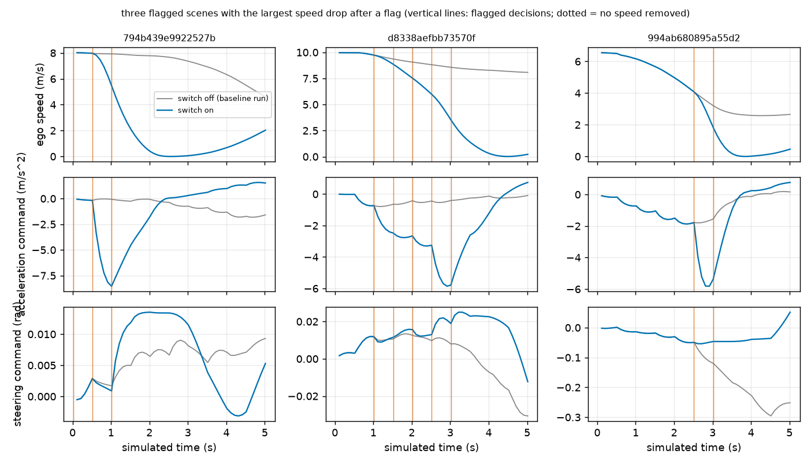
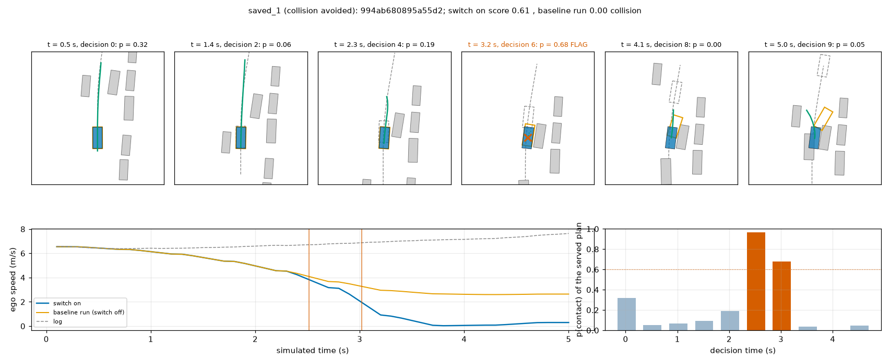
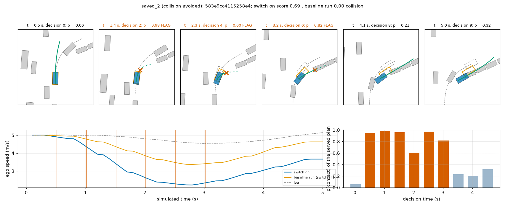
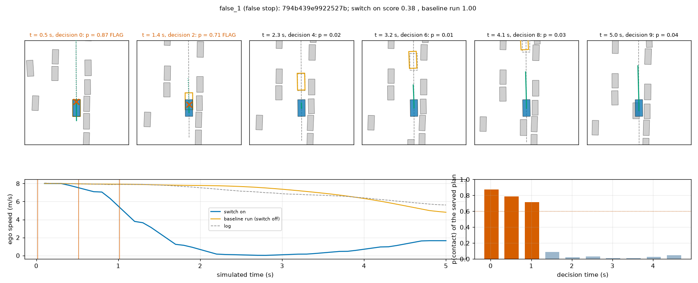
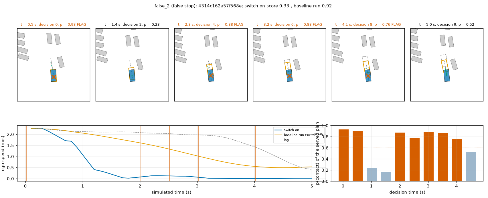
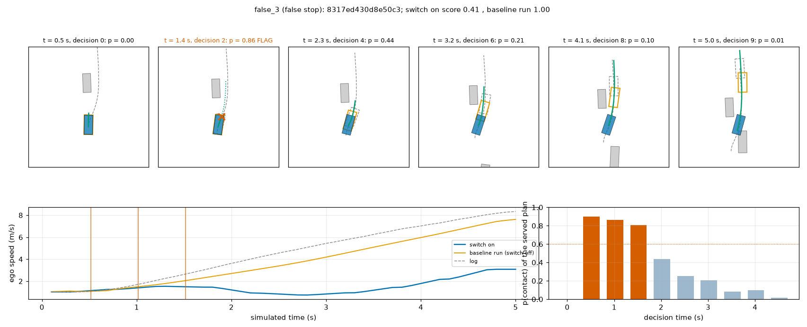
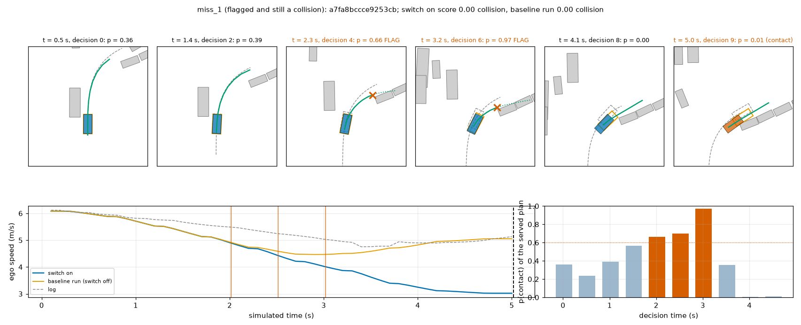
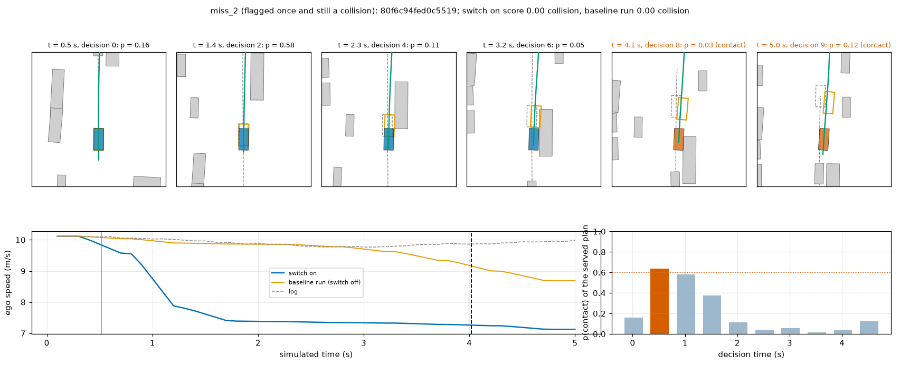

# BODY1 arm 4.1: the contact predictor as a stop in the AlpaSim nuPlan driver (stopped at the one-chunk check)

2026-10-10. Implements section 4.1 / 4.4 of [plans/2026-10-10-body1-prereg.md](../plans/2026-10-10-body1-prereg.md) with
Amendment 2 (pushed before the first closed-loop run with the switch). Predictor: arm S0, [s0_gate.md](s0_gate.md).

**Verdict. The arm stopped at stage (b): the one-chunk check failed two items of its written checklist, so the full read
(700 scenes x 2 seeds), the secondary m = 1 and the PAI read were not run. No line L1 / L2 / L3 has a registered read.**
What exists is one chunk of one seed (234 scenes, P2H10-F-s0, `JEV_STOP=2`), descriptive: at-fault collisions 4 -> 2, no new
zero, mean scene score -0.0067 [-0.0159, +0.0011] (by log), slow scenes 43 -> 50. On this chunk L1 would be met and L2 / L3
not. The loss is seven false stops (-2.84 scene scores) against two saved collisions (+1.30).

It is a regression check in any case: all public scenes took part in selecting P2H10 before. Serving-only: open-loop plans are
untouched, navtest is unchanged and was not scored. Nothing was registered or submitted.

Code: [lib/serve_body.py](../lib/serve_body.py) (rule; its docstring is the specification), hook in
`experiments/alpasim/lib/sh30_driver.py` (`JEV_STOP=<m>`), [scripts/bd1_stop.py](../scripts/bd1_stop.py) (`hold`, `replay`),
[scripts/stop_report.py](../scripts/stop_report.py) (`pilot`, `check`, `report`), [scripts/stop_bev.py](../scripts/stop_bev.py).
Tables: `results/stop/`. Box: `$DATA_DIR/runs/body1/cl/` (0.28 GB), `$DATA_DIR/runs/body1/stop/`.

## 1. The rule as registered (Amendment 2)

| Item | Value | Fixed from |
|---|---|---|
| Score | mean of the two seeds' agent-contact logits on the served plan, gate's input standard | s0_gate.md |
| Threshold | logit 0.408 (p = 0.60): 2 % of 50 265 clean own-plan hold decisions | hold logs |
| Contact arc length | min(regressed first-contact arc, start of the first 0.5 s interval with predicted clearance < 0.25 m) | hold logs |
| m | 2 m (primary); 1 m labelled secondary (not run) | hold logs |
| Speed profile | plan's speed under sqrt(2 a (D - s)), D = max(d, v0^2 / 12), a = clip(v0^2 / (2 D), 1, 6) m/s^2; path unchanged, speed only removed | the controller (tracks positions 1-2 s ahead, no speed; limit -9 m/s^2) |
| Standstill / release | no minimum speed; no latch, no filter: the plan is served unchanged at the first unflagged decision | mechanism |

Hold logs, 463 flagged true positives and 1 006 false flags of the own plan, open loop, one decision at a time, cap 6 m/s^2
(`stop/hold_rule.csv`, all 16 rows; `hold_bias.csv`, `hold_speed.csv`):

| Contact arc | m | stop point before the true contact | ego stands before the true contact | speed removed per false flag (m/s) | false flags at the cap |
|---|--:|--:|--:|--:|--:|
| regression | 1 | 0.652 | 0.620 (287) | 0.78 | 0.039 |
| regression | 2 | 0.747 | 0.700 (324) | 0.89 | 0.061 |
| min(regression, clearance < 0.25 m) | 1 | 0.790 | 0.695 (322) | 0.91 | 0.062 |
| **min(regression, clearance < 0.25 m)** | **2** | **0.875** | **0.767 (355)** | **1.02** | **0.074** |
| min(regression, clearance < 0.5 m) | 2 | 0.914 | 0.793 (367) | 1.19 | 0.111 |

The arc regression is unbiased overall (median signed error 0.00 m) and +1.42 m on contacts within 3 m (n 63). By ego speed
the head is nearly silent at standstill: 0-1 m/s flag rate 0.13 % of 2 981 clean decisions, recall 3 of 22.

## 2. Gates before the closed loop

| Gate | Result |
|---|---|
| Switch off, replay of COL1's driver messages against SWV1's stored plans (`stop/replay_off.json`) | 2 220 decisions (120 + 100 + 2 000), max difference 0.0 m: bit-identical |
| Switch on, same replay (`stop/replay_on.json`) | plan before the stop 0.0 m from the stored one; hook logits against the gate's stored predictions: max 0.065, mean 0.011, flags identical (34 / 34, 31 / 31, 65 / 65); 130 stop trajectories on the path, never ahead of the plan, never past D; hook 9.3 ms median, 9.5 p90 |
| Baseline reuse | TR1's P2H10-F-s0 / -s1 runs (2026-10-10 01:22, box HEAD 894bf6e0): no file of `experiments/alpasim/docker/closure.txt` changed since except `sh30_driver.py` (identity above); run meta holds no git sha, the commit is the box reflog's |
| Stage (a) `pilot8`, P2H10-F-s0 | off twice: 8 of 8 scenes identical in score and progress (difference 0.000000), equal to TR1's scores of the same scenes; on: 80 of 80 decisions with a `body` record, 1 flag, one scene 0.9458 -> 0.9212 |

What was looked at on the navtest replay: plumbing only (the rows above, plus the printed median deceleration and metres
removed of the flagged decisions: 1.84 m/s^2 / 2.1-2.4 m on the collision groups, 1.04 / 1.27 on the controls). Threshold,
m and every constant were committed before (33badb5a) and not changed afterwards.

## 3. Stage (b): chunk0 of P2H10-F-s0 with the switch, against the written checklist

Baseline: TR1's P2H10-F-s0 run of the same chunk file (`stop/chunk0_check.md`, `chunk0_check.json`).

| Check | Value | Verdict |
|---|---|---|
| Rollouts complete | 234 / 234; 2 340 drive calls, 0 inference / input errors | pass |
| `drive` total p50 / p90 <= 100 ms | 29.4 / 47.8 ms (p99 69.9, max 126); baseline run 21.5 / 34.5; hook alone 9.4 / 20.3 | pass |
| Flags on 1-5 % of the decisions (expected 2-2.6 %) | 86 / 2 340 = 3.68 %; 36 of 234 scenes (15.4 %); by decision index 8, 9, 6, 4, 8, 9, 12, 14, 9, 7 | pass |
| Ego slower 0.5 s after a flagged decision that removes speed, >= 80 % | 57 / 78 = 73 % | **fail** |
| Acceleration command after a flag never under -8.5 m/s^2 | min -8.53 | **fail** |
| Steering reversals in flagged scenes, switch on / baseline run | 3 / 2 in total, at most 1 per scene: no zig-zag | (traces) |

Why the two items failed (read from the same logs, after the check; the checklist is not re-scored with it):

- **Slower after a flag.** The check counted every flag that removes > 0.05 m in the first 2 s. 43 of the 78 are far stop
  points where the 1 m/s^2 floor applies: by the rule the plan is followed until the envelope reaches it, and a slow ego
  keeps accelerating for the next 0.5 s (slower in 23 of 43). Where the envelope binds at once (v0^2 / (2 D) >= 1 m/s^2)
  the ego is slower in 34 of 35. The check as written did not separate the two; the execution is as specified.
- **-8.53 m/s^2.** One scene (`...9922527b`, [figure](../figs/stop/bev_false_1.png)): flags at decisions 0, 1, 2 at 8.0 m/s
  with the contact predicted within 2 m (d = 0), so the reference brakes at the 6 m/s^2 cap. The MPC does nothing in the
  first 0.5 s (it tracks 1-2 s ahead), each new decision re-anchors a 6 m/s^2 stop at the then-current speed, and the
  controller closes the position gap with -5.7, -8.2, -8.5 m/s^2. The cap on the reference does not bound the command.
  Steering stayed within 0.013 rad. The scene was clean in the baseline run (1.0 -> 0.38): a false alarm that starts at the
  cold-start decision (p = 0.87 at k = 0, one real frame, seven back-warped slots).

Speed, acceleration command and steering command of the three flagged scenes with the largest speed drop after a flag (blue:
switch on, grey: baseline run, vertical lines: flagged decisions). Look at the acceleration row of the first scene (the
-8.5 m/s^2 excursion) and at the steering row: no reversal train in any of them.

## 4. The one chunk as a read (descriptive: one seed, 234 scenes, 27 logs; not the registered read)

`stop/chunk0_report.md`, `chunk0_per_scene.csv`, `chunk0_flips.csv`, `chunk0_flags.csv`, `chunk0_stats.json`. CI: bootstrap
by log (`jevdrive.stats.paired(groups=log)`), scene-resampled in brackets where given.

| Driver | n | mean scene score [95 % CI, logs] | score 1 | zeros | at-fault collision | offroad | left corridor | slow | mean progress |
|---|--:|---|--:|--:|--:|--:|--:|--:|--:|
| P2H10-F-s0 (TR1 run) | 234 | 0.9518 [0.9165, 0.9773] | 184 | 7 | 4 | 2 | 1 | 43 | 0.937 |
| P2H10-F-s0 + `JEV_STOP=2` | 234 | 0.9451 [0.9135, 0.9691] | 179 | 5 | 2 | 2 | 1 | 50 | 0.920 |

| Line (on this chunk only) | Value | Would be |
|---|---|---|
| L1 at-fault collision zeros | 2 against 4 | met |
| L2 mean difference >= 0, lower bound > -0.005 | -0.0067 [-0.0159, +0.0011] by log ([-0.0191, +0.0059] by scene) | not met |
| L3 slow <= 1.1 x base | 50 against 47.3 (base 43) | not met |

- **Unflagged scenes are untouched.** The 198 scenes without a flag have identical scores in both runs (difference
  +0.0000): every change comes from the 36 flagged scenes (mean 0.7911 against 0.8349, progress -0.109).
- **Zeros.** Removed: 2 at-fault collisions (`...895a55d2` 0 -> 0.61, flags at decisions 5, 6, stop at the cap;
  `...115258e4` 0 -> 0.69, flags at 1-6, a > 45 deg turn); both end slow, and both are hit from behind afterwards
  (`collision_rear` = 1, not at fault). New zeros: 0. Still collisions, both flagged: `...ce9253cb` (flags at 4, 5, 6 with the
  stop point 8-11 m ahead, so the 1 m/s^2 floor: the ego slows from 4.9 to 3.0 m/s and hits a queued vehicle at 5.0 s; the
  flag is gone at decisions 7-9) and `...ed0c5519` (one flag at decision 1 at 10 m/s, lateral contact later, never flagged
  again). Offroad 2 and corridor 1 unchanged, none flagged.
- **False stops.** Seven flagged scenes lose more than 0.1: -0.62 (`9922527b`, 8 m/s, d = 0, full stop), -0.60 (`a57f568e`,
  7 flags, held near standstill), -0.59 (`0d8e50c3`, 3 flags at 1 m/s), -0.37, -0.28, -0.22, -0.16; sum -2.84. Five scenes go
  from 1.0 to slow. 22 flagged scenes keep their score (the 0.8 progress slack absorbs a short brake).
- **Flags.** 86 decisions: 85 remove speed, 11 at the cap, 14 with the stop point within 0.5 m, 8 with the ego under 0.5 m/s,
  35 use the interval clearance instead of the regression; medians: stop point 5.6 m, 1.00 m/s^2, ego 3.6 m/s. 8 scenes are
  flagged at the cold-start decision. The rate (3.68 %) is above the 2.6 % of the replayed control decisions.
- **> 45 deg (logged 4 s future of the scene's token; 24 scenes, 13 logs).** Mean 0.7898 -> 0.8186 (+0.0288 [-0.0000,
  +0.0901]), zeros 4 -> 3 (collision 2 -> 1, offroad 1, corridor 1), 4 scenes flagged.

## 5. Review strips (seed 0, chunk0)

Six scenes were rerun in one 6-scene job with the rollout logs kept (their scores reproduce the chunk run to four
decimals); the two misses use the chunk run's own logs. Each strip: six bird's-eye panels (other vehicles grey, logged ego
dashed, baseline run's ego orange, switch-on ego blue, returned trajectory green, plan before re-timing dotted, stop point
red cross), ego speed, and p(contact) per decision. Objects and the logged path are privileged, for the reader only.
Cases: `stop/bev_cases.csv`.

| Figure | Case | What to look at |
|---|---|---|
|  | collision avoided, 0 -> 0.61 | p jumps to 0.97 at 2.5 s while the baseline run's ego (orange) goes on into the vehicle on the right; the ego brakes at the cap, stands at 3.7 s and stays there. |
|  | collision avoided, 0 -> 0.69 (> 45 deg turn) | six consecutive flags from 0.5 s, the stop cross on the queue at the turn's exit; the ego is slowed to 2.2 m/s through the turn rather than stopped, and ends beside the queue the baseline run drove into. |
|  | false stop, 1.0 -> 0.38 | flags at the first three decisions at 8 m/s beside a row of parked vehicles, stop point at the ego; full stop by 2.5 s on a clear lane, then a slow relaunch. The -8.5 m/s^2 scene. |
|  | false stop, 0.92 -> 0.33 | seven flags; the ego is held near standstill. |
|  | false stop, 1.0 -> 0.41 | three flags at about 1 m/s cost most of the scene's progress. |
|  | flagged, still a collision | flags at 2.0-3.0 s with the stop cross on the queued vehicle; the 1 m/s^2 envelope only takes 2 m/s off, the flag clears at 3.5 s and the ego rolls into the queue at 5.0 s. |
|  | one flag, still a collision | a single flag at 0.5 s at 10 m/s; nothing afterwards. |

## 6. Reading

- The predictor does fire before real contacts in closed loop (all 4 baseline collisions of the chunk were flagged, 2
  avoided), and the hook is cheap and exact (9 ms, unflagged scenes bit-stable).
- A stop without memory is the wrong reader for it. Per decision 3.7 % flags become 15 % of scenes, and one flagged decision
  at low speed or with a near stop point costs a third of a scene; the two remaining collisions were flagged and then
  released (no latch) or braked at the floor. Precision per scene, not recall, sets the score.
- What the remaining zeros of this chunk need: the two collisions need the flag to persist and a stop point that is
  believed (both had the right object); offroad / corridor zeros (3) are untouched by an agent-only stop and belong to 4.2
  with the boundary output. The cold-start decision (k = 0) and near-standstill states are outside the head's training
  support and produce the most expensive false alarms.

## 7. Costs, deviations, limits

Costs: 0.55 card-h of pool jobs (replays 0.20, pilot 3 x 124 s, chunk0 770 s, strips rerun 104 s), about 1.5 h wall, 0.28 GB
on the box. One stack: 762 s for 234 scenes, peak RSS 36 GiB (runtime 23.9, driver 6.9, renderer 4.7), declared 52; VRAM
26.9 GB renderer + 2.3 GB driver. No SIGKILL.

Deviations:
1. The read is incomplete by the protocol's own stop rule: 1 of 6 chunk jobs of the primary, none of the secondary, no PAI.
2. After the failed check a 6-scene rerun with the switch was made for the review strips (scenes already read; no new score).
3. > 45 deg uses the logged 4 s future of the scene's navtest token (bench convention), not the heading change over the
   5 s scene as Amendment 2 says: the logged path is only kept for failed rollouts.
4. `ot2_loop.py` got three environment overrides (`OT_OUT`, `OT_OWNER`, `OT_RAM`) so that the runs sit under
   `runs/body1/cl/` with owner `body1`; defaults unchanged.
5. The first switch-on replay reported 45 failed geometry checks (17 + 11 + 17): the check compared against the logged D rounded to two
   decimals. Tolerance fixed, rerun: 0 of 130.
6. Clips with the model view (col1_clip.py) were not made; BEV strips instead.

Limits: one seed, one chunk (4 baseline collisions, 36 flagged scenes); the baseline is another run of the same
checkpoint, relied on through the measured exact repeatability of unflagged scenes; false / true stop labels are by outcome
against that baseline run, not by a contact label; the latency is the GPU box's (the submission image measured 86 ms p50
without the hook: +9 ms would sit at the 100 ms target on an RTX 3090); the PAI hook does not exist (Amendment 2 item 9
lists what is missing).
