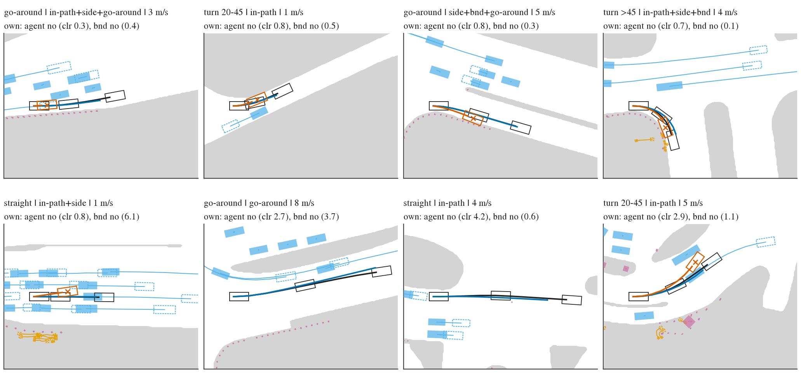
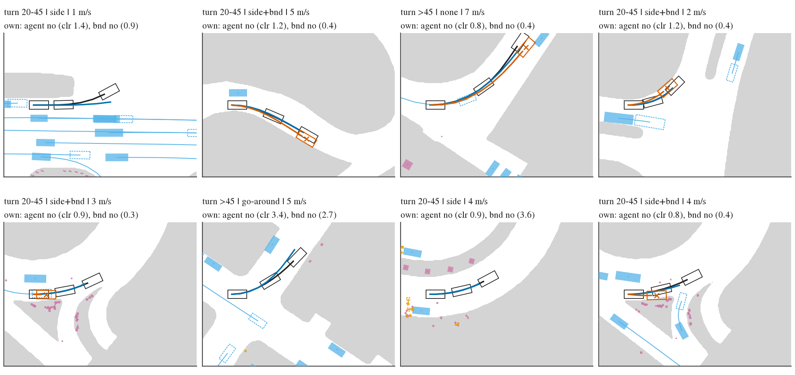
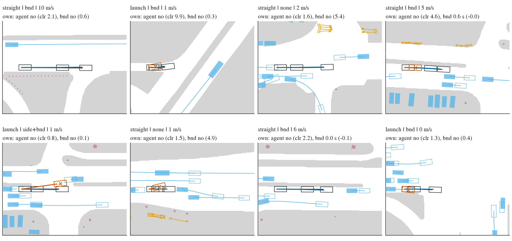
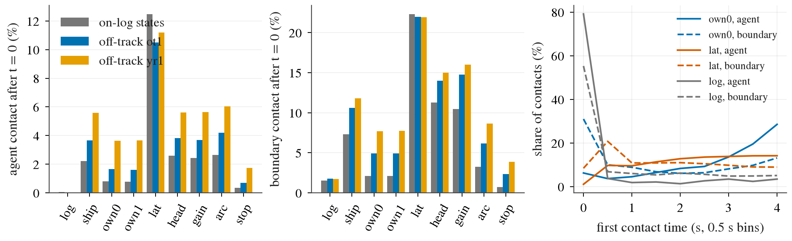

# BODY1 deliverable 1: navtrain scene taxonomy and the contact row set

2026-10-10. Implements sections 2.1, 2.2 and the splits paragraph of
[plans/2026-10-10-body1-prereg.md](../plans/2026-10-10-body1-prereg.md). No predictor was trained. Everything here is a
label-side read: agent boxes, the drivable raster and logged futures are labels only.

Code: [lib/sweep.py](../lib/sweep.py) (labels), [lib/b1.py](../lib/b1.py) (paths, families),
[scripts/bd1_tax.py](../scripts/bd1_tax.py), [scripts/bd1_plans.py](../scripts/bd1_plans.py),
[scripts/bd1_rows.py](../scripts/bd1_rows.py) (`gen`, `check`, `summary`), [scripts/bd1_fig.py](../scripts/bd1_fig.py).
Tables: `results/taxonomy/*.csv`. Box: `$DATA_DIR/runs/body1/{labels,taxonomy,plans,rows,figs}`.

## 1. Taxonomy (103 288 navtrain tokens, 1 192 logs)

Definitions are in the docstring of `bd1_tax.py`. Manoeuvre is exclusive (first match in the prereg's order). The three
hazard flags are stored separately; the table uses the primary hazard (in-path > side > boundary > none).

| manoeuvre \ primary hazard | in-path | side | boundary | none | all |
|---|--:|--:|--:|--:|--:|
| launch | 4 866 | 1 971 | 1 583 | 4 613 | 13 033 |
| stop | 566 | 2 532 | 1 292 | 5 718 | 10 108 |
| turn 20-45 | 2 273 | 1 921 | 1 937 | 9 672 | 15 803 |
| turn > 45 | 1 424 | 776 | 1 510 | 6 294 | 10 004 |
| go-around | 473 | 682 | 265 | 893 | 2 313 |
| straight | 9 796 | 7 444 | 11 022 | 23 765 | 52 027 |
| all | 19 398 | 15 326 | 17 609 | 50 955 | 103 288 |

n = 103 288 tokens, all with a logged future. Flag totals (non-exclusive): in-path 19 398, side 19 550, boundary 24 025,
go-around object present 4 910 (2 313 of them at < 20 deg and not launch / stop, which is the manoeuvre tag).
Per city: `tax_cells_city.csv`; per split: `tax_cells_split.csv`. Tokens standing still for the whole 4 s: 819 (0.8 %).

### User classes

A token can hold several class bits; the primary class (first that holds, 1 > 2 > 3) is what the row balance uses.

| class | bit set | primary | hold logs (primary) | train logs (primary) | Boston | Las Vegas | Pittsburgh | Singapore |
|---|--:|--:|--:|--:|--:|--:|--:|--:|
| 1 obstacle ahead (in-path or go-around) | 21 238 | 21 238 | 2 137 | 19 101 | 3 173 | 15 771 | 1 829 | 465 |
| 2 turn (turn with side / boundary flag, or > 45 deg) | 15 281 | 12 994 | 1 387 | 11 607 | 1 771 | 6 678 | 1 852 | 2 693 |
| 3 leaving the road (straight / launch with boundary flag, straight with no flag) | 40 795 | 38 087 | 4 124 | 33 963 | 4 307 | 22 796 | 4 747 | 6 237 |
| other | | 30 969 | 3 278 | 27 691 | 3 703 | 22 438 | 2 393 | 2 435 |
| all | | 103 288 | 10 926 | 92 362 | 12 954 | 67 683 | 10 821 | 11 830 |

City columns count the primary class. Overlaps: 2 287 tokens are class 1 and 2, 2 547 are class 1 and 3
(`tax_classes.csv`). "Other" is mostly turn 20-45 with no flag (9 672), straight with a side object only (5 993), stop
with no flag (5 710) and launch with no flag (4 289) (`tax_class_cells.csv`).

**> 45 deg bucket (reported separately everywhere).** 10 773 tokens (10 004 tagged turn > 45, 761 launch, 8 stop);
primary hazard in-path 1 637, side 895, boundary 1 615, none 6 626; flags in-path 1 637, side 1 085, boundary 2 248.
1 173 of them are in hold logs.

### Mapping to decision 220

| Decision 220 class | Taxonomy cell | Tokens |
|---|---|--:|
| (i) ran into the lead in its own lane | class 1, in-path flag | 19 398 |
| (ii) turn / go-around, plan sweep through the object | class 1 go-around manoeuvre + class 2 | 2 313 + 15 281 (bit) |
| (iv) drift without a manoeuvre | class 3 tokens that also carry the side flag | 1 878 |
| offroad / left-corridor zeros | class 3 boundary (straight / launch, boundary flag, no in-path) + class 2 boundary (turn with boundary flag) | 14 483 + 4 794 |

Open point for the reader of the prereg: (iv) maps to "class 3 with a side object", which under the written class 3
definition requires the boundary flag as well (1 878 tokens). Straight / launch tokens with a side object and no
boundary flag (7 474) fall in "other". Their rows are generated and kept; the `w4` weights include them.

## 2. Representative tokens, drawn before the full generation

Eight tokens per class from shard 0, round-robin over the class's cells, seed 0 (`bev_tokens.csv`). Grey: outside the
drivable area. Filled boxes: logged objects at t0 (blue vehicle, purple generic object, orange pedestrian / bicycle),
thin lines their 4 s tracks, dashed outlines their boxes at 4 s. Black: logged future with the ego box at 0, 2, 4 s.
Blue: the student's plan (P2H10-F-s0). Vermillion: one perturbed query that makes contact, its box and a cross at the
first contact. Title: manoeuvre, flags, speed; second line the labels of the student's own plan.

Class 1. Look at whether the flagged object sits in the logged corridor. The in-path panels do. Two of the three
go-around panels (5 m/s and 8 m/s) are curved lanes past vehicles of the neighbouring lane: the go-around tag has false
positives because its lane reference is a constant-curvature continuation, not the lane.

Class 2. The student's plan follows the logged turn within the lane in all eight; the perturbed queries leave the road
at the turn exit or strike the object beside the turn, which is the label the predictor has to learn.

Class 3. Boundary-flag panels have the kerb within 0.5 m of the logged sweep; two of the student's plans already have a
corner at SDF < 0 by 0.0 to 0.1 m (see the shallow-contact limit below).

## 3. Row set

242 432 states x 24 queries = 5 818 368 rows, 0.82 GB, 36 files `rows/<cache dir>.npz` (one per state family and shard).

| State family | States | Rows | Hold-log rows |
|---|--:|--:|--:|
| log (every token on the log) | 103 288 | 2 478 912 | 262 224 |
| ot1 (+-0.5 m / +-2 deg, existing cache) | 69 572 | 1 669 728 | 176 784 |
| yr1 (yaw-rate states, existing cache) | 69 572 | 1 669 728 | 176 784 |

Query slots per state: own0, own1 (P2H10-F-s0 / -s1), ship, log, then 4 each of lat, head, gain, arc, stop (2 built on
each student seed). Parameters and recipes: docstring of `bd1_rows.py`.

Schema of one file (n states, Q = 24): `names`, `log`, `hold` (n); `gi` (row of the token in the label store and in
`taxonomy/tax.npz`); `off` (n, 2) state pose in the logged frame; `q` (n, Q, 8, 3) float32 query poses in the state's
own frame; `qok`, `par` (n, Q); `qfam`, `qbase`, `qfam_names` (Q); agent labels `a_hit`, `a_t`, `a_s`, `a_cls`, `a_obj`,
`a_rear`, `a_t0`, `a_clr`, `a_lat`; boundary labels `b_hit`, `b_t`, `b_s`, `b_margin`, `b_cov`, `b_t0` (all (n, Q); 99 =
undefined). Vision tokens are not copied: the trainer reads `cache/<cache dir>@warp/front.npy` by row. Class tags come
from `taxonomy/tax.npz` through `gi`. Plans alone: `plans/<cache dir>.npz`.

### Composition and balance (training logs, rows with a defined contact type)

Contact type: agent if `a_hit`, else boundary if `b_hit`, else none. Rows whose only contact is a rear-end by a faster
object are excluded (165 421 over all logs, 73 % of them in the stop family).

| Primary class | Type | Rows | Share before | Share after `w3` |
|---|---|--:|--:|--:|
| 1 | agent | 72 760 | 0.014 | 0.111 |
| 1 | boundary | 79 137 | 0.016 | 0.111 |
| 1 | none | 825 474 | 0.163 | 0.111 |
| 2 | agent | 27 117 | 0.005 | 0.111 |
| 2 | boundary | 115 000 | 0.023 | 0.111 |
| 2 | none | 522 539 | 0.103 | 0.111 |
| 3 | agent | 49 350 | 0.010 | 0.111 |
| 3 | boundary | 303 530 | 0.060 | 0.111 |
| 3 | none | 1 645 404 | 0.326 | 0.111 |
| other | agent / boundary / none | 82 153 / 96 065 / 1 236 549 | 0.280 | 0 |

n = 5 055 078 training-log rows. Weights are a 4 x 3 table in `balance.json` (`w3`: class other = 0; `w4`: other as a
fourth class). After `w3` the query-family mass moves towards lat (0.169 -> 0.273) and away from stop (0.150 -> 0.088)
and log (0.043 -> 0.021); state families go log 0.428 -> 0.364, ot1 0.287 -> 0.291, yr1 0.286 -> 0.346
(`balance_qfam.csv`, `balance_sfam.csv`). Full cross table class x type x query family x state family x split:
`composition.csv`.

### Contact rates per query family

Left and middle: share of rows with a first contact after t = 0, by query family and state family. The logged future
is the floor, the student's own plan sits between it and the perturbations, off-track states roughly double to
quadruple the student's rate. Right: first-contact time; the student's agent contacts pile up at 3 to 4 s, the lateral
ramp spreads them evenly.

| State family | Query | Agent | Boundary | Agent after t0 | Boundary after t0 | Rear-end flag |
|---|---|--:|--:|--:|--:|--:|
| log | log | 0.0005 | 0.020 | 0.0004 | 0.015 | 0.0001 |
| log | own0 / own1 | 0.0082 / 0.0079 | 0.026 / 0.026 | 0.0081 / 0.0078 | 0.021 / 0.021 | 0.0004 |
| log | ship | 0.022 | 0.078 | 0.022 | 0.073 | 0.014 |
| log | lat | 0.125 | 0.228 | 0.125 | 0.223 | 0.014 |
| log | head / gain | 0.026 / 0.024 | 0.118 / 0.109 | 0.026 / 0.024 | 0.113 / 0.104 | 0.002 / 0.001 |
| log | arc / stop | 0.027 / 0.004 | 0.037 / 0.012 | 0.026 / 0.003 | 0.033 / 0.007 | 0.016 / 0.117 |
| ot1 | own0 | 0.017 | 0.071 | 0.017 | 0.049 | 0.003 |
| yr1 | own0 | 0.040 | 0.119 | 0.036 | 0.077 | 0.007 |

All 27 cells: `contact_rates.csv`; per class: `contact_rates_class.csv`; first-contact histogram:
`first_contact_time.csv`; struck class: `struck_class.csv` (own0: vehicle 3 975, generic object 585, pedestrian 236,
bicycle 17). Staged checks: logged-future agent contact 0.05 % (decision 158 expected about 0.3 %). Logged-future
boundary contact is 2.0 %, not near 0: these are shallow (median depth 0.10 m, 95 % within 0.20 m on shard 0) and a
quarter are already present at t = 0.

### The student's own plan on hold logs (G1 positives)

On-log and off-track states pooled, `navsim/body1-hold-logs` (121 logs, 25 658 states).

| Primary class | States | Agent positives own0 / own1 | Logs with one | Boundary positives own0 / own1 | Logs with one |
|---|--:|--:|--:|--:|--:|
| 1 | 4 681 | 127 / 111 | 30 / 29 | 188 / 191 | 36 / 36 |
| 2 | 3 347 | 70 / 68 | 21 / 19 | 367 / 373 | 46 / 47 |
| 3 | 10 412 | 98 / 102 | 39 / 39 | 707 / 705 | 80 / 81 |
| other | 7 218 | 167 / 168 | 38 / 39 | 232 / 226 | 55 / 56 |
| all | 25 658 | 462 / 449 | 64 / 63 | 1 494 / 1 495 | 95 / 95 |
| > 45 deg | 2 781 | 59 / 56 | 15 / 15 | 248 / 250 | 39 / 41 |

Every class has at least 30 positives of both kinds, so G1 is a gated read in all three classes. On-log states alone
would not be enough: agent positives on the log are 31 / 16 / 5 for classes 1 / 2 / 3 (`own_plan_positives.csv`). The
positives sit in few logs (19 to 39 per class for agents), so log-clustered intervals will be wide. Boundary positives
include the shallow ones; with contacts at t = 0 removed they are 133 / 297 / 433.

> 45 deg bucket, the student's own plan (own0, all logs, `gt45_own_plan.csv`): on the log agent contact 0.5 % with no
hazard, 2.6 % with an in-path object, 3.0 % with a side object; boundary contact 4.1 % with no hazard and 18.1 % with
the boundary flag. On yr1 states the boundary rate with the boundary flag is 39.3 %.

## 4. Sweep-module agreement

`bd1_rows.py check`, 300 on-log states of shard 0, all 24 queries (`check.json`).

| Against | Cases | Result |
|---|---|---|
| `AgentHinge.distances` (margin 0) | 7.0 M valid (step, object) pairs | contact agrees on 100 % (5 294 = 5 294); separated-distance difference max 2.3e-5 m |
| `drivable_hinge.Hinge.margins` | 1.18 M corner samples | max difference 8.1e-6 m, sign agrees on 100 % |
| `swv1_lib.Rollout.sweep` (shapely), objects held at their t0 size | 12 219 object sweeps of 100 states | first-contact index agrees on 100 % (155 = 155 contacts), min-clearance difference max 6.7e-6 m |
| the same, our sizes interpolated between annotations | 12 219 | first-contact index agrees on 99.81 %, contacts 156 against 155 (153 common), min-clearance difference up to 0.34 m |

The last row is a real difference in convention, not an error: the nuPlan labels change an object's length and width
between annotated times, `swv1_lib` gives each object one size, and the row set interpolates the size as `AgentHinge`
does.

## 5. Datasets we hold: boxes and a boundary for this lesson

Checked on the box by a read-only sub-agent on 2026-10-10 (directory listings and one opened record per dataset). Items
it did not open are marked.

| Dataset | Object boxes with motion | Drivable boundary | For this lesson |
|---|---|---|---|
| navtrain (NAVSIM / nuPlan) | yes, 2 Hz, 4 s futures | yes, nuPlan maps (`navsim/maps`, 4 cities) | used here |
| WOD-E2E (`waymo_e2e`) | no (not re-opened) | no | no |
| Waymo perception v2 (`waymo_perception`) | yes: `lidar_box` parquet for 798 segments, 10 Hz tracks (fields not opened) | no map component on disk | boxes only |
| WOMD (`womd/validation_interactive`, 10 of 150 shards, about 2 800 scenarios) | yes: tracks 10 Hz, 1 s past + 8 s future, sizes and headings | yes: `map_features` with `road_edge` polylines | best fit after navtrain; no camera, needs the `p3-wodprep` env |
| nuScenes (`v1.0-trainval`, `v1.0-mini`) | yes: `sample_annotation`, 2 Hz | map expansion files present (content not opened) | usable after conversion |
| PhysicalAI-AV (`physical_ai_av`, `nurec`) | none on disk (labels are egomotion only; USDZ not opened) | none | no |
| comma1M | no | no | no |
| HUGSIM | not as boxes: the one scene opened has empty `dynamics`; dynamic objects are Gaussians | ground plane per frame only; nuScenes map cache for one map | no, as it stands |
| b2dc-train@v2 (`runs/b2d_collect`) | yes: `actors.npz` + `kinds.json` (pose, extent, 20 Hz) | yes: `sdf.npz` on the same grid, some ticks | yes after building boxes (not used, per the prereg) |
| bench2drive-mini | yes: `anno/*.json.gz` `bounding_boxes` | none found | boxes only |

Corrections to what the docs said: WOMD and Waymo perception carry boxes (WOMD also road edges); b2dc does carry
actor boxes; HUGSIM `scenarios/` has 443 entries, not 436 (directory count). `alpasim_nuplan` and `rvr_real` were only
listed, not opened.

## 6. Costs

Box wall about 15 min in total. GPU (card 2, held for this lane): plan forward 203 s for 242 432 states x 2 models
plus two pilots, about 0.07 card-h, 6.3 GB. CPU: row generation 3 385 core-s (0.94 core-h, 36 workers, 133 s wall),
taxonomy about 2 core-min, checks and figures a few core-min. Disk under `$DATA_DIR/runs/body1/`: labels 3.0 GB
(memory-mapped copies of the two label files), rows 0.82 GB, plans 0.08 GB, taxonomy 0.03 GB: 3.9 GB.

## 7. Deviations from the prereg

1. Go-around uses a lane proxy, not the lane: the reference sweep is the constant-curvature continuation of the motion
   at t0. The tag has visible false positives on curved roads (section 2).
2. In-path is read as: the object, at its own time, lies in the part of the logged sweep the ego reaches later. A
   time-matched test alone would never flag a followed lead.
3. Hazards are stored as three flags plus a primary; the prereg says "nearest". Classes are bits plus a primary.
4. The lateral ramp is linear in arc length (equal to linear in time at constant speed) and capped at 0.25 x the 4 s
   arc, so a stopped plan does not slide sideways. Stop is a hold at a sampled arc length without a braking profile.
5. Two student seeds are separate query slots (own0, own1); perturbations are split between them.
6. Balance is a (class, type) weight table over training logs, with rear-end-only rows and class other at weight 0
   (`w3`), instead of per-row weights stored in the shards.
7. No `bd1_*` family was built: every class reaches 30 hold positives with the existing caches.

## 8. Limits

- Boundary contact at SDF < 0 fires on 2.0 % of logged futures by 0.1 to 0.2 m (0.5 m raster, bilinear). A trainer
  should threshold `b_margin` below zero or regress it; the stored 0 / 1 is the prereg's literal label.
- Off-track states exist only for tokens faster than 3 m/s (the ot1 / yr1 selection): launch and slow tokens have
  on-log states only.
- About 1 % of rows (3 to 4 % in the arc family) have plan steps outside the raster (`b_cov` < 41); those steps carry no boundary label.
- Off-track states can start in contact (ot1 2.1 %, yr1 4.2 % boundary at t = 0; 0.07 % / 0.35 % agent): `a_t0`, `b_t0`.
- Objects are the 32 nearest at t0 of four classes; cones and barriers are not labels. Logged agents do not react.
- Student plans on navtrain are in-sample for the adapter (prereg). The > 45 deg and class counts are single-pass
  counts without intervals.
- Perturbed queries are kinematic edits of 8 poses; none is checked for feasibility.
