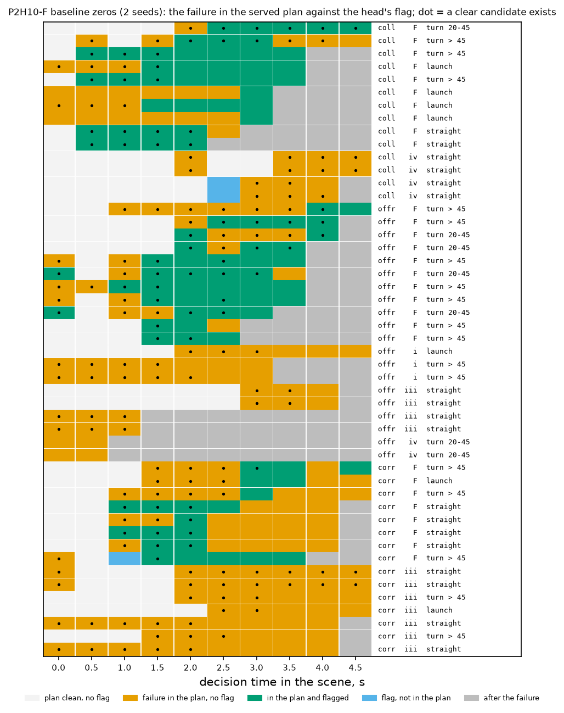
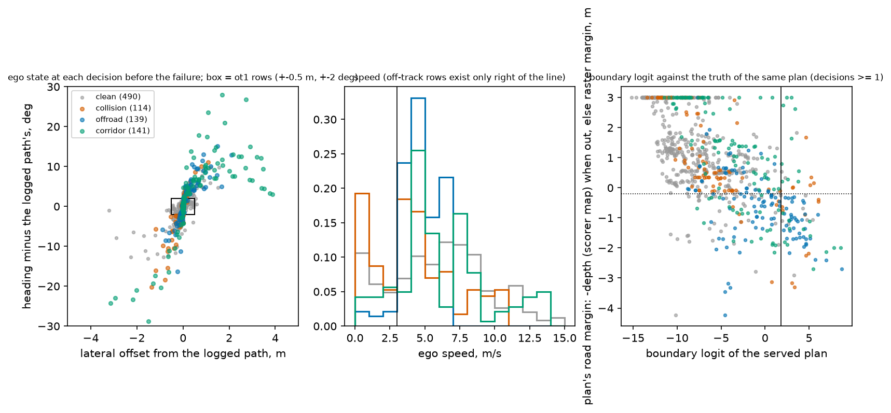
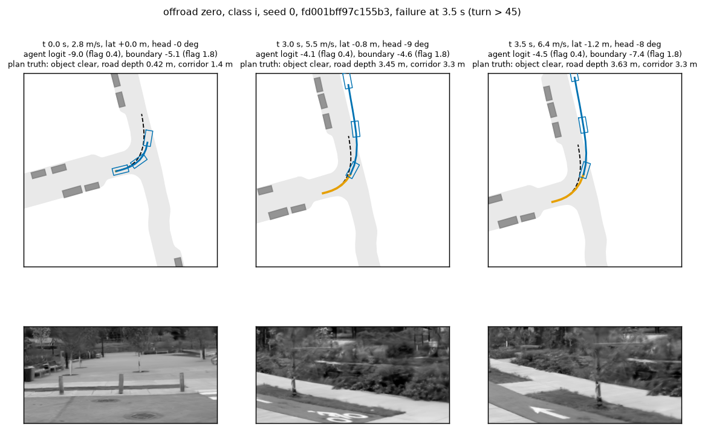
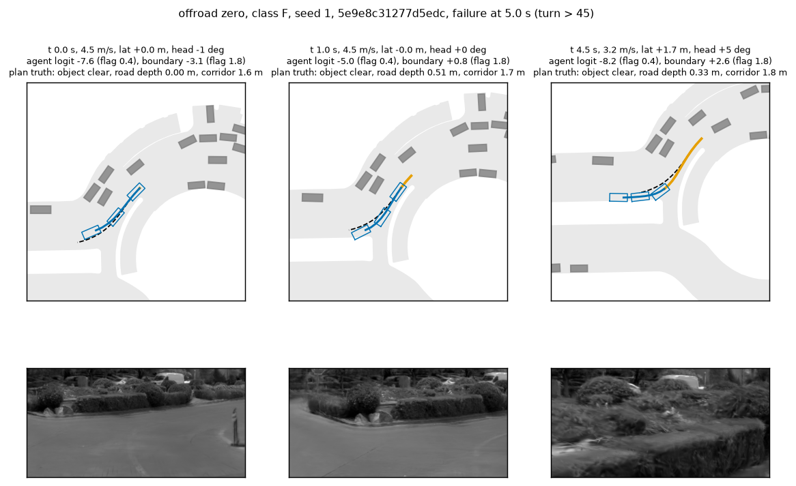
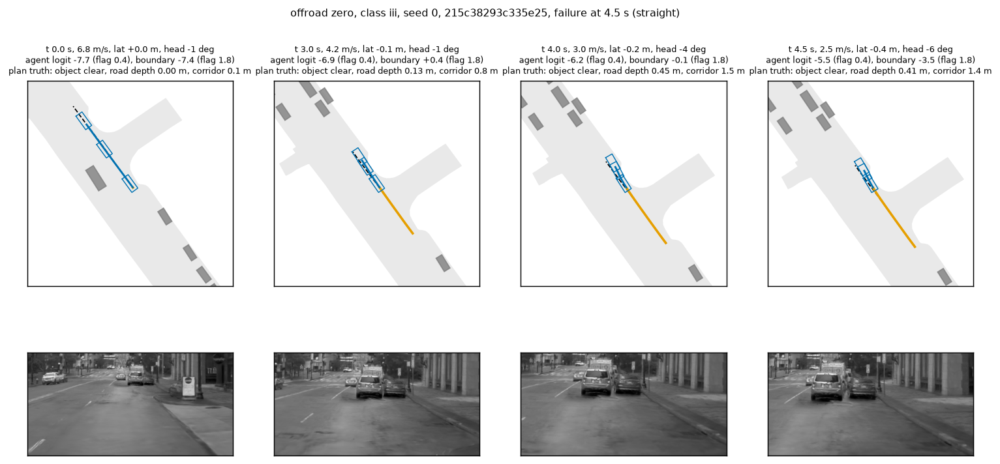
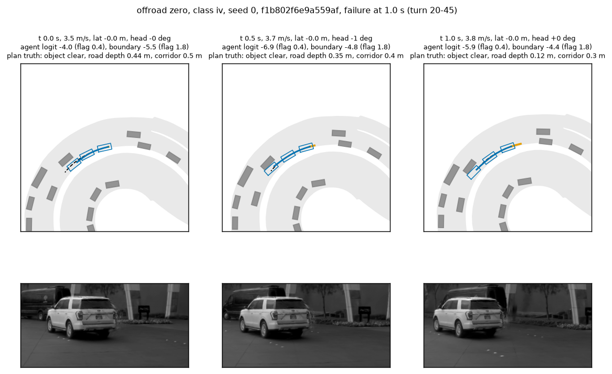
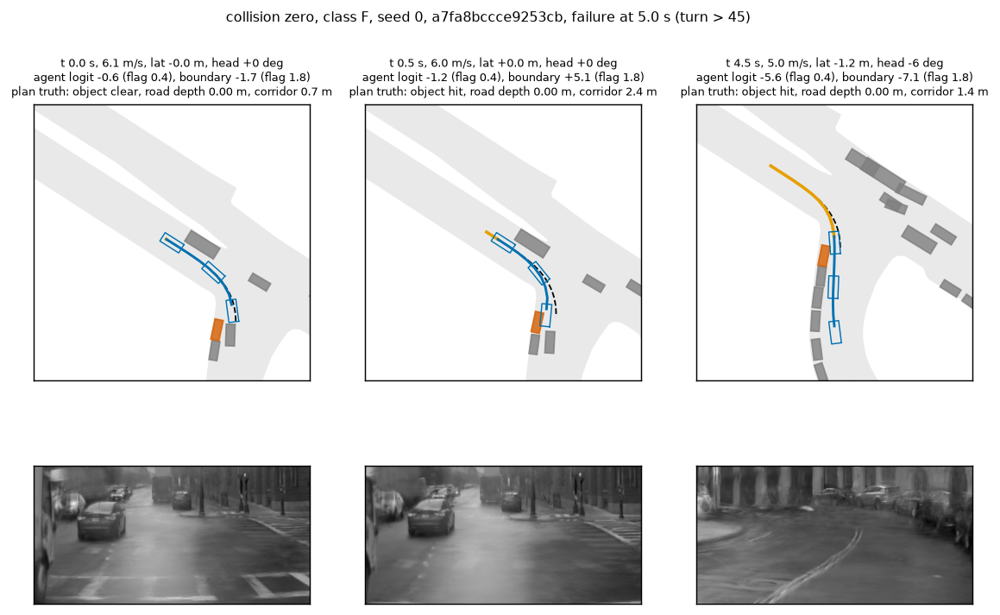
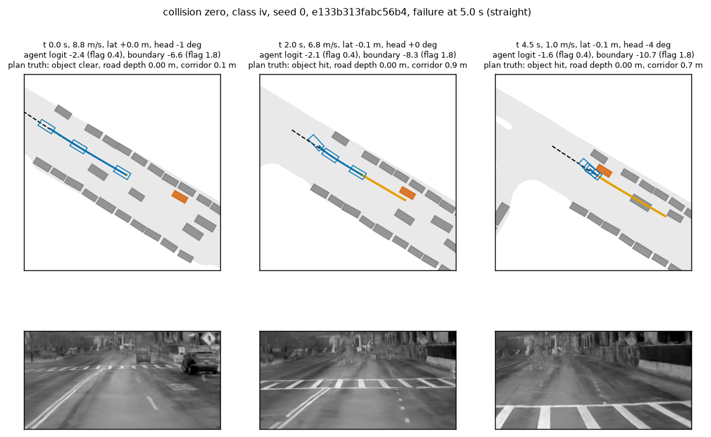
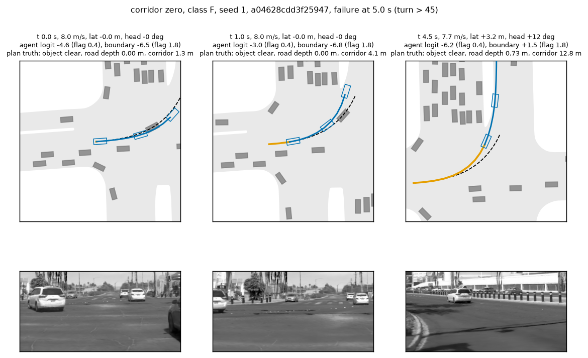
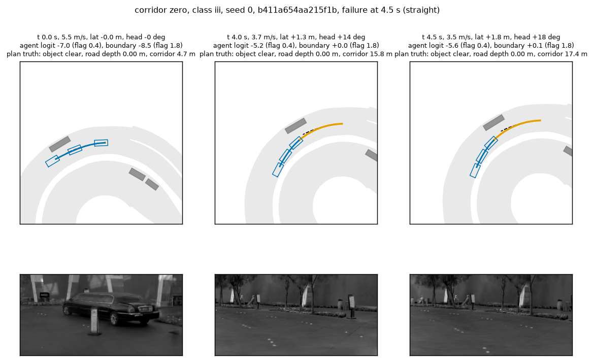

# BODY1 diagnosis: the baseline zeros of P2H10-F, decision by decision

2026-10-10. Follows decisions 223 to 225 ([s0_gate.md](s0_gate.md), [stop_closed_loop.md](stop_closed_loop.md), [replan_closed_loop.md](replan_closed_loop.md)).
No training, no new closed-loop arm, nothing fitted or chosen on these scenes. Simulator objects, the simulator's map and the logged path are
used as truth for the diagnosis only; AlpaSim public scenes are navtest logs and never become training rows. The draft of the next arm that
follows from this read is the DRAFT Amendment 4 in [the prereg](../plans/2026-10-10-body1-prereg.md).

**Verdict.**
1. **Every zero is already in a served plan before it happens (49 of 49; class "drift / tracking" is empty).** 20 of the 49 have it in the plan
   of decision 0, on the logged state. The controller follows the plan: the ego is at most 0.35 m from where the previous plan put it 0.5 s
   earlier. There is a plan to flag in every case.
2. **The head does flag most of the physical ones, late.** At a decision whose plan holds the failure, after decision 0: collisions 10 of 14,
   offroad 11 of 20, corridor 8 of 15 (through the boundary logit). First such flag: median 2.5 s before the failure. Decision 225's "5 of 10 never
   flagged" was one chunk; over both seeds 20 of 49 are never flagged where it counts.
3. **A flag is not an action.** At the 101 flagged in-plan decisions a lateral ramp of at most 1.5 m is truly clear (objects, road, corridor) in
   34; the head calls some ramp clear in 40 and its pick is truly clear in 13. Clear candidates exist earlier (in 12 of 14 collisions and 18 of 20
   offroad zeros at least 1.5 s before the failure), at decisions the head does not flag yet.
4. **15 of the 49 zeros are not a body problem.** All 15 corridor zeros leave the 4 m corridor on the road, touching nothing: the plan goes to a
   drivable place that is not the route (one of them is 0.03 m over the road edge at that moment). The five > 45 deg ones cut inside the logged arc.
5. **7 of the 20 offroad zeros are a definition gap**: the NAVSIM drivable raster, the head's and the hinge's label, calls the exit drivable where
   AlpaSim's road area ends (4 scenes; depth up to 1.7 m on the scorer's map).
6. **The domain gap is in the boundary half.** On these 980 closed-loop decisions the head's AUC is 0.882 (agent) and 0.890 (road), against
   0.905 and 0.978 on hold logs. The agent half is blind at launch: 2 of 22 in-plan collision decisions under 1 m/s are flagged, 30 of 42 above 3 m/s.

What a body lesson on navtrain can reach: 14 collisions + 13 offroad = 27 of 49 (seed, scene) zeros; 22 need something else (route, label).

Code: [scripts/bd1_diag.py](../scripts/bd1_diag.py) (`sel`, `extract`, `replay`), [scripts/bd1_diag_read.py](../scripts/bd1_diag_read.py) (`truth`, `tables`,
`figs`), [scripts/bd1_diag_report.py](../scripts/bd1_diag_report.py) (class rule in its docstring). Tables: `results/diag/`. Box: `$DATA_DIR/runs/body1/diag/` (1.6 GB).

## 1. Material and truth

| Item | Value |
|---|---|
| Zeros | all zero-score rollouts of TR1's P2H10-F-s0 / -s1 runs on the 700 scenes: 49 (seed, scene) pairs = 14 at-fault collision, 20 offroad, 15 left corridor (s0 8 / 10 / 8, s1 6 / 10 / 7); 27 distinct scenes |
| Clean sample | 49: per zero one scene with score 1 in both seeds from the same log segment, rerun with the rollout logs kept (same seed); all 49 scored 1 again |
| Decisions | 980 (10 per scene, every 0.5 s); the logged driver messages replayed through the driver class: plans within 0.016 m (median) and 0.11 m (max) of the run's |
| Head | S0, two full-scale seeds, mean logit; flag thresholds of Amendment 3 (agent 0.400, boundary 1.831); scored on the plan and on 32 candidates |
| Objects | simulator boxes at matching times over the plan's 4 s (`swv1_lib.Rollout.sweep`); rear-end contacts excluded |
| Road | the scorer's own rule for nuPlan maps: the ego box must be covered by the union of road areas and lanes; depth = farthest corner from it. Reproduces the scorer's 2 Hz offroad flag on 1 168 of 1 176 executed samples |
| Corridor | box centre >= 4 m from the logged path (the scorer's `left_corridor_laterally`); within 0.05 m of the scorer's series on 85 of 98 scenes (differences only past the end of the logged path) |
| NAVSIM raster | drivable SDF of the scene's navtest token (the label the head and the hinge are trained on), registered to the rollout frame (the token's t0 is 1.5 s into every scene; residual 0) |

Candidates per decision: the 10 lateral ramps of Amendment 3 (+-0.3 to 1.5 m), the plan's path at 0.75 and 0.5 of its arc length (slow-down),
and each ramp at both. After decision 226 the slow-down family is an oracle ceiling only: no longitudinal serving cap is proposed.

## 2. Each zero: where the failure is, and whether the head saw it

Classes (rule in `bd1_diag_report.py`; pre = decisions before the first failing sample; precedence F, ii, iii, iv, i): **F** the failure is in the
plan and the head flags it at such a decision after decision 0; **ii** in no plan; **iii** definition (offroad: at most 0.20 m deep, or the NAVSIM
raster calls the exit drivable; corridor: on the road and touching nothing); **iv** first contact point outside the front camera's view at every
in-plan decision; **i** in the plan, deep, in view, never flagged.

| Failure | n | F flagged | i head miss | ii drift | iii definition | iv out of view | in the plan at decision 0 | definition case incl. flagged |
|---|--:|--:|--:|--:|--:|--:|--:|--:|
| collision | 14 | 10 | 0 | 0 | - | 4 | 4 | - |
| offroad | 20 | 11 | 3 | 0 | 4 | 2 | 11 | 7 |
| corridor | 15 | 8 | 0 | 0 | 7 | - | 5 | 15 |
| collision, > 45 deg | 3 | 3 | 0 | 0 | - | 0 | | |
| offroad, > 45 deg | 10 | 7 | 3 | 0 | 0 | 0 | | 3 |
| corridor, > 45 deg | 5 | 3 | 0 | 0 | 2 | - | | 5 |

n = (seed, scene) pairs; > 45 deg = logged 4 s future of the scene's navtest token. Per zero: `diag/zeros.csv`; per decision: `diag/decisions.csv`.

One row per zero, one cell per decision. Look at the orange cells left of the green ones: the failure sits in the plan for 1 to 3 s before the
head flags it, and the dots (a truly clear candidate exists) thin out by the time the cell turns green.

- **Collisions.** 12 of 14 struck objects stand still. The four unflagged ones are two scenes x two seeds: a standing object beside the ego and a
  vehicle moving at 9.7 m/s, both outside the camera's view at every in-plan decision. Four are launches from under 1 m/s into a standing object.
- **Offroad.** 16 of 20 are turns (10 over 45 deg, 6 of 20 to 45 deg). The three head misses are the deepest plans of the set (2.0 to 4.2 m off the
  road: a 72 deg turn entered at 2.8 m/s in both seeds, and a launch into a 68 deg turn), with the boundary logit at -5 to -7. The two
  out-of-view cases fail at 1.0 s with two decisions before the failure.
- **Tracking.** Median distance of the ego from the previous plan's 0.5 s point: 0.045 m (zeros) and 0.047 m (clean); maximum 0.35 m.

## 3. The head on these closed-loop decisions

AUC of the plan's logit against the truth of the same plan, cluster bootstrap by log segment (`diag/head_auc.csv`). The sample is half zeros by
construction, so rates are not population rates.

| Subset | Agent AUC | pos / neg | recall at flag | Road AUC (scorer map, > 0.20 m) | pos / neg | recall at flag | Road AUC (NAVSIM raster) |
|---|---|--:|--:|---|--:|--:|---|
| all decisions | 0.882 [0.812, 0.938] | 120 / 860 | 0.47 | 0.890 [0.827, 0.941] | 197 / 752 | 0.41 | 0.882 [0.822, 0.931] |
| clean scenes | 0.873 [0.749, 0.959] | 17 / 473 | 0.41 | 0.880 [0.763, 0.986] | 22 / 466 | 0.27 | 0.833 [0.731, 0.929] |
| ego under 3 m/s | 0.824 [0.632, 0.934] | 50 / 133 | 0.30 | 0.936 [0.876, 0.980] | 15 / 166 | 0.13 | 0.877 |
| ego 3 m/s and more | 0.916 [0.858, 0.961] | 70 / 727 | 0.59 | 0.882 [0.812, 0.937] | 182 / 586 | 0.43 | 0.877 |
| inside the ot1 envelope | 0.913 [0.787, 0.978] | 19 / 456 | 0.58 | 0.922 [0.882, 0.971] | 35 / 425 | 0.43 | 0.894 |
| outside it | 0.862 [0.773, 0.933] | 101 / 404 | 0.45 | 0.878 [0.781, 0.953] | 162 / 327 | 0.40 | 0.871 |

Hold-log references: agent 0.905, boundary 0.978, recall at the flag 0.51. ot1 envelope = within 0.5 m and 2 deg of the logged path, above 3 m/s.

- The agent half transfers (0.905 -> 0.882), as G2 said. The boundary half does not (0.978 -> 0.89), and scoring it against its own label (the
  raster) does not bring it back (0.882): the loss is in the input, rendered frames of unseen logs, not in the map definition.
- State coverage is the smaller effect: inside against outside the ot1 envelope differs by 0.04 to 0.05 on both halves.
- Lateral candidates, all decisions: agent AUC 0.829 (1 415 positives), road 0.885. At the flagged in-plan decisions the head calls 64 % of the
  truly clear ramps clear and 5 % of the others.
- Flags on the clean sample after decision 0: 36 of 441 decisions in 12 of 49 scenes (agent 27, boundary 10): these are the neighbours of the
  failing scenes, and a memoryless action would have acted in a quarter of them.

Left: lateral offset and heading against the logged path at every decision before the failure (grey: clean). Look at the box (the ot1 rows): the
collision and offroad points mostly sit in or near it; the corridor points are the ones far outside. Middle: ego speed. Right: boundary logit
against the plan's true road margin; look at the points below the dotted line and left of the flag line (plans more than 0.20 m off the road,
unflagged).

## 4. Ceiling of an action within the candidate families (item 2 of the brief)

Truth of a candidate = its own 4 s sweep, open loop from the decision's state, against objects, road and corridor together (`diag/ceiling.csv`).
Lead = time before the failure of the earliest decision with a clear candidate.

| Failure | n | lateral <= 1.5 m | lateral, eligible under Amendment 3's cap | slow-down (oracle) | both | any, lead >= 1.5 s | median lead |
|---|--:|--:|--:|--:|--:|--:|--:|
| collision | 14 | 11 | 10 | 12 | 12 | 12 | 4.25 s |
| collision, clear of objects only | 14 | 14 | | 12 | 14 | | 4.0 s |
| offroad | 20 | 17 | 17 | 16 | 18 | 18 | 4.0 s |
| corridor | 15 | 12 | 12 | 15 | 15 | 15 | 4.5 s |
| > 45 deg: collision / offroad / corridor | 3 / 10 / 5 | 3 / 9 / 4 | 3 / 9 / 4 | 3 / 10 / 5 | 3 / 10 / 5 | 3 / 10 / 5 | 4.0 to 5.0 s |

- For the collisions a clear action exists in 12 of 14, from the first decisions on. The two without one are the same launch scene in both seeds:
  every ramp that clears the object leaves the road or the corridor.
- At the moment the head flags, the picture is different: of 101 flagged in-plan decisions a clear ramp exists in 34 (31 eligible); collisions 13 of
  41, offroad 18 of 39, corridor 0 of 21. The head sees a clear eligible ramp in 40 and its pick is truly clear in 13 (collision 6, offroad 7).
- So the ceiling of "act on the flag with one ramp" is about a third of the flagged decisions, and the ceiling of "know it 4 s ahead" is 12 of 14 and
  18 of 20. The distance between the two is the 1 to 3 s in which the plan holds the failure and the head is silent.
- One decision's truth is open loop: later plans start from the state the action produced (decision 225).

## 5. The corridor class and the > 45 deg bucket (item 3)

| Scene (both seeds unless noted) | Logged 4 s turn | Plan's 4 s turn, first in-plan decision -> last | Side at the last decision | On the road at the exit | Reading |
|---|--:|--:|---|---|---|
| a33f5218 | +46 deg | +47 -> +23 | 3.4 m inside | yes | cuts inside the arc |
| d3f25947 | +62 | +65 -> +24 | 3.0 m inside | yes | cuts inside the arc; the plan also leaves the road in 7 decisions |
| 95895a12 (s0; offroad zero in s1) | +66 | +73 -> +40 | 2.7 m inside | 0.03 m over | cuts inside the arc |
| aa215f1b | +13 | +29 -> +21 | 1.4 m left | yes | turns more than the log |
| 511a5918 | +4 | +5 -> -7 | 3.9 m left at 14 m/s | yes | lateral move on a straight |
| 72e85179 (launch) | -8 | +38 / +61 -> +56 / +64 | 1.1 to 1.7 m left | yes | takes another branch |
| 6c435f85 | -1 | -54 -> +53 | 3.1 m right | yes | takes another branch, then turns back |
| 925d5621 | -4 | -42 -> -53 | 2.0 to 3.0 m right | yes | takes another branch |

All 15 leave the corridor on the road (14) or 0.03 m over its edge (1), with the nearest object 1.0 to 19.6 m away. It is a route failure. In
the > 45 deg bucket the five corridor zeros are the inside cut of decision 166 carried to 4 m, not "does not make the turn" by going wide. The
bucket's ten offroad zeros are physical: the plan leaves the road in the turn (7 flagged, 3 missed by the head, 3 of the flagged also definition
cases); its three collisions are flagged.

## 6. Row set against the failing states (item 4)

Share of the decisions before the failure (`diag/states.csv`, `diag/inplan_flags.csv`):

| Group | n | under 1 m/s | 1 to 3 m/s | within 0.5 m | heading within 2 deg | heading over 5 deg | inside the ot1 envelope |
|---|--:|--:|--:|--:|--:|--:|--:|
| collision | 114 | 0.19 | 0.14 | 0.90 | 0.59 | 0.16 | 0.41 |
| offroad | 139 | 0.02 | 0.04 | 0.85 | 0.55 | 0.24 | 0.53 |
| corridor | 141 | 0.04 | 0.10 | 0.60 | 0.38 | 0.45 | 0.26 |
| clean | 490 | 0.11 | 0.11 | 0.92 | 0.77 | 0.09 | 0.62 |

Thin or empty cells of [taxonomy.md](taxonomy.md) where zeros live:
- **Launch and slow states with an object in the path.** A third of the collision decisions are under 3 m/s; the head flags 11 of 34 in-plan
  decisions there (2 of 22 under 1 m/s) against 30 of 42 above. The row set has no off-track state under 3 m/s and 22 own-plan agent positives
  at 0 to 1 m/s on hold logs.
- **Heading errors over 5 deg.** 16 to 24 % of the collision and offroad decisions; ot1 stops at 2 deg, yr1 at about 2.5 deg per increment.
  Lateral offsets are covered (85 to 90 % within 0.5 m).
- **Turns over 45 deg with the road edge.** Half of the offroad zeros; the three head misses are here. The cell exists (1 510 tokens, 285 hold
  positives, AUC 0.941), so this is the rendered-view gap of section 3 more than a count gap.
- **Objects outside the front camera** (4 collision zeros): no row can teach what the input does not show.
- Manoeuvre x failure of the 49 zeros: launch 4 / 1 / 2, straight 6 / 4 / 8, turn 20-45 1 / 6 / 0, turn > 45 3 / 9 / 5 (collision / offroad / corridor).

## 7. The drivable label against the scorer's map

On the 980 plans: 197 are more than 0.20 m off the scorer's road, 218 are raster positives; 20 are off the scorer's road with a drivable raster and
35 the reverse; 31 are within the 0.20 m band. For 7 offroad zeros (4 scenes) the raster margin at the plan's exit point is +0.20 to +0.75 m,
and the executed ego at the failing sample has +0.19 to +0.73 m of raster margin: NAVSIM's drivable area (it includes car parks and similar
surfaces) is wider there than AlpaSim's road areas and lanes. A hinge or a head trained on the raster cannot learn these.

## 8. Review strips

Top: road union of the scorer's map (light grey), objects at the decision time (struck object vermillion), logged path (dashed), executed ego
(orange), served plan with the ego box at 0 / 2 / 4 s (blue), with the head's two logits and the plan's truth in the title. Bottom: the model's
road view at that decision. Cases: `diag/bev_cases.csv` (the zero with the most in-plan decisions of each class).

| Figure | Case | What to look at |
|---|---|---|
|  | offroad, head miss (72 deg turn at 2.8 m/s) | The plan runs 3.5 m off the road for the whole scene and the boundary logit stays at -5 to -7; the view is a kerb and a planted strip at close range. |
|  | offroad, flagged (50 deg turn) | At 1.0 s the plan is 0.5 m over the edge with the boundary logit at 0.8, under the flag; it reaches 2.6 only at 4.5 s. |
|  | offroad, definition | The plan leaves the grey area by 0.1 to 0.45 m onto a surface the NAVSIM raster calls drivable; the boundary logit stays under 0.4. |
|  | offroad at 1.0 s | Two decisions before the failure; the plan is 0.44 m over the edge at decision 0 and the exit point is below the camera's view. |
|  | collision, flagged (61 deg turn) | At 0.5 s the plan passes through the object and the head answers with the boundary logit (5.1), not the agent logit (-1.2); no later plan moves away. |
|  | collision, object out of view | The struck vehicle moves at 9.7 m/s outside the view cone; the agent logit stays near -2 at every decision. |
|  | corridor with a boundary flag (62 deg turn) | The plan cuts inside the dashed route; the boundary flag comes at 4.5 s, when the plan is also 0.7 m off the road. |
|  | corridor, on the road throughout | Nothing physical lies between the ego and the dashed route; both logits stay low. |

## 9. What follows for the next arm

- The lesson has to be in the plan, earlier than the head's flag: the failure is in the plan 4 s ahead in most zeros and a clear path exists
  then. That is arm 4.3, with the row set widened where section 6 says it is thin.
- A persistent serving action ranks lower: at flag time a ramp is clear in a third of the decisions and the head picks a truly clear one in 13 of 101.
- More rows for the head alone rank lower still: they would raise recall at launch, and the stop that would use it is closed (decisions 224, 226).
- Not reachable by a body lesson on navtrain: the 15 corridor zeros (route) and the 7 definition cases, unless the drivable label is rebuilt from
  the scorer's map layers on navtrain (cheap, part of the draft). The route failures need rows where the student is off the route and the command
  decides the branch: closed-loop rows (stage 2).

## 10. Costs, deviations, limits

Costs: 0.2 card-h (two closed-loop reruns of 26 and 23 clean scenes, 4 min each; one replay job, 2.5 min), about 1.5 h wall, 1.6 GB on the box.
All three GPU jobs went through the pool (owner body1); card 2 was not used.

Deviations from the brief:
1. The clean sample is matched by log segment only, one per zero; speed and turn are not matched (section 6 shows the clean states).
2. Class iv uses one point per case (the struck object's centre, the first corner to leave the road) and a fixed view cone (31 deg half angle,
   ground visible from 4.1 m ahead of the camera); "beyond the 4 s sweep" did not occur and has no row.
3. Head logits come from a replay of the logged messages, not from a hook in the run; the replayed plans differ from the run's by up to 0.11 m.
4. The slow-down candidates are an oracle ceiling (decision 226), not a proposed action.
5. Per-decision logits of `replan/chunk1_flagged_scenes.csv` were not re-read; the replay covers the same scenes.

Limits: 49 pairs are 27 distinct scenes in 21 log segments, and the two seeds of a scene mostly fail the same way, so every count is roughly
half as many independent cases; candidate truth is open loop and objects replay their log; the road truth disagrees with the scorer on 8 of 1 176
samples; the corridor truth is approximate past the end of the logged path, so a corridor exit in the plan at late decisions partly measures the plan against a straight continuation of the log; the AUCs are on a sample that is half zeros; the raster comparison
covers the plan's footprint inside the raster only; no clips, BEV strips with the model view instead.
