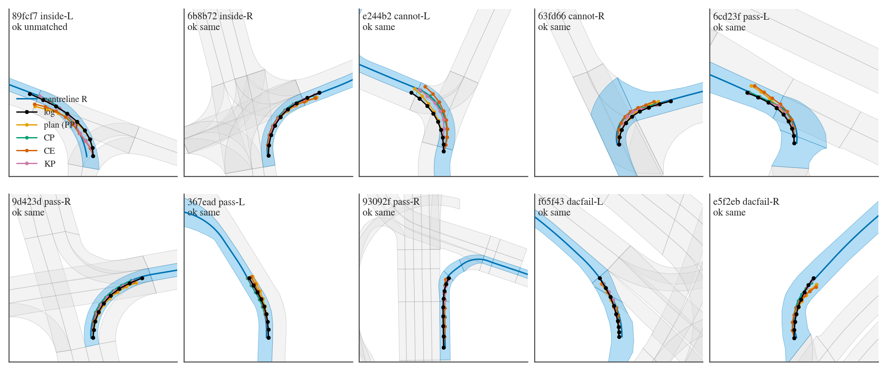
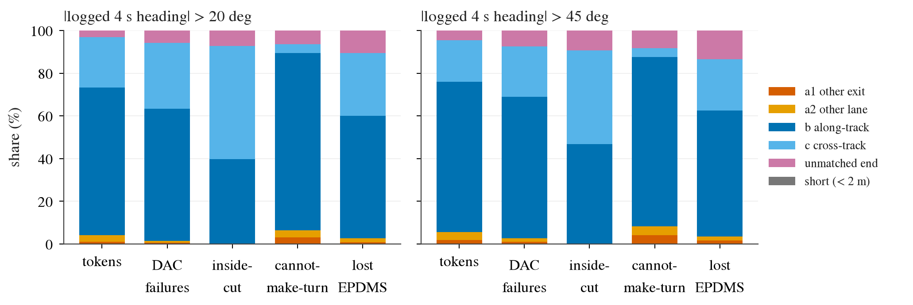
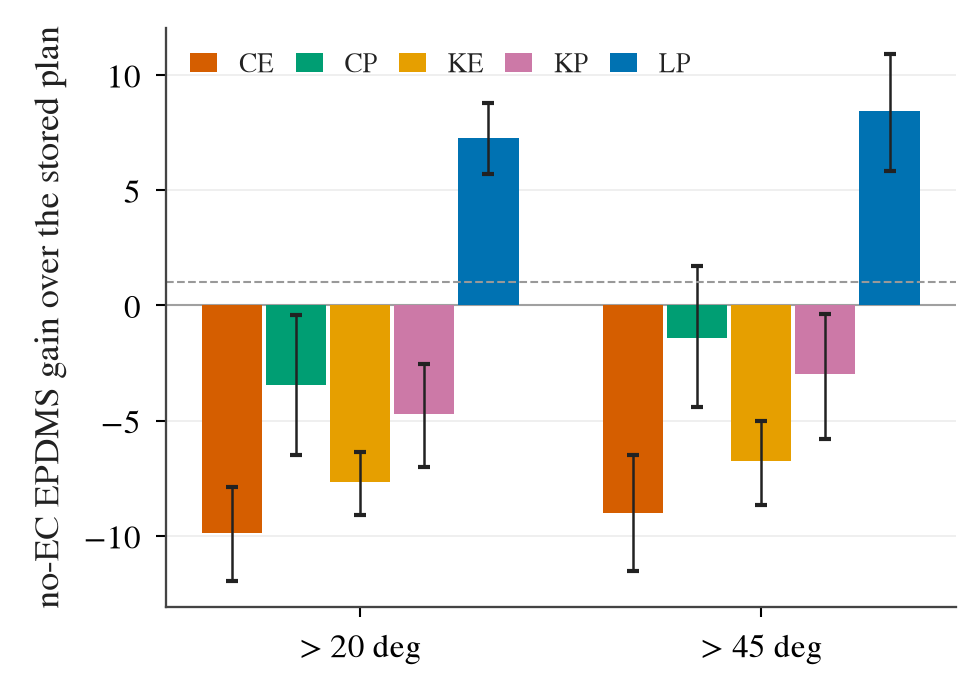
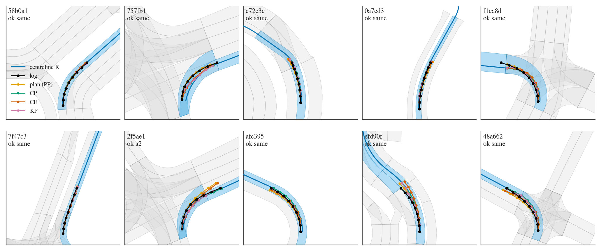
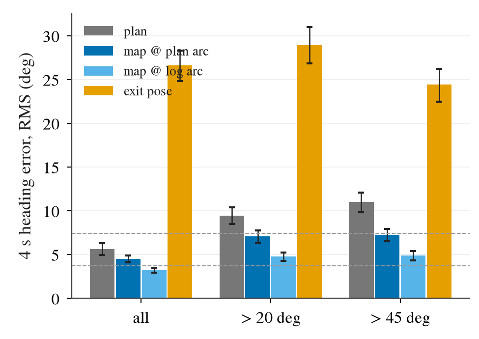

# corridor CORR0: is the lane corridor of the commanded exit the right supervision label for turn failures?

Written 2026-10-10 (lane CORR0). Measurement only: stored SH30 plans (`SH30-F-s0/s1`), stored per-token scores, the nuPlan map, the logs;
CPU re-scoring. No training, no GPU job, no closed loop, no WA-JEPA inference.
Pre-registration [plans/2026-10-10-corr0-prereg.md](../plans/2026-10-10-corr0-prereg.md) with amendments A and B. Code `lib/lanegraph.py`,
`scripts/corr_geom.py`, `scripts/corr.py`, `scripts/corr_report.py`, `scripts/corr_chain.sh`. Every table: [corr0/tables.md](corr0/tables.md),
CSVs and `summary.json` next to it. 95% CIs are log-cluster bootstraps (B 10 000), seed means. Decision 240.

**The map, the logged future and the lane sequence the log drove are privileged inputs. Every arm below is an analysis swap, not a method and
not a reportable inference path.**

## Answer

On navtest turn tokens the lane corridor's centreline is **not** a better imitation target than the logged path; it is a worse one. Moving
SH30's target onto it at unchanged precision costs 9.9 EPDMS on > 20 deg tokens, and the centreline itself, driven with SH30's timing and no
error at all, scores below the stored plan. Wrong exit or wrong lane is almost absent from SH30's turn failures (2.6% of > 45 deg DAC failures):
the failures are within the right corridor. What the corridor does carry is the 4 s heading: the map centreline of the driven exit is closer to
the logged 4 s heading than SH30's own plan. Counterfactual material is not scarce: 18 989 navtrain tokens in 821 logs have an alternative exit
of >= 20 deg within 40 m.

| line | registered read | measured | read |
|:--|:--|:--|:--|
| N1 | class holding the majority of > 45 deg DAC failures | along-track **66.4% [57.6, 75.8]**, cross-track 23.5% [15.2, 33.0], other exit 1.1% [0.0, 2.3], other lane 1.5% [0.0, 4.1], plan end off every lane 7.5% | along-track; wrong exit is not the lever on this board |
| N2 | CE vs stored plan on > 20 deg; "near zero" = CI upper bound < +1.0 | **-9.89 [-11.95, -7.87]**; removes 25.3% [17.5, 32.8] of the DAC failures gross, net -125% (225.5 -> 507.5 failures) | below the "near zero" line: negative |
| N3 | map heading RMS <= 3.7 deg passes, > 7.4 deg fails | all navtest, at the plan's own 4 s arc length **4.51 deg [4.08, 4.92]**; at the log's arc length 3.20 deg [2.93, 3.45] (leaks the distance driven); exit pose 26.6 deg | partial (pass only with the logged distance) |
| N4 | rows with a >= 20 deg alternative; flag < 5 000 tokens or < 200 logs | **18 989 tokens / 821 logs** (26 351 alternative rows); >= 45 deg: 16 197 / 749 | not flagged |

## Geometry and its check

- **Driven sequence**: the log's poses of the next 10 s matched on the lane graph (lanes + lane connectors, built from the map's vector layers)
  by a Viterbi pass; rules in the pre-registration and amendment A. Matched: 12 023 of 12 146 navtest tokens; on > 20 deg 3 083 of 3 154
  (2.25% fail; > 45 deg 2.70%), under the 10% stop line. 8.4% of the matched turn tokens change lane within 4 s.
- **Corridor centreline R**: baselines of the lane run the log is in at 4 s, from the ego's projection; **CP** (primary re-target path) = R
  with the ego's lateral offset at t0 blended out over 8 m. **KP** (secondary) = the logged curve with its offset from R clamped so the ego
  body stays 0.2 m inside its own lane.
- **Small first**: 10 tokens (inside-cut, cannot-make-turn, passing, other DAC failure; left and right) were built, plotted and scored before
  the full run.

What to look at: the blue band is the matched lane sequence and the blue line its centreline; the black logged path stays inside the band in
every panel but is not on the centreline (third panel: the log runs well inside it through the turn).

- **Identity gate**: the PP arm reproduces all 8 stored sub-scores and the no-EC score on every one of the 3 083 tokens for both seeds
  (`corr0/gate_turn.json`, 0 differing rows).
- **A first full run is void** (amendment B). Its CP arm scored 6.3 below the stored plan, which led to plotting its new failures and to two
  implementation errors: the centreline started behind the ego when the ego was past the end of its first matched lane, and a lane change
  later than 4 s moved the corridor to a lane far from the ego. Both were fixed, a sanity column was added (the centreline now starts within
  2 m of abeam on all but 16 of 12 023 tokens), and everything was re-run. The void numbers are listed in amendment B. Number 4 does not
  use that code path.

## 1. Error decomposition on the lane graph

Class of a token-seed: (a) the plan's 4 s pose cannot belong to the driven chain (a1 = another exit, a2 = another lane of the same exit);
otherwise the plan curve is fitted, at equal arc length, by the log curve advanced or delayed along its own track (along-track, b) and by the
log curve offset in parallel (cross-track, c), and the lower residual names the class. Shares in %, > 45 deg (1 476 tokens x 2 seeds; seed
means: 134 DAC failures, 64 inside-cut, 36 cannot-make-turn):

| class | tokens | DAC failures | inside-cut | cannot-make-turn | lost EPDMS (LL - PP) |
|:--|--:|--:|--:|--:|--:|
| a1 other exit | 1.8 [1.0, 2.8] | 1.1 [0.0, 2.3] | 0.0 | 4.2 [0.0, 8.9] | 1.6 [0.5, 3.2] |
| a2 other lane | 3.8 [2.6, 5.4] | 1.5 [0.0, 4.1] | 0.0 | 4.2 [0.0, 11.5] | 1.9 [0.1, 4.4] |
| b along-track | 70.4 [66.3, 74.4] | **66.4 [57.6, 75.8]** | 46.9 [33.6, 60.7] | **79.2 [61.3, 94.4]** | 59.0 [51.1, 68.0] |
| c cross-track | 19.4 [16.8, 22.3] | 23.5 [15.2, 33.0] | 43.8 [29.5, 57.9] | 4.2 [0.0, 11.8] | 24.0 [17.4, 31.5] |
| plan end off every lane | 4.6 [2.2, 7.0] | 7.5 [1.3, 13.8] | 9.4 [0.0, 21.7] | 8.3 [0.0, 24.0] | 13.5 [5.8, 20.1] |

> 20 deg (3 083 tokens; 225.5 DAC failures): a1 0.7%, a2 0.9%, along-track 61.9% [54.0, 70.4], cross-track 30.8% [22.3, 38.8], off every lane
5.8% of the DAC failures; inside-cut 39.8 / 52.8% along / cross, cannot-make-turn 83.0 / 4.3%.

What to look at: the two orange slices (wrong exit, wrong lane) are a sliver in every bar; the cannot-make-turn bar is almost all dark blue
(along-track), the inside-cut bar is split evenly.

- **Wrong exit is not what fails.** 5.6% of > 45 deg token-seeds end on another exit or lane and they hold 2.6% of the DAC failures. Of the 191
  plan ends that lie on no lane (> 20 deg), the last plan pose that is on a lane is on the driven chain in 190.
- **Cannot-make-turn is a late turn-in**: 95% of those failures are better fitted by the along-track model, median delay +0.55 m, and the
  fit explains 70% of the curve error (r0 0.63 m RMS -> 0.16 m).
- **Inside-cut is not cleanly either**: the split is even, the fits explain 40% of the error, and on 62% of the > 45 deg inside-cut failures
  neither model explains half. Their curve error is small as an RMS over the path (0.48 m) and 37% have r0 < 0.3 m: these are margin
  failures, consistent with decisions 153 and 178.
- The along-track class also holds 70% of all tokens, so it is not enriched among DAC failures (66%); only cannot-make-turn is.

## 2. Re-target swap

CE = CP + SH30's own per-token curve error (plan curve minus log curve at equal arc length, in the log curve's local frame), at the plan's
own timing. CP = the corridor path at plan timing, no error. KE / KP the same on the clamped log path. LP and LL are decision 207's stored
scores on the same tokens. no-EC EPDMS x 100:

| bucket | arm | EPDMS | vs stored plan | DAC | NC | TTC | LK |
|:--|:--|--:|--:|--:|--:|--:|--:|
| > 20 deg (3 083) | PP stored plan | 83.89 | | 92.69 | 98.73 | 97.88 | 94.94 |
| | **CE corridor path + plan error** | 74.01 | **-9.89 [-11.95, -7.87]** | 83.54 | 97.44 | 92.83 | 93.04 |
| | CP corridor path, no error | 80.44 | -3.46 [-6.47, -0.41] | 88.68 | 98.70 | 94.21 | 98.90 |
| | KE clamped log + plan error | 76.23 | -7.66 [-9.08, -6.37] | 86.30 | 97.69 | 95.60 | 94.31 |
| | KP clamped log, no error | 79.19 | -4.70 [-7.03, -2.53] | 87.79 | 98.69 | 96.76 | 97.32 |
| | LP log path, plan timing (d207) | **91.17** | +7.28 [+5.70, +8.78] | 98.07 | 99.71 | 99.12 | 99.16 |
| > 45 deg (1 476) | PP stored plan | 81.94 | | 90.92 | 98.29 | 98.17 | 94.99 |
| | **CE** | 72.92 | **-9.02 [-11.53, -6.50]** | 82.52 | 97.49 | 93.80 | 91.53 |
| | CP | 80.51 | -1.42 [-4.41, +1.73] | 88.48 | 98.81 | 95.29 | 98.31 |
| | KE | 75.19 | -6.74 [-8.66, -5.00] | 85.60 | 97.58 | 96.17 | 94.51 |
| | KP | 78.94 | -2.99 [-5.79, -0.38] | 87.30 | 98.95 | 97.32 | 98.31 |
| | LP (d207) | **90.36** | +8.43 [+5.82, +10.91] | 97.09 | 99.73 | 99.25 | 99.59 |

What to look at: every corridor arm is below zero and only the logged path (blue) is above; the dashed line is the registered +1.0.

- **The ceiling of "move the imitation target, same precision" is negative.** CE removes 25.3% [17.5, 32.8] of the stored plan's > 20 deg DAC
  failures and adds more than twice as many (225.5 -> 507.5). Without the lane-change tokens: -10.24 [-12.50, -8.10].
- **The upper reference is itself below the stored plan.** CP fixes 70.7% [59.1, 81.0] of the stored plan's DAC failures (inside-cut 85.0%,
  cannot-make-turn 72.3%) but has 349 of its own (net -54.8%). The logged path at the same timing has 59.5. The distance between the corridor
  centreline and the logged path is worth 10.7 EPDMS on > 20 deg.
- **Where the centreline fails (post hoc)**: 70% of CP's DAC failures have their first footprint corner out on the **outside** of the turn
  (stored plan: 45%), they are shallow (mean 0.28 m) and 86% are replay-only (the 2 Hz poses are inside, the devkit's LQR replay is not).
  The logged rear-axle path sits +0.24 m [+0.19, +0.28] inside the centreline at 4 s (> 45 deg +0.27 m; 45% of tokens more than 0.3 m
  inside, 15% more than 0.3 m outside), and 91% of the turn tokens need a shift to keep the body 0.2 m inside their own lane. A 5 m car
  whose rear axle tracks the lane centre through a tight turn sweeps its front outer corner wide; the human avoids that by turning inside
  the centreline. This is the same wide-on-the-outside failure decision 233 saw in closed loop when the plan was pushed off the inner edge.
- Clamping the logged path into its own lane (KP) is no better than the centreline: -4.70 [-7.03, -2.53].

What to look at: 10 random tokens where the stored plan passes DAC and CP fails. The green corridor path lies on the blue centreline and
inside the band in every panel; the failures are not a geometry error of the label, they come from tracking it.

## 3. Is map + exit choice enough for the 4 s heading

Heading of R relative to the ego heading at t0, against the logged 4 s heading; RMS in degrees. Decision 204's 7.4 deg is its pilot policy
on all navtest tokens; SH30's own plan on the matched tokens is listed for the same set.

| tokens | SH30 plan | map at the plan's 4 s arc length | map at the log's 4 s arc length | exit pose |
|:--|--:|--:|--:|--:|
| all navtest (12 023) | 5.62 [4.94, 6.28] | **4.51 [4.08, 4.92]** | 3.20 [2.93, 3.45] | 26.63 (8 674) |
| < 20 deg (8 940) | 3.40 [2.82, 3.95] | 3.17 [2.81, 3.53] | 2.44 [2.19, 2.67] | 25.42 |
| > 20 deg (3 083) | 9.47 [8.49, 10.41] | 7.07 [6.38, 7.74] | 4.77 [4.29, 5.25] | 28.95 |
| > 45 deg (1 476) | 11.04 [9.86, 12.10] | 7.25 [6.54, 7.93] | 4.87 [4.34, 5.38] | 24.43 |

What to look at: the blue bars (map) are below the grey bar (SH30's plan) in every group, the light blue bar (logged distance) reaches the
3.7 deg line only on all tokens, and the exit pose (orange) is off the scale of usefulness.

- Against the registered lines the non-leaky-distance reading is **partial**: 4.51 deg, between 3.7 and 7.4. It is better than SH30's own
  plan by 1.1 deg overall and by 3.8 deg on > 45 deg (11.04 -> 7.25).
- With the logged 4 s distance it passes on all tokens (3.20 deg) and not on turns (4.77 / 4.87 deg): on turn tokens a third of the heading
  error is how far along the corridor the car is at 4 s, i.e. the speed profile, which the map does not give.
- The exit pose (heading where the exit lane begins) is not a 4 s target: the car is rarely at the exit at 4 s.
- **What is leaked**: the precise localisation on the map and the lane at t0; the successor the log chose at every branch within the horizon;
  the target lane of a lane change within 4 s; and, in the log-arc column, the distance driven in 4 s. Not leaked: the log's lateral position
  and path shape.

## 4. Counterfactual supply on navtrain

Paths on the lane graph within 40 m of arc ahead of the ego's own lane, de-duplicated by end node; exit heading = centreline heading at 40 m;
an alternative is a path other than the driven one(s), counted by its exit-heading difference to the driven path.

| tokens | n | matched | driven path known | >= 2 paths | 1 / 2 / 3+ alternatives | alternative >= 20 deg | >= 45 deg | any lane of the roadblock, >= 20 / >= 45 deg |
|:--|--:|--:|--:|--:|:--|--:|--:|:--|
| navtrain | 103 288 | 102 019 | 93 922 | 41 395 / 1 029 logs | 20 841 / 7 040 / 3 029 | **18 989 / 821 logs** (26 351 rows) | 16 197 / 749 logs (22 165 rows) | 35 261 / 1 103 logs; 28 763 / 1 060 logs |
| turn > 20 deg | 28 322 | 27 403 | 22 604 | 15 963 / 792 logs | 7 846 / 2 839 / 1 421 | 7 140 / 601 logs (10 436 rows) | 5 978 / 556 logs (8 698 rows) | 8 890 / 664 logs; 6 918 / 633 logs |

- Not flagged: 18 989 tokens and 821 logs against the 5 000 / 200 lines. The >= 20 deg rows sit at 491 distinct branch nodes; per log the
  10 / 50 / 90th percentile is 2 / 16 / 52 tokens, the largest log has 210; 14 212 start on a lane, 4 777 already inside a connector.
- 8 097 matched tokens change lane inside the window (the driven path is not one of the own-lane paths) and are not counted.
- Decision 93 counted 11 310 frames (30 m window, a branch of a different turn class, frames inside a junction excluded). The definition here
  is wider (40 m, heading difference, connector starts included), so the two counts are not comparable row by row.
- The navtrain turn count here is 28 322 against decision 178's 28 323 (one token differs on the 20 deg edge of the heading computed from
  the log poses).

## What it says

1. The premise "SH30 fails turns because it imitates a path that hugs the inner kerb, so imitate the lane corridor instead" does not hold on
   navtest. The logged path is the best target measured (LP +7.3); the corridor centreline is 10.7 below it and 3.5 below the stored plan.
   Under this scorer the human's inside line is what keeps the body in the road.
2. The failures are inside the right corridor: 97% of > 45 deg DAC failures are on the driven exit and lane. A label that only says *which*
   corridor adds nothing there; counterfactual commands are available in quantity (N4) but they address a failure SH30 does not have on
   this board.
3. The usable part of the map label is the heading of the corridor, not its lateral position: 7.25 deg against SH30's 11.04 deg on > 45 deg,
   and cannot-make-turn is a late turn-in of about half a metre. That matches decision 204 (the 4 s heading is the content that buys turn
   score; lateral position to 2 m is not).

## Limits

- Open loop, non-reactive, no-EC EPDMS; privileged swaps, upper-bound style. Nothing here trains on a corridor label; a policy trained on it
  could learn a different path from the one CP draws.
- CP is one construction: rear axle on the lane baseline, the t0 offset blended out over 8 m, heading from the path tangent, the plan's own
  timing. A footprint-aware corridor target (body swept inside the lane, or front axle on the centreline) was not built; KP is only a
  rear-axle clamp. The negative applies to the centreline and the rear-axle clamp, not to every corridor-shaped target.
- 86% of CP's failures appear only in the devkit's LQR replay and are 0.28 m deep on average: the result is specific to this scorer's
  tracker and drivable-area map.
- The along / cross-track split is a two-model fit: it explains 55% of the curve error on passing tokens and 40% on inside-cut failures.
  Wrong exit is counted conservatively (a pose that could belong to the driven chain is not wrong, amendment A.3).
- The side-of-departure table and the log-inside-centreline offsets are post hoc, added after CP's score was seen.
- 2.25% of the turn tokens are unmatched and excluded; 16 tokens keep a centreline that starts more than 2 m from abeam.
- The first full run was void (amendment B); the bug was found because a number looked wrong, so the corrected run was not blind to the
  direction of the first.
- Number 4 counts map alternatives only: no teacher speed profile, no traffic lights, no check that the alternative is drivable from the
  ego's state.
