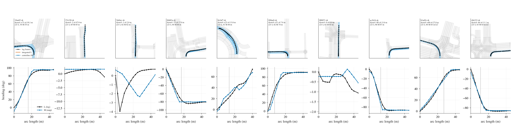
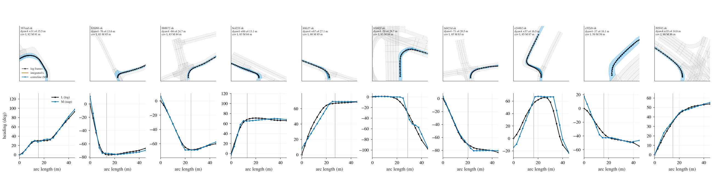
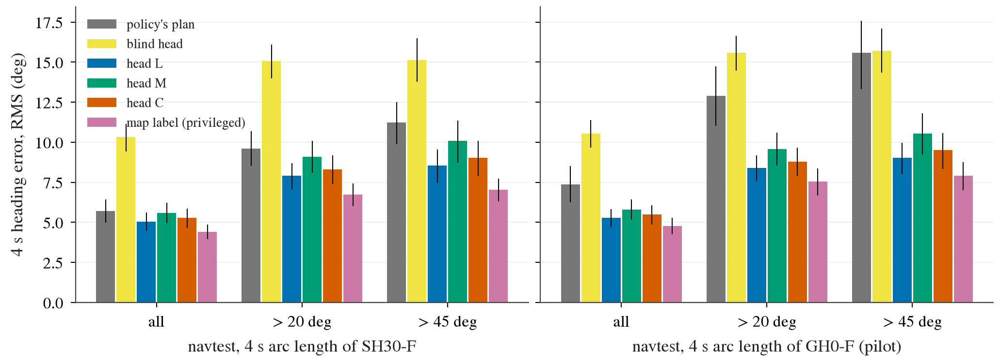
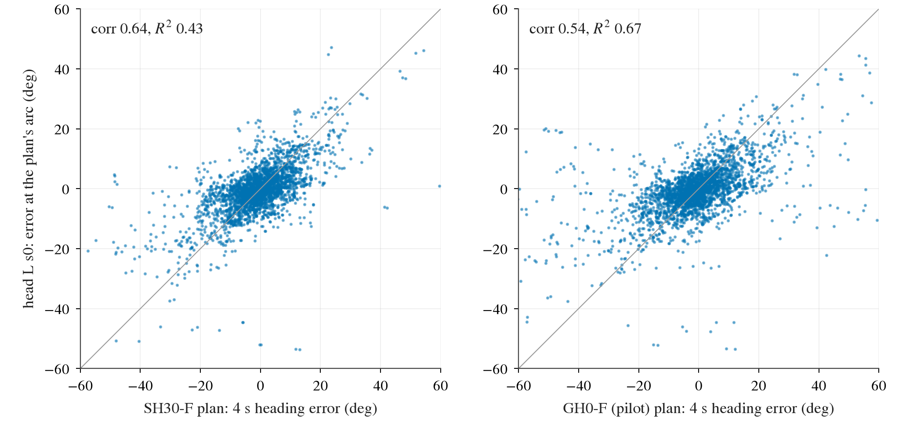
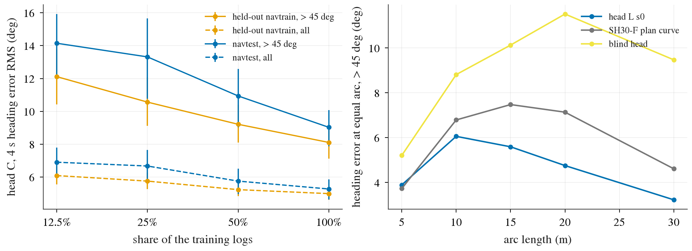

# HEAD1: a turn-description head on the frozen vision tokens (stage 1; stage 2 not run)

Written 2026-10-10, lane HEAD1, follow-up of CORR0 ([corr0.md](corr0.md), decision 240) and of decision 204's QH arm. Pre-registration:
[plans/2026-10-10-head1-prereg.md](../plans/2026-10-10-head1-prereg.md) (pushed before any head was read, commit `506a2fac`). Code:
`scripts/head1_labels.py`, `scripts/head1_train.py`, `scripts/head1_read.py`. Full tables: [head1/tables.md](head1/tables.md), every number
with its CI in `head1/reads.json`, the gate in `head1/gate.json`. Decision 243.

**The map, the logged future and the driven lane sequence are training labels and analysis references only.** The head reads the frozen Cinque
vision tokens (8 policy slots x 32 x 512, warp protocol) and the 20-dim ego input (it carries the command), nothing else. No WA-JEPA weights or
features, no encoder unfreezing, no closed loop.

## Answer

1. **Yes, a head on the frozen tokens gives the heading through the turn better than the policy's own plan.** On navtest > 45 deg tokens the
   head's profile, read at the plan's own 4 s arc length, is 8.54 deg RMS [7.47, 9.53] from the logged 4 s heading against 11.24 [9.87, 12.51]
   for SH30-F's own plan: **-2.70 [-3.57, -1.74]** (G1 met). The same structure without vision is at 15.13 (head - blind -6.59 [-7.66, -5.51],
   G2 met). The privileged map label at the same arc is 7.04 [6.30, 7.74]; the head does not reach it.
2. **Its error is partly a copy of the policy's.** corr(e_head, e_policy) is 0.53 [0.46, 0.59] against the pilot policy GH0-F and 0.67
   against SH30-F on all navtest tokens. The registered independence statistic (share of the policy's 4 s heading error variance a linear read
   of the head-plan disagreement explains) is **R2 = 0.513 [0.420, 0.586]** against the pilot policy; the line derived from decision 204 is
   0.538 (predicted pilot gain 0.93 x R2 = +0.48 against +0.5). **G3 is not met, in the registered "marginal" band** (>= +0.3, < +0.5).
3. **Stage 1 fails by the registered rule on independence, not on accuracy. Stage 2 (the memory-channel pilot) was not run.** The miss is
   0.025 in R2 with a CI that contains the line, and seed 1 of the same head is lower (0.447), so the point estimate is not a near-pass that a
   reseed would turn.
4. **Against the full-data policy the predicted gain is small.** The same statistic against SH30-F is 0.278 [0.205, 0.344] on all tokens
   (0.433 on > 45 deg): predicted +0.26. The head's edge is largest over the weak pilot policy (GH0-F 15.60 deg at > 45 deg) and shrinks as
   the policy gets better; a pilot pass would not have carried to SH30 without a better head.
5. **Label source: the logged path (L) wins; the map label (M) loses, the combined head (C) is in between.** Held-out navtrain, > 45 deg:
   L 7.93, C 8.11, M 9.26 (selection, navtest not used); navtest > 45 deg: L 8.54, C 9.03, M 10.07. The map label is itself a worse
   description of where the log's heading goes (7.04 deg against the log by construction), and a head trained on it inherits that offset on top
   of its own error (its fit to its own label is no better than L's: 10.1 against 9.5 deg over the grid).
6. **The head is label-limited, not information-limited, at this scale.** Learning curve (arm C, navtest > 45 deg): 14.14 / 13.31 / 10.94 /
   9.03 deg at 12.5 / 25 / 50 / 100 % of the training logs (105 / 209 / 417 / 834 logs), with no flattening; R2 against SH30-F on all tokens
   0.05 / 0.07 / 0.15 / 0.23. The full-data runs also had their best validation step at 7 500 to 8 000 of 8 000 steps.

## Setup

- **Labels** (heading relative to the ego heading at t0, on 22 arc lengths: 0 to 40 m in 2.5 m steps, then 45, 50, 60, 70, 80 m).
  L = logged rear-axle heading re-expressed against the logged path's own arc length (up to 30 s or 82 m of log; the time axis is gone, a stop
  does not change the label). M = centreline tangent of the lane sequence the log drove (CORR0's Viterbi match, the run the log is in at 4 s),
  against the centreline's arc length, valid up to the last matched logged pose. What each leaks at training time: L the path the driver took
  (shape, in-lane placement, lane changes); M the map, the localisation at t0 and the exit chosen at every fork inside the coverage. Neither
  is read at inference. Matching: navtrain 102 019 of 103 288 ok, navtest 12 023 of 12 146 (1 476 of 1 517 on > 45 deg), CORR0's counts.
- **Head.** BODY1 S0's scene memory (ego token + 256 vision tokens, 3 encoder layers, d 256), 22 arc-length queries through 2 decoder layers,
  two output channels (L, M); 3.4 M parameters. Arms: L, M (one channel in the loss), C (both), blind (C without vision). Huber loss (0.1 rad),
  8 000 steps x 256, sampling weight 1 + min(|4 s heading change|, 90) / 30. One fixed configuration, no tuning.
- **Folds.** Decision 191's log-level folds (`navsim/op-parity-cf5f{j}-{train,dev}`): the fold-0 head is fitted on the 834 + 89 (step
  selection) logs the fold policy `CF5f0-F-s0` was trained on; the fold's 245 dev logs (21 438 tokens) are held out of both. navtest (136 logs)
  is never fitted or selected on, and its head is the single fold-0 model.
- **Reads.** (H) held-out navtrain logs with `CF5f0-F-s0`; (T) navtest with `SH30-F-s0/s1` and the pilot `GH0-F-s0/s1` (token-seed pooled).
  Main quantity = decision 240's N3: the profile at the plan's own 4 s arc length minus the logged 4 s heading (the policy's own: plan 4 s yaw
  minus logged 4 s yaw). Buckets by |logged 4 s heading change|. Log-cluster bootstrap, B 10 000, 95 %.
- **Reproduction check before any head read.** On CORR0's matched tokens the stored plans give 5.65 / 5.59 deg (all) and 11.08 / 10.99
  (> 45 deg) for the two SH30 seeds: decision 240's 5.62 / 11.04. This lane reads all 12 146 tokens (11.24 at > 45 deg). The map label at
  the plan's arc gives 4.41 / 7.04 (decision 240: 4.51 / 7.25; this lane matches over a longer window and masks the centreline beyond the
  driven coverage).

What to look at: the label check made before navtrain-scale generation (10 navtrain tokens, then CORR0's 10 navtest tokens). Top: lane graph
(driven sequence in blue), logged frames (black), centreline (blue line). Bottom: the two labels against arc length (black L, blue M; grey line
= the logged 4 s arc length). L and M agree in shape; M has corners at connector joints and starts off zero when the ego is already inside the
turn (the log running inside the centreline, decision 240).

## Gate (navtest, head = arm L, fold 0, seed 0, selected on held-out navtrain)

| line | read | met |
|:--|:--|:--|
| G1 accuracy: RMS(head) - RMS(SH30-F plan), > 45 deg (1 517 tokens x 2 seeds), CI high < 0 | 8.54 [7.47, 9.53] vs 11.24 [9.87, 12.51]; **-2.70 [-3.57, -1.74]** | yes |
| G2 above the blind floor: RMS(head) - RMS(blind), same bucket, CI high < 0 | **-6.59 [-7.66, -5.51]** (blind 15.13) | yes |
| G3 independence: R2 >= 0.538 (0.93 x R2 >= +0.5), all tokens, pilot policy GH0-F | **R2 0.513 [0.420, 0.586]**, corr 0.53 [0.46, 0.59], predicted gain +0.48 | **no (marginal)** |

Rule behind G3 (prereg): decision 204's independent-noise arms gain 86 / 62 / 22 % of the oracle at noise-to-policy error ratios 0.39 / 0.79 /
1.57, and 1 / (1 + r^2) = 87 / 62 / 29 %; the same statistic computed for decision 204's thin head from its stored files is 0.084 (along-track),
which times the full oracle's +1.38 predicts +0.12 where QH measured +0.09 [-0.11, +0.28]. Gain = oracle gain x R2; the oracle for a shape-only signal is QS, +0.93.

## (a) (c) (d) Heading error at the plan's own 4 s arc length (deg RMS; navtest)

| policy | bucket | policy's plan | head L s0 | head - policy | blind | map label (privileged) | corr | R2 | 0.93 x R2 |
|:--|:--|:--|:--|:--|:--|:--|:--|:--|:--|
| SH30-F | all | 5.71 [4.98, 6.43] | **5.05 [4.46, 5.60]** | -0.65 [-1.03, -0.25] | 10.31 | 4.41 | 0.67 [0.63, 0.70] | 0.278 [0.205, 0.344] | +0.26 |
| SH30-F | > 20 | 9.59 [8.50, 10.69] | **7.91 [7.07, 8.71]** | -1.68 [-2.37, -0.97] | 15.07 | 6.73 | 0.66 [0.62, 0.69] | 0.351 [0.269, 0.426] | +0.33 |
| SH30-F | > 45 | 11.24 [9.87, 12.51] | **8.54 [7.47, 9.53]** | -2.70 [-3.57, -1.74] | 15.13 | 7.04 | 0.64 [0.60, 0.70] | 0.433 [0.343, 0.512] | +0.40 |
| GH0-F (pilot) | all | 7.38 [6.24, 8.50] | **5.27 [4.68, 5.82]** | -2.10 [-2.87, -1.32] | 10.55 | 4.78 | 0.53 [0.46, 0.59] | 0.513 [0.420, 0.586] | +0.48 |
| GH0-F (pilot) | > 20 | 12.90 [11.03, 14.74] | **8.41 [7.58, 9.20]** | -4.50 [-5.84, -3.07] | 15.58 | 7.54 | 0.53 [0.46, 0.60] | 0.584 [0.496, 0.649] | +0.54 |
| GH0-F (pilot) | > 45 | 15.60 [13.31, 17.57] | **9.02 [8.01, 9.98]** | -6.57 [-8.20, -4.75] | 15.72 | 7.91 | 0.54 [0.45, 0.61] | 0.666 [0.582, 0.730] | +0.62 |

n = 24 292 / 6 308 / 3 034 token-seeds in 136 / 108 / 101 logs (the map column on the matched tokens with coverage, 22 214 / 6 039 / 2 911 for SH30-F). corr = corr(e_head, e_policy); R2 = corr(e_policy, e_policy
- e_head)^2. Only the GH0-F "all" row is the registered G3 read; the bucket rows are descriptive.

Other arms and seeds, navtest (RMS at SH30-F's arc on > 45 deg / R2 against SH30-F on > 45 deg / R2 against GH0-F on all tokens, the G3 quantity): L s1 9.47 / 0.333 / 0.447;
C s0 9.03 / 0.375 / 0.473; C s1 9.70 / 0.311 / 0.440; M s0 10.07 / 0.271 / 0.427; M s1 10.53 / 0.221 / 0.390. No arm or seed reaches 0.538.
The seed spread of the L head (8.54 against 9.47) is about a third of its margin over the policy; both seeds keep a CI below zero
(-2.70 [-3.57, -1.74], -1.77 [-2.72, -0.78]).

Held-out navtrain (245 logs, 21 438 tokens, fold policy `CF5f0-F-s0`): > 45 deg policy 9.90 [8.86, 11.01], head L 7.93 [7.12, 8.81]
(-1.97 [-2.63, -1.29]), blind 13.47, map label 7.20, corr 0.60, R2 0.381; all tokens 5.31 against 4.93 (-0.38 [-0.63, -0.13]), R2 0.236.
The same picture as navtest against SH30-F.

**Where the head's error comes from.** The logged profile itself, read at the plan's arc instead of the log's, is already 5.26 deg off at
> 45 deg (SH30-F; 6.02 for GH0-F): that part is the policy's along-track (speed) error and is shared by construction. Read at the logged 4 s
arc length (privileged arc) the head is at 7.49 [6.37, 8.47] on > 45 deg and 4.11 on all tokens. The blind head's error correlates 0.66 with
SH30-F's on > 45 deg and explains nothing of it (R2 0.013): the shared part is not only the shared arc length, the vision head and the policy
also miss on the same tokens.

What to look at: on > 20 and > 45 deg the head on any label (blue L, green M, orange C) is below the policy's own plan (grey); on all tokens
the map-label head is level with SH30-F's plan. Every head is far below the blind head (yellow) and above the privileged map label (purple). Left: SH30-F's arc length; right: the pilot policy's. Bars: 95 % CI by log.

What to look at: head error against plan error on the same > 45 deg token-seeds. Points along the diagonal are errors the head copies; the
cloud is tighter around zero vertically than horizontally (the head is more accurate) but tilted (the errors are correlated).

## (a) Fixed arc lengths, equal arc (navtest > 45 deg, tokens the plan and the log both reach)

| arc m | n | head L s0 | SH30-F plan curve | head - plan | corr | R2 | blind |
|:--|:--|:--|:--|:--|:--|:--|:--|
| 5 | 3 032 | 3.89 [3.41, 4.37] | 3.73 [3.23, 4.20] | +0.16 [-0.16, +0.47] | 0.58 | 0.174 | 5.21 |
| 10 | 2 845 | 6.06 [5.34, 6.75] | 6.79 [5.88, 7.65] | -0.73 [-1.36, -0.07] | 0.61 | 0.292 | 8.81 |
| 15 | 2 082 | 5.59 [4.76, 6.32] | 7.48 [6.44, 8.55] | -1.88 [-2.88, -1.01] | 0.53 | 0.474 | 10.13 |
| 20 | 1 059 | 4.76 [4.16, 5.35] | 7.14 [5.77, 8.38] | -2.38 [-3.29, -1.32] | 0.57 | 0.560 | 11.51 |
| 30 | 177 | 3.23 [2.42, 4.01] | 4.61 [3.87, 5.31] | -1.38 [-2.07, -0.75] | 0.54 | 0.521 | 9.47 |

The head is not better in the first 5 m (the plan has the ego state there) and pulls ahead from 10 m on: its advantage is the far part of
the turn, where the turn ends and what heading it leaves on. Against the pilot policy the differences are -0.82 / -3.57 / -4.43 / -3.88 /
-1.80 deg with R2 0.40 to 0.70. Rows are conditional on the plan reaching the arc, so the far rows are the faster tokens.

What to look at: left, the learning curve has not flattened at 834 logs (solid: > 45 deg, dashed: all tokens; orange held-out navtrain, blue
navtest). Right, at equal arc length the head (blue) and the plan curve (grey) coincide at 5 m and separate beyond 10 m; yellow is the blind head.

## (b) Turn-in point (shift along the arc of the heading profile against the logged profile, late +)

| set, policy | tokens | n | head median / mean | policy median / mean | mean abs: head | policy | head - policy | corr of the shifts |
|:--|:--|:--|:--|:--|:--|:--|:--|:--|
| navtest, SH30-F | > 45 | 3 032 | +0.10 / +0.12 [+0.03, +0.21] | +0.40 / +0.46 [+0.36, +0.54] | 0.78 | 0.90 | -0.11 [-0.19, -0.03] | 0.49 |
| navtest, SH30-F | cannot-make-the-turn, > 45 | 75 | +0.90 / +1.22 [+0.79, +1.65] | +1.50 / +1.66 [+1.36, +1.98] | 1.30 | 1.66 | -0.36 [-0.67, -0.02] | 0.48 |
| navtest, GH0-F | > 45 | 3 027 | +0.10 / +0.12 | +0.50 / +0.71 [+0.57, +0.83] | 0.78 | 1.12 | -0.33 [-0.44, -0.22] | 0.37 |
| held-out navtrain, CF5f0 | > 45 | 2 240 | +0.00 / +0.10 [+0.03, +0.17] | +0.30 / +0.37 [+0.29, +0.46] | 0.70 | 0.82 | -0.12 [-0.17, -0.06] | 0.51 |

The head has almost no systematic lateness (+0.1 m) where the policies turn in 0.4 to 0.5 m late, but its unsigned turn-in error is only
0.11 m smaller than SH30-F's. On SH30-F's cannot-make-the-turn tokens the head is late too (median +0.90 m against +1.50 m): it shares
most of that failure. The shift here is fitted in heading on a 2.5 m grid, not decision 240's position fit; decision 240's +0.55 m median
on the same failure class is not this number (this fit gives the policy +1.50 m on 75 token-seeds in 26 logs).

## (e) Learning curve (arm C, L channel; fold 0)

| share of the training logs | logs | held-out navtrain > 45 | navtest > 45 | navtest all | R2 vs SH30-F, navtest all |
|:--|:--|:--|:--|:--|:--|
| 12.5 % | 105 | 12.11 [10.42, 13.81] | 14.14 [12.11, 15.92] | 6.91 | 0.052 |
| 25 % | 209 | 10.56 [9.12, 12.08] | 13.31 [10.76, 15.66] | 6.67 | 0.074 |
| 50 % | 417 | 9.21 [8.11, 10.39] | 10.94 [9.04, 12.59] | 5.76 | 0.151 |
| 100 % | 834 | 8.11 [7.13, 9.20] | 9.03 [7.87, 10.07] | 5.28 | 0.228 |

At a quarter of the logs the head is worse than SH30-F's own plan (13.31 against 11.24); it crosses between 25 and 50 %. The last two doublings take
2.4 and 1.9 deg off the navtest > 45 deg error (1.4 and 1.1 deg on held-out navtrain; the first doubling 0.8 and 1.6).

## Reading

1. Decision 204's negative on "re-predict from the same frozen features" does not extend to this label form. QH's thin head was worse than
   the policy (heading 7.46 against 7.38 deg on all tokens, R2 0.12 to 0.19); this head, on the same tokens, is 2.1 deg better than the same
   pilot policy and explains half of its heading error. What changed: the target (heading against arc length instead of 8 timed poses), the 834
   logs of a navtrain fold instead of three shards' worth, attention over all 8 slots instead of an MLP on 2. This lane did not separate the three.
2. The failing line is independence, and it is a matter of degree. The head's error variance is about half of the pilot policy's and
   correlated 0.53 with it; a head that kept the correlation and reached the map label's accuracy (4.78 deg on all tokens) would sit near
   R2 0.6. The learning curve says more labelled logs move it in that direction; nothing here says the frozen tokens lack the information.
3. The map label is not the better teacher. Decision 240 found that the map centreline carries the 4 s heading better than SH30's plan; that
   holds here too (7.04 against 11.24), but as a training label it loses to the logged path on every read, because the quantity scored is the
   log's heading and the centreline is offset from it. The useful privileged reference is the logged profile at the plan's arc (5.26 deg).
4. For the full-data policy the head as trained is worth little by the registered conversion (+0.26). A stage-2 pilot would measure the gain
   over the weak pilot policy; whether it carries to SH30 depends on the head getting better faster than the policy does.

## Limits

- One head structure, one hyper-parameter set, 2 seeds per arm; the gate reads one fold-0 model. Seed 1 of the L head is 0.9 deg worse on
  navtest > 45 deg and 0.07 lower in R2; on held-out navtrain the two seeds are equal (7.93 / 7.94). Training was not run to convergence.
- G3's conversion (gain = 0.93 x R2) is a linear rule fitted to two kinds of calibration points of decision 204 (independent noise, QH). It
  was not tested by a pilot here. The gate statistic is a point estimate whose CI contains the line.
- The main quantity is read at the plan's own arc length, so the head's error contains the policy's along-track error; the logged-arc and
  equal-arc rows separate it.
- L counts another legal lane or placement as error (as decision 207); 1 to 2 % of tokens have no map label (2.7 % on > 45 deg navtest).
- The policy on held-out navtrain is one fold model; on navtest SH30-F and GH0-F have 2 seeds each.
- The turn-in read is a heading-profile shift on a 2.5 m grid; the cannot-make-the-turn row has 75 token-seeds in 26 logs.
- Open loop, non-reactive data; nothing was fed to a policy.

## Not done

Stage 2 (memory-channel pilot, shuffled control, masked-memory check): not run, by the registered gate. Folds 1 to 4 of the head (needed only
for stage 2): not trained. No LoRA / unfrozen arm (out of scope). No run with more labelled logs or longer training. No closed loop.

## Cost

GPU: 10 head trainings (9 x about 6.8 min with 31.5 GB on the card, blind 2.3 min) and two smokes: 1.1 card-hours summed over jobs, two jobs
per card through the pool, alongside lane S-DROP. CPU: labels 2 x 10 s on the box's cores, plan features and reads under a minute each.
