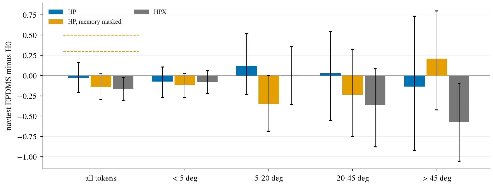
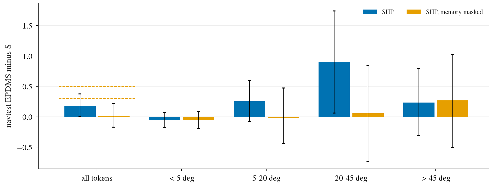

# HEAD1b: the heading head trained to convergence and fed to the policy three ways (exploratory)

2026-10-10, lane HEAD1b, decision 245. **Exploratory**: stage 1 of HEAD1 missed its registered gate G3 (decision 243); the user chose
to go on past the gate. The lines below were written into the plan's amendments before any training or read
([plans/2026-10-10-head1-prereg.md](../plans/2026-10-10-head1-prereg.md), from "补记 2026-10-10（HEAD1b）"), but nothing here is a
registered read. Pilot scale (3 000 steps), 2 seeds per arm, open loop, no unfrozen encoder, no privileged input at inference.

Tables (every number below is from them): [head1b/a_tables.md](head1b/a_tables.md), [a2_tables.md](head1b/a2_tables.md),
[b_tables.md](head1b/b_tables.md), [b2_tables.md](head1b/b2_tables.md), [c_tables.md](head1b/c_tables.md), the matching `*_reads.json`,
`head1b/ident.json` (identity check), `tok_qp.json` (tokenizer), `c_offtrack_profile_quality.json`.

## What was run

| Step | What | Baseline |
|:--|:--|:--|
| A | the stage-1 head (arm L) trained to convergence: 5 candidates chosen on 89 validation logs, `rt24` + two-seed mean, 5 folds | stage-1 head |
| A2 | heads only: target form (heading curve L / 8 timed poses P) x structure (full / thin), against decision 204's QH head | |
| B | the head's curve fed through the memory channel of the SH30 pilot (HP); shuffled control (HPX); memory masked at test | H0 = `GH0-F-s0/s1`, 88.48 |
| B2 | the heading curve as an auxiliary loss on the policy's hidden state, lambda 10 (HA); nothing fed at inference | H0 |
| C | B's memory on the `P2H10S` pilot recipe, off-track rows included (SHP) | `P2H10S-P-s0/s1`, 88.16 |

## Result

navtest, 12 146 tokens, per-token two-seed means, paired bootstrap over logs. Heading error = RMS of the plan's 4 s heading minus the
logged one. Lines (decision 204's convention): >= +0.5 with the lower bound above 0 = positive; < +0.3 = negative, for a memory arm
only if the channel is read, otherwise "ceiling not measured".

| Arm | EPDMS - baseline | plan heading error at > 45 deg (deg) | cannot make the turn (pp) | cut inside (pp) | DAC failures at > 45 deg (pp) | verdict by the line |
|:--|:--|:--|:--|:--|:--|:--|
| B: HP | -0.03 [-0.21, +0.16] | 15.60 -> 12.40, **-3.19 [-4.06, -2.35]** | **-1.09 [-1.82, -0.36]** | +0.66 [+0.24, +1.06] | -0.03 [-0.72, +0.62] | ceiling not measured |
| B: HPX (control) | -0.16 [-0.30, -0.02] | 15.60 -> 16.55, +0.95 [+0.55, +1.36] | +0.00 [-0.35, +0.40] | +0.13 [-0.25, +0.55] | +0.26 [-0.26, +0.84] | |
| B2: HA | +0.04 [-0.04, +0.12] | 15.60 -> 14.39, -1.21 [-1.71, -0.73] | +0.00 [-0.26, +0.25] | -0.13 [-0.53, +0.18] | -0.13 [-0.66, +0.32] | negative |
| C: SHP | +0.18 [-0.00, +0.38] | 13.47 -> 11.80, -1.67 [-2.25, -1.18] | -0.49 [-1.24, +0.19] | -0.10 [-0.61, +0.36] | -0.10 [-0.74, +0.53] | negative |

What to read: every carrier lowers the plan's heading error on sharp turns, none lowers the off-road rate there, and the score stays
within 0.2 of the baseline.

- **A.** The converged head is no better than stage 1 on navtest: 8.83 deg [7.37, 10.35] at > 45 deg against 8.54 (difference +0.30
  [-0.46, +1.09]; SH30-F's plan 11.24), gate statistic R2 0.524 [0.439, 0.600] against the line 0.538 (stage 1: 0.513). It is better on
  held-out navtrain (4.63 against 4.93 deg on all tokens). The two members of the final head read 9.27 and 8.98 deg alone: stage 1's
  seed-0 model was a favourable draw on navtest turns.
- **A2.** navtest > 45 deg, two-seed means: L-full 9.00, L-thin 13.43, P-full 10.86, P-thin 14.89, QH as stored 16.58 deg. Structure is
  the largest factor (full - thin: -4.43 / -4.03 deg), then target form (L - P: -1.85 / -1.46) and label quantity (-1.69).
- **B.** The registered channel-read rule is not met (dev mismatched / own ADE 1.09 and 1.04 against 1.05; HP - HPX +0.14 [-0.03,
  +0.31]), hence "ceiling not measured" and not "negative". The plan does follow the fed curve: its heading error falls on every
  bucket while the shuffled control gets worse, fewer plans fail to make the turn and more cut inside. The DAC failure rate does not move.
- **B2.** Lambda chosen on held-out train logs at the upper edge of the grid (10); the auxiliary gradient is 1 to 5 % of the rest of the
  loss. The result holds for this dose only.
- **C.** The channel is read (dev mismatched / own ADE 1.06 and 1.09). The gain sits in the 20 to 45 deg bucket (+0.90 [+0.06, +1.74]);
  masking the memory takes it away (-0.17 [-0.41, +0.09]). The outward shift of `P2H10S` is partly pulled back: W2 99 / 120 against
  141 / 150, lateral at 4 s -0.117 m [-0.158, -0.079] (bench plans on warp frames). On `bd4` off-track rows the fed curve is worse than
  on the on-log twin (8.30 against 5.47 deg).
- **The R2 conversion of decision 243 fails its first direct test.** Predicted +0.49 for the fed profile (+0.48 from stage 1), measured
  -0.03 [-0.21, +0.16].

Consequence: the 4 s heading error is not a usable gate or proxy for turn work; read the DAC failure rate and the turn-failure classes.

## Figures

Step B, navtest EPDMS minus H0 by logged 4 s heading change; blue = HP, yellow = HP with the memory masked at test, grey = the shuffled
control HPX; dashed lines = the +0.3 and +0.5 lines; bars = 95 % CI. What to look at: HP sits on 0 in every bucket and far below the
lines; only the shuffled control separates from 0, downwards on sharp turns.

Step C, navtest EPDMS minus the `P2H10S` pilot; blue = SHP, yellow = SHP with the memory masked. What to look at: the gain is in the
20 to 45 deg bucket and disappears when the memory is masked; over all tokens the bar stays under the +0.3 line.

Also in `figs/`: `h1b_val_curves.png` (step A validation curves), `h1b_a2_grid.png` (step A2).

## Limits

Exploratory second attempt after a missed gate; pilot scale, 2 seeds, open loop; navtest read several times by this lane; B's verdict
is "ceiling not measured" and the statement that the plan uses the channel is outside the registered rule; one dose in B2; the
turn-failure rows have 1 517 tokens. The identity check of the masked-memory model missed its 1 mm line (3.2 / 5.5 cm) and holds in the
amended form (fp16 rounding; `head1b/ident.json`).
