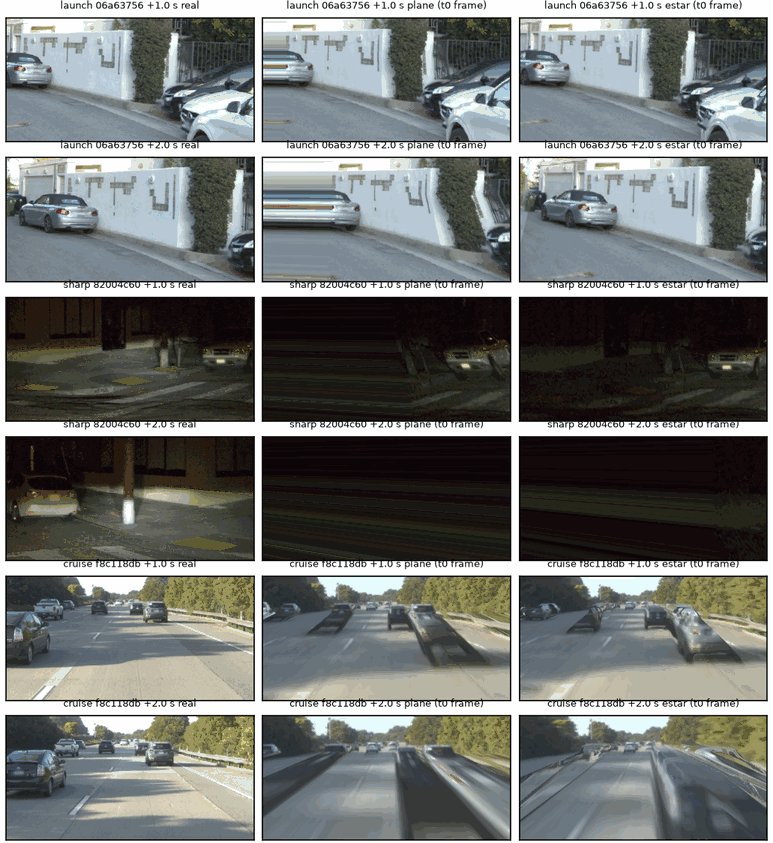

# factor_wm gate G0：结论（2026-10-05，未训练）

预登记 [../plans/2026-10-05-stage1-prereg.md](../plans/2026-10-05-stage1-prereg.md) §3 与 §3.1（修订写在任何 G0 数字之前；stall 更正写在 2 个片段的冒烟之后、
全量之前，已披露）。生成的原始读数 [g0.md](g0.md) / [g0.json](g0.json)（`scripts/fw_report.py`）。数据：WOD-E2E val（`wod/val`，从未训练），shipped Cinque，单次确定性运行。

## 判定

| 线 | 结果 | 判 |
|:--|:--|:--|
| G0a 起步：E\* ≤ 0.7 × plane | 3.02° 对 3.05°，比 0.99 [0.78, 1.07]（n 24） | **不过** |
| G0a 急弯：E\* ≤ 0.7 × plane | 8.92° 对 10.50°，比 0.85 [0.67, 0.99]（n 20） | **不过** |
| G0a 巡航：E\* ≤ plane + 0.1° | 0.15° 对 0.14°（n 24） | 过 |
| G0b：扰动臂任一失败 ≥ 15%，且 ≥ 2 类各 ≥ 5% | 0.52（stall 0.17、heading 0.17、lane 0.18；n 362） | **过** |

读法：G0a 的数是每个 anchor 步 1–10 的 |Δφ1|（1 s 计划方向误差，°）均值的组中位，构造同第 123 条（t0 帧重投影到之后的日志位姿）。

1. **G0a 不过：深度重投影和广角补边不值得进引擎。** 起步组深度对 plane 完全没改善。下图里深度确实把起步时近处车辆的几何画对了，plane 把它们拖成条带，可计划误差不动。
   所以起步时的计划误差不来自几何：这个构造里世界被冻在 t0，模型读的是别的东西，最可能是他车不动和帧间运动线索。急弯组广角补边有 15% 的改善（CI 上界 0.99），
   但离 0.7 线远。转弯超过约 15° 之后，两个引擎都越出了源相机视野（图第 3–4 行），只有更宽的源（WOD 侧前相机）或生成式补全能救。
2. **G0b 过：shipped 在真实日志引擎里有可训的自车失败，而且三类都有。** 按类：起步 80 条里 stall 57 条；弯 122 条里 heading 61、lane 35；巡航 160 条里 lane 30，另有 44 条只是超前出有效域。
   不加扰动的 free 臂失败率也有 0.57（起步 stall 27/40，弯 heading 24/40）。plane 与 E\* 两个引擎的失败率几乎相同（0.52 对 0.52）：G0b 不取决于渲染引擎。
3. **失败是模型自己的性质，不是引擎造出来的**（描述性核查，真实日志帧，不经任何重投影）：
   - 起步：模型在 t0 的加速度中位 −0.09 m/s²，83% < 0.3；前 2 s 均值 0.27，日志车 0.94（n 24）。在真实画面上它就不肯起步，与 HUGSIM 卡死同向（第 138 条，op_parity P2 7/10）。
   - 急弯：action 曲率对日志曲率的最小二乘增益中位 0.63（IQR 0.48–0.74，n 20），与第 120 条约 0.5 同量级。在真实画面上它就欠转。
   - 限定：heading / lane 失败离开 op_dagger 有效域（|dψ| 5°、|dy| 1 m）的时刻中位 1.8 s，失败事件中位 3.2 s。中间约 1.4 s 落在 G0a 显示引擎保真度差的区间（急弯 step1 误差 7–8°）。
     失败的起因在有效域内就出现了，失败的程度有一部分是引擎外推的结果。
   - stall 更正把 24 个「停着的车被日志转弯甩开」的 heading / lane 事件改记为 stall，规则与理由见预登记 §3.1。

图：三组代表 anchor（各组 plane 误差最接近中位的片段），每组 +1.0 / +2.0 s，左列真实日志帧，中列 plane、右列 E\*，都由 t0 帧重投影。看起步行：E\* 把近处车画对、plane 拖成条带，但两者计划误差相同。看急弯 +2.0 s：两者都已越出源视野。

## 对第 1 阶段的含义

- 引擎定为 **plane + 时间同步源帧 + 纵向闭环（SPEC OpLongitudinal）+ 8 s**。深度和广角补边按 G0a 不采用，S3−depth 消融取消。plane 每帧约 10 ms，深度 warp 约 120 ms，
  采集也因此便宜一个量级。
- 第 1 节「新在哪」的 (a)（纵向闭环让起步可训）有了前提：起步 stall 是 shipped 在真实画面上的性质，在引擎里能复现（57/80）。原写的「深度 / 多相机重投影」一条去掉。
- 转弯是弱点：失败可复现（heading 61/122），但急弯越出源视野后的帧保真度差。训练前要定：转弯状态是否只在有效域内收标签（|dψ| ≤ 5°，与 op_dagger 一致），
  还是加 WOD 侧前相机作源。

## 到 G1 的成本（实测换算）

G0 实耗：GPU 约 0.4 GPU·h（深度 7 min；rollout 3 个分片各约 4 min，每卡 18 核约 1.9 rollout·s⁻¹·40 步）。墙钟约 1.5 h，主要是 CPU 配额（75 核，与其他 lane 共用）排队约 20 min。预登记估的 4 GPU·h 是高估。

| 步骤 | 量 | GPU·h |
|:--|:--|--:|
| 训练片段（WOD-E2E train 约 2 000 段 × 50 帧）渲染 | CPU，分钟级 | 0 |
| S3 采集 3 轮（每轮 2 000 段 × 约 6 臂 × 40 步，plane） | 每轮约 1 | 3 |
| S2 采集 3 轮（第 132 条引擎，2 s） | 每轮约 0.2 | 0.6 |
| 训练 S1 / S2 / S3（各 2 400 步，2 it/s） | 每臂约 0.35 | 1 |
| G1 读数：HUGSIM 24 场景 × 4 臂（spec） | 每臂约 0.8 场景·h | 3.3 |
| G1 读数：NAVSIM navtest + navhard × 4 臂 | 计划在缓存上分钟级，打分 CPU | 0.5 |
| 合计 | | **约 8–9** |

墙钟估 6–8 h：瓶颈是 CPU 配额，不是 GPU（rollout 的 warp 在 CPU 上）。3 张卡并行时，采集每轮约 20–30 min。
