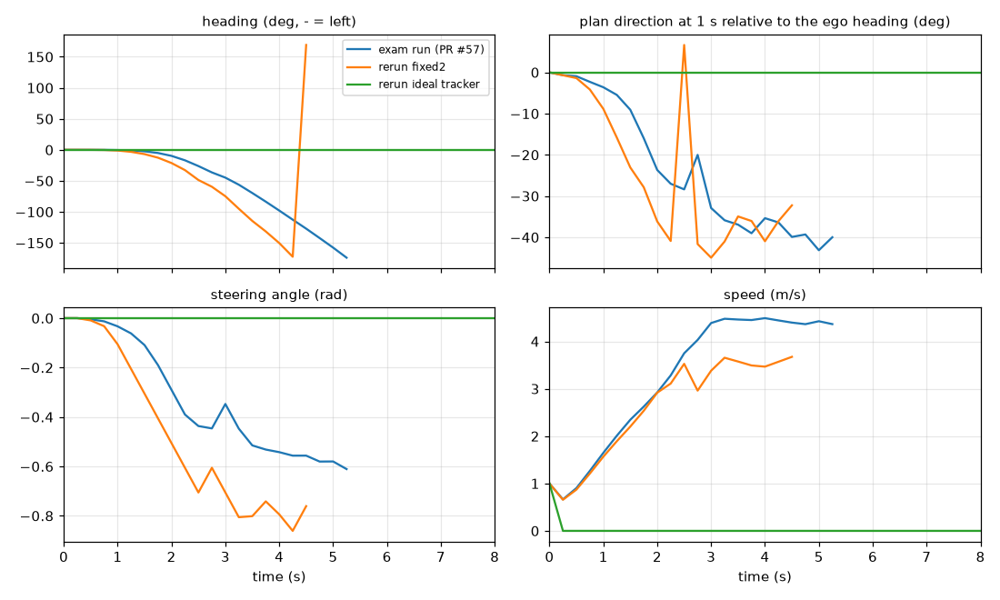
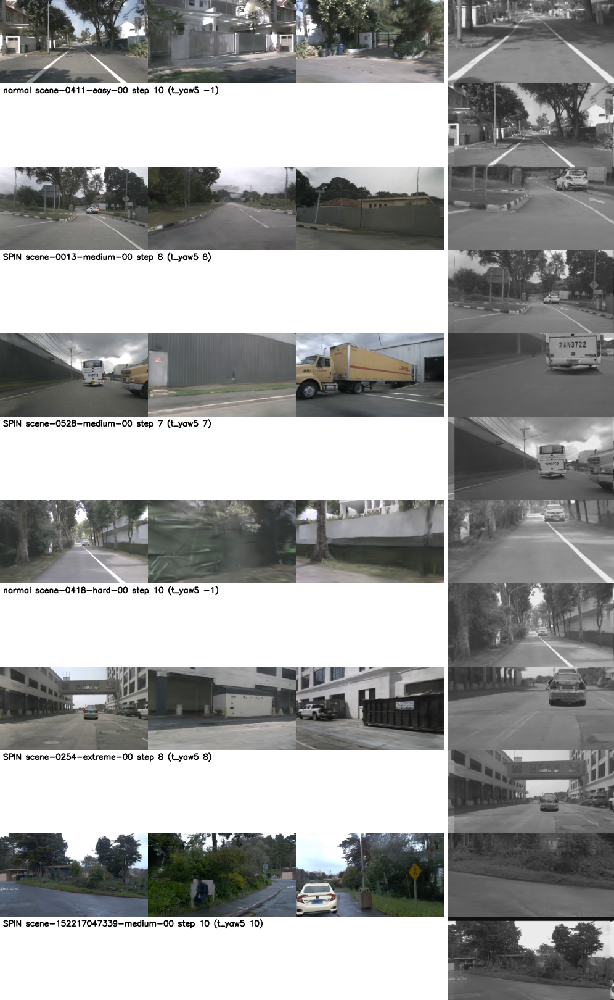

# HUGSIM: why the car still spins after the controller fix

Written 2026-10-03. Tags: **[V]** verified (file:line, log, or a run named here), **[I]** inferred. Generated tables are
in [spin/tables.md](spin/tables.md); per-episode data in [spin/spin_episodes.csv](spin/spin_episodes.csv); code in
`experiments/hugsim/scripts/spin_*`. Question 2 (is the oncoming-vehicle scenario passable) is in
[attack_passability.md](attack_passability.md) and
[../../vlm_arb/results/opposite_vehicle_passability.md](../../vlm_arb/results/opposite_vehicle_passability.md).

## Answer

| | finding | evidence |
|---|---|---|
| 1 | Spinning has two different causes. Under the **official** controller it is the controller's transposed heading: 52 / 64 Cinque runs and 50 / 64 Lebowski runs spin, and 45 and 43 of them do not spin on the same scenario under PR #57. | T1, T2 |
| 2 | Under the **PR #57** controller 10 / 64 Cinque and 11 / 64 Lebowski runs still spin (17-18 % of their failures; the rest are actor collisions and standing still). The **plan itself turns** (model), the controller only tracks it. | T3, T5, case 03 |
| 3 | The controller is not the cause of the PR #57 spins: on the logged states, near-straight plans produce > 3 deg of yaw in 0.2 % of steps (5 / 2011); fixed2 follows the plan slightly *more* than PR #57; closed-loop reruns under fixed2 still spin in 5 / 6 scenarios. | T5, rerun table |
| 4 | Not a camera / rig-conversion error: the wide input's side-camera pixels are 4-5 % of the frame and removing them changes the plan by <= 0.3 deg; +-2 / +-4 deg of input yaw shift it by 1.5-3 deg while the spinning plans lean 6-13 deg; spin counts are flat across the four datasets (2-4 of 16 each). | input replay, T4 |
| 5 | The trigger is the launch at 1-3 m/s: 19 of 21 PR #57 spins diverge below 3 m/s, and a privileged launch assist (route follower for the first 5 s, up to 5 m/s, then the model) removes 5 of 6 spins and lets case 03 complete (HD 0.857). | rerun table |
| 6 | Leading public entries do **not** do anything at this interface that we lack. None smooths, resamples, clamps speed or shifts the origin; the only controller-side differences are the PR #57 heading fix (WA-JEPA, DrivoR) and 0.25 s resampling (garage fork), both of which we have as `fixed` / `fixed2`. We add more processing than any of them. | entries table |

## 1. Which score on the page came from which controller

| page number | agent | controller actually run | tree / patch | scenarios | source |
|---|---|---|---|---|---|
| HD 0.033 (headline "official") | openpilot Cinque | official: upstream `traj2control` at 62c690d, transposed heading | `HUGSIM-zs/official` = `patches/hugsim/*.patch` only | 64 sampled | `hugsim-exam/scored_op.csv` tag `cinque-official` [V] |
| HD 0.278 (headline "PR#57") | openpilot Cinque | PR #57 heading fix, iLQR still 0.5 s | `HUGSIM-zs/fixed` = official + `optional/lqr-heading-fix.patch` | same 64 | tag `cinque-fixed` [V] |
| Lebowski 0.036 / 0.251, LTF 0.250 / 0.279, cv 0.039 / 0.292 | | official / PR #57 as above | | same 64 | `scored_op.csv`, `scored_base.csv` [V] |
| fixed2 "passes acceptance" | no model: the scene's logged trajectory as plan | fixed2 = PR #57 + `optional/lqr-tracker-v2.patch` (0.25 s reference, 0.25 s iLQR, steering-rate cost 1) | `HUGSIM-zs/fixed2` | 12 held-out scenes | `infra-accept/hugsim-val`, docs/hugsim.md "Controller acceptance" [V] |
| any model score under fixed2 | none in the exam. First model runs under fixed2 are the six reruns below. | | | 6 | `spin/rerun_closed_loop.csv` [V] |
| "top" 0.299 UniAD | UniAD | not stated; repo history says the Dec 2024 `arctan` controller [I] | | all | HUGSIM paper Table 13 [V]; controller [I] |
| "top" 0.4462 WA-JEPA | WA-JEPA | PR #57-equivalent patch applied in-process, 0.5 s iLQR | | 436 | `WA-JEPA close_loop/run_fixed_controller.py:77-92` at bec2966 [V] |

So the case-03 run on the page (22 steps, HD 0.055) is `cinque-fixed`: the heading-fixed controller, not fixed2. The page caption
"not attributed, not rerun under fixed2" is now answered: it was rerun under fixed2 and spins the same way (rerun table).

## 2. The chain from model to executed motion (ours, step by step)

| stage | what happens | where |
|---|---|---|
| frame | HUGSIM renders 6 cameras at 800x450 every 0.25 s; the ego pose **is** the front-camera pose, the kinematic bicycle (L = 2.7 m) pivots at that point; no rear-axle frame | `hug_sim.py:215-219, 282-289` at 62c690d [V] |
| model input | road and wide frames (512x256) are warped from CAM_FRONT (+ FRONT_LEFT / FRONT_RIGHT for the wide edges) to openpilot's virtual cameras (road f = 910, 31 deg; wide f = 455, 59 deg), calibration rpy = 0, one 4 Hz frame per 0.2 s context step, 4 model steps per sim step, 100 on the first | `jevdrive/hugsim_zs.py:188-219`, `zs_agent.py:116-128`, `camgeom.py:35-37` [V] |
| clock | model clock runs 1.25x fast; speed input = ego speed x 1.25; plan read at model time t / 1.25 | `zs_agent.py:123-128`, `hugsim_zs.py:266-272` [V] |
| model output | 33 points at t_i = 10 (i/32)^2 s in the calib frame at the camera (x forward, y right) | `jevdrive/openpilot/model.py` decode [V] |
| plan sent | 6 points at 0.5 s (3 s) by interpolation, as (x right, y forward), origin at the camera (no shift); then `forward_only` (zero backward segments) and `straight_stop` (a plan ending < 1 m from the ego is sent straight) | `hugsim_zs.py:221-272`, `zs_agent.py:160-170` [V] |
| HUGSIM controller | `traj2control`: reference rows (forward, right, heading, 0, 0), heading per row from consecutive points and folded into +-90 deg; nuPlan iLQR with state cost [1, 1, 10, 0, 0] (heading weighs 10x position, no speed reference), accel +-3 m/s^2, steering rate +-0.4 rad/s, steer +-60 deg, discretization 0.5 s; **only the first input** is applied for 0.25 s; plant has no clipping | `sim_utils.py:53-71`, `lqr.py:4-20`, `hug_sim.py:282-289` [V] |
| official vs PR #57 | official heading = `arctan2(d_forward, d_right)`, a plan straight ahead gets a +90 deg reference; PR #57 swaps the unpacking (`for i, (b, a) in ...`) = `arctan2(d_right, d_forward)` | `patches/hugsim/optional/lqr-heading-fix.patch` [V] |
| fixed2 | PR #57 + plan resampled to 0.25 s, iLQR discretization 0.25 s, steering-rate input cost 10 -> 1, no 50 ms cap | `patches/hugsim/optional/lqr-tracker-v2.patch` [V] |
| rate | observation, plan, control all 4 Hz; 400 steps max | `closed_loop.py:58-69`, `kinematic.yaml` dt 0.25 [V] |

Two properties matter below. (a) The iLQR reference carries no speed, so the vehicle's speed follows from waypoint spacing and the
3 m/s^2 bound; the plan's direction dominates what the steering does. (b) A zero-length plan (the model's first output, a stop) has
no direction: under the official controller `straight_stop`'s plan `[0, 0.004]` gets heading `arctan2(0.004, 0)` = +90 deg, so the
car is steered hard right at step 0 (steer 0.1 rad after one step in the 0051 run); under PR #57 the same plan gives heading 0 and
steer stays 0.000 [V, `zs_steps.jsonl` of `cinque-official` and `cinque-fixed`, scene-0051].

## 3. What the leading entries and shipped baselines do at this interface

Full table with file:line at pinned commits: [spin/entries_code_audit.md](spin/entries_code_audit.md) (13 rows, every cell tagged V / I).
Condensed, with ours in the last row:

| entry | plan emitted -> sent | smoothing / resampling | heading controller | speed handling | replan | fallback | cameras |
|---|---|---|---|---|---|---|---|
| HUGSIM UniAD_SIM @5fb279e | `sdc_traj` as is, 6 x 0.5 s | none | upstream (transposed) | none | 4 Hz | crashes on `None` | 6, plain resize to 1600x900 |
| HUGSIM VAD_SIM @0c74967 | cumsum of deltas, 6 x 0.5 s | none | upstream | none | 4 Hz | crashes on `None` | 6, plain resize |
| HUGSIM LTF client (hyzhou404/NAVSIM @ca0ca7e) | `[y, x]`, flip x, 8 x 0.5 s, no rear-axle shift | none | upstream | velocity rotated by steering angle | 4 Hz | send `None` | 3 stitched into 1024x256 (side pixels in the front input); command hard-coded "straight" |
| WA-JEPA @bec2966 (0.4462) | `(-y, x)`, 8 x 0.5 s | none | in-process PR #57-equivalent, `run_fixed_controller.py:77-92` | none | 4 Hz, history stride 2 | all-zero plan (brake), counted | 4 separate views 512x256, no calibration |
| DrivoR (345 scenarios) | client not public | - | PR #57 head `a998d63` | - | 4 Hz | - | - |
| garage fork (TOAD era, `f54c53e`) | clients not public | reference resampled to 0.25 s (`sim_utils.py:71-82`) | fixed + iLQR at 0.25 s | - | 4 Hz | - | - |
| **ours (Cinque / Lebowski)** | camera-origin plan, 6 x 0.5 s from a 33-point model plan, clock / 1.25 | `forward_only`, `straight_stop` | official (scored), PR #57 (scored), fixed2 (rerun) | speed x 1.25 into the model | 4 Hz | none needed (stop plan) | road + wide virtual cameras from CAM_FRONT (+ 4 % side edge pixels) |

Differences from what we do [V from the audit; effect statements I]:
- **Nobody with public code smooths, resamples, clamps or shifts the plan on the client side.** All trajectory-side fixes live in the simulator (PR #57 heading; garage 0.25 s resampling). We have both as `fixed` / `fixed2`, so the controller is not where we fall short.
- Nobody handles camera yaw / pitch / height / FOV for image models; all plain-resize. We do a rotation-only reprojection, which is more than they do.
- Fallback: only WA-JEPA has one (zero plan); nobody has a low-speed or stuck heuristic. We have `forward_only` / `straight_stop`, also unique.
- Every entry replans at 4 Hz and applies the first iLQR input only, as we do.
- What leading entries have that we do not is the **model**: image-conditioned planners trained for multi-camera, nuScenes-style views, receiving the route command (UniAD, VAD, WA-JEPA) and ego state; openpilot is image-only with no route input beyond desire and was never trained below engagement speed [I].
- Controller versions are not comparable across entries (four variants in circulation, no paper names its commit); Table 13's UniAD number most likely used the Dec 2024 `arctan` controller [I].

## 4. Diagnosis of the spinning

Definition: **spin** = heading error against the nearest recorded route pose reaches 60 deg at some step (sensitivity at 45 and 90 deg in T1).
All 512 scored runs are analysed (8 configurations x 64) from `infos.pkl` (executed pose), `zs_steps.jsonl` (openpilot plans as sent) and `data.pkl`
(LTF / cv plans) [V, `spin_analysis.py`]. Plan direction `phi` is the angle of the plan point at 1 s against the ego heading; `des` is the angle of the route point ~5 m ahead.

### T1 spin-outs by agent and controller

| agent | controller | complete | failed | spin >= 60 deg | of failed | spin >= 90 deg | spin >= 45 deg | left / right | share of failures that are spins |
|---|---|---|---|---|---|---|---|---|---|
| cinque | official | 0 | 64 | 52 | 52 | 40 | 58 | 3 / 49 | 81% |
| cinque | PR #57 | 10 | 54 | 10 | 9 | 8 | 10 | 10 / 0 | 17% |
| lebowski | official | 0 | 64 | 50 | 50 | 40 | 59 | 1 / 49 | 78% |
| lebowski | PR #57 | 8 | 56 | 11 | 10 | 8 | 11 | 8 / 3 | 18% |
| cv (straight, 1 m/s) | official | 0 | 64 | 55 | 55 | 48 | 60 | 0 / 55 | 86% |
| cv | PR #57 | 3 | 61 | 0 | 0 | 0 | 2 | - | 0% |
| ltf | official | 12 | 52 | 0 | 0 | 0 | 2 | - | 0% |
| ltf | PR #57 | 14 | 50 | 0 | 0 | 0 | 1 | - | 0% |

Read: under the official controller the user's reading holds (78-86 % of failures are spins, almost all turning right, as a +90 deg reference would;
even the straight constant-velocity agent spins in 55 of 64). Under PR #57 it does not: spin-outs are a minority of failures and they
exist **only for the two openpilot agents**: cv, LTF (128 runs under the same controller, same scenarios) have none. Two of the 21 PR #57 spins are scored `complete` (a loop that still reached 90 % route progress).

### T2 paired by scenario

| agent | spin official, not PR #57 | spin in both | spin PR #57 only | neither |
|---|---|---|---|---|
| cinque | 45 | 7 | 3 | 9 |
| lebowski | 43 | 7 | 4 | 10 |
| cv | 55 | 0 | 0 | 9 |

Read: replacing the controller removes 87 % (cinque) / 86 % (lebowski) / 100 % (cv) of the official spins. These are the controller's.

### T3 the 21 PR #57 openpilot spins (full table in [spin/tables.md](spin/tables.md))

Summary [V]: 18 of 21 turn left, 3 right (Lebowski); the divergence step (heading error > 5 deg) is at step <= 10 (t <= 2.5 s) in 11 of 21 and
later in the rest; speed at that step is < 3 m/s in 19 of 21 (median 1.7 m/s), the two exceptions are 6.3 and 5.9 m/s. Before the heading
diverges the plan already points 12-65 deg off the route direction toward the turn (median 39 deg) in 20 of 21 (the exception is the Lebowski 3000_3200 loop after route completion). The share of the yaw
built on steps whose plan pointed >= 10 deg off the route on the turn side is >= 0.9 in 17 of 21; lower in Cinque 570_770 and 5980_6180 (0.62, 0.61) and PandaSet 040 (0.82), the late, slow-building spins, and 0.03 in that Lebowski loop. Spin counts per dataset are flat (T4: cinque 3 / 2 / 3 / 2 and lebowski 4 / 3 / 2 / 2 of 16 on nuScenes / Waymo / KITTI-360 / PandaSet).

### Case 03 (nuScenes scene-0013-medium-00, Cinque, PR #57) step by step

| step | t (s) | speed | steer (rad, - = left) | heading (deg) | plan direction at 1 s (deg) | plan 3 s endpoint (x right, y fwd, m) | open-loop replay, 3 s lateral: base / front-only / yaw+2 / yaw-2 |
|---|---|---|---|---|---|---|---|
| 1 | 0.25 | 0.67 | 0.000 | 0.0 | -0.7 | (-0.1, 5.3) | -0.1 / -0.0 / 0.1 / -0.3 |
| 2 | 0.50 | 0.90 | -0.005 | 0.0 | -0.9 | (-0.3, 7.2) | -0.3 / -0.2 / 0.0 / -0.8 |
| 3 | 0.75 | 1.27 | -0.013 | -0.1 | -2.3 | (-0.8, 8.4) | -0.7 / -0.6 / -0.2 / -1.2 |
| 4 | 1.00 | 1.65 | -0.033 | -0.4 | -3.6 | (-1.3, 9.1) | -1.4 / -1.3 / -1.0 / -2.2 |
| 5 | 1.25 | 2.01 | -0.062 | -1.1 | -5.5 | (-2.4, 9.4) | -2.4 / -2.4 / -2.1 / -3.1 |
| 6 | 1.50 | 2.35 | -0.109 | -2.4 | -9.1 | (-4.1, 8.7) | -4.2 / -4.4 / -4.2 / -5.1 |
| 7 | 1.75 | 2.62 | -0.190 | -5.1 | -16.0 | (-6.4, 8.0) | -6.4 / -6.4 / -6.1 / -6.6 |
| 8 | 2.00 | 2.92 | -0.290 | -9.7 | -23.7 | (-8.5, 7.5) | -8.5 / -8.6 / -7.5 / -9.2 |
| 10 | 2.50 | 3.75 | -0.437 | -26.2 | -28.4 | (-9.6, 9.2) | -9.5 / -9.6 / -8.5 / -10.3 |
| 13 | 3.25 | 4.48 | -0.447 | -56.2 | -35.9 | (-10.8, 3.8) | -11.1 / -11.3 / -10.4 / -10.9 |
| 15 | 3.75 | 4.45 | -0.532 | -83.5 | -39.0 | (-11.4, 4.2) | -10.9 / -11.0 / -9.0 / -10.3 |
| 21 | 5.25 | 4.37 | -0.611 | -173.9 | -40.0 | (-9.9, 5.6) | - |

Read: the plan leans left from step 1, when the car has not yaw at all (heading -0.1 deg at step 3) and speed is 0.7-1.3 m/s; the lean grows about 1.5x per step to 24 deg at step 8. The steering follows the plan with a lag
(steer -0.033 at step 4, when the plan direction was -3.6 deg), and the heading keeps trailing the plan: at step 15 the car has turned 84 deg left while the model still asks for another 39 deg
left, because every frame in the closed loop looks like "road bends left now". No step has a straight plan and a turning car.
The recorded CAM_FRONT frames show a wide junction mouth with open pavement on the left and a left-hand stop line (figure 2 below); the recorded route goes straight.
Under fixed2 (rerun) the same thing happens one step earlier (19 steps, 171 deg). [V logs; the reading of the scene is I]

### T5 controller isolation on the logged states (one 0.25 s step replayed from every logged state)

| run set | moving steps | plan within 5 deg of the ego axis | of those, executed yaw change > 3 deg in the step | share |
|---|---|---|---|---|
| cinque official | 1380 | 89 | 27 | 30.3% |
| lebowski official | 1061 | 100 | 28 | 28.0% |
| cinque PR #57 | 2435 | 2011 | 5 | 0.2% |
| lebowski PR #57 | 2502 | 2096 | 3 | 0.1% |

| run set | steps with plan direction at 0.5 s > 20 deg | median executed yaw change / plan direction, as run | official controller | PR #57 | fixed2 |
|---|---|---|---|---|---|
| cinque PR #57 | 180 | 0.37 | 0.37 | 0.37 | 0.44 |
| lebowski PR #57 | 163 | 0.40 | 0.42 | 0.40 | 0.48 |

Read: the offline reproduction of the controller equals the logged yaw change to < 0.001 deg/step (median and p95 over 21 774 steps), so the replay is faithful [V]. In PR #57 runs the controller creates yaw
from a straight plan in 0.1-0.2 % of steps; in official runs in ~30 % (those states are already steered off, and the heading is transposed). Where the plan asks for a sharp turn the tracker realises ~0.4 of the
plan direction per step: it under-follows. fixed2 follows more (0.44-0.48), so it would turn *faster*, not less. The controller is a lagging follower, not an amplifier. [V]

### Closed-loop reruns of six PR #57 spin scenarios (Cinque, GPU 2, one run each; `spin/rerun_closed_loop.csv`)

| scenario | exam run (PR #57) | rerun PR #57 | rerun fixed2 | rerun ideal tracker | launch assist + fixed2 | launch assist + PR #57 |
|---|---|---|---|---|---|---|
| nuscenes 0013-medium (case 03) | bg_collision, 22 st, HD 0.055, 171 deg | bg_collision, 22 st, HD 0.055, 169 deg | bg_collision, 19 st, HD 0.040, 171 deg | max_steps, 400 st, HD 0.001, 0 deg (stood still) | **complete, 50 st, HD 0.857, 3 deg** | complete, 48 st, HD 0.845, 1 deg |
| nuscenes 0528-medium | bg_collision, 17 st, HD 0.045, 114 deg | bg_collision, 17 st, 0.045, 113 deg | bg_collision, 21 st, 0.026, 179 deg | max_steps, 400 st, 0.063, 0 deg (stood still) | fg_collision, 15 st, 0.031, 5 deg | fg_collision, 15 st, 0.032, 7 deg |
| nuscenes 0254-extreme | complete, 76 st, 0.821, 178 deg | complete, 76 st, 0.818, 178 deg | fg_collision, 320 st, 0.058, 179 deg | fg_collision, 43 st, 0.001, 0 deg (stood still) | fg_collision, 14 st, 0.014, 1 deg | fg_collision, 14 st, 0.014, 1 deg |
| waymo 152217047339-medium | bg_collision, 27 st, 0.083, 151 deg | bg_collision, 27 st, 0.083, 151 deg | bg_collision, 15 st, 0.073, 106 deg | max_steps, 400 st, 0.090, 2 deg (stood still) | fg_collision, 9 st, 0.000, 19 deg | fg_collision, 9 st, 0.000, 16 deg |
| kitti360 570_770-easy | bg_collision, 45 st, 0.225, 63 deg | bg_collision, 38 st, 0.225, 15 deg | bg_collision, 313 st, 0.358, 27 deg | bg_collision, 45 st, 0.001, **178 deg** | off_route, 42 st, 0.279, 49 deg | bg_collision, 46 st, 0.285, 18 deg |
| pandaset 053-medium-02 | max_steps, 400 st, 0.432, 179 deg | max_steps, 400 st, 0.431, 179 deg | off_route, 187 st, 0.053, 180 deg | off_route, 17 st, 0.026, **110 deg** | bg_collision, 65 st, 0.295, **177 deg** | fg_collision, 49 st, 0.315, 11 deg |

Read [V, with n = 6 and one run per cell]: (1) the PR #57 rerun reproduces the exam run to the digit in 4 of 6 (determinism of server and simulator; 570_770 differs after step 30). (2) fixed2 spins in 5 of 6 (> 100 deg) and does not in 570_770 only; it is not a fix. (3) The "ideal" tracker (no controller; the ego moves exactly along the plan) is a poor probe here: in four scenarios
the model's first plan is a stop, so the ego never moves and nothing can spin; in the two where it did move (570_770, 053) it spun 178 and 110 deg, so removing the controller entirely does not remove the spin. (4) With a privileged launch assist
(`engage_s 5`, route follower up to 5 m/s for the first 5 s, then the model drives) five of six no longer spin (max heading error <= 19 deg) and case 03 completes with HD 0.857; the remaining failures are actor collisions, which are the
scenario's difficulty rather than spins. The one remaining spin (053 under fixed2, 177 deg at step 65) is not reproduced under PR #57 (11 deg). This is a diagnostic: the helper is privileged and the cell is a single run, so it shows the trigger, not a legal entry.

### Camera input hypothesis

How the model inputs are built for each source dataset [V from `hugsim_zs.py`, `camgeom.py`, `configs/sim/*_camera.yaml`, setup records in `zs_steps.jsonl`]:

| dataset | physical cameras used | road input (f = 910, 31 deg) | wide input (f = 455, 59 deg) | side-camera share of wide pixels | camera config of the sim |
|---|---|---|---|---|---|
| nuScenes | CAM_FRONT, FRONT_LEFT, FRONT_RIGHT | 100 % CAM_FRONT | 95.4-95.5 % FRONT, 4.1 % FRONT_LEFT, 0.4-0.5 % FRONT_RIGHT | 4.5 % | front f = 626, 65.1 deg, `cam_rect` 0 |
| Waymo | same three | 100 % CAM_FRONT | 89.1 % FRONT, 3.8 % FL, 2.0 % FR, 5.1 % uncovered (black) | 5.8 % | front f = 720 x 772, 58.1 deg, `cam_rect` 0.3 m |
| KITTI-360 | same three | 100 % CAM_FRONT | 95.4-95.5 % / 4.1 % / 0.4-0.5 % | 4.5 % | as nuScenes, `cam_rect` 5 deg pitch (compensated by the reprojection) |
| PandaSet | same three | 100 % CAM_FRONT | as Waymo | 5.8 % | as Waymo, `cam_rect` 0.7 m |

Calibration: the ego frame is the CAM_FRONT frame, so openpilot's calibration is rpy = 0 by construction (no device-to-road yaw / pitch estimate exists or is needed) [V, `hugsim_zs.py:1-22`]; the nuScenes CAM_FRONT extrinsic 0.7 deg yaw offset does not enter because the ego pose is the camera pose.
The warp is a rotation-only (scene at infinity) reprojection with nearest-neighbour gather, so the road input is a 1.45x (nuScenes / KITTI-360) or 1.26x (Waymo / PandaSet) digital zoom of the front frame; camera height is 1.5 m against openpilot's 1.2 m [V sizes, I effect].

Offline replay (Cinque on the frames saved in `video.mp4`, same request sequence as the exam, 20 episodes, GPU 2; compression of the saved video is the only difference: replayed baseline vs logged plan, 3 s lateral, mean |difference| 0.02 m) [V, `spin/input_replay_summary.md`]:

| episode group (window = steps 1 .. first 5 deg of yaw) | logged | replay base | wide from CAM_FRONT only | virtual camera yaw +2 deg | -2 deg | +4 deg | -4 deg |
|---|---|---|---|---|---|---|---|
| 10 spinning (mean plan direction at 1 s, deg + = right / 3 s lateral, m) | -6.3 / -1.7 | -6.3 / -1.7 | -6.5 / -1.7 | -5.3 / -1.5 | -7.6 / -1.9 | -4.3 / -1.3 | -9.3 / -2.2 |
| 10 normal | -0.1 / -0.1 | -0.1 / -0.1 | -0.1 / -0.1 | 1.5 / 0.4 | -1.7 / -0.6 | 2.9 / 0.9 | -3.2 / -1.1 |

Read: (i) taking the side-camera pixels out of the wide input changes the plan by <= 0.3 deg: they are not what makes the plan lean. (ii) A yaw error of +-2 deg moves a normal plan by 1.5-1.7 deg and a spinning plan by 1-1.5 deg; the spinning plans sit 6 deg (up to 13) left of where normal plans sit, which would need a ~8-15 deg yaw error. So a small calibration yaw cannot explain them (decision 36 reports a 4.6x lateral-error multiplier for 2 deg of yaw in the model_smoke setting, not re-derived here; in this replay the plan direction moves 0.75-0.85 deg per deg of input yaw, i.e. about one-to-one, as a model should).
(iii) In a synthetic yaw ramp (camera turned left 0.5 or 1 deg per step) normal plans counter-steer (plan direction changes by 3-5 deg), spinning plans respond by 0-5 deg or the wrong way (3 of the 5 early spins turn further left when the camera turns left): the model is locked on the left path, not tracking perceived yaw. Weak comparison: in the spin episodes the frames of that window are already yawed by the logged spin.
(iv) Spinning does not track the source dataset (T4) and not the amount of drivable ground on the left versus right at the divergence step (T7: mean left-minus-right ground asymmetry 0.07 for left spins, 0.03 for non-spins; share with geometry blocking the lane 50 % vs 67 %). The proxy uses the reconstructed point cloud only, so it is weak evidence.
Figure: raw FRONT | FRONT_LEFT | FRONT_RIGHT strip (left) and the road (top) and wide (bottom) model inputs (right), at the step before the heading diverges (spin) and at step 10 (normal):

What the frames show: in the four spinning episodes plotted the front view has something to leave the lane for or avoid at that moment: a wide junction mouth with open pavement on the left (0013), a bus close ahead filling the lane (0528), a car ahead (0254-extreme), a road curving away to the left (152217). That is the model reacting to scene content, not a conversion artefact. [I; four frames inspected, plus case 03's CAM_FRONT strip]

A systematic left bias sits behind this: among still-aligned steps (T6), 16 % (Cinque) and 22 % (Lebowski) of plans point >= 10 deg left of the route direction, 3 % right; per dataset the mean plan error is -0.6 (nuScenes), -2.5 (PandaSet), -5.0 (KITTI-360), -6.8 deg (Waymo) for Cinque. The cause of the bias is not identified here.

### Speed

T3 shows the divergence happening at 1-3 m/s. The per-step hazard of leaving 5 deg of heading error is **not** monotone in speed (cinque PR #57: 1.8 % per step below 2 m/s, 2.9 % at 2-4, 2.2 % at 4-6, 2.2 % at 6-9, 2.7 % above 9; `spin/spin_hazard.csv`), so low speed alone does not raise the chance of a small drift. What distinguishes the spins is the runaway after a lean at launch; the launch-assist reruns remove it. HUGSIM starts every scenario at 1 m/s, so every episode passes through this phase [V].

## 5. Conclusion

- **What is wrong.** (1) The official controller's transposed heading, already documented, causes 78-86 % of failures under that controller and is absent under PR #57 (T1, T2). (2) Under PR #57 the spins come from the **model**: Cinque and Lebowski, at the 1 m/s launch, lean their plan toward a visible open area or obstacle, and in closed loop that lean runs away because each new frame confirms it; the iLQR tracker follows the plan with a lag and does not create or amplify the yaw. Neither our conversion (frame, sign, time base, camera input) nor HUGSIM's PR #57 / fixed2 controller is the origin; the camera input counts as a source only in that the model is reading real scene content (rig-invariant, side-pixel-invariant, small-yaw-invariant).
- **Counts of the three candidate origins (21 PR #57 openpilot spins, 128 openpilot PR #57 runs).** Controller / conversion: no episode in which a straight plan produced the turn (steps with a straight plan and a turning car are 0.1-0.2 %; fixed2 and ideal-tracker reruns still spin). Camera input: none shown (wide-side removal and +-4 deg input yaw leave the lean in place; spin counts are dataset-flat). Model: 20 of 21 with the plan 12-65 deg off the route before the heading diverges; the exception is a Lebowski loop after route completion. Under the official controller: controller 45 of 52 (Cinque) / 43 of 50 (Lebowski) by the paired rerun (T2).
- **Case 03 under the heading-fixed controller:** the model plans a left turn from step 1 as the car starts moving at 0.7-1.3 m/s from a junction mouth; the controller follows it to 174 deg and the car hits the roadside. Under fixed2 it does the same; with a privileged launch to 5 m/s the same model drives the scene and completes it (HD 0.857).
- **What leading entries do that we do not:** nothing at the plan-to-control interface; they run the same 4 Hz first-input iLQR, mostly with the same heading fix. The difference is the model class (route-command-conditioned, nuScenes-style multi-camera planners with ego-state input) and, for WA-JEPA, a zero-plan fallback that is counted separately. We cannot name a leading entry's low-speed behaviour because no entry's client contains one [V absence].
- **Fix.** None exists at the controller or conversion level; fixed2 and PR #57 give the same spins. Candidates at the adapter level, each a policy not a repair, untested except the diagnostic: (a) a straight launch rule: send the straight plan while ego speed is below ~4-5 m/s and the model's plan direction exceeds a threshold off the route command (what the launch assist emulates, without privilege); (b) gate on the lean: if `|phi|` at 1 s exceeds 15 deg while the heading error is < 5 deg, reuse the previous plan. **Verification run (not run, needs one card for ~2 h):** `GPU=<idle> CTRLS="fixed2" OPTS='{"launch_straight_below": 4.0}' experiments/hugsim/scripts/spin_closed_loop.sh` with `spin_scenarios.txt` replaced by `hugsim-exam-plan/scored.txt` (64 scenarios, 2 workers, ~1.6 h) after adding the option to `zs_agent.py`; compare spin count (T1 definition) and HD-Score against `scored_op.csv` `cinque-fixed`. What was verified instead is the diagnostic above (6 scenarios, privileged assist).

## 6. Limits

- The six reruns are single runs on a deterministic stack (PR #57 reproduces 4 of 6 digit for digit); the launch-assist result is a diagnostic with a privileged helper and cannot separate "speed" from "five seconds of good history" [V].
- Whether low speed per se triggers the lean is not isolated (hazard table is flat); the reading of what each spinning scene shows is from four inspected frames [I].
- "Ideal tracker" reruns stood still in four of six scenarios because the first plan is a stop; they do not test the controller there.
- The rotation-only reprojection assumes a scene at infinity; at 1.5 m height and 10 m range a camera offset of 0.5 m (the side cameras) is parallax the replay does not model, which matters only for the 4-5 % side pixels removed in the "front-only" variant [I].
- Origin rules are definitions (plan >= 10 deg off the route direction on the turn side before the heading error reaches 5 deg); the ordering test flags 46 of 52 official Cinque spins as plan-first because the model reacts within two steps to a controller-induced yaw, so ordering alone does not establish origin; the paired rerun (T2) and the replay (T5) do [V].

## Files

- Scripts: `experiments/hugsim/scripts/spin_analysis.py`, `spin_export_routes.py`, `spin_controller_replay.py`, `spin_input_replay.py`, `spin_input_summary.py`, `spin_input_figs.py`, `spin_scene_context.py`, `spin_tables.py`, `spin_case_fig.py`, `spin_closed_loop.sh`, `spin_scenarios.txt`.
- Results: `experiments/hugsim/results/spin/` (`spin_episodes.csv`, `spin_hazard.csv`, `spin_scene_context.csv`, `input_replay_summary.md`, `rerun_closed_loop.csv`, `tables.md`, `entries_code_audit.md`).
- Figures: `experiments/hugsim/figs/hugsim-spin-case03.png`, `hugsim-spin-model-inputs.png`.
- Box: reruns in `$DATA_DIR/runs/hugsim-spin/`, replay output in `$DATA_DIR/tmp_spin/replay_out/`.
