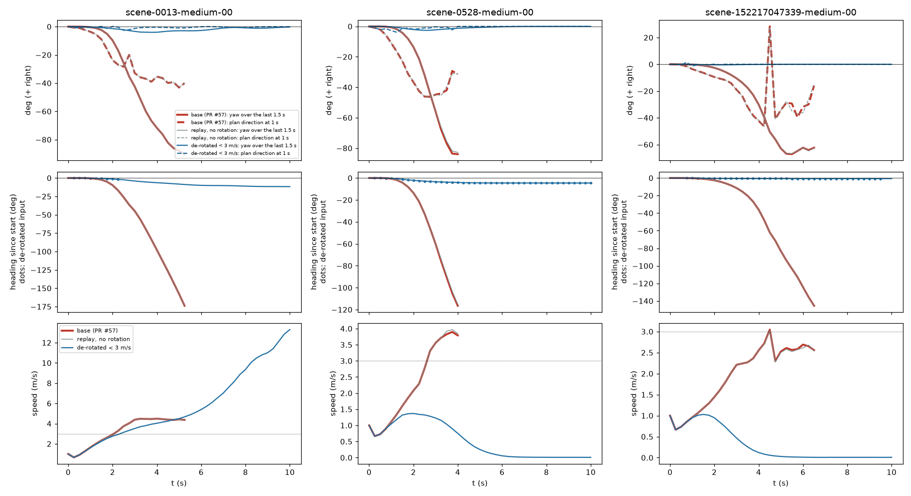

# HUGSIM: removing the ego rotation from the history at low speed stops the spins

Written 2026-10-03 (night lane, follow-up of decision 90 and op_common_cause). Pre-registration with two addenda written before
their runs: [../plans/2026-10-03-history-derotate-plan.md](../plans/2026-10-03-history-derotate-plan.md). Per-run table
[derot/derot_runs.csv](derot/derot_runs.csv), generated summary [derot/summary.md](derot/summary.md), code
`experiments/hugsim/scripts/derot_*`, rule in `experiments/hugsim/lib/zs_agent.py` (`derot_below`, `derot_sel`) and
`jevdrive/hugsim_zs.py` (`OpenpilotFrames.rot_index`). Box runs: `$DATA_DIR/runs/hugsim-derot/`.

## Answer

| | finding |
|---|---|
| 1 | The PR #57 spins are a closed-loop amplification through the history: the plan leans 1-2 deg at launch, the car yaws a little, the model extrapolates that yaw and leans more (about x1.5 per 0.25 s step). Re-rendering the history frames at the current heading (ego odometry only) cuts the loop: the plan stays within 4 deg in 10 / 10 spin scenarios over the first 2 s, against 9-37 deg left in the 6 runaway ones. |
| 2 | Spins (heading error >= 60 deg against the route, controller_spin.md definition) on the 10 PR #57 spin scenarios: **10 -> 1** with the rule (derot3), **8 / 10** with the same replay unrotated (replay3, control) and **8 / 10** in a same-day baseline rerun (the exam run's 10 includes two that drift late and no longer spin tonight). The effect is the rotation, not the replay. |
| 3 | Over 63 of 64 scenarios: 10 -> 3 spins. The 2 new ones (0041-medium, 570_770-medium) diverge at 4-11 m/s, where the rule is off, with the same signature (history yaw and plan direction rise together). Pre-registered "yes" needed <= 1 new spin: **missed by one**. |
| 4 | HD-Score on the 53 scored non-spin scenarios: paired delta **-0.011 [-0.030, +0.008]** (bound -0.02 met); 43 within +-0.05, 2 better, 8 worse. The 64th (kitti360 3000_3200-medium, base complete HD 0.737) crashed in the simulator under the rule (HUGSIM `_get_info` IndexError after 120 steps past the route end); counted as 0 the delta is -0.024, below the bound. |
| 5 | What replaces the spin is often standing still. Of the 9 de-spun scenarios, 5 end at max_steps (21 vs 15 over all 64): without the runaway the model faces the obstacle it was leaning around (bus in 0528, car in 152217; lead_prob 0.7-0.9) and plans a stop. Spin-scenario HD 0.350 -> 0.442 (mean of 10, single runs). Case 03 (0013) completes, HD 0.055 -> 1.000. |
| 6 | Selector arm sel3 (lane A's `sel-rot0-r0.6` ratio), full 64-scenario rerun after the server leak fix (df2a38da), see section "Selector arm sel3, full run": spins **2 / 10** on the spin set (8440_8640 and 053-medium-02 still spin), **3 / 64** overall (derot3: 1 / 10, 3 / 63); non-spin HD paired delta **-0.005 [-0.015, +0.003]** (n = 54, derot3 -0.011 [-0.030, +0.008]); the rule's plan was taken on 119 of 9483 steps. Earlier partial read (11 scenarios, superseded): Spins 0 / 5 spin scenarios (0013, 0254, 0528, 570_770, 5980_6180; the last two also do not spin in tonight's base rerun, so 3 / 3 of the reproducible ones); the rule's plan was taken on only 1-2 steps per episode, which was enough to break the loop (0528 completes, HD 0.045 -> 0.840; 0013 completes). Non-spin: 6 scenarios, paired delta -0.000 [-0.003, +0.003], vs derot3 on the same 6 from -0.19 to +0.29. n too small to read beyond "no harm seen, loop broken by a few steps". |

## Rule and arms

On every simulator step with ego speed < 3 m/s whose last 25 steps hold >= 0.05 deg of yaw, the Cinque session is reset and the last
25 steps (Cinque's 24-step feature buffer + now) are replayed with the original schedule (first frame 100 reps, then 4 reps per frame,
desire as it was), each frame re-projected rotation-only to the current heading (position kept). A rotation about the camera centre
is exact for any depth, and HUGSIM's ego pose is the front camera, so the re-rendered frames are what a camera at the current heading
would have seen from the past positions; the only loss is the field of view rotated out of the frame (black). Above 3 m/s the model
steps normally. Inputs: the camera frames and the ego's own poses; no route, no map.

| arm | what | scenarios |
|---|---|---|
| base | exam run `cinque-fixed` (PR #57) | 64 |
| base_rerun | same code tonight, no rule | 10 spin |
| derot3 | the rule | 64 (63 scored) |
| replay3 | same reset and replay, frames not rotated | 10 spin |
| sel3 | both rollouts; the rule's plan only if its summed 0-4 s lateral plan std < 0.6 x the normal plan's | 64 (full rerun; the first 11 kept, 4 crashed jobs retried, 53 new) |

Determinism: replay3 and base_rerun (both tonight) agree to the digit (HD, steps, end) in 8 / 10 spin scenarios; 5980_6180 and
8440_8640 drift late in long episodes. Against the exam run (an earlier night) 3 / 10 agree to the digit and the rest differ by
<= 0.02 HD except 040 and 8440_8640, as the decision 90 reruns did. So the replay itself is neutral, and the paired readout for
derot3 vs base over the 64 uses the exam run (the only full baseline).

## Per spin scenario

| scenario | base | base_rerun | derot3 | replay3 | sel3 |
|---|---|---|---|---|---|
| scene-0013-medium-00 | SPIN 172 deg, HD 0.055, bg_collision 22 st | SPIN 172 deg, HD 0.055, bg_collision 22 st | 3 deg, HD 1.000, complete 49 st | SPIN 172 deg, HD 0.055, bg_collision 22 st | 3 deg, HD 1.000, complete 46 st |
| scene-0528-medium-00 | SPIN 114 deg, HD 0.045, bg_collision 17 st | SPIN 113 deg, HD 0.045, bg_collision 17 st | 3 deg, HD 0.141, max_steps 400 st | SPIN 113 deg, HD 0.045, bg_collision 17 st | 13 deg, HD 0.840, complete 49 st |
| scene-0254-extreme-00 | SPIN 178 deg, HD 0.821, complete 76 st | SPIN 178 deg, HD 0.818, complete 76 st | 0 deg, HD 0.026, fg_collision 39 st | SPIN 178 deg, HD 0.818, complete 76 st | 0 deg, HD 0.024, fg_collision 42 st |
| scene-102751446607-medium-01 | SPIN 180 deg, HD 0.150, bg_collision 66 st | SPIN 177 deg, HD 0.141, bg_collision 66 st | 3 deg, HD 0.154, max_steps 400 st | SPIN 177 deg, HD 0.141, bg_collision 66 st | 12 deg, HD 0.250, max_steps 400 st |
| scene-152217047339-medium-00 | SPIN 150 deg, HD 0.083, bg_collision 27 st | SPIN 151 deg, HD 0.083, bg_collision 27 st | 2 deg, HD 0.125, max_steps 400 st | SPIN 151 deg, HD 0.083, bg_collision 27 st | 25 deg, HD 0.155, max_steps 400 st |
| scene-570_770-easy-00 | SPIN 63 deg, HD 0.225, bg_collision 45 st | 15 deg, HD 0.225, bg_collision 38 st | 45 deg, HD 0.244, bg_collision 42 st | 15 deg, HD 0.225, bg_collision 38 st | 52 deg, HD 0.260, bg_collision 43 st |
| scene-5980_6180-easy-00 | SPIN 70 deg, HD 0.325, bg_collision 118 st | 49 deg, HD 0.304, bg_collision 92 st | 57 deg, HD 0.336, off_route 120 st | 54 deg, HD 0.336, off_route 115 st | 49 deg, HD 0.304, bg_collision 92 st |
| scene-8440_8640-easy-00 | SPIN 150 deg, HD 0.557, bg_collision 256 st | SPIN 177 deg, HD 0.098, bg_collision 107 st | SPIN 60 deg, HD 0.807, max_steps 400 st | SPIN 140 deg, HD 0.555, bg_collision 235 st | SPIN 128 deg, HD 0.556, off_route 260 st |
| scene-040-easy-00 | SPIN 130 deg, HD 0.806, bg_collision 175 st | SPIN 89 deg, HD 0.945, off_route 193 st | 4 deg, HD 0.999, max_steps 400 st | SPIN 89 deg, HD 0.945, off_route 193 st | 6 deg, HD 1.000, complete 198 st |
| scene-053-medium-02 | SPIN 179 deg, HD 0.432, max_steps 400 st | SPIN 179 deg, HD 0.431, max_steps 400 st | 9 deg, HD 0.586, max_steps 400 st | SPIN 179 deg, HD 0.431, max_steps 400 st | SPIN 179 deg, HD 0.431, max_steps 400 st |

Cells: max heading error against the route, HD-Score, end, steps; SPIN = >= 60 deg.

## The amplification chain

Top: heading change over the last 1.5 s (solid) and plan direction at 1 s (dashed), + = right. Middle: heading since start; dots mark
de-rotated steps. Bottom: speed, dotted line = the 3 m/s threshold. What to look at: in the base run (red, under the grey replay control,
which is identical) the dashed plan direction leads and the solid history yaw follows it with a lag of about two steps, and both grow
together until the car has turned 120-175 deg; with the rule (blue) the history yaw the model sees is zero, the plan stays within
2-4 deg and the heading stays within 12 deg. In 0528 and 152217 the de-rotated car slows to a stop behind the vehicle ahead.

Early lean, plan direction at 1 s over steps 1-8 (deg, + right):

| scenario | base: plan direction at 1 s, steps 1-8 (deg) | derot3 | base heading at step 8 | derot3 |
|---|---|---|---|---|
| scene-0013-medium-00 | -1 -1 -2 -4 -5 -9 -16 -24 | -1 -1 -0 -1 -0 0 -1 0 | -9.7 | -1.4 |
| scene-0528-medium-00 | -1 -2 -6 -11 -17 -23 -31 -37 | -1 -2 -2 -3 -4 -1 -1 -2 | -13.6 | -2.1 |
| scene-0254-extreme-00 | -0 -1 -1 -4 -8 -16 -23 -30 | -0 -1 2 1 -1 -0 -0 -0 | -6.9 | 0.0 |
| scene-102751446607-medium-01 | -2 -2 -3 -5 -8 -15 -22 -28 | -2 -2 -4 -2 -0 -1 -1 -0 | -5.0 | -0.8 |
| scene-152217047339-medium-00 | -0 -0 -2 -4 -5 -6 -8 -9 | -0 -0 1 -1 -0 -0 -0 0 | -2.6 | -0.5 |
| scene-570_770-easy-00 | -1 -1 -1 -1 -1 -1 -1 -1 | -1 -1 -1 -1 -0 -0 -0 -0 | -0.6 | -0.4 |
| scene-5980_6180-easy-00 | 0 1 2 3 3 3 3 2 | 0 1 1 1 1 0 0 0 | 3.3 | 2.0 |
| scene-8440_8640-easy-00 | 0 1 1 1 1 1 1 1 | 0 1 0 1 0 0 0 1 | 1.7 | 1.2 |
| scene-040-easy-00 | -1 -1 -1 -1 -1 -1 -1 -1 | -1 -1 -1 -1 -1 -0 -0 -1 | -0.6 | -0.4 |
| scene-053-medium-02 | -0 -6 -15 -19 -25 -31 -31 -34 | -0 0 0 -0 -0 -0 -0 -0 | -30.9 | -0.5 |

Steps 1-2 are identical (no yaw yet in the history). From step 3 the base lean grows step by step while the rule's stays at 0-4 deg:
the initial lean of 1-2 deg is the model's, the growth is the loop.

## Reading against the inference

- Supported: the low-speed spin is the op_common_cause effect (frozen Cinque extrapolates ego yaw seen in the last ~1.5 s, strongest
  below 3 m/s) closed through the simulator. Removing only the yaw from the history, with nothing else changed (replay3 control), removes
  9 of 10 spins. The same signature appears above 3 m/s in the two new spins, so the loop is not specific to low speed; the rule just
  does not act there.
- Not shown: that the rule is a good driver. HD on spin scenarios rises only 0.09 because the de-spun car stands behind the obstacle it
  was steering around; HD on the rest is flat to slightly negative, and lane A found that removing history rotation everywhere costs
  8-10 PDMS on real scenes (skill_pack history-align report). It is a diagnostic intervention that also happens to be an input rule.
- The root lean (1-2 deg at launch, mostly left) is still unexplained; the rule removes its amplification, not its cause.

## Selector arm sel3, full run

Rerun 2026-10-03 07:00-08:13 box time (73 min, card 2, 2 workers) with `derot_sel.sh` as shipped except `STOP_AT=23:59` (the script's default stop time had passed), fresh Cinque
server after the malloc_trim fix (df2a38da), controller PR #57 (`fixed`), `{"derot_below": 3.0, "derot_sel": 0.6}`, tag `cinque-fixed-sel3`. The script resumes from
`results.csv`: the 11 earlier finished scenarios were kept (not rerun), the 4 earlier `crash` rows (server-death timeouts) were retried, the rest ran fresh. 64 / 64 scored, 0 crashes.
Server RSS (logged every 60 s, kill threshold 30 GB): 4 GB steady for the whole run; the only high reading was a 25-27 GB transient in the first 2 min of server start (TensorRT session build, before trim). No kill.

| | base (exam) | derot3 | sel3 |
|---|---|---|---|
| spins on the 10 spin scenarios | 10 / 10 | 1 / 10 | **2 / 10** (8440_8640, 053-medium-02) |
| spins over all scenarios | 10 / 64 | 3 / 63 | **3 / 64** (the 2 above + new 2800_3000-easy) |
| new spins (not in base) | - | 2 | 1 |
| HD on the 10 spin scenarios | 0.350 | 0.442 | 0.482 |
| HD mean, all | 0.278 | 0.276 | 0.294 |
| non-spin HD paired delta vs base (95% CI) | - | -0.011 [-0.030, +0.008] (n 53) | **-0.005 [-0.015, +0.003]** (n 54) |
| stood to max_steps | 15 | 21 | 17 |

How often the rule's plan was chosen: the replay session ran on 3637 of 9483 steps (38 %, the steps below 3 m/s with yaw in the history); the rule's plan was selected on 119 of those
(3.3 % of the replayed steps, 1.3 % of all steps), in 23 of 64 episodes (62 of 64 had replay steps). Spin scenarios that were fixed took it on 1-2 steps (0013: 1, 0528: 2, 0254: 1);
040-easy used it 18 times and 2800_3000-easy (the new spin) 42 times of 131 replayed steps; 8440_8640 used it 11 times and still spun late (128 deg, vs 150 in base).

Reading: the selector breaks 8 of the 10 spins like derot3 (derot3 breaks 9), with 1 new spin instead of 2, and its non-spin HD delta CI now includes zero and is tighter. 053-medium-02
never selected the rule's plan (0 of 39 replayed steps) and spins as in base; 8440_8640 is the long-episode drift case. The difference sel3 vs derot3 on the spin set (2 vs 1) is one scenario, not
resolvable at n = 10; both pass the pre-registered "<= 4 of 10" bar. Per-scenario sel3 cells are in the table above and `derot/derot_runs.csv`.

## Limits

- One run per cell on a deterministic stack; the per-scenario outcomes after the divergence point are chaotic (in sel3 0528, two rule
  steps out of 14 turned a 114 deg spin into a complete run), so per-scenario HD changes are weak evidence; counts over 10 / 63 are the readout.
- Memory incident: the Cinque server's RSS grows with the per-step reset + replay (the sel3 server reached 192 GB anonymous RSS in
  17 min, cgroup 285 / 296 GB). The servers were SIGKILLed three times (04:41, 05:37, 05:47 box time; most likely the container OOM
  killer); main stopped the sel3 arm at 06:37 box time. The leak itself is handed to another agent. Results: a dead server breaks the
  agent's socket, so the job ends as `crash` and writes no score; those jobs were rerun from scratch (derot3) or, for sel3, in the full rerun below.
  No row in the tables comes from a disturbed run.
- 3000_3200-medium is unscored under the rule (simulator crash); see finding 4 for both readings.
- Threshold 3 m/s and context 25 steps were set before the run and not tuned.
