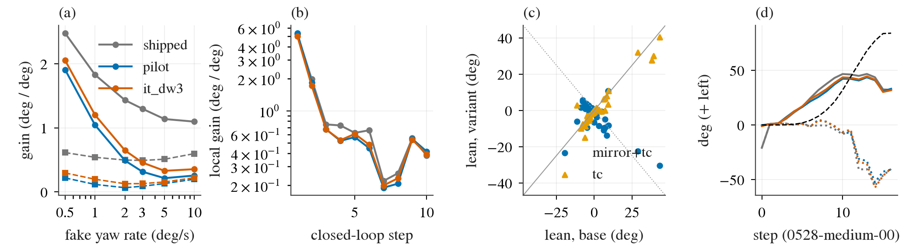

# HUGSIM launch lean and loop gain: why the layer-3 adaptation did not reduce the spins

Written 2026-10-04 (day lane, card 2). Pre-registration, committed before any run:
[../plans/2026-10-04-launch-lean-prereg.md](../plans/2026-10-04-launch-lean-prereg.md). Generated tables with every number:
[lean/tables.md](lean/tables.md); per-row CSVs in `lean/`. Code: `experiments/op_adapt_h/scripts/h_rate_probe.py` (part 1a),
`experiments/hugsim/scripts/lean_probe.py` (modes lean / rate / replay / local), `lean_chain.sh`, `lean_report.py`.
Box outputs: `$DATA_DIR/runs/hugsim-lean/`, `$DATA_DIR/runs/op_adapt_H/rate_probe/`. Models: shipped Cinque (TensorRT),
`pilot-s0` and `it_dw3-s0` serving ONNX (decision 98). All offline on logged HUGSIM frames (video.mp4) or the decision-92 probe pools;
no new HUGSIM runs. Signs: + = left.

## Answer

| | finding |
|---|---|
| 1 | **The adaptation's cut of G depends on the rate.** At stop / low speed (decision-92 port probe, 750 samples per domain) the adapted / shipped ratio of G is 0.75-0.80 at 0.5 deg/s, 0.53-0.59 at 1 deg/s, 0.28-0.38 at 2 deg/s and 0.21-0.26 at 10 deg/s (pilot; it_dw3 0.82-0.83 at 0.5). The shipped G is concave: per degree of history yaw it is 2.5 deg at 0.5 deg/s and 1.1 at 10 deg/s (stop+low, three-domain mean); the adapted G is nearly a step: 1-3 deg of plan heading for any rotation, whatever its size. Pre-registered "rate-dependent": **yes** (CI upper > 0.6 at 0.5 deg/s, < 0.4 at 10). |
| 2 | **On HUGSIM, the closed loop runs where the adaptation does nothing.** Local gain at the logged operating point (history as it was, fake +-w on top, 9 logs x 10 steps): 5.0-5.4 deg / deg at the first moving step, 1.7-2.0 at step 2, 0.5-0.6 later, the same in all three models (adapted / shipped 0.93 [0.89, 0.97] and 0.92 [0.87, 0.96]). The large-signal gain (plan with the logged history minus the plan with the history de-rotated, per degree of history yaw, 1-15 deg) is 4.3 shipped, 3.4 pilot, 3.8 it_dw3 (per-step ratio 0.79 / 0.85). Only around a zero-yaw history at step 6 does the adaptation show its open-loop cut on HUGSIM frames (G_phi1 ratio 0.13-0.48 over rates and the two models). |
| 3 | **Loop gain.** Controller transfer c = 0.19 deg of executed yaw per 0.25 s step per deg of 1 s plan direction (base exam, v < 3 m/s, n 1 557). With the large-signal gain the 6-step-window loop grows x1.79 per step for shipped, x1.61 pilot, x1.69 it_dw3; shipped matches decision 96's x1.5 (pre-registered band [1.2, 1.8]: yes) and both adapted models stay well above 1 (pre-registered "still amplifies": yes). Around zero yaw (step 6, de-rotated) the same kernel gives 0.86 / 0.55 / 0.63: no growth. The spin is a large-signal effect of the launch: a near-step response to the first ~1 deg of yaw, which the small-signal open-loop G at 10 deg/s does not measure. To stop it by itself the large-signal gain would need to fall about 5x (cs < ~0.15 for the window kernel). |
| 4 | **The launch lean is scene content read through the static-then-moving history.** Over 64 scenarios the lean appears at the first moving step (step 0 mean +0.3 deg, steps 1-2 +3.7 [+0.3, +8.1], 46 / 64 with |lean| >= 1 deg; median |lean| 3.3; 44% left). Mirroring the model frames with the traffic flag flipped flips the sign in 80% of those 46 (psi3 readout 92%) and moves the 64-mean from +3.7 to -3.8, so the left excess is in the scenes, not in the model or the input path; the antisymmetry is partial (median |mirror + base| / |base| 0.56, registered bar < 0.5 missed). Traffic flag alone: no effect (median change 14% of |lean|). Single frame without the 5 s static warm-up: |lean| x0.20 (psi3 x0.08). 1 s warm-up instead of 5 s: x0.60. Synthetic rolling-start history: x0.63 (psi3 x0.32). Left half of the image greyed: x0.44; right half: x0.79. CAM_FRONT only: unchanged (x0.99). Virtual camera yaw +-1 deg: +-1 deg. So: the left part of the scene supplies the direction, the 5 s static history followed by the first moving frame supplies the size; not calibration, not the 3-camera stitching, not the traffic flag. |
| 5 | **Desire.** A turnLeft / turnRight desire from step 1 shifts the lean by +9.2 / -7.2 deg (means) but does not cancel it (sign flips 48% / 17%). HUGSIM commands here are "straight" (desire 0 in all exam logs), so desire is not the source. Cinque has no speed / ego-status input; speed only enters through the image motion, i.e. the warm-up test above. |
| 6 | **The adapted models have the same launch lean** (20 scenarios, mean |lean10| 9.65 shipped, 9.95 pilot, 9.78 it_dw3; identical flips under mirror). In the replay the de-rotated plan of the adapted models points 2.3-2.6 deg further toward the spin side than shipped (9 / 9 logs): with the yaw removed, shipped steers slightly back, the adapted models do not. Pre-registered "adapted spins come from the lean, not the amplification" (lean >= 1 deg more, s not larger): **met**, but with a loop gain of 1.6-1.7 the extra lean is not needed to explain the spins; it may explain the 9 new ones in decision 98. |

## Figure

(a) Gain per degree of history yaw against the fake yaw rate: solid = decision-92 port probe (3-s heading, stop+low bins, mean of
nav / WOD / CARLA), dashed = HUGSIM frames at step 6 with the history de-rotated (1-s plan direction). Shipped gain falls with the rate; the adapted
curves meet shipped at 0.5 deg/s. (b) Local gain at the logged closed-loop operating point by step (median of 9 logs): the three models overlap,
5x at launch. (c) Launch lean, base against mirrored + traffic-flag-flipped input (blue, falls near the anti-diagonal) and traffic flag only
(orange, on the diagonal). (d) scene-0528, base log: 1-s plan direction with the logged history (solid) and with the history de-rotated
(dotted) for the three models; dashed black = history yaw over 6 steps. The solid lines of all three models coincide.

## Reading against the inference

- Decision 98's open-loop number (G at 10 deg/s cut 71-78%) is real but measured at the wrong operating point. HUGSIM spins start from a 5 s
  static warm-up followed by the first moving frame; there the model's response to the first degree of yaw is a near-step of 5 deg per deg,
  and the adaptation leaves it at 92-93%. The H pairs were drawn at 5-15 deg/s on real moving histories, and `repeat` / `single` pairs on
  t0-frame copies; no pair has "static history, then motion, then a small yaw".
- What the next adaptation needs (inference, to test): pairs at 0.3-2 deg/s, including a static prefix of 2-5 s before the motion,
  with the target the logged future; and a readout of large-signal gain on a launch (not G at 10 deg/s).
- The left excess of the spins (18 / 20 in decision 90) is selection: the per-scenario lean is either side (44% left over 64) and
  follows the scene under mirroring; the spinning scenes are the ones with a strong lean, which are mostly left in this set
  (0013, 102751, 152217, 053 lean +7 to +79 deg).

## Limits

- Frames are the logged mp4 video, not the exact simulator observations: replay vs exam log |lateral at 2.5 s| median 0.00 m
  (p90 0.05), |lean10| median 0.2 deg (p90 1.4); some launches are sensitive (0528 step 2: 10 s direction 16 deg logged vs 2 deg replayed).
- The 64-scenario lean is shipped only; adapted models on 20 scenarios and 6 variants. Loop replay: 3 spin scenarios x 3 logs.
- The two loop kernels are bounds; the fake histories are constant-rate and cannot separate them. c is pooled over speeds
  (0.06 below 1 m/s, 0.18 at 1-2, 0.23 at 2-3).
- The prereg readout for the lean was the 10 s direction, which is noisy on a slow plan; the 3 s heading gives the same verdicts with stronger flips.
- Rolling-start history uses a road-plane / 60 m sphere warp with a 1.5 m camera height (approximate on 3DGS scenes with obstacles).
- Deviation: part 3 added the `local` mode (fake rate on top of the logged history) after the replay showed identical curves; it was not pre-registered.
