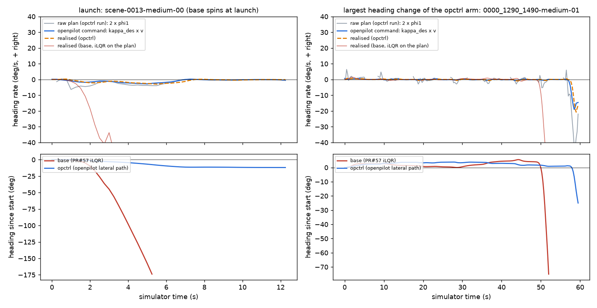

# openpilot's own lateral control path instead of plan tracking: HUGSIM launch spins 10 -> 0, non-spin HD line fails (wide CI), B2D not run

Written 2026-10-04. Pre-registration (committed before any closed-loop run, commit b0c2ea98): [../plans/2026-10-05-op-control-stack-prereg.md](../plans/2026-10-05-op-control-stack-prereg.md).
Follows decisions 113 / 114 (lateral rules), 115 (user's real-car note: lateral engaged at low-speed launches, no spins) and 117 (longitudinal launch: no effect).
Code: `lib/op_ctrl.py` (the path), `patches/hugsim/optional/op-ctrl.patch` + tree `opctrl` in `experiments/hugsim/archive/zs_run.py`, agent opt `op_ctrl`
(`experiments/hugsim/archive/zs_agent.py`), `experiments/hugsim/scripts/opctrl_{replay,replay.sh,offline,chain.sh,report,fig}.py`.
Tables: `op_control_stack/` (`offline.json`, `summary.md/json`, `opctrl_runs.csv`). Shipped Cinque, 64 exam scenarios, one run per arm, card 0 under lease `opctrl` (released).
Tags: **[E]** measured here, **[S]** read from source, **[I]** inference.

## 1. openpilot's path, read from source [S]

openpilot master ec95db3f (2026-10-02), opendbc 35f7e081 (sparse clone, not vendored; the few functions used are copied in `lib/op_ctrl.py` with their logic unchanged).

| stage | file | what it does |
|---|---|---|
| modeld | `selfdrive/modeld/modeld.py` `get_action_from_model` | models with an `action` head (Cinque has one: output slice 2062-2066) use desired_curvature = action[0] / max(1, v)^2; only models without it use `get_curvature_from_plan` (plan yaw at action_t). `LAT_SMOOTH_SECONDS = 0.0` (no smoothing). v <= `MIN_LAT_CONTROL_SPEED = 0.3` m/s: the previous curvature is held |
| action_t | same | lateralDelay + 0.0 + 0.05 (frame) + 0.025 (half model step); the exam fed (0.275, 0.525), i.e. lateralDelay 0.2 s |
| lateralDelay | `selfdrive/locationd/lagd.py` | a pure delay from desired to actual lateral acceleration, learned online in [0.15, 0.65] s, initial steerActuatorDelay + 0.2 |
| controlsd | `selfdrive/controls/controlsd.py` | 100 Hz; latActive needs v > max(minSteerSpeed, 0.3) unless steerAtStandstill; inactive -> desired curvature := measured curvature |
| clip_curvature | `selfdrive/controls/lib/drive_helpers.py` | per 10 ms tick dkappa <= MAX_LATERAL_JERK 5.0 / max(v, 1)^2 x 0.01; lateral acceleration <= 3.0 m/s^2; abs(kappa) <= MAX_CURVATURE 0.2 |
| torque controller | `latcontrol_torque.py` | KP by speed [1, 1.5, 2, 3, 5, 7.5, 10, 15, 30] m/s -> [250, 120, 65, 30, 11.5, 5.5, 3.5, 2.0, 0.8], KI 0.15; setpoint = the request lat_delay ago; jerk feed-forward LP 1.2 Hz, look-ahead 0.19 s, gain 0.3 |
| representative car | opendbc `toyota/interface.py`, `values.py` | RAV4 TSS2: torque control, steerActuatorDelay 0.12 s (lagd starts at 0.32 s), steerRatio 14.3, wheelbase 2.690 m, minSteerSpeed 0, no steering at standstill. LTA (angle) cars: steering-wheel rate <= 0.3 deg / 10 ms up, 0.36 down at <= 5 m/s |
| longitudinal | `longcontrol.py` | only pid / stopping states, no separate launch logic: the longitudinal side was left as it is (decision 117 already showed launch speed is not the lever) |

**Correction to decision 113 point 2.** The curvature-rate limit is inert at 0.5-3 m/s: the source confirms it, and it allows 1.25 / max(v, 1)^2 1/m per 0.25 s step. But the estimate "equivalent c 0.2-0.5" came from the plan-derived curvature. On the car, Cinque is driven by its **action head**, and that head barely responds to the plan's launch lean (section 3).

**The path in the simulator.** The model call is the exam's own. The server's `curvature` (action[0] / max(1, 1.25 v)^2) travels to the simulator as an extra last row of the plan. In the simulator it passes modeld's hold rule, then controlsd at 100 Hz (latActive, `clip_curvature`), then the car.

For the car we use openpilot's own model of its closed steering loop: realised curvature = desired curvature delayed by lateralDelay. This is the pure delay lagd identifies and the delay latcontrol_torque uses to pick its setpoint. openpilot does not model EPS torque-to-angle dynamics, and we have no data for them, so none were added.

The delay is 0.25 simulator s. That equals the 0.2 model-s in action_t times the exam's 1.25 clock dilation, so the plant agrees with what the model is told: on the 4 Hz simulator, each step's curvature takes effect on the next step.

HUGSIM's steer is set each step to atan(2.7 x mean realised curvature over the step), and the longitudinal command stays the iLQR's. Scoring uses the plan without the curvature row. The LTA rate limit is not in the closed loop.

## 2. Offline: what openpilot's path would have done on the exam-base inputs [E]

Method: CPU replay of the first 40 steps of the 64 exam-base runs from their video.mp4, fed the way the exam fed the model (`opctrl_replay.py`; 2 121 steps; 2.5 s lateral reproduction error median 0.007 m, p90 0.08 m). The c readout is the one from lowspeed_ctrl.md: heading over the next 0.25 s step per degree of the plan's 1 s direction phi1, |phi1| < 15 deg, run-cluster bootstrap.

| v (m/s) | PR#57 iLQR (logged) | openpilot path c | two-step c2: iLQR / openpilot | action-head heading rate per step per deg phi1 | plan-derived curvature, same readout |
|---|---|---|---|---|---|
| < 1 | 0.055 [0.049, 0.065] | -0.003 [-0.008, 0.002] | 0.131 / -0.003 | -0.002 [-0.006, 0.003] | 0.027 [-0.001, 0.050] |
| 1-2 | 0.145 [0.130, 0.158] | 0.026 [0.014, 0.038] | 0.311 / 0.055 | 0.024 [0.013, 0.036] | 0.082 [0.054, 0.103] |
| 2-3 | 0.247 [0.228, 0.274] | 0.003 [-0.077, 0.051] | 0.521 / -0.010 | -0.019 [-0.096, 0.033] | -0.058 [-0.246, 0.065] |
| < 3 pooled | 0.127 [0.106, 0.156] | **0.013 [0.001, 0.024]** | 0.277 / 0.027 | 0.010 [-0.003, 0.021] | 0.047 [0.009, 0.075] |

- **Effective c.** The iLQR column reproduces decision 113. openpilot's path has c about 0 below 1 and at 2-3 m/s, and 0.026 at 1-2 m/s. Pooled it is 0.013, at or below decision 111's critical 0.018-0.034 and an order of magnitude below the iLQR.
- **Cause.** The action head's curvature is nearly independent of the plan's launch lean: the signs agree 56% of the time. It correlates 0.66-0.74 with the plan-derived curvature but is 1/2-1/5 of its size.
- **Loop growth.** We used decision 111's window kernel, with one step of delay for openpilot's path. At G = 5.85 / 9.34 the iLQR grows 1.82 / 2.34 per step at 1-2 m/s and 2.44 / 3.31 at 2-3 m/s. openpilot's path grows 0.96 / 1.07 at 1-2 m/s (1.05 / 1.18 at the upper CI of the transfer). It does not grow at < 1 or 2-3 m/s (upper CI <= 1.15). Check: the kernel gives z = 2.77 at c 0.19, G 9.34, the same as decision 111.
- **Signs.** HUGSIM steer and the next heading change agree 0.98. The action curvature correlates positively with the plan-derived curvature, so openpilot's kappa (+ right) and HUGSIM steer (+ right) share a sign.

## 3. HUGSIM closed loop, all 64, one run [E]

A smoke run came first (not scored). The first attempt crashed: the `fixed` tree's sim_utils has no `import os`; the patch was fixed. The second attempt: 0013-medium went from spin to complete (HD 1.0), and 3000_3200-medium ended at max_steps.

| arm | spins | on the 10 | initial-launch spins | re-launch spins | fg | bg | off_route | max_steps | complete | HD mean | RC mean | non-spin HD paired vs exam base | vs rerun 1 | vs rerun 2 | vs same-day rerun 3 |
|---|---|---|---|---|---|---|---|---|---|---|---|---|---|---|---|
| base (exam) | 10 | 10 / 10 | 6 / 64 | 2 / 27 | 26 | 13 | 0 | 15 | 10 | 0.278 | 0.349 | | | | |
| base rerun 1 / 2 (d113 / d114) | 9 / 9 | 8 / 10 | 6 / 64 | 0 / 25, 0 / 20 | 25 | 13 / 12 | | 14 / 15 | | 0.274 / 0.280 | 0.343 / 0.350 | -0.005 / +0.002 | | | |
| base rerun 3 (same day, same server) | 9 | 8 / 10 | 6 / 64 | 0 / 20 | 25 | 12 | 1 | 15 | 11 | 0.280 | 0.350 | +0.002 [-0.000, +0.005] | | +0.000 (identical to rerun 2) | |
| **opctrl** | **0** | 0 / 10 | **0 / 64** | **0 / 35** | 24 | 5 | 2 | 24 | 9 | 0.286 | 0.322 | **-0.009 [-0.058, +0.042]** | -0.004 [-0.051, +0.046] | -0.011 [-0.060, +0.040] | -0.011 [-0.060, +0.040] |

- **Line (i), spins <= 2: PASS, 0.** All 10 baseline spinners stop spinning; the largest heading error to the route is 53 deg, in 8440_8640 and 5980_6180, where base reruns 2-3 also do not spin. No new spins. Per launch event: 0 / 99, against 8 / 91 for the exam base and 6 / 84 for rerun 3. Background collisions fall from 13 to 5.
- **Line (ii), non-spin HD paired CI lower bound > -0.02: FAIL, -0.058.** The mean is -0.009. The interval is wide in both directions (-0.058 to +0.042), so this reads "not shown harmless", not "harmful". Rerun noise is +-0.005; rerun 3 matches rerun 2 exactly, so the pipeline is deterministic on one server.
  - Losses: 0930-hard 1.000 -> 0.256 (fg collision at step 35 after a stop), 3000_3200-medium 0.737 -> 0.273 (max_steps; the same scene lost most under decision 113), 322492347634-easy 0.600 -> 0.334 (max_steps), 0418-hard 0.214 -> 0.002 (max_steps), 124-extreme-01 0.290 -> 0.099 (fg).
  - Gains: 3400_3600-hard 0.14 -> 0.80, 034-hard-01 0.14 -> 0.79, 2800_3000-easy 0.57 -> 0.79.
  - Over all 64 the mean HD is 0.286 against 0.278-0.280; the base spinners gain (0013-medium 0.06 -> 1.00, 040-easy 0.81 -> 1.00, 053-medium-02 0.43 -> 0.70). 0254-extreme-00, a baseline "spinner" that still completed, now ends in an fg collision (0.82 -> 0.03), as under decisions 113 and 114.
- **Where HD goes: not understeer.** This was the pre-registered failure reading, and it is not what happened: bg collisions drop from 13 to 5 (off_route 0 -> 2). The cost is runs **stuck on stop plans**: 24 max_steps against 15. In all nine new max_steps runs the car stands below 0.3 m/s for 335-386 of 400 steps, with the model planning a stop (`straight_stop`) on about 95% of steps.
  - 0418-hard: both arms stop near step 25-27 at about the same place (opctrl 1.7 m further along, heading 0.5 vs 0.7 deg). The base restarts and completes; opctrl never restarts (lead_prob 0.05, so no visible lead).
  - We did not isolate why the model will not restart [I]. The suspects: the 1-2 m difference in stop position, and attack actors that are scripted in time arriving at different places.
- **Closed-loop c of the arm** (same readout on its own logs): 0.033 [0.024, 0.041] at < 1 m/s, 0.066 [0.053, 0.079] at 1-2, 0.146 [0.119, 0.176] at 2-3, 0.064 pooled. That is about half of the iLQR's (0.066 / 0.146 / 0.307) and above the open-loop 0.013. [I] In closed loop phi1 stays small and slow (the car does not spin), so the delayed response correlates with it. The divergence still does not start because the large-signal path (plan lean -> action curvature) is weak.
- **B2D: not run** (gate not met; the pre-registration allows no retune and no extra arm). **NAVSIM: not applicable** (open loop).

## 4. Figure

`experiments/hugsim/figs/op-control-stack.png` (`opctrl_fig.py`). Top row: heading rates in deg/s. Grey is the raw plan's implied rate (2 x phi1); blue is openpilot's command (kappa_des x v); dashed orange is the realised rate under opctrl; red is the base iLQR's realised rate. Bottom row: heading since the start, base vs opctrl.

- Left, the launch spin, scene-0013-medium-00. Look at the first 2 s. The base iLQR follows the plan's 1-2 deg lean and runs away: -10 deg/s at 1.5 s, -175 deg heading at 5 s. Under opctrl the command stays within -3 deg/s, and the heading settles at -12 deg; the car completes, HD 1.0.
- Right, the run with the largest heading change in the opctrl arm (0000_1290_1490-medium-01). HUGSIM exam routes hardly contain a legitimate large turn: the largest heading change of any opctrl run that completes is 7 deg. Look at the late divergences. The base runs away at a re-launch near 50 s (-75 deg). Under opctrl the command reaches -20 deg/s only at 58 s, at the end, against a raw plan that asks for -40 deg/s or more, and the car leaves at -25 deg (bg collision).

## What this says

- [E] openpilot's own lateral path removes the launch spin entirely (10 -> 0, 0 / 99 launch events) with the model and its inputs untouched and no tuned parameter. All path constants come from source; the delay is the one the model is told. Decision 113's low-pass got 10 -> 1 with a tuned tau.
- [E] The mechanism is in the model's own output, not in the controller's limits. The action head that openpilot steers with is nearly blind to the 1-2 deg plan lean that the PR#57 iLQR and B2D's pursuit amplify, so the effective c falls to about 0.01-0.03. This fits the user's real-car note: lateral engaged at launch, no spins. It explains decision 111's paradox without a small vehicle c: our simulators track the **plan**, the car follows the **action**.
- [E] It does not pass the harmless line. The non-spin HD CI is -0.058 to +0.042, about as wide as decision 113's, and the cost comes from more runs stuck on stop plans (24 vs 15 max_steps), not from understeer.
- [I] The longitudinal side still tracks plan positions through the iLQR, so this arm mixes openpilot lateral with plan-tracking longitudinal. A full emulation would also take openpilot's action acceleration through LongControl; that is a new arm with a new pre-registration.
- [I] This is not a per-board trick; it is how openpilot drives a car. That is why the stuck-run cost is worth resolving rather than tuning the arm away.

## Method and limits

- One run per arm; the same-day rerun is deterministic, so the run-to-run noise on a single server is 0. Spin-count noise between servers is about +-1 (reruns 9 / 9 / 9 vs the exam's 10).
- The plant is openpilot's lumped pure delay. There are no EPS torque dynamics, no LTA rate limit in the closed loop, and no tyre lag, so the realised c is what openpilot itself assumes. The LTA limit was checked offline only; it would only lower c further.
- The offline replay uses mp4 frames and the exam-base trajectory (open loop); the closed-loop c is the arm's own.
- The figure's right panel is not a clean "normal turn" case: such cases barely exist in the 64 exam routes.
