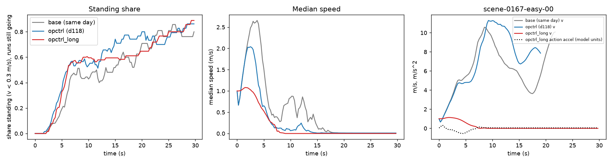

# openpilot's longitudinal path on top of the lateral path: HUGSIM spins 1, non-spin HD line fails clearly (-0.077 [-0.171, +0.014]); the soft launch of the action-head acceleration leaves 20 of 24 stuck runs never launched

Written 2026-10-04. Pre-registration (committed before any closed-loop run): [../plans/2026-10-04-op-control-stack-long-prereg.md](../plans/2026-10-04-op-control-stack-long-prereg.md).
Follows decision 118 ([op_control_stack.md](op_control_stack.md): lateral via the action curvature, spins 10 -> 0, non-spin HD -0.009 [-0.058, +0.042], 24 stuck runs, longitudinal still iLQR).
Code: `lib/op_ctrl.py` (`OpLongitudinal`, `hugsim_acc`), `patches/hugsim/optional/op-ctrl-long.patch` + tree `opctrl_long` in `experiments/hugsim/archive/zs_run.py`, agent opt `op_long` (`zs_agent.py`),
`experiments/hugsim/scripts/opctrl_long_{diag.py,diag.sh,diag_acc.py,chain.sh,report.py,fig.py}`, `opctrl_replay.py` (`--only`, records `acc_act`).
Tables: `op_control_stack_long/` (`summary.md/json`, `opctrl_long_runs.csv`, `diag_d118_stuck.json`, `diag_action_accel.json`, `diag_opctrl_long_stuck.json`). Shipped Cinque, 64 exam scenarios, one run per arm, card 1 under lease `opctrl-long` (released).
Tags: **[E]** measured here, **[S]** read from source, **[I]** inference.

## 1. Diagnosis of decision 118's stuck runs [E], CPU only

Inputs: the 24 `max_steps` runs of `cinque-opctrl`, the same-day base `cinque-fixed-base3` (15 `max_steps`), and a CPU replay of the first 100 steps of the stuck runs with the action head's acceleration recorded.

1. **Only 2 of the 9 newly stuck runs are base completers.** 3000_3200-medium (base completes in 51 steps) and 0418-hard (base stops at the same place for 24 steps, then restarts by itself at step 51). The other 7 (0528, 152217047339, 8440_8640-easy, 102751446607, 0041, 2510_2710-hard, 034-hard-01) end in a collision within 17-271 steps in the base (8440_8640 lasts 271 steps, the rest 17-119). Without the crash they reach the state the base's own 15 stuck runs are in: the car stops (at step 13-65 in 8 of the 9 new runs; 152217047339 never exceeds its initial 1.0 m/s) and the model plans a stop. Six of the seven have a higher HD than in the base (0.14 -> 0.79 for 034-hard-01); 2510_2710-hard drops 0.087 -> 0.003. So the "stuck cost" in decision 118 is mostly crash survivors.
2. **Model plan stop, not iLQR tracking a near-zero plan.** Over the 24 stuck runs the car stands (v < 0.3 m/s) in 0.29-0.97 of the steps (median 0.94; the exception is 8440_8640-easy, 0.29, which restarts repeatedly) and `straight_stop` is on in a median 95%; while standing, the plan's speed at 1.2 s has a per-run median of -0.005 to 0.09 m/s (mostly 0.01). (Decision 118 and the pre-registration quote 84-97% for the nine new runs; the 24-run range is wider.) The action head agrees: its acceleration while standing has median -0.05 to 0.05 (model units), maximum 0.08-0.24, and is >= 0.1 on only 0-18% of the standing steps (median 7%). Plan and action both say "stay".
3. **What the real stack would do there.** Feeding the replayed action acceleration and the logged speed to `OpLongitudinal` (open loop): `LongControl` sits in `stopping` and enters `pid` only on the 0-18% of steps with action acceleration >= 0.1, where the smoothed target is 0.05-0.1 and the realised acceleration at most 0.07-0.14 m/s^2 (simulator units), at most 0.03 m/s per step. There is no launch logic that amplifies it.
4. **Stop position and attackers.** 0418-hard: both arms stop at nearly the same place (base 10.1 m, opctrl 12.1 m, heading 0.7 vs 0.5 deg). The base restarts because its speed creeps 0.02 -> 0.04 m/s and the lead reading rises -0.2 -> +0.6 m/s at about step 50, after which the plan speed grows 0.04 -> 0.26 -> 0.96 -> 2.4 (the ego speed is a model input, so a creep seeds a self-reinforcing launch); the opctrl car stays at 0.01 m/s and the lead reads <= 0. 3000_3200: opctrl's car meets the lead after 21-24 steps (lead_prob 0.47 -> 0.95, lead at 11 m, v 0) and stops at 21.6 m with lead_prob 0.9-1.0 afterwards; the base car is at 23-30 m with the lead moving away at 5-6 m/s (lead_prob 0.1-0.3) at the same instant. We did not separate scene timing from the arm's speed trajectory.

## 2. openpilot's longitudinal path from source [S]

openpilot master ec95db3f, opendbc 35f7e081 (the opendbc sparse clone in `tmp/opsrc/odbc`; copied functions are marked VERBATIM in `lib/op_ctrl.py`).

| stage | file | constants used |
|---|---|---|
| modeld | `selfdrive/modeld/modeld.py` `get_action_from_model` | desired_accel = `action[1]`; `stop = should_stop(v_ego, raw accel)` = v < 0.3 and a < 0.1 on the raw value; desiredAcceleration = `smooth_value(raw, prev, LONG_SMOOTH_SECONDS = 0.3)` at 20 Hz (DT_MDL 0.05) |
| long_action_t | same | longitudinalActuatorDelay 0.15 (non-hybrid Toyota; interfaces.py default; hybrids 0.05) + 0.3 + 0.05 + 0.025 = 0.525, equal to the 0.525 the exam fed |
| planner | `longitudinal_planner.py` | experimental mode (how the e2e model drives): a_target = min(mpc, cruise, e2e); with no lead and a set speed above the car's, mpc and cruise are positive, so e2e wins: output_a_target = clip(e2e, -3.5, 2.0); shouldStop = any candidate's should_stop (only e2e's can fire) |
| LongControl | `selfdrive/controls/lib/longcontrol.py` | `long_control_state_trans` (off / stopping / pid, no `brake_pressed` / `cruise_standstill`); Toyota TSS2: kpV 0, kiV 0 (interfaces.py, not overridden by `toyota/interface.py`), so the pid state outputs a_target as pure feed-forward; stopping: output = last output, if > stopAccel (-2.0): min(., 0) - 1.0 m/s^2 per s; no starting state |
| limits | `toyota/values.py` CarControllerParams | ACCEL_MIN -3.5; RAISED_ACCEL_LIMIT (TSS2) -> ACCEL_MAX 2.0 |
| car | `toyota/carcontroller.py` | request rate limit +-4.0 m/s^2 per 3 control frames (jerk 4 m/s^3, ACCEL_WINDUP / WINDDOWN_LIMIT); then the PCM + `long_pid` loop (kiBP [2, 5] -> kiV [0.5, 0.25]) that makes a_ego follow the request |

**Conversion to HUGSIM** (`velo += acc * dt`, one 0.25 s step). The model's clock runs 1.25x faster than the simulator's (speed fed as 1.25 v, a step = 4 model steps = 0.2 model s), so the controller runs in the model frame (v_m = 1.25 v, thresholds and limits as above, 100 Hz ticks of 0.01 model s, 20 per step). The plant is the same pure delay openpilot assumes for the model: realised accel = rate-limited request delayed 0.15 model s (15 ticks); the PCM loop is not modelled. The mean realised a_m over the step is converted back, a_sim = a_m / 1.5625 (the speed change HUGSIM needs: dv_sim = a_m x 0.2 / 1.25), and clamped to a >= -v / dt (no reversing). The limits are applied in the model frame, so they are 2.0 / -3.5 there and 1.28 / -2.24 in simulator units. The 20 Hz smoothing is applied 4 times per step to the model's last output (the server returns only the step's last action; the effective alpha per simulator step is 0.486). The iLQR still runs but its acceleration is discarded; lateral is exactly decision 118's.

Not in the loop (disclosed in the pre-registration): radar and the MPC lead protection, cruise standstill, brake pressed, the PCM loop's own dynamics, the iLQR's acceleration (it was +-3 m/s^2 there; here 1.28 / -2.24 in simulator units).

## 3. HUGSIM closed loop, all 64, one run [E]

Smoke (2 scenes, not scored): sim.log has 400 `op_long` lines per run, the acceleration row is stripped, no crash; both scenes ended at `max_steps` with RC 0.03-0.06 (0013-medium: the car decelerates from the initial 1.0 m/s and stands from about step 30). The full run went ahead as pre-registered.

| arm | spins | on the 10 | initial-launch spins | re-launch spins | fg | bg | off_route | max_steps | complete | HD mean | RC mean | non-spin HD paired vs exam base | vs same-day base 3 | vs same-day base 4 | vs d118 opctrl |
|---|---|---|---|---|---|---|---|---|---|---|---|---|---|---|---|
| base (exam) | 10 | 10 / 10 | 6 / 64 | 2 / 27 | 26 | 13 | 0 | 15 | 10 | 0.278 | 0.349 | | | | |
| base rerun 3 / 4 (same day, same server; identical) | 9 | 8 / 10 | 6 / 64 | 0 / 20 | 25 | 12 | 1 | 15 | 11 | 0.280 | 0.350 | | | | |
| opctrl (d118) | 0 | 0 / 10 | 0 / 64 | 0 / 35 | 24 | 5 | 2 | 24 | 9 | 0.286 | 0.322 | -0.009 [-0.058, +0.042] | | | |
| **opctrl_long** | **1** | 1 / 10 | **0 / 64** | 0 / 0 | 28 | 3 | 1 | 24 | 8 | 0.215 | 0.241 | **-0.077 [-0.171, +0.014]** | -0.079 [-0.174, +0.012] | -0.079 [-0.174, +0.012] | -0.068 [-0.160, +0.020] |

- **Line (i), spins <= 2: PASS, 1.** The one spin is 5980_6180-easy (off_route at step 93, heading error 63 deg): the car launches softly to 4 m/s, brakes at step 55, and at 1-2 m/s the action curvature grows to 0.03 while the heading drifts.
- **Line (ii), non-spin HD paired CI lower bound > -0.02: FAIL, -0.171 vs the exam base** (-0.174 vs both same-day reruns). The point estimate is -0.077 and the interval is above zero only at +0.014. All 64: HD mean 0.215 against 0.278-0.286; RC 0.241 against 0.322-0.350.
- **Stuck runs (iii).** 24 for opctrl_long, 24 for opctrl, 15 for the exam and same-day base. The count equals d118's but the sets differ: of the 24, 10 are also stuck in the base, 14 are not (9 of the 14 ended in a collision in the base, 0013-medium and 570_770 among them; 5 completed: 0051-easy 0.97 -> 0.08, 0167-easy 1.00 -> 0.04, 039-easy 1.00 -> 0.08, 3000_3200-medium 0.72 -> 0.03, 0418-hard 0.23 -> 0.08). Base completers that no longer complete: 8 of 11 (0051, 0167, 0254-extreme, 039, 0411-hard, 0418, 0930-hard, 3000_3200). Completers the base lacks: 5 (034-easy, 040-easy, 053-medium-02, 095-medium-01, 113-easy; four were base stuck runs, so the model does go there when the car is slower or later).
- **The stuck runs are launch failures.** In 20 of the 24 opctrl_long stuck runs the car never exceeds 1.6 m/s: it starts at the simulator's 1.0 m/s, decelerates and stands from step 16-39. In d118's 24, only 6 never exceeded 1.6 m/s (the iLQR launches, the model stops it later). See the figure: the median speed of the runs still going peaks at 1.1 m/s, against 2.0 (opctrl) and 2.6 (same-day base).
- **Why [I], from the replay of two base runs** (`acc_act` against the logged speed, first 14 steps): the action head's acceleration lags the plan. In 0418 it reads 0.01, -0.14, 0.01, 0.21, 0.43, 0.58, 0.63 while the plan's own acceleration at t = 0 is about 1.0 from step 1; in 3000_3200 it is 0.00, -0.19, -0.09, 0.09, 0.13, 0.39, 0.55 against 1.4. After the smoothing (tau 0.3 s), the 0.15 s delay and the 4 m/s^3 rate limit, the car gains only 0.1-0.2 m/s in the first four steps; the iLQR reaches 1.3-1.5 m/s there. A slow-moving car then pulls the model's plan down (0013-medium: plan speed at 0.6 s goes 1.83 -> 1.47 -> 1.40 -> 1.0 -> 0.65 while the car stays at 1.0-1.2 m/s) until it plans a stop, and it never restarts. We did not test whether a faster launch would be consistent with the action head on a real car; the simulator starts at 1.0 m/s with a 5 s static warm-up, which no real car does.
- **Closed-loop c** of the arm (decision 111 readout): 0.015 [0.007, 0.032] at < 1 m/s, 0.112 [0.047, 0.153] at 1-2, 0.140 [0.086, 0.163] at 2-3, 0.079 pooled (d118: 0.033 / 0.066 / 0.146 / 0.064). Not lower than d118's, because the car lingers at 1-2 m/s longer.
- Largest non-spin losses against the exam base: 0167-easy 0.972 -> 0.044, 0930-hard 1.000 -> 0.072 (fg collision), 039-easy 1.000 -> 0.079, 0051-easy 0.949 -> 0.076, 0411-hard 0.888 -> 0.109 (fg collision), 3000_3200-medium 0.737 -> 0.033. Largest gains: 095-medium-01 0.103 -> 1.000, 113-easy 0.123 -> 0.843, 132384196576-medium-01 0.122 -> 0.669, 032-medium-02 0.218 -> 0.609.
- B2D: not run (gate not met; another lane owns the B2D cards).

## 4. Figure

`experiments/hugsim/figs/op-control-stack-long.png` (`opctrl_long_fig.py`). Left: share of the runs still going that are standing (v < 0.3 m/s) by time; the three arms end up at 0.8-0.9, but opctrl_long's curve rises first. Middle: median speed of the runs still going; look at the first 5 s, where opctrl_long peaks at 1.1 m/s against 2.0 and 2.6. Right: scene-0167-easy-00, a base completer; look at the red speed trace flat at 1.0-1.1 m/s while the action head's acceleration (dotted) stays below 0.5 and turns negative, against the base's climb to 5 m/s by 5 s.

## What this says

- [E] Replacing the iLQR's acceleration with openpilot's own longitudinal path does not solve decision 118's stuck-run cost: the count stays at 24 and the HD gets worse. The pre-registered line (ii) fails by a wide margin, and the arm is not an improvement on decision 118's.
- [E] Decision 118's "stuck on stop plans" cost is mostly the model's stop at the start of scenes the base crashed in (7 of 9), not a tracking artifact; a minority (2 of 9) comes from a stop at a different place or time than the base's.
- [E] The mechanism of this arm's loss is the launch: Cinque's action acceleration is much softer and later than its plan acceleration, and through openpilot's smoothing, delay and jerk limit the simulator car (which starts at 1.0 m/s) does not gain the speed that keeps the model in "go". 20 of 24 stuck runs never launch.
- [I] This is evidence against "launch speed is not the lever" (decision 117) only for the combination with action-head acceleration: with the iLQR following the plan's distances the launch is stronger, and the model stays in "go".
- [I] The lateral part of decision 118 stands apart from this (spins 1, c as before); the longitudinal half would need the launch to be reproduced outside the action head (a launch seed), which is a tuned or per-board change and was not added (no extra arm in the pre-registration).

## Method and limits

- One run per arm; the same-day rerun is identical to base 3 (deterministic on one server). Same server, card 1; the rerun is the same card as the arm.
- The action head's acceleration is read from the shipped Cinque model with the exam's inputs and `action_t`; the controller emulation follows openpilot's source but not radar, MPC lead protection, PCM dynamics or cruise standstill. A real car at standstill uses `cruise_standstill` and `autoResumeSng`, which are not modelled.
- Acceleration limits are applied in the model frame; if they were applied in simulator units the car could accelerate 1.56x harder (3.1 m/s^2 model units), which was not tested.
- The diagnosis (section 1) uses zs_steps of closed-loop runs and a CPU replay at logged speeds (open loop); the open-loop `OpLongitudinal` readout does not close the speed loop.
