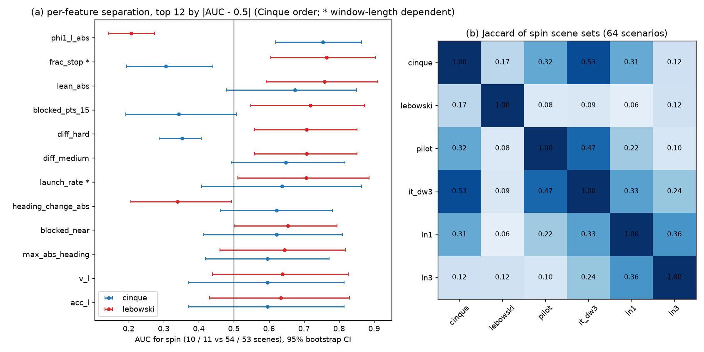

# HUGSIM spin attribution: who spins, loop gain on non-spinners, Lebowski overlap, navhard constraint

Written 2026-10-04 (CPU only, no closed-loop runs, no GPU). Pre-registration (before any extraction):
[../plans/2026-10-04-spin-attribution-prereg.md](../plans/2026-10-04-spin-attribution-prereg.md). Tables: `spin_attribution/` (CSV/JSON).
Code: `experiments/hugsim/scripts/spin_attr_{extract,analysis,q2,q3,q4,cpu_gain,gain_run,navhard_ref,fig}.py`.
Native Cinque / Lebowski, PR#57 controller, 64 exam scenarios, one run each (10 and 11 spinners). Tags: **[E]** evidence (measured here or in a cited log), **[I]** inference.

## Answers

| | answer |
|---|---|
| 1 | **Nothing observable separates the 10 spinners beyond the launch plan lean itself, and the data cannot support a multivariate model.** Of 36 features only 3 have a bootstrap AUC CI excluding 0.5 for Cinque (expected by chance ~1.8 at 5%): plan 1 s direction at steps 1-4, \|phi1\|: AUC 0.75 [0.62, 0.86] (spin 1.58 deg vs 0.68 median); one is window-truncation artefact (frac_stop), one has no variance (diff_hard). d100 lean \|lean10\|: 0.67 [0.48, 0.85] (CI includes 0.5). Dataset, difficulty, route curvature, start yaw, road width, lead_prob, engaged, speed/accel at step 4: all CI include 0.5. Lebowski: same two lean readouts (0.76 [0.61, 0.90], 0.76 [0.59, 0.91]) plus route heading change over 20 m (0.72 [0.55, 0.87]) and v at step 4 (0.71 [0.56, 0.85]). Leave-one-out multivariate (top-3 chosen inside each fold): Cinque AUC 0.35-0.39 [0.12, 0.60], Lebowski 0.55 [0.33, 0.77]: not above chance, so **no model reported** (10 positives). [E] |
| 1b | **"Blocked, slow too long, goes around" is not supported as the discriminator.** Initial obstacle ahead in the ego lane (actor < 25 m): 4 / 10 spinners vs 38 / 54 non-spinners (OR 0.28, one-sided p 0.98); with scene points on the ego line the OR is 0.5-0.7 (p > 0.8). Lebowski points the other way for the scene-points definition (10 / 11 vs 38 / 53; OR 3.9-7, p 0.04-0.17, threshold not pre-registered, so exploratory). Of the 6 Cinque early spinners 4 have a lead actor within 17-20 m at step 0, but so do 70% of non-spinners. 3 of 4 late spinners (steps 81, 151, 243) are re-launches after a long stop in scenes without actors; [E] |
| 1c | **The launch is the hazard, whichever launch it is.** Initial launch (every run starts at 1 m/s): 6 / 64 spin within 12 steps (9.4%); re-launch after a stop (v back above 1 m/s after < 0.4 m/s within 2 s; 27 events in 64 runs, spinners counted up to divergence): 2 / 27 (7.4%). Lebowski 5 / 64 vs 1 / 28. Same per-event rate [E], small counts. The other two Cinque spinners: one at 6.3 m/s (570_770-easy, not a launch), one 43 steps after a stop (040-easy). 6 of 10 diverge at steps 5-10. |
| 2 | **Non-spin launches have the same loop gain and the same low-speed window; what differs is the size of the first-step plan lean, weakly.** CPU onnxruntime reproduces the TensorRT d100 numbers (scene-0528 base log, w 2: local gain per step correlation 0.9999, step 1 6.37 vs 6.38). 18 logs: 6 spin, 12 non-spin (5 strong lean, 5 stop-and-go, 2 plain). Local gain at step 1 (deg of 1 s plan direction per deg of added history yaw, w 2): spin median 5.85 (range 4.3-6.9), non-spin 4.87 (3.0-7.1; strong lean 4.72, stop-and-go 5.13, plain 3.20); step 2: 2.27 vs 2.20 / 2.50 / 0.89; steps 3-9: 0.89 vs 0.74 / 2.81 (stop-and-go, v < 1 m/s) / 0.36. Spin vs non-spin step-1 gain MWU p 0.18: **gain is not lower on non-spinners** (the d100 5x amplification is present in every launch). Loop growth with c = 0.19: z = 2.10 spin vs 1.88 / 1.96 / 1.57 (window kernel from the step-1 gain; both > 1). Step 1-2 \|phi1\| in the replay: spin 0.98, non-spin 0.51 (p 0.55, n 6 vs 12); in the 64 native logs \|phi1\| at steps 1-2 spin 0.76 vs 0.43 (p 0.025, n 10 vs 54): **perturbation larger, window not shorter**: steps until v >= 3 m/s is shorter for spinners but it is confounded by the spin itself (p 0.08). Large-signal gain on states with 1 <= \|H\| <= 15: spin 4.2 (n 24 steps), strong lean non-spin 2.5 (n 26); no non-spin stop-and-go or plain log reaches \|H\| >= 1 deg, so it is not measurable there. [E, n small] |
| 3 | **Lebowski's 11 spins are mostly different scenes from Cinque's 10.** Shared: scene-0013-medium, 5980_6180-easy, 152217047339-medium (3 scenes); Jaccard 0.167 (3 / 18), expected intersection under independence 1.7, hypergeometric p 0.23. Cinque vs its own adaptations is high (it_dw3 8 / 10 shared, Jaccard 0.53, p < 0.001; pilot 0.32, ln1 0.31); Lebowski vs every Cinque-family arm 0.00-0.12 (p 0.4-1). Over the six model arms 58 pairwise scene intersections vs 26.4 under independent permutation (p 0.0002): some scenes are repeat offenders (8440_8640-easy and 053-medium-02 spin in 5 of 6 arms; 35 / 64 scenes in none). [E] |
| 4 | **The "must not hurt" set is large.** Reference = PDM reference (`mc.trajectory`; human future not readable from the cache), ego-frame heading in the first 2 s: \|heading\| >= 5 deg at 2 s in 231 / 450 stage-1 tokens (51%) and 3 621 / 5 462 stage-2 tokens (66%); >= 10 deg: 163 (36%) and 2 537 (46%). At 1 s: >= 5 deg 157 (35%) / 3 295 (60%), >= 10 deg 90 (20%) / 2 125 (39%). Native Cinque on the 2 s >= 5 deg tokens: stage 1 score 0.667 vs 0.770 on the rest, stage 2 0.424 vs 0.544. Arms vs native per-token score on those tokens (95% CI): rot0 stage 1 -0.148 [-0.206, -0.090], stage 2 +0.003 [-0.007, +0.012]; straight stage 1 -0.123, stage 2 -0.002; sel-rot0-r0.6 stage 1 +0.001 [-0.010, +0.014], stage 2 +0.015 [+0.011, +0.018]; sel-rot0 -0.003 [-0.023, +0.018] / +0.022 [+0.016, +0.027]. Same picture at 10 deg and at 1 s. So the unconditional history rules hurt exactly where the reference turns early in real scenes (stage 1, -0.12 to -0.23 depending on cut), and only selectors leave them untouched. [E] Stage-1 and stage-2 tokens are one official score per token (devkit per-token `score`), not the combined two-stage EPDMS. |

## Figure

(a) Per-feature AUC with 95% stratified bootstrap CI for Cinque (blue) and Lebowski (red), top 12 by distance from 0.5. Look at whether the intervals clear the 0.5 line: only the launch-lean readouts (phi1, lean) and, for Lebowski, route curvature do; the starred features are mechanically tied to the truncated pre-divergence window. (b) Jaccard of the spinning scene sets across six arms: Cinque and its adaptations form a block, Lebowski is an outlier.

## What was done and how to read it

**Q1 features and leakage.** Spinner windows are cut at the divergence step (`spin_episodes.start`); non-spinners use 40 steps. Launch features (steps 0-4: lean, phi1, v, accel, lead_prob, engaged) are clean for all 10 (earliest start is step 5). Obstacle features are measured at step 0 (obj_boxes lane 0-60 m; scene.ply points on the ego line 3-25 m). Fractions over the truncated window (`frac_v3`, `frac_v1`, `frac_stop`, `launch_rate`) are window-dependent and flagged: `frac_stop` is spuriously low for spinners because their windows are 5-10 steps. Count features (steps below 3 m/s) were dropped after the first pass because they are mechanically separated by window length (prereg asked for fractions, not counts; the first-pass counts gave AUC 0.23-0.30 and are not reported). Road width = lateral extent of ground.ply points 3-25 m ahead. **Lane-line and road-edge confidence were not measured**: they need a model forward on every scene (the CPU replay covers only 18 logs); open. 41 candidate features were tried (36 with variance); with that many the 3 hits are what chance plus the lean readout gives, so the only robust statement is "launch lean".

**Q2 on CPU.** `OPModel("cinque", "cpu")` ran lean_probe's local and de-rotated replay at steps 1-10, w = 0 / +-2, 12 processes x 4 threads, about 55 min total. Calibration against the d100 TensorRT numbers is exact to 2 decimals. Non-spin logs end early in 15 of 54 cases by fg_collision within 26 steps (attack scenes) and two of them (144248042870-extreme, 152217047339-extreme) already yaw 33-39 deg before the collision: the "non-spin" label is right-censored by collisions, so the comparison favours the non-spinner group looking worse than it would without attackers. Both strong-lean non-spinners in the replay with first-step \|phi1\| of 5.7-6.2 deg are such runs.

**Q3 data.** Pilot / it_dw3 labels are the all-64 runs of decisions 98 / 101, ln1 / ln3 of decision 106 (`op_adapt_h/results`); derot3 / sel3 from `results/derot`. Per-scene table `spin_attribution/q3_table.csv`.

**Q4 data.** `navhard_ref.csv` (box, 5 912 tokens) from the metric caches; arm scores from the official per-token CSVs of the d94 arms; 450 stage-1 + 5 462 stage-2 tokens; token-level bootstrap, 1000 resamples (the d94 CIs are over scene groups, so these are narrower). The PDM reference is not the human trajectory; heading is its ego-frame yaw at 1.0 / 2.0 s.

## Reading (inference)

- [I] The spin is a property of "the launch step reads scene content as a lean and the 5x first-step gain turns it into a loop", not of an identifiable scene type: gain is present in every launch (Q2), the lean magnitude is the only separating readout (Q1), and which scenes tip over is model-specific (Q3: Lebowski vs Cinque Jaccard 0.17, Cinque vs its fine-tunes 0.3-0.5).
- [I] A rule or model fix should therefore be judged on the launch event (initial launch and re-launch carry the same hazard), not on scene classes; scene-class gating (obstacle, dataset, curvature) has nothing to key on.
- [I] The re-launch hazard (2 / 27) says the d96 "stop behind an obstacle they used to circle" outcome is a consequence of not spinning, not a cause of spinning.
- Constraint for any rule (Q4): in real scenes (stage 1) the PDM reference turns >= 5 deg within 2 s on half of the tokens and unconditional history rotation removal costs 0.15 on them.

## Limits

- n = 10 / 11 spinners, one run each; same-day rerun reproduced 8 / 10 spins (d96). All CIs are descriptive.
- Non-spin label right-censored by early collisions (above); some "non-spinners" would have spun.
- Q2 sample 18 logs, steps 1-10 only; large-signal gain only measurable where the car yaws; local gain uses w = 2 only.
- Obstacle features: scene.ply points are a crude proxy for parked vehicles; `blocked_pts` thresholds not pre-registered.
- Q4 uses the PDM reference, not the human future; per-token bootstrap, not grouped.
