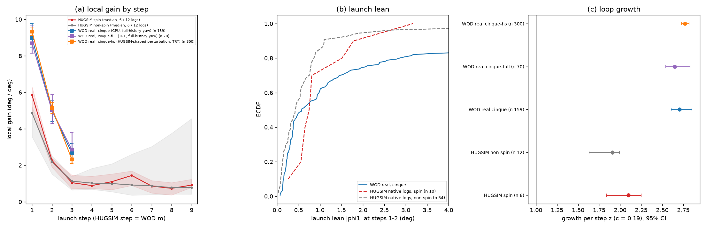

# Launch loop gain of openpilot on real WOD launches

Written 2026-10-04. Pre-registration (with two dated addenda): [../plans/2026-10-04-wod-launch-gain-prereg.md](../plans/2026-10-04-wod-launch-gain-prereg.md), committed before any run.
Code: `experiments/hugsim/scripts/wod_launch_gain{,_chain,_report}.py`; tables: `wod_launch_gain/{summary.txt,gain_table.csv,rows_*.csv}`; figure `../figs/wod-launch-gain.png`.
Question (decision 110): is the per-step loop growth > 1 at launch (HUGSIM spin 2.10, non-spin 1.57-1.96, step-1 local gain ~5) a property of openpilot or of rendered simulator frames?

## Answer

**Openpilot-intrinsic, by the pre-registered line; the real-data gain is higher than on HUGSIM, not lower.** Shipped Cinque, 300 real WOD stop-then-go launches (292 segments), HUGSIM-shaped perturbation (identical to `spin_attr_cpu_gain.py` at step m), c = 0.19 / step (HUGSIM PR#57):

| step (HUGSIM step = WOD m) | local gain, deg / deg, median [95% cluster CI] | c x gain | growth z (window kernel) |
|---|---|---|---|
| 1 | **9.34 [9.12, 9.59]** (n 300) | 1.78 | **2.77 [2.73, 2.82]** |
| 2 | 5.15 [4.84, 5.46] (n 299) | 0.98 | 1.96 [1.90, 2.02] |
| 3 | 2.32 [2.09, 2.71] (n 295) | 0.44 | 1.37 [1.32, 1.46] |
| HUGSIM spin, step 1 / 2 / 3 (CPU replay, 6 logs) | 5.85 / 2.27 / 1.05 | 1.11 | 2.10 |
| HUGSIM non-spin, step 1 / 2 / 3 (12 logs) | 4.87 / 2.20 / 1.13 | 0.93 | 1.91 |

- Verdict per pre-registered line (step-1 z, Cinque): CI lower 2.73 > 1 -> **openpilot-intrinsic**. "Sim-only" (CI upper < 1) is excluded by a wide margin: all 300 events have step-1 gain above the threshold s* = 0.88 deg/deg at which z = 1 (c = 0.19).
- Robustness: the original full-history perturbation (every history frame carries w x t; 159 events, CPU, and 70 dev events on TRT) gives 8.99 [8.48, 9.77] and 8.69 [8.15, 9.66], z 2.70 [2.61, 2.85]. Same rows, full-history vs HUGSIM-shaped: gain correlation 0.93, medians 5.54 vs 5.77 over all steps. CPU vs TRT on 185 shared rows: gain correlation 0.9999, median ratio 1.001, so the two backends are interchangeable.
- Step 2 and 3 gains are 2.3x and 2.1x HUGSIM's: on real frames the gain decays more slowly (5.2, 2.3) than on rendered frames (2.2, 1.1), so the real-data growth stays > 1 for three steps (1.96, 1.37), where HUGSIM's step 3 is already near 1.
- **Caveat: the transfer c.** The growth z uses HUGSIM PR#57's 0.19 deg per step per deg of 1 s plan direction. A real car's lateral controller and vehicle response is likely much smaller. Growth > 1 holds only if c exceeds the value at which z = 1 (step-1 gain, window kernel; c x gain = 0.167 at z = 1): **c = 0.018 [0.017, 0.018] on real WOD** (step 2: 0.032; step 3: 0.072), against 0.028 (HUGSIM spin) and 0.034 (non-spin). So the gain argument says "intrinsic" for any controller with c above about 0.02 deg / step per deg; it says nothing about a real car's c, which this measurement does not give.
- **Launch lean** (|phi1| at steps 1-2, per event, native input, w = 0; Cinque, 156 events with both steps): median 0.58 [0.39, 0.94] deg, mean 2.41 [1.69, 3.41], p90 7.3, 39% >= 1 deg. HUGSIM native logs: non-spin 0.43, spin 0.76 (median per group). Real vs non-spin: MWU p = 0.005 (real larger, heavy tail); real vs spin: p = 0.50 (not distinguishable). The central lean on real launches is as small as on HUGSIM non-spinners, but the tail is heavier than HUGSIM's (ECDF in panel b).
- it_dw3-s0: **not run (stopped by user)**. An 89-row partial CPU file exists on the box and is not analysed.
- Large-signal gain: not measured (as pre-registered; real launches have no yaw history in the pool).

## Figure

What to look at: (a) the orange / blue / purple WOD points sit above the HUGSIM red / grey curves at every step (9 vs 5 at step 1, 5 vs 2.2 at step 2, 2.3 vs 1.1 at step 3). (b) the blue real-lean ECDF starts like the grey non-spin curve and has a heavier right tail. (c) every WOD interval is right of the HUGSIM ones and far from 1.

## Method and limits

- Pool: decision 106 `lwod` (WOD-E2E train / dev launches: >= 1.8 s at v < 0.1 m/s, then the first v > 0.1 frame is the onset; t0 = m-th moving 5 Hz frame, m = 1..3). Event order: dev-split first, then a fixed random order; 300 events = all 70 dev + 230 train (Cinque shipped never saw WOD, so the split does not matter for it).
- Perturbation, readout, warm-up (static frame held 100 reps then 4 reps per 5 Hz frame), traffic flag and phi1 (DIL 1.25) are the d100 / spin_attr ones; fake yaw is a pure rotation warp of the model frames. Frames come from WOD's three front cameras re-rendered into openpilot's road / wide model frames (`jevdrive.camgeom`), not from openpilot's own camera.
- WOD steps are 5 Hz of real time (0.2 s), HUGSIM's 0.25 s step is fed as 0.2 s; gains are per model step, so comparable, while c is HUGSIM's. The window kernel is a bound, not a closed-loop simulation; no closed loop was run.
- The first full run used full-history yaw; the HUGSIM-shaped control was added after the first Cinque numbers (prereg addendum), and its verdict is the one reported. The earlier CPU-only plan was cut for time; Cinque CPU rows (159 events) are kept as a cross-check.

## Cost

CPU onnxruntime: ~55 min per 9-feed event (75-core cgroup quota; 0.3-2 s per model step, 136 steps per feed, 100 of them the static warm-up). TRT on one card (6 processes, `jevdrive.cl lease`): ~1.8 s per event for the 6-feed control (70 events in 125 s, 300 events in ~9 min); where the time went: the warm-up replay per condition, which the GPU makes ~30x cheaper. The warm-up state could not be shared across conditions because each condition rotates the static frame itself (yaw -0.2 m w), so every condition has a different warm-up input.
