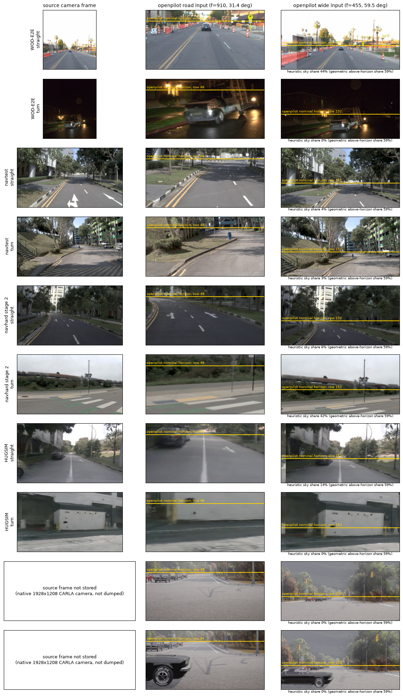

# Board views: what openpilot receives on each board (2026-10-04)

Question: openpilot is normal on WOD and abnormal on navtest / navhard / HUGSIM / B2D; do our camera adapters differ?
CPU only, from stored frames (WOD front3 shards, NAVSIM CAM_F0 JPEGs, HUGSIM run videos, B2D `lbx_dump_server` dumps).
Code: `scripts/bv_dump.py` (box), `scripts/bv_sheet.py` (Mac), `scripts/bv_hugsim_height.py`; numbers in `board_views_stats.json`.

What to look at: in every row the yellow line (openpilot's nominal horizon: row 47.6 road, 151.8 wide, the cy of its model
intrinsics) sits where the far end of the road is, within about 10 px on road and 3 px on wide (eyeballed on the straight scenes
at 1:1). So no board has a horizon problem: openpilot's own road frame is 81% below the horizon and its wide frame 41%, by design.
What differs between rows is the scale of the ground below the line (camera height) and how sharp the pixels are
(HUGSIM road rows are visibly blurry). B2D has no source column: the native 1928x1208 frames are not dumped.

## Table 1: source cameras and what the adapters do

| | WOD-E2E | navtest | navhard stage 2 | HUGSIM (nuScenes scenes) | B2D / CARLA closed loop |
|---|---|---|---|---|---|
| Source for road input | FRONT | CAM_F0 | CAM_F0 (3DGS render) | CAM_FRONT (800x450 render) | native "OP_ROAD" camera, f 2648, 1928x1208 |
| Source for wide input | FRONT 74% + FRONT_LEFT 13% + FRONT_RIGHT 13% (side cams yaw +-45 deg) | CAM_F0 only, 100% covered | same as navtest | CAM_FRONT 95%, FRONT_LEFT 4%, FRONT_RIGHT 0.5% | native "OP_WIDE" camera, f 567 (hfov 119 deg) |
| Source hfov / size / f | 47.2 deg, 972x1079, 1111 px | 63.7 deg, 1920x1080, 1545 px | same | 65.1 deg, 800x450, 626 px | road 40.0 deg, wide 119.1 deg |
| Source px per model px (road / wide) | 1.22 / 2.44 | 1.70 / 3.40 | 1.70 / 3.40 | 0.69 / 1.38 (upsampled) | 2.91 / 1.25 |
| Camera height above ground | 1.81 m (extrinsic z in WOD vehicle frame; ground at z = 0 assumed, not verified) | 1.87 m (decision 104: 1.53 above rear axle + 0.35) | 1.86 m (1.51 + 0.35) | 1.5 m recorded minus 0.3 m cam_rect = about 1.2 m (other datasets: PandaSet 2.3 - 0.7 = about 1.5, Waymo 2.1 - 0.3 = about 1.8, KITTI-360 about 1.5) | 1.43 m (OP_MOUNT_RIG, windshield top; 1.22 m puts the MKZ hood in frame) |
| Mounting pitch (compensated by the render) | -0.3 deg | -1.1 deg | -1.3 deg | 0 (KITTI-360: 5 deg) | 0 |
| Warp | rotation-only reprojection to level vehicle axes, nearest neighbour (`camgeom`) | same (`navsim_zs.OpenpilotMaps`) | same | same (`hugsim_zs.OpenpilotFrames`) | openpilot's own `get_warp_matrix` from the native cameras |
| Implied virtual camera | 1.81 m, pitch 0, road 31.4 deg, wide 59.5 deg | 1.87 m, same | 1.86 m, same | about 1.2 m, same | 1.43 m, same |
| Horizon row offset vs nominal (road / wide) | 0 by construction; eyeball about +10 / 0 px | 0; eyeball 0 / 0 | 0; eyeball about 0 / 0 | 0; eyeball about 0 / 0 | 0; eyeball about +8 / +3 px |
| Wide input sky vs ground, geometric | 59% above horizon / 41% below, every board (same intrinsics) | same | same | same | same |
| Wide input sky share, heuristic (straight / turn scene) | 44% / 0% (night) | 4% / 3% | 6% / 42% | 14% / 0% | 0% / 0% (overcast, grey) |
| Lane-width ratio model / map | not measurable (no map) | 0.67-0.70 (decision 104) | not measured separately | not measured | 0.82-0.89 (coarse, decision 104) |
| Plan speed at t0 / logged speed (Cinque) | 0.92 (n 252 rater frames, v > 3 m/s) | 0.81-0.84 (decision 104) | | not measured | |

Sky heuristic = bright blue-ish or low-chroma pixels above the nominal horizon connected to the top edge; it fails on trees, night
and overcast, so only the geometric split is a measurement. Predicted lane ratio from height alone is 1.22 / height: 0.67 at 1.81 m,
0.65 at 1.87 m, 0.85 at 1.43 m, 1.0 at 1.2 m.

## Reading

Evidence (measured here or in decision 104):
- The horizon is not the difference. All five adapters render a level virtual camera with openpilot's own intrinsics, so the far road
  ends at the nominal rows on the straight scenes of every board. The road input is mostly ground and the wide input 59% above the
  horizon on all of them, including WOD where openpilot behaves.
- The wide input does not need 120 deg: openpilot's own warp crops 59.5 deg (f 455 on 512 px) out of the 119 deg wide sensor (f 567), so
  our wide input has the same field of view as a real device's. What differs is the source: WOD builds it from three cameras (the
  front cameras idea is already in place there, 26% of pixels come from the side cameras and a brightness seam is visible), NAVSIM and
  HUGSIM crop it from the single front camera whose hfov (64-65 deg) just covers it.
- Camera height does vary: 1.81 (WOD), 1.87 / 1.86 (NAVSIM), about 1.2 (HUGSIM nuScenes scenes), 1.43 (B2D), against openpilot's 1.22.
  NAVSIM and B2D lane ratios (0.69, 0.82-0.89) follow the 1.22 / height prediction.
- HUGSIM road input is upsampled 1.45x from the 800x450 render (every other board downsamples), and the stored frames look soft.

Inference, not measured:
- WOD sits at 1.81 m, as high as NAVSIM, so a height-only story predicts a lane ratio near 0.67 on WOD as well. The plan-speed proxy
  disagrees (0.92 vs 0.81-0.84), but speed is a weak, prior-contaminated proxy and WOD has no map, so either the WOD vehicle-frame z
  is not height above ground (it was not verified), or openpilot's scale error is real on WOD and its rater-feedback score does not
  expose it. A lane-width read on WOD (from a map-free source such as the lane markings' known 3.5 m spacing, or a CAMH-style
  intervention scored on WOD RFS) would decide this; it is the one check that separates the two readings.
- HUGSIM (nuScenes scenes) at about 1.2 m should not have a scale problem from height; if HUGSIM openpilot is abnormal the cause is
  probably elsewhere (render softness, 0.3 m rect, closed-loop controller), not this camera height. The exam mixes four datasets with
  heights from 1.2 to 1.8 m, so per-dataset results would show it.
- Not checked: ego pitch and road slope (a 1 deg error is 16 px on road and 8 px on wide), the actual lane-line vanishing point per
  frame, and B2D source frames.

## Next cheapest checks
1. Per-dataset split of the HUGSIM exam (nuScenes about 1.2 m vs Waymo about 1.8 m scenes) against the height prediction.
2. WOD lane-width / scale read to settle whether 1.81 m is a real scale error there.
3. Dump B2D native OP_ROAD / OP_WIDE frames in one short run if a source column is wanted.

## WOD-E2E clip (2026-10-06)

[figs/wod_launch_turn.gif](../figs/wod_launch_turn.gif), `scripts/lbx_wod_clip.py make` (`pick` lists the candidates: val sequences with a launch
from standstill into a > 45 deg turn; the sharpest is taken; frames and numbers in `figs/wod_launch_turn.json`). Shipped Cinque fed as the WOD
harness feeds it (three cameras stitched, each 10 Hz frame twice, zero state 10 s before the first shown frame), open loop. Left the WOD FRONT
camera (WOD has no third-person view), middle a BEV in the rear-axle frame (grey logged past, green logged future, cyan the plan as scored),
right the road / wide model frames with the plan. Look at how early the cyan plan leaves the standstill and follows the green turn.
