# Loss budget 的典型例子（图和短片）

2026-10-04。[loss_budget.md](loss_budget.md) / [决策 103](../../../research/decisions/103.md) 里只有表，这里每个杠杆挑 2–3 个**典型**例子（取类内 score loss 最接近中位数的，不取最极端的）。每个例子都并排放两个视角：原始画面（nuPlan 前相机 / HUGSIM 的 BEV reconstruction / CARLA chase cam 或 BEV）和 **openpilot 真正吃进去的 road + wide 输入帧**（过了 adapter 的 warp / crop，叠了模型自己的 plan），每个例子下面写了模型视角里看得见什么、看不见什么。重点就是这个：很多丢分的原因在模型画面里根本不存在。

**读这页之前**
- 数字是 oracle 上限，不是可得增益；见 loss_budget.md。
- navhard / navtest 是 open loop，GIF 是对缓存 plan 的回放，没有重新推理。HUGSIM 的 GIF 是原运行自己的数据（按构造复现）；B2D 是同 arm、route、seed 的重跑或官方运行本身，每个例子写了有没有复现。
- 模型视角是重建的，不是 tensor dump：NAV 从原运行用过的 packed YUV 帧解码；HUGSIM 从 `video.mp4` 用 `OpenpilotFrames` 的 gather 重建（差 mp4 压缩）；B2D 的 `drive`、`pbyp*`、`vmerge2` 例子是带帧转储的重跑（openpilot server 把喂给网络的 road / wide 帧和模型输出逐 10 Hz 存下来，见下），不是重建；红灯组的 `vred` 例子（R1 的 `vred`、R2、R3）仍从 `vlm_frames/`（只在 VLM 发请求时存，约 2 Hz）重建，差 JPEG 损失、显示 RGB。
- HUGSIM 没存 chase cam，左边是 BEV reconstruction，不是渲染。
- **对已有结论的一处修正线索（B2D 17280）**：画面支持 `vmerge_collisions.md` 的修正说法，不是「停在 stop sign 前被撞」，而是 R3 停 / 爬到约 13.5 s、放行加速后在路口里 17.7 s 被警车撞；第 95 条和 vmerge2.md 里的「停着被撞」说法需要改（见 B2D 的 C5）。这里没有改 decisions。
- 媒体约 157 MB，在 `../figs/loss_budget_examples/`。

## NAVSIM 两榜（navhard two-stage、navtest）：每类的典型 token

各杠杆值多少（oracle 上限，原生 Cinque；括号里是 it_dw3 + selector 还剩的上限，数字来自第 103 条 / loss_budget.md）：

- **off-road，model road edge 偏宽**（navhard 专属，只算了原生）：navhard 395 个 token，上限 5.6 分，是决策 88 三类里最大的一类。
- **early clip**：navhard 198 个，3.7（2.3）；navtest 只有 9 个，0.07，基本是空的。
- **wrong direction**：navhard 172 个，1.9（0.9），selector 已经拿走一半多；navtest 15 个，0.09。
- **collision（NC 或 TTC）**：navhard 328 个，2.7（2.9）；navtest 579 个，3.2（3.2）。这是两榜上唯一没降下来的杠杆。
- **stopped / too slow**：navhard 980 个，7.0（3.2）；navtest 263 个，0.9（0.7）。
- **turn missed, no command**：navhard 358 个，3.2（3.0）；navtest 160 个，0.6（0.7）。

**怎么选的。** 先在 box 上用 `loss_budget_nav.py` 自己的 `tables` / `geometry` 重算每个 token 的类别归属（跟 loss_budget 的数字是同一套定义，类别之间有重叠）。每类按 per-token score loss 排序（loss = 参考 token 分减原生 token 分，下限截到 0；navhard 的参考是 PDM-Closed，navtest 是 human），从最接近类中位数的开始挑，每个 log 只用一次，各类之间也不重复用 log。navhard 每类 3 个；navtest 的 early clip（9）和 wrong direction（15）只挑了 2 个，样本太少，只能当示意，不能说「典型」。navtest 的 road-edge 类没有定义（它只在 navhard stage 2 上算过），跳过。下面写的「rank」是这个 token 的 loss 在本类里的名次。注意 per-token loss 不是榜单分：navhard 是 two-stage 加权聚合，一个 token 掉 0.87 并不等于榜上掉 0.87 分。

**画面怎么读。** 每个 GIF 四块：

- 左上：原始 nuPlan CAM_F0（t0 关键帧；输入阶段显示 ≤ t 的最近关键帧），叠加 scorer 的 drivable area 边界（黄）、route lane（细白）、参考轨迹（绿：navhard 是 PDM reference，navtest 是 human）、原生 plan（蓝）和 best driver 的 plan（橙），每条轨迹在时刻 t 的位置画一个点。
- 右上：BEV（t0 的 ego 坐标系，x 朝上），三条轨迹用 scorer 自己的 LQR + bicycle replay 画出 t 时刻的车框。蓝框变红表示原生 ego 有角出了 drivable area，红色 agent 表示和原生 ego 框重叠。navhard 的 agent 是 scorer 的 reactive traffic，按原生 plan 模拟（best 和参考 plan 下这些 agent 的走法会不一样）；navtest（v1）是 log replay。
- 下面两块：openpilot 真正吃进去的 tensor（road：910 px focal；wide：455 px），是从原生 run 用过的 packed YUV420 帧解码出来的，包括 4 个关键帧（navsim_zs frames cache）和 6 个 GIMM 插帧（op_lb `gimm.npy`）。上面叠加同样的地图和轨迹，plan 阶段再加原生模型自己输出的 road edge（红）和 lane line（粉，p > 0.3），画 3–60 m。
- 时间轴：先按模型自己的帧时间走一遍 1.5 s 输入历史（-1.5、-1.4、-1.2 … 0 s，每帧标了 key 还是 GIMM），然后以 0.2 s 一步走完 4 s plan（约 1.7x speed，画面上有标），最后一帧停 2.5 s。
- 两点 caveat：(1) best driver（it_dw3 + selector `al-sel-rot0-r0.6`）有一部分 token 用的是 rot0 对齐后的历史，下面画的模型视图是原生 run 的输入，不一定是 best 看到的；(2) navhard stage 2 的画面是合成的（重建渲染），有拖影和鬼影，模型看到的就是这些。

**复现。** 下面每个 GIF 都是拿缓存的 pose 文件重放，不是重新推理。重放出来的 drivable-area 出界和每个 token 官方 CSV 的 DAC 一一对得上（31/31：DAC 0 的 token 在 GIF 里都有出界时刻，DAC 1 的都没有）。NC = 0 的 7 个 token 在 BEV 里都有 agent 和原生框重叠；NC = 1 但框也重叠的 3 个 navtest token（4d0c、673a、ac53）都是 log replay 里后车追尾停着或很慢的 ego，scorer 不算 at-fault，这也对得上。TTC 失败本身在 GIF 里看不出来，只能读 header 上的分项。

### navhard

#### off-road，road edge 偏宽

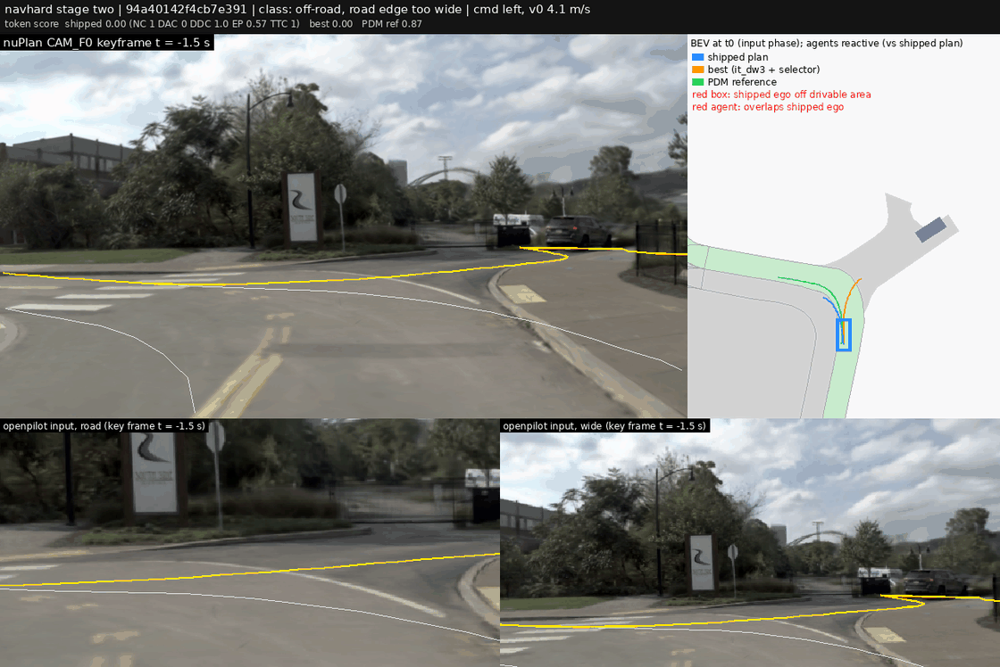

- `94a40142f4cb7e391`，stage 2，cmd left，v0 4.1 m/s，log `2021.09.16.19.27.01_veh-45_01749_03230`。loss 0.874（类中位数 0.874，rank 197/395）；模型在出界那个角上的 road edge 比地图边界宽 6.4 m。
- 看什么：PDM reference 向左拐进路口。原生 plan 左转不够、速度也慢（EP 0.57），3.6 s 时左前角压出了路口内侧的边界。best 直接往右前方走，同样 DAC 0。
- 模型视图：路口内侧的路沿和草地都在 road crop 里，黄线（地图边界）也在画面中。但模型自己的左 road edge（红）画在路沿外面、草地上方很远的地方，和第 88 条说的「road edge 偏宽」一致。
- 原生 0.00 / best 0.00 / ref 0.87，best 没修好（best 的 road-edge 归类没有算）。

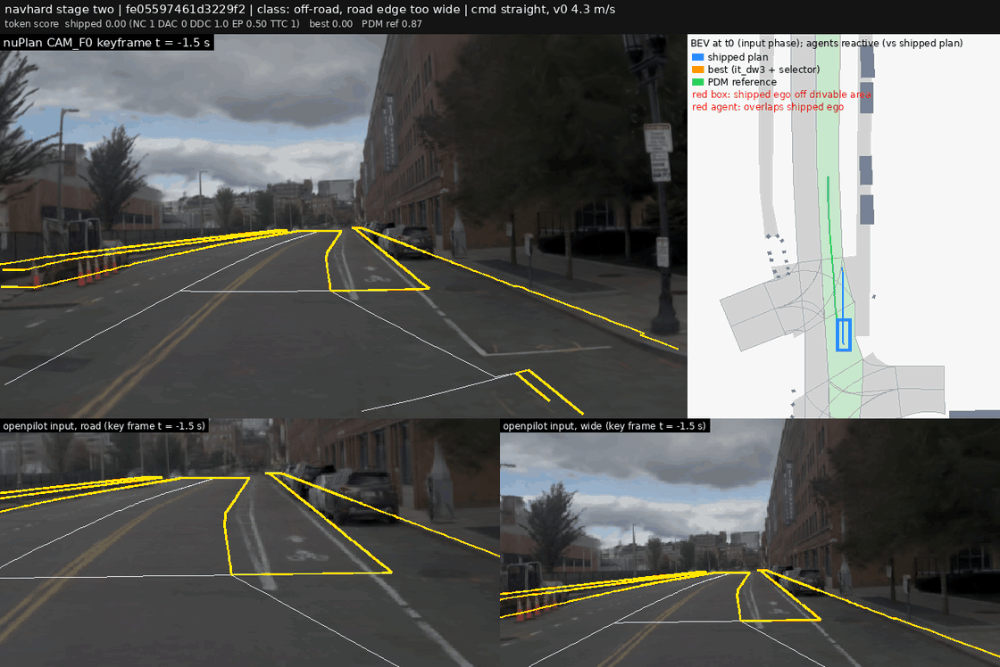

- `fe05597461d3229f2`，stage 2，cmd straight，v0 4.3 m/s，log `2021.09.29.19.02.14_veh-28_02451_02708`。loss 0.874（rank 196/395），edge 误差 2.1 m。
- 看什么：stage 2 把 ego 挪到了右边自行车道上，正前方是地图上一块不可行驶的岛（黄线围出来的口袋）。参考轨迹向左并回车道。原生和 best 都沿着自行车道直走，3.0 s 时进了那个口袋，而且都只走了一半（EP 0.50）。
- 模型视图：岛的轮廓、左边的车道都在 road crop 里，看得见。模型的右 road edge 却画在停着的车后面的人行道上，左右两条 lane line（粉）把自行车道也算成车道。也就是说，模型认为脚下这条道是正常车道。
- 原生 0.00 / best 0.00 / ref 0.87。

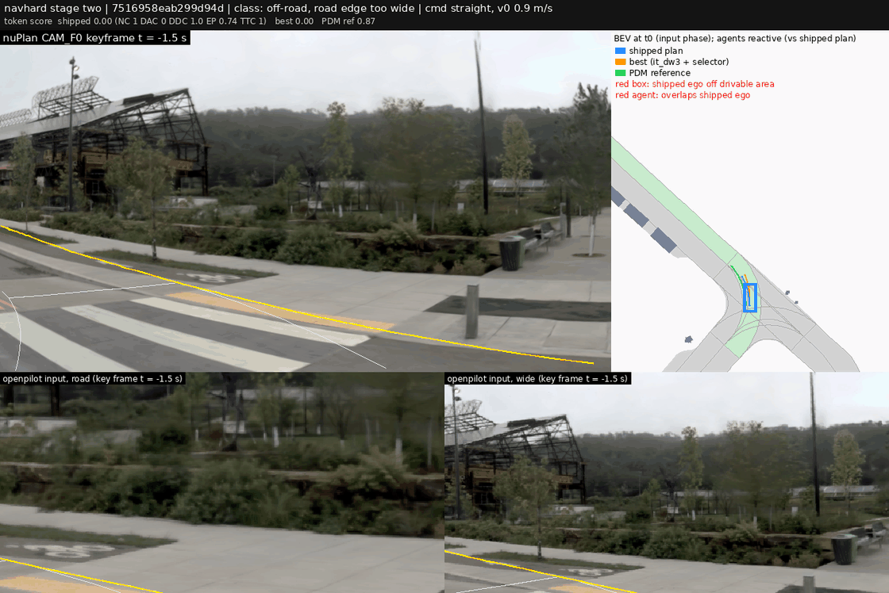

- `7516958eab299d94d`，stage 2，cmd straight，v0 0.9 m/s，log `2021.09.16.13.53.10_veh-42_00180_00342`。loss 0.874（rank 195/395），edge 误差 1.7 m。
- 看什么：ego 在路口里斜对着街角（相对道路向右偏约 45°）。参考轨迹向左摆回道路方向；原生和 best 都基本沿车头方向往前蹭，2.8 s 时右前角出了路口。
- 模型视图：road crop 里几乎只有人行道、草和灌木，道路在左下角只露出一角。wide 里能看到斑马线和左边的路。模型的两条 road edge 张得很开，把人行道也包了进去。
- 原生 0.00 / best 0.00 / ref 0.87。

#### early clip

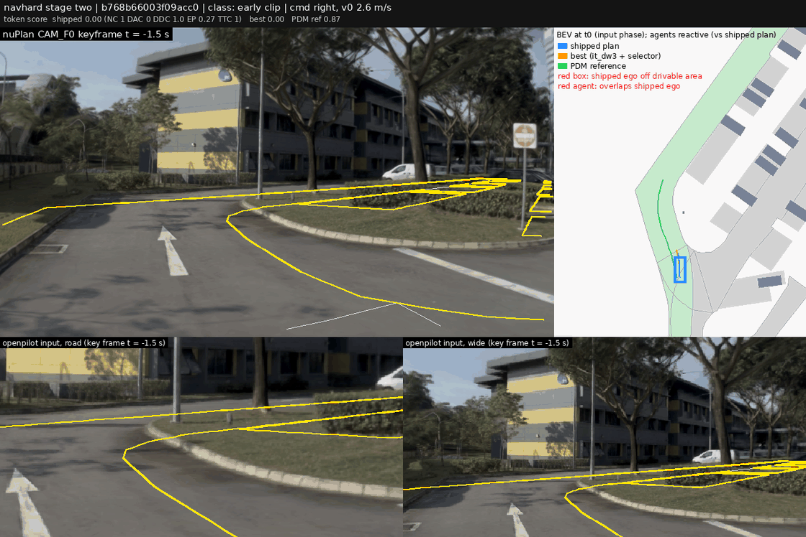

- `b768b66003f09acc0`，stage 2，cmd right，v0 2.6 m/s，log `2021.10.06.08.16.17_veh-52_01949_02501`。loss 0.874（中位数 0.873，rank 99/198）。这个 token 同时也算 stopped 和 no-command。
- 看什么：ego 起步就偏在右边，车头对着路边的草地安全岛。参考轨迹沿道路向前偏左；原生和 best 往前直走得又慢又短（EP 0.27），1.3 s 时压上路沿。
- 模型视图：路沿和草岛就在 road crop 的正中间，看得很清楚；可走的那条路只在 road crop 左边缘露出一点，wide 里完整。模型的 road edge 横穿草岛，和第 88 条一样，它把草岛当成了路面。
- 原生 0.00 / best 0.00，best 也是 early clip。

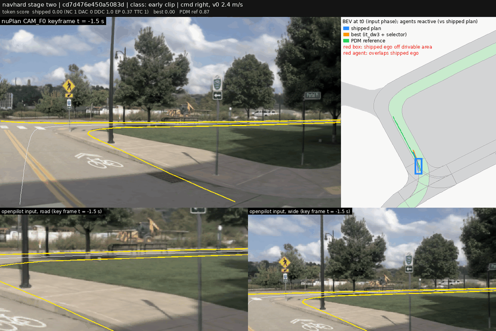

- `cd7d476e450a5083d`，stage 2，cmd right，v0 2.4 m/s，log `2021.09.16.19.12.04_veh-42_01438_01677`。loss 0.873（rank 98/198），同时算 road-edge 偏宽和 stopped。
- 看什么：ego 被挪到路右侧、贴着人行道和自行车道标线，参考轨迹向左回到车道。原生直走，1.0 s 就出界。
- 模型视图：road crop 里主要是人行道、草坪和路灯杆，车道在左边缘外。wide 里能看到车道和斑马线。模型的 road edge 又画在人行道外面。
- 原生 0.00 / best 0.00，best 同类。

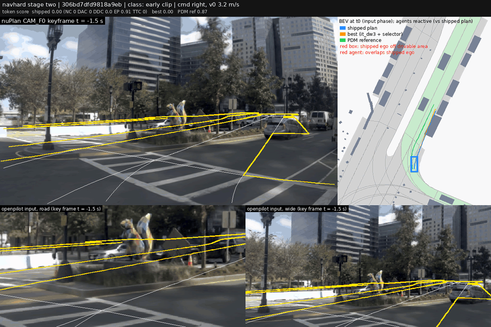

- `306bd7dfd9818a9eb`，stage 2，cmd right，v0 3.2 m/s，log `2021.09.29.15.23.04_veh-28_00814_01101`。loss 0.874（rank 101/198），同时算 road-edge 和 collision。
- 看什么：ego 被挪进停车带 / 公交站，正前方停着一辆公交车。参考轨迹向左并入车道。原生和 best 都直着朝公交车走，1.1 s 出界，2.0 s 撞上公交车（BEV 里那辆车变红）。
- 模型视图：road crop 朝向左前方的中央隔离带，公交车几乎在 road crop 外，只在 wide 的右下角看得到。原生 NC 0 / DAC 0 / DDC 0，best 也一样。

#### wrong direction

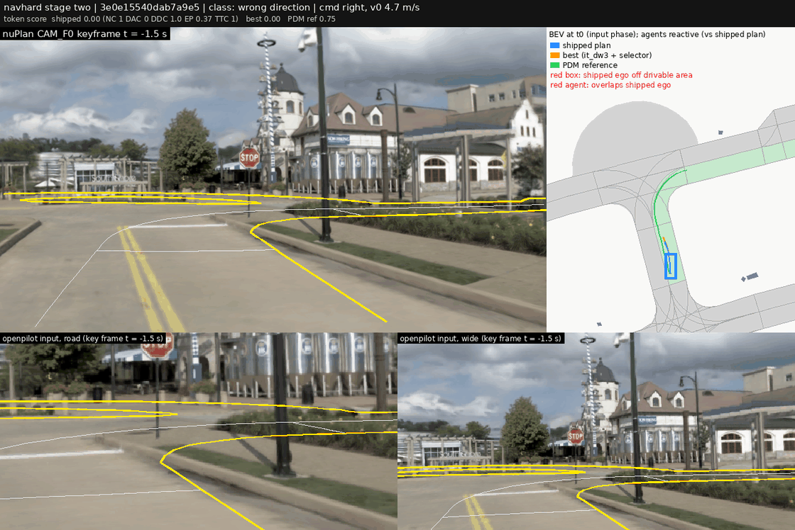

- `3e0e15540dab7a9e5`，stage 2，cmd right，v0 4.7 m/s，log `2021.09.16.19.49.00_veh-42_00990_01609`。loss 0.749（中位数 0.749，rank 86/172），同时算 early clip、stopped 和 no-command。
- 看什么：ego 朝着路右侧的草岛，参考轨迹向左走回道路。原生和 best 往右前方走，0.6 s 就出界，plan 终点落在参考的另一侧。
- 模型视图：草岛和它的路沿在 road crop 中间，向左的路在 crop 左半边，两样都看得到；模型的 road edge 仍然横穿草岛。原生 0.00 / best 0.00，best 同类。

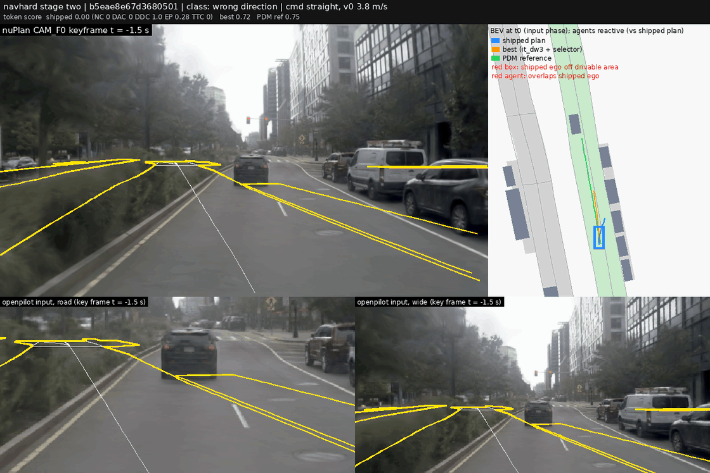

- `b5eae8e67d3680501`，stage 2，cmd straight，v0 3.8 m/s，log `2021.08.30.13.45.25_veh-40_01116_01336`。loss 0.749（rank 85/172），同时算 road-edge、collision 和 stopped。
- 看什么：这一例可以直接对比原生和 best。原生向右偏，2.1 s 擦上路边一排停着的车（白色厢式车那一侧），同时出界。best 基本直走，0.72，接近参考的 0.75。
- 模型视图：停着的车和厢式车在 road crop 右半边，很清楚；模型的右 road edge 却在这些车外侧。

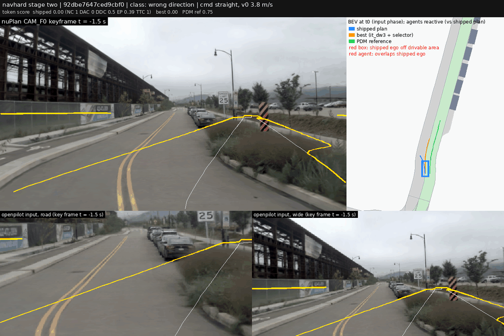

- `92dbe7647ced9cbf0`，stage 2，cmd straight，v0 3.8 m/s，log `2021.09.16.14.39.34_veh-42_00032_00186`。loss 0.749（rank 87/172）。
- 看什么：ego 被挪到双黄线附近，参考轨迹向右回到本车道。原生和 best 都向左，1.9 s 压出左侧边界（DDC 0.5）。
- 模型视图：双黄线、左侧自行车道和隔离墙都在 road crop 里；模型的左 road edge 一直延伸到墙脚。原生 0.00 / best 0.00；best 这次没被归成 wrong direction，但同样 DAC 0。

#### collision

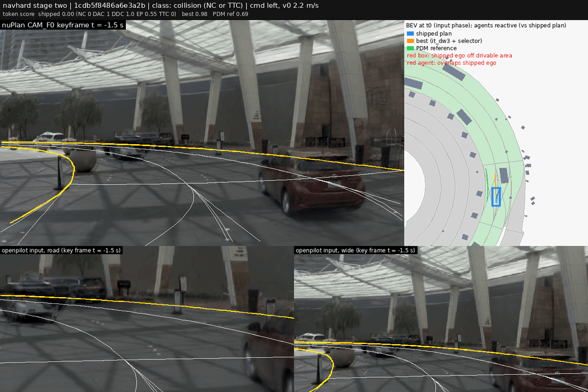

- `1cdb5f8486a6e3a2b`，stage 2，cmd left，v0 2.2 m/s，log `2021.06.28.20.24.43_veh-38_03385_04952`（Las Vegas 室内落客区）。loss 0.687（中位数 0.687，rank 163/328）。
- 看什么：右边很近有一辆车（渲染出来的红色轿车）。1.0 s 时 reactive 的这辆车和原生框重叠（NC 0）。best 0.98，这个 token 上 best 修好了。但头 1 s 两条 plan 几乎重合，差别应该来自之后的速度，以及 reactive agent 对不同 plan 的反应，这里只画了针对原生 plan 的 agent。参考自己 TTC 0（0.69）。
- 模型视图：这辆车在 road crop 右下角只露出一部分，在 wide 右下角能看到。

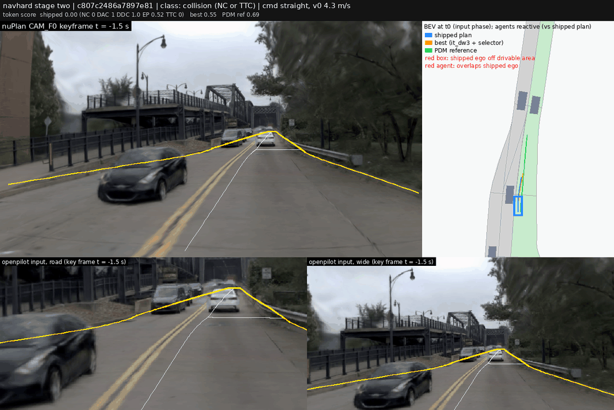

- `c807c2486a7897e81`，stage 2，cmd straight，v0 4.3 m/s，log `2021.09.16.15.47.30_veh-45_01199_01391`。loss 0.688（rank 164/328）。
- 看什么：ego 被挪到双黄线旁边，对向车道上一辆深色轿车正从左边擦过来。输入的 -1.5 s 帧里它在左前方，t0 时已经到了 ego 左侧，是 CAM_F0 左下角那团模糊。原生向左偏，0.4 s 就和它重叠（NC 0）。best 0.55，NC 1 但 TTC 0。
- 模型视图：在 t0 帧里，这辆车已经出了 road crop，wide 左下角也只剩一点拖影。模型在历史帧里见过它，但 t0 那一刻基本看不到。

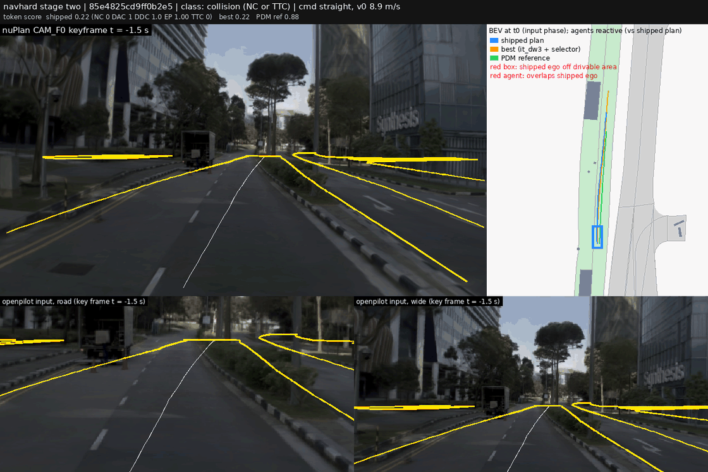

- `85e4825cd9ff0b2e5`，stage 2，cmd straight，v0 8.9 m/s，log `2021.10.06.07.26.10_veh-52_01245_02064`。loss 0.656（rank 161/328，比中位数低 0.03）。
- 看什么：直路，原生 plan 略向左。1.8 s 时 BEV 里车道中间有一个很小的 agent（行人或自行车大小）和原生框重叠，NC 0、TTC 0。best 是同一个结果，0.22。
- 模型视图：左边停着的卡车和锥桶都在 road crop 里，模型的 lane line 和 road edge 跟地图对得很好。但在 BEV 里那个 agent 所在的位置（约 16 m 前），CAM_F0 和两个模型帧里都看不到明显的东西。可能是合成画面里没渲染出这个小目标，这一点没有核实。

#### stopped / too slow

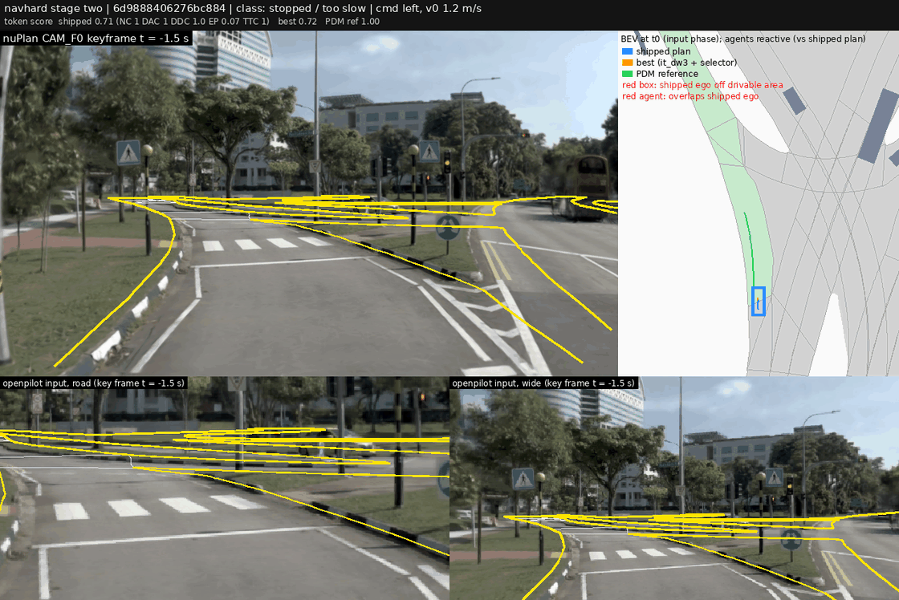

- `6d9888406276bc884`，stage 2，cmd left，v0 1.2 m/s，log `2021.10.06.07.26.10_veh-52_02208_02394`。loss 0.289（中位数 0.289，rank 490/980）。
- 看什么：ego 停在斑马线前，PDM reference 慢慢左转过路口。原生（EP 0.07）和 best（0.09）都原地不动。BEV 里斑马线上和路口里都没有 agent。
- 模型视图：空的斑马线和路口在 road crop 里看得很清楚，没有前车。原生 0.71 / best 0.72 / ref 1.00。

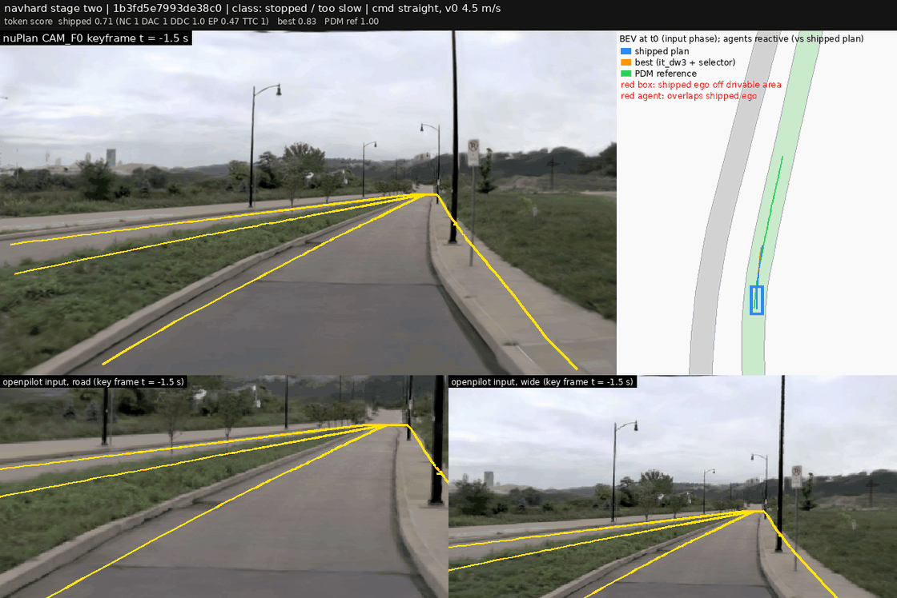

- `1b3fd5e7993de38c0`，stage 2，cmd straight，v0 4.5 m/s，log `2021.08.16.14.23.37_veh-45_00015_00132`。loss 0.289（rank 487/980）。
- 看什么：空直路，原生 plan 只走了参考的一半（EP 0.47），一路减速。best 0.83（EP 0.45，比原生还低，分差来自 lane keeping / comfort 项），按失败定义算，best 在这里不算失败。
- 模型视图：前方 100 m 内的路是空的，road crop 里看得到；模型的左 road edge 横穿中间的草坪隔离带。

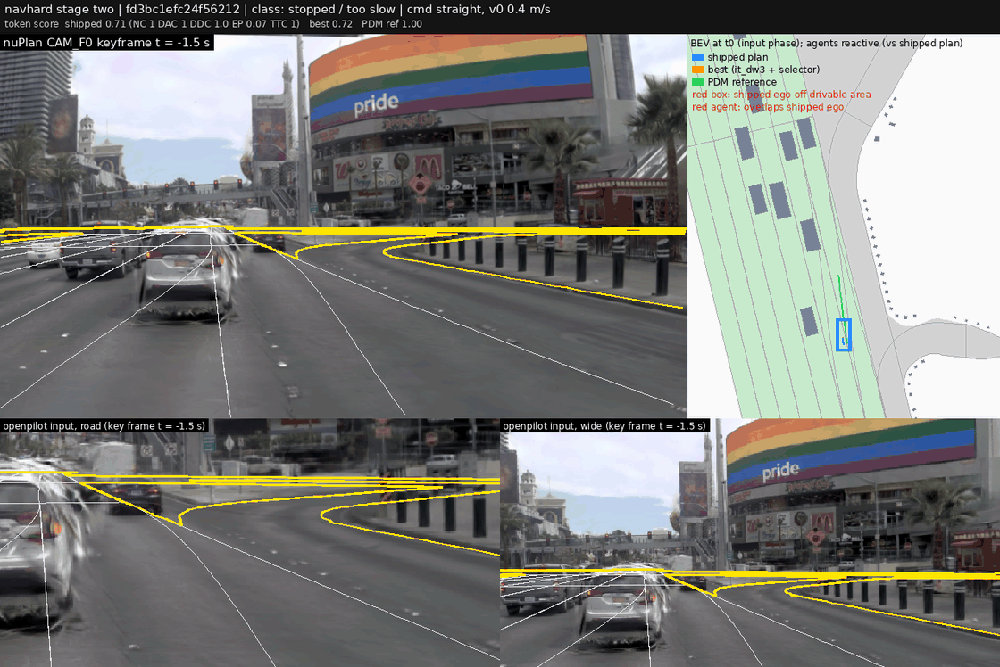

- `fd3bc1efc24f56212`，stage 2，cmd straight，v0 0.4 m/s，log `2021.06.28.16.29.11_veh-38_03263_03766`（Las Vegas Strip）。loss 0.288（rank 486/980）。
- 看什么：左边几条车道有车，ego 所在车道前方十几米是空的，参考轨迹慢慢起步。原生和 best 都不动（EP 0.07）。
- 模型视图：左边车辆的合成渲染拖影很重，在 road crop 和 wide 里都是一团一团的鬼影；本车道前方是空的。原生 0.71 / best 0.72。

#### turn missed, no command

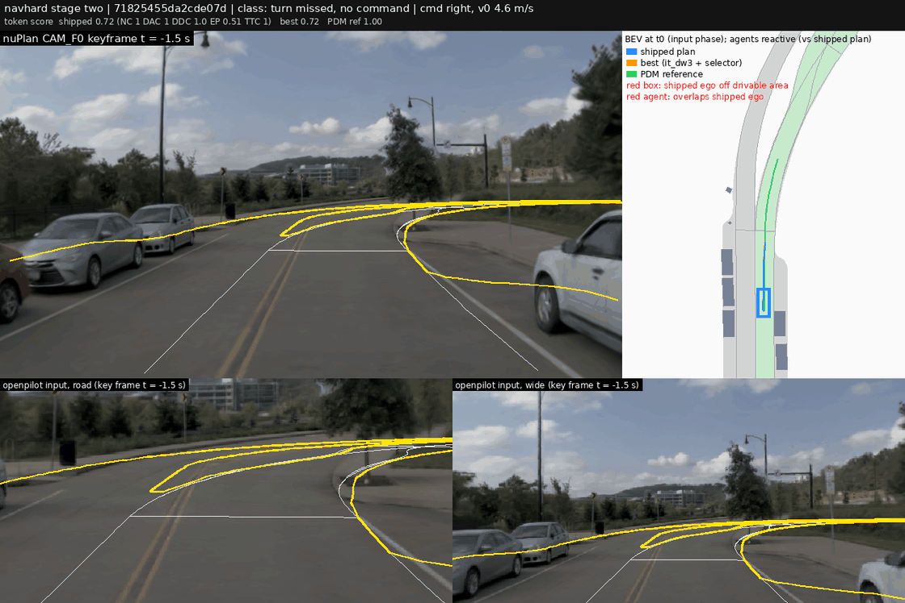

- `71825455da2cde07d`，stage 2，cmd right，v0 4.6 m/s，log `2021.09.16.19.27.01_veh-45_00472_00711`。loss 0.278（中位数 0.278，rank 179/358）。
- 看什么：Y 形岔口，route 走右支。原生和 best 沿左支直走，而且慢（EP 0.51）。
- 模型视图：两条支路在 road crop 里都看得到，模型的 lane line（粉）跟的是左支。没有 command 的话，它没有理由选右边。原生 0.72 / best 0.72 / ref 1.00。

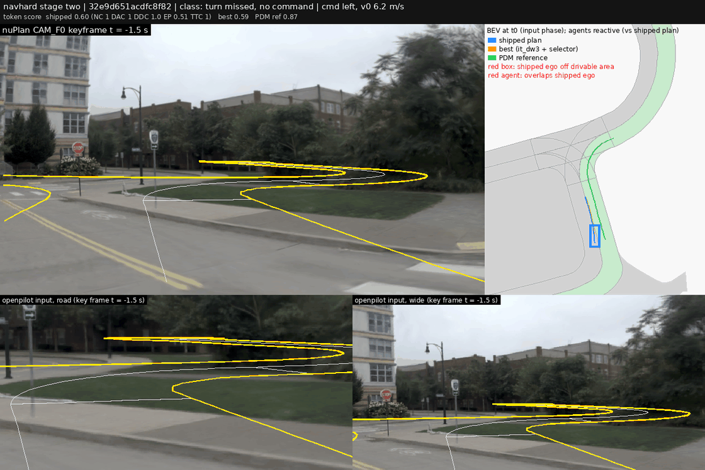

- `32e9d651acdfc8f82`，stage 2，cmd left，v0 6.2 m/s，log `2021.09.16.14.39.34_veh-42_00297_00935`。loss 0.276（rank 175/358），同时也是 wrong direction。
- 看什么：参考轨迹过斑马线后沿 S 弯向左；原生和 best 沿左侧自行车道边直走，没转。
- 模型视图：S 弯的入口和斑马线在 road crop 里，左转后的路段在 wide 的左半边。原生 0.60 / best 0.59 / ref 0.87。

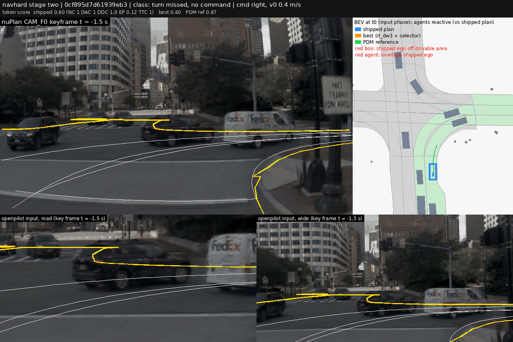

- `0cf895d7d61939eb3`，stage 2，cmd right，v0 0.4 m/s，log `2021.09.29.19.02.14_veh-28_00964_01689`。loss 0.275（rank 174/358），同时算 stopped。
- 看什么：停在路口，参考轨迹右转，原生和 best 不动（EP 0.12）。
- 模型视图：右转后的车道在 road crop 右边缘外，wide 里能看到一部分（FedEx 货车那边）。

### navtest

#### early clip（9 个 token，只挑了 2 个）

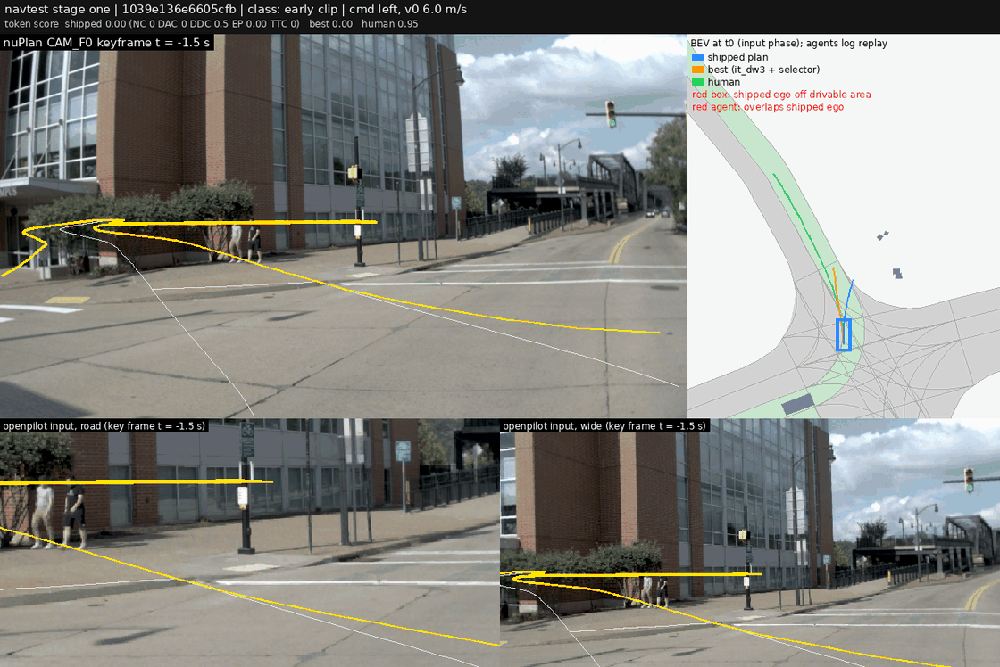

- `1039e136e6605cfb`，cmd left，v0 6.0 m/s，log `2021.09.16.19.27.01_veh-45_01749_03230`。loss 0.955（中位数 0.955，rank 4/9）。这个 token 同时算 wrong direction、collision、stopped 和 no-command，9 个里本来就挑不出「纯」的。
- 看什么：human 在路口左转。原生向右，1.1 s 出界，3.7 s 撞上右边路沿外的一个 agent。best 直走，同样出界（0.00）。
- 模型视图：左转后的路在 road crop 左边和 wide 里都看得到，右侧路沿和消防栓也都在画面里。

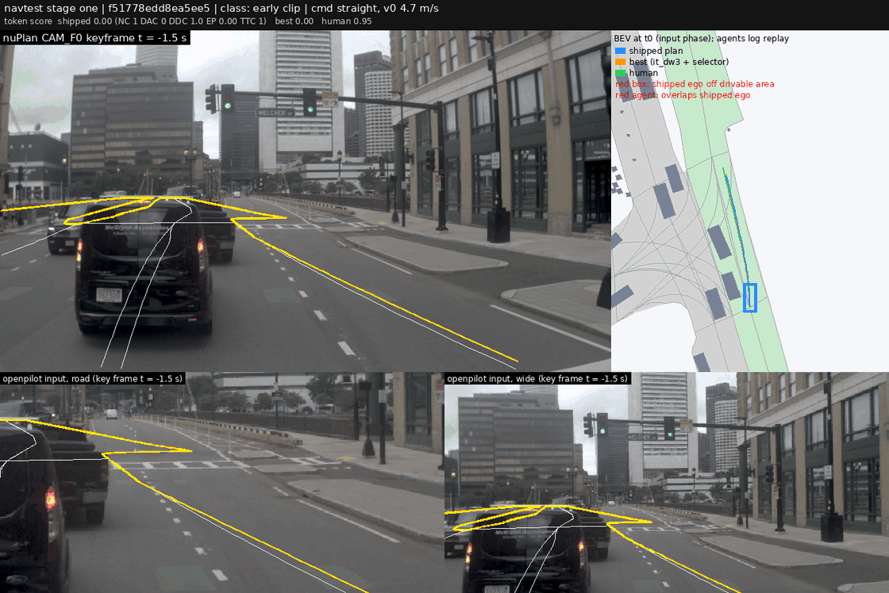

- `f51778edd8ea5ee5`，cmd straight，v0 4.7 m/s，log `2021.08.30.16.16.44_veh-40_00256_00716`。loss 0.946（rank 3/9）。
- 看什么：原生、best、human 三条线几乎重合，原生只比 human 略偏右。1.5 s 时车框右边擦到了地图边界，就是斑马线前路缘外扩的那一块，于是 DAC 0。这是地图多边形和 plan 的 sub-metre 偏差，看画面看不出是驾驶错误。
- 模型视图：路缘外扩和斑马线都在 road crop 里；模型的右 road edge 在人行道外侧。原生 0.00 / best 0.00 / human 0.95。

#### wrong direction（15 个 token，只挑了 2 个）

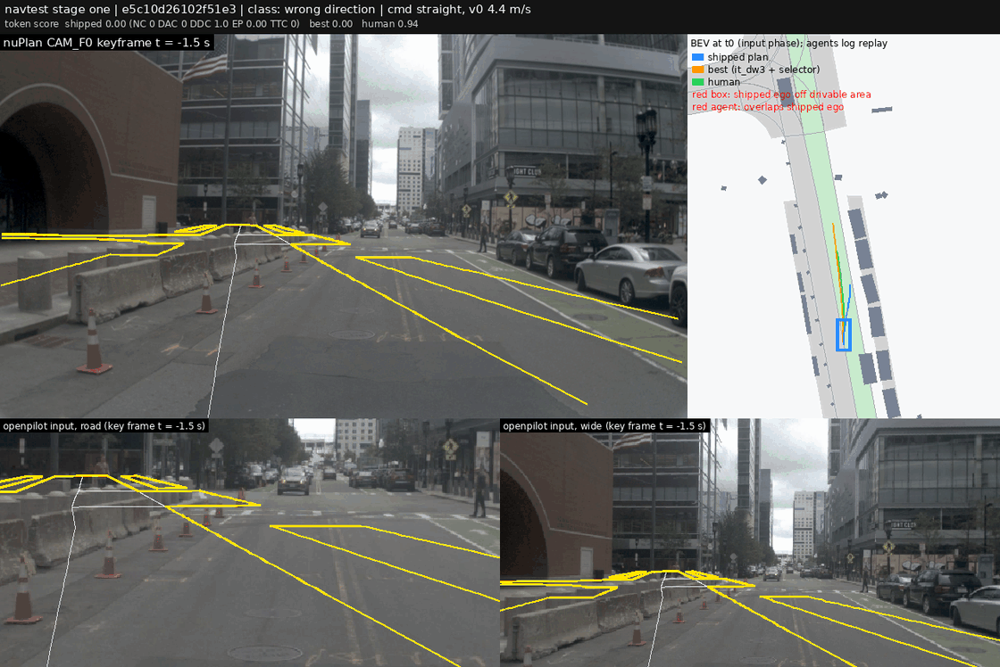

- `e5c10d26102f51e3`，cmd straight，v0 4.4 m/s，log `2021.08.30.16.16.44_veh-40_00779_01088`。loss 0.939（中位数 0.939，rank 7/15）。
- 看什么：直路，原生向右拐进路边停着的车，1.2 s 出界，2.7 s 撞车。best 稍微偏左，没撞，但还是 DAC 0。
- 模型视图：右边那排停着的车在 road crop 右半边，很清楚。

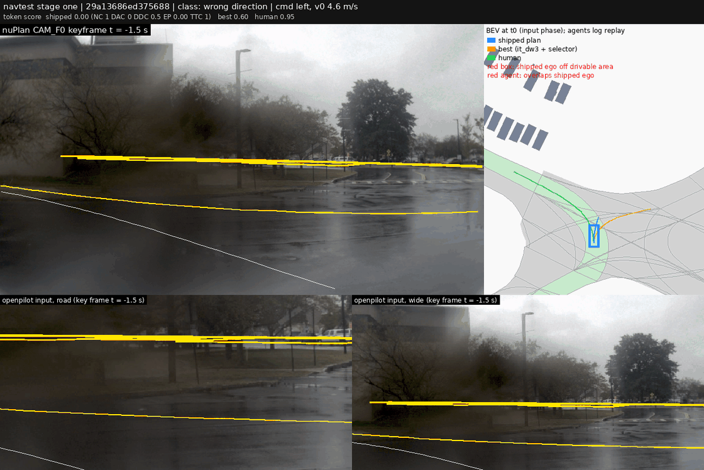

- `29a13686ed375688`，cmd left，v0 4.6 m/s，log `2021.09.09.18.29.25_veh-39_01622_01766`。loss 0.952（rank 9/15）。
- 看什么：路口，human 左转；原生直走，2.9 s 冲出路口对面。best 反而右转，0.60（DAC 1，DDC 0.5）。
- 模型视图：镜头中间有一大块污渍 / 水渍，CAM_F0 和两个模型帧里都有，road crop 中心基本被遮住。左转后的路只在 wide 左边看得到。

#### collision

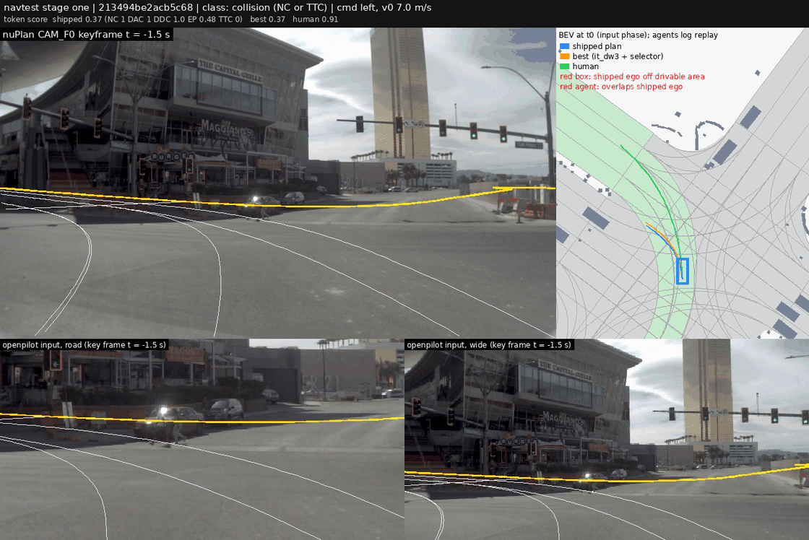

- `213494be2acb5c68`，cmd left，v0 7.0 m/s，log `2021.05.25.17.54.41_veh-35_01654_01850`（Las Vegas）。loss 0.540（中位数 0.540，rank 289/579）。
- 看什么：路口左转，原生和 best 都比 human 转得早、转得紧，而且偏慢（EP 0.48）。NC 1，TTC 0。navtest 这一类的中位数 0.54 基本就是「只丢了 TTC」：v1 PDMS 里 TTC 0 扣 5/12。
- 模型视图：路口和对面的行人都在 road crop 里，左转后的去向在 wide 左边。best 和原生一样（0.37）。

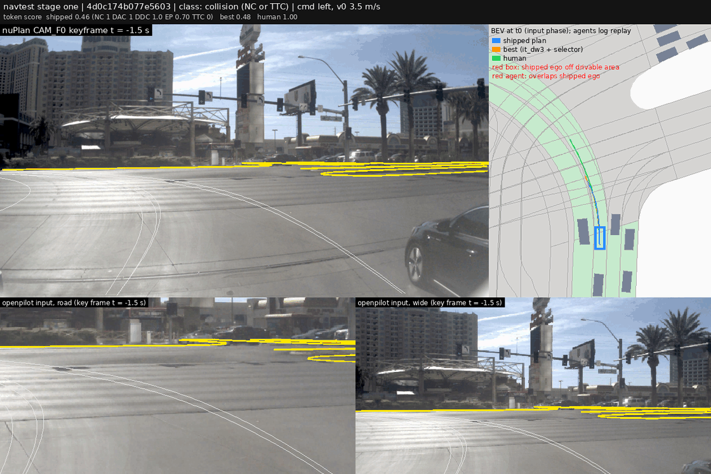

- `4d0c174b077e5603`，cmd left，v0 3.5 m/s，log `2021.06.28.15.02.02_veh-38_02398_02848`。loss 0.540（rank 288/579）。
- 看什么：左转时 plan 和 human 几乎重合，只是更慢（EP 0.70）。log replay 里的后车按原来的速度跟上来，3.9 s 和原生框重叠。scorer 不算 at-fault（NC 1），只扣 TTC。这是非 reactive 评分的典型问题：慢了就会被后车「顶」。
- 模型视图：后车在任何前向画面里都看不到。

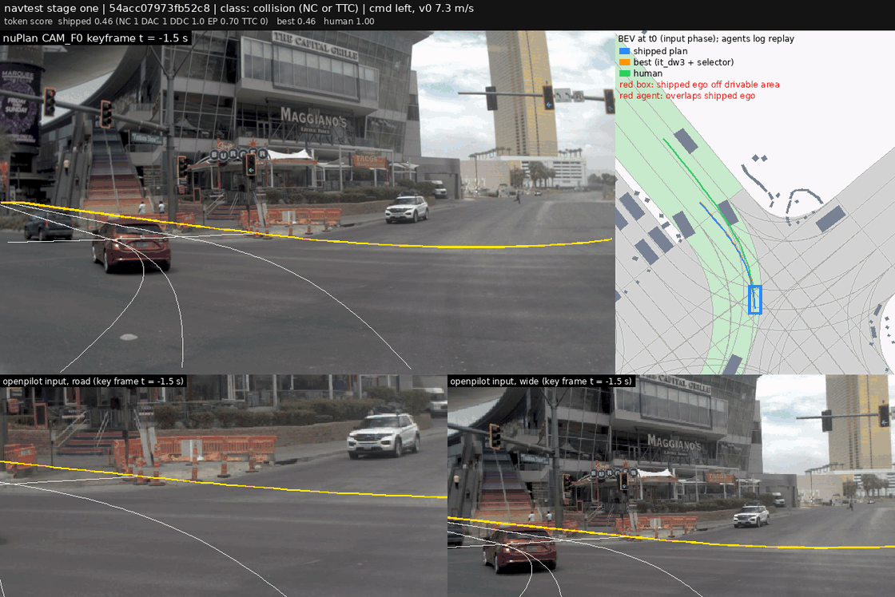

- `54acc07973fb52c8`，cmd left，v0 7.3 m/s，log `2021.06.03.13.55.17_veh-35_02419_02561`（Las Vegas）。loss 0.541（rank 290/579）。
- 看什么：左转时原生和 best 比 human 切得更靠内侧，离左前方那辆橙红色的车更近，TTC 0。
- 模型视图：这辆车在 road crop 左边缘，只露出一半，wide 里是完整的。

#### stopped / too slow

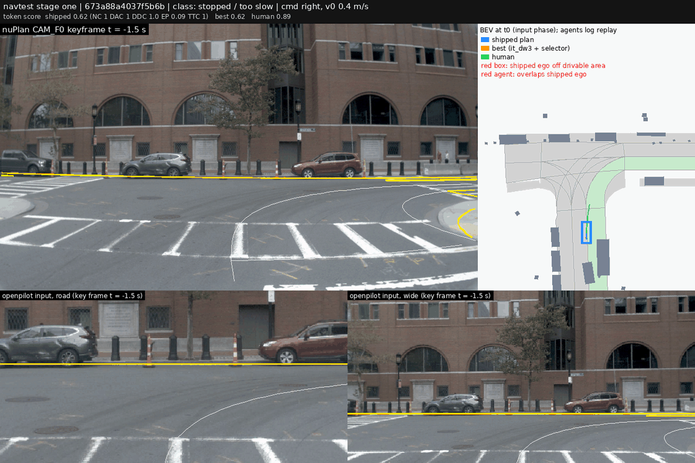

- `673a88a4037f5b6b`，cmd right，v0 0.4 m/s，log `2021.08.30.14.54.34_veh-40_00439_00835`。loss 0.269（中位数 0.269，rank 131/263）。
- 看什么：停在 T 字路口，human 右转，原生和 best 不动（EP 0.09）。4.0 s 时 log 里的后车和原生框重叠，不算 at-fault。
- 模型视图：road crop 正对着对面的建筑和停着的车，右转后的车道在 crop 外，wide 右边缘只能看到路口的弧。

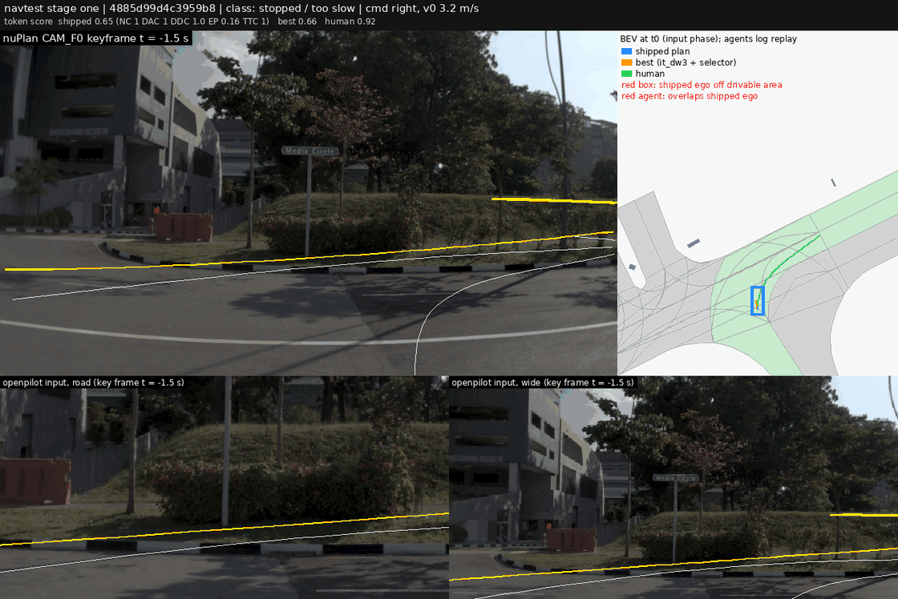

- `4885d99d4c3959b8`，cmd right，v0 3.2 m/s，log `2021.10.06.08.16.17_veh-52_01949_02501`（Singapore）。loss 0.269（rank 132/263）。
- 看什么：human 右转进路口，原生和 best 减速停下（EP 0.16）。
- 模型视图：两个 crop 都正对着路口对面的灌木和隔离带。模型的两条 road edge（红）在正前方收拢，在模型眼里前面是一条走到头的路，所以它停了；右转后的路在 road crop 外。

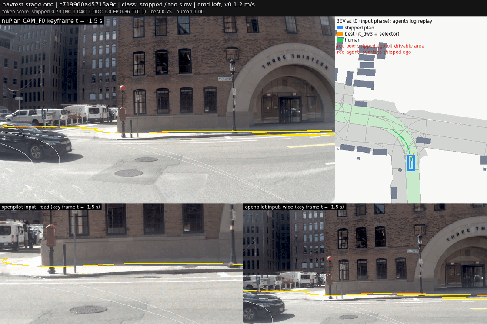

- `c719960a45715a9c`，cmd left，v0 1.2 m/s，log `2021.09.29.14.44.26_veh-28_01059_01191`。loss 0.268（rank 130/263）。
- 看什么：路口，human 左转；原生几乎不动（EP 0.36），右边一辆黑色轿车正在横穿路口。
- 模型视图：road crop 正对对面的建筑，左转后的路在 crop 左边外，wide 左半边能看到；那辆黑车在 wide 右下角。

#### turn missed, no command

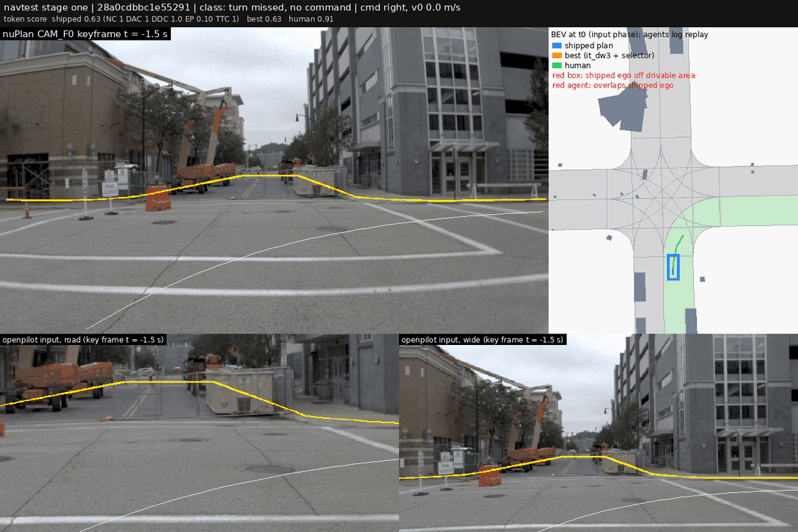

- `28a0cdbbc1e55291`，cmd right，v0 0.0 m/s，log `2021.09.16.15.47.30_veh-45_01199_01391`。loss 0.284（中位数 0.277，rank 80/160）。
- 看什么：停在十字路口，前方施工、有围挡，human 右转，原生和 best 不动。
- 模型视图：施工围挡和吊车在 road crop 正中间，右转后的路在 crop 外，wide 右边能看到一部分。

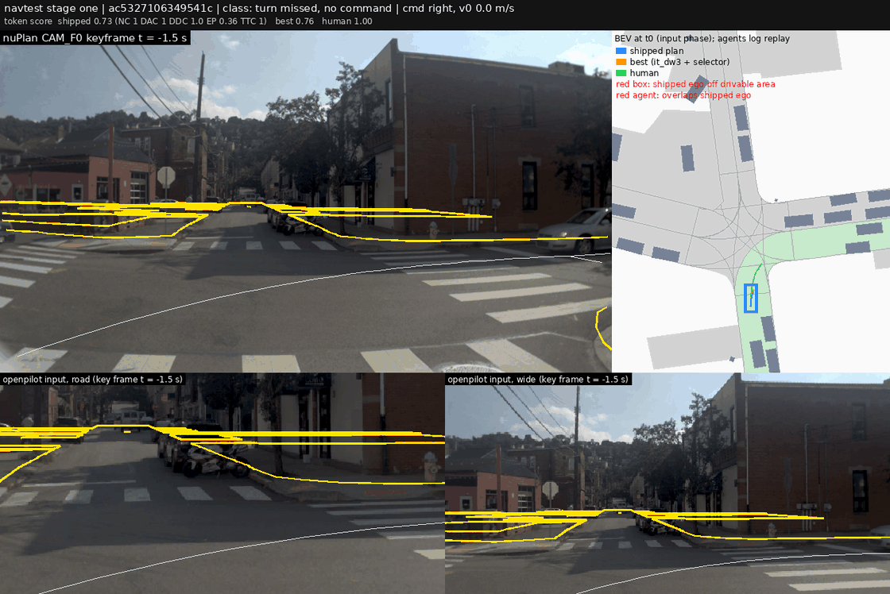

- `ac5327106349541c`，cmd right，v0 0.0 m/s，log `2021.09.16.19.49.00_veh-42_00990_01609`。loss 0.266（rank 76/160）。
- 看什么：同一个模式：停在路口，human 右转，原生基本不动；3.5 s 后车（log）追尾，不算 at-fault。
- 模型视图：前方的直行路和路口在 road crop 里；右转后的路在 crop 右边外。

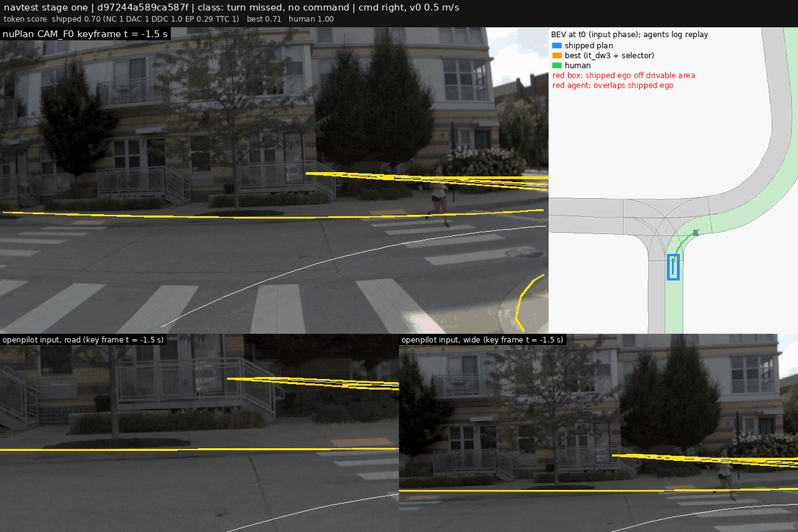

- `d97244a589ca587f`，cmd right，v0 0.5 m/s，log `2021.09.16.17.40.09_veh-45_02539_02745`。loss 0.294（rank 82/160）。
- 看什么：T 字路口，human 右转，原生和 best 不动（EP 0.29）。
- 模型视图：两个 crop 都正对着对面的公寓楼，右转后的车道只在 wide 右下角露出一点。
- navtest 这一类在中位数附近的 token 全都同时算 stopped：「缺指令的转弯」在 navtest 上实际就是「停在路口不知道往哪走」，不是「转错方向」。

### 小结（只是看图得到的印象，没有统计）

1. navhard 的三个 DAC 类（road edge、early clip、wrong direction）在中位数附近几乎是同一个画面：stage 2 把 ego 挪到路边或斜对着路沿，参考轨迹要先摆回车道，模型却沿车头方向直走或右偏。模型自己输出的 road edge 几乎每一例都画在路沿 / 草岛外面，地图边界和路沿在 road crop 里其实都看得到。所以这一族是模型把路面估宽了，不是视野不够；只有在 ego 斜得厉害（7516、cd7d、b768）时，要去的那条路才在 road crop 之外、只能靠 wide 看到。
2. collision 在 navhard 上看到的是 stage 2 起点贴着车（c807 的车在 t0 已经出了 road crop；306b 的公交车只在 wide 里），以及一例在画面上找不到对应物体的 agent（85e4）。navtest 上中位数附近都是只丢 TTC：左转切得太内侧，或者开得太慢被 log 里的后车顶上。
3. stopped / no-command 在两个榜上都是「停在路口或斑马线前，参考要转弯或起步」，前方没有障碍。要去的方向经常在 road crop 外。
4. best driver 在这些中位数 token 上大多没变：31 个里有 28 个 best 也失败。不再失败的 3 例是 navhard wrong direction b5ea（0.72）、collision 1cdb（0.98）和 stopped 1b3f（0.83）；navtest wrong direction 29a1 从 0 到 0.60，但它是往反方向转。

**脚本**：`experiments/leaderboard_audit/scripts/lbx_nav_pick.py`（类别归属与挑选，写 `$DATA_DIR/runs/leaderboard_audit/loss_budget/lbx_<board>.json` 和每个 token 的 `lbx_<board>_tokens.pkl`）、`lbx_nav_render.py`（GIF）。navsim2 env，只用 CPU，一次跑完约 10 min（9 procs）。

## HUGSIM 64：每类 2–3 个例子（shipped `cinque-fixed` vs best `it_dw3-s0 + sel3`，同一 scenario 上下对照）

三个 lever 各值多少（HD x 100，出自 loss_budget.md 的 HUGSIM 表 / decision 103）：

- **stopped / max_steps**：shipped 有 14 个 scenario 停到 400 步（占失败的 23%），ceiling 按「我们的 arm 里最好的」算 8.2，算上 LTF / cv / Lebowski 是 10.2，按 HD = 1 是 17.0；best 剩 8 个 scenario，对应 2.2 / 4.8 / 7.9。best 已经拿走了大头（HD = 1 那一列减少 9.2）。
- **spin**（heading 偏离 route 超过 45°）：shipped 10 个（16%），ceiling 4.8 / 7.0 / 10.2；best 剩 4 个，对应 1.4 / 1.9 / 4.0。也基本被拿走了（减少 6.2）。
- **collision: foreground (fg)**：shipped 26 个（43%），ceiling 4.3 / 7.8 / 37.2；best 是 30 个，对应 5.8 / 9.2 / 42.2，比 shipped 还多 4.9。我们的 arm 在这些 scenario 上几乎都没活下来过，所以 best-observed ceiling 小，HD = 1 bound 却很大。这是空间最大、也最没被探索过的一类。

**画面怎么读。** 每个 GIF 有上下两块，上面是 shipped，下面是 best。每块左边是 **BEV reconstruction（不是 render）**，右边是 openpilot 的 model view。

- **BEV**：灰色是这次 run 自己的 `ground.ply` / `scene.ply` 点云（深灰是 ego 高度带内的点，即建筑、杆子、路边停着的东西）。绿线是 HUGSIM 录好的 route，红框是 `infos.pkl` 里的 actor box，蓝框和蓝线是 ego 和它的轨迹，青色线是这一步的 openpilot plan（`zs_steps.jsonl` 里的 `model_pos`，最远 10 s）。
- **model view**：上面是 road input，下面是 wide input，都是 512x256。图是从这次 run 的 `video.mp4` 用 `jevdrive.hugsim_zs.OpenpilotFrames` 的 gather 重建的，rays、source camera、nearest neighbour 都和 exam 时一样，只是显示成彩色；模型实际收到的是同样像素的 BT.601 YUV。和模型当时看到的 tensor 相比，唯一的差别是 mp4 压缩。spin 研究的 offline replay 量过这个差别：3 s lateral 的 plan 差均值 0.02 m（hugsim/results/controller_spin.md）。
- **青色 plan**：按相机高度 1.48 m（来自 CAM_FRONT v2c）投到平地上。lane line、road edge 和 lead 的 box 在这些 run 里没有 log，所以画不出来；画面上写的是 log 里的 `lead_prob`。
- **sel3 标记**：best 这一行出现橙色 `sel3: derotated-history plan taken` 的那一步，执行的是 derotated-history rollout 的 plan。那个 rollout 的当前帧和画出来的一样，只有历史帧被转过。
- **速度**：HUGSIM 一个 sim step 是 0.25 s，`video.mp4` 是 4 fps，每步一帧。GIF 每帧对应一步、显示 250 ms，所以就是 **real time 4 fps**。sim 一秒只有 4 帧，达不到 6–8 fps，也没有插帧。两个 arm 都停着（或已经结束）的段落按 `x8 speed` 抽帧，顶部横条会用黄字标出来。一个 arm 结束后，它那一块变暗，并写出 end reason 和 HD。
- **数据来源**：全部是原 run 自己留下的数据，没有重跑。shipped 来自 `$DATA_DIR/runs/hugsim-exam/scored-op/cinque-fixed/zs/<run>`（`derot_runs.csv` 里的 `base` arm 就是这次 run），best 来自 `$DATA_DIR/runs/op_adapt_H/hugsim/it_dw3-s0_sel3/cinque-fixed-Hit_dw3-s0_sel3/zs/<run>`。画面上的 end / HD 就是这两次 run 自己的 eval，**按构造复现**。
- **没有 chase cam**：HUGSIM 的 run 没存第三人称视角。要补就得在 GPU 上把 3DGS 场景重新跑一遍，现在卡都被 lane 占着，这次没做，左边一律用 BEV reconstruction 代替。
- **每格的数字**：「对应 ceiling」写的是这个 scenario 在 ceiling 里贡献多少（HD 差 / 64 x 100），格式是「到我们 arm 最好值 / 到 HD = 1」。

**怎么挑的。**

- **spin**：10 个 spin 的样子都差不多，起步 2 s 内 plan 开始往一侧偏，然后转过 45°，8/10 最后是 bg collision（history_derotate.md）。按 best 的三种结局各取一个：被修好、仍然 spin、spin 变成停车。
- **stopped**：14 个分两种。8 个前方 12–41 m 有车，其中 3 个是静止车，其余在动；6 个前方根本没有 actor。挑了「前车开走了还不走」「前方静止车挡道」「空路停车」各一个。
- **fg collision**：26 个里大多数是 hard / extreme 难度的对向车直冲 ego lane。其中 16 个撞上时 ego 已经 < 1 m/s，也就是被撞的时候 ego 基本停着。挑了「停着被撞」「绕静止车时撞」「ego 还在走、侧面擦上」各一个，都是 episode 中位长度（5–9 s）的。

### spin

#### H1. spin，best 修好（scene-0013-medium-00，nuScenes）

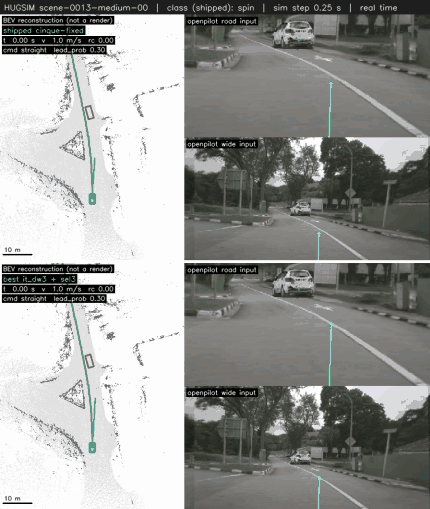

- shipped：直路，cmd straight，没有任何需要转向的东西。plan 从第 3 步起往左偏，2 s 时 heading 已经 -9.7°，最后转了 172°，5.25 s 时 bg collision，HD 0.055。best（it_dw3 + sel3）：一直沿着车道，9.5 s complete，HD 0.974。sel3 只在一步（1.25 s）用了 derotated plan。
- model view：shipped 开始偏的时候，两个 crop 里都是一条直路，road crop 里车道线和路沿都在。spin 之后 road 和 wide 两个 crop 都只剩路边的树丛和暗色植被，route 在两个 crop 里都看不到。best 的 road crop 里一直有车道线和路沿，plan 顺着车道走。
- 对应 ceiling：1.48 / 1.48（best 只剩 0.04）。
- 复现：原 run 数据，按构造复现。同一天 shipped 的重跑（`base_rerun`）也一样 spin 172°。

#### H2. spin，best 照样 spin（scene-0528-medium-00，nuScenes）

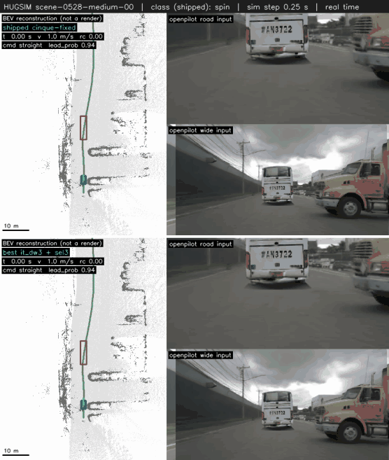

- shipped：转了 114°，4.25 s 时 bg collision，HD 0.045。best 也 spin 了，5.25 s 撞上 bg，HD 0.067。我们 arm 里最好的是 `ln1-s0_all64` 的 0.84，所以这个 scenario 还有 1.2 点没拿到。
- model view：偏出去以后，road crop 被一面灰色围挡占满，wide crop 里只多了一扇门。route 和路面两个 crop 都看不见，plan 只能往空地方指。
- 对应 ceiling：1.24 / 1.49（best 是 1.21 / 1.46）。
- 复现：原 run 数据。注意 decision 101 那条线里，用 shipped 模型加 sel3 的 run（`cinque-fixed-sel3`）在这个 scenario 上能 complete（0.84），而换成 it_dw3 模型的这次又 spin 了。单次 run 有噪声（同天重跑 10 个 spin 里复现 8 个）。

#### H3. spin 变成停车（scene-152217047339-medium-00，Waymo）

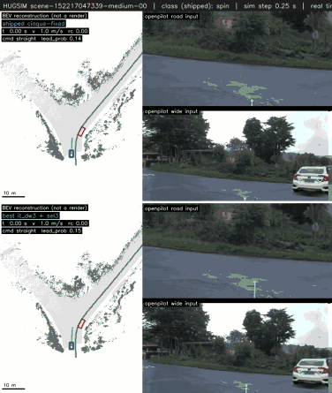

- shipped：右转口（cmd right）转了 150°，冲进路边植被，6.75 s 时 bg collision，HD 0.083。best：不 spin 了，但在转弯处正对路沿停下（约 5 s），之后一直站到 400 步，HD 0.165，在 best 里算 `stopped / max_steps`。约 9.5 s 以后是 `x8 speed`。
- model view：shipped 在右转口，两个 crop 里都是深色植被。best 停住时，road crop 正对着路沿和草地，右转之后那段路在 road crop 外面，只在 wide 的右边缘露出一点。停着的时候 `lead_prob` 0.83，模型把前面的路沿 / 坡当成了 lead（推断，没有 lead box 可以核对）。
- 对应 ceiling：0.29 / 1.43。这个 scenario 在我们 arm 里最好也只有 0.27，所以 spin 修好之后它只是换成了「停车」那一类。
- 复现：原 run 数据。

### stopped / max_steps

#### H4. 前车开走了，shipped 还停着（scene-032-medium-02，PandaSet）

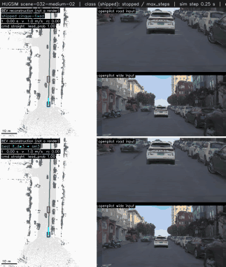

- 前车起步时在 16.5 m，以约 3 m/s 往前开。shipped 跟着减速，7 s 停下，此时前车在 26.5 m。之后前车一直往远处开（15 s 时 50 m，100 s 时 300 m），shipped 再也没动过，400 步结束，HD 0.218。best 10 s 停下，17 s 重新起步，25 s complete，HD 1.0。中间两个都停着的那段是 `x8 speed`。
- model view：前车一直在 road crop 中间，越开越小。shipped 停住以后 plan 缩成几乎一个点，`lead_prob` 从 1.0 慢慢掉到 0.4 左右，却始终没回到起步。也就是说，路已经是空的、前车也在画面里越来越远，模型照样不起步。
- 对应 ceiling：1.22 / 1.22（best 已拿满）。
- 复现：原 run 数据。

#### H5. 正前方静止车挡道：shipped 等到超时，best 蹭了 30 多秒后撞上去（scene-0411-medium-00，nuScenes）

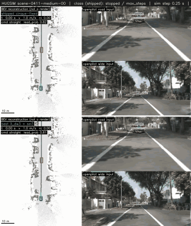

- 一辆静止的白车停在 ego lane 中间（横向 -0.4 m），起步时在 30 m。shipped 在它后面 21 m 停下，站满 400 步，HD 0.073。best 在它后面 14 m 处停下，以 0.1 m/s 往前蹭到 38.5 s，然后加速，41.75 s 时以 4.4 m/s 撞上去（fg collision），HD 0.245。
- model view：白车始终在 road crop 正中，左边是对向车道，隔着白色车道线。要过去就得借对向道。模型只会两种做法：停着不动，或者直着往前开，从来没有出现绕行的 plan。
- 对应 ceiling：0.28 / 1.45。我们 arm 里最好的只有 0.255，没有一个 arm 绕过去过。
- 复现：原 run 数据。

#### H6. 前方没有任何 actor，空路停车（scene-113792265837-easy-00，Waymo）

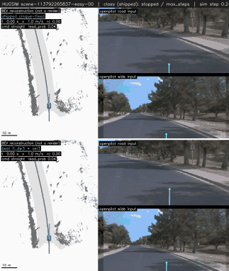

- 这个 scenario 没有 actor。shipped 加速到 2.1 m/s，7 s 时停下，HD 0.133。best 开得快一些（4.7 m/s），约 10 s 停下，HD 0.289。两个都站到 400 步。
- model view：road crop 里是一条空的宽路，wide crop 右边有一块黄色的行人过街标志，这块标志在 road crop 外面。全程 `lead_prob` 都 < 0.1，所以停车不是因为模型看到了 lead。停的原因这次没有定位，标志只是画面里能看到的东西，不当作原因。14 个 shipped 停车里有 6 个属于这种「空路停车」。
- 对应 ceiling：0.36 / 1.35。LTF 在这个 scenario 上拿到 0.94，所以算上别家 arm 的 ceiling 要大得多。
- 复现：原 run 数据。

### collision: foreground (fg)

#### H7. 对向车直冲，ego 看见了、停了，还是被撞（scene-3400_3600-extreme-00，KITTI-360）

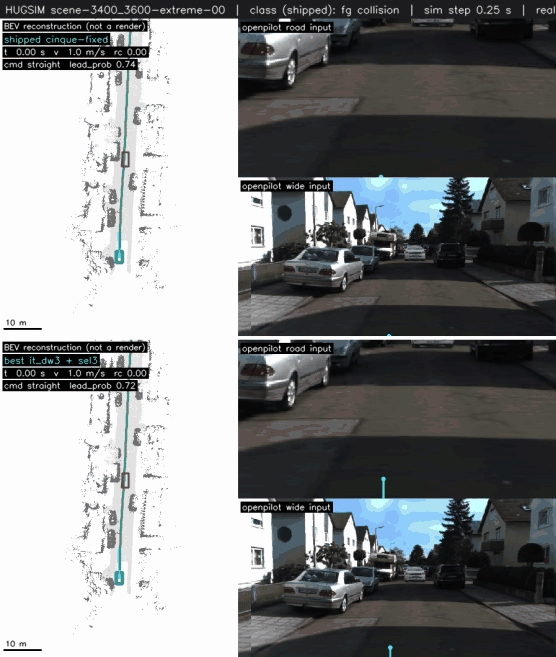

- 一辆白车从 26 m 外沿 ego lane 对向开过来（约 2.6 m/s）。shipped 在 3 s 时看到，`lead_prob` 0.95–1.0，4 s 时降到 0.5 m/s 以下，6.25 s 时被正面撞上，HD 0.027。best 几乎一样，4.75 s 被撞，HD 0.010。
- model view：白车始终在 road crop 正中，最后占满整张图。模型看到了，也停了，plan 只是缩短，没有任何横向避让。HUGSIM 的 actor 不会让行，所以停着也会被撞。
- 对应 ceiling：0.00 / 1.52。我们所有 arm 在这里最好的 HD 只有 0.028，这就是 fg 一类「best-observed ceiling 小、HD = 1 bound 大」的典型。
- 复现：原 run 数据。

#### H8. 静止车加对向车：shipped 绕开静止车后停住被撞，best 绕的时候擦上静止车（scene-0138-extreme-00，nuScenes）

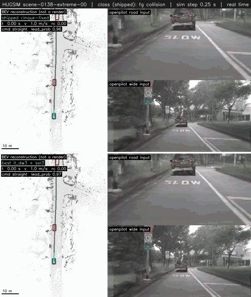

- ego lane 里 20 m 处停着一辆静止车（画面里那辆橙色车），59 m 外有一辆黑色 SUV 以 5 m/s 对向开过来。shipped 往右绕过静止车，停在它右边（0.1 m/s），SUV 正面撞上，8.5 s，HD 0.106。best 加速到 7 m/s 从右边超过去，4.25 s 时擦到静止车的车尾，HD 0.116。
- model view：shipped 被撞前，road crop 里只有 SUV 的车头，静止车在左边缘外，在 wide 里能看到。`lead_prob` 在 SUV 偏到左侧时掉到 0.08，靠近以后又回到 0.68。best 撞上的那一刻，静止车贴在 road 和 wide 两个 crop 的左边缘，plan 是直着往前的。
- 对应 ceiling：0.05 / 1.40。
- 复现：原 run 数据。

#### H9. 对向车：shipped 慢慢开、侧面擦上，best 快速开过去，活下来（scene-034-hard-00，PandaSet）

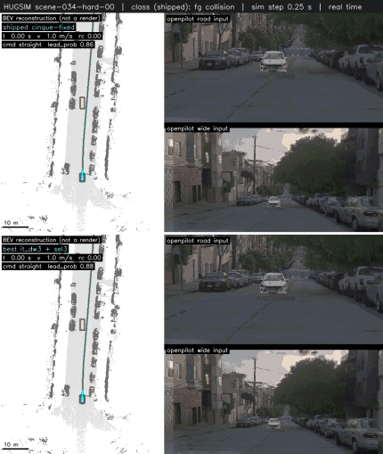

- 一辆对向车在 29 m 外、ego lane 中线上，以 2 m/s 开过来，2–3 s 时偏到 ego 左侧（横向 +2.3 m）。shipped 以 2.4–3 m/s 慢慢开，并且往右偏了 1.4 m，6 s 时和它并排擦上（前 4 m、左 2 m），HD 0.152。best 加速到 8–13 m/s，4.5 s 时隔 1.9 m 从它旁边开过去，8.5 s complete，HD 0.465（HD 不到 1，是因为这次擦肩而过被记了分：nc 0.63、ttc 0.43）。
- model view：对向车偏到左侧以后，基本在 road crop 外，只在 wide 的左下角能看到，`lead_prob` 掉到 0.01–0.04，模型不再把它当 lead。撞上的那一刻，那辆白车只露出 road crop 左边缘的一小块。
- 对应 ceiling：0.54 / 1.32（best 剩 0.05 / 0.84）。这里 best 能活下来，靠的是速度，模型并没有真的处理这辆车。
- 复现：原 run 数据。

**没做的**：route-end crash、bg collision 和 off-route 不在这次要求的三类里，没出例子。所有例子都没有 chase cam，原因见上。lane line、road edge 和 lead box 不在 HUGSIM run 的 log 里，model view 上只能画 plan。

## B2D（19 条诊断路线 × seed 0–3，`drive` 对 `vmerge2`）

每个杠杆值多少（`loss_budget.md` B2D 表，oracle 上限，DS 分）：
- **红灯 / stop sign**：`drive` 红灯 8.7 + stop sign 1.1；`vmerge2` 剩 3.4 + 0（拿回了 5.3 + 1.1）。
- **blocked / timeout**（`Agent got blocked`、TickRuntime 200 s 上限）：`drive` 12.6（exposure-aware 12.9），`vmerge2` 剩 5.8（7.7）。
- **车辆碰撞**：`drive` 5.2 → `vmerge2` 8.7（全部碰撞类 6.7 → 10.7），唯一变坏的杠杆。`vmerge2` 的 21 次车辆碰撞里，11 次是和 `drive` 共有的路口冲突（27043、9196、37969），7 次在 bypass 进行中，3 次是 17280 stop sign 之后（`vmerge_collisions.md`）。

**怎么挑的**：每类取在 `vmerge2_runs.csv` 里跨 seed 反复出现的那种失败（比如 24944 的红灯 4/4 seed、19324 的 TickRuntime 4/4 seed），不挑最极端的。`drive`、`pbyp2ng`、`vmerge2` 的例子都在 2026-10-04 用同 arm / route / traffic seed / 配置重跑了一遍（`lbx_b2d_rerun.py`，一张卡，每个 unit 自己的 openpilot server 带转储 + chase 相机）；CARLA 不是 bit-deterministic，所以每个例子写了有没有复现，没复现的重跑了多次（`b`、`c`），留下最能说明杠杆的那次。`vred` 的三个例子（R1 右、R2、R3）沿用 v2-gif 重跑和 `vlm_frames` 重建。

**画面怎么读**：顶栏是 sim 时间（scenario clock）、车速、日志里的 ego 灯态和到灯的距离、当前生效的 VLM 答案、仲裁行（`drive` / `pbyp*` 显示 bypass 状态）。左边是第三人称 chase 相机；右边两块是 **openpilot 实际吃进去的 road / wide 帧**（`lbx_dump_server.py` 在 modeld warp 之后、送进网络之前 dump，512×256，YUV 转 RGB，不是重建），每 0.1 s 一帧，和第三人称同一时间轴（用速度对齐，误差 0.000 m/s）。叠在帧上的全是模型自己的输出：绿线 = plan（未来 10 s 的位置），青线 = 车道线（lane prob > 0.5 才画），红线 = road edge，黄框 = 第一个 lead（p > 0.5，框按 1.8 m × 1.5 m 画，示意）。投影用 calibration 0、相机高 1.433 m 的地面平面。没有慢放段；快进段在画面上标 `xN speed`。每个例子有 GIF（≤ 3 MB）和一张 JPG 关键帧。`vred` 的 R1（右）/ R2 / R3 仍是旧版画面（BEV 之外的重建帧，绿线只有 4 个点，`held` / `STALE` 标注含义见 `lbx_b2d_clips.py`）。接触时刻按帧号换成 scenario clock（`contacts.jsonl` 的 t 是 world clock，大约快 1 s），所以比 `tmp/gifs_block.md` 里写的早 0.8–1.5 s。

**从模型帧上能直接算出来的一点**（模型帧内参）：road crop 只到地平线上方 3.0°，wide crop 到 18.5°。约 5 m 高的灯头（比相机高 3.6 m）在 road crop 里只有 **68 m 以外**才进画面，在 wide crop 里要 **11 m 以外**。所以接近停止线时，openpilot 只能从 wide crop 看到灯，而且灯只占几个像素；road crop 基本只有路面和前车。VLM 读的是未裁剪的原始帧，看到的比 openpilot 多。

### 红灯

#### R1. `drive` 和 `vred` 在同一个灯前（route 24944，seed 0）

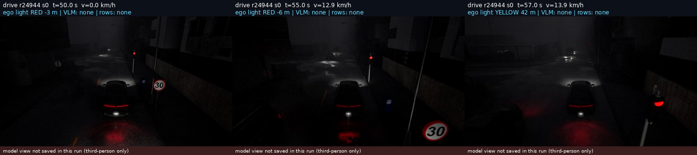
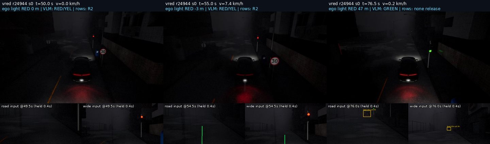

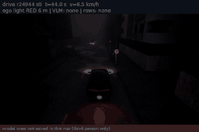 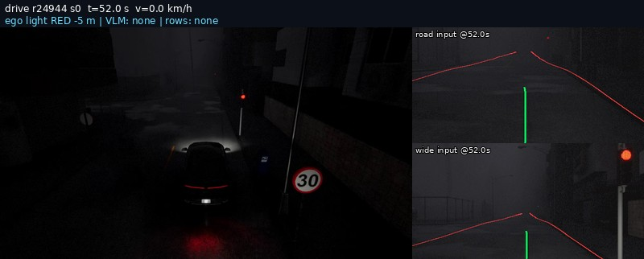 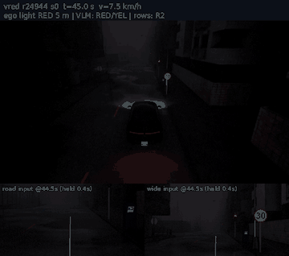

- 类别：红灯。对应 `drive` 的 8.7（25 次红灯里 24944 占 4/4 seed，每次扣 0.7）。`vmerge2` 在 24944 上 4 个 seed 都是 DS 100。`vmerge2` 没有 chase 录像，这里用 `vred` 代替：它就是 `vmerge2` 的读灯和 R2 停车部分，而且 `vmerge2` 的 R2 停车目标也是路口入口（`vmj`）。
- 看点：上面两张静帧是两个 arm 在同样的 sim 秒（50 / 55 s，第三格是 drive 57 s、vred 76.5 s）。灯 39 在 42.6 s 变红。`drive` 47–53 s 停在线后约 3 m，然后起步，约 56 s 红灯穿过路口。`vred` 由 R2 压住，一直停到 74.8 s 变绿，76.1 s 放行。`vred` 的 52–74 s 是 x6 快进。
- 模型视角（只有 `vred`）：46.5 s 还在接近时，红灯只出现在 wide crop 右上角，几个像素；road crop 里没有灯。55.5 s 车停在线后，wide crop 右边能看到灯，road crop 里还是没有。夜里有雾，road crop 几乎全黑，lead 头在 39 m 处报了一个画面上看不出来的 lead。openpilot 本身没有任何灯态输出，停车完全靠 VLM 读原始帧加上 R2。`drive` 的重跑见下一条。
- `drive` 的模型视角（2026-10-04 带转储重跑，clip 是 46–60 s）：52 s 车停在线前（v = 0），wide 输入里红灯清楚地在右上，是个明显的灯头；road 输入里没有灯，整幅是雾夜的黑暗路面。模型的 plan（绿）是一小段竖直短线，也就是「在这里停」，没有任何和灯有关的输出；车道线几乎没有（雾夜，prob 低），只有 road edge。起步闯灯发生在这之后，不是模型看不见灯，是 openpilot 没有灯这个概念。
- 复现：`drive` 重跑（`v2-lbx-drive-s0-24944`）`red_light` 1（灯 39）、DS 70，复现；原 `drive` 和 `vred` 重跑（DS 70 / 100）也一致。目录：`v2-gif-drive-s0-a/attempts/24944/1`、`v2-gif-vred-s0-a/attempts/24944/1`。

#### R2. 剩下的红灯一：黄灯在线前约 7 m 出现（route 27297，seed 0）

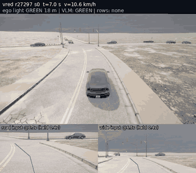

- 类别：红灯，属于 `vmerge2` 剩下的 3.4（27297 上 `vmerge2` 4/4 seed 都闯红灯，DS 70）。clip 是 `vred`。
- 看点：灯 296 在 9.2 s 变黄，这时车离线 7.4 m，车速 5.3 m/s；R2 在 10.6 s 起作用，车 12.0 s 停在线后约 3 m；VLM 在 15–18 s 两次答绿（真值是红），R2 18.6 s 放行，约 22.4 s 红灯穿过路口。7–24 s 正常速度。
- 模型视角：9.1 s 时 wide crop 能看到路口远端的灯架，灯头只有几个像素，road crop 里看不到灯；plan 是右转。11.6 s 起一辆横穿的黄色出租车出现在两块画面里，lead 框跟着它。18.6 s 放行那一刻 road crop 里只有空路口，看不到灯。
- 复现：`red_light` 1（灯 296）、DS 70，官方结果复现；成因和 `vred.md` 写的不同（原文是停在线上后被推过去，这次是错误的绿答案放行），见 `tmp/gifs_block.md` 第 2 段。目录：`v2-gif-vred-s0-a/attempts/27297/1`。

#### R3. 剩下的红灯二：车头过线以后灯才变红（route 16390，seed 0）

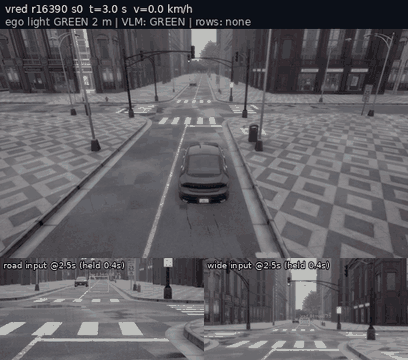

- 类别：红灯，`vmerge2` 剩下的 3.4 里的另一块（16390 上 `vmerge2` 和 `drive` 都是 4/4 seed，DS 70）。从读灯的角度看，这一类几乎修不了。
- 看点：灯一直绿到 7.7 s；变红时车头已经过线 1.8 m，车速 4.6 m/s，没有任何仲裁行起作用。3–12 s 正常速度。
- 模型视角：5.5 s 时 wide crop 里能看到绿灯（远端灯架，几个像素），road crop 里能看到斑马线、停止线和前方的车流，看不到灯头；7.5 s 时两块画面里都只有路口和对面的车，没有灯。
- 复现：`red_light` 1（灯 1285）、DS 70，复现。目录：`v2-gif-vred-s0-a/attempts/16390/1`。

### Blocked / timeout

#### B1. `drive` 停在障碍物后面，直到 200 s（route 19324，seed 0）

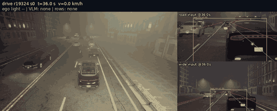 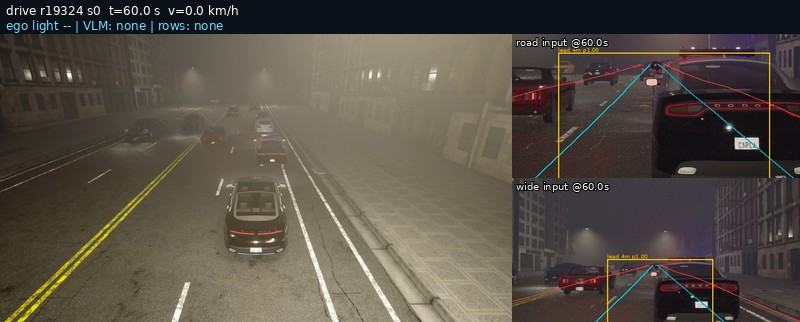

- 类别：TickRuntime。`drive` 的 19 次 blocked / timeout 里有 16 次是 TickRuntime，都在障碍路线上（2520、19324、19832、24497 各 4/4 seed）；19324 每次扣到 DS 约 33。`vmerge2` 用 bypass 拿掉了大部分（障碍路线 +41，第 95 条）。
- 看点：36.3 s 起停在障碍物后面，到 200 s 一直没动。30–42 s 正常速度，42–196 s x20 快进，196–200 s 正常速度。
- 模型视角（带转储重跑，36–42 s 正常速度，42–190 s x40，190–196 s 正常速度）：60 s 时 road / wide 输入里正前方 4 m 是一辆警车（`lead 4m p1.00`），车道线（青）和 road edge（红）都很清楚，plan 是一条笔直、没有绕行意图的短线。模型把它当成 lead，在 lead 后面停住；openpilot 没有「lead 不动就绕过去」的行为。
- 复现：重跑 `Failed - TickRuntime`、DS 33.36，和原运行完全一致（第一次重跑 24944 / 19324 时 lane 被别的 lane 抢了 lease 被 drain，不是失败，重启后正常）。目录：`v2-lbx-drive-s0-19324`（原 `v2-gif-drive-s0-a/attempts/19324/1`）。

#### B2. 路口被消防车撞，之后被卡住（route 9196，seed 0，`drive`）

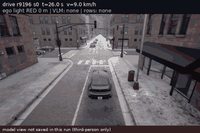 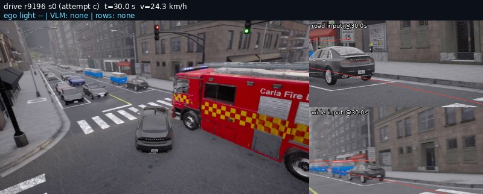

- 类别：`Agent got blocked`，`vmerge2` 剩下的 5.8 里最大的一组：9196 上 `vmerge2` 4/4 seed 都是先被消防车撞、再 `Agent got blocked`（DS 21–34）。`drive` 在 seed 1、2 上也是这样。clip 是 `drive` 的重跑，`vmerge2` 没有 chase 录像。
- 看点：29.6 s 红灯进入路口（3.8 m/s），29.75 s 与对向开来的消防车接触（车速 4.7 m/s）；之后车停在一个 static.prop.mesh 前面，49.1 s 开始反复接触它，直到被判 blocked。26–34 s 正常速度，34–50 s x3，50–90 s x10 快进。
- 模型视角（带转储重跑，clip 是 27–100 s，x1 / x4 / x12）：30 s 时消防车从右边横向开进路口，在 road 输入里只占右上角（plan 是向前的直线，没有避让），wide 输入里是路口左边排队的车。模型输出没有任何对它的反应；这又是一辆侧面来的车。
- 复现：重跑了三次（`v2-lbx-drive-s0-9196`、`...driveb...`、`...drivec...`）：a 只有红灯（DS 70，没撞）；b 撞消防车（30.3 s）+ 红灯，DS 42，Completed，和原始 seed 0 一样；c 撞（29.9 s）、第二次接触（41.7 s）、`Agent got blocked`、DS 15.5，和原始 seed 1 / 旧 GIF 的结局一样。clip 用的是 c。同 seed 三次重跑三种结果，所以这条 route 的 CARLA 本身就不稳，碰撞部分三次里两次复现。

#### B3. `vmerge2` 在路口里被前车堵住 60 s（route 15612，seed 1，BEV + 模型视角）

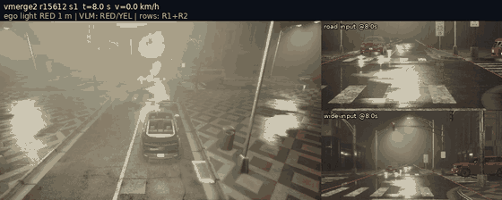 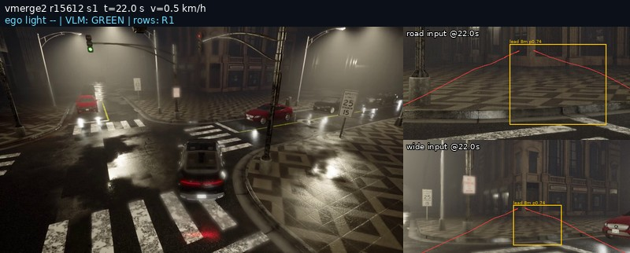

- 类别：`Agent got blocked` 加红灯，属于 `vmerge2` 剩下的 5.8（15612 seed 1、2 两次，DS 22–24；第 95 条「vmj 的灯路线收益在新 seed 上没守住」说的就是这个）。
- 看点：R2 停在线前；8.4 s 和 9.4 s VLM 两次答绿（真值红），车起步又停。14.4 s 灯变绿时车头已过线 0.8 m，16.1 s 灯又变红，车在 21.5 s 带着红灯穿过（2 m/s），22 s 起停在一辆静止的 mercedes coupe 后面 9 m，一直到 81.9 s 被判 blocked。6–24 s 正常速度，24–81 s x8 快进。
- 模型视角（重跑的 clip，8–43 s；注意这次重跑没有走到「被 coupe 堵住」，见复现）：22 s 时车在路口里（0.5 km/h），VLM 答绿，仲裁行 R1；road 输入里路口正中有一个 `lead 8m p0.74` 的大框，wide 输入里同一个位置是路面和对向的车，plan 是一条绕过去的弧线。雨夜，灯头在两块画面里都看不见。
- 复现：**没复现 blocked**。三次重跑（a / b / c）都没有被判 blocked：a、b 是闯红灯、DS 70，c 是 DS 100。原运行（DS 22–24，blocked + 红灯）的红灯部分复现了两次，被 coupe 堵 60 s 的部分没有。clip 是 a（红灯那次）。原官方运行目录 `v2-vmerge2-s1-q1/attempts/15612/1`，重跑 `v2-lbx-vmerge2-s1-15612`。

### 车辆碰撞

#### C1. bypass 拉出时撞上同向车（route 19832，seed 0，`pbyp2ng`）

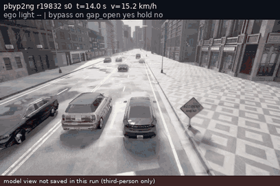 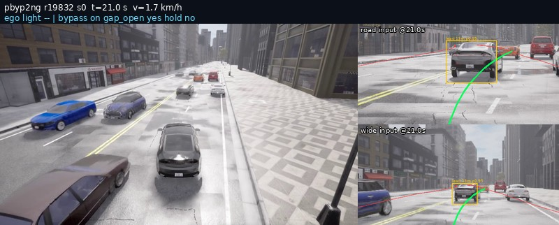

- 类别：车辆碰撞，bypass 起步。对应 `vmerge2` 碰撞里 bypass 那一类（21 次里 7 次，扣 0.6 一次）。`pbyp2ng` 就是 `vmerge2` 现在用的 bypass 门（只拒绝贴车起步，不等整段变道的 gap，第 87、95 条）。
- 看点：约 20–21 s 停了一下，然后拉出去，21.75 s 与同向的 impala 接触：自车 1.3 m/s，对方 7.1 m/s，对方在侧前方约 2 m。14–26 s 正常速度。
- 模型视角（带转储重跑，15–26 s）：21 s 时 bypass 在 `gap_open`，road / wide 输入里正前方 lead 是一辆灰色车（`lead` 黄框），plan 是向右拉出的弧线，右边车道里有同向来车在远处；撞上的 impala 在接触前一直在自车侧后，两块画面里都看不到它（bypass 门看的是特权相邻车道几何）。
- 复现：`collisions_vehicle` 1、DS 60，同样是 impala、同向，接触 21.90 s（原 21.75 s），复现。目录：`v2-lbx-pbyp2ng-s0-19832`。

#### C2. 同一类，拉出时车速更高（route 2520，seed 0，`pbyp2ng`）

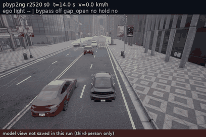 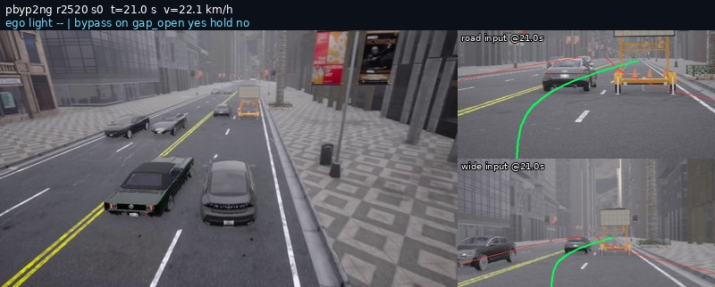

- 看点：21.55 s 与同向的 mustang 接触：自车 6.1 m/s，对方 8.2 m/s，侧向 2.2 m。14–26 s 正常速度。
- 模型视角（带转储重跑，15–26 s）：**这里模型能看见那辆车**。21 s 时 road 输入左边偏前能看到那辆深绿 mustang 的车尾（同向、8 m/s，在自车左侧车道往前超），前方 lead 是施工架（黄框）；plan（绿线）却是向左拉出的弧线，正好拉进 mustang 所在的车道。wide 输入里 mustang 在左下。也就是说它进了画面，但 plan 没有把它当成侧向障碍，模型没有「向侧方让行」的输出。
- 复现：`collisions_vehicle`，接触 21.45 s（原 21.55 s），和原运行的 mustang 同类；但这次重跑多了第二次接触（37.9 s，mini cooper），DS 36 而不是 60。碰撞部分复现，第二次接触是新的。这次第一次尝试没有掉线。目录：`v2-lbx-pbyp2ng-s0-2520`。

#### C3. `vmerge2` 自己的 bypass 碰撞（route 19832，seed 1，BEV + 模型视角）

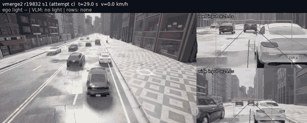 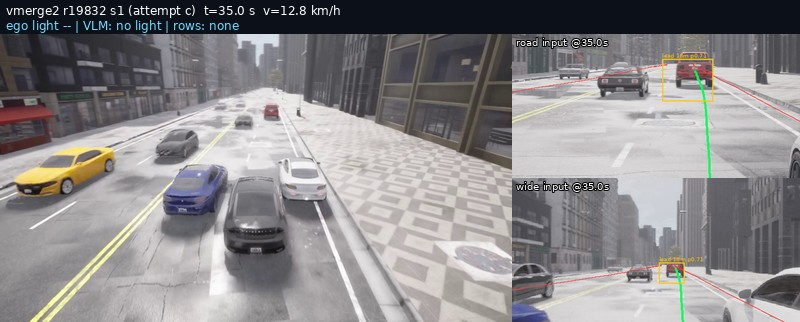

- 看点：BEV 左下角显示 bypass 状态：32.2 s 起 bypass 开、`gap_open` 闪了几次，37.2 s 起 bypass 一直开着，车拉出到 2.8–3.3 m/s，37.35 s 被同向的 lincoln mkz 从侧后方撞上（自车 4.0 m/s）。30–41 s 正常速度。
- 模型视角：带转储重跑的画面（29–40 s）每 0.1 s 都有帧，不再有旧版的 `STALE`；撞上来的车是从侧后方来的，key frame 是 35 s（接触瞬间）：road / wide 输入里正前方是一辆红色车（黄框 lead），plan 是笔直朝它去的细线，左边车道有一辆深红车并排；VLM 没有答案、仲裁行 none。openpilot 本来就看不到后方来车；bypass 门用的是特权的相邻车道几何。
- 复现：重跑了三次：a 撞 audi tt（44.3 s，两次接触），DS 36；b 没撞、DS 100；c 撞（35.5 s，id 3697，自车 4.3 m/s）、`outside_route_lanes`，DS 55.9，和原运行（37.35 s、lincoln mkz、DS 60）最接近。clip 用 c。碰撞三次里两次复现（不是同一辆车）。原官方运行 `v2-vmerge2-s1-q1/attempts/19832/1`，重跑 `v2-lbx-vmerge2c-s1-19832`。

#### C4. 不是 bypass：路口里被横向来车撞（route 27043，`drive` seed 0 和 `vmerge2` seed 0）

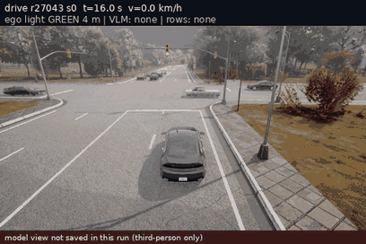 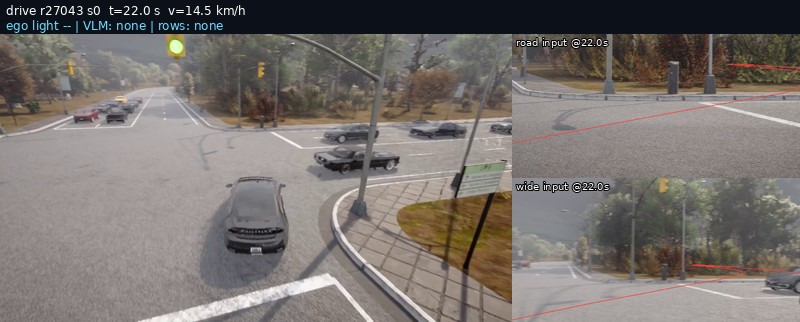
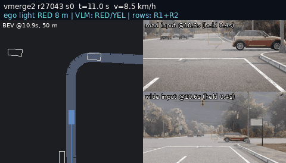 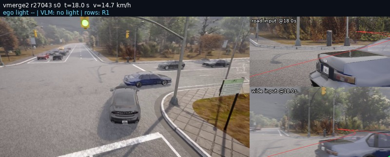

- 类别：车辆碰撞，路口冲突，是碰撞杠杆里最大的一块（`vmerge2` 21 次里 11 次，`drive` 12 次全是这一类）。27043 上两个 arm 都是 4/4 seed 碰撞、DS 60。
- 看点：`drive`（chase）绿灯过线后转弯，23.35 s 与 ford mustang 接触，自车 6.9 m/s，对方从后方 3.3 m、侧向 2.9 m 过来。`vmerge2`（BEV）更早进路口，19.5 s 被一辆 mini cooper 撞上，自车 7.4 m/s。两段都是 16–27 s / 11–22 s 正常速度。
- 模型视角（两个 arm 都是带转储重跑）：`drive` 22 s 时车在路口前（14.5 km/h，黄灯），road 输入里能看到停止线、灯杆和路口，plan 往右弯（转弯）；横穿的车在 chase 里清楚可见，key frame（22 s，接触前 1.4 s）的两块输入里它们还在远处路口、占的像素很少，plan 没有任何减速意图。`vmerge2` 的 key frame 是 18 s（接触前 1.5 s）：一辆蓝色轿车（撞上来的 mini cooper）已经横在车前，占满 road 输入右下、wide 输入下方，也就是模型**看得见它**，但 plan（和车道线 / road edge 的输出）没有变化。这是侧向来车：openpilot 的 lead 头只看同车道前车，没有横穿车的概念。
- 复现：`drive` 重跑 DS 60、mustang（id 277）接触 23.40 s（原 23.35 s），完全复现（`v2-lbx-drive-s0-27043`）；`vmerge2` 重跑 DS 60、mini cooper（id 272）接触 19.50 s（原 19.5 s），完全复现（`v2-lbx-vmerge2-s0-27043`）。

#### C5. 17280：stop sign 停完、起步后被转弯的警车撞（`vmerge2` seed 2，BEV + 模型视角）

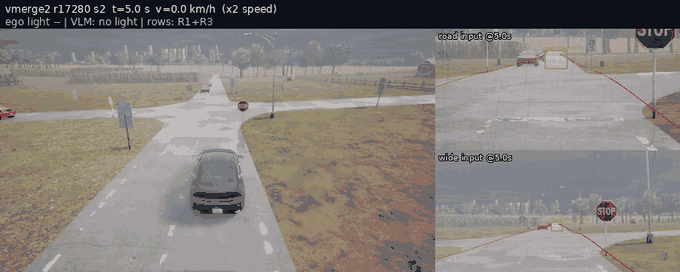 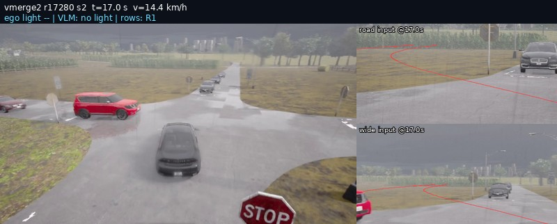

- 类别：车辆碰撞，第 95 条第 5 点的 17280 类（`vmerge2` seed 1、2、3 都撞，21 次里 3 次）。`drive` 不停 stop sign，只扣 stop 0.8（DS 80）；`vmerge2` 停了，换成碰撞 0.6（DS 60）。
- **和第 95 条的说法不一样**：第 95 条和 `vmerge2.md` 写的是「停在 stop sign 前被撞」，`vmerge_collisions.md` 已经按 scenario clock 改正过，这里的画面支持改正后的说法：R3 让车在路口入口前约 8 m 停住 / 爬行（约 6–13.5 s），13.5 s 放行，车加速到 4.5 m/s 进入路口，17.70 s 被 nissan patrol 撞上（自车正在从 4.1 m/s 减速，接触时 1.9 m/s）。不是停着被撞，是 stop 结束后起步时被撞。seed 1、3 的接触时刻是 17.50 s 和 18.20 s，接触前 0.5 s 的车速都在 3.9–4.2 m/s。
- 看点：5–13 s x2 快进（stop 段），13–20 s 正常速度。BEV 里红框就是那辆 patrol：一开始停在路口左侧，之后转弯开过来。
- 模型视角（带转储重跑，5–20 s）：17 s 时车 14 km/h 进路口，R1 行；road 输入里右上有一辆深色轿车（lincoln）正对着路口，红线是 road edge，没有车道线，plan 没有显示避让；wide 输入左下能看到一辆红色 SUV。撞上来的 nissan patrol 是左侧转弯过来的，第三人称里 17 s 时它在左边（红色那辆旁边），不在 road 输入里。
- 复现：重跑 `collisions_vehicle` 1、DS 60，同样是 nissan patrol（id 3706），接触 18.05 s（原 17.70 s），接触时自车 1.0 m/s（原 1.9 m/s），复现；起步后被撞的说法和重跑一致。目录 `v2-lbx-vmerge2-s2-17280`，原官方运行 `v2-vmerge2-s2-q0/attempts/17280/1`。

### 没做的

- **`vred` 三个例子（R1 右、R2、R3）**：仍是旧的重建画面，没有重跑带转储；它们有 chase 录像和模型帧（`vlm_frames`），不是 third-person only。要统一格式需要再跑 `vred` 的转储 unit。
- **转储的局限**：dump 没有时钟，靠速度和 `ticks.jsonl` 对齐（误差 0.000 m/s，每个例子的脚本输出里都有）；plan 的 pos 是未来 10 s 的 33 个点，lane line / road edge 在 openpilot 的距离网格（0–192 m）上，投影用地面平面，远处的线可能和图像对不齐。JPG / GIF 是 8-bit 调色板，不是原始帧。
- **没复现的部分**：15612 的 blocked（三次都没有）。9196、19832 vmerge2、2520 都有重跑间的差异，见各自「复现」。
- **视锥标志**：特权日志的 `view` 只看 bounding box 在不在原生相机视锥里，不判断遮挡，是可见性的上限；而且是原生相机（比 road crop 大），不是模型 crop。
