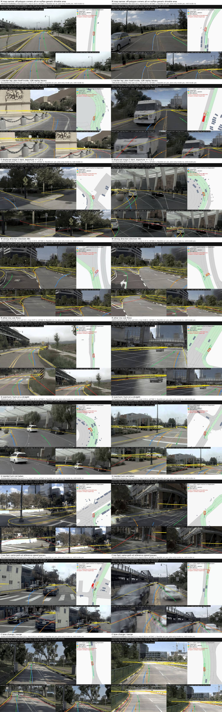

# navhard drivable-area (DAC) failures: what they are made of

2026-10-04. Pre-registration (rules written before any class split was read, plus addendum 1 written before the feasibility numbers):
[plans/2026-10-04-navhard-dac-prereg.md](../plans/2026-10-04-navhard-dac-prereg.md). Code: `scripts/nhdac_feat.py` (features and
interventions), `scripts/nhdac_analyze.py` (classes, oracles, CIs), `scripts/nhdac_slow.py` (exploratory speed check), `scripts/nhdac_fig.py`
(figure). Numbers: [navhard_dac/nhdac.json](navhard_dac/nhdac.json); one row per DAC failure and arm: [navhard_dac/nhdac_failures.csv](navhard_dac/nhdac_failures.csv).
Context: decision 103 (DAC is the largest navhard lever: 15.1 shipped, 13.0 best), 104 / 108 (camera geometry is not the separating cause).

**Arms.** Shipped Cinque (navhard two-stage EPDMS 33.33) and it_dw3 + selector ("best", 35.76, decision 101). Per-token official score rows
from the loss-budget harness (devkit scorer, in-process). **Oracle ceilings, not achievable gains:** a cause's DAC-failing tokens either take the
PDM reference's trajectory terms (clipped, comfort kept, as in decision 103) or only get DAC set to 1; the board score is recomputed with the
devkit two-stage aggregation. CIs: 2 000 bootstrap resamples of the 225 two-stage mapping groups (each a pair of stage-1 scenes with their stage-2 tokens).

**Checks.** The numpy two-stage aggregation equals the devkit's for native, best and the PDM reference (33.331 / 35.756 / 52.824, each arm with its
own stage-2 weights). Replacing every DAC failure reproduces decision 103 (15.10 / 13.00). The replayed geometric DAC agrees with the official DAC on
99.8% of tokens; every official failure is a geometric failure (12 / 11 geometric failures score DAC 1 officially).

## Classes (pre-registered, first matching rule wins)

Each check is the scorer's own LQR + bicycle replay against the scorer's drivable polygon (ROADBLOCK, INTERSECTION, DRIVABLE_AREA, CARPARK_AREA layers).

| class | rule (short) | check behind it |
|:--|:--|:--|
| S0 start outside | an ego corner is already off the polygon at t = 0 | replay state 0 |
| M map narrower than pavement | every off-polygon corner of the replay lies on nuPlan `generic_drivable_areas` or `carpark_areas` (0.1 m) | raw nuPlan map gpkg, layers the devkit does not cache |
| W wrong direction | plan end and reference end on opposite sides (decision 88 rule) | end poses |
| L tracker lag | the plan itself (8 poses, plan heading, ideal tracker) stays inside; the LQR replay leaves | replay of the plan as states |
| E displaced stage-2 start | stage 2, first exit ≤ 1.5 s, start ≥ 0.5 m or ≥ 0.1 rad off the route centreline | start pose |
| U needed turn not taken | reference turns (≥ 10° in 4 s or ≥ 5° in 2 s), exit on the outside of the turn, plan heading change < 0.75 of the reference's | heading at 2 / 4 s, exit corner side |
| O over-turn / turn on a straight | exit on the inside and > 1.25x the reference's turn, or the reference is straight (< 5°) and the plan turns ≥ 10° | same |
| F too fast into the bend | plan covers ≥ 1.15x the reference distance and the same path re-timed to the reference's speed stays inside | re-timed replay |
| C lane change / merge | reference lateral ≥ 2 m at 4 s with < 10° heading change | reference |
| R other | none of the above | |

Overlapping flags: **no feasible arc** (none of 41 constant-curvature arcs x 2 speed profiles from the same start stays inside under the same LQR; addendum 1),
reference also fails DAC, decision 110 set (reference heading change ≥ 5° in 2 s), junction / bend / straight at the exit point, command-fixable
(U or W with a left / right command that matches the reference's turn; the shipped model runs with desire off), synthetic history (stage 2 and the
same model's rot0 rollout, history rotation removed, stays inside), shallow (maximum overshoot < 0.3 m).

## Result: primary causes

n = DAC failures (stage 1 / stage 2); share of the arm's DAC failures; ref fails = how many of them the PDM reference also fails. Ceilings are
two-stage EPDMS points.

| cause | native n | native share % [95% CI] | ref fails | native oracle: reference | native oracle: DAC = 1 | best n | best share % | best oracle: reference | best oracle: DAC = 1 |
|:--|--:|--:|--:|--:|--:|--:|--:|--:|--:|
| M map narrower than pavement | 345 (18/327) | 26.3 [21.0, 31.6] | 126 | 4.72 [3.11, 6.45] | **5.15 [3.56, 6.90]** | 362 (20/342) | 29.0 [23.0, 35.1] | 4.57 [3.04, 6.17] | **5.22 [3.63, 6.97]** |
| L tracker lag | 271 (9/262) | 20.6 [17.1, 24.0] | 79 | 2.92 [1.75, 4.25] | 2.76 [1.73, 3.94] | 258 (6/252) | 20.7 [17.4, 24.3] | 2.30 [1.30, 3.47] | 2.26 [1.26, 3.43] |
| E displaced stage-2 start, exit ≤ 1.5 s | 258 (0/258) | 19.6 [16.7, 22.6] | 165 | 1.24 [0.45, 2.18] | 2.18 [1.28, 3.13] | 260 (0/260) | 20.8 [17.8, 23.8] | 0.70 [0.19, 1.37] | 2.16 [1.30, 3.07] |
| W wrong direction | 143 (0/143) | 10.9 [8.2, 13.8] | 29 | 1.52 [0.62, 2.68] | 1.02 [0.46, 1.75] | 87 (0/87) | 7.0 [4.8, 9.4] | 0.33 [0.07, 0.71] | 0.30 [0.10, 0.57] |
| U needed turn not taken | 36 (5/31) | 2.7 [1.5, 4.3] | 19 | 0.34 [0.01, 0.81] | 0.55 [0.20, 0.96] | 49 (7/42) | 3.9 [2.3, 5.9] | 0.77 [0.22, 1.51] | 1.08 [0.47, 1.83] |
| O over-turn / turn on a straight | 53 (1/52) | 4.0 [2.4, 5.9] | 6 | 0.23 [0.04, 0.52] | 0.14 [0.02, 0.31] | 41 (1/40) | 3.3 [1.9, 4.9] | 0.31 [0.01, 0.69] | 0.29 [0.04, 0.61] |
| F too fast into the bend | 6 (0/6) | 0.5 [0.2, 0.9] | 1 | 0.00 | 0.00 | 13 (1/12) | 1.0 [0.4, 1.9] | 0.21 [0.00, 0.50] | 0.19 [0.00, 0.47] |
| C lane change / merge | 7 (1/6) | 0.5 [0.1, 1.0] | 2 | 0.47 [0.00, 1.09] | 0.39 [0.00, 0.89] | 8 (1/7) | 0.6 [0.2, 1.3] | 0.39 [0.00, 0.96] | 0.32 [0.00, 0.80] |
| R other | 195 (14/181) | 14.8 [12.0, 18.0] | 45 | 3.17 [1.78, 4.68] | 2.84 [1.56, 4.36] | 171 (12/159) | 13.7 [10.7, 16.8] | 2.74 [1.47, 4.16] | 2.40 [1.31, 3.62] |
| **all DAC failures** | 1314 (48/1266) | 100 | 472 | 15.10 [12.29, 17.93] | 15.88 [13.17, 18.56] | 1249 (48/1201) | 100 | 13.00 [10.41, 15.68] | 15.01 [12.27, 17.65] |

S0 (start outside) is empty for both arms. Rows are exclusive, but the two-stage score is a product per group, so the ceilings add up only roughly (sum of the native DAC = 1 rows 15.0 vs 15.9 for all together).

### Grouped

| group | native share % | native oracle: DAC = 1 | best share % | best oracle: DAC = 1 |
|:--|--:|--:|--:|--:|
| scorer side (M + L) | 46.9 [42.2, 51.4] | 8.10 [6.02, 10.14] | 49.6 [44.3, 54.8] | 7.68 [5.82, 9.71] |
| start side (E) | 19.6 [16.7, 22.6] | 2.18 [1.28, 3.13] | 20.8 [17.8, 23.8] | 2.16 [1.30, 3.07] |
| of E: no feasible arc from that start | 11.0 [8.7, 13.4] (145 of 258 = 56%) | 1.12 [0.51, 1.83] | 13.8 [11.1, 16.4] (172 of 260 = 66%) | 1.42 [0.72, 2.21] |
| plan side (W, U, O, F, C, R) | 33.5 [29.6, 37.9] | 4.94 [3.35, 6.58] | 29.5 [25.2, 34.1] | 4.69 [3.14, 6.31] |

### Overlapping flags

| flag | native n | share % | oracle DAC = 1 | best n | share % | oracle DAC = 1 |
|:--|--:|--:|--:|--:|--:|--:|
| no feasible arc from the start | 406 | 30.9 [26.3, 35.5] | 3.22 [2.13, 4.44] | 458 | 36.7 [31.6, 41.7] | 4.00 [2.52, 5.59] |
| PDM reference also fails DAC | 472 | 35.9 [30.9, 40.8] | 3.23 [2.14, 4.51] | 484 | 38.8 [33.6, 43.7] | 4.10 [2.66, 5.61] |
| synthetic history (rot0 rollout passes) | 425 | 32.3 [27.9, 36.9] | 3.17 [2.08, 4.42] | 161 | 12.9 [10.1, 16.0] | 1.33 [0.63, 2.18] |
| command-fixable (U or W, matching left / right command) | 195 | 14.8 [11.0, 19.2] | 3.06 [1.83, 4.41] | 193 | 15.5 [11.6, 19.2] | 3.02 [1.87, 4.30] |
| shallow (overshoot < 0.3 m) | 368 | 28.0 [24.4, 31.8] | 5.92 [4.21, 7.71] | 389 | 31.1 [27.3, 35.2] | 6.34 [4.68, 8.12] |

Where the exits happen (native; best in brackets): junction 611 (615), bend 254 (260), straight 449 (374) of 1314 (1249). The decision 110 set
(reference turns ≥ 5° in 2 s) is 39% of all navhard tokens but 52% of the native and 56% of the best DAC failures; U falls almost entirely inside
it (33 of 36, 45 of 49).

### Turn amplitude and speed (descriptive, plus one exploratory intervention)

On the 2 487 tokens whose reference turns ≥ 10° in 4 s, the native failures (656) are not the plans that turn least. They turn more and drive farther
than the passing plans: plan / reference heading change, median 0.77 [0.72, 0.81] for failures vs 0.36 [0.32, 0.41] for passes; distance 0.72
[0.69, 0.76] vs 0.49 [0.47, 0.50]; path curvature (heading per metre) 0.91 [0.86, 0.99] vs 0.72 [0.66, 0.77]. These CIs are token bootstraps.
41.6% of these failures exit on the inside of the turn and 58.4% on the outside. U / (U + O) is 0.40 native and 0.54 best (primaries), and 0.40 /
0.47 if any rule match counts. That is mixed by the pre-registered reading.

**Is it speed? Mostly no** (`nhdac_slow.py`; not pre-registered). The same plan path replayed at 0.85 / 0.7 / 0.5 of its own distance-time
curve passes DAC in 6.0 / 13.2 / 23.9% of the native failures and 8.2 / 14.9 / 23.8% of the best's. A 15% slower plan rescues 19% of O (best 27%);
E never passes at any speed (0 of 258); M, L and W pass at 0.85 in 3-12%. Passing turn plans are slower overall, but slowing a failing plan
rarely fixes it.

### What the best driver changed (paired by token, native -> best)

The total fell by 65 failures (1314 -> 1249). W: 143 -> 87 (50 fixed, 56 moved to another class, 16 new): the selector's job. The
synthetic-history flag fell from 425 to 161. O: 53 -> 41. M churns: 73 fixed and 79 new, as expected for a class made mostly of overshoots
under 0.3 m (211 of the native M tokens are shallow). L 271 -> 258, E 258 -> 260 and R 195 -> 171 barely moved.

## Review figure

*Two shipped-model failures per cause, rows in the order M, L, E, W, R, O, U, F, C, picked before looking (stage 2 first, one per log, overshoot
nearest the cause's median). Each panel shows the nuPlan CAM_F0 t0 keyframe with the scorer's polygon (yellow), the shipped plan (blue), the best plan
(orange) and the PDM reference (green); the BEV at the first exit (red box = shipped ego off the polygon); and openpilot's own road / wide input
with its road edges (red). The header line gives the checks: first exit time, maximum overshoot, reference DAC, whether any arc is feasible, whether the
plan alone stays inside, whether the rot0 rollout passes. What to look at: in **M** the box leaves the yellow polygon by about 0.16 m onto
paved road that the camera shows continuing (a shoulder or the edge of a wide lane). In **L** the blue plan stays inside on a curve and only the replayed
box crosses (the replay cuts the inside of the curve). In **E** the stage-2 start sits at or across the boundary, at an angle, and the exit
comes within about 1 s. **W** and **O** are real planning errors: the plan heads for the wrong branch, or turns tighter than the curve into the
parked cars. **R** is mostly corner cutting on the inside of a turn with about the right heading.*

## Reading (pre-registered lines)

- **A major cause** (share CI lower bound ≥ 20%, or DAC = 1 ceiling lower bound ≥ 2 points): only **M** passes (26.3% [21.0, 31.6], 5.15 [3.56, 6.90]; best
  29.0%, 5.22). L just misses (17.1% / 1.73 at the lower bounds).
- **Scorer side ≥ 1/3**: M + L = 46.9% [42.2, 51.4] (best 49.6%). So a large part of the DAC term is not a driving error by the scorer's own
  geometry: either the pavement is real but outside the cached polygon, or the plan is inside and the scorer's tracker is not. Adding E without a
  feasible arc brings this to about 58% (best 63%).
- **E**: 56% (best 66%) of the displaced-start early exits have no feasible arc from that start. This crosses the 50% line, so the class is mostly
  made by where the scorer starts the stage-2 ego, not by the driver.
- **Under- vs over-turn**: mixed (0.40 / 0.54). Neither "needed early turn not taken" nor "over-turn" is a large DAC cause: U 2.7-3.9% and
  O 3.3-4.0% of failures, together about 1 point of ceiling.
- **Recoverable points, best driver (DAC = 1 oracle)**: M 5.2, R 2.4, L 2.3, E 2.2 (1.4 of it with no feasible arc), U 1.1, W 0.3, O 0.3.
  A better plan can reach the plan side, 4.7 [3.1, 6.3] points, and the command-fixable flag (3.0) overlaps it. The scorer and start
  sides (7.7 + 2.2) can be reached only by changing what is submitted for the scorer (decision 97 tried this for L and it lost points overall), or not at all
  (M, E without a feasible arc).

## Evidence vs inference

- **Evidence** (replays with the devkit's own simulator and polygon): class membership, the ideal-tracker test (L), the arc feasibility (E), the
  slowed-path test, the rot0 test, the paired churn, the oracle ceilings.
- **Map evidence, not ground truth**: M takes nuPlan's `generic_drivable_areas` / `carpark_areas` to mean real drivable pavement. Decision 104's 40 cases
  checked by eye put about 38% real pavement outside the polygon. The two M stills in the figure look like real pavement, but no new eye check was
  run on M.
- **Inference**: that L cannot be harvested without loss (decision 97's whole-board compensation lost points; a gate that compensates only where the plan
  is inside and the replay is not was not tried); that R is mostly inside-corner cutting (a profile, not a rule: 67% have a turning reference, 88% of those exit on the inside, heading ratio 0.6-1.0).
- The arc family is narrow (constant curvature, two speed profiles, no braking). "No feasible arc" is therefore an upper bound on true
  infeasibility, and E's 56% is not a proof.

## Caveats

- 96% of the DAC failures are stage 2 (synthetic frames, displaced start); stage 1 has 48 per arm, too few to split.
- The PDM reference itself fails DAC on 36-39% of these tokens. It is planned from the undisplaced log pose (decision 88), so the
  reference-substitution ceiling understates the DAC = 1 ceiling, most for E (1.24 vs 2.18).
- Thresholds (0.75 / 1.25 turn ratio, 10° / 5°, 1.15x distance, 0.1 m map tolerance) were fixed in the pre-registration and not tuned. F and C are
  near-empty under these rules.
- Single run per arm; the CIs are over mapping groups, so they cover scene sampling, not model noise.

## Files

`results/navhard_dac/nhdac.json` (every row, flag, crosstab, the churn table and the checks), `results/navhard_dac/nhdac_failures.csv` (one row per DAC
failure and arm: primary, checks, kinematics), `results/navhard_dac/slow.txt` (slowed-path pass rates), `figs/navhard_dac_review.jpg`. The box keeps the
full per-token table, feat.pkl, scores.pkl and the GIFs of the figure tokens under `runs/leaderboard_audit/navhard_dac/`. Compute: CPU only, about 1 min for the
features on 100 cores.
