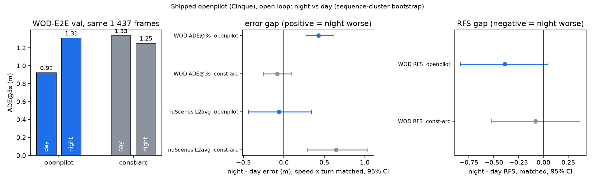

# Is shipped openpilot worse at night? Open-loop day vs night, plus an audit of the "night collapse" claims

2026-10-05. Measurement only, no training, no GPU (existing serving predictions, CPU scoring). Scripts: `experiments/leaderboard_audit/scripts/ng_lum.py`
(luminance scan), `ng_analyze.py` (gaps and bootstrap), `ng_sheet.py` (contact sheet), `ng_fig.py` (figure). Tables: `night_gap/summary.json`,
`night_gap/seq_lum.csv`. Figure: `night_gap/night_gap.png`. Contact sheet: `night_gap/sheet.jpg`.

## 1. Result

Shipped Cinque, unified WOD interface (true roof height, real 10 Hz frames fed twice, 10 s warm-up, open loop), WOD-E2E val, 1 437 frames with logged
futures (479 rater frames + 958 extra frames, the existing `preds/op_cinque`), 479 sequences. Night = sequence luma < 50 (132 sequences, 397 frames);
day = luma >= 120 (326 sequences, 977 frames); dusk (21 sequences, 63 frames) is mixed and kept out of the headline (section 4).

| metric (night vs day) | night | day | gap raw [95% CI] | gap matched on speed x turn [95% CI] |
|---|---|---|---|---|
| ADE@3s (m) | 1.308 | 0.921 | +0.39 [+0.20, +0.61] | **+0.43 [+0.28, +0.61]** (+46%) |
| FDE@3s (m) | 2.658 | 2.057 | +0.60 [+0.23, +1.03] | +0.67 [+0.35, +1.04] |
| ADE@5s (m) | 2.459 | 1.952 | +0.51 [+0.18, +0.88] | +0.56 [+0.28, +0.88] |
| FDE@5s (m) | 5.476 | 4.755 | +0.72 [+0.01, +1.53] | +0.80 [+0.12, +1.55] |
| lateral error @3s (m) | 0.356 | 0.282 | +0.07 [-0.02, +0.17] | +0.07 [0.00, +0.15] |
| heading error @3s (deg, moving frames) | 2.24 | 1.49 | +0.75 [-0.14, +1.94] | +0.53 [-0.24, +1.68] |
| RFS (479 rater frames: 133 night, 325 day) | 7.61 | 8.10 | -0.49 [-0.92, -0.05] | -0.39 [-0.83, +0.05] |

- Bootstrap: resampling sequences (B = 4 000), because the extra frames of a sequence are not independent. Matching: day re-weighted onto the night mix of
  (initial speed bin <2 / 2-6 / 6-12 / >12 m/s) x (logged 3 s displacement: stopped / straight / turning), cells present in both. Night and day do not
  differ much in mix (mean v0 4.65 vs 5.26 m/s, moving 80% vs 82%, turning 11.8% vs 10.8%), so matching moves the gap by 0.04 m only.
- The gap is a model gap, not a harder-scenes gap. The constant-arc baseline (jevdrive.waymo.baselines, ego history only) on the same frames shows no night
  gap: ADE@3s 1.251 night vs 1.333 day, gap -0.08 [-0.25, +0.09]. openpilot minus baseline: night +0.057 vs day -0.412, difference +0.51 [+0.30, +0.74] m.
  Cluster-standardised (night mix over the 9 scenario clusters with >= 10 frames in both) the ADE@3s gap is +0.41 m, and openpilot is worse at night in 9 of 9
  clusters (Cyclist 1.71 vs 0.97, Foreign Object Debris 1.52 vs 1.03, Single-Lane 1.09 vs 0.63, Special Vehicles 0.97 vs 0.64, Intersections 1.19 vs 0.86,
  ...; per-cluster n is 15-120 night frames, so single clusters are directions only).
- Luma-cut sensitivity of the ADE@3s gap (raw / matched): cut 35 (325 night frames) +0.48 / +0.50; cut 50 +0.39 / +0.43; cut 65 (412 frames) +0.39 / +0.43.
- RFS: the night drop is -0.49 raw and CI-excludes zero, -0.39 matched and the CI touches zero (+0.05); the baseline's RFS gap is -0.18 / -0.08, CI wide. Read RFS as
  "same direction, smaller than the error gap suggests, 133 frames".
- nuScenes (openpilot Cinque, preds/op_cinque_none, `main` set 4 636 samples; night = the word "night" in the scene description: 15 scenes, 465 samples; day 135
  scenes): **no night gap at 2 s / 3 s**. L2 (m) night vs day: 1 s 0.805 vs 0.583 (matched +0.15 [+0.00, +0.30]), 2 s 1.83 vs 1.67 (matched 0.00 [-0.35, +0.37]),
  3 s 3.10 vs 3.15 (matched -0.33 [-0.99, +0.38]), avg +0.11 raw / -0.06 matched [-0.44, +0.34]. The constant-arc baseline is worse at night there (+0.65 m avg), so
  night nuScenes scenes are kinematically harder and openpilot is not worse on them. Caveats: 15 scenes; nuScenes night (Boston / Singapore, lit streets) is not WOD
  night (San Francisco side streets, much darker, see the sheet).
- Not run: WOD train frames (no time-of-day metadata there either, and the train shards on disk are not dense enough for the 10 s openpilot history), a new GPU run
  (no need, 397 night frames already exist), and any CARLA / B2D night measurement of openpilot.

## 2. Night label

WOD-E2E shards carry no usable time of day: `frame.context.stats` (time_of_day, location, weather fields exist in the proto) is empty in the E2ED frames I
parsed. So the label is luma: the median over frames 100..230 (every 10th) of the mean front-camera luma, per sequence (479 sequences, 6 584 frames; the
sequence value is stable, median within-sequence sd 6.6). The distribution is bimodal: 292 sequences >= 140, 15 / 66 / 44 sequences in luma 0-20 / 20-30 / 30-40
(night), only 21 between 50 and 120. Validation by eye: [night_gap/sheet.jpg](night_gap/sheet.jpg), openpilot's road (left) and wide (right) model frame of 6 night,
2 dusk and 4 day target frames (random per label, seed 1): all 6 night are real night (street lights, dark road; road and wide views both dark), 4 of 4 day are day.
The two "dusk" frames show the bin is a mix: luma 98 is an overcast daytime frame, luma 71 is a rainy night with lens droplets. Night here is 28% of val sequences.

## 3. Audit of the claims in the other session's note

| claim | what the number is | model | data | verdict |
|---|---|---|---|---|
| WOD Spotlight 6.93 "collapses at night" | 6.932 is the RFS of a **trained prediag head** ("e gated attn grid", decision 23, direction-1 column; `experiments/prediag/README.md` line 86). It is not a Spotlight number. | frozen Qwen features + trained gated-attention head, not openpilot | WOD val RFS | **wrong attribution.** `Spotlight` is a **scenario cluster** of the WOD-E2E challenge (the rare long-tail events of the test set, per the challenge cluster list), not a lighting condition. WOD val has **no** Spotlight sequences (`docs/waymo-e2e.md`: "10 of the 11 clusters; val has no Spotlight"); the val cluster file lists Pedestrian / Cyclist / Foreign Object Debris / Intersections / Cut_ins / Construction / Special Vehicles / Multi-Lane / Single-Lane / Others. Nothing in the dataset files or index relates Spotlight to darkness. (My basis for "rare long-tail events": the cluster is test-only here and described that way in `research/lit/2026-09-21-round3-waymo-ego-only-absence.md`; I did not find an official definition on the box.) |
| CARLA P5 night ped recall 0.27 | `experiments/fusion_diag/results/q4/p5_hazard.csv` row "pedestrian, night": recall 0.270, n = 419 (374 frames); the day row is "<= 30 m, day" 0.65 | **SAM 3.1** open-vocabulary detector lifted to BEV (fusion_diag q4), not openpilot | CARLA P5 pedestrian scenarios, rendered 2026-09-25..26 | **not comparable and not openpilot.** The night row is not distance-limited while the day row is <= 30 m (the same file gives 0.49 over all frames, 0.88 within 20 m), so the 0.27 vs 0.65 contrast mixes range. The renders **predate decision 60** (2026-09-29): the night / dusk darkening bug (RouteLightsBehavior switching the lights off; fix `B2D_KEEP_STREET_LIGHTS=1`, default off) changes night frames by +0.8 to +13 brightness, so these night frames are a render artifact until re-rendered; I found no use of the flag in the fusion_diag lanes. |
| nuScenes night far ped recall 0.063 | `nusc_vis2_recall.csv`: pedestrian, 20-40 m, night = 1 of 16 | SAM 3.1 (vis2 reading), not openpilot | nuScenes val | **tiny n.** Night pedestrians all distances: 0.282 (n = 39) vs day 0.326 (n = 10 015); vehicles night 0.384 vs day 0.358 (n = 1 246 vs 18 110). No night collapse in this file; 0.063 is one hit in 16. |
| B2D night routes | no night-vs-day openpilot / pure-vision comparison found in `experiments/night_queue_4/results/g/g.md` (it has no night split) or the INDEX | n/a | CARLA | **not verified.** Any B2D night number rendered before 2026-09-29 or without `B2D_KEEP_STREET_LIGHTS=1` is suspect by decision 60 (and decision 60 itself is still marked open: tested on 3 Town03 routes). |

So the note's four numbers are from three different models (a trained head, SAM 3.1 twice) and none is a shipped-openpilot night measurement; two are CARLA / low-n
and one is a mislabelled RFS.

## 4. Limits

- 132 night sequences, one location mix (WOD val, mostly San Francisco). Night is confounded with lighting only through the luma label: rain, glare, lens
  droplets at night are inside the night bin (the dusk bin shows how much rain-at-night there is). Night vs day sequences are different drives, so route, traffic and
  scenario content differ; speed and turn are matched, cluster mix is checked (+0.41 m), nothing else is.
- ADE@3s on logged futures measures agreement with what the human did; the constant-arc baseline gap near zero says the logged futures at night are not harder to
  extrapolate, so the openpilot-specific +0.4 m is not a tail of a few extreme frames (per-cluster direction 9 of 9).
- RFS night gap is borderline (matched CI touches zero). 479 rater frames, one per sequence.
- nuScenes shows nothing at 2-3 s with 15 night scenes; the 1 s gap (+0.15 m) is the only one that excludes zero and the baseline has it too (+0.20).
- The dusk bin (21 sequences) is mixed (overcast day, rainy night) and its gaps (ADE@3s +0.29 [-0.02, +0.63] raw) are not interpretable.

## 5. Draft decision paragraph (Chinese, for main)

出厂 openpilot（Cinque）在真实夜间数据上确实更差，但幅度是中等的，不是 collapse（CPU 复算，复用现有 `preds/op_cinque`，WOD-E2E val 1 437 帧，479 个序列）：夜间（序列平均亮度 < 50，132 个序列 / 397 帧，目检 6 帧均为真夜）对白天（977 帧）的 ADE@3s 为 1.31 vs 0.92 m，按 speed x turn 匹配后差 +0.43 [+0.28, +0.61]（约 +46%），FDE@3s +0.67 [+0.35, +1.04]；按 cluster 标准化后 +0.41，够样本（昼夜各 >= 10 帧）的 9 个 cluster 全部方向一致。同一批帧上 ego-only 的 constant-arc 基线没有夜间差（-0.08 [-0.25, +0.09]），所以这是模型的差距，不是夜间场景更难外推；openpilot 减基线的夜昼差 +0.51 [+0.30, +0.74]。RFS 夜间 7.61 vs 日间 8.10，匹配后 -0.39 [-0.83, +0.05]，方向一致但 CI 贴零（133 帧）。nuScenes 夜间（15 个 scene，465 个样本）在 2 s / 3 s 看不到差距（匹配后 L2 avg -0.06 [-0.44, +0.34]；基线在那里反而夜间更差），且 nuScenes 夜间比 WOD 夜间亮得多，不能互相佐证。另一个 session 的「纯视觉模型夜间崩溃」不能引用：WOD「Spotlight」是 WOD-E2E 的场景 cluster（长尾罕见事件，val 里没有这个 cluster），不是低光，6.93 是 prediag 里一个训练出来的 gated-attn head 的 RFS；CARLA P5 夜间行人 recall 0.27 和 nuScenes 夜间远距行人 0.063（16 个里 1 个）都是 SAM 3.1 检测器，不是 openpilot，前者夜间行与白天行（<= 30 m）距离范围不同，且渲染早于 decision 60 的路灯修复（夜间帧是渲染伪影），后者 n = 16，同一份文件里夜间行人总体 recall 0.28 vs 白天 0.33 没有差。状态：WOD 上夜间 ADE 差距**已测量**（中等、方向稳定）；RFS 差距**待定**；CARLA / B2D 夜间 openpilot 差距**未测**，且 decision 60 修复前的任何夜间渲染数字都不可用。
