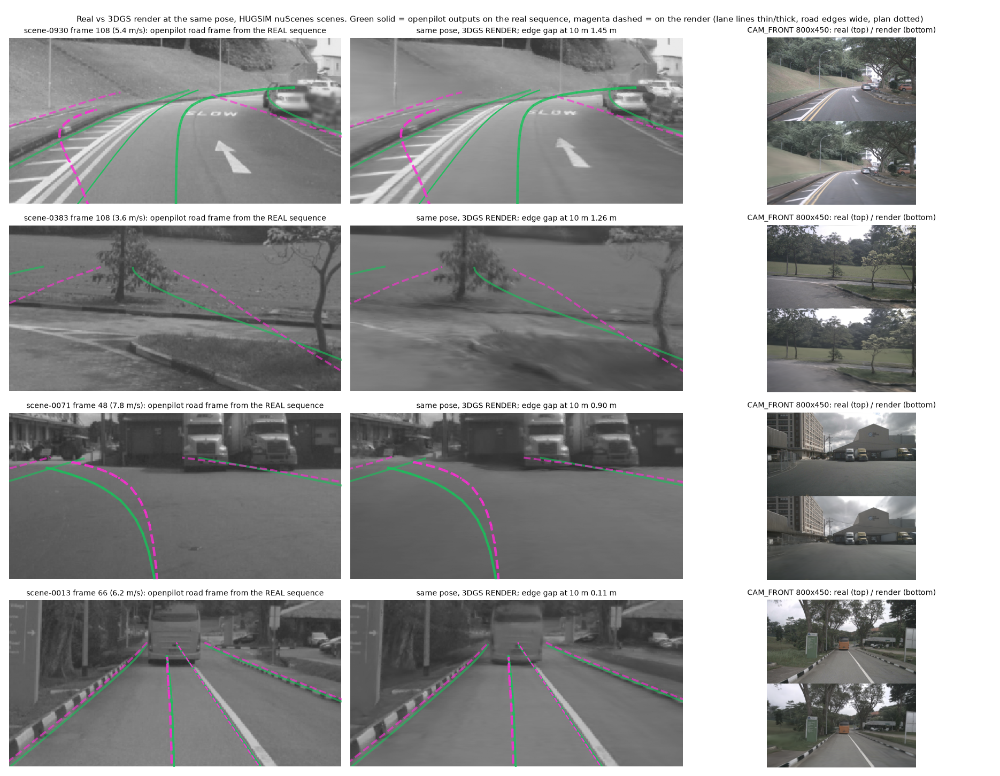

# Real vs render at the same pose: openpilot outputs (2026-10-04)

Question (decision 108, next step): geometry is ruled out; are rendered frames themselves what makes openpilot abnormal on navhard stage 2,
HUGSIM and B2D? Pre-registration: [plans/2026-10-04-real-vs-render-prereg.md](../plans/2026-10-04-real-vs-render-prereg.md) (f58f72b4, before
any openpilot run). Code `scripts/rvr_*.py`; numbers `real_vs_render/stats.json`, `analysis.txt`, `fixes.json`, `imgstats.json`, `nav_imgstats.json`.
Model: Cinque (ORT-TRT), desire 0, traffic (1, 0). CIs: 95% bootstrap over scenes (HUGSIM) or logs (navhard).

What to look at: green solid = openpilot on the real sequence, magenta dashed = on the 3DGS render of the same pose, drawn on both model frames.
Rows 1-3 are the frames with the largest road-edge gaps (curves and junctions, where the render smears the kerb and the far road): the edges
and outer lane lines move by about 1 m while the plan stays put. Row 4 (a typical straight frame) shows the usual case: the two sets coincide.

## Setup

- **HUGSIM nuScenes, 19 scenes** (all nuScenes scenes of the HUGSIM release), 180 frames x 3 front cameras each, nominal 12 Hz, 15 s.
  Real = the nuScenes JPEGs resized 1600x900 -> 800x450. Frame i = the sweep nearest in time to the camera's first key frame + meta timestamp i;
  checked on scene-0383, whose reconstruction inputs ship with HUGSIM: PSNR 42-44 dB against HUGSIM's own training images on all three cameras
  (a JPEG re-encode). Render = the scene's 3DGS at the recorded camera poses, intrinsics and dynamic-object poses (training views: the
  renderer's best case). Median CAM_FRONT PSNR of render vs real per scene 21.9-30.5 dB.
- Both arms go through the closed loop's own adapter (`hugsim_zs.OpenpilotFrames(calibs(nuscenes_camera.yaml, cam_rect))`).
- Stream: zero state, 20 Hz, the newest 12 Hz frame at each step, outputs read at the step where each new frame arrives, frames >= 3 s (2717 frame pairs).
- Floor (pre-registered): real vs real adjacent frame (83 ms). Added after seeing it (disclosed): the 12 Hz source fed at 20 Hz and the 100 / 100 / 50 ms
  sweep spacing put adjacent frames at different phases of openpilot's 0.2 s frame pair, which inflates the plan-speed floor; frames k and k+3 (0.25 s)
  share the phase and give a second floor.
- **Closed-loop rig** (`env`): the same scenes rendered as HUGSIM's env renders them along the logged trajectory (ego on the env ground, yaw only,
  camera 0.3 m lower by cam_rect, simulator intrinsics, no recorded dynamic objects). No real counterpart; it shows what the closed loop adds.
- **navhard stage 2**: synthetic frames share the log's timestamps but sit > 1 m from the logged pose almost always; 146 frames (39 logs) are within
  0.5 m and 1 deg (27 within 0.2 m). Single-frame protocol (each frame held 1.5 s from a zero state), op_lb's CPU warp of CAM_F0, lane lines and road
  edges rigidly compensated for the pose offset; floor = the next real log frame (0.5 s, compensated).

## 1. HUGSIM: real vs training-view render

| readout | floor RR (adjacent) | real vs render RS | RS / RR [95% CI] | RS / phase floor [CI] | meaningful (prereg) |
|---|---|---|---|---|---|
| **plan lateral @4 s** (m) | 0.241 | 0.152 | 0.63 [0.46, 0.85] | 0.79 [0.66, 0.98] | no |
| **road edge y @10 m** (m) | 0.159 | 0.289 | **1.82 [1.55, 2.18]** | 1.31 [1.14, 1.51] | **yes** |
| **lane line y @10 m** (m) | 0.024 | 0.024 | 1.03 [0.83, 1.30] | 0.64 [0.50, 0.80] | no |
| **plan speed v0** (m/s) | 0.585 | 0.309 | 0.53 [0.33, 0.82] | 1.20 [0.93, 1.66] | no |
| plan lateral @2 s | 0.085 | 0.059 | 0.69 [0.50, 0.88] | 0.88 | no |
| plan x @4 s (m) | 3.98 | 1.96 | 0.49 [0.34, 0.66] | 1.14 | no |
| plan heading @3 s (deg) | 0.361 | 0.309 | 0.86 [0.67, 1.09] | 0.80 | no |
| lane line y @20 m | 0.034 | 0.040 | 1.18 [0.97, 1.42] | 0.68 | no |
| lane line probability | 0.021 | 0.027 | 1.29 [1.05, 1.56] | 1.00 | yes |
| lead probability | 0.007 | 0.005 | 0.69 [0.51, 0.90] | 1.13 | no |
| lead x (m, both p > 0.5; 339 frames) | 0.86 | 0.98 | 1.15 [0.98, 1.50] | 1.19 | no |

Primary readouts (bold) with a meaningful gap: 1 of 4 -> **partly** by the pre-registered rule: only the road edges move beyond the floor. The plan
differs less between real and render than between two adjacent real frames.

Signed shifts render minus real (median [CI]; real level): plan speed +0.125 m/s [+0.055, +0.238] on 6.51 (+1.9%), lane width @10 m +0.052 m
[+0.036, +0.069] on 2.86 (+1.8%), model road z +0.037 m [+0.018, +0.053] on 1.27; lane probability -0.008 [-0.017, -0.003]; plan lateral, heading,
lead n.s. The render is read at nearly the same scale as the real frame.

Per scene, the edge gap does not grow as render quality drops (Spearman of PSNR vs edge gap +0.50, vs plan-lateral gap +0.21; n 19).

## 2. History-yaw sensitivity (decisions 92 / 100 style), real vs render at the same frames

266 probe frames (every 1 s from 1.5 s), 19 scenes. G_w = half the left-minus-right 3 s plan heading after a fake +-w deg/s yaw in the last 1.5 s
of history (deg). L = launch gain: the frame held 5 s, then a 1 s yaw ramp to +-1 deg; half the left-minus-right 3 s heading per degree.
Ratios = arm / real, scenes resampled.

| | real | render | render / real [CI] | closed-loop rig / real [CI] | real blurred to render softness / real [CI] | render sharpened + noise / real |
|---|---|---|---|---|---|---|
| **L, all** | 3.56 | 5.09 | **1.43 [1.34, 1.52]** (19 / 19 scenes up) | 1.46 [1.34, 1.60] | 1.08 [1.06, 1.10] | 1.48 [1.38, 1.60] |
| L, low 0.5-3 m/s (14 frames, 6 scenes) | 3.94 | 5.66 | 1.44 [1.28, 1.69] | 1.55 [1.32, 1.80] | 1.08 [1.05, 1.12] | 1.46 |
| L, >= 3 m/s (250) | 3.54 | 5.06 | 1.43 [1.34, 1.52] | 1.46 [1.32, 1.60] | 1.08 [1.06, 1.10] | 1.49 |
| G10, >= 3 m/s | 1.78 | 2.14 | 1.20 [1.03, 1.43] | 1.38 [1.13, 1.63] | 1.06 [1.02, 1.12] | 1.09 [0.85, 1.37] |
| G10, low | 9.57 | 8.80 | 0.92 [0.57, 1.54] | 0.83 [0.52, 1.15] | 1.00 [0.96, 1.14] | 0.85 |
| G1, all | 0.09 | 0.11 | 1.16 [0.29, 2.87] | | 1.14 | 0.92 |

Stop bin: 2 frames (1 scene), not read. Plan heading at 3 s without injection differs by 0.29 deg [0.19, 0.47] (median |render - real|).
- **Launch gain is a render-domain effect**: +43% [+34, +52%], in every scene (per-scene L real 1.7-5.8, render 2.1-7.5), passing the 20% line.
  Blurring the real frames to the render's high-frequency share (Gaussian sigma 0.5 px at 800x450) explains +8% of it; sharpening and noise on the
  render remove none of it, so it is not the missing high frequencies but something else in the 3DGS image. Our render L (5.1) is the step-1
  local gain decision 100 measured on HUGSIM spin logs (5.0-5.4); the real frames give 3.6.
- G10 at speed rises 20% (CI just above 1; point estimate 19.7%, on the 20% line): weak.

## 3. Image-side fixes (fitted on 5 calibration scenes, scored on the other 14)

Fits: unsharp sigma 0.7 px, amount 4 (render high-frequency share 0.0075 -> 0.0127, real 0.0122); colour affine gains 1.007-1.009 (colour already matches);
additive grey noise sigma 0.82 (Immerkaer noise 0.59 render vs 1.09 real; 1.36 after the fix, overshoot from rounding).

| arm (eval scenes) | closure plan lat @4 s | closure edge @10 m | closure lane @10 m | closure plan v0 | works (>= 0.5 and no harm) |
|---|---|---|---|---|---|
| render + sharpen | +0.03 [-0.09, +0.09] | +0.05 [0.00, +0.11] | +0.04 [-0.03, +0.10] | -0.02 [-0.11, +0.05] | no |
| render + colour + noise | -0.07 [-0.23, +0.09] | +0.13 [-0.02, +0.27] | +0.10 [-0.17, +0.28] | -0.05 [-0.24, +0.08] | no |
| render + all three | -0.13 [-0.34, 0.00] | +0.05 [-0.21, +0.25] | -0.05 [-0.28, +0.12] | -0.17 [-0.46, 0.00] | no |

Harm on real frames (median |real - real fixed| / floor): sharpen 0.12 / 0.51 / 0.40 / 0.09, all three 0.15 / 0.82 / 0.53 / 0.13 (all <= 1: no harm).
No fix closes half the gap on any primary readout, and none touches the launch-gain rise (section 2). No per-board image trick is recommended.

## 4. The closed-loop rig adds a geometry change, not more render error

Closed-loop-rig render vs real, ratio to the adjacent floor: lane line @10 m 16.0 [11.2, 20.5], road edge 5.5 [4.7, 6.8], plan speed 1.94 [1.48, 2.66],
plan lateral @4 s 1.55 [1.15, 1.99], heading 1.90 [1.33, 2.86]. It differs as much from the training-view render as from the real frame (lane 0.371 vs
0.379 m, edge 0.689 vs 0.873 m), so the difference is the rig, not the renderer. Shifts vs real: lane width +0.52 m [+0.39, +0.65] (+18%), plan speed
+1.09 m/s [+0.90, +1.32] (+17%), plan x @4 s +3.4 m: the 0.3 m lower camera (about 1.5 -> 1.2 m, predicted scale x1.25) moves the nuScenes scenes
to openpilot's own height, as decision 108 inferred. Also a small rightward bias: plan lateral @4 s +0.15 m [+0.04, +0.26] and heading -0.37 deg
[-0.52, -0.21] (not explained here). The launch gain on the rig is the same as on the training-view render (1.46 vs 1.43).

## 5. navhard stage 2 (near-pose pairs, weak)

Synthetic CAM_F0 is much softer than real (high-frequency share 0.0037 vs 0.0145, noise 0.49 vs 1.17; HUGSIM renders 0.0075 vs 0.0122).

| readout (146 pairs, 39 logs) | floor (next real, 0.5 s) | synthetic vs real | ratio [CI] | sharpened synthetic vs real | ratio [CI] |
|---|---|---|---|---|---|
| road edge y @10 m | 0.39 | 0.50 | 1.28 [0.84, 1.80] | 0.29 | 0.75 [0.55, 1.06] |
| lane line y @10 m (13-15 pairs with both lines) | 0.063 | 0.076 | 1.21 [0.53, 8.2] | 0.087 | 1.39 [0.50, 3.85] |
| lane line probability | 0.014 | 0.014 | 0.97 [0.55, 2.14] | 0.011 | 0.75 [0.48, 1.61] |

No readout passes the line against this floor (the 0.5 s floor is loose: the car moves 0-8 m between log frames). Sharpening (sigma 3 px, amount 1,
fitted on the first 40 pairs, so partly in-sample) lowers the edge gap 0.50 -> 0.29 m (closure 0.41, under the 0.5 line).

## 6. Reference: model-frame sharpness per board

Road model frames of `board_views` (2 frames per board, so indicative only; `hf_share` and `noise_sigma` of `rvr_hugsim_op.py` run inline on the PNGs): high-frequency share / Immerkaer noise: WOD 0.051, 0.015 / 1.8, 2.4;
navtest 0.019, 0.026 / 1.7, 2.2; navhard 0.017, 0.0005 / 0.5, 0.4; HUGSIM 0.003, 0.003 / 0.4, 0.2; **B2D 0.027, 0.011 / 3.6, 2.6**. CARLA frames are
as sharp and noisy as the real boards, so softness cannot be a cause shared by all three abnormal boards.

## Reading

1. (Evidence) At the same pose, a HUGSIM 3DGS render moves openpilot's road edges by 0.29 m at 10 m (1.8x the adjacent-frame floor) and lowers lane
   confidence slightly, but not the plan: plan lateral, heading and speed differ less between render and real than between two adjacent real
   frames, and the scale read shifts < 2%. By the pre-registered rule this is **partly**: the render domain, frame by frame, does not make the plan abnormal.
2. (Evidence) The render domain raises the plan's response to a small history yaw after a standstill by 43% [34, 52%] in all 19 scenes. This is the
   gain decision 100 found driving the HUGSIM spins (step-1 local gain 5.0-5.4, matched by our renders' 5.1; real frames 3.6). Softness accounts for
   about +8%; sharpening and noise do not remove it.
3. (Evidence) No cheap image-side fix (sharpening, colour, noise) closes half of any gap; on HUGSIM they do nothing for the launch gain.
4. (Evidence) The closed-loop rig's output differences are geometry (0.3 m lower camera: +18% lane width, +17% plan speed), not more render error.
5. (Inference) The render explanation fits HUGSIM's spins (launch amplification), not its whole picture; for navhard the pairs are too few and the floor
   too loose to say; for B2D, CARLA images are sharp and noisy like real ones, so "synthetic frames" can only be a common cause through image content
   other than softness, which this experiment did not test there. What the three abnormal boards still share is the closed or pseudo-closed loop.

Limits: training-view renders are the best case (closed-loop views are novel); 19 scenes, one dataset (nuScenes) of HUGSIM; the 12 Hz source fed at 20 Hz
adds phase jitter to the floor (second floor reported); launch and G probes are open-loop; navhard uses a single-frame protocol on 146 offset-matched
frames; board_views sharpness uses 2 frames per board.
