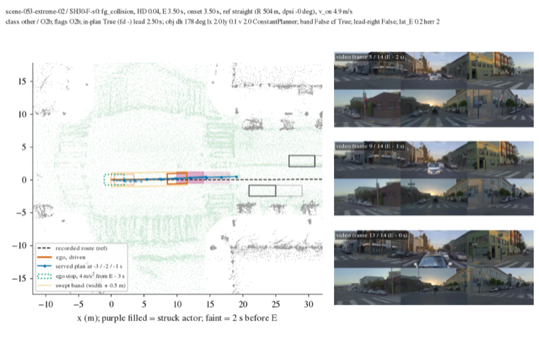
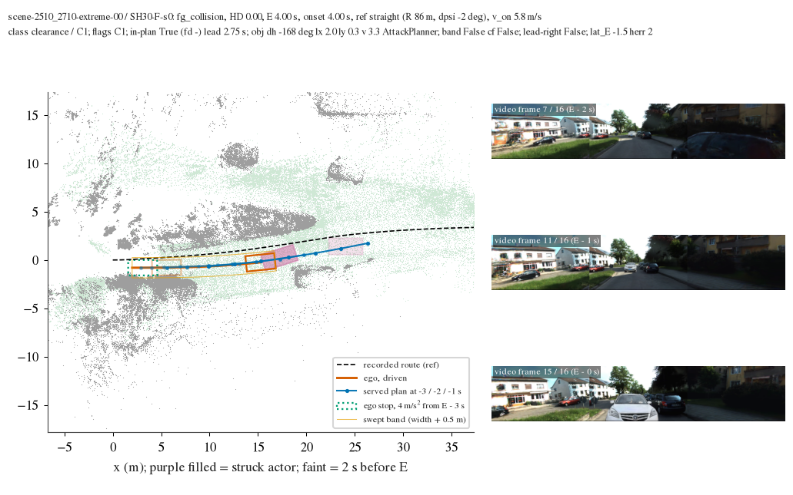
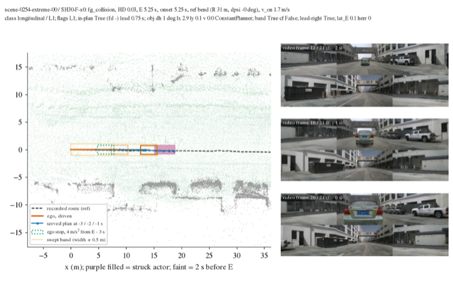
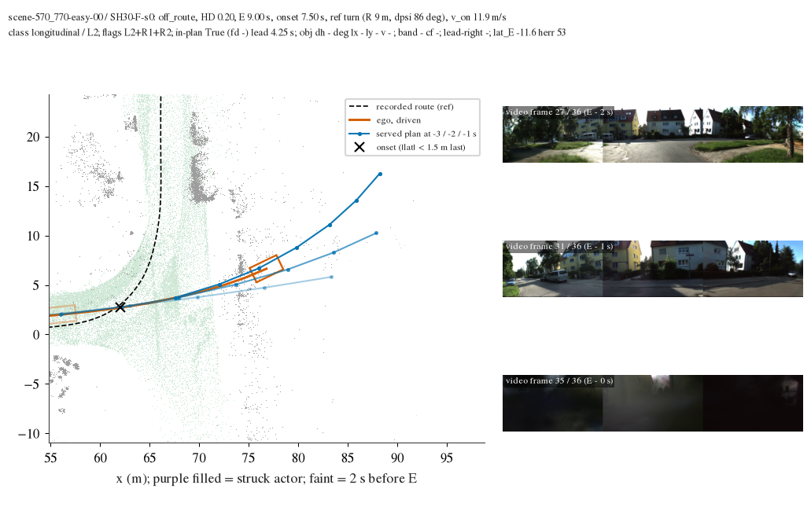

# LOWDIAG, HUGSIM half: the 38 failed SH30 runs split three ways (other 31%, longitudinal 31%, clearance 30% of the lost score); route is 1%

Written 2026-10-10. Pre-registration: [plans/2026-10-10-lowdiag-prereg.md](../plans/2026-10-10-lowdiag-prereg.md) (sections 1-6, 8; thresholds
and class definitions unchanged). Script [`scripts/lbd_hugsim.py`](../scripts/lbd_hugsim.py) (`extract` on the box, `report`, `bev`); all
tables in [hugsim/tables.md](hugsim/tables.md), one row per run in [hugsim/units.csv](hugsim/units.csv), failed units in
[hugsim/failed_units.csv](hugsim/failed_units.csv). No GPU, no new HUGSIM run.

**Scope (cut on 2026-10-10, after the pre-registration).** One seed: `SH30-F-s0` `spec_plan_smooth`, all64 (64 runs, mean HD 0.4432, lost
score 35.63). `SH30-F-s1` is not read. The closed-loop `P0` `spec_plan_smooth` run was cancelled, so the column "base-right (closed-loop
P0)" is **not determined**; the stored shipped-weights run under the other preset (`P0` `spec`) is shown as a labelled reference only.
The stage-1 check was shrunk to 7 runs. With one seed the "two seeds differ" cases of section 8 do not exist.

## Board (T1)

Unit = run; lost = 1 - HD; share = class lost / lost over the 64 runs; CI = scenario bootstrap of the ratio of sums, 10 000 draws. Ends:
fg_collision 28, bg_collision 9, off_route 1, max_steps 0, complete 26.

| class | runs = scenarios | lost | share of lost [95% CI] | mean HD | base-right (lead, same moment), K = agent | base-right (closed-loop P0) | in-plan | plan lead, median |
|---|---|---|---|---|---|---|---|---|
| other (O2) | 12 | 11.10 | 0.311 [0.166, 0.457] | 0.075 | 1 / 12 (lost share 0.09) | not determined | 12 / 12 | 2.5 s |
| longitudinal (L1, L2) | 13 | 11.02 | 0.309 [0.172, 0.454] | 0.153 | 6 / 9 (lost share 0.64) | not determined | 12 / 13 | 1.6 s |
| route (R1 / R2) | 1 | 0.36 | 0.010 [0.000, 0.034] | 0.636 | - | not determined | 1 / 1 | 2.25 s |
| clearance (C1, C2) | 12 | 10.79 | 0.303 [0.160, 0.447] | 0.101 | 1 / 7 (lost share 0.14) | not determined | 7 / 12 | 2.75 s |
| complete with penalties | 26 | 2.37 | 0.066 [0.025, 0.127] | 0.909 | | | | |
| all failed | 38 | 33.27 | 0.934 [0.873, 0.975] | 0.125 | 8 / 28 (0.27) | not determined | 32 / 38 | 2.5 s |

The three large classes are not separable (CIs overlap completely; 12-13 scenarios each). Sub-classes
([hugsim/board_sub.csv](hugsim/board_sub.csv)):

| class | sub | K | runs | lost | share |
|---|---|---|---|---|---|
| other | O2b oncoming / crossing actor, hit even when stopped | agent | 11 | 10.19 | 0.286 |
| other | O2c rear-ended | agent | 1 | 0.91 | 0.026 |
| longitudinal | L1 no-stop (lead in the driven band, braking avoids it) | agent | 9 | 7.81 | 0.219 |
| longitudinal | L2 fast entry into a turn (v^2 / R 5.0-15.5 m/s^2, R 8.6-9.1 m) | boundary 3, corridor 1 | 4 | 3.21 | 0.090 |
| route | R1 + R2 (8440_8640-easy-00, clips the inside of a turn at 5.3 m/s) | boundary | 1 | 0.36 | 0.010 |
| clearance | C1 agent, not in the band, braking avoids the recorded actor | agent | 7 | 6.67 | 0.187 |
| clearance | C2 boundary on a bend (3) or straight (2) | boundary | 5 | 4.12 | 0.116 |

**Complete with penalties** (26 runs, 2.37 = 6.6% of the lost score), 1 - HD split by sub-score (exact Shapley over rc / nc / dac / ttc /
c, HD recomputed from `eval.json` and equal to the stored HD): nc 1.24 (52%, 12 runs), ttc 0.96 (41%, 15 runs), dac 0.09 (4%, 1 run),
comfort 0.08 (3%, 13 runs), rc 0. One run carries 0.73 of the 2.37: scene-0418-hard-00 (HD 0.27; nc and ttc loss on a run that was not ended).

### The O2b / C1 border is the main uncertainty of this table

18 of the 28 agent units are struck by an oncoming or crossing actor (|dh| >= 60 deg; lost share 0.473). Whether such a unit is O2b
(other) or C1 (clearance) is decided by the registered counterfactual "the ego brakes at 4 m/s^2 from E - 3 s along its driven path; is
it still hit". The stored run ends at E, so the actor has to be carried on past E; the pre-registration does not say how far.

| struck actor carried on at its last velocity until | other | longitudinal | route | clearance |
|---|---|---|---|---|
| E + 10 s (primary; long enough not to bind) | 12 runs, 0.311 | 13, 0.309 | 1, 0.010 | 12, 0.303 |
| E + 3 s | 5, 0.126 | 13, 0.309 | 1, 0.010 | 19, 0.488 |
| E (recorded motion only) | 1, 0.026 | 13, 0.309 | 1, 0.010 | 23, 0.589 |

Longitudinal and route do not move; other + clearance = 0.61 in every row. By the actor's planner in the scenario yaml: ConstantPlanner
7 O2b + 1 C1, AttackPlanner 4 O2b + 6 C1. For a ConstantPlanner actor (2.0 m/s, straight) the extrapolation is the simulator's own
script, so those 7 O2b are firm. An AttackPlanner actor re-plans against the ego, so its motion against a stopped ego is not in the
stored run: the 6 AttackPlanner C1 units (head-on, |dh| 122-172 deg, 2.7-4.1 m/s) are "avoided" only because the frozen straight line
misses the stopped ego. Reading with that in mind: 0.29 of the lost score (11 units) is an oncoming actor that a stop does not avoid by
the registered test, and a further 0.16 (6 AttackPlanner C1 units) is the same scene type with an undetermined counterfactual.

## Raw flags (T2, multi-select)

| flag | O1 | O2b | O2c | L1 | L2 | L4 | R1 | R2 | D | C1 | C2 |
|---|---|---|---|---|---|---|---|---|---|---|---|
| runs | 0 | 11 | 1 | 9 | 4 | 0 | 5 | 5 | 1 | 7 | 5 |
| lost | 0 | 10.19 | 0.91 | 7.81 | 3.21 | 0 | 3.57 | 3.57 | 0.45 | 6.67 | 4.12 |

Combinations: O2b 11, L1 9, C1 7, L2 + R1 + R2 4, C2 4, O2c 1, D + C2 1, R1 + R2 1. O2a / O2d / L3 are PAI only. The 4 L2 units all
carry R1 and R2 too (the car goes straight on at a junction turn): the priority puts them in longitudinal; counted as route they would
make route 0.100 and longitudinal 0.219. L4 is empty: no max_steps run in this seed.

## In the served plan, lead time, tracking (T3)

| K | runs | in-plan | lead time median (min-max) |
|---|---|---|---|
| agent, L1 | 9 | 9 | 1.25 s (0.75-2.25) |
| agent, C1 | 7 | 7 | 2.75 s (2.5-3.25) |
| agent, O2 | 12 | 12 | 2.5 s (0.75-4.0) |
| boundary | 9 | 3 by the registered rule (footprint coverage < 0.5); 9 by fd_hugsim's plan_off (coverage or > 100 background points) | 2.75 s (2.25-3.75) on the 3 |
| corridor | 1 | 1 | 4.25 s |

Every agent contact is in the served plan (the plan's own swept box meets the actor's box of the same time). The registered boundary
rule misses the 5 C2 units and 1 L2 unit because what is struck there is a background object standing on drivable ground (a parked van
and a parked pickup in the two C2 runs looked at), which ground coverage cannot see. Tracking deviation (ego vs the 0.5 s point of the
plan two states earlier): median 0.12 m over the failed runs, largest 1.12 m (570_770-easy-00, the fast junction entry): the failures
are in the plan, not in tracking it.

## Base-right

- **Lead head, same moment (T4; K = agent only)**: lead_prob >= 0.5 and a_need >= 1.5 m/s^2 at a step at least 1.5 s before E. L1 6 / 9
  (first such step a median 6.9 s before E; the lead head is on in 9 / 9), C1 1 / 7, O2b 1 / 11, O2c 0 / 1. In the longitudinal class
  the lead head asks for the stop in two thirds of the units and the served plan does not make it; for oncoming actors the lead head
  is on (10 / 11, 7 / 7) but does not ask for a deceleration (median of the maximal a_need 0.02 m/s^2; the head has no negative lead
  speed, decision 153).
- **Closed-loop P0**: not determined (run cancelled).
- **Reference, stored `P0` `spec`** (other preset, shipped weights; 24 of its 64 runs end in max_steps, HD 0.294): it reaches the arc
  length of the SH30 event in 6 of 38 units and passes it by 5 m in 4. Too few reached units to read a share; shown in
  [hugsim/ref_P0_spec.csv](hugsim/ref_P0_spec.csv).
- **Reference, WA-JEPA exam**: ends with the same event kind in other 11 / 12, clearance 8 / 12, longitudinal 5 / 13, route 0 / 1; passes
  the SH30 event arc by 5 m in 1 / 4, 2 / 4, 4 / 6 of the units it reaches. At the onset arc of the 4 L2 units WA-JEPA drives 1.8 m/s
  where SH30 drives 9.5-11.9 m/s on the two 570_770 scenarios (it completes both).

## Stage-1 check (before the full run)

Seven runs were rendered (BEV with ego box and track, route, served plans at -3 / -2 / -1 s, actor boxes, ground / background points,
the brake-counterfactual stop box and the swept band, plus three video frames) and each flag in the title was compared with the picture:

| run | end | what the picture shows | flags checked |
|---|---|---|---|
| scene-0254-extreme-00 | fg | standing car in lane, plans end in it | L1 (in band, front, braking stops 8 m short), in-plan, lead-right: agree |
| scene-1290_1490-medium-01 | fg | slower lead (2 m/s) at a junction | L1 agrees; no R1 (lat 0.7 m) agrees |
| scene-2510_2710-extreme-00 | fg | head-on AttackPlanner actor | not in band agrees; counterfactual "avoided" depends on the horizon (see fix 2) |
| scene-053-extreme-02 | fg | head-on ConstantPlanner actor in the ego lane | O2b agrees (the stopped ego is on the actor's line) |
| scene-570_770-easy-00 | off_route | straight on at 11.9 m/s where the route turns left (R 9 m) | L2, R1, R2, onset, in-plan (corridor) agree |
| scene-100613054308-hard-00 | bg | brushes a parked van on the right of a bend | C2, side outside agree; in-plan False by coverage though the plan runs through the van |
| scene-164701907483-easy-00 | bg | 1.5 m right of the route on a straight, into a parked pickup | D + C2 agree |

Fixed after looking (implementation and geometry only):
1. The bench run dirs keep no `ground.ply` / `scene.ply`; the point sets are read from the WA-JEPA run dir of the same scenario.
2. Actor motion past E in the brake counterfactual: first written as 3 s, changed to 10 s after seeing 2510_2710-extreme-00 (one unit;
   its own label did not change). Both, and "up to E", are kept as columns and in the sensitivity table above.
3. Video frames: empty camera rows cropped (figure only).

No threshold or class definition was changed.

## Figures

*O2b, scene-053-extreme-02. Orange = ego track and box (faint = 2 s before E), blue = served plans at -3 / -2 / -1 s, purple filled =
struck actor, dotted green = where the ego stands if it brakes at 4 m/s^2 from E - 3 s. Look at: the actor drives head-on down the ego's
own lane at 2 m/s; the stopped ego is still on its line.*

*C1, scene-2510_2710-extreme-00. Look at: the same scene type with an AttackPlanner actor; its last recorded velocity carries it past
the green stop box, so the registered test says "braking avoids it". This is the border case of the board.*

*L1, scene-0254-extreme-00. Look at: a standing car inside the swept band (thin orange outline) for the whole approach; the plans stop
inside it and the lead head asked for more than 1.5 m/s^2 2.5 s before the contact.*

*L2 (+ R1 + R2), scene-570_770-easy-00. Look at: the route (dashed) turns left with R 9 m, the ego arrives at 11.9 m/s and its plans
bend only after the cross (onset).*

## Deviations and choices

1. Scope: one seed, no closed-loop P0, no seed-difference cases (see the top).
2. Onset: the |lat| < 1.5 m rule is applied to every K (fd_hugsim applies it to bg / off_route and sets onset = E for fg); needed for
   R1 on K = agent. No agent unit ends up with R1.
3. Brake counterfactual: ego pose by arc length on the driven path, clamped to the path end; the struck actor as recorded up to E,
   then constant velocity (lm_offline's rule) for 10 s.
4. L1 band: buffer of (ego width + 0.5 m) / 2 around the driven centre line from the start to the ego's front end at E; "in the band >=
   2 s before E" is tested at E - 2 s.
5. In-plan, agent: plan points interpolated to 0.25 s, ego box heading from the plan segment, actor box of the same time (past E as in
   3). Boundary: registered rule = footprint coverage < 0.5 at a plan point; fd_hugsim's plan_off reported next to it. Corridor: plan
   end >= 1.5 m from the route and further out than the ego at that decision. Lead time: last consecutive hit run among the decisions
   before E.
6. base-right (lead): gap = lead_x - 1.5 m (device at the ego box centre), closing speed = v - lead_v / 1.25 (model to simulator
   units, lm_offline); `col1_pai.a_need`'s expression is repeated in the script because that module does not import without the
   AlpaSim log reader. The assumption that the served lead reading equals P0's (decision 219, measured on AlpaSim) is not tested here.
7. Reference "passed": max route arc >= s_E + 5 m (capped 1 m before the route end) or a complete run; "reached": >= s_E.
8. Ref geometry for a unit with R >= 50 m takes its turn sign from the heading change.
9. Complete row: Shapley split over the five sub-scores (the pre-registration says "by sub-score" without a rule).

## What could not be determined and why

- The same-moment P0 plan: stored runs keep neither frames nor a P0 forward.
- base-right (closed-loop P0): the run was cancelled; `P0` `spec` reaches only 6 of 38 event locations.
- The brake counterfactual against AttackPlanner actors (10 of the 18 oncoming units): the actor reacts to the ego; only a re-run
  with a braking ego can say whether a stop avoids it.
- Seed spread of the shares: one seed.
- Ref geometry of agent units is noisy: the +-4 m heading difference picks up jitter of the recorded route where the log car is slow
  (0254-extreme-00 is labelled bend with R 31 m and 0 deg heading change; 152217047339-extreme-00 has R 2.3 m at the start). No class
  depends on it (it enters only the D flag for agent units); the boundary / corridor units have real heading changes (11-86 deg).
- L4 and O1: no such unit in this seed.

## Recomputed here vs quoted

Recomputed from the stored SH30-F-s0 runs: every number above. Quoted: decision 153 (P2H10, three repeats: vehicle contacts are the
board, lead head has no negative lead speed), decision 170 (SH30 is level with P2H10 on HUGSIM), decision 219 (lead reading of the
served checkpoint equals P0's). Not comparable one to one with decision 153: other arm, one run instead of the modal label of three.

Reproduce: box `python experiments/lowboard_diag/scripts/lbd_hugsim.py extract --workers 4` (19 s), `report`, and
`bev --case "SH30-F-s0|scene-053-extreme-02" ...` (needs the WA-JEPA run dirs for the point sets).
