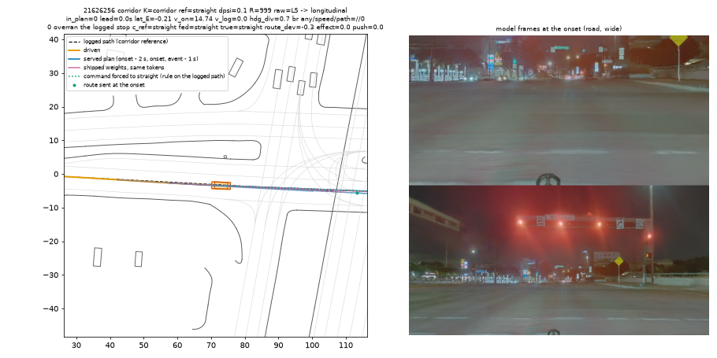
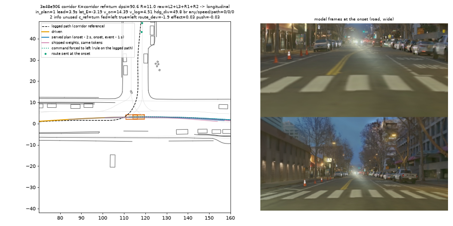
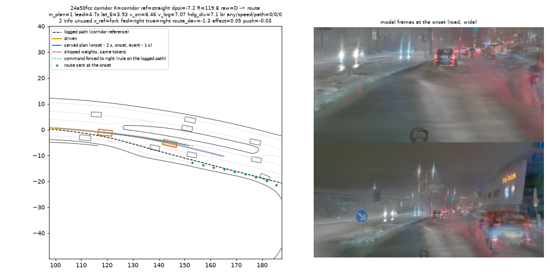
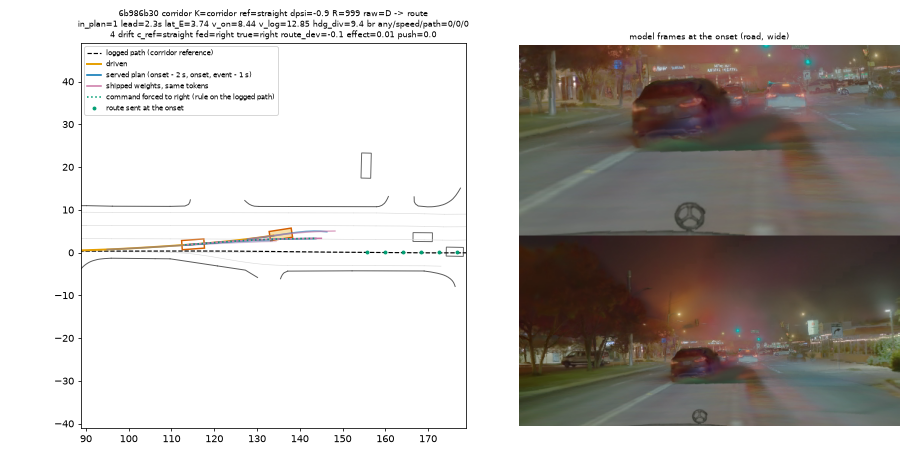
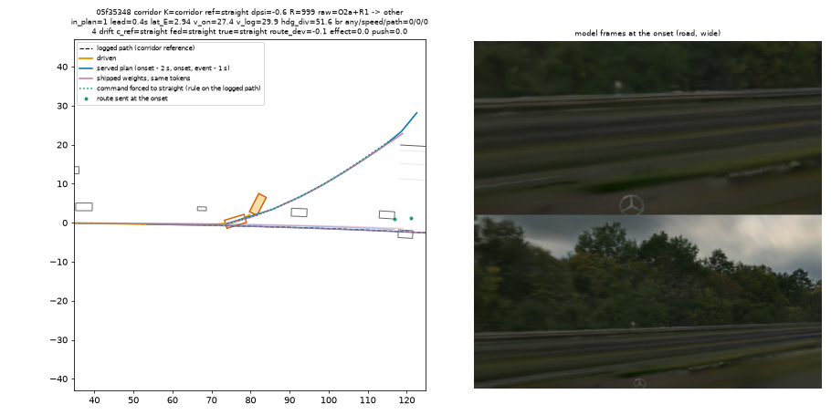
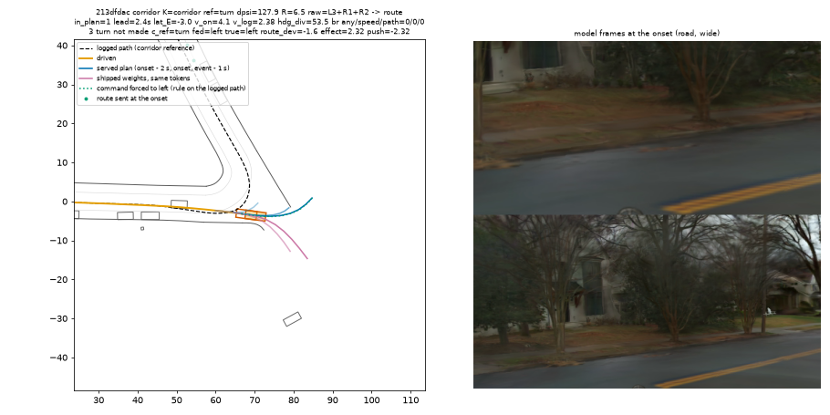

# LOWDIAG, PAI half: 18 "corridor" zeros are 5 overruns of the logged stop, 2 spins, 5 drifts, 5 turns / forks where the command is inert, 1 late turn; no case of missing route information

Written 2026-10-10. Pre-registration with two amendments: [plans/2026-10-10-lowdiag-prereg.md](../plans/2026-10-10-lowdiag-prereg.md).
Scripts [`scripts/lbd_pai_x.py`](../scripts/lbd_pai_x.py) (extraction), [`scripts/lbd_pai_replay.py`](../scripts/lbd_pai_replay.py)
(replay with the command forced to each value and the shipped weights, one pool job, 13 min on one card),
[`scripts/lbd_pai.py`](../scripts/lbd_pai.py) (`units`, `bev`). One row per rollout: [pai/units.csv](pai/units.csv).

**Scope.** One seed, stored rollouts only: base `P2H10-F-s0`, served (`JEV_VCONT=1.0 JEV_LEAD=1`, decision 226), the 60 PAI scenes of
lane FIX1's `ab_*_s0` stacks. Mean score 0.3590 (recomputed here from the per-rollout rows; decision 235's table has the same 0.3590 for
this tag). 33 zeros, 12 non-zero rollouts below 1, 15 at 1. Lost score = sum of (1 - score) = 38.46. 32 of the 33 zeros kept their
`rollout.asl` and are diagnosed against the simulator's boxes, the logged ego path and the map's road edges; the 33rd is a driver
exception. The 12 non-zero rollouts have no kept log and are read from the driver's own records only. No rollout was re-run.

## 1. The corridor question (pre-registration section "PAI corridor 零分的子类")

18 zeros carry the `left_corridor_laterally` flag (17 alone, 1 with offroad). What each one is:

| what happened | n | scenes | command fed = rule on the logged path | effect of forcing the command, 4 s end point (median) | shipped weights closer to the path |
|:--|--:|:--|:--|:--|:--|
| **0. Overran the logged stop** (Amendment 2): the ego is 3-4 m past the END of the logged path, lateral offset 0.2-2.9 m; the logged driver had stopped | 5 | 21626256, 9e3fd12d, b0fa4732 (red light in the model frames), 7a824ffa (give-way T-junction, 12.8 against 2.8 m/s), 1c7e2423 | n.a. | n.a. | 0 / 5 |
| **Spin at hand-over** (O2a, Amendment 2): start at 22.6 and 30.3 m/s, yaw rate 2.6-3.0 rad/s at 1.8-2.3 s | 2 | 05f35348, 69fc21e8 | n.a. | n.a. | 0 / 2 |
| **1. Route information missing or wrong** | 0 | | | | |
| **2. Information right, not used** (command right, route within 3 m of the path, effect < 1 m) | 5 | 3a48e906 (left turn, drives straight on at 14.4 against 4.5 m/s), 96da4f1a (right turn, straight on), 24a50fcc and 605bf77a (fork / lane shift, other branch), c6c01d25 (left turn made one lane wide) | 5 / 5 | 0.03, 0.40, 0.05, 0.10, 0.35 m | 1 / 5 |
| **3. Turn not made** (command right and it moves the plan) | 1 | 213dfdac (128 deg left, R 6.5 m: turns late, outside) | 1 / 1 | 2.32 m | 0 / 1 |
| **4. Drift on a straight reference** | 5 | b988494a, 75c23f07, 8457182d, fadc73da (no object ahead), 6b986b30 (a vehicle 6.8 m ahead in the lane: goes around it) | n.a. | 0.00-0.02 m | 1 / 5 |

- **Route information is not missing.** In all 6 non-straight cases the command the driver was fed equals the driver's own rule applied
  to the logged path, and the route waypoints lie within 3 m of the logged path. Sub-class 1 is empty.
- **The command does not move the plan.** Forcing the command to the right value against forcing it to straight changes the 4 s end
  point by at most 0.40 m in 10 of the 11 lateral departures (2.32 m in one). This is decision 219's 0.02 m, now read at the decisions
  where it mattered.
- **By the registered reading** (shares of the 11 real lateral departures: (1)+(2) 5 / 11 = 45%, (3) 1 / 11 = 9%, (4) 5 / 11 = 45%):
  no sub-class reaches 50%, so no single conclusion; the shares are the result. Without Amendment 2 (overruns and spins counted as
  drift, as the first version of the rules did) sub-class 4 is 12 / 18 = 67% and the registered reading is "drift, not route".
- **Size of a route line of work**: 5 zeros of 60 scenes where the car is told correctly and does not act on it (3 of them never
  attempt the manoeuvre), plus 1 late sharp turn. At the mean non-zero score of this tag (0.80) fixing all 6 is at most about +0.08.
  The same size as the overruns of the logged stop (5) and as the straight-road drifts (5).

## 2. Class shares of the lost score

Exclusive classes, priority other > longitudinal > route > clearance. Share = class lost / 38.46.

| class | zeros | share of lost | what is in it (raw flags) | in plan (3 s before) | plan lead, median | base right: any / speed / path |
|:--|--:|--:|:--|:--|--:|:--|
| other | 6 | 15.6% | spin at hand-over 4 (O2a), rear-ended by a 9.4 m/s car 1 (O2c), driver exception 1 (O1) | 5 / 5 | 0.4 s | 1 / 5, 0 / 5, 1 / 5 |
| longitudinal, zeros | 11 | 28.6% | overran the logged stop 5 (L5), fast entry into a turn 4 more (L2; 2 of the L5 also carry it), contact where braking clears 2 (L1) | 10 / 11 | 1.8 s | 2 / 10, 1 / 10, 1 / 11 |
| longitudinal, progress loss | 12 non-zero | 14.2% | slow without a lead limit 8 (lost 3.61), slow behind the lead limit 4 (lost 1.85) | n.a. | n.a. | not determined (logs pruned) |
| route | 9 | 23.4% | drift on a straight reference 5, fork / other branch 2, turn made wide 1, sharp turn late 1 | 9 / 9 | 2.4 s | 1 / 8, 0 / 8, 1 / 9 |
| clearance | 7 | 18.2% | road edge on a straight or wide curve 5 (C2), agent beside or crossing 2 (C1) | 7 / 7 | 1.2 s | 2 / 6, 1 / 6, 1 / 6 |

Longitudinal is 42.8% of the lost score in total. Raw flag counts over the 33 zeros (a unit can carry several): L3 over-speed against
the log 11, C2 9, D 8, R1 6, R2 6, L2 6, L5 5, O2a 4, L1 2, C1 2, O2c 1, O1 1.

By the rules as first registered (no Amendment 1 or 2): other 2 (5.2%), longitudinal zeros 8 (20.8%), route 14 (36.4%), clearance 9
(23.4%), progress loss 14.2%. The amendments move 4 spins out of route / clearance and 3 overruns out of route.

Three things the class names hide:
- **Both L1 contacts are lateral in fact.** In neither is the struck object in the band of the logged path (`obj_on_ref` 0): the ego
  steered off the logged path into a standing car (a28b6685, 0ee89cab). The L1 rule ("already in the driven band 2 s before") holds
  trivially for a standing object. With decision 226's lead limit in the loop, this seed has no collision with a lead in the logged lane.
- **Two L2 units never attempted the turn** (3a48e906, 96da4f1a: straight on, command inert); they sit in longitudinal by priority and
  in sub-class 2 above. 59e085d7 passes a stop sign at 15.2 m/s where the log does 6.4 m/s; 1d6e30bc cuts the inside kerb of a right
  turn at 7.8 against 5.1 m/s.
- **Stopping where the logged driver stopped** is the largest single item: 5 zeros (13% of the lost score) are scored as "corridor"
  only because the scorer measures distance to the end of the logged path.

## 3. Was it in the served plan

31 of 32 zeros have a served plan that runs into the same event within 3 s before it (the exception is one overrun, where the 4 m line
past the path's end is reached at the flag itself); median lead 1.8 s. Tracking: the ego is a median 0.054 m from its previous plan's
0.5 s point; the per-unit maximum exceeds 1.5 m in 11 units (the 4 spins among them; the others were not examined). By the median the
failures are in the plan, not in tracking.

## 4. Was the shipped base model's own output right

Shipped weights without the adapter on the same vision tokens (open loop, at the states the adapted driver produced). Over the 29
zeros with a flagged served decision in the window: shipped plan as is clears the event in 6 (21%); served path with the shipped speed
profile in 2 (7%); shipped path with the served speed profile in 4 of 31 (13%). In the longitudinal class: 2 / 10, 1 / 10, 1 / 11.
The shipped plan's 4 s arc is a median 0.97 of the adapted one over these windows (0.77-0.94 on the five overruns): the shipped
weights do not stop for the red lights either. The pre-registered expectation "base right is higher in the longitudinal class" is not
met on PAI under the served driver. This does not contradict decision 218's 33% (plain driver, closing-lead frames): the lead cases
are what the served lead limit already removed.

## Figures

*21626256: a "corridor" zero. Look at the red lights in the wide frame and at the ego box 4 m past the end of the dashed logged path,
on the path: the flag is the scorer's distance to the path's end.*

*3a48e906: the logged path turns left, the route dots and the command say left, every plan (served blue, shipped pink, forced-left
dotted green) goes straight on at 14 m/s.*

*24a50fcc: the logged path keeps right of the island, the command says right, the ego takes the other side.*

*6b986b30: straight reference; the ego leaves the lane to the left around the vehicle 7 m ahead that the logged driver followed.*

*05f35348: 27 m/s, the ego box is rotated 50 deg 2.3 s after the start (hand-over spin, decision 219), scored as corridor.*

*213dfdac: the one case where the command moves the plan (2.3 m); the served plan turns left late and outside, the shipped plan turns right.*

## Stage-1 check, amendments, deviations

- Looked at 23 of the 32 BEVs (9 before the full table, 14 after). Implementation fixes: the reference path is thinned to 0.5 m steps
  (a standing log jitters and gave radii of 0.6-1.6 m in 3 units); spawned extraction workers. Definition changes are the two
  amendments in the pre-registration: rear-ended needs a moving object and the fork is measured against the reference's own tangent
  (Amendment 1, after 9 BEVs; neither changes a class in the final table), the overrun flag L5 and a wider spin rule O2a (Amendment 2,
  after the full table; post hoc, both readings are given above).
- Boundary in-plan test: the plan's ego box touches any road-edge polyline of the map in 2-D (the scorer uses the single nearest
  same-level edge). O2d (offroad flag while on the road surface) is not computed: PAI maps have road edges, no road-area polygons.
- The analysis ran on the box from a copy of the pushed scripts under `$DATA_DIR/runs/lowboard_diag/dev/`, because `git pull` on the
  box is blocked by another lane's untracked files (`experiments/body1/results/sh30s/`).

## Not determined

- Why the logged driver stopped in 1c7e2423 (red signals are visible; not checked against the map's signal state) and whether the
  overruns happen in other seeds (one seed; decision 235 has 16.25 exclusive corridor zeros per seed over four seeds, 17 here).
- Base right for the 12 progress-loss rollouts and for every clean rollout (logs pruned; no control set).
- Whether an effective command would be followed in closed loop: the forced-command read is open loop on the adapted driver's states.
- Seed spread of every share in this file.
