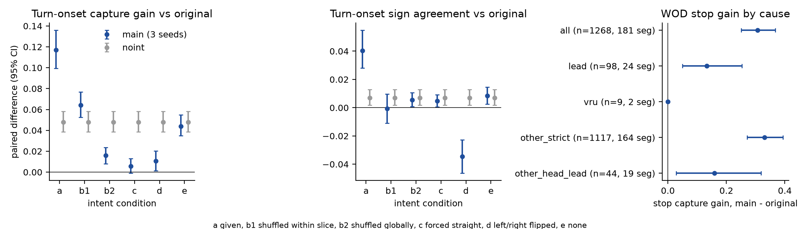

# op-adapt L 后续两项检查：intent 置换、WOD stop 按原因拆分（预登记）

状态: 预登记（写于任何读数之前；此前只读了 decisions 第 78 条、op-adapt L 的预登记与代码、盘点了 box 上有哪些检测缓存，没有跑任何新的前向或检测）。
主题: [decisions 第 78 条](../../../research/decisions.md) 末尾「会推翻或推进本条的证据」里的两项；母文档 [op-adapt L 预登记](2026-10-01-op-adapt-L-prereg.md)。
约束: 只用**现有** checkpoint（`$DATA_DIR/runs/op_adapt_L/runs/{main-s0,main-s1,main-s2,noint-s0}/ckpt-final.pt`），不训练；一张卡（GPU 0，调度表登记为 `op-adapt-L-fu`），核 8–74；预算约 2 h 墙钟、远低于 1 GPU 小时。原模型读数直接用母 lane 已存的 `readout/O/eval/wodval.npz`（同一批行、同一个前向协议）。r2 的 run 目录不动。

名词（首次使用处各给一句）：**capture rate**（捕获率）= 母预登记 §5 的定义：start = plan 4 s 位移 ≥ 人类位移的一半；stop = plan 最后 0.5 s 的段速 ≤ 1 m/s；turn onset = plan 4 s 横向偏移与人类同号且 ≥ 人类的一半。**sign agreement**（符号一致率）= turn onset 切片上 plan 4 s 横向偏移与人类未来 4 s 横向偏移同号的比例（不要求幅度）。**false turn** = 母 lane 的定义，`|y(4 s)| ≥ FALSE_TURN_M` 的帧占比，读在 control 与 straight_int 切片上（这些帧的人类都没有转）。**intent** = WOD 给每帧的路线意图（直行 / 左 / 右 / 未知），`main` 经 adapter 读它。所有区间按**整段（segment）聚类 bootstrap**，2 000 次，seed 0，同一次重抽用于被比较的两侧（与母 lane 的 `paired_delta` 同一函数）。

## 1. intent 置换

### 1.1 问题

`main` 对 `noint` 的配对差是 turn onset +6.8 pp（decisions 第 78 条）。这个差可以是 adapter 读到了**路线意图**（应当如此），也可以是 adapter 的 embedding 碰巧成了某种**场景线索**的开关（比如 intent 与场景相关：WOD 里左右转意图和路口外观高度相关，adapter 训练时见到的 intent 与场景是同步的，所以「读意图」和「读场景」在训练分布内不可分）。置换 intent 打破这个同步：如果增益真来自意图，换掉意图增益就该消失或反向；如果增益在意图被打乱后依然在，增益来自图像里的场景线索。

### 1.2 条件（WOD val 留出，全部 479 段的偶数帧，与母 lane 读数同一批行，Data.rows("wodval","val",need_future=True)）

模型：`main` seed 0、1、2（汇报 seed 平均，逐 seed 也存），`noint` seed 0（没有 adapter，intent 对它恒无效，作参照；置换后读数必须与 (a) 逐位相同，这是管线自检）。对每个模型在同一份 stage-4 隐状态上重算 policy，只改喂入的 intent 数组：

| 条件 | 喂入的 intent | 精确定义 |
|:--|:--|:--|
| (a) given | 原 intent | 与母 lane 读数相同（自检：必须复现 `main` 的 start / stop / turn onset 捕获率到 1e-6 内） |
| (b1) shuffled within slice | 同层内随机置换 | 每帧按优先级打一个**互斥层标签**：turn_onset > start > stop > stay > control > straight_int > other（任何帧只属于其中第一个成立的层）。`rng = default_rng(20261001)`，对每层内部的 intent 数组做一次 `rng.permutation`，层按上面的顺序处理；层内只有 1 帧时该帧不动。这个条件保持每层 intent 的边缘分布（turn onset 层的左 / 右 / 直行比例不变），只破坏「这一帧的 intent 与这一帧的场景」的配对 |
| (b2) shuffled globally | 全局随机置换 | `default_rng(20261002).permutation` 作用在全部 val 帧的 intent 数组上（turn onset 帧将大多拿到「直行」，因为整体 84% 直行）。不保持层内边缘分布 |
| (c) forced straight | 全部 = 直行（1） | 常数 |
| (d) flipped | 左 ↔ 右 | 2 ↔ 3，直行（1）与未知（0）不变 |
| (e) none | 全部 = 未知（0） | adapter 不加任何东西。描述性：`main` 在拿掉 intent 后还剩多少增益（stage-4 解冻本身带来的部分）；这不是登记的判定条件 |

### 1.3 读数

每个 (模型, 条件) 给：三个切片的 capture rate 与对原模型 O 的配对差；turn onset 的 sign agreement 与对 O 的配对差；turn onset 里按人类转向分左、右的 sign agreement；control 与 straight_int 上的 false turn 与对 O 的差；stay 上的 false start（附加）。`main` 三个 seed 的汇报值 = 每行先对三个 seed 的指示量取平均再做一次 bootstrap（与母 lane 的 seed 汇总同一习惯，CI 不含 seed 方差，seed 间散布另表列出）。

### 1.4 登记的读法（先写死，再看数）

记 G_c = `main`（三 seed 平均）在条件 c 下 turn onset capture 对 O 的配对差；G_noint = `noint-s0` 的同一量（条件 (a)）；G_a = `main` 的条件 (a)。G_a − G_noint 是「intent adapter 的专属增益」（decisions 第 78 条报 +6.8 pp）；G_noint 是不依赖 intent 的增益（stage-4 解冻与场景线索，预期 +4–5 pp）。

- **读路线意图**：(b1)、(b2)、(c)、(d) 四个条件里**每一个**都满足 G_c ≤ G_noint + 2 pp（专属增益被打掉，只剩不依赖 intent 的那部分）。而且 (d) 下 turn onset 的 sign agreement 比 (a) 下**低至少 5 pp**，CI 不含 0（被翻转的意图把 plan 推向反方向，说明意图被因果地使用）。
- **读场景线索**：某一个条件 c ∈ {(b1), (b2), (c), (d)} 满足 G_c ≥ G_a − 2 pp（增益在意图被破坏后保持）。只要有一个条件满足就记为「增益（部分）可由场景解释」，并逐条件写明。对 decisions 第 78 条来说，这条会**推翻**「intent 主要买起转」的说法，把 `main` 对 `noint` 的 6.8 pp 改读成「adapter 是另一个有用的场景适配容量」。
- **部分**：以上两者都不满足（G_c 落在 G_noint + 2 pp 与 G_a − 2 pp 之间）。按比例报「保留的专属增益」= (G_c − G_noint) / (G_a − G_noint)，逐条件写出，不强行归类。
- **false turn 的附带读法**（描述，不判定）：(b2)、(d) 下 control / straight_int 的 false turn 比 (a) 高出 > 2 pp 时，记为「adapter 的转向输出被 intent 直接驱动，没有经过场景核对」；这对部署意味着导航输入错了模型会照走。
- **管线自检不过（任何一项）就停**：`noint-s0` 在 (a)–(e) 之间不逐位相同；`main` (a) 不复现母 lane 的捕获率；(e) 下 `main` 与 O 在 intent 未知帧上的 plan 差 > 1e-3 m（母 lane 已验证零 intent 路径 = 原模型的恒等，(e) 只在 `main` 已训练后比较，所以此项只是期望「接近」，不是判据，不过时只记录）。

## 2. WOD stop 切片按原因拆分

### 2.1 问题

`main` 对原模型在 stop 的 capture +0.307（0.252 → 0.559）。stop 在 WOD 里有几类原因：前车在前面跟停（ego 只是在减速贴车）、行人 / 骑车人在前方、其他（红灯、停止线、让行、没有检测到的原因）。如果增益集中在前车跟停，它是「学会跟车」或标定 / 协议问题，不是学到停车时机；如果在没有检测到任何物体原因的那一类里也有增益，才是对停车时机本身的学习（仍不能说是红灯，因为「其他」是个混合类）。

### 2.2 有什么数据（盘点结果，2026-10-01）

- WOD-E2E 公开格式没有 3D box / lidar 标注（只有图像与 ego 状态）；WOD v2 的 lidar box 在 perception 数据集里，box 上没有这些 e2e 段（`waymo_ds` 只有 perception training 段，不含 e2e val 的段）。**没有标注可用**。
- 现成检测缓存：`processed/fusion_diag/sam/wod/`（SAM 3.1，20 237 张前视，含 479 rater 帧 + p2p3 subset）**只覆盖本切片 1 350 帧里的 266 帧（20%）**，覆盖不够，不用作主标注；`fastperc/dets/*` 只有 P5 与 nuScenes。
- 所以本检查**新跑一遍推断**（不是训练）：`fastperc detect`（`jevdrive/fastperc.py`，YOLO26x-seg，imgsz 1280，半精度，score ≥ 0.5，前视 FRONT 相机图，1 268 张）+ `fusion_q4.lift`（平地抬升，用 `processed/wod_zeroshot/op_calib.json` 的每段 FRONT 标定）。这是对 brief「用现有的」的偏离，记入文末「偏离」：现有缓存覆盖不足，且新检测只是对已缓存的 1 268 张图做一次 inference，不碰任何训练。
- 辅助标注器（独立于 YOLO，同样不需要训练）：原模型 O 自己的 lead 头（`readout/O/eval/wodval.npz` 里的 `lead`、`lead_prob`，`nq4_k.lead_decode`）：`P(lead) > 0.5` 且 lead 的纵向距离落在下面的走廊长度内。它是模型自己的输出，和被比较的 capture 相关，所以只作一致性核对与「严格 other」的第二道筛，不作主标注。

### 2.3 标注规则（先写死）

行集合：`Data.rows("wodval","val","stop",need_future=True)`（母 lane 的 stop 读数行）。设人类未来（0.5 s 格点、后轴自车系）`fut[0..7]`，`S = ‖fut[7]‖`（4 s 位移，m）。

- **走廊**（人类将要走过的路）：折线 (0,0) → fut[0] → … → fut[7] → fut[7] + 8 m·û，û = fut[7]/‖fut[7]‖（`S < 1 m` 时 û = +x）。走廊长度阈值 `Dc = max(15 m, S + 8 m)`（即「停车点之后 8 m 以内」的东西都算在前面，相当于约 2 s 以上车头时距的下限；S 最大约 2 v0）。
- 一个检测的位置 = 它的地面接触点经平地抬升后的自车系 (gx, gy)（必须 lift_ok，gx > 0，gx ≤ Dc）；`d` = 该点到走廊折线的最近距离。
- **vehicle in corridor**：class vehicle（car / motorcycle / bus / truck，`fastperc.COCO_MAP`）且 `d ≤ 1.75 m`。
- **VRU in corridor**：class pedestrian 或 cyclist 且 `d ≤ 3.0 m`（人站在路边、人行横道上也算）。
- **原因标签**（互斥，按优先级）：`lead` = 有 vehicle in corridor；否则 `vru` = 有 VRU in corridor；否则 `other`。另报两个标志都有的帧数（优先级落在 lead）。
- **严格 other** = `other` 且 O 的 lead 头也不报 lead（`P(lead) > 0.5` 且 lead_x ∈ (0, Dc]）。判定（2.5）里的「其他」类用**严格 other**；`other`（仅 YOLO）与 lead 头标注器的各自结果也列出，作敏感性。
- 已知偏差，先写下：前视 + 平地抬升在远处与遮挡下漏检、错位，漏掉的前车会落进 `other`，所以 `other` 里混着未检出的前车跟停（让「其他」类的增益偏高，是 `other` 增益的**上界**）；严格 other 用第二个标注器收一道，但不能完全消除。VRU 类事件数预计很少。

### 2.4 读数

每个原因类：事件数（帧数与段数）、O 与 `main`（三 seed 汇总）的 stop capture rate、配对差与 95% CI（按段聚类，同一次重抽）。另附各类的 `main` 逐 seed 差、类内人类 v0 与 S 的中位数（看这几类的运动学是否可比）。事件少于 **20 个段**的类只报数字，不下判断。

### 2.5 登记的读法

记 Δ_all = 整个 stop 切片的配对差（预期 +0.307）、Δ_lead、Δ_vru、Δ_so = 严格 other 的配对差。

- **学到了停车时机（不止是跟车）**：严格 other 段数 ≥ 20、Δ_so 的 CI 下界 > 0，且 Δ_so ≥ 0.5 · Δ_all（≥ 0.15）。注意这仍不说明是哪种原因（红灯、停止线、未检出的前车），只说「没有检测到前车 / 行人的 stop 上也涨了」。
- **基本是前车跟停**：严格 other 段数 ≥ 20 且 Δ_so 的 CI 包含 0 或 Δ_so < 0.10，同时 Δ_lead ≥ 0.25 且下界 > 0。对 decisions 第 78 条，这条把 stop 的 +0.307 改读成「标定 / 协议问题或跟车」，不再算学到的停车时机。
- **混合**：介于两者之间，按类原样报。
- 严格 other 段数 < 20 时本项判定为「不可判」，这是一个可能的结果（WOD val 里大多数 stop 有前车）。

## 3. 产物

- 脚本 `experiments/op_adapt_l/scripts/op_adapt_l_followup.py`（子命令 `perm`、`stopcause-list`、`stopcause`，同一脚本里的 `figure`）；小表 `experiments/op_adapt_l/results/followup/*.csv`；图 `experiments/op_adapt_l/figs/op-adapt-L-followup.png`（若有）。
- 跑在 box 的 tmux 窗口 `jev:opL-fu` 里（`scripts/tmux_run.sh`），GPU 0，核 8–74，`tqdm`，run 目录 `$DATA_DIR/runs/op_adapt_L/followup/`（`log.txt`、`events.jsonl`）。

## 偏离

1. stop 标注用了新跑的 YOLO26x-seg 检测（1 268 张图，40 s，GPU 0），不是现成缓存：原因与范围已在 §2.2 预登记，记在这里是因为它偏离了 brief 的「用现有的」。用的是哪一份数据：WOD-E2E 前视图（`front3` 分片）+ `op_calib.json` 的 FRONT 标定 + `fastperc detect`（输出在 `$DATA_DIR/runs/op_adapt_L/followup/dets/`，不进 git）。
2. 算出标签之后做了一次**管线合理性检查**（没有改任何规则，也没有改判定）：YOLO 框 score ≥ 0.5 共 10 491 个，平地抬升成功 59%；抬升后的车辆 gx 最小 6.7 m（更近的车接触点在图像下缘之外，被压在 ≈7 m），gx < 20 m 的车辆里 20% 落在 1.75 m 走廊内。O 的 lead 头与 YOLO 车辆标注在 94% 的帧上一致（两者都只在约 8–9% 的帧上报前车）。这说明「lead」类小是两个独立标注器共同的读数，不是抬升坏了；但两者都是前视单帧，不能排除都漏检。
3. 管线自检 (e)：val 里没有 intent 未知（0）的帧（intent 计数 [0, 42155, 3602, 3593]），所以「未知帧上 (a) 与 (e) 逐位相同」的检查是空的，未触发；`noint-s0` 各条件逐位相同、三个 `main` seed 的 (a) 与母 lane 存的 plan 逐位相同（最大绝对差 0.0）。
4. 互斥层标签里 stop 层是 1 249 帧（turn_onset 优先于 stop 的重叠帧归到 turn_onset），stop 切片读数仍是 1 268 帧（与母 lane 一致）。
5. 以上两项都没有看过数字之后改规则；判定线、走廊、阈值与 §1.4、§2.5 逐字一致。perm 没有接 tqdm（整个 perm 十几分钟、每个模型一次 stage-4 + 六次 policy），日志是 tmux 窗口输出。

## 结果

运行：`experiments/op_adapt_l/scripts/op_adapt_l_followup.py`（`perm`、`stoprows` → YOLO → `stoplabel` → `stopread`、`figure`），`experiments/op_adapt_l/scripts/op_adapt_l_followup_stop.sh` 是 stop 这条链；小表在 [experiments/op_adapt_l/results/followup/](../results/followup/)（`perm_vs_orig.csv`、`perm_contrasts.csv`、`perm_selfcheck.json`、`stop_causes.csv`、`stop_by_cause.csv`）。总墙钟约 25 min，GPU 远低于 1 小时。

图：左与中看蓝点（`main` 三 seed）：条件 a 之外的四个 intent 破坏条件（b1、b2、c、d）把 turn onset 增益压到灰点（`noint`）之下或与灰点同高，d（左右翻转）还让符号一致率降到原模型之下；右图看 other_strict 的增益与 all 一样大，lead 的更小。

### 1. intent 置换（WOD val，turn onset 3 825 帧，179 段；Δ = 对原模型 O 的配对差，95% CI 按段聚类）

| 条件 | turn onset capture Δ（`main` 3 seed） | `main` 绝对值 | sign agreement Δ | sign agreement 绝对值 |
|:--|:--|:--|:--|:--|
| a given | +0.117 [0.099, 0.136] | 0.843 | +0.040 [0.028, 0.055] | 0.971 |
| b1 层内置换 | +0.064 [0.053, 0.077] | 0.790 | −0.001 [−0.011, 0.010] | 0.930 |
| b2 全局置换 | +0.016 [0.008, 0.024] | 0.742 | +0.006 [0.001, 0.011] | 0.936 |
| c 强制直行 | +0.006 [−0.001, 0.013] | 0.732 | +0.005 [0.001, 0.009] | 0.935 |
| d 左右翻转 | +0.011 [0.001, 0.020] | 0.737 | **−0.035** [−0.046, −0.023] | 0.896 |
| e 无 intent | +0.044 [0.035, 0.055] | 0.770 | +0.008 [0.003, 0.015] | 0.939 |
| `noint-s0`（任何条件） | +0.048 [0.039, 0.058] | 0.774 | +0.007 [0.002, 0.013] | 0.937 |

原模型 turn onset capture 0.726、sign agreement 0.930。seed 间散布小：条件 a 三个 seed 的 Δ 为 0.119 / 0.115 / 0.117，d 为 0.008 / 0.013 / 0.011。条件 a 对 d 的 sign agreement 差 −7.5 pp [−9.3, −5.9]（左转帧 −10.1 pp，右转帧 −6.0 pp；逐方向的绝对值：左转 0.949 → 0.848，右转 0.984 → 0.924）。各条件相对 `noint` 的 G_c − G_noint：a +0.069 [0.057, 0.083]、b1 +0.016 [0.008, 0.024]、b2 −0.032、c −0.042、d −0.037（CI 都不含 0）、e −0.004 [−0.008, 0.000]。

其他读数（`main`，对 O 的 Δ，条件 a → b2 / c / d）：control false turn 上界 ≤ 0.1 pp，所有条件不变；straight_int false turn a +0.0 pp，b2 +0.2 pp [0.1, 0.25]，c、d 无变化，e +0.4 pp；start capture Δ：a +0.101，b1 +0.099，b2 +0.090，c +0.079，d +0.096，e +0.100；stop capture Δ：a、c、d +0.307（stop 帧的 intent 几乎全是直行，c、d 不改变它们），b2 +0.295，e **+0.248**；stay false start：a +2.7 pp，b1 +3.3，b2 +2.6，c +2.2，d +2.8，e +3.1。

**按登记读法**：四个破坏条件 b1、b2、c、d 的 G_c 分别 +0.064、+0.016、+0.006、+0.011，全部 ≤ G_noint + 2 pp（= +0.068），且 (d) 的 sign agreement 比 (a) 低 7.5 pp（≥ 5 pp，CI 不含 0）。所以是「**读路线意图**」：`main` 对 `noint` 的 turn onset 专属增益（+6.9 pp）在 intent 被打乱 / 置常数 / 翻转后全部消失，b2、c、d 下甚至低于 `noint`（错误的 intent 会把 plan 推偏）；`main` 在 e（无 intent）下 = `noint`（+0.044 对 +0.048）。decisions 第 78 条「intent 主要买起转」的机制这一条由置换检验支持，不是场景线索。几点读数：b1 比 `noint` 还高 1.6 pp（CI [0.8, 2.4]），层内置换只破坏配对，不保证错，因为 turn onset 层内 intent 左右比 1 371 : 2 331，置换后仍有约一半帧碰巧拿到对的方向；这是 b1 的残余增益来自恰好配对正确的帧，不支持场景读法（b2、c、d 才是干净的破坏）。start 增益基本不依赖 intent（b2、c 只降 1–2 pp，e 不变），stop 在 e 下少 5.9 pp（无 intent 这个输入值在 stop 帧上与训练时见到的 intent 不同），说明三个切片的增益里只有 turn onset 明显靠 intent。false turn 的附带读法：b2 下 straight_int 只涨 +0.2 pp，没有超过 2 pp；d 下无变化（翻转只改左右，而 control / straight_int 的 intent 几乎都是直行）。所以「导航输入错了模型会照走」在 turn onset 帧上成立（符号一致率降 7.5 pp，capture 降 10 pp），在直行帧上的误转几乎不涨。

### 2. WOD stop 按原因拆分（1 268 帧，181 段；`main` 三 seed 对 O，stop capture）

| 原因 | 帧 / 段 | O | `main` | Δ | 95% CI |
|:--|:--|:--|:--|:--|:--|
| 全部 | 1 268 / 181 | 0.252 | 0.559 | +0.307 | [0.250, 0.367] |
| lead（YOLO 车辆在走廊内） | 98 / 24 | 0.224 | 0.357 | +0.133 | [0.050, 0.253] |
| vru（行人 / 骑车人在走廊内） | 9 / 2 | 0.000 | 0.000 | 0 | 不可判（< 20 段） |
| other（仅 YOLO 看不到） | 1 161 / 173 | 0.257 | 0.581 | +0.324 | [0.265, 0.388] |
| **严格 other**（YOLO 与 O 的 lead 头都看不到） | 1 117 / 164 | 0.257 | 0.587 | **+0.330** | [0.271, 0.394] |
| other 但 O 的 lead 头报前车 | 44 / 19 | 0.250 | 0.409 | +0.159 | [0.029, 0.318] |
| 换标注器：O 的 lead 头报前车 | 110 / 27 | 0.173 | 0.309 | +0.136 | [0.036, 0.263] |

另有 7 帧同时有车和 VRU，归入 lead。各类 v0 / S 的中位数相近（4.5–4.7 m/s，6.6–7.9 m），`main` 三个 seed 的 Δ 在各类内几乎一样（例如严格 other 0.331 / 0.331 / 0.329）。

**按登记读法**：严格 other 有 164 段（≥ 20）、Δ_so = +0.330 且 CI 下界 0.271 > 0、≥ 0.5·Δ_all（0.153）；同时 lead 上的增益更小（+0.133）。满足「**学到了停车时机（不止是跟车）**」：stop 的 +0.307 不集中在前车跟停上，增益主要出现在 YOLO 与 lead 头都看不到前车 / 行人的 stop 帧。限定：(i) 这只说明没有检测到前车 / 行人，不说明是红灯或停止线，「other」仍是混合类；(ii) 前视单帧检测会漏掉远处或被遮挡的前车，漏检会落进 other，使 other 的增益偏高（严格 other 用 lead 头再筛一遍后 Δ 没有变小，+0.324 → +0.330，说明这个漏检不是主因，但不能排除两个标注器同时漏）；(iii) VRU 只有 9 帧，不可判；(iv) 被标成 lead 的帧只占 98 / 1 268（7.7%），而 O 在这类上的 capture（0.224）与在 other 上（0.257）相近，所以 stop 里 O 漏停的主体不是前车跟停。

### 对 decisions 第 78 条的意义（供你写进去）

两条「会推翻或推进」的证据都没有推翻：intent 置换后 turn onset 的专属增益消失、翻转让方向变错，所以 adapter 读的是路线意图；stop 的增益在没有检测到前车 / 行人的帧上最大，不是前车跟停。其余「待定」限定（闭环未测、stay 假起步 +2.7 pp、单模型、WOD 读数内）不受这两项影响。

**已验证与推断**：验证的：`perm` 的 (a) 对母 lane 存的 plan 逐位相同；`noint` 各条件逐位相同；所有表由 CSV 生成；stop 的标签与读数两条路（YOLO、lead 头）给出同向结果。推断的：「其他」类的真实原因（红灯 / 停止线 / 让行）没有标注可验证；lead 类是检测器 + 平地抬升的近似；seed 之间不独立于同一 checkpoint 起点，CI 没有含 seed 方差（seed 散布单列）。
