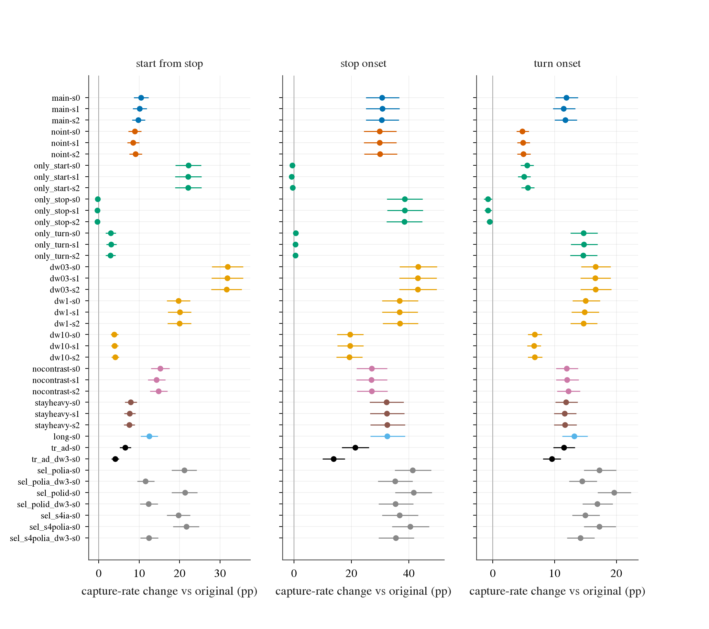
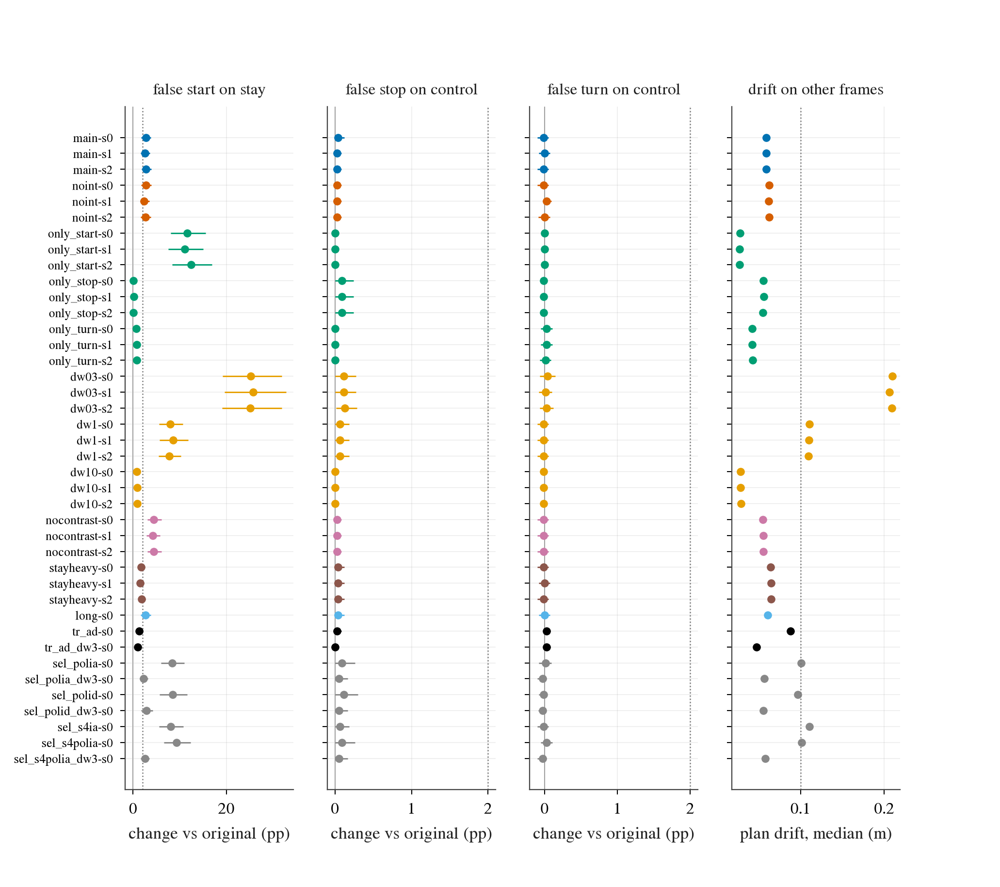
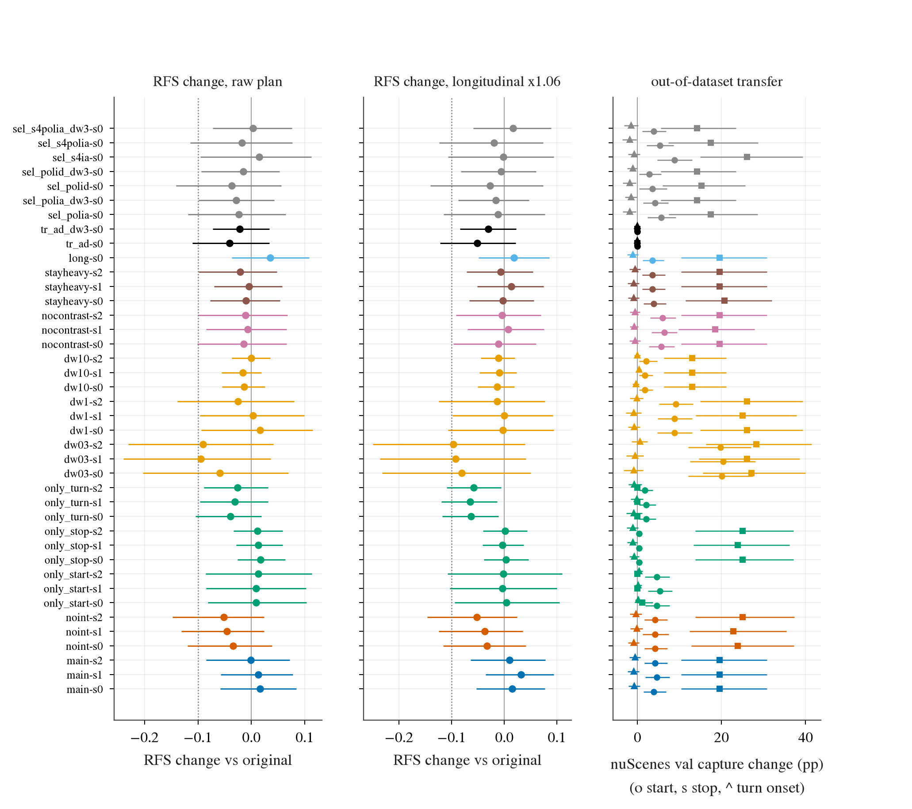

# op-adapt L：用真实 log 的人类未来做模仿的轻度适配（预登记）

状态: 已完成（2026-10-01 02:30）；预登记（写于任何训练结果之前；此前只做了数据准备：WOD val 全量 trunk 缓存、原模型在它上面的输出、切片表，以及一次只查数值恒等的 selftest，没有任何训练步、没有任何适配模型的读数）。2026-10-01 夜间跑，三张卡。之后的偏离全部记在文末「偏离」一节。
主题: [research/decisions.md](../../../research/decisions.md) 第 77 条（log expert audit）、第 55 / 57 / 66 条（stage 4 解冻的代价、turn desire 在路口前不改 plan、desire 时机）、第 34 / 36 条（WOD 协议与纵向 ×1.06 校准）；[log expert audit](https://github.com/VennIntelligence/jev-drive/blob/fc65452/todos/2026-10-01-log-expert-audit.md)；[op-adapt r2](https://github.com/VennIntelligence/jev-drive/blob/fc65452/todos/2026-09-29-op-adapt-r2-prereg.md) 与它的 [交接](https://github.com/VennIntelligence/jev-drive/blob/fc65452/tmp/2026-09-30-op-adapt-r2-state3.md)（基础设施只读复用）。
协调: r2 的 run 目录与 chain 文件一律不动（只读它的 `t/samples`、`t/teacher/{wod,nus}`、`teacher/tstd.npy`、rater 缓存）；新产物全在 `$DATA_DIR/runs/op_adapt_L/`。三张卡 0、1、2（box 现在只有这三张，cgroup 75 核、296 GiB 内存），核 8–74，调度表登记为 `op-adapt-L`。

## 用户决定（2026-10-01，原样记录）

1. 用 WOD train 训练是接受的；本 lane 的结果一律描述为「在 WOD train 上轻度适配（lightly adapted on WOD train）」，**不是 zero-shot**。
2. op-adapt r2 的 full 搁置，让位给本 lane；r2 的 run dir 与 chain 文件不删不改，缓存只读复用。

## 1. 要回答的问题

第 77 条量到：真实 log 里「从停止起步（start）」「巡航到停（stop）」「起转前（turn onset）」各有上千个独立事件（WOD train 每类 700–1 100 个事件，起步与起转在 NAVSIM navtrain 里近 3 000 个），而原生 Cinque 的 plan 只复现人类机动的 58–73%（start）、29%（stop，WOD）、61–74%（turn onset，且没有导航输入）。
问题：把人类 log 未来当作这三类切片上的专家轨迹、把 WOD 的路线意图（routing intent，WOD-E2E 给每帧的「直行 / 左转 / 右转」指令）当作导航条件、其余帧蒸馏（distillation，让改后模型的输出贴住原模型）回原模型，做一次**轻度**适配，能不能在留出数据上提高这三类的捕获率（capture rate，见 §5），**同时不变得更保守也不变得更急**。
天然的对照对都在 log 里：起步对「停着且继续停着」（stay）、停车对稳态直行（control）、起转对「路线意图是直行的直行」。**对照帧上的误触发率与捕获增益同等重要**：一个把 plan 整体拉慢或拉快的模型会在捕获上「涨」，在对照上「坏」。

## 2. 数据与切片

### 2.1 划分（全部按整段 / 整场景切，seed 写在脚本里）

| 集合 | 用途 | 内容 |
|:--|:--|:--|
| WOD train 中的 train | 训练 | 2 037 段里去掉 dev 后的 1 833 段（偶数帧，5 Hz，前视，9 个 5 Hz context = 1.6 s，r2 的缓存） |
| WOD train 中的 dev | 选择与 checklist，不进训练 | 204 段（按段，`default_rng(20261001)` 的排列取前 10%）；r2 自己的 val 部分（60 条 stream）不用 |
| WOD val（479 段） | **留出读数**，与训练、dev、选择完全无关 | 全部 479 段的偶数帧（5 Hz）的 trunk 缓存是本 lane 新建的（`experiments/op_adapt_r1/lib/op_adapt_cache.py wodval`，同一个渲染与 trunk 路径，1.7 min），每帧 9 个 context |
| nuScenes | 蒸馏（train scene）；dev（r2 的 50 个 dev scene）做漂移；**val 是域外检查**（不训练，不给 intent） | r2 的 `nus` 域，5 Hz 格点 |
| NAVSIM navtrain | **不用** | r2 的 `t/teacher/nav` 是 2 Hz sample-and-hold 喂法，在有速度的帧上系统偏长约 20 m（第 77 条第 6 点、audit 偏离 2），不能蒸馏；不修（修 = 重跑 GIMM 补帧的 trunk，超出今晚），所以**排除**。navtest 只作 no-harm 读数（走 r2 已有的 GIMM 补帧 harness） |
| WOD test | **不碰**；不向任何榜单提交 | |

### 2.2 切片（沿用 audit 的 BASE 阈值，一个数都不改；只用人类 4 s 未来，后轴自车系，0.5 s 网格）

- **start**：`vmax1 ≤ 0.5`（t0、−0.5 s、−1 s 三个速度的最大）且 4 s 位移 `|p₈| ≥ 3.0 m` 且最大段速 ≥ 1.5 m/s。**stay**：`vmax1 ≤ 0.5` 且 `|p₈| ≤ 0.5`。
- **stop**：`v0 ≥ 3.0` 且最后两段速度都 ≤ 0.5 m/s（3.5 s 内停住并保持到 4 s）。**control**：`v0 ≥ 5`、各段速度与 v0 相差 ≤ 1.5、航向变化 ≤ 5°、横向偏移 ≤ 0.75 m、过去不在转、intent 直行或未知。
- **turn onset**：过去不在转（`dpsi_past < 10°`），未来最大航向 ≥ 30°，第一个 |ψ| ≥ 10° 的时刻在 [0.5, 3.0] s。
- **straight_int**（本 lane 新加，用作起转的对照）：WOD intent = 直行，最大航向 < 10°，`v0 ≥ 2`，且不是 stop。它包含 control 的大部分。
- 其余帧记为 other。in_turn、nudge、lane_change 只作描述行，不训练不判。

WOD train 里的量（全 9 个 context 的帧 / 涉及的段）：train：start 8 400 / 889，stop 3 867 / 579，turn onset 14 448 / 705，stay 13 403 / 526，control 33 095 / 1 304；dev：start 927 / 100，stop 418 / 63，turn onset 1 566 / 76；val：start 2 048 / 241，stop 1 268 / 181，turn onset 3 825 / 179，stay 4 116 / 144，control 7 826 / 315；nuScenes val：start 284 / 34 个 scene，stop 92 / 18，turn onset 540 / 40。**独立事件与聚类**：帧内相邻高度相关，所以所有区间都按**整段（WOD）/ 整场景（nuScenes）聚类 bootstrap**，样本单位是「段」。

## 3. 训练设计

一个 batch = 64 条序列（每条 = 一个 5 Hz 帧 + 它的 9 帧 context），组成：

| 部分 | 条数 | 来源 | 损失 |
|:--|--:|:--|:--|
| 模仿 | 30（三类各 10；只训单类的 arm 全给那一类） | WOD train 的 start / stop / turn onset 帧 | L_imit；除 plan 以外的输出仍蒸馏 |
| 对照 | 18（stay、control、straight_int 各 6；「无对照」arm 里换成 other 帧） | WOD train | 蒸馏（权重 ×2）+ L_cons |
| 其他 WOD | 8 | WOD train 里不属于以上任何切片的帧 | 蒸馏 + L_cons |
| nuScenes | 8 | nuScenes train 帧 | 蒸馏 + L_cons |

三个损失，全部在后轴自车系、0.25 … 4.0 s 的 16 个点上（plan 的 33 点在这些时刻线性插值，相机到后轴的偏移 WOD 1.519 m、nuScenes 1.70 m 按 audit 的同一公式换算）：

- **L_imit**（模仿人类未来）：`mean_k Σ_{c∈{x,y,v}} Huber₁((ĉ_k − c_k)/σ_c(t_k))`，`σ_x = 0.3 + 0.2t`、`σ_y = 0.1 + 0.1t`（m）、`σ_v = 1 m/s`；人类的 v 是 0.25 s 网格上位置的 0.5 s 中心差分。x、y 的尺度让 1 m 纵向和 0.3 m 横向都落在 Huber 的线性区之前。
- **L_cons**（plan 贴回原模型的 plan）：同一个距离，目标换成原模型（teacher）的 plan，作用在所有非模仿帧上。
- **L_distill**（r2 的蒸馏）：改后模型的全部输出（去掉 hidden 与 MDN 标准差）对原模型输出、按 r2 的 `tstd` 归一的 MSE；模仿帧上把 plan 那一块关掉（因为它在被模仿），其余输出照蒸馏。

总损失 `L = λ_i L_imit + dw · (λ_c L_cons + λ_d L_distill)`，`λ_i = 1`、`λ_c = 1`、`λ_d = 10`（r2 dev 选出的）、`dw = 1`（蒸馏权重 ablation 用 0.3 / 3）。

优化：AdamW（weight decay 0.01），fp16 计算 + GradScaler + fp32 master 权重，梯度裁剪 1.0；可训练权重 lr 3e-5（stage 4 与 policy 权重），adapter 3e-4；warm-up 100 步，之后 cosine 到 0；**4 000 步**（25.6 万条序列；模仿帧约 12 万次抽取，对三类共 2.67 万个 train 帧是 4–5 遍）；dev eval 在第 0、2 000、4 000 步；不做早停、不选 checkpoint（末步即读数）。

### 3.1 可训练的部分与 intent 怎么进模型

policy 是冻结的，而且已知它的 desire 输入在路口前不改 plan（第 57、66 条），所以 intent 的进入方式是开放的设计选择。四个候选（selection wave，§4）：

| 名称 | 可训练 | intent 怎么进 |
|:--|:--|:--|
| `sel_s4ia` | stage 4（1.1 亿参数，r2 用的那一组） + adapter | **`ia`**：每个 intent（直行 / 左 / 右）一个可学的 32×512 embedding，加到 9 个 context 帧的 hidden token 上，intent 未知时什么都不加（零初始化，所以第 0 步与原模型逐位相同） |
| `sel_polia` | off-policy plan 通路（temporal summarizer 的 4 个 transformer block + plan 的 hydra 头，1 630 万参数；stage 4 冻结）+ adapter | 同上 |
| `sel_s4polia` | 以上全部 | 同上 |
| `sel_polid` | off-policy plan 通路（stage 4 冻结） | **`id`**：原生 desire 输入承载 intent：左转 = turnLeft、右转 = turnRight，在 t0 前 1.0 s 打一个脉冲（第 66 条的时机），直行 / 未知 = 无 desire；没有新模块，靠改 policy 权重去响应 |

另一个不在候选里、只作 trainable-set 消融的：`tr_ad`（只训 adapter，stage 4 与 policy 全冻）。

### 3.2 与 r2 的区别（写在前面，读结果时要带着）

r2 用行人配对与规则打分的监督，训出 dev 漂移 0.40 m、null 减速率 +11.7 pp（整体更保守）。本 lane 的监督是人类未来，目标域是真实 WOD，且蒸馏 / L_cons 直接作用在 WOD 的对照帧与 other 帧上（r2 的蒸馏主要在 nuScenes / navtrain / sim 的 x⁻ 上，WOD 上的 plan 没被钉住，漂移主要出在 WOD 上 0.71 m）。

## 4. Arms、selection wave 与队列

**selection wave（登记的小集合，seed 0，4 000 步，全部读 dev）**：`sel_s4ia`、`sel_polia`、`sel_s4polia`、`sel_polid`，每个再各跑蒸馏权重 dw = 1 与 dw = 3（后者名字带 `_dw3`；D1，见「偏离」，共 8 个候选，写在任何 selection run 之前）。

**选择规则（写死，只看这 4 个 run 的末步 dev）**：一个配置「合格」= dev 上 (i) other 帧（WOD dev ∪ nuScenes dev）对原模型的 plan 漂移中位数 ≤ 0.10 m、p95 ≤ 0.50 m；(ii) 每个误触发率对原模型的差 ≤ +2 pp（stay 上的「假起步」、control 上的「假停」与「假转」、straight_int 上的「假转」）；(iii) other 帧的 slow 率与 fast 率对原模型的差 ≤ +2 pp。合格者里取三个切片捕获增益（配对差，dev）的均值最高者为 `main`；没有一个合格，就取「各条线的 值 / 线 之比的最大值」最小的那个；并列取捕获增益高者。选出的名字写进 `selection.json`，之后的 ablation 都以它为底。

**队列（选择之后，优先级顺序）**：

1. `main` seed 1、2（连同选择 run 里的 seed 0 = 三个 seed）；
2. `noint`（main 去掉 intent）seed 0；
3. 单类：`only_start`、`only_stop`、`only_turn`（各只模仿一类，对照帧与蒸馏不变）；
4. 蒸馏权重（绝对值 0.3 / 1 / 3 / 10，与 main 自己的 dw 相同的那一个不重跑）：`dw03`、`dw1`、`dw3`、`dw10`；`nocontrast`（不放 stay / control / straight_int 对照帧，它们的名额换成 other 帧）；
5. `tr_ad`（只训 adapter）；
6. `noint` seed 1、2；单类与蒸馏权重 ablation 的 seed 1（有余量才跑）；
7. 若时间还有：`main` 8 000 步（看轻度适配是否随步数继续变化）。

trainable-set 的归因：`sel_s4ia`、`sel_polia`、`sel_s4polia`、`tr_ad` 四个同长度 run 就是「stage 4 only（+ adapter）/ adapter only / + late policy」的比较；intent 的归因：`main` 对 `noint`；每类切片的归因：`main` 对 `only_*`；蒸馏与对照帧：`dw*`、`nocontrast`。

## 5. 读数（全部在留出集合上，改后模型与原模型同一批行、同一次 bootstrap）

行集合：WOD val（全部有 9 帧 context 与人类未来的偶数帧，5 Hz）、nuScenes val（5 Hz 格点，无 intent）、479 个 WOD val rater 帧。原模型在**同一批行上重新前向**（同样的 5 Hz 前视 1.6 s context 协议），不用 audit 里官方协议（3 相机、10 s 历史）的 preds；audit 的原模型捕获率只作参照，两者的差在结果里如实列出。

**捕获率**（audit 的定义原样）：start = plan 4 s 位移 ≥ 人类位移的一半；stop = plan 在最后 0.5 s 的段速 ≤ 1 m/s；turn onset = plan 4 s 横向偏移与人类同号且 ≥ 一半。报每个切片的捕获率、对原模型的配对差、和 lon / lat ADE（对人类未来）。
**误触发**：stay 上 plan 4 s 位移 ≥ 3 m（假起步）；control 上 plan 在 4 s 停住（假停）、plan 4 s 横向偏移 ≥ 2 m（假转）；straight_int 上假转。
**漂移与保守 / 急**：other 帧（不在三个模仿切片里的全部帧）上对原模型 plan 的位置漂移（0–5 s 平均 L2 距离）的中位与 p95；plan 2 s 速度低于当前速度 − max(1 m/s, 20%) 的比例（slow）与高于当前速度 + max(1 m/s, 20%) 的比例（fast），各对原模型的差。
**RFS**：479 个 val rater 帧，官方 `rater_feedback_score`，按场景类别取均值再平均（榜单口径），原始 plan 与纵向 ×1.06 校准（waypoint 的 x 乘 1.06，7.92 提交用的约定）各一份，总体与逐类别，对原模型的配对差；CI 对 rater 帧（RFS）/ 帧（类别）bootstrap。
**navtest PDMS**：NAVSIM navtest 12 146 个场景，r2 的 decision-36 harness（GIMM 补帧输入），改后模型的 native plan 与 port 原模型同一次跑；只对 main 的三个 seed 与 `noint` seed 0 跑（每个约 10 min 的 CPU 打分，放在空闲核上）。
**CI**：WOD 按段、nuScenes 按 scene 聚类 bootstrap，2 000 次，seed 0，取 2.5 / 97.5 分位；同一次重抽同时用于改后模型与原模型（配对）。

## 6. 登记线：什么叫「有效」，以及每种结果怎么读

**主 arm = `main`，三个 seed；一条线「过」= 三个 seed 各自都过。** 所有线都用 WOD val（除非另写）、原始 plan（×1.0）；×1.06 校准版并列报告，不作判据。

| 编号 | 读数 | 线 |
|:--|:--|:--|
| L1 捕获增益 | start / stop / turn onset 各自的捕获率配对差 | **每个切片**：CI 下界 > 0 |
| L2 误触发 | stay 假起步、control 假停、control 假转、straight_int 假转，各对原模型的差 | 每一项 CI **上界** ≤ +2 pp |
| L3 漂移与保守 / 急 | other 帧漂移；slow、fast 对原模型的差 | 中位 ≤ 0.10 m 且 p95 ≤ 0.50 m（r2 的 N-drift 线）；slow、fast 的差各 ≤ +2 pp（点估计）；同一批线在 nuScenes val 上再读一遍 |
| L4 RFS 不低于原模型 | 479 帧 RFS 的配对差，原始与 ×1.06 各一份 | 「无害」：CI 下界 ≥ −0.10（r2 的 N-rfs 线）；「不低于」：点估计 ≥ 0；两条分开报，都要在两个约定下成立才算过 |
| L5 ADE 无害 | WOD val 全部帧对人类未来的 ADE（4 s）相对变化 | CI 上界 ≤ +2% |
| L6 域外迁移（nuScenes val，不训练、无 intent） | 同样三个切片的捕获率配对差 | CI 下界 > 0 算「迁移」，逐切片报；同时 L2 / L3 在 nuScenes 上不违反 |
| L7 navtest | PDMS 对同次 port 原模型 | ≥ O − 1（r2 的 N-nav 线） |

**结果怎么读（登记）**：

| 结果 | 条件 | 读法 |
|:--|:--|:--|
| **有效** | L1 三个切片 + L2 + L3 + L4「无害」+ L5 都过 | 「在 WOD train 上轻度适配」的模型在留出段上捕获了更多起步 / 停车 / 起转，且没有变保守或变急；L6、L7 决定它能否说「不限于 WOD」 |
| **部分有效** | L1 只过其中几个切片，其余线（L2–L5）全过 | 只报过的切片；没过的切片按 ablation 看是数据（切片只有几百帧）、条件（intent 没进去）还是模仿本身 |
| **靠代价换的捕获** | L1 过，但 L2 或 L3 不过 | 捕获增益是整体拉慢 / 拉快 / 误触发买来的，不算有效；读 `dw*`、`nocontrast` 看蒸馏权重能不能救 |
| **无捕获增益** | L1 不过 | 模仿这三类的路径在这个可训练集合与步数下不成立；读 selection wave 与 `tr_ad` 看是不是可训练部分太少 |
| **RFS 变差** | L4「无害」不过 | 即使捕获过了也不能作为改进 |

主 arm 在实质上失败（如所有登记设置下漂移或误触发都超线）时，登记的 ablation 队列**仍然跑完**，让今晚出归因；结果如实写成失败。**不放宽任何登记线去让 checklist 过**：实现 bug 要修，线不动。

对 ablation 的比较（描述，同一批行的配对 bootstrap）：`main` 对 `noint` → intent 的贡献；`main` 对 `only_x` → 三类互相帮忙还是互相抢；`main` 对 `dw*` / `nocontrast` → 蒸馏权重与对照帧的作用；trainable-set 四个 run 互比；三个 seed 的散布。

## 7. 分级启动与 sanity checklist（写死）

**1 个单位（登记）**：`sel_s4ia`，seed 0，**800 步**，dev eval 在第 0、400、800 步，看：
1. loss 全部有限，L_imit 与总损失后 20% 步的均值低于前 20%；
2. 第 0 步 dev：漂移 ≈ 0（中位 ≤ 1e-3 m）、各捕获与误触发的差 = 0（adapter 零初始化的恒等性）；
3. 吞吐与显存：记实测，与 r2 的 288 序列 / s、31.8 GB（batch 64）相比在 ±30% 以内，且单个 run 显存 ≤ 40 GB（每卡放两个）；
4. dev 上三个切片的捕获增益均值 > 0，且至少两个切片的方向为正；
5. dev 漂移中位 ≤ 0.15 m、每个误触发差 ≤ +5 pp（短训练，线比终线宽，只用来拦崩坏）；
6. dev eval 一次不超过 5 min。

**约 10 个单位 = selection wave**（8 个候选全长）：每个 run 的 dev 上看：完成率 100%、无 NaN / OOM；末步 dev 漂移中位 ≤ 0.15 m；plan 2 s 速度分布对原模型的 KS 统计量 < 0.1（非退化）；至少一个候选合格（§4 的规则）。全都不合格不停批（登记的 ablation 队列照跑），但要在状态里如实标出。

**全量**：队列由一个自推进的链脚本跑，每个 run 结束后自动读数（`eval`、`read`，main 与 noint 另加 `navtest`）。任一 checklist 不过：诊断、修真 bug，不动线。

## 8. 成本（实测后填，估计写在这里）

r2 实测：stage 4 训练、batch 64 单卡约 288 标注序列 / s，峰值约 32 GB；冻结 stage 4 的 run 便宜得多（只前向 stage 4）。估计每个 stage 4 run（4 000 步）训练约 15 min + 3 次 dev eval（各约 2–3 min），读数（WOD val 4.9 万行、nuScenes val、rater）约 5 min。三张卡满载约 8 h 可排 20–30 个 run。实测吞吐、显存与每 run 时长会写进执行日志。

## 9. 不做的事与限制

- 不碰 WOD test，不提交任何榜单；不改 r2 的任何文件；不用 navtrain；不改任何登记线。
- 人类未来是单条轨迹，「捕获一半」的阈值是任意的（只用来跨切片比较）；多模态下原生 plan 与它不同不等于错。
- WOD val 上没有独立于 WOD 的检查（同一数据集、同一相机 rig、同一 intent 定义）；nuScenes val（无 intent、另一个相机与国家）是唯一的域外读数，样本小（每切片 18–40 个 scene）。
- intent 是数据集给的指令，不是模型自己推的；deployment 需要导航输入。turn onset 的「原生只有 61–74%」里有多少是缺 intent，由 `main` 对 `noint` 回答。
- 原模型的 stop 在 WOD val 官方协议下只有 7%（n = 41，audit），5 Hz 前视协议下另算，两者的差异会在结果里列出。

## 执行日志

（按时间追加：每次看 dev / 读数都记一行，写明看了什么。）

- 2026-09-30 22:39–23:0x（准备，无训练）：box 现状 = 3 张 RTX 6000D（0、1、2，空闲）、cgroup 75 核、296 GiB 内存；tmux 里没有 r2 进程（r2 chain 已在 stage 1 checklist 后 ERROR 退出），调度表 `op-adapt-r2` 行按用户决定 finish、登记 `op-adapt-L`（GPU 0,1,2，核 8–74）。WOD val 全量 trunk 缓存（482 个 stream、53 204 个 slot、13 GB）1.7 min 建好，原模型在它上面的输出（teacher，5 min）建好，切片表建好（含 dev 划分）。selftest：原模型的 LModel 前向与 r2 teacher 的 plan 逐位相同（max abs 0.0）；`sel_s4ia`、`sel_polia` 第 0 步与原模型逐位相同；batch 组成 16 / 30 / 18（其他 / 模仿 / 对照）；损失与梯度到得了 adapter 与 stage 4。selftest 里 `sel_polid` 第 0 步不同（当时用「保持 8 个 block」的旧写法，max 101 m），之后改成登记里写的 t0 前 1.0 s 单脉冲。
- 2026-09-30 23:0x（1 个单位，登记的 checklist；`sel_s4ia`，800 步，dev eval 在第 0 / 400 / 800 步；同时在另一张卡上跑了 `sel_polia` 800 步作吞吐参照）。`sel_s4ia`：(1) loss 有限，L_imit 2.31 → 1.87（前 50 步均值对第 400 步），(2) 第 0 步 dev 漂移 0.000、各差 0（恒等），(3) 纯训练 359 序列 / s（r2 的 288，+25%，在 ±30% 内）、显存峰值 25.3 GB（含 dev eval）≤ 40，(4) dev 捕获（原 → 后）：start 0.562 → 0.674、stop 0.337 → 0.797、turn onset 0.732 → 0.800，三个切片方向都为正、均值增益 +0.213，(5) dev 漂移 0.116 / p95 0.422（线 0.15）、误触发差最大是 stay 假起步 4.3% → 8.1%（+3.75 pp，短训练线 +5）、control 假停 0 → 0、假转 0.3% → 0.25%、straight_int 假转 6.8% → 6.7%、slow / fast 差 +1.2 / +0.36 pp（WOD dev other）、+0.1 / +0.2 pp（nuScenes dev），(6) dev eval 55 s。**六条全过。** `sel_polia`（参照，800 步）：捕获 0.562 → 0.718、0.337 → 0.854、0.732 → 0.812，假起步 4.3% → 9.75%，漂移 0.096 / 0.435。方向与量级和预期一致；**假起步与漂移都贴着登记线**，这是 D1 的起因。
- 2026-09-30 23:1x（读数管线测试，在 pilot 模型 `sel_s4ia` 800 步上；这不是任何 arm 的读数，选择只看 dev，这里看到的 val 数字不进选择）：`eval` 在 WOD val 4.9 万行 34 s，nuScenes val 7 s；`read` 1 min。原模型的 RFS 在 479 rater 帧上 8.004（TensorRT 官方协议的 8.005），说明 5 Hz 前视 1.6 s 协议对 RFS 没有偏移。pilot 模型在 WOD val：start 0.531 → 0.658（+0.127 [0.108, 0.148]）、stop 0.252 → 0.565（+0.312 [0.258, 0.370]）、turn onset 0.726 → 0.799（+0.073 [0.062, 0.086]）、stay 假起步 4.1% → 8.3%（+4.1 pp [2.8, 5.6]）、RFS −0.057 [−0.171, 0.041]；nuScenes val：+0.092 / +0.261 / +0.020。管线出得了预期的所有量。原模型在 val 上的捕获率（start 0.531、stop 0.252、turn 0.726）与 audit 的（train 0.58 / 0.29 / 0.74；val 官方协议 0.42 / 0.07 / 0.65）同量级。
- 2026-09-30 23:1x–23:2x（并行化与加速一遍；用户要求在起队列之前做）。**测量与瓶颈**（都在 box 上的实测，每卡单独或并发）：

  | 项 | 之前 | 之后 | 备注 |
  |:--|--:|--:|:--|
  | WOD val 全量读数前向（4.9 万行，9 帧 context） | > 8 min（被停掉，GPU 利用率 0%，CPU 300%：瓶颈是每个 trunk 帧被 9 个相邻 row 各读一遍，共约 116 GB 的 memmap 拷贝） | **21 s**（每个不同的 context 帧只进 stage 4 一次，或直接读 H 缓存） | 数值等价见下 |
  | nuScenes val 1.05 万行 / rater 479 行 | — | 4 s / 2 s | |
  | 训练：冻结 stage 4 的 run（`sel_polia`，batch 64） | 494 序列 / s，峰值 22 GB | **986 序列 / s，峰值 10.8 GB**（读原模型 stage 4 输出 H 的缓存 `t/H/*.npy`，不再算 stage 4，读的字节是 trunk 的 1 / 8） | 一个 4 000 步的 run 4.3 min；H 缓存一次性建好：wod 20.7 万帧 1.5 min、nuScenes 12.8 万帧 1.5 min、WOD val 5.3 万帧 27 s |
  | 训练：stage 4 解冻的 run（`sel_s4ia`） | 349 序列 / s | 349 序列 / s（不变） | GPU 已经是瓶颈：数据等待占 0.9%，GPU 利用率 ≈ 100%；batch 从 32 到 128 吞吐只在 389–425 之间（flat），所以不是 batch 太小；stage 4 前向 + 反向对 9 帧 × 64 序列本来就是这么多算力（估约 47% 的峰值） |
  | 同一张卡上并发（数据等待 0.2–0.7%） | — | 3 个 `sel_polia` 合计 1 065 序列 / s（单个 986）；2 个 `sel_s4ia` 合计 408（单个 349） | 卡是算力瓶颈，进程之间时间片轮转，并发只多填 8–17% 的空隙；排队时每卡放 2 个 run，用来盖住 dev eval / 读数的 CPU 段 |

  没做的（数值不等价、会改梯度语义）：只对当前帧反传 stage 4（过去 8 帧 no_grad）、bf16、`torch.compile`；也没做「同一 batch 里取相邻帧共享 context」的窗口采样（改变采样分布）。**数值等价检查**（`equiv.json`）：(a) 每个 context 帧只过一次的前向对逐行 9 帧的原写法，原模型、冻结 stage 4 的 pilot、stage 4 解冻的 pilot 各在 WOD val / WOD dev / nuScenes dev 各约 930 行上：plan 的 p99 绝对差 ≤ 4e-6 m，最大 0.03–0.125 m 出现在个别 100 m 量级的远点上（fp16 的 1 ulp 是 0.0625 m）；(b) 冻结 stage 4 的训练步：H 路径与 trunk 路径在同一个 batch 上 loss 逐位相同（2.5807478）、梯度相对差 0.0。所有路径保持 fp16 数值路径、同一份权重与同一个损失。**利用率**：训练期间三张卡的 `nvidia-smi` 利用率采样 5 s 一次，稳态 96–100%；链脚本在每个 run 之外把 GPU 利用率写进 `chain/gpu_util.csv`，某张卡持续 10 min 低于 70% 时写进 STATUS 与日志，并在队列里还有活时由每卡 2 个 slot 自动补上。
- 2026-09-30 23:21–23:46（selection wave；9 个 run：8 个候选 + `tr_ad`，seed 0，4 000 步，链脚本 `experiments/op_adapt_l/scripts/op_adapt_l_chain.py`，每卡 2 个 slot；wave 1 共 25 min，三张卡的 10 min 平均利用率 98–99%）。训练吞吐（每卡 2 个 run 并发）：stage 4 解冻的 run 约 200 序列 / s 每个（合计约 400 / 卡），冻结 stage 4 的 run 约 520–660；数据等待占 0.1–0.2%（GPU 是瓶颈）。**dev 上的选择读数**（`dev.json` 的 `select`，末步）：

  | 候选 | dev 三切片捕获增益均值 | 漂移中位 / p95 (m) | 假起步差 (pp，线 +2) | 其余线 | 合格 |
  |:--|--:|:--|--:|:--|:--|
  | `sel_s4ia` | +0.294 | 0.101 / 0.437 | 6.6 | 均在线内 | 否（漂移、假起步） |
  | `sel_polia` | +0.311 | 0.094 / 0.402 | 6.4 | 均在线内 | 否 |
  | `sel_s4polia` | +0.312 | 0.092 / 0.419 | 6.3 | 均在线内 | 否 |
  | `sel_polid` | +0.317 | 0.090 / 0.384 | 7.2 | 均在线内 | 否 |
  | `sel_s4ia_dw3` | +0.231 | 0.053 / 0.269 | **2.6** | 均在线内 | 否（只差假起步 +0.6 pp） |
  | `sel_polia_dw3` | +0.261 | 0.054 / 0.260 | 3.0 | 均在线内 | 否 |
  | `sel_s4polia_dw3` | +0.266 | 0.055 / 0.269 | 3.2 | 均在线内 | 否 |
  | `sel_polid_dw3` | +0.271 | 0.05 / 0.25 | 3.0 | 均在线内 | 否 |
  | `tr_ad`（不是候选，只作消融） | +0.166 | 0.03 / 0.28 | 1.8 | slow +2.0 | — |

  **selection checklist**（`chain/selection_checklist.json`）：完成率 100%、无 NaN，bug 类失败为空；实质类：`sel_s4ia` 的速度分布 KS = 0.1007（线 < 0.1，刚好越线，其余 0.07–0.09）；**没有候选合格**（全部只因假起步差 > +2 pp；dw = 3 时漂移与其余线都在线内）。按登记规则（不停批，选「值 / 线」最大比最小者）：`main = sel_s4ia_dw3`（比值 1.29，捕获增益 +0.231）；其余 dw = 3 候选的比值 1.50–1.58，dw = 1 的 3.2–3.6。四个 dw = 3 候选之间的差异（捕获增益 +0.23 … +0.27）小于 dev 上的噪声量级，选到 `sel_s4ia_dw3` 是登记规则的机械结果。**wave 1 的 val 读数**（全部 9 个 run，selection 已定之后才看；WOD val 原始 plan，Δ = 改后 − 原模型，95% 段聚类 CI 见 `experiments/op_adapt_l/results/`）：L1 三个切片对全部 9 个 run 都过（CI 下界 > 0：start +0.065 … +0.216、stop +0.213 … +0.416、turn onset +0.115 … +0.196）；L2 的假起步对全部 9 个 run 都不过（Δ +1.4 … +9.3 pp，dw = 3 约 +2.3 … +2.9 pp，CI 上界 3.2–4.2）；L3 只有四个 dw = 3 候选过；L4「无害」只有 dw = 3 的四个候选过，其中 `sel_s4ia_dw3` 与 `sel_s4polia_dw3` 连「不低于」（Δ ≥ 0，原始与 ×1.06 都成立）也过；L5（ADE）全部过（−1.5% … −3.4%）；nuScenes val：start、stop 迁移（CI 下界 > 0），turn onset 不迁移（−0.7 … −1.9 pp）。
- 2026-09-30 23:47（wave 1 之后、wave 2 之前的一次人工检查：看了上面的 wave 1 全表；不改任何线，只往队列里加了两个消融，见 D4）：链在 selection 之后暂停（`chain/PAUSE`），bug 类失败为空，放行；重启链（wave 1 的标记文件让它直接跳过），wave 2 于 23:49 开始，23 个 job。

## 结果（2026-10-01 02:30 队列跑完；全部 run 完成、无失败；`experiments/op_adapt_l/results/`）

队列：wave 1 的 9 个 run、wave 2 的 23 个、第 2 遍补 seed 2 的 8 个、wave 3 navtest，共 40 个训练 run（`main` = `sel_s4ia_dw3`，seed 0 即选择 run）。表中 Δ = 改后 − 原模型，WOD val（整段聚类 95% CI），原始 plan；`arms.csv` 逐行、`lines_by_model.csv` 逐模型、`compare.csv` 是配对的 arm 对 arm。线的「过」= 该 arm 全部 seed 都过。

图（捕获率变化，每个点一个模型）：看三块里蓝色 `main` 三个 seed 几乎重合（seed 间差 < 1 pp），`only_*` 各自只在自己的切片上涨，`dw03` → `dw1` → `main`（dw 3）→ `dw10` 沿蒸馏权重单调缩小增益。

图（对照帧误触发与漂移）：看第一块，假起步随增益同步上升，虚线（+2 pp）只有 dw 10、`only_stop`、`only_turn`、`tr_ad*` 在线内；假停、假转几乎不动。

图：RFS 变化的 CI 普遍跨 0；nuScenes 块里 start、stop 为正，turn onset 为零或负。

| arm（seed 数） | start Δ [CI 下界] | stop Δ | turn onset Δ | 假起步 Δ（CI 上界） | 漂移中位 / p95 (m) | RFS Δ 原始 / ×1.06 | L1 | L2 | L3 | L4 无害 / 不低于 | L5 | L6 |
|:--|:--|:--|:--|:--|:--|:--|:--|:--|:--|:--|:--|:--|
| **main**（3） | +0.101 [0.082] | +0.307 [0.250] | +0.117 [0.097] | +2.7 pp（3.9） | 0.059 / 0.337 | +0.009 / +0.019 | 过 | **假起步不过** | 过 | 过 / 不过 | 过 | start、stop 迁移；turn 不 |
| noint（3） | +0.088 | +0.299 | +0.049 | +2.6 pp（3.9） | 0.062 / 0.342 | −0.044 / −0.041 | 过 | 假起步不过 | 过 | 不过 / 不过 | 过 | 同上 |
| dw 1（3） | +0.199 | +0.368 | +0.149 | +8.1 pp（11.9） | 0.110 / 0.568 | −0.002 / −0.005 | 过 | 不过 | **不过** | 不过 | 过 | — |
| dw 0.3（3） | +0.318 | +0.432 | +0.166 | +25.4 pp | 0.209 / 0.942 | −0.081 / −0.090 | 过 | 不过 | 不过 | 不过 | 过 | — |
| dw 10（3） | +0.039 | +0.195 | +0.067 | +0.9 pp（1.6） | 0.028 / 0.175 | −0.010 / −0.011 | 过 | **过** | 过 | 过 / 不过 | 过 | — |
| stayheavy（3） | +0.077 | +0.323 | +0.117 | +1.7 pp（2.7） | 0.065 / 0.359 | −0.012 / +0.001 | 过 | 不过（差 0.7 pp） | 过 | 过 / 不过 | 过 | — |
| nocontrast（3） | +0.147 | +0.270 | +0.121 | +4.4 pp（6.1） | 0.055 / 0.340 | −0.011 / −0.003 | 过 | 不过 | 过 | 不过 | 过 | — |
| only_start / only_stop / only_turn（各 3） | +0.221 / −0.003 / +0.030 | −0.006 / +0.385 / +0.005 | +0.054 / −0.007 / +0.147 | +11.7 / +0.1 / +0.8 pp | 0.027–0.055 / 0.25–0.39 | +0.010 / +0.014 / −0.032 | 各只过自己的切片 | only_start 不过，其余过 | 过 | — | 过 | — |
| tr_ad（1）/ tr_ad_dw3（1） | +0.065 / +0.041 | +0.213 / +0.137 | +0.115 / +0.095 | +1.4 / +1.0 pp | 0.088 / 0.047 | −0.041 / −0.022 | 过 | 过（dw3）；tr_ad 上界 2.2 不过 | tr_ad 不过 | 不过 | 过 | 不迁移 |
| long，8 000 步（1） | +0.125 | +0.325 | +0.132 | +2.6 pp（3.8） | 0.061 / 0.369 | +0.036 / +0.018 | 过 | 不过 | 过 | 过 / 过 | 过 | — |

（CI 下界与完整的 CI 见 `arms.csv`；L1 的下界都 > 0.03。）**其余 L2 项**（control 假停、假转，straight_int 假转）对所有 arm 都过（上界 ≤ 0.3 pp）。**L5（ADE）** 全部过，相对变化 −1.0% … −3.4%（对人类未来的 ADE 更好）。**L7 navtest PDMS**（原模型 port 84.169）：main seed 0 / 1 / 2 = 84.441 / 84.498 / 84.473（Δ +0.27 / +0.33 / +0.30），noint = 84.118（Δ −0.05）；过线（≥ O − 1）。

**配对比较（`compare.csv`，main 对各 arm，3 seed 平均，同一批行）**：
- intent 的贡献：main 对 noint，turn onset +6.8 pp [5.6, 8.1]，start +1.3 pp [0.4, 2.3]，stop +0.8 pp；假起步无差；RFS 上 noint −0.044 对 main +0.009。intent 主要买起转，而且不以误触发为代价。
- 三类互相帮忙还是抢：only_start 的 start 比 main 高 12 pp 但假起步高 9 pp，且 stop / turn 几乎没有增益；only_stop 只涨 stop（+0.385，比 main 高 7.8 pp）、没有假起步；只模仿 turn 的 turn 增益 +0.147 高于 main 的 +0.117。main 里三类的 start 与 stop 增益都小于只训一类，代价是共享容量与蒸馏。**假起步几乎全部来自 start 模仿**（only_stop 与 only_turn 的假起步 +0.1 / +0.8 pp）。
- 蒸馏权重是 capture 与误触发的单一旋钮：增益与假起步随 dw 同向单调变化；只有 dw 10 把假起步压进线，代价是 start 只剩 +0.039。stayheavy（对照帧里 stay 占 3 / 5）用 start −2.4 pp 换假起步 −1.0 pp，比单调提高 dw 更划算但仍差 0.7 pp；去掉对照帧（nocontrast）假起步 +1.7 pp、start 多 +4.6 pp，对照帧的作用主要是压假起步。
- 可训练部分：stage 4、stage 4 + policy、policy、native desire 承载 intent 在同一 dw 下捕获增益相差 ≤ 0.02（选择表），没有哪一组明显更好；只训 adapter（tr_ad）增益约为一半，假起步也较小；dw 3 下的 `tr_ad_dw3` 进线但增益只有 +0.04 / +0.14 / +0.10。
- seed 散布很小：main 三个 seed 的三切片捕获差 < 1 pp；8 000 步的 long 对 main 无显著增益差（start +2.3 pp，假起步不变）。

**登记线的读法**：按 §6，`main` 三个 seed 过 L1（三个切片 CI 下界 > 0）、L3、L4「无害」、L5、L7，**不过 L2 的假起步**（+2.7 pp，CI 上界 3.9 对线 2）与 L4「不低于」（三个 seed 中有 seed 的 RFS Δ < 0，平均 +0.009 / +0.019，CI 跨 0）。所以结果是「**靠代价换的捕获**」的边缘形态：捕获增益真实、稳定、有跨切片的 intent 增益，而且漂移、保守 / 急、RFS、ADE、navtest 都没变坏；唯一的代价是 stay 帧上多了约 3 pp 的假起步（原模型本身 4–7%），这是 start 模仿与 stay 先验的直接取舍，可由 dw 与对照帧比例连续调节，dw 10 时过线但增益缩到 1/3。**没有任何 arm 同时过全部 L1 与 L2**（dw 10 过 L2 与 L1，但 start 增益仅 +0.039，严格按线字面它过 L1 与 L2、L3、L4 无害、L5——是唯一全过的 arm，但增益很小）。域外（nuScenes val，L6）：start、stop 迁移（CI 下界 > 0），turn onset 不迁移（−0.7 pp 上下，CI 含 0 或为负）；nuScenes 上没有 intent，转弯增益主要来自 intent。

**已验证与推断**：上表全部数字由 CSV 直接生成；原模型在本 lane 读数协议（5 Hz 前视 1.6 s）下的 RFS = 8.004（TensorRT 官方 8.005）与 navtest 84.169（参照 84.18）复现。推断的：「假起步来自 start 与 stay 的先验失衡」来自只训 stop / turn 的 arm 没有假起步与 stayheavy 的单调效果，没有单独量化先验；「intent 主要买起转」的机制（adapter 读到的是路线意图而不是场景）没有做 intent 置换检验。

## 偏离

1. **D1（2026-09-30 23:1x，写在任何 selection run 之前）：selection wave 从 4 个候选扩成 8 个**，每个候选再各跑蒸馏权重 dw = 1 与 dw = 3。原因：800 步的 pilot（`sel_s4ia`、`sel_polia`）的 dev 漂移中位（0.116、0.096）和假起步差（+3.75、+5.4 pp）都贴着登记线（0.10 m、+2 pp）；如果只登记 dw = 1，`main` 可能因为一个蒸馏权重而在 L2 / L3 上不合格，而蒸馏权重本来就在 ablation 里。蒸馏权重 ablation 因此改成绝对值 0.3 / 1 / 3 / 10（与 main 自己的 dw 相同的那个跳过）。没有改任何登记线，选择规则（§4）不变。
2. **D2：实现层的速度改动**（见执行日志的并行化一条）：读数与 dev eval 的前向改成每个 context 帧只过一次 stage 4；冻结 stage 4 的 arm 训练时读原模型 stage 4 输出的缓存 H。数值等价已验证；不改损失、数据、步数、seed、任何线。
3. **D3：读数管线测试用了 pilot 模型在 WOD val 上的读数**（执行日志）。选择只用 dev，pilot 模型不是任何 arm；这里如实记下 val 数字被看过。
4. **D4（wave 1 之后、wave 2 之前，看过 wave 1 的 val 读数）：队列里加两个消融**。`stayheavy`（对照帧里 stay : control : straight_int = 3 : 1 : 1，让起步对停着的采样比例更接近 log 的自然比 1 : 1.6，而不是登记里的 10 : 6）和 `tr_ad_dw3`（只训 adapter，蒸馏权重 3，与 `main` 同权重比较）。起因：所有候选唯一不过的线都是假起步，而 batch 里 start : stay = 10 : 6 与 log 的比例相反，会把「停着时起步」的先验推高。它们是消融，不改 `main`、选择规则与任何线；`main` 的选择已经在它们之前按登记规则作出。链脚本还加了 `--seed2` 选项，用于队列跑完后补单 seed 消融的第二个 seed。
5. **D5（记录）：selection checklist 由链脚本自动判读**，只在 bug 类失败（run 未完成、非有限损失）时停；实质类失败（漂移 > 0.15、KS ≥ 0.1、没有合格候选）只记录，登记的 ablation 队列照跑，与用户指示「主 arm 在实质上失败时仍跑完 ablation」一致。
