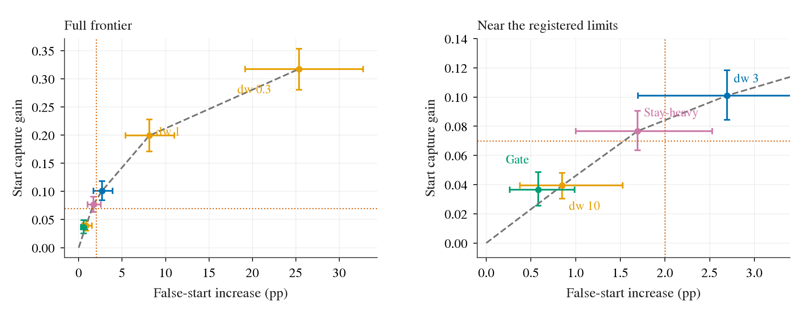
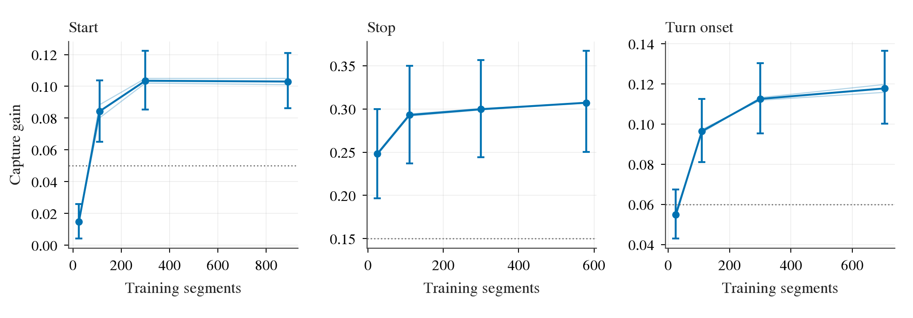
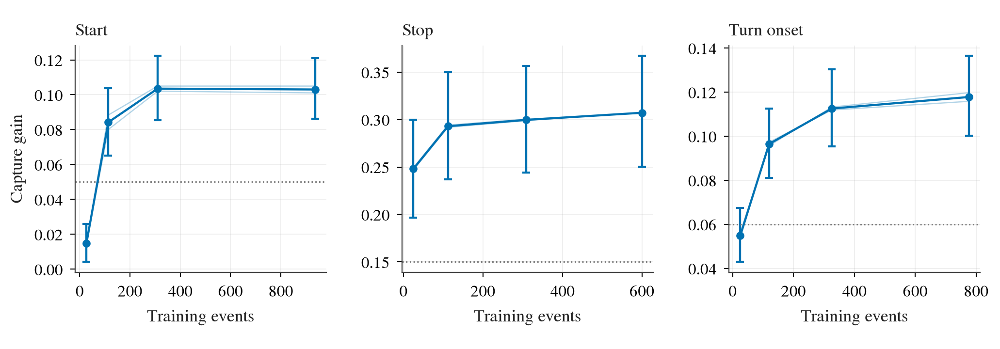

# op-adapt L：start gate 与数据量 learning curve（预登记）

状态：已完成（2026-10-01，box 时间 UTC+8）。预登记提交为 `8c05b3e`，在新计数前已 push。本文在本任务任何新计数、训练、profile（用小批测瓶颈与资源）、AUC 或实验读数之前提交；旧文献中的数字只作为背景。执行状态与偏离在文末追加，下面的方法和线保持不变。
背景：[log expert audit](https://github.com/VennIntelligence/jev-drive/blob/fc65452/todos/2026-10-01-log-expert-audit.md)、[L 主实验](2026-10-01-op-adapt-L-prereg.md)、[后续检查](2026-10-01-op-adapt-L-followup.md)、[RFS 诊断](2026-10-01-op-adapt-L-rfs-diagnosis.md)、[独立复核](https://github.com/VennIntelligence/jev-drive/blob/fc65452/tmp/2026-10-01-op-adapt-L-review-and-next-steps.md)；[decisions](../../../research/decisions.md) 第 77–79 条只读，由 main 会话维护。

## 共用协议

O 是冻结的 openpilot Cinque；main 是已选出的 `sel_s4ia_dw3`（stage 4 解冻、intent adapter，即把路线意图加进视觉 token 的小模块、蒸馏权重 dw=3），现有三个训练 seed（随机数种子）。start / stop / turn onset 分别是起步、停车和起转，stay 是停着且未来继续停着的对照。capture rate（捕获率）与 false trigger（误触发）完全沿用 audit 的 BASE 定义及主实验，不改阈值。plan 是模型规划轨迹。

WOD val 的全部整段和 479 个 rater（轨迹评价者）帧只用于最终一次锁定后读数，不选头、不选阈值、不选 checkpoint（训练权重快照）。此 val 过去已用于主实验和消融，并非历史上从未看过的新测试集；本任务不给它新的选择角色，不把重复使用包装成全新证据。输入沿用前视 5 Hz 的九帧 context（上下文，覆盖 1.6 s），只读已有缓存，不访问 WOD test、NAVSIM、不提交榜单。

所有 CI（confidence interval，置信区间）均为整段 WOD cluster bootstrap（把同段帧一起重抽以保留相关性），2000 次、seed 0、百分位 2.5/97.5%，两侧配对；没有帧级 bootstrap。seed 平均先逐帧平均指标，再重抽整段，不平均 plan；CI 不包含训练 seed 方差，逐 seed 数字同时保存。RFS（Rater Feedback Score，按评价者信任区给轨迹分的榜单指标）同时报告原始和纵向 ×1.06，按类别均值再平均；同段重抽后重新求类别均值，另附普通帧均值。漂移中位数和 p95（第 95 百分位）也保存整段重抽区间，但判据沿用点估计。没有数据的重抽项不填 0，记录不可估。

## 实验一：start gate

start gate（起步开关）只学一个小分类头，不重训 main。静止 = `max(v0,vm05,vm1) ≤ 0.5 m/s`；仅在静止帧上，预测概率 `p > tau` 用 main，其他静止帧用 O；运动帧全用 main。监督为 audit 的 start 标志：4 s 位移 ≥3 m 且最大段速 ≥1.5 m/s；全部其余静止帧为负类，包含轻微挪动。AUC（Area Under ROC Curve，衡量正负排序而不依赖阈值）主读数用全部静止帧，另报 start∪stay 的敏感性口径和中间挪动帧比例。

训练用原主实验 WOD `train`，dev（只用于超参选择的整段集）用既有表中 `r2val`：它来自 WOD train 的 r2 留出部分，主实验 L 明确没有训练或选择过该部分。先查整段身份不与 L train/dev 或 WOD val 重叠。若重叠、无两类或少于 20 个独立段，停止并报告，不偷偷换 dev。这样保持 curve 的全量配置，同时给 gate 一个未参与 main 选择的整段 dev；它不是独立于所有历史项目的数据。

输入是 O 的 stage-4 `t/H`：完整九帧 ×32 token ×512 维按顺序展开，没有人类未来、段 ID、时间、main 特征或未来图像。标准化均值/方差只从训练输入拟合，标准差下限 0.01。候选：linear（线性分类头）与 MLP（多层感知器）hidden=32、ReLU；AdamW、lr=1e-3、weight decay∈{1e-4,1e-2}，batch=256、20 epochs（训练集遍数）、seed=0，未加类别权重，BCE（binary cross entropy，二元交叉熵）。每候选末轮固定权重，dev AUC 最大者胜；并列取 linear、再取较大 weight decay，不看 val。完整输入保留所有缓存信息，但头的容量与监督仍有限，低 AUC 不能证明原始输入的信息论上限。

选中头后，在同一 dev 的 main 三 seed plan 上定共享 tau：候选是 0、1 以及 dev 预测概率的百分位网格 1%…99%。要求三个 main seed 各自 stay 假起步差点估计 ≤+0.8 pp 且 CI 上界 ≤+2 pp；满足者最大化三 seed 中最小的 start capture 增益，并列取较大 tau。tau=1 为回退（静止帧全用 O）。若只有回退可行，照常锁定并报告失败，不增加候选。模型、标准化参数、tau、dev 选择表与 SHA256（文件内容校验）锁定后才读 val。

| 编号 | WOD val 登记线；main 三 seed 各自都要过 | 读法 |
|:--|:--|:--|
| G0 | 静止帧 AUC 点估计 ≥0.75 且 CI 下界 >0.5 | 有可读的起步信息；AUC 是第一个公布的 val 读数 |
| G1 | start 增益 ≥+0.07 且 CI 下界 >+0.05 | 保留有实际量级的起步收益 |
| G2 | stay 假起步差 CI 上界 ≤+2 pp | 安全取舍过线 |
| G3 | control 假停/假转、straight_int 假转差 CI 上界各 ≤+2 pp | 其他误触发无害 |
| G4 | other 漂移中位 ≤0.10 m、p95≤0.50 m；slow/fast 差点估计各 ≤+2 pp | slow/fast 即 2 s 计划速度较当前速度低/高 max(1 m/s,20%) |
| G5 | 479 rater 帧 RFS 配对差 CI 下界 ≥−0.10，原始和×1.06都过 | 无害；点估计 ≥0另报，不混为显著收益 |
| G6 | start 增益相对旧扫描上前沿的余量 >0，配对 CI 下界 >0 | 判断是否超越已测的一维取舍 |

前沿（在相同假起步水平可得的最大捕获增益）用已有 dw 0.3/1/3/10 与 stayheavy 各可用 seed 的逐帧指标平均，再加 O 原点；取这些点的上凹包，允许相邻点间随机混合所对应的直线插值。gate 的三 seed 平均点画在同图。每次整段重抽都重建同一个候选集的前沿，计算 gate 在自己假起步横坐标上的纵向余量；超出覆盖范围为不可判，不外推。G6 是 seed 平均的前沿判定，G1–G5仍逐 seed。总体成功 = G0–G6全过；只有 G2 过而 G1 不过是压住误触发但收益不足；只有 G1 过而 G2 不过仍是有代价的捕获；高 AUC 而 gate 不过提示设计/迁移/阈值限制，低 AUC 只支持该缓存和小头难读，不能写成信息本来不够。

## 实验二：数据量 learning curve

learning curve（随训练数据量变化的学习曲线）共四档、每档 seed 0/1，共八个联合三类训练 run。对每类单独把原 main train 中包含该类的整段按 `default_rng(20261002+类别序号)` 排列，取前 25/110/300/全部段，档位嵌套，两 seed 用同一段 manifest（固定采样名单）。每类只从自己入选段抽该类模仿帧；对照、other、nuScenes 的池与 main 完全相同，未被选中的模仿帧仍不进 other。多类段允许重叠，同时报每类和联合的段/帧/独立事件数；事件仍按同段相邻标志帧间隔 >1 s 断开，不用帧数代替事件数。

其余配置逐字段与 main 相同：stage 4 + intent adapter、dw=3、batch=64、30 模仿（三类各10）+18对照（三类各6）+8其他WOD+8nuScenes；AdamW和学习率、loss（损失函数）、warm-up（学习率预热）100、cosine（余弦衰减）、4000 步、固定末步权重，不早停。不复用旧全量 checkpoint，重新训全量两 seed，避免路径变化混进曲线。小数据有更多重复曝光；这里回答固定 main 训练预算下的数据效益，不能解读成纯数据量的因果效应。本任务不额外加 adapter-only 或同步数支线，避免扩大预算与选择空间。

| 编号 | 每档每类判据（两个 seed 各自都过） | 含义 |
|:--|:--|:--|
| C1-start | Δcapture≥+0.05且 CI 下界>0 | 学到了起步 |
| C1-stop | Δcapture≥+0.15且 CI 下界>0 | 学到了停车 |
| C1-turn | Δcapture≥+0.06且 CI 下界>0 | 学到了起转 |
| C2 | 同 G2/G3 的四条误触发线 | 能否安全使用 |
| C3 | 同 G4 | 漂移与速度先验无害 |
| C4 | 同 G5；RFS 点估计≥0另列 | 评价者分数无害 |

C1只说明行为学到；C1–C4全过才写成该档可用。即使全量假起步仍不过，也照实完成八个run，不能把已知main的假起步当作数值检查失败。每个点报告三类捕获率及CI、对O差、误触发、漂移、slow/fast、RFS、ADE@4s（4 s平均位移误差，避免仅靠二值阈值）。

少量轨迹的登记读法：≤110段取到全量增益的≥60%且C1过，记为约10²段有训练价值；≤30%记为当前配置下主要用作裁决/考卷；中间记为部分收益，不二分成成功。先报逐seed比值与两个seed均值；全量增益≤0时比值不可定义。饱和点是最小档，其平均增益≥全量的90%，且相对全量的配对差CI下界≥−0.02；逐类判，无档满足就不称饱和。按事件数再画曲线，展示相同段数包含事件的不同，不能据三个切片的差异推因果。

## 启动检查、性能与停止规则

先登记 lane `op-l-gate-curve`，查实际 nvidia-smi（GPU状态工具）和调度表，只用登记卡与核；op-l-b2d 的卡和核8–73不借用，不改它的grant。已查环境实际只有GPU0–2、cgroup（容器资源配额）75核/约276GiB，与旧7卡文档不同；以实测为准。目前全部GPU仍在B2D登记范围，先做无GPU的准备；资源未释放之前不做GPU profile。自己的并行变量名用GC_SLOTS/GC_THREADS，不覆盖登录shell的WORKERS。所有涉及devkit的进程及子进程都继承OPENBLAS_CORETYPE=Haswell。>1min的任何准备或实验均在box的jev tmux（持久终端）用scripts/tmux_run.sh，带tqdm，独立run目录log.txt/events.jsonl/tb/。

两个实验分别先一单位：gate一个linear候选20轮，curve的25段seed0跑800步，不作为正式曲线点。gate检查：输入/标签/预测有限且两类存在；loss末20%均值低于首20%；反向梯度有限、参数确实变化；标量逐帧提取与并行/向量路径输入逐位一致；预测批量与逐帧maxabs≤1e-5；至少1000帧/s、GPU峰值≤12GiB，若只获CPU资源则CPU至少100帧/s、RAM≤40GiB；置tau=1静止帧与O逐位相同、置tau=0除p=0外与main逐位相同、运动帧恒main；dev AUC≥0.55。curve检查：800步loss有限且末20%模仿loss低于首20%；第0步对O恒等（plan maxabs≤1e-3m），固定对照池与main逐位一致，三个模仿池严格符合名单；末步dev三类捕获增益均值>0且至少两类正；dev漂移中位≤0.15m、最大误触发差≤+5pp；纯训练吞吐250–500序列/s、峰值≤40GiB（单卡独占profile）、数据等待占比≤10%。吞吐区间来自旧单卡main约350序列/s，须实际测量，不用历史代替。

优化必须在同一批与相同模型上对齐：保持fp16/GradScaler（半精度计算/梯度缩放）、损失/采样不变；训练组装数组逐位相同，loss差≤1e-6，梯度相对误差≤1e-5；前向相对原逐行路径在4s位置最大差≤0.02m且p99≤1e-3m、所有二值读数完全相同。优化不改训练语义；允许只优化I/O、预取、固定表驻留、跨独立run排程与已有去重推断。记录优化前后吞吐、实际瓶颈、显存、每卡5s利用率和墙钟估计。分配多卡时满负载排两个独立run/卡（显存容许才并发），CPU核按slot分块，总线程不越登记范围，GO每个job边界重读。不因为吞吐失败降低标准，也不因为分类/方向失败换标签。检查失败先停止对应批次、保存诊断、报告，再修实现；不得改线。

估计：gate小于1GPU·h；curve八run按约12–22min训练、前向与CI另计，三卡约1h，一卡约2–3h；实际资源可能只有一张，profile后写实测预测。超过约1h的批次增加首两正式run小批复查（相当于可用的中间阶段），完成率100%、loss/plan有限、检查池与配置、无OOM（显存不足）、读数非退化，再其余六run；主统计线失败照实报告，不冒充数值事故。

## 交付与执行日志

脚本在scripts/，所有新大产物只写`$DATA_DIR/runs/op_adapt_L/gate_curve/`，已有L/r2缓存严格只读；小CSV/JSON在[experiments/op_adapt_l/results/gate-curve/](../results/gate-curve/)，图用research/plot_style.py共用论文风格、英文标签，PNG在research/figs/、PDF留box，每图附1–3句中文读法。此todo从todos/README.md索引到顶层README。不发布Artifact（网页产物），不提交密钥，不改decisions。

每次变更命名路径stage（暂存）后commit（提交）/push（推送）main，随后box git pull。只关自己的tmux窗口，只按精确PID停自己的进程。完成后归档自己的lane；不清理别人的文件或窗口。

- 2026-10-01，预登记前环境只读检查：GPU0有B2D活进程；GPU1/2空闲但仍归op-l-b2d登记，CPU8–73保留。没有计算本任务任何数值。已请求资源负责人正式释放，尚未占卡。

## 偏离

D1（2026-10-01，任何训练、profile、AUC之前）：预登记错误地把表中`r2val`当成WOD train的独立留出；整段身份检查发现它与官方WOD val重叠60段，所以准备检查失败并停止。只读了段身份与运动学标签来检查split，没有读取val的模型指标。原始诊断留在box `gate_curve/prep/{split_check.json,ERROR,log.txt,events.jsonl,tb/}`。

修复：按独立复核建议，从原main的WOD `train`段名单（排序后）用`default_rng(20261002)`取排列前10%（round到整数）作为新的gate dev，其余90%训练gate头；任何一段不得同时出现在gate train/dev/官方val。这里的“新”只指没有参与gate头的训练/选择，固定main曾训练过这些dev段，因而用main在dev上的capture选tau可能偏乐观；在最终val上检验这一偏差。不重新训练main，不修改curve原main训练池，不改变任何超参集合、终线或启动线。这是数据划分偏离，原协议仍保留在上文，实际选择方案以此执行修正为准。修复脚本重新运行到`prep-v2/`，不覆盖失败证据。

## 结果

以下保留执行时的追加记录；完整锁定结果与判定在文末“最终结果”。首次预登记时尚未计算本任务数字，现有main的旧读数没有充当新实验结果。

- 2026-10-01，用户告知三张卡应已空闲；复查GPU0/1/2均0MiB、0%，无compute进程，B2D STATUS为`plan full done`。按用户最新资源信息登记自己的GPU0/1/2，但仍不使用核8–73，CPU范围保持0–7、74。B2D陈旧调度行不代替其负责人修改。

- D2（基础设施修复，任何训练/profile之前）：更新GPU grant时遗漏`--prefix GC`，sch_table默认生成了`CURVE_CPUS`，资源验证找不到`GC_CPUS`并拒绝启动。没有计算模型或实验指标。保留`prep-v2/ERROR`，补全prefix后重试到`prep-v3/`；gate/curve首次启动同样在资源检查处拒绝，未进入实验。资源检查移到统一异常记录内，确保以后拒绝启动也有ERROR证据。

## 已完成的启动检查与性能记录（2026-10-01）

整段检查修复后，gate train 有24,976帧/937段，正类7,650帧；新gate dev有2,740帧/98段，正类750帧。两者与官方val整段重叠均为0；固定main见过这两个集合中的段，限制见D1。curve采样的真实段/帧/事件计数见[training_counts.csv](../results/gate-curve/training_counts.csv)，25段档每类只有25–27个独立事件，不把253/144/489帧说成同样多的专家轨迹。

gate一单位20轮全部检查通过：训练BCE从首轮1.316到末轮0.231，dev AUC=0.691，梯度有限且非零；吞吐140,211帧/s、峰值8.11GiB显存、7.71GiB RAM（内存）；批量对逐帧概率最大差2.26e-10。头全网格之后选中MLP hidden32、weight decay=1e-4（dev AUC=0.776），共享tau=0.9943373692；锁定文件含头和标准化参数SHA256，val读取开始于10:21，首个输出确为静止帧AUC。

curve一单位800步全部检查通过：第0步对O plan最大差0；末步dev三类增益均值+0.150，中位漂移0.063m、p95=0.259m，误触发均在短训练线内，loss有限、模仿loss下降。纯compute（计算）profile为384.8序列/s；完整单位含两次后续dev读取为278序列/s，峰值25.1GiB。二者不同时间口径，不把含dev吞吐与纯训练的登记区间混比。正式中间阶段随后启动25段两seed，GPU1/2各一run；GPU0同时完成gate全网格、锁定与读取。六run全批只在这两个完整run检查后起动。

| 性能或对齐项目 | 原路径 | 优化/复用路径 | 实测含义 |
|:--|--:|--:|:--|
| gate同一256帧的输入提取+前向+反向 | 3,066帧/s | 299,800帧/s | 原路径每批gather（取出缓存行）与传GPU；新路径原始fp16特征驻留GPU、每批fp32标准化，避免输入传输瓶颈；训练完整20轮约140k帧/s是另一个口径 |
| gate同批loss | 0.2647942901 | 0.2647942901 | 梯度相对差0，输入逐位相同；不是改变精度换来的加速 |
| curve同批CPU组装 | 0.297s | 0.220s | 第二次复用共享memmap（映射磁盘文件为数组）与页缓存；没有改训练算图，CPU预取覆盖I/O |
| curve同批loss | 1.883859754 | 1.883859754 | 梯度相对差0，配置/对照池逐位相同 |
| curve128帧前向 | 370.7帧/s | 952.5帧/s | 使用已有context去重；4s最大与p99位置差均0，所有二值指标逐位相同 |

原始H特征批量gather本身没有加速（样本测量3,999→3,810帧/s），实际有用的是GPU驻留避免每步重取；不把这次小批gather测量写成优化成功。curve计算仍是主要瓶颈，未改训练语义；每卡利用率的5s实测写在`chain/gpu_util.csv`，完成时分阶段汇总。独立检查的整段均值bootstrap对原函数误差6.94e-18；中位/p95的加权实现对显式复制帧重建区间误差0，见[numeric_checks.json](../results/gate-curve/numeric_checks.json)。这一额外独立梯度/统计复核在gate val读取之后执行，之前已经过输入逐位与预测对齐；没有据复核改变任何结果或规则。

- D3（额外验证顺序）：独立的loss/gradient与统计量显式重建检查在gate val开始后才执行；先前已验证优化输入逐位相同、分类概率与前向指标对齐，后补检查再次给出loss/gradient差0。所有训练、判定线和选出的头/tau保持不变。
- D4（运行包装）：初始pilot与主chain直接用tmux_run.sh和自有GO边界检查，没有套docs/long-runs.md所述的slot_run.sh；每个run有独立DONE/ERROR、log/events/tb与明确CPU/GPU亲和性，没有碰其他lane。额外frontier及后处理通过slot_run.sh启动。此偏离影响调度哨兵格式，不影响数据或统计判定，完成后会核对所有自有进程退出并finish本lane。

- D5（检查实现精度）：curve单位脚本最初用首/末3个50步均值比较，相当于18.75%而非登记的20%。末批配置与模型不改；补做严格160步的保守证明：Huber（非负的稳健损失）保证首160步平均≥首150步损失和/160，末160步平均≤末200步损失和/160。以日志保存的50步均值证明后者小于前者才认定过线，证据写到`unit_trend_bounds.json`；后续脚本也改用这条更严格的证明，没有用近似20%代替登记线。

- D6（纯报告bug，训练和读数已经全部完成）：逐seed增益比计算对两个boolean数组直接做减法，numpy（数组计算库）拒绝这一运算；原始metrics、判定表与图已正确生成，未写出增益比。修复为转换float（浮点数）后做带符号差，不使用xor（异或，不能表达改善或恶化的方向）。失败报告保留在`report-attempt1/`，新报告重算相同锁定结果；额外核对八run配置、对照池、4000步、非有限loss为0。未改任何判定线。

- D7（报告审计的历史字段兼容）：新增配置核对发现旧main的config没有contrast_mix字段，而本次显式保存[1,1,1]。核查提交c4f9ae8之前的Mixer.draw，旧路径将18个对照均分为6/6/6，新路径仍是6/6/6；这是历史元数据缺字段，不是训练混合发生变化。只在字段确实缺失时补这个唯一已核验的默认值，再逐字段严格比较，其余字段差异仍停止。失败审计保留report-attempt2/，不改模型、读取或判定线。

## 最终结果（2026-10-01）

两项实验都已完成；八个curve run和全部留出读取有DONE，八run都是4000步、非有限loss为0，对照/other/nuScenes池保持原main，模仿池与锁定名单相同。原main缺失的contrast_mix字段已按历史代码核实为均分6/6/6后审计，其余配置逐字段相同。汇总修复前后的metrics、逐seed判定和共同判定文件逐字节相同。结果依据见[execution_checks.json](../results/gate-curve/execution_checks.json)、[run_audit.json](../results/gate-curve/run_audit.json)、[完整metrics](../results/gate-curve/metrics.csv)。任何登记线均未放宽。

### gate：能读到起步信息，但这次开关没有达到总体成功

首个val输出是全部静止帧AUC：**0.7740 [0.7378, 0.8081]**，8111帧/297段，正类2048。start∪stay敏感性口径为0.7987 [0.7558,0.8385]；两口径相差的1947帧占全部静止帧24.0%，是未达到start、也未达到stay定义的轻微挪动等负类，不能只报更好看的口径。MLP hidden32、weight decay=1e-4与tau=0.9943373692均由dev锁定，没有依据val再选头或阈值。

以下capture是三个固定main seed逐帧指标均值，区间来自同一整段重抽。start有2048帧/241段，stop有1268帧/181段，turn onset有3825帧/179段；它们是留出评价帧，不是训练事件数。

| 切片 | O capture | gate capture | 对O增益与95% CI |
|:--|--:|--:|:--|
| start | 0.5312 | 0.5679 | +0.037 [+0.025, +0.049] |
| stop | 0.2524 | 0.5591 | +0.307 [+0.250, +0.367] |
| turn_onset | 0.7260 | 0.8359 | +0.110 [+0.092, +0.128] |

| 登记线 | 结果（逐seed全部满足才过） | 是否过线 |
|:--|:--|:--|
| G0 | AUC=0.7740≥0.75，CI下界0.7378>0.5 | 通过 |
| G1 | 三seed start增益0.0356–0.0371，均低于0.07；各CI下界也不足0.05 | **失败** |
| G2 | stay差均值+0.583 pp，平均CI上界+0.979 pp；最差seed上界+1.037 pp≤2 pp | 通过 |
| G3 | control假停/假转、straight_int假转最差seed CI上界均≤0.124 pp | 通过 |
| G4 | other漂移中位约0.048m、p95约0.310m；slow/fast均值差+0.760/+0.273 pp；各seed均过原线 | 通过 |
| G5 | raw与×1.06 RFS差最差seed CI下界−0.0524/−0.0494≥−0.10 | 通过 |
| G6 | 前沿纵向余量+0.00961 [−0.01708,+0.02655]，CI跨0 | **失败** |

总体失败：这次gate压住了假起步，但只留下约+0.037的start收益，未保住登记的+0.07；也未证明超越旧蒸馏扫描前沿。G6点估计在前沿之上，不能把这一点估计写成已证实的改进。停止/起转大多保留main，不能把这两项增益归功于起步头。

看右图绿色点：假起步在2 pp线内，start收益却低于0.07线；灰虚线是在相同假起步水平上旧候选的上前沿。绿色点稍高于虚线，但前沿余量的配对CI跨0，不能宣称突破取舍；左图保留dw0.3/1的完整范围。

### curve：约110段/类有训练价值；行为增益约300段/类达到登记饱和

以下增益是两个重新训练seed的逐帧指标均值，CI不包含训练seed方差；判定单独要求两个seed各自通过。每类在25/110/300档各有相同数目的段，全部档start/stop/turn为889/579/705段。联合三类去重后的训练段数分别是74/300/706/1244，模仿帧数886/3946/10632/25601；完整对照与其他池仍保留，所以不能把“25段/类”说成总训练只有25段。

| 每类段数 | start增益与95% CI | stop增益与95% CI | turn onset增益与95% CI | C1学到：start/stop/turn |
|:--|:--|:--|:--|:--|
| 25 | +0.015 [+0.004, +0.026] | +0.248 [+0.197, +0.300] | +0.055 [+0.043, +0.068] | 失败 / 通过 / 失败 |
| 110 | +0.084 [+0.065, +0.104] | +0.293 [+0.237, +0.350] | +0.096 [+0.081, +0.113] | 通过 / 通过 / 通过 |
| 300 | +0.104 [+0.086, +0.122] | +0.300 [+0.244, +0.357] | +0.113 [+0.095, +0.130] | 通过 / 通过 / 通过 |
| all | +0.103 [+0.086, +0.121] | +0.307 [+0.250, +0.367] | +0.118 [+0.100, +0.137] | 通过 / 通过 / 通过 |

| 每类段数 | start / stop / turn实际capture（O=0.5313 / 0.2524 / 0.7260） | C2误触发 | C3漂移/速度 | C4 RFS无害 | 总体可用 |
|:--|:--|:--|:--|:--|:--|
| 25 | 0.5461 / 0.5004 / 0.7809 | 通过 | 通过 | 失败 | 失败 |
| 110 | 0.6155 / 0.5453 / 0.8225 | 失败：stay | 通过 | 通过 | 失败 |
| 300 | 0.6348 / 0.5521 / 0.8386 | 失败：stay | 通过 | 通过 | 失败 |
| all | 0.6343 / 0.5595 / 0.8438 | 失败：stay | 通过 | 通过 | 失败 |

25段/类的stop已经过行为线，但start增益仅约0.015、turn约0.055，虽然CI下界均正，仍未达到登记量级，不能称三类都学到。110段/类三类C1均过，获得全量增益的81.8%/95.4%/81.9%，按预先规则三类都有约10²段的训练价值。逐seed比值与配对饱和CI见[curve_ratios.csv](../results/gate-curve/curve_ratios.csv)。

| 每类段数 | start事件 / stop事件 / turn事件 | start增益占全量 | stop增益占全量 | turn增益占全量 | 三类登记饱和 |
|:--|:--|--:|--:|--:|:--|
| 25 | 27 / 25 / 25 | 14.5% | 80.7% | 46.6% | 失败 |
| 110 | 114 / 112 / 120 | 81.8% | 95.4% | 81.9% | 失败 |
| 300 | 310 / 309 / 326 | 100.5% | 97.6% | 95.6% | 通过 |
| all | 936 / 600 / 776 | 100.0% | 100.0% | 100.0% | 通过 |

三类最小登记饱和档都是300段/类：相对全量的配对CI下界分别−0.0076/−0.0132/−0.0087，均≥−0.02，并取得≥90%全量增益。110段的stop点估计已有95.4%，但相对全量CI下界−0.0272，仍不满足饱和线。这里的饱和仅指这四档、固定4000步、当前段名单和两seed的行为收益，不是RFS、误触发或所有驾驶能力的饱和。

25→110段时start和turn收益明显上升，stop在25段已获得较大收益；细线显示两个seed、粗线与误差条显示均值和整段CI。三类300段后增加数据的收益变小，按登记的配对非劣界约束才称300段档饱和，不能仅凭曲线看起来平来判断。

同样25段/类只有约25–27个独立事件，110段/类约112–120个；这些数字更接近真实专家事件量，而非重复取出的帧数。横轴改为事件数后仍有相同趋势，但类别难度、固定其他池与曝光次数都同时不同，不能由三条曲线推因果。

### 误触发、漂移、速度与479帧RFS

以下均值与CI保持原统计口径；括号内“最差”指该档逐seed的最大stay CI上界，登记线要求它≤2 pp。误触发单位pp（percentage point，百分点），漂移单位m。其他三个误触发指标在各档均过线，最差CI上界≤0.151 pp；完整逐切片ADE@4s、速度与每seed结果保存在metrics.csv。

| 模型 | stay假起步差与95% CI，pp | 最差seed stay CI上界，pp | other漂移中位 / p95，m | other slow / fast差，pp |
|:--|:--|--:|:--|:--|
| gate | +0.583 [+0.257, +0.979] | 1.037 | 0.048 / 0.310 | +0.760 / +0.273 |
| curve-25 | +0.437 [+0.012, +1.031] | 1.096 | 0.048 / 0.246 | +0.185 / +0.311 |
| curve-110 | +1.931 [+1.012, +3.062] | 3.332 | 0.066 / 0.337 | +0.434 / +0.371 |
| curve-300 | +2.563 [+1.514, +3.743] | 3.832 | 0.063 / 0.345 | +0.727 / +0.511 |
| curve-all | +2.672 [+1.718, +3.725] | 3.828 | 0.059 / 0.335 | +0.743 / +0.458 |

| 模型 | raw RFS差与95% CI | ×1.06 RFS差与95% CI | 两尺度点估计均非负 | 登记无害线 |
|:--|:--|:--|:--|:--|
| gate | -0.003 [-0.050, +0.044] | +0.003 [-0.042, +0.048] | 否 | 通过 |
| curve-25 | -0.056 [-0.112, -0.003] | -0.067 [-0.128, -0.013] | 否 | 失败 |
| curve-110 | +0.014 [-0.065, +0.095] | +0.021 [-0.056, +0.102] | 是 | 通过 |
| curve-300 | +0.006 [-0.061, +0.076] | +0.011 [-0.059, +0.085] | 是 | 通过 |
| curve-all | +0.014 [-0.051, +0.080] | +0.022 [-0.041, +0.088] | 是 | 通过 |

RFS仍是479帧、478段的类别宏平均（先各类别求均值再平均），其O基线raw=8.003645、×1.06=8.119467。25段档两尺度平均差都负且CI不含0，并且CI下界低于−0.10，无害线失败；110/300/全部档无害线通过，但CI均跨0，没有RFS显著改善的证据。gate的raw点估计也略负，G5通过不能改写成RFS有收益。

### 最终性能、资源与实际墙钟

单位loss精确20%窗口的保守核验：首160步模仿loss平均下界1.933911，末160步上界1.391389，后者严格小于前者；[unit_trend_bounds.json](../results/gate-curve/unit_trend_bounds.json)保存证明。训练hot path（耗时主要路径）保持原main；纯计算384.8序列/s，正式独占卡的25段run含dev为319.6–334.3序列/s，六run并发时每run181.5–207.2序列/s，数据等待0.4%–3.6%。共享卡吞吐下降是两个run竞争同一GPU，不能当作独占profile的250–500线失败；两run合计接近独占纯计算吞吐。

| 阶段 | 墙钟 | GPU0 / 1 / 2平均利用率 | 每卡显存峰值 |
|:--|:--|:--|:--|
| 中间阶段：gate与25段两个完整run | 14.87min | 2.0% / 76.8% / 76.4% | GPU0约23.55GiB，GPU1/2约25.74GiB |
| 全批6run均仍训练的共同区间（含初始化） | 21.45min | 92.2% / 93.4% / 91.8% | 三卡均约51.47GiB |
| 全批6run，直到全部eval完成 | 25.41min | 87.4% / 88.1% / 88.0% | 三卡均约51.47GiB |
| 整个正式chain至图完成 | 40.80min | 55.0% / 82.9% / 82.6% | 同上 |

阶段边界和5s原样采样见[gpu_util_summary.csv](../results/gate-curve/gpu_util_summary.csv)、[gpu_util_samples.csv](../results/gate-curve/gpu_util_samples.csv)，每run时间见[timings.csv](../results/gate-curve/timings.csv)。中间阶段GPU0很快完成gate，随后等待两条25段run先过检查，因此它的低利用率是阶段门控造成；全批时三卡各两run，平均利用率均超过91%。固定4000步的并发墙钟小于最初约1h估计，最终人工核验和报告bug修复另计，不把GPU空闲后的收尾算训练耗时。

11:01正式chain、模型读取和图完成，11:07汇总报告完成（时间均为box UTC+8）。确认没有GPU compute进程后，只关闭自己的两个tmux窗口，并用sch_table.py finish归档op-l-gate-curve；核8–73与其他lane、r2 run均未改变。

### 已验证的数字、推断边界与下一步

已验证：AUC及全部配对CI、模型/阈值锁定校验、采样整段名单和实际事件数、八run4000步配置、数值对齐、有限loss/plan、精确单位loss趋势证明、逐seed登记判定、配对前沿与饱和判定、5s GPU利用率，以及三张PNG图英文标签和布局。bootstrap为整段2000次/seed0；没有用帧级CI。原路径与优化路径对同一训练子集的输入、loss、gradient对齐，前向和二值指标差为0；不是仅凭最终结果相近判断对齐。

结果支持：当前缓存中的前视输入含可读的起步排序信息，约110段/类模仿数据能在固定main预算下教会三类捕获，约300段/类的行为增益达到本次登记饱和。推断而非已验证结论：gate失败更可能牵涉头的容量、分数校准、plan切换或任务迁移，而非“输入毫无信息”；AUC≠完美可分，也不能排除1.6s输入对可靠起步仍有限制。我们没有验证信息论上限、全新val、更多seed/更多段名单、闭环安全或真实部署收益。

建议把下一轮资源放在预登记的安全约束训练或起步分数校准/选择性切换，不继续盲目增加模仿段数：110→全量的三类平均收益只再增加约0.019/0.014/0.021，却保留假起步问题。25段档的RFS下降提示不能只盯capture；300段档可作为后续固定的模仿预算，但需独立的新段/seed核验。下一轮应使用未参与main训练的选择段和新的最终留出，避免D1与历史val反复使用限制；本次未新增训练臂、未改决策文件、未做闭环。

偏离清单为D1–D7，均在发生处保留失败证据与执行说明。影响解释的主要项是D1的新gate dev曾被main训练；D3、D5是检查顺序与窗口精度后补，D2/D4是调度包装，D6/D7是汇总代码和历史配置兼容；没有根据val放宽任何线或重选模型。
