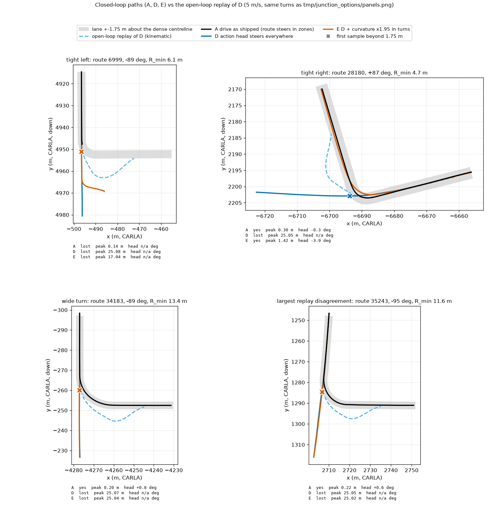

# Junction turns of the openpilot action head, closed loop (seed 2)

Arms: **A** shipped `drive` agent (dense route steers in the junction zones and on divergence); **D** `zones: false`, `div_m: 1e9`: the action-head curvature steers everywhere, longitudinal and everything else identical; **E** D plus action curvature x1.95 inside LEFT / RIGHT command runs +-3 m. No privileged light (`resume` stays `timer`). Routes finished by all three arms: 36 of 36 (38 turns). Definitions: scripts/junction_cl_report.py docstring. CIs: cluster bootstrap over routes (2000).

## Per-turn outcomes

| arm | turns | entered | took intended branch | lost (entered, no exit) | leaves lane (>1.75 m), of entered | median peak cross-track m [CI], entered | median abs exit heading err deg, branch | zone collisions + off-road infractions (n) |
|---|---|---|---|---|---|---|---|---|
| A | 38 | 100 [100, 100] | 92 [82, 100] | 8 [0, 18] | 8 [0, 17] | 0.30 [0.28, 0.44] | 0.9 [0.5, 1.1] | 21 |
| D | 38 | 95 [88, 100] | 5 [0, 14] | 89 [80, 97] | 97 [92, 100] | 25.03 [25.01, 25.05] | 18.8 [10.6, 27.0] | 11 |
| E | 38 | 95 [88, 100] | 11 [2, 21] | 84 [74, 95] | 94 [86, 100] | 25.02 [25.00, 25.03] | 4.5 [3.5, 5.1] | 10 |

Turns that did take the intended branch only (survivors; the lost turns above carry the large peaks, a lost car is cut at 25 m off the centreline):

| arm | n branch-yes turns | median peak cross-track m [CI] | leaves lane (>1.75 m) % [CI] |
|---|---|---|---|
| A | 35 | 0.30 [0.28, 0.39] | 3 [0, 9] |
| D | 2 | 3.96 [3.32, 4.60] | 100 [100, 100] |
| E | 4 | 1.89 [1.42, 5.09] | 50 [0, 100] |

## Per route (official DS / RC) and paired differences

| arm | routes | DS mean [CI] | RC mean [CI] | routes with route_dev / agent-failed status |
|---|---|---|---|---|
| A | 36 | 65.6 [57.1, 73.7] | 95.8 [90.9, 99.8] | 4 |
| D | 36 | 39.0 [34.0, 43.9] | 54.2 [48.5, 60.3] | 33 |
| E | 36 | 38.6 [34.3, 43.0] | 53.3 [47.7, 59.8] | 32 |

**Paired D - A**: DS -26.6 [-35.6, -17.7]; RC -41.6 [-48.9, -33.5]; intended-branch rate (pp) -86.8 [-97.3, -75.0]; median peak cross-track 24.71 [23.43, 24.75] m (turns entered by both).

**Paired E - A**: DS -27.0 [-36.3, -17.7]; RC -42.5 [-50.4, -33.7]; intended-branch rate (pp) -81.6 [-94.7, -64.9]; median peak cross-track 24.44 [22.60, 24.74] m (turns entered by both).

## Panel turns

Per-panel numbers (closed loop): 
- tight left (route 6999): A  lost  peak 0.14 m  head n/a deg; D  lost  peak 25.08 m  head n/a deg; E  lost  peak 17.04 m  head n/a deg
- tight right (route 28180): A  yes  peak 0.30 m  head -0.3 deg; D  lost  peak 25.05 m  head n/a deg; E  yes  peak 1.42 m  head -3.9 deg
- wide turn (route 34183): A  yes  peak 0.20 m  head +0.8 deg; D  lost  peak 25.07 m  head n/a deg; E  lost  peak 25.04 m  head n/a deg
- largest replay disagreement (route 35243): A  yes  peak 0.22 m  head +0.6 deg; D  lost  peak 25.05 m  head n/a deg; E  lost  peak 25.02 m  head n/a deg

## Reading

- With nothing else steering (D), the action head does not take the junction: 2 of 38 turns reach the intended exit (A 35 of 38). In the panels D drives straight on through the junction, along the lane it was in; E (x1.95) takes 4 of 38. The replay of D (light blue) curves towards the turn but is an open-loop replay of curvature logged while the dense route was steering; with feedback the curvature is never produced. The replay's 7-10 m drift is therefore not a measure of the closed-loop head: the closed-loop failure is a missed branch (25 m+ off the dense centreline), not an under-turn.
- Official: D DS 39.0 vs A 65.6 (paired -26.6 [-35.6, -17.7]), RC 54.2 vs 95.8; E is no better than D (-27.0 [-36.3, -17.7]). One seed, 36 routes; the CIs exclude zero.
- The two D / E survivors that did take the branch left the lane (peak 4.0 / 1.9 m): too few to say more about gain.
- Caveats. (1) `jclD` also sets `div_m: 1e9`, otherwise the shipped divergence rule hands the car to the route as soon as the head path leaves it. (2) The shipped drive config has `intent: none`, so the head has no navigation intent beyond the route desire the agent already feeds; whether a head given an explicit turn command (op_img_cmd) would turn closed-loop is not tested here. (3) Peaks are cut at 25 m off the centreline for lost cars; "lost" in A (3 turns) is mostly a stop / timeout before the exit, not a wrong branch. (4) The `x` markers in the panels are the first sample beyond 1.75 m. (5) No GIFs were made.
- Reproduce: lane file [`junction_cl_lane.py`](https://github.com/VennIntelligence/jev-drive/blob/a0b4aa774751093184458a722174130feab0d362/experiments/op_closed_loop/scripts/junction_cl_lane.py) (`--lane jcl --workers-per-card 6 --arg stage=all`), then `junction_cl_report.py`. Lane: 18 units, 3 cards, about 37 min wall.
