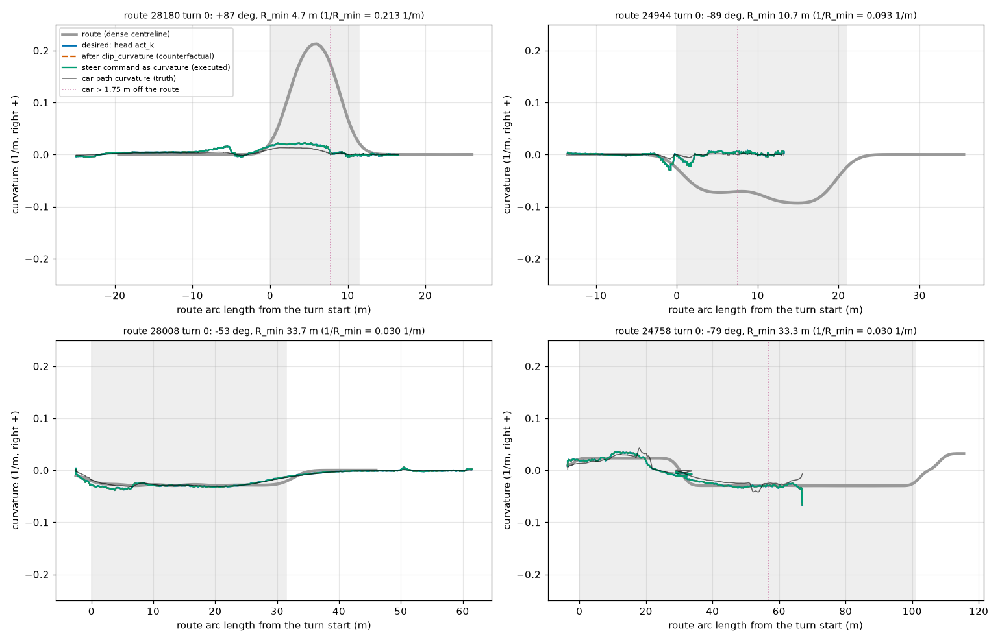
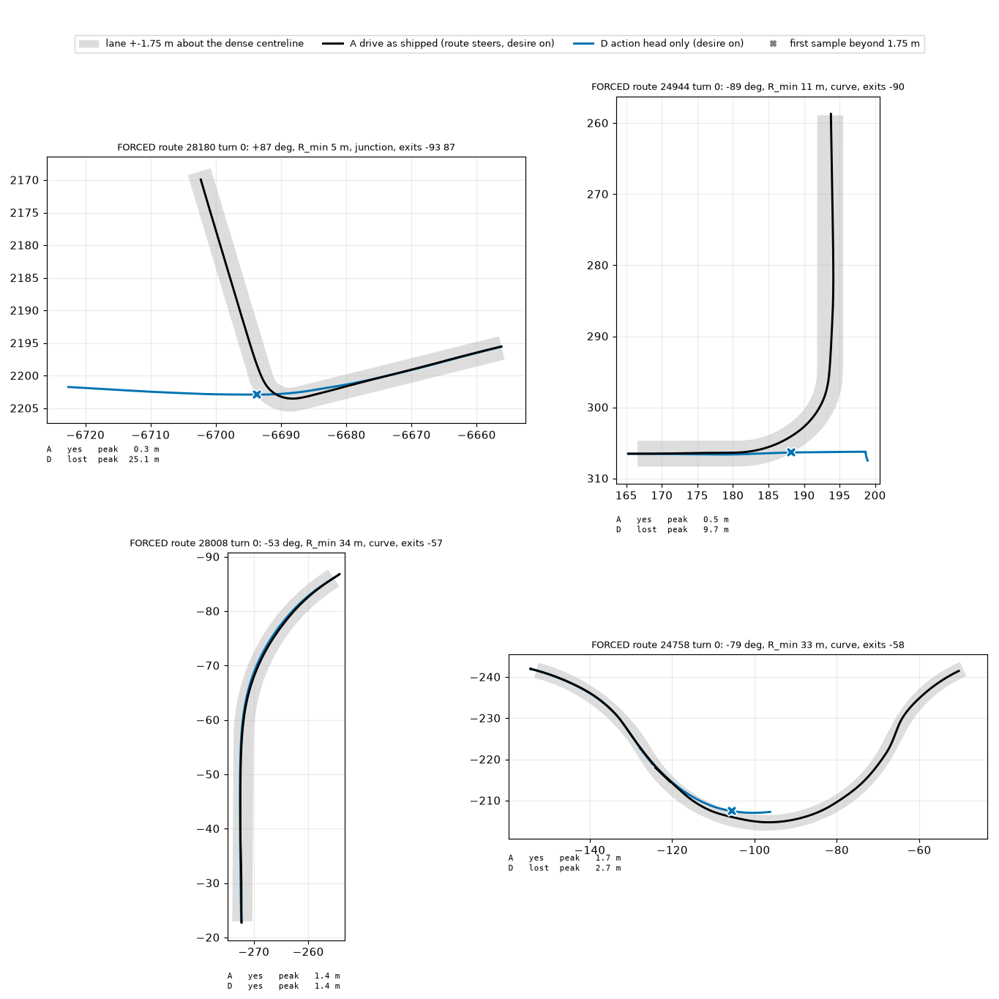

# Does the action head alone fail forced turns? (seed 2, scope trimmed)

Question: with only openpilot's action head steering (arm D: `zones: false`, `div_m: 1e9`, route desire input on as in decision 121, no `nored`), does it follow a turn when the road offers **no straight exit**? A = shipped `drive` (dense route steers in zones), same traffic seed.

**Scope actually run.** Forced-turn classification covers all 189 routes of both B2D route files (`scripts/forced_turns.py`, CARLA map from the OpenDrive file, lane-level exits 25 m before the turn out to the turn end + 15 m; forced = no exit within 30 deg of straight): 197 turns >= 25 deg, **30 forced** (24 plain road curves / L-bends with one exit, 6 T-stems with only left + right) on 28 routes, 167 choice ([junction_forced_turns.csv](junction_forced_turns.csv)). The val xml alone has 15 forced; the target of 25 needs the 220 xml. Of the 38 turns of decision 121, 3 are forced (24944, 25051, 28180), 35 choice. After the user narrowed the question, only **12 forced turns on 10 val routes** were run (A and D; 3 earlier + 7 new routes, spanning R_min 4.7-49 m), plus a 6-route few-stage of the arrow arms. The sky-arrow / zero-shot arms (N, Z, NA, SA, NA0) were cancelled after 19 units (lane `jfa`, N and Z of the 36 old routes finished and are not analysed here). Not run: the other 18 forced turns (all in the 220 xml except 4 val routes), second seed. n is small: CIs are route-cluster bootstrap over 10 routes and wide.

Turn metrics are those of junction_cl_report.py (took intended branch = within 5 m of the dense exit; lost = entered, no exit; "never" = the car never reached the turn in the run, e.g. blocked earlier). Reproduce: `python -m jevdrive.cl run experiments/op_closed_loop/scripts/junction_forced_lane.py --lane jfa --arg stage=forced --arg routes=27994,26153,26723,26365,24758,28008,24416`, then `junction_forced_report.py --arms A,D --routes 24944,25051,28180,27994,26153,26723,26365,24758,28008,24416`.

## Answer

D does fail forced turns, **but not uniformly: it fails the tight ones and is on par with A on the wide ones.** Took the turn: D 4 of 12 (33% [0, 67]), A 9 of 12 (75% [45, 100]); paired D - A -42 pp [-91, +15] (CI includes 0 at this n). By R_min: **< 10 m (3 turns: two T-stems and a 90 deg corner) D 0 of 3, A 3 of 3; 10-20 m D 1 of 4, A 3 of 4; > 20 m D 3 of 5 = A 3 of 5.** T-stems: D 0 of 3, lost 25 m off the centreline (it drives straight on into the verge or the cross road). Single-exit curves: D 4 of 9 vs A 6 of 9. Official: DS 42.8 vs 68.3, RC 56.1 vs 84.3 on the 10 routes (paired DS -25.5 [-50.6, -1.0]).

Why (curvature plot): the head's desired curvature through the tight turns peaks at 0.023 (R 4.7 m T-stem) and 0.030 1/m (R 10.7 m), against 0.213 and 0.093 needed; it never asks for the turn. `clip_curvature` (rate 5/v^2, 3 m/s^2, 0.2) never binds in these windows (clipped = desired, to 3 decimals; counterfactual, D does not apply it), and the executed steer implies the same curvature, so on the tight turns this is "the head does not ask", not "the control path clips or lags". On the wide curves (R 33 m) the head asks 0.038 / 0.067 against 0.030 needed and the car follows (peak cross-track 1.4 m, same as A; the lane-keeping head follows a gentle curve), the one 24758 failure (peak 2.7 m) is a 1 m overshoot of the lane edge at a 79 deg curve of varying radius. Caveat: min speed in these windows is ~0 (cars wait behind traffic or stop), and the plot masks v < 1 m/s.

Arms present: A, D. Turns scored by every arm: 15 on 10 routes, of which 12 forced and 3 choice. Definitions: junction_forced_report.py docstring (turn metrics are junction_cl_report.py's). CIs: cluster bootstrap over routes (2000).

## Per-turn outcomes

### Forced turns (the map offers no exit within 30 deg of straight) (12 turns, 10 routes)

| arm | entered % | took intended branch % | lost % | leaves lane (>1.75 m) % of entered | median peak cross-track m, entered | median abs exit heading err deg, branch | zone collisions + off-road (n) |
|---|---|---|---|---|---|---|---|
| A | 83 [62, 100] | 75 [45, 100] | 8 [0, 23] | 0 [0, 0] | 0.53 [0.30, 1.39] | 1.6 [0.3, 2.9] | 1 |
| D | 83 [62, 100] | 33 [0, 67] | 50 [23, 80] | 70 [44, 90] | 4.45 [1.39, 15.63] | 1.2 [0.6, 1.5] | 4 |

### Choice turns (a straight exit exists) (3 turns, 3 routes)

| arm | entered % | took intended branch % | lost % | leaves lane (>1.75 m) % of entered | median peak cross-track m, entered | median abs exit heading err deg, branch | zone collisions + off-road (n) |
|---|---|---|---|---|---|---|---|
| A | 100 [100, 100] | 100 [100, 100] | 0 [0, 0] | 0 [0, 0] | 0.32 [0.22, 0.52] | 1.2 [0.9, 1.6] | 0 |
| D | 33 [0, 100] | 0 [0, 0] | 33 [0, 100] | n/a | n/a | n/a | 0 |

### Forced, junction (T-stem, no straight exit) (3 turns, 3 routes)

| arm | entered % | took intended branch % | lost % | leaves lane (>1.75 m) % of entered | median peak cross-track m, entered | median abs exit heading err deg, branch | zone collisions + off-road (n) |
|---|---|---|---|---|---|---|---|
| A | 100 [100, 100] | 100 [100, 100] | 0 [0, 0] | 0 [0, 0] | 0.30 [0.29, 0.38] | 0.9 [0.3, 1.1] | 0 |
| D | 100 [100, 100] | 0 [0, 0] | 100 [100, 100] | 100 [100, 100] | 25.00 [12.73, 25.05] | n/a | 2 |

### Forced, plain road curve / L-bend (single exit) (9 turns, 7 routes)

| arm | entered % | took intended branch % | lost % | leaves lane (>1.75 m) % of entered | median peak cross-track m, entered | median abs exit heading err deg, branch | zone collisions + off-road (n) |
|---|---|---|---|---|---|---|---|
| A | 78 [50, 100] | 67 [30, 100] | 11 [0, 30] | 0 [0, 0] | 1.39 [0.47, 1.55] | 2.1 [0.1, 5.7] | 1 |
| D | 78 [50, 100] | 44 [10, 88] | 33 [9, 62] | 57 [25, 86] | 1.80 [1.39, 6.25] | 1.2 [0.6, 1.5] | 2 |

### By turn angle (took intended branch %, n turns)

| group | angle bin | n | A | D |
|---|---|---|---|---|
| forced | 25-60 | 3 | 67% | 100% |
| forced | 60-120 | 9 | 78% | 11% |
| choice | 25-60 | 1 | 100% | 0% |
| choice | 60-120 | 2 | 100% | 0% |

### By minimum radius R_min of the turn (took intended branch %, n turns; forced turns only)

| R_min | n | routes | A | D |
|---|---|---|---|---|
| < 10 m (tight) | 3 | 3 | 100% (peak 0.3 m) | 0% (peak 25.0 m) |
| 10-20 m | 4 | 3 | 75% (peak 0.5 m) | 25% (peak 6.3 m) |
| > 20 m (wide) | 5 | 5 | 60% (peak 1.4 m) | 60% (peak 1.4 m) |

## Paired against A (route-clustered CIs)

Branch rate: per-turn took-branch indicator minus A's on the same turn, averaged within a route, bootstrap over routes. DS / RC: per route, official, all routes finished by both arms.

| arm | forced: branch rate diff pp | choice: branch rate diff pp | DS diff, routes with a forced turn | DS diff, other routes | RC diff, routes with a forced turn | RC diff, other routes |
|---|---|---|---|---|---|---|
| D | -41.7 [-90.9, 15.4] | -100.0 [-100.0, -100.0] | -25.5 [-50.6, -1.0] (n=10) | n/a (n=0) | -28.2 [-51.8, -2.3] (n=10) | n/a (n=0) |

### Route scores (official, mean over routes finished by the arm)

| arm | routes | DS [CI] | RC [CI] |
|---|---|---|---|
| A | 10 | 68.3 [48.6, 84.0] | 84.3 [62.9, 100.0] |
| D | 10 | 42.8 [20.4, 65.8] | 56.1 [36.1, 75.4] |

## Every forced turn (took the intended branch: y yes, l lost, n never entered)

| route | turn | angle | kind | exits (deg) | A | D |
|---|---|---|---|---|---|---|
| 24416 | 0 | +51 | curve | 55 | y 1.4 | y 1.4 |
| 24758 | 0 | -79 | curve | -58 | y 1.7 | l 2.7 |
| 24944 | 0 | -89 | curve | -90 | y 0.5 | l 9.7 |
| 25051 | 0 | +90 | junction | -90 90 | y 0.3 | l 12.7 |
| 26153 | 0 | +37 | curve | 43 | l 0.6 | y 1.2 |
| 26153 | 1 | -112 | curve | -112 | n nan | y 1.8 |
| 26365 | 0 | +85 | curve | 88 | n nan | n nan |
| 26723 | 0 | +69 | curve | 77 | y 1.4 | l 6.3 |
| 26723 | 1 | +82 | curve | 82 | y 0.2 | n nan |
| 27994 | 0 | -101 | junction | -102 78 | y 0.4 | l 25.0 |
| 28008 | 0 | -53 | curve | -57 | y 1.4 | y 1.4 |
| 28180 | 0 | +87 | junction | -93 87 | y 0.3 | l 25.1 |

## Panels

Turns picked to span R_min (tight T-stem 4.7 m, tight curve 10.7 m, two wide curves 33 m).

- forced route 28180 turn 0 (+87 deg, junction): A  yes  peak  0.3 m; D  lost peak 25.1 m
- forced route 24944 turn 0 (-89 deg, curve): A  yes  peak  0.5 m; D  lost peak  9.7 m
- forced route 28008 turn 0 (-53 deg, curve): A  yes  peak  1.4 m; D  yes  peak  1.4 m
- forced route 24758 turn 0 (-79 deg, curve): A  yes  peak  1.7 m; D  lost peak  2.7 m

## Curvature numbers behind the plot (peak, same sign as the turn, inside the turn window +-5 m)

- route 28180 (R_min 4.7 m): required peak 0.213; head desired peak (in the turn window, same sign) 0.023, clipped 0.023, steer-implied 0.023, car 0.013; min speed in the window -0.1 m/s
- route 24944 (R_min 10.7 m): required peak 0.093; head desired peak (in the turn window, same sign) 0.030, clipped 0.030, steer-implied 0.030, car 0.008; min speed in the window -0.1 m/s
- route 28008 (R_min 33.7 m): required peak 0.030; head desired peak (in the turn window, same sign) 0.038, clipped 0.038, steer-implied 0.038, car 0.032; min speed in the window -0.0 m/s
- route 24758 (R_min 33.3 m): required peak 0.030; head desired peak (in the turn window, same sign) 0.067, clipped 0.067, steer-implied 0.067, car 0.042; min speed in the window -0.8 m/s

## GIFs (third-person chase camera left, openpilot model input right: road view above wide view, as the model sees it)

D on a tight forced curve: [figs/D_24944_tight_curve.gif](../figs/D_24944_tight_curve.gif) (route 24944, R_min 10.7 m, 3x speed; the car goes straight on at the L-bend). D on a wide forced curve: [figs/D_28008_wide_curve.gif](../figs/D_28008_wide_curve.gif) (route 28008, R_min 33.7 m, follows it). D has no arrow, so the model-input panel is the plain frame (label "none"). The GIFs were produced by `junction_forced_gif.py` from re-runs with the chase camera; the same-seed re-run of 24944 behaves like the table (lost, 9.7 m); I did not review the frames beyond the first checks.

## Arrow arms, side note (few-stage only)

Before the scope change a 6-route few-stage (2 forced + 5 choice turns scored by all arms; routes 28180, 24944, 27297, 9196, 6999, 34183) ran N (D with route desire off), Z (shipped Cinque + sky arrow from the route command and distance only), NA / SA (op_img_cmd q3NA / q3SA + arrow), all with `zones: false`, `div_m: 1e9`, no `nored`. Took the turn: **0 of 2 forced and 0 of 5 choice for every one of D, N, Z, NA, SA** (A: 2 of 2, 3 of 5). The arrow is drawn correctly in the model frames (checked on dumps) but moves nothing in closed loop. Note the route command carries no turn on plain road curves (LANEFOLLOW), so on those the arrow says "straight". n = 7 turns, one seed; not a test of the arrow, only that it does not rescue the forced T-stem / tight cases here. Full arrow comparison on 61 routes was not run.

## What broke / caveats

- Route 24944 (a 133 m route starting in the curve) is flaky: TickRuntime / "Agent blocked" / crash in several arms; the lane retried (up to attempt 3).
- Two forced turns were never reached in D and A (26365, 26723 turn 1: blocked earlier), so n scored = 12 of 12 labelled, but 10 entered.
- 26153 turn 0 is the only turn where D passed and A was lost (+37 deg gentle curve, peak 0.6 m for A: A stopped before the exit); not a counter-example to the tight-turn result.
- One seed; no second seed (key CI straddles 0 in the pooled paired line, but the radius split is 0/3 vs 3/3 at R < 10 m, which a second seed would only repeat for the T-stems / corners).
- ssh to the box was slow for file copies; the GIFs were re-encoded at 3x / 360 px to stay under 5 MB.
