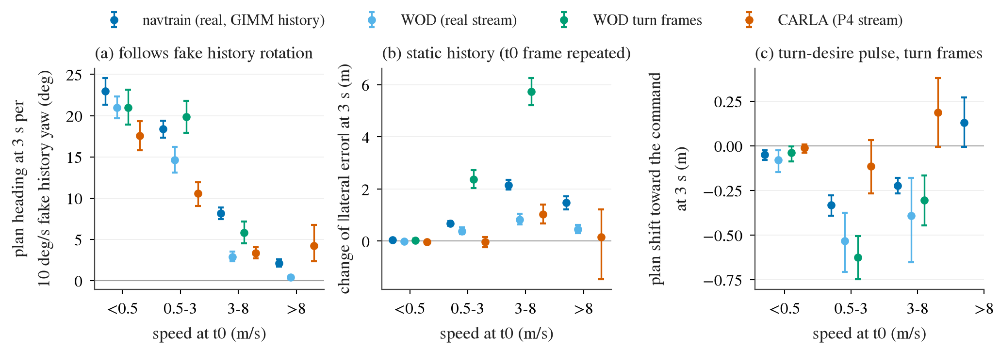

# op_common_cause: is openpilot's low-speed failure one cause?

status: live
decisions: 92, 93
index: Plan follows fake history yaw, 3-7x more at low speed, real and CARLA alike

**Question.** Is Cinque's plan unreliable at (low speed) x (short / abnormal history) x (no command), with the same sign
and size on real frames (navtrain, WOD) and CARLA frames, so that layer-3 pairs can be tuned jointly?

**Conclusion.** Partly. Fake history yaw (10 deg/s over 1.5 s) turns the 3 s plan heading by 18-23 deg at stop and
11-20 deg at 0.5-3 m/s, but only 3-8 deg at 3-8 m/s, in all domains (pooled moving: nav 11.7, WOD 5.4, CARLA 6.7 deg;
"consistent" in every pair). Static / dropped history hurts at mid speed, not low. The turn desire reaches the model but
makes real-data plans worse (+0.23 to +0.33 m at 3 s) and does nothing on CARLA. Joint tuning of "same image, different
history -> same plan" has a basis; the command pairing does not yet (S same sign but 3-5x size gap, flips at low speed).

**Next.** Write the history-invariance pair for layer 3 on both domains; check whether rotation-following explains the
HUGSIM low-speed spins (closed loop); the desire channel needs its own design before any command pairing.

**Read more.** [plans/2026-10-03-common-cause-prereg.md](plans/2026-10-03-common-cause-prereg.md) (factorial, metrics and
the cross-domain rule, fixed before the runs); [results/effects.md](results/effects.md) (every effect x domain x speed bin,
mean [95% cluster-bootstrap CI]); [results/verdicts.md](results/verdicts.md) (pre-registered verdict per effect, bin and
domain pair); [results/checks.md](results/checks.md) (manipulation checks).

What to look at: (a) the plan follows a fake history rotation, and the dependence on speed has the same shape in all four
domains; (b) a static history (t0 frame repeated) hurts lateral accuracy most at 3-8 m/s, not at low speed; (c) the
correct-direction turn-desire pulse moves real-data plans away from the command and leaves CARLA plans unchanged.

## Design (summary of the pre-registration)

Frozen Cinque (op_lb TensorRT backend), zero state per run, 20 Hz steps, plan read at t0, rear-axle frame, metrics at 3 s.
History variants: `normal` (1.5 s), `long` (4.8 s, streams only), `repeat` (t0 frame for 1.5 s), `single` (t0 frame only),
`rotL` / `rotR` (every history frame re-rendered with `op_interp` warp as if the ego had yawed +-10 deg/s). Desire on
left / right-command frames: `off`, `pulse` (turn from -1.0 s), `sustained` (rising edge every step), `lc` (laneChange),
`wrong` (opposite turn). Speed bins stop < 0.5, low 0.5-3, mid 3-8, high > 8 m/s. Cluster bootstrap over logs / sequences /
routes. Verdict per pair: both CIs exclude 0 with the same sign and a ratio in [0.5, 2] = consistent.

| domain | frames | n | clusters | history source | expert |
|:--|:--|--:|--:|:--|:--|
| nav | navtrain, op_lb 3 000-token pool | 1 907 | 697 logs | 2 Hz keys + GIMM (leaderboard protocol) | human |
| wod | WOD-E2E val, rater + extra sets | 1 436 | 479 seqs | true 5 Hz stream | human |
| wodt | WOD-E2E val, left / right intent (added) | 617 | 225 seqs | true 5 Hz stream | human |
| carla | P4 Bench2Drive recordings (`b2d/p4-carla-routes@v1`) | 1 738 | 151 routes | true 5 Hz stream | BehaviorAgent |

## Results

E1, history rotation: G = half the 3 s plan-heading difference between `rotL` and `rotR` (deg, mean [95% CI]).

| G (deg) | stop | low | mid | low - mid |
|:--|:--|:--|:--|:--|
| nav | 22.95 [21.34, 24.54] | 18.37 [17.33, 19.39] | 8.15 [7.46, 8.86] | 10.22 [9.04, 11.44] |
| wod | 20.98 [19.66, 22.30] | 14.61 [13.09, 16.21] | 2.90 [2.32, 3.51] | 11.72 [10.13, 13.33] |
| wodt | 20.98 [18.91, 23.16] | 19.84 [17.94, 21.80] | 5.80 [4.50, 7.15] | 14.05 [11.73, 16.42] |
| carla | 17.55 [15.78, 19.32] | 10.59 [9.02, 11.90] | 3.33 [2.68, 4.04] | 7.27 [5.72, 8.61] |

At stop / low speed the plan heading at 3 s exceeds the 15 deg injected over the history: the model extrapolates the
history yaw rate.

E2-E4, other history changes (moving frames, change of |lateral error| at 3 s, m; x = longitudinal plan change at 3 s):

| | nav | wod | carla |
|:--|:--|:--|:--|
| repeat - normal | +1.35 [1.25, 1.45] | +0.60 [0.50, 0.70] | +0.46 [0.23, 0.74] |
| repeat, low - mid | -1.48 [-1.68, -1.28] | -0.44 [-0.69, -0.20] | -1.06 [-1.48, -0.66] |
| repeat, x | -10.2 | -16.7 | -12.2 |
| single - normal | +1.04 [0.96, 1.13] | +0.48 [0.39, 0.56] | +0.30 [0.11, 0.52] |
| single, x (stop bin) | +13.3 | +11.6 | +21.5 |
| normal (1.5 s) - long (4.8 s) | n/a | +0.03 [0.02, 0.04] | -0.02 [-0.05, 0.01] |

A static history reads as "stopped" (shorter plan), no history reads as "drive off" (longer plan); history beyond 1.5 s
moves the plan by a median 2.5 cm.

E5, desire on turn-command frames (moving, m at 3 s):

| | nav | wod | wodt | carla |
|:--|:--|:--|:--|:--|
| d lat err, pulse - off | +0.23 [0.20, 0.27] | +0.31 [0.17, 0.48] | +0.33 [0.24, 0.43] | -0.07 [-0.19, 0.06] |
| d lat err, sustained - off | +0.37 [0.33, 0.41] | +0.73 [0.53, 0.95] | +0.87 [0.74, 0.99] | +0.47 [0.27, 0.68] |
| d lat err, laneChange - off | +0.13 [0.10, 0.15] | +0.14 [0.04, 0.25] | +0.14 [0.09, 0.18] | +0.06 [-0.01, 0.14] |
| S: correct - wrong pulse, toward command | +0.22 [0.13, 0.31] | +0.21 [0.03, 0.40] | +0.39 [0.25, 0.54] | +1.08 [0.90, 1.28] |
| correct pulse - off, toward command | -0.26 [-0.29, -0.22] | -0.43 [-0.59, -0.30] | -0.44 [-0.54, -0.35] | +0.06 [-0.06, 0.19] |

At low speed S flips between domains (nav -0.25, wod -0.19, wodt -0.21 vs carla +0.15 m). A held desire damps the
rotation-following at low speed in all domains (low - mid change of G: nav -6.7, wod -7.4, carla -4.0 deg). On straight
frames the unperturbed plan has no lateral bias at stop / low speed (|mean| <= 0.06 m, CIs include 0).

Pre-registered verdicts: history pairing joint-tunable **yes** (E1 consistent in all pairs; E2 same sign nav-carla, ratio
2.9, consistent wod-carla). Command pairing **yes by S only** (same sign, size gap 3-5x; E5 accuracy effect is "one domain
only"). Common cause **partly**: G > 0 and stronger at low speed in both domains; desire does not reduce error in either.

Checks: nav unperturbed rerun equals op_lb's cached plans (max 0.0 m); rotation sign verified (+2 deg destination yaw moves
content +34 px; 25 / 30 real CARLA turns aligned best by the true yaw); every image variant changes the t0 input and
`hidden_state`; desire tensor 1 rising edge (pulse) / 21 (sustained) in every sample.

Deviations: `wodt` added after the first interim table (rater + extra had ~110 turn frames); the first chain was killed by
memory (8 x ~27 GB openpilot processes in a 276 GiB cgroup) and resumed from per-shard checkpoints with at most 4
processes; the first interim "toward command" sign was inverted and fixed before the final tables.

Limits: one model, one fake yaw rate, one desire onset; nav history is GIMM-synthesized; CARLA expert is BehaviorAgent, so
lateral-error levels are not comparable across domains, only signs and ratios; open loop only.

<!-- files:begin -->
## Files

- `2026-10-03-common-cause-prereg.md` (plans): 共性假设检验（lane B，2026-10-03 夜）：预登记
- `cc_prep.py` (scripts): freeze the per-domain sample tables
- `cc_run.py` (scripts): Common-cause factorial runner
- `cc_report.py` (scripts): per-sample metrics, effects with …
- `cc_chain.sh` (scripts): shards on one card, at most 4 openpilot …
- `cc_figs.py` (scripts): the three primary effects by speed bin …
- `effects.md` (results): 
- `verdicts.md` (results): 
- `checks.md` (results): 
- `primary_effects.png` (figs): 

[results/](results/) 11 result files · [figs/](figs/) 2 figures · [plans/](plans/) 1 live plans · [scripts/](scripts/) 8 entry points
<!-- files:end -->
