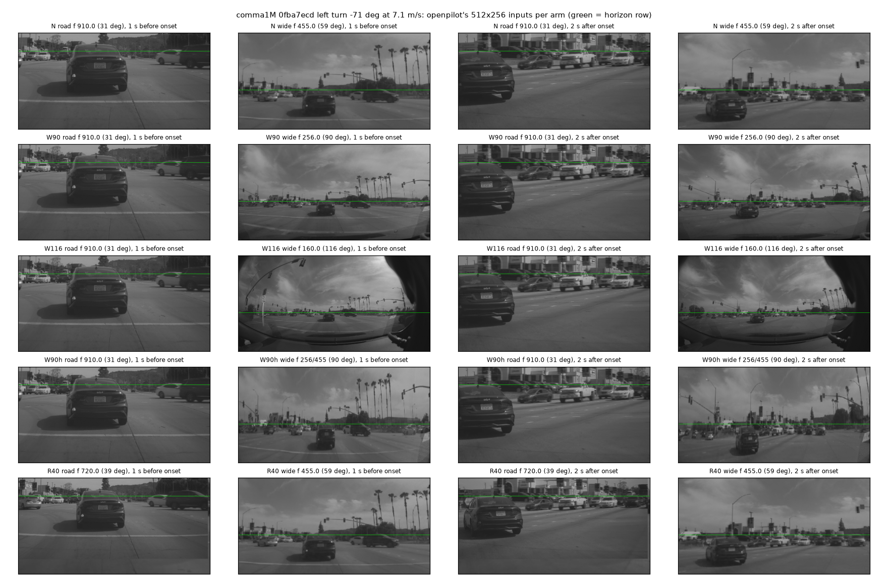

# op_fov pilot: a wider field of view does not help shipped Cinque on real turns (pre-registered early stop)

Written 2026-10-05. Pre-registration: [../plans/2026-10-05-fov-prereg.md](../plans/2026-10-05-fov-prereg.md) (written before any model
output was seen). Code: `scripts/fov_replay.py` (scan, run), `scripts/fov_report.py` (metrics, table), `scripts/fov_fig.py`.
Data: comma1M, the only local real data from openpilot's own rig (comma 3/3X wide camera ~119 deg, native 1.22 m height). Split
`comma1m/fov-pilot@v1:251572ae8695`: 8 turns (4 left, 4 right; heading change 67-181 deg at 3.8-8.2 m/s) + 4 straights, 12 segments.
Shipped Cinque, unchanged weights, CUDA onnxruntime, every 20 Hz frame, zero state + 6 s warm-up, no desire. Run dirs on the box:
`$DATA_DIR/runs/op_fov/{pilot,pilot-frz}/`, per-window replays `$DATA_DIR/runs/op_fov/windows{,_frz}/`. Wall time 96 s + 50 s.

## Inputs

What to look at: one left turn (71 deg, 7.1 m/s), 1 s before the turn starts and 2 s into it. Rows are arms, columns road / wide
frame as the model receives them (luma; green = the horizon row the model expects). In N (shipped) the wide frame already shows the
cross street; W90 and W90h show the whole intersection, W116 reaches the edge of the lens' image circle (dark vignette ring, part of
the camera housing at the right edge). The horizon stays on row 151.8 in every arm (principal point unchanged). R40's road frame is
wider and its bottom rows come from the wide camera (seam visible bottom right).

The N arm is bit-identical to the shipped warp (`frames.Warper`, checked on 3 frames).

## Result (pilot, 8 turns / 4 straights; diff = arm - N per window, 95% cluster bootstrap over segments)

| arm (wide HFOV) | dA_act (primary) | d lead s | dA_plan | dH2 (plan heading 2 s) | straight lane width ratio | straight plan speed ratio | straight ADE ratio |
|---|---|---|---|---|---|---|---|
| W90 (90 deg) | -0.005 [-0.022, +0.015] | -0.15 [-0.31, -0.02] | -0.010 [-0.017, -0.003] | -0.039 [-0.050, -0.027] | 1.001 | 1.001 | 1.00 [0.94, 1.10] |
| W116 (116 deg) | -0.033 [-0.071, +0.010] | -0.23 [-0.39, -0.07] | -0.012 [-0.021, -0.003] | -0.042 [-0.060, -0.022] | 0.997 | 1.007 | 1.11 [0.91, 1.41] |
| W90h (90 deg across, rows as shipped) | -0.032 [-0.056, -0.010] | -0.19 [-0.33, -0.06] | -0.019 [-0.026, -0.012] | -0.047 [-0.061, -0.034] | 0.993 | 1.000 | 1.02 [0.92, 1.14] |
| R40 (road 39 deg) | -0.032 [-0.067, +0.004] | -0.03 [-0.16, +0.08] | **-0.151** [-0.192, -0.094] | -0.120 [-0.153, -0.090] | 1.000 | **1.224** [1.208, 1.241] | **8.66** [4.10, 13.2] |
| Wfrz (post-hoc: wide frame frozen) | -0.035 [-0.067, -0.007] | -0.22 [-0.51, +0.02] | -0.006 [-0.014, +0.001] | +0.002 [-0.016, +0.024] | 0.998 | 1.004 | 1.09 [0.94, 1.28] |

Shipped (N) levels on these 8 turns: A_act 0.889 (per window 0.59-1.04; the 181 deg U-turn is the 0.59), A_plan 1.040, H2 0.974,
lead +0.16 s; on straights plan speed / logged 1.01, lane width at 10 m 2.94 m. Full tables: `pilot_table.md`, `pilot_frz_table.md`;
per window x arm: `metrics_pilot.csv`, `metrics_pilot_frz.csv`.

## Reading

- **Pre-registered early stop: met.** All three wide arms have dA_act <= 0 (-0.005 to -0.033) and d lead <= +0.1 s (-0.15 to -0.23 s:
  the action reaches 0.3 of the turn's peak curvature later, not earlier). By the plan the full set (72 windows) is not run. Per window
  (`metrics_pilot.csv`) W90 A_act is within +-0.05 of N in 7/8 turns (largest +0.052).
- **Guardrails hold for the wide arms**: lane width (0.993-1.001), plan speed (1.000-1.007) and straight ADE (1.00-1.11) barely move.
  Widening the wide frame does not shift scale - and does not change the turn either.
- **Why (post-hoc diagnostic, not pre-registered):** freezing the wide frame at a still image from 6+ s earlier (it never shows the
  turn) changes A_act by -0.035 and the plan by < 0.01, the same size as any FOV change. In real turns the shipped Cinque's lateral
  output comes from the road camera and its own state; the wide frame's content is close to irrelevant. A wider wide view cannot help
  zero-shot, whatever it shows.
- **The road camera carries scale**: R40 (road focal 910 -> 720) raises the straight-road plan speed by x1.22 (focal ratio 1.26),
  ADE x8.7, and makes the plan under-turn (A_plan 1.04 -> 0.89). This is the focal analogue of decision 104's height law. A fisheye
  in front of the road camera without recalibration would break scale; the wide camera's FOV is free to change.
- **No FOV problem on real turns to begin with**: with its own camera the shipped model already turns about right on these real turns
  (A_act 0.89, A_plan 1.04, on time). The B2D junction under-turn (decision 127: 0.30 of the needed curvature) is therefore not a
  missing-view problem; widening the view is not the fix there either.

## Caveats

- n = 8 turns / 4 straights from 12 segments; stopped by the pre-registered rule, so CIs are pilot-sized. Effects are small and
  consistent in sign, so the full set is unlikely to flip the conclusion; a > +0.10 gain would need a qualitatively different subset.
- comma1M drives are by humans (maybe with openpilot engaged); action vs what the car did, not a closed loop. Open-loop only: in closed
  loop a model that reaches a junction off-line could use the wide view differently (not tested; no CARLA by request).
- Projection: pinhole only (openpilot's own convention for the wide camera). The lens is not exactly pinhole at 116 deg (vignette ring);
  W90 / W90h are inside the clear image area.
- The lead metric is quantised at 0.05 s and one window (057552da) carries most of the d lead; the A metrics are the robust ones.
