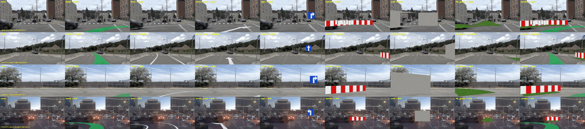
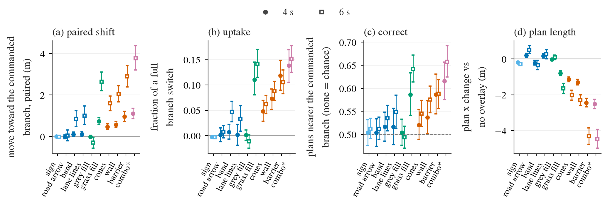
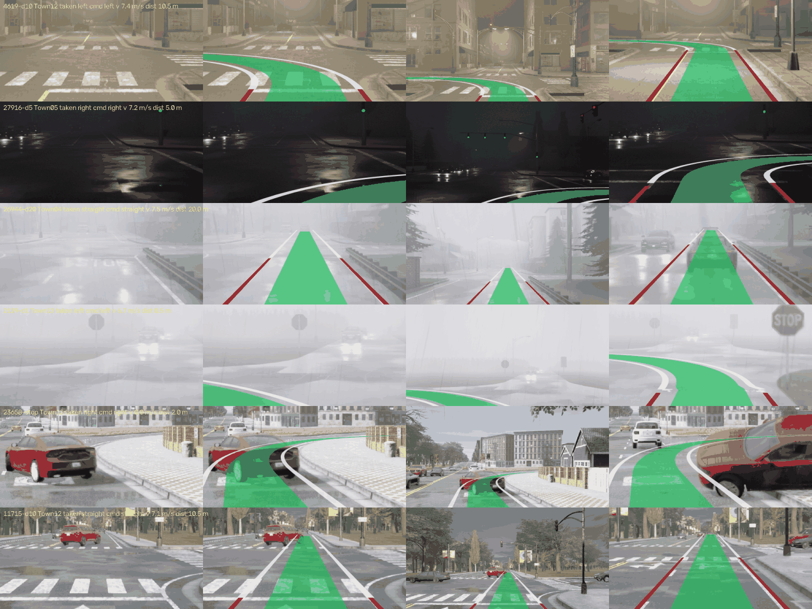

# op_img_cmd: route command drawn into openpilot's image

status: live
decisions: (pending)
index: Image route: zero-shot uptake <= 0.14; fine-tuned 0.54-0.64, drift 0.29 m

**Question.** Does openpilot (Cinque, frozen) follow a route command given through the image (painted route, blocked
other branches, a sign) instead of the desire input, zero-shot; and if only partly, can light fine-tuning teach it?

**Conclusion.** Zero-shot, partly. Blocking the other branches (barrier, grass fill, wall, cones) moves Cinque's
plan toward the commanded branch (barrier +0.96 m [0.72, 1.22] at 4 s, 12% of a full branch switch, plans nearer the
commanded branch 0.59 vs chance 0.50; combo of band + grass + barrier 14%, 0.62), and shortens it (-2.4 m: read as an
obstacle). Painted route band / lane lines give <= 5%, a road arrow, a sign and a grey fill nothing. The model avoids
non-drivable-looking regions; it does not read route semantics. Lane keeping on straight frames is unaffected.
A light fine-tune (port, stage 4 + plan pathway, 3 000 steps, 1 500 disjoint junction frames) teaches the two trained
drawings (band uptake 0.01 -> 0.54, correct 0.81; barrier 0.12 -> 0.64, correct 0.91), transfers little to unseen
drawings (cones +0.16, lines +0.09, sign 0, grass fill -0.05) and moves the no-overlay plan by a median 0.29 m (guard
0.10 m failed).

**Next.** CARLA junction set (recording); a drift-free fine-tune (larger, more varied distillation pool, more seeds).

What to look at: the wide model frame at t0 of four junction approaches, each overlay family with the command set to a
branch the driver did not take (the label says which); every history frame carries the same overlay, re-projected with
its own ego pose.

What to look at: (a) and (b) only the families that make the other branches look non-drivable move the plan; (c) even
the best family puts the plan nearer the commanded branch in 59-66% of cases (chance 50%); (d) blocks also shorten the
plan by 1-4 m. combo* was added after the first readout.

## Zero-shot result (navtrain)

Frozen Cinque (TRT), desire off, op_lb history protocol (4 keys + GIMM), n = 385 junction frames / 247 logs (decision
93 frames in op_lb's lb_navtrain pool, lane match <= 1.5 m) and 293 straight frames. 4 s, all speeds; 95% cluster
bootstrap by log. Delta = paired move toward the commanded branch (two commands on the same frame); uptake = that move
over twice the branch separation (1 = full switch) and correct = plan nearer the commanded branch, both on the fixed set
of 242 (frame, command) pairs where the branches are >= 1.5 m apart at the no-overlay plan point.

| family | Delta (m) | uptake | correct | plan x change (m) | pre-reg verdict |
|:--|:--|:--|:--|:--|:--|
| none | 0 | 0 | 0.50 [0.48, 0.53] | 0 | |
| sign | -0.00 [-0.01, 0.00] | -0.00 | 0.50 | -0.20 | none |
| arrow_road | -0.02 [-0.11, 0.08] | 0.00 | 0.50 | +0.19 | none |
| band | +0.10 [0.01, 0.22] | 0.01 [-0.01, 0.02] | 0.52 | -0.22 | partial |
| lines | +0.12 [0.01, 0.25] | 0.00 [-0.02, 0.02] | 0.52 | +0.17 | partial |
| fill_grey | -0.01 [-0.09, 0.06] | 0.00 | 0.50 | -0.03 | none |
| fill_grass | +0.74 [0.59, 0.91] | 0.11 [0.08, 0.15] | 0.59 [0.54, 0.63] | -0.80 | partial |
| cones | +0.47 [0.34, 0.62] | 0.05 [0.03, 0.07] | 0.52 | -1.14 | partial |
| wall | +0.57 [0.43, 0.72] | 0.07 [0.05, 0.09] | 0.54 | -1.30 | partial |
| barrier | +0.96 [0.72, 1.22] | 0.12 [0.09, 0.15] | 0.59 [0.54, 0.63] | -2.44 | partial |
| combo* | +1.10 [0.86, 1.36] | 0.14 [0.11, 0.17] | 0.62 [0.58, 0.66] | -2.51 | (post hoc) |

At 6 s the shifts grow (barrier +2.89 m, combo +3.76 m, band +0.85 m, lines +1.01 m) but uptake stays <= 0.15 and
correct <= 0.66. Moving frames (>= 3 m/s, n = 151) roughly double Delta (barrier +1.82 m, uptake 0.16); stopped frames
barely move. The band painted on every branch (band_all, no route information) shortens the plan by 0.07 m at 4 s.
Straight frames: band / lines / arrow / sign change the 3 s lateral error by <= +0.01 m. Full tables (2 / 3 / 4 / 6 s,
speed bins, per commanded class): [results/nav_effects.md](results/nav_effects.md).

Deviation: the pre-registered "correct" was counted where the commanded branch is >= 1.5 m from the others at the
adapted plan's own point; blocks shorten the plan, so that set changes with the family (barrier 0.83 on 125 pairs). The
table uses the fixed set decided on the no-overlay plan (the same pairs for every family); by it no family reaches the
"works" line (correct >= 0.75), so barrier moves from "works" to "partial". combo was added after the first readout.

**Read more.** [results/ft-q2.md](results/ft-q2.md) (Q2 fine-tune: arms, guards, side effects; pre-registration
[plans/2026-10-04-img-cmd-ft-prereg.md](plans/2026-10-04-img-cmd-ft-prereg.md)); [plans/2026-10-04-img-cmd-prereg.md](plans/2026-10-04-img-cmd-prereg.md) (samples, overlay families,
metrics and verdict rules, fixed before the full run).

## CARLA junction set

The 179 Bench2Drive junction traversals with a map alternative (op_common_cause `carla_traversals.json`), re-driven
by a privileged BehaviorAgent with the P4 Waymo-like 3-camera rig (`img_carla_prep.py`, `img_carla_agent.py`: stops
2 s after the junction exit, cameras every tick, every 4th set saved = 5 Hz). `img_carla_geom.py` picks t0 at 20 / 10
/ 5 / 1 m before the connector start (rear axle, along the approach) plus the last stopped frame within 8 m, and builds
nav.pkl-schema geometry from carla waypoints (left-handed world converted to x fwd / y left); `img_carla_frames.py`
renders 9 frames (t0 - 1.6 s ... t0) into packed model frames. 179 / 179 routes recorded, 699 samples, 696 pass
`img_overlay.valid` (left 436, right 212, straight 48; moving 601, low 32, stop 63). Model-frame camera: origin at the
front camera, (1.519, 0.026, 1.806) m from the ground point under the rear axle, axes = vehicle axes (no pitch); the
rear axle is 1.389 m behind the CARLA actor origin (bounding-box centre on the ground). Road height ahead is not
modelled by the overlay: |dz30| > 0.5 m in 44 samples (`dz15` / `dz30` keys).

What to look at: green band = approach + taken branch, white = taken-branch edges, red = approach lane edges; the red
lines should sit on the painted lane lines / curb before the junction and the band centred in the ego lane, in the t0
frame (columns 2-3) and in the oldest history frame drawn with its own pose (column 4). Overlays are not occluded by
vehicles (row 5). Many B2D weathers are fog / night.

<!-- files:begin -->
## Files

- `2026-10-04-img-cmd-prereg.md` (plans): 图像通道路线指令（lane IMG，2026-10-04）：预登记
- `img_overlay.py` (scripts): Route overlays drawn into openpilot's …
- `img_run.py` (scripts): Image-channel route command, zero-shot …
- `img_geom_nav.py` (scripts): Route geometry for the image-command …
- `img_sheet.py` (scripts): what the model sees

[results/](results/) 22 result files · [figs/](figs/) 3 figures · [plans/](plans/) 2 live plans · [scripts/](scripts/) 16 entry points
<!-- files:end -->
