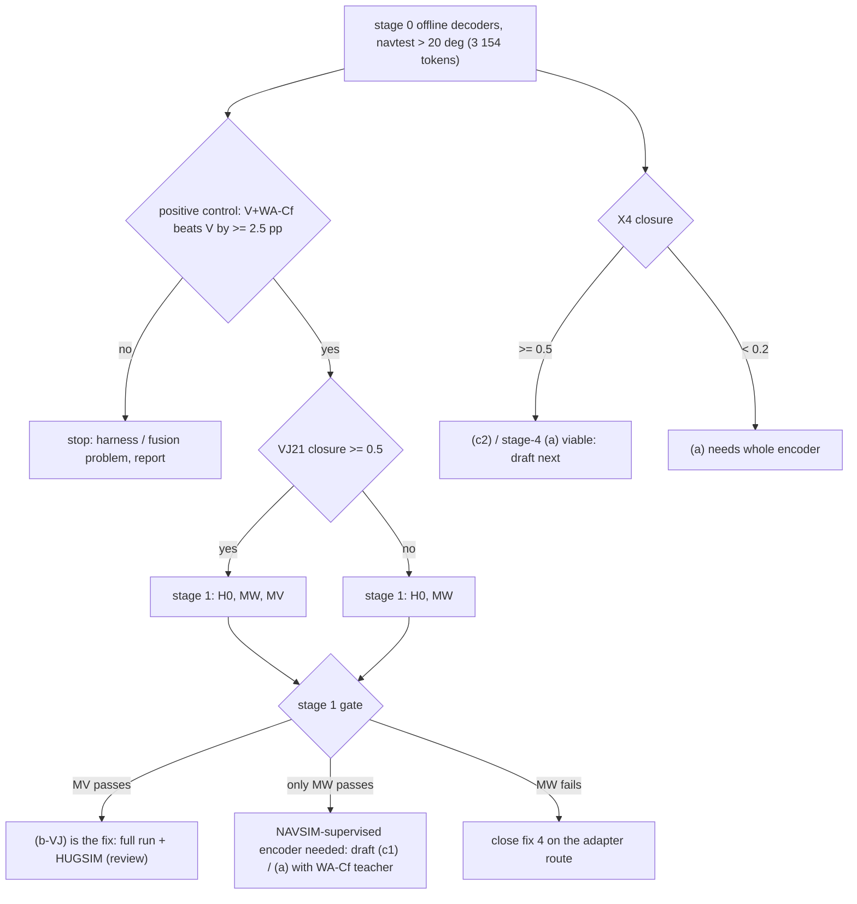

# op_parity：表征修法（four_dirs 第 4 项）设计评审稿与预登记（2026-10-07，未启动）

写于 2026-10-07。本 lane 只做设计：没有训练、没有 GPU 作业；只读了存档结果（`runs/op_probe/joint/decoders.parquet`、`sets/navtest_sets.npz`、
`cache/lb_navtest/tab.npz`，CPU）和 WA-JEPA 的代码与配置（`third_party/wajepa`）。依据：[results/four_dirs.md](../results/four_dirs.md)（第 153 条）、
[op_probe/results/dac-localize.md](../../op_probe/results/dac-localize.md) 与 [view-by-turn.md](../../op_probe/results/view-by-turn.md)（第 147 条）、
[results/unfreeze_pilot.md](../results/unfreeze_pilot.md)（第 145 条）、[results/hinge.md](../results/hinge.md)（第 148 条）、[results/turn_train.md](../results/turn_train.md)。
档位：HUGSIM + NAVSIM 一档、一个 driver（P2H）；B2D 不在范围内；WOD 另档，只在相关处提一句。

**结论先行。** 推荐 (b)：把 JEPA 前视 token 作为 P2H adapter 的额外 memory（Cinque encoder 及其全部 head 不动），并且同一个实验里放两种来源：
WA-JEPA 自己的前视 encoder token（WA-Cf，上限 / 阳性对照，存档里已有）和**原版 V-JEPA 2.1 ViT-L** 的冻结前视 token（VJ21，论点臂）。
决定性实验分两步：stage 0 是离线 thin decoder，在全部 3 154 个 navtest 转弯 token（> 20°）上跑，约 0.5 GPU·h + 约 1 h CPU；
stage 1 是 pilot（navtrain s2–s4，3 000 步，2 seed），约 1 GPU·h + 约 1 h CPU 打分。WA-Cf 在 s2–s4 和 navtest 上都已缓存，所以 stage 1 的 MW 臂不需要任何新的特征抽取。
理由放在第 5 节；预登记在第 6 节。

## 1. 已知什么，以及 58% 这个数该怎么读

| 量 | 值 | 出处 |
|:--|:--|:--|
| navtest DAC 失败率（stratified），同一 thin head（2 层 MLP，[stage, E]，hinge λ10） | Cinque 视觉 `view_39` 5.12% [3.98, 6.41]，WA 前视 Cf 3.41%，差 +1.71 pp [+0.69, +2.78] | 第 147 条 |
| 同上，按弯度分（Cf − V） | < 5° −0.68（n.s.），5–20° −0.36，20–45° −4.48 [−8.15, −0.85]，> 45° −5.28 [−9.05, −1.55] | view-by-turn |
| 本稿复算：> 20° 转弯 token 的 stratified 失败率（hinge λ10 decoder；n 721 个已打分，加权回 3 166） | E（只给 ego）21.6%，**V 10.9%**，**WA-Cf 6.0%**，WA-Ca 6.5%，P2-H 7.8%，WA-H 2.9% | 本稿，点估计 |
| 同上，> 45°（371 个已打分，加权回 1 584） | E 22.5%，V 12.3%，WA-Cf 7.0%，WA-H 3.3% | 本稿 |
| P2H 的 D1 ∪ D2 失败集（两 seed 合并 657 行，348 个 token，75 个 log）上 decoder 失败的份额 | V 52.4%（D1 58.2 / D2 46.3），WA-Cf 29.7%，**E 53.1%（D1 46.3）**，WA-H 19.8% | 本稿，按 four_dirs 的集合定义 |
| 道路 SDF 探针 R²（ridge / MLP） | Cinque 视觉 0.66 / 0.80，WA-Cf 0.78 / 0.89；在 P2 的失败 token 上，预测的余量偏乐观 +0.75 m（WA-Cf +0.38 m） | 第 147 条 |
| 解冻 pilot（只有模仿 + anchor，17 k token） | U1 +0.01，U1L +0.00（stage 4 权重变了 8.5%），U2 +0.11 [+0.01, +0.22]（权重只变 0.1%），1.40 m 虚拟相机 +0.17 | 第 145 条 |
| 转弯训练（采样、anchor、后段权重） | > 20° 差距的 closure 0.01–0.02；> 45° 的 DAC 失败 −0.03 pp | turn_train.md |

复算方法：`decoders.parquet` 里的 hinge10 行，权重与 `opb_report.strat` 相同（F / R / FF 权重 1，PP 按 11 494 / 1 500 加权）；
|Δψ| 取 `lb_navtest/tab.npz` 中 `fut[:, -1, 2]`，即日志 4 s 航向变化；没有做 bootstrap。

**58% / 46% 带有选择偏差，不能直接当作「表征可修份额」。** 这个集合本身就是按 P2H 失败选出来的。任何读 Cinque 特征的 decoder，
都会和 P2H 共享同一处表征错误（失败 token 上余量偏乐观 +0.75 m），所以它在这个集合上的失败率被抬高；对 WA-Cf 则相反，被压低。
只给 ego 的 decoder 在 D1 失败集上只挂 46%，比 V 的 58% 还低，就是这个偏差的直接证据（第 147 条已经指出 F / R 的通过率方向相反地有偏，stratified 率不受影响）。
所以本稿的判据一律用**总体率**：在全部 navtest 转弯 token 上的 DAC 失败率。在这个尺度上，表征差距是 V 10.9% 对 WA-Cf 6.0%，
约 4.9 pp，对应约 155 个 > 20° token，约占 navtest 的 1.3%。按 hinge 的实现率（decoder 层预测 −0.9 pp，policy 层实际 −0.50 pp，55%），
换到 policy 层约 −0.7 pp 的 navtest DAC 失败，EPDMS 约 +0.4 到 +0.6。这与 four_dirs 对第 4 项的估计（+0.3 到 +0.6）一致；它是上限，前提是新表征能达到 WA-Cf 的 decoder 水平。

### WA-Cf 是什么：它不是「V-JEPA 预训练」

查过 WA-JEPA 代码（`models/multiview_causal_future_jepa.py`、`configs/causal_future_jepa_mv_navsim.yaml`）：

- encoder 是 V-JEPA 2.1 ViT-L（`vjepa2_1_vit_large_384`，RoPE 插值到 256×512，tubelet 2）。先在 nuPlan 多视角视频上做 future-masked 预训练（stage 1），
  再在 navtrain 上**端到端微调**（`freeze_encoder_steps: 0`，encoder lr 1e-5，发布的 checkpoint 在 epoch 139 / step 112 840），损失是轨迹 flow matching 加 0.5 × JEPA 预测损失。
- 各视角**分别**过 encoder（`masks_x.repeat_interleave(num_cameras)`，视角间没有 attention）；`scene_projector` 是逐 token 的 LayerNorm + Linear（1024 → 512）。
  所以 Cf 确实只含前视信息。前视 FOV 也不是区分因素：两边都只看 CAM_F0；WA-Ca 并不比 Cf 好（6.5% 对 6.0%）；P3 的侧视相机加了也没用（view-by-turn）。
- 因此 Cinque-V 与 WA-Cf 的差距同时混着四件事：(1) 预训练目标与数据（comma 的车队监督 vs V-JEPA 2.1 通用 SSL）；(2) nuPlan 视频 SSL；
  (3) **在 navtrain 上以规划目标端到端训练 encoder，约 139 epoch**；(4) 输入（原生 CAM_F0 512×256 vs W 协议 warp 成 openpilot 的 road / wide 帧）。
  第 145 条测到的只是 (3) 的一个很小剂量：U2 只动了 0.1% 的权重，而且没有几何目标。
- 推断（未测）：comma 的视觉监督把路沿表示成两条以纵向距离为自变量的 polyline（openpilot 的 road-edge 输出），训练数据又以车道保持为主；
  急弯内侧路沿和路口拐角不在它的目标里。这与「差距随弯度单调扩大」（view-by-turn）相符，但仓库里没有直接检验。

## 2. 候选

### (a) 解冻 Cinque encoder + 稠密可行驶 SDF 辅助头

**改什么。** 在 P2H 配方上解冻 stage 4 + head（U1 式，读 `conv2d_36` 缓存），或者解冻整段 encoder（U2 式，像素在线渲染）。
在 `view_39` 的 32 个 token（4×8 网格）上接一个稠密 SDF 头，回归第 147 条那张 1 m 栅格（x −8..56 m，y ±24 m，3 072 格，裁剪 ±10 m），
另加 P2H 的足迹 hinge（λ10）。anchor 行改成只约束输出：anchor 的特征来自冻结的 encoder 副本，不再穿过正在训练的 encoder。
推理时只是换了权重，图结构不变，需要重新导出 vision ONNX 并重建 TensorRT。

**它为什么可能在第 145 条失败的地方奏效。** (1) 目标不同。第 145 条里 encoder 的梯度只来自 8 个位姿的模仿损失，要穿过 9 帧时序栈；
DAC 相关的误差只出现在约 4% 的 token 上，而且一半深度 < 0.3 m，归到路沿几何上的梯度极小。U1L 把 stage 4 改了 8.5%，分数一点没动，
说明容量不是限制，限制在目标；稠密 SDF 则在每个 token 上给 3 072 格的直接监督。(2) 第 145 条里没有 hinge（hinge 是第 148 条才加的），
plan pathway 没有理由去读路沿精度。(3) 第 145 条的 anchor 经过同一个 encoder 蒸馏到 shipped，等于把 encoder 往 comma 原表征上拉。
T2（转弯上去掉 anchor）只在冻结视觉下测过，对可训练的 encoder 没有测过。(4) 剂量：WA 对自己的 encoder 训了约 139 epoch；第 145 条 U2 是 3 000 步、lr 5e-6。

**仓库证据怎么预测增益。** 支持的一面：MLP 探针 R² 0.80（信息部分已在 token 里，只是 thin head 读不出精度）；WA 的消融说明 encoder 在规划目标下微调有效。
反对的一面：第 145 条四个臂全部为零。另外，如果路沿几何在 stage 1–3 已经被丢掉（与 comma 监督的推断一致），只训 stage 4 按数据处理不等式救不回来，
只能整段 encoder 训练（U2 规模，CPU 渲染受限）。缺的读数是 `conv2d_36`（stage 4 输入）在同一个 decoder 下的失败率：
如果它接近 V，stage-4 方案基本可以判死；如果它明显好于 V，就说明 head 的 2048 → 512 压缩丢掉了信息，那么 stage-4 方案和下面的 (c2) 都有余地。
我的先验：stage-4 + SDF 达到 decoder 层 closure 0.2–0.5，policy 层 navtest +0.1 到 +0.3；整段 encoder 可能更高，但未知。

**代价。** stage-4 全量：`conv2d_36` 缓存 103 k token × 1 MB = 105 GB（box 数据盘现在 93%，剩 379 GB），每 seed 约 1 h；pilot 在 s0–s1 上有现成缓存，每 seed 约 10–15 min。
整段 encoder：全量每 seed 约 7 h、26 个核做渲染（第 145 条的估计）。推理零额外开销。

**HUGSIM 风险：最高。** encoder 一改，9 帧上下文和 Cinque 的**每一个** head 都跟着变（lead、pose、road edge、action）。lead head 同时喂第 3 项的 lead margin 规则和 resume 规则，
HUGSIM 的 3DGS 渲染又在 navtrain 分布之外；第 145 条的 drift_off 只是 navtrain 帧上的代理指标，原生相机上的遗忘没有测过。

**论点风险：最低。** 这就是用户写下的 openpilot 适配路线 B / C（部分解冻 / LoRA + 蒸馏，或全量微调），能在 comma 设备上部署。
代价是地图标签的稠密监督只来自 NAVSIM；它只在训练时用，但「轻适配」的说法会被削弱。

**决定性实验。** 先看 stage 0 的 X4 臂（下文，几乎免费）；X4 的 closure ≥ 0.5 时，才做 stage-4 + SDF 辅助头的 R1：s0–s1 现成缓存，2 seed × 3 000 步。
训完重新抽 V'，再在同一个 decoder 下读 > 20° 的失败率，要求 closure ≥ 0.5 才进 policy pilot。本稿不为 (a) 预登记。

### (b) JEPA 前视 token 作为 adapter memory

**改什么。** `lib/parity_adapter.py` 本来就有 side memory 通道：(B, n_cam, n_t, 32, D) → LN + Linear → d=256，加 cam / time / slot embedding，
由 32 个 slot query 读出，得到一个零初始化的 bias，加到 9 个上下文帧的 hidden token 上，在闭环里经 ONNX 的 `intent_bias` 输入送进去。
新增一路 memory：当前时刻前视的 32 个 token（4×4 平均池化后的 4×8 网格），n_cam = n_t = 1。Cinque 的 encoder、policy ONNX 和所有 head 都不动。
来源分两种。WA-Cf：WA-JEPA 已经微调过的 encoder + projector，512 维。VJ21：原版 V-JEPA 2.1 ViT-L，冻结，1024 维，
走与 WA 完全相同的代码路径（同一个 encoder 类、预处理、RoPE 插值、池化），只换权重。两者之间的对比把上面的 (1) 与 (2)+(3) 分开了。

**仓库证据怎么预测增益。** WA-Cf：第 147 条的 thin head 只读 WA-Cf，就比整个 P2 少 1.0 pp 的 DAC 失败；> 20° 上 V 10.9% 对 6.0%。
这是所有选项里唯一已经量到的 encoder 层大幅差距。但 policy 能不能经 adapter 用上它，没有测过：P3 的侧视 token 走的就是同一个通道，结果为零；
不过那是 comma encoder 在分布外的侧视画面上的特征，没有证据表明它们本身更好。VJ21：仓库里没有它的 decoder 读数。
先验分两头：第 40 条在 WOD 上冻结的 V-JEPA 2 做 ridge 只有 −0.030，openpilot temporal 是 −0.294；但那是池化后的 clip 特征做轨迹回归，不是稠密的路面几何，
而 V-JEPA 2.1 正是为冻结的稠密特征设计的版本。文献里冻结的 JEPA 在 NAVSIM 上做到了 89–90：Auto-JEPA（冻结 V-JEPA 2，v2 89.1 EPDMS）、
PerceptDrive（冻结 SSL 视频 encoder，90.4）；两者都没复现，代码也未放出。WA 论文 Table 4(a) 在同样的 stage-2 训练下，V-JEPA 2 初始化 89.5，
MAE / SigLIP2 / DINOv3 是 83–84；但那些都是微调后的数字，不是冻结。

**代价。** WA-Cf：s2–s4（25.8 k）与 navtest（12 146）已缓存，每 token 32 KB；全量 navtrain 用现有的全模型抽取器剩 77 k token，按 4.3 token/s/卡算约 5 卡·h，
改成只跑前视 encoder 估计快约 10 倍（未测）。VJ21：stage 0 需要 38 k token，估计每卡 15–20 min，含下载约 1.2 GB；全量 103 k 约 0.5–1 卡·h；
缓存每 token 64 KB，全量 6.6 GB。推理：每个重规划步多一个 ViT-L/16（约 300 M 参数），输入前视 4 帧、0.5 s 步长、1 024 个 patch token。
在 RTX 6000D 上估计 20–50 ms（未测；WA-JEPA 四视角加 flow 头整步的中位数是 230 ms）。HUGSIM 按 4 Hz 重规划，不受影响；comma 设备上跑不动。

**HUGSIM 风险：中等。** Cinque 和它的 lead / action head 都不动，第 3 项和 resume 规则不受影响。新通道的输入来自 3DGS 渲染：
WA 的 encoder 在 HUGSIM 上已经证明能用（WA-JEPA 0.451），VJ21 未知。另外，adapter 通道会显著改变闭环行为：P2 的 ego 通道在 `spec` 下把 stuck 从 24 降到 0，
但 fg 碰撞从 1 升到 10，所以需要护栏。可能的正面效应：WA-JEPA 在同样的指令下，弯前 26 m 就减速，而 P2H 直到指令翻转才减速。
如果这个线索在 WA-Cf 里，它可能改善 HUGSIM D1 的快速入弯（推断）。

**论点风险：两种来源截然不同。** WA-Cf 是一个在 navtrain 上训了 139 epoch 的竞品 encoder；如果拿它当方法，等于「Cinque + 抄来的 SOTA 表征」，
是 trick，不是 trade，所以它只能做诊断上限。VJ21 符合「openpilot + JEPA」和 trade 的论点（工业级 / 通用 SSL 表征、冻结、轻适配），
而且让 policy 的输入落在 V-JEPA 的 latent 空间里：WA-JEPA / V-JEPA 2 predictor 预测出的 scene token 可以直接喂给 policy 的 memory 通道，
这正是 Dreamer 式世界模型闭环需要的接口；若走 (a)，世界模型得改去预测 Cinque 自己（被改过）的 token。
张力在于：用户写过对 openpilot 的适配不要「冻结特征 + head」，而且它不能上车。这里 openpilot 的 policy pathway 仍在微调，JEPA 只作为并列的 encoder；
若之后要求能部署到设备上，就转到 (c1) 蒸馏。

**决定性实验。** 第 6 节的预登记：stage 0 离线，stage 1 pilot。

### (c) 仓库证据或文献里更好的选项

- **(c1) 把 JEPA token 蒸馏进 Cinque encoder。** 在 (a) 的训练里加一个逐 token 回归目标：`view_39` 经一个线性映射，回归教师的 4×8 token（WA-Cf 或 VJ21，cosine + L2），
  可以和 SDF 辅助头叠加。推理零额外开销，能上设备；论点上是「openpilot 学生、JEPA 教师」。它比 (a) 的纯 SDF 目标更丰富，因为教师 token 里就装着那 65% / 76% 的通过率。
  代价同 (a)，外加教师缓存。**它的价值完全取决于 stage 1 的 MW / MV 读数**：如果连把教师 token 直接喂进 policy 都没用，蒸馏进 encoder 更不会有用。所以 (c1) 排在 (b) 之后，是 (b) 成功之后的部署形态。
- **(c2) Cinque 自己 head 之前的特征作为 memory。** 把 `conv2d_36`（t0 帧，2048×4×8）或 stage 3 的输出（降采样前，空间分辨率更高）作为 adapter memory。
  不加模型，vision ONNX 多导出一个中间输出即可（该张量本来就算了）。没有现成证据；stage 0 的 X4 臂用约 10 min GPU 就能判定。
  如果 X4 的 closure ≥ 0.5，它在代价和论点上都优于 (b)，因为整个 driver 还是纯 openpilot。
- **放弃：** 深度 / 占用 / 3D 基础模型（DA3、VGGT、MapAnything）的 token 作为 memory。理由：可行驶区域是语义加几何（路沿与路面几乎等高），
  仓库里没有任何证据，还要第三个模型；Drive-JEPA encoder（V-JEPA 2 + 330 h 驾驶 SSL，含 OpenScene，CC0）只作为 stage 0 的可选报告臂，
  因为它的 SSL 数据可能含 navtest 的 log；换更高的输入分辨率或原生 CAM_F0 喂 Cinque：第 145 条的 V 臂与 view-by-turn 都不支持视角 / 几何是主因。

## 3. 对比

| | (a) 解冻 + SDF 辅助头 | (b-WA) WA-Cf memory | (b-VJ) V-JEPA 2.1 memory | (c1) 蒸馏 | (c2) X4 memory |
|:--|:--|:--|:--|:--|:--|
| 改动 | Cinque encoder 权重 | 新 memory 通道 | 新 memory 通道 | Cinque encoder 权重 | 新 memory 通道（Cinque 内部特征） |
| encoder 层证据 | 未测（第 145 条 policy 层为零） | > 20° 10.9 → 6.0%（已测） | 未测 | 等于教师的读数 | 未测 |
| navtest 预估 | +0.1 到 +0.3（stage 4） | +0.3 到 +0.6（上限） | 0 到 +0.6 | ≤ 教师 | 0 到 +0.3 |
| 决定性实验代价 | stage 0 X4 + R1 约 1.5 GPU·h | stage 1 约 0.3 GPU·h，零抽取 | stage 0 + 1 约 1 GPU·h | 先等 (b) | stage 0 约 0.2 GPU·h |
| 全量代价 | 105 GB 缓存 + 每 seed 1 h（stage 4），或每 seed 7 h（整段） | 约 5 卡·h 抽取（或约 0.5）+ 训练 | 约 1 卡·h 抽取 + 训练 | 同 (a) + 教师缓存 | 13 GB 缓存 + 训练 |
| 推理开销 | 0 | ViT-L，估计 20–50 ms / 步 | ViT-L，估计 20–50 ms / 步 | 0 | 0 |
| HUGSIM 风险 | 高（所有 head 漂移，lead / resume 依赖） | 中（WA 在 HUGSIM 上已证明能用） | 中（渲染域未知） | 高（同 (a)） | 低到中 |
| 论点 | 契合（B / C 路线，能上车） | 冲突（竞品的 NAVSIM encoder），只做诊断 | 契合（openpilot + JEPA，trade，WM 接口）；不能上车 | 契合，能上车 | 契合（纯 openpilot） |

*读图：stage 0 决定 stage 1 跑哪几个臂，并顺带给出 (a) / (c2) 的信息上限；stage 1 的 MW 是所有表征修法的共同前提。如果更好的 token 直接喂进 policy 都推不动 P2H，(a) 和 (c1) 也不会推得动。*

## 4. 推荐：(b)，WA-Cf 与 VJ21 两个来源同时跑

1. **它是整条表征线的最便宜证伪。** 这五个选项共享一个没测过的前提：encoder 层更好的路面几何能经过 P2H 的 policy pathway 变成更少的转弯 DAC 失败。
   MW（WA-Cf memory）用的是已经量到的最好的前视表征，而且零抽取成本（s2–s4 和 navtest 都已缓存），约 0.3 GPU·h 就能回答这个前提。
   MW 为负，(a)、(c1)、(c2) 都失去依据，第 4 项关闭，这比任何一个 encoder 训练方案的 pilot 都便宜一个量级。
2. **它把归因与修法放在同一个实验里。** WA-Cf 与 VJ21 架构、预处理、池化完全一致，只差权重，所以 MV / MW 之比直接回答「差距来自通用 JEPA 预训练（trade），
   还是来自 nuPlan SSL + navtrain 端到端监督」。前者 (b-VJ) 就是方法；后者说明需要 NAVSIM 监督的表征，下一步是 (c1) / (a)，并用 WA-Cf 作教师。
3. **在 HUGSIM 风险上它优于 (a)：** Cinque 的 encoder 和 head 原样，第 3 项（lead margin）与 resume 规则不受影响；WA 的 encoder 在 HUGSIM 上已经证明能用。
4. **它与论点的关系最清楚：** VJ21 成功就是「openpilot + 冻结 JEPA，轻适配」，并且直接给世界模型闭环提供 latent 接口；WA-Cf 只作诊断上限，不当方法报告。

不推荐先做 (a)：在它所需的前提（MW）和信息上限（X4）都没有读数之前，它是最贵、HUGSIM 风险最高的选项，而且它最接近的对照（第 145 条）是四个零。
X4 臂放进 stage 0，几乎不增加成本，(a) / (c2) 的下一步因此有了依据。

## 5. 与其他 lane 的关系

- 第 2 项 replay hinge 修的是 head 目标那约 40%（内侧切角、仅回放擦边），与本线互补，不可相加（两者都作用在 D1 / D2 的失败 token 上）。stage 1 的对照 H0 是 P2H 的 pilot 配方，不含 replay hinge，两条线各自独立判定。
- 第 1 项 agent hinge 若先成为默认配方，本线 stage 1 的 H0 / MW / MV 统一换成新配方；阈值不变。
- four_dirs 待办里的 ego 历史换匀速检查（P2H 的路口减速靠的是 ego 历史还是视觉），决定 HUGSIM D1 是不是表征问题；它和本线的 stage 0 次要读数（路口前瞻探针）一起读。

## 6. 预登记（阈值在任何读数之前写定；结果栏留空）

### 6.0 共同设定

- driver：P2H 配方（op_parity P2 + drivable SDF hinge λ10，W 帧，视觉冻结，ego / pose / command adapter，anchor 行 0.25），见 `plans/2026-10-06-hinge-prereg.md`。
- 训练 token：navtrain_full s2–s4 去掉 `navsim/op-parity-full-dev` 的 log，与 `opb_probe.train_tokens(False)` 完全相同（25.3 k）。
  注册为 `navsim/op-parity-s234-train` v1（`jevdrive.data.splits`），在 `Run` 里 `run.use_split`；dev = op-parity-full-dev ∩ s2–s4；test = navtest。
- 转弯总体 **T20**：navtest 中日志 4 s 航向变化 |Δψ| > 20° 的 3 154 个 token；**T45**：> 45°，1 517 个；**S5**：< 5°，作直行护栏。
- 统计：同 token 配对，按 136 个 navtest log 做聚类 bootstrap，B 4 000，95% CI；seed 取均值。
- 一切作业经 GPU 池（`python -m jevdrive.cl submit`），用 `--after` 串起来；navtest 打分走 `python -m jevdrive.bench`；长于 1 min 的作业放进 tmux `jev`，有 log / events / tb。

### 6.1 Stage 0：离线 encoder 层 decoder（不训练任何 driver）

**特征来源**（每个都用 [source, E] 输入同一个 decoder：`opb_probe decode`，2 层 MLP 1024，hinge λ10，余量 0.3 m，4 000 步，batch 512，seed 0）：

| 臂 | 特征 | 状态 |
|:--|:--|:--|
| E | 只给 ego（20 维） | 重训，作复现对照 |
| V | Cinque `view_39`（32×512） | 重训，作复现对照 |
| WA | WA-Cf（32×512） | 已缓存，重训 |
| V+WA | `view_39` ⊕ WA-Cf | 新，阳性对照 |
| VJ21 | V-JEPA 2.1 ViT-L 前视，最新 tubelet，最后一层（encoder 自带的 final norm），16×32×1024 → 4×4 池化 → 32×1024 → 逐 token PCA 到 512（只在训练 token 上拟合） | 新抽取 |
| V+VJ21 | `view_39` ⊕ VJ21 | 新，主臂 |
| X4 | Cinque `conv2d_36` 的 t0 槽（2048×4×8 → 32×2048） | 新抽取（只存 t0，每 token 128 KB） |
| 可选，只报告 | VJ21 原始 1024 维；Drive-JEPA encoder 同路径 | 视下载情况 |

**VJ21 抽取：** 用 WA-JEPA 自己的 encoder 构造（`vjepa2_1_vit_large_384`、RoPE 插值、`minus_one_to_imagenet` 归一化、256×512、4 帧 2 Hz、tubelet 2），
加载原版 `vjepa2_1_vitl_dist_vitG_384.pt`（fbaipublicfiles 直链，MIT），不加载 stage-1 / WA 的 state dict；只跑 CAM_F0。请求的构造沿用 `opb_wajepa.requests`。
**等价检查（先跑，不过则停）：** 同一前视路径换上 WA 的权重和 projector，在 200 个 navtest token 上复现缓存的 WA-Cf，逐 token cosine 均值 ≥ 0.999。

**读数：** 每个 decoder 在 T20 全部 3 154 个 token 上的 devkit DAC 失败率（`opb_score.py`）；同时在 `eval_tokens.txt` 上算 stratified 全 navtest 失败率，用于复现检查。

**复现检查（不过则停，报告）：** 重训的 V / WA 在 eval token 上的 stratified 全 navtest 失败率与第 147 条相差 ≤ 0.3 pp（5.12 / 3.41），
在 T20 的 stratified 估计上与本稿第 1 节相差 ≤ 0.7 pp（10.9 / 6.0）。

**定义：** f(X) 为 T20 上的失败率；closure c(X) = (f(V) − f(X)) / (f(V) − f(V+WA))。

| 规则 | 阈值 | 结果 |
|:--|:--|:--|
| 阳性对照：f(V) − f(V+WA) | ≥ 2.5 pp，CI 下限 > 0；否则停，报告融合 / 管线问题 | |
| VJ21 通过（stage 1 跑 MV 臂） | c(V+VJ21) ≥ 0.5，f(V) − f(V+VJ21) 的 CI 下限 > 0，且 S5 上失败率不比 V 高 0.3 pp 以上 | |
| X4（不影响 stage 1，只决定 (a) / (c2) 的下一步） | c(X4) ≥ 0.5：(c2) 与 stage-4 (a) 可行，起草下一份预登记；c(X4) < 0.2：(a) 只能走整段 encoder；介于两者之间只描述 | |
| 归因（只报告） | c(VJ21 单独) 与 c(WA 单独) 并列；T45 上同样的量 | |

**次要（只报告，不设门）：** 路口前瞻探针。标签直接用 `runs/op_probe/joint/navtest_tokens.parquet` 已有的列：`junction_path` 为真且 `junction_t0` 为假，
即日志未来路径进入路口、当前位姿不在路口内。特征 [X, E]，logistic，在 navtest 上按 log 做 5 折 cross-fit，看 AUC，以 E 为基线。
另外报告 P2H D1 ∪ D2 失败集上的失败份额，注明有选择偏差。

**代价：** VJ21 抽取 38 k token（s2–s4 + navtest），估计每卡 15–20 min，加约 1.2 GB 下载；X4 t0 抽取 38 k token（`pp_unfreeze prep` 的 W 渲染路径，56 token/s，约 12 min，22 核）；
8 个 decoder，每个 1–2 min GPU；T20 打分约 25 k 次 `pdm_score` 调用，CPU 池上估计约 1 h。磁盘约 7.5 GB。GPU 合计约 0.5 h。

### 6.2 Stage 1：policy pilot

| 臂 | 设定 |
|:--|:--|
| H0 | P2H pilot 配方，6.0 节的 split，3 000 步 × batch 64，warmup 100，seed 0 / 1（因为换了 shard，是新的对照，不复用 HP-F） |
| MW | H0 + WA-Cf memory：adapter 的 side 通道，n_cam = n_t = 1，LN(512) + Linear(512 → 256)，自带 cam / time / slot embedding；每行以 p = 0.25 丢掉 memory（让「memory 关」在分布内） |
| MV | H0 + VJ21 memory（PCA-512，同 MW）；只有 stage 0 判 VJ21 通过才跑 |

其余与 H0 完全相同：同一个 init、同样的 hinge 标签、anchor 行（present = 0，整条 bias 为零，因此不受 memory 影响）。
代码：`pp_train.py` 加一个 `--mem wa_cf|vj21` 选项（Store 按 tab 的 names 对齐 memory npz），`pp_eval` / bench 的 navtest plan 导出把 memory 传进去。
navtest 的 memory 用缓存（WA-Cf 来自 bf16 批量前向；第 147 条已说明批内 flow 噪声只影响 plan，不影响 encoder 特征）。

**读数：** 全量 navtest（12 146），v2 EPDMS 及其子项；T20 / T45 / S5 的 DAC 失败率；NC + TTC 失败率；plan 速度比；dev drift_off（与第 145 条相同）。
另报告 MW / MV 在测试时把 memory 置零后的读数：它应回到 H0 附近，用来检验通道真的被用上了。

**早停（seed 0 小读，先跑 H0-s0 与 MW-s0，若有 MV 也同时跑 MV-s0）：** 若 MW-s0 − H0-s0 在 T20 上的 DAC 失败率降幅 < 0.4 pp，或 navtest EPDMS < 0，
则停止 MW；MV 若同时不过，整条线停，不跑 seed 1，并报告「第 4 项在 adapter 路线上关闭」。

**通过（2 seed 均值）：**

| 判据 | 阈值 | MW | MV |
|:--|:--|:--|:--|
| navtest EPDMS，臂 − H0 | ≥ +0.30，CI 下限 > 0 | | |
| T20 DAC 失败率，臂 − H0 | ≤ −1.0 pp，CI 上限 < 0 | | |
| 护栏：EP | ≥ −0.2 | | |
| 护栏：NC + TTC 失败率 | 上升 ≤ 0.2 pp | | |
| 护栏：S5 上的 EPDMS | ≥ −0.2 | | |
| 护栏：plan 速度比 / drift_off | 1.00 ± 5% / ≤ 0.10 m | | |
| 归因（只有 MV 通过时才有意义）：(MV − H0) / (MW − H0)，按 EPDMS | 报告；≥ 0.5 记为「通用 JEPA 预训练能拿到大部分」 | | |

**判读（写在结果之前）：**

- MV 通过：(b-VJ) 就是第 4 项的修法。下一步（需要 review）是全量（抽取全部 navtrain 以及 navhard stage 1 / 2 帧的 VJ21）+ stage 2。
- 只有 MW 通过：增益需要一个受 NAVSIM 监督的 encoder。不把 (b-WA) 当方法；起草 (c1) / (a)，以 WA-Cf 为教师，并依 stage 0 的 X4 决定是 stage 4 还是整段 encoder。
- MW 不过：更好的前视 token 经 adapter 也推不动 P2H。第 4 项在 adapter 路线上关闭，第 147 条的「encoder 份额」只在 decoder 层成立；(a) 不单独重开。
- MW 的 EPDMS 过了、T20 没过（或反过来）：只描述，不进 stage 2。

### 6.3 Stage 2：全量 + HUGSIM（声明在先，不由本稿启动，需 review）

前提：stage 1 有臂通过。全量 103 k token，2 seed；navtest、navhard G 帧、HUGSIM 64 `spec_plan_smooth`；另读 D1 的 5 个场景与 turn23。
工程：HUGSIM server 里加一个前视 encoder 进程（wajepa env），喂 0.5 s 步长的前视渲染，5 s 静止暖机期间的历史用暖机帧；
先测 batch-1 前向的延迟，并做等价检查：在 50 个存档 HUGSIM 帧上与离线抽取路径的 cosine ≥ 0.999。
护栏（固定）：HUGSIM 64 HD 臂 − P2H ≥ −0.02；fg 碰撞场景数增加 ≤ 3；stuck / spin 不增加；navhard G combined 臂 − P2H ≥ −0.5。
HUGSIM 上没有设成功判据：64 个场景的 CI 半宽约 ±0.08，统计力不够；D1 的入弯速度只描述。

### 6.4 结果

（空）

## 7. 限定与未决问题

- 本稿第 1 节的转弯失败率是点估计，T20 上只有 721 个已打分 token（PP 按比例放大）；stage 0 在全部 3 154 个上重测，所以门限用的是重测值，复现窗口为 ±0.7 pp。
- WA 的 stage-1 视频 SSL 用的是 nuPlan 多视角视频；如果其中含 navtest 的 log（navtest 取自 nuPlan test），WA-Cf 在 navtest 上的特征是「SSL 见过」的。这不影响 VJ21，但会抬高 MW 作为上限的读数。没有查证。
- VJ21 的冻结层取 encoder 最后一层；V-JEPA 2.1 的稠密特征可能在中间层更好。这里只预登记最后一层，其他层若做只能作为报告。
- 4×4 池化到 32 个 token，是为了与 Cinque 的 4×8 网格逐格对等（第 147 条的 Cf 也是这样做的）；对窄的路沿，池化可能偏不利，更细的 memory（例如 128 个 token）留到 stage 1 之后。
- 第 147 条的 decoder 训练在 P2 而非 P2H 的特征上；视觉 token 相同（冻结），所以 stage 0 不受影响；stage 1 以 P2H 为基线。
- HUGSIM D3b 的 lead 距离偏差（< 3 m 时多读 +1.95 m）出自 Cinque 的 lead head，本线不触及（(b) 不改 lead head）；它是不是表征问题，没有 decoder 层的检验。
- 推理延迟（20–50 ms）与只跑前视 encoder 的抽取速度（约快 10 倍）都是估计，stage 0 / 2 的工程步骤会实测。
- WOD 档：VJ21 是通用表征，按理可迁移；WA-Cf 是在 NAVSIM 上训的。本线不读 WOD。
